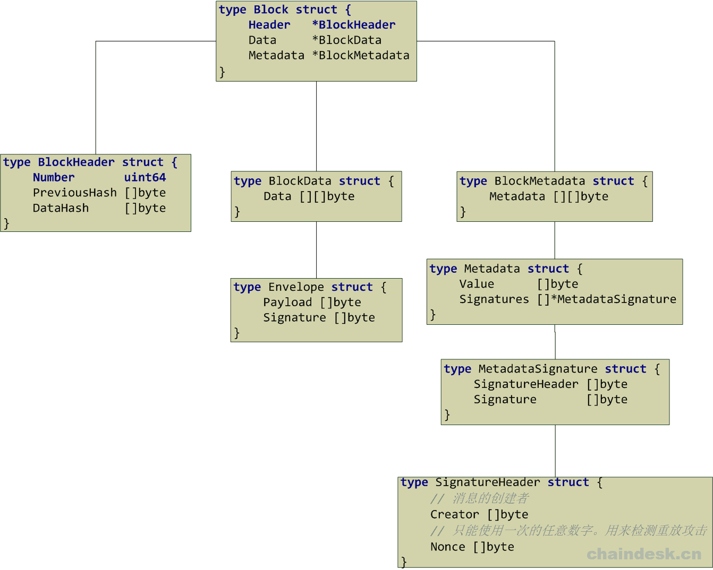
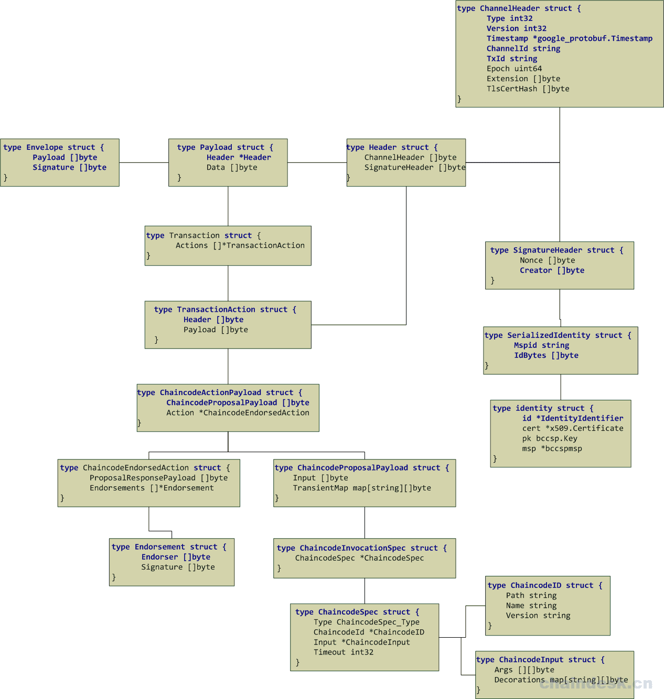

# 第八章 Hyperledger Fabric（V1.2）源码深度解析－使用 configtxgen 工具生成 GenesisBlock 配置文件过程

### 生成 genesis.block

configtxgen 命令解析完毕之后，接下来就可以进入对应的分支条件中理解各文件是如何被创建的。

下面我们来看一下生成初始区块的详细过程，在 hyperledger/fabric/common/tools/configtxgen/main 函数中，判断 outputBlock 参数是否为空，如果不为空，则说明用户需要生成 GenesisBlock 文件：

```go
if outputBlock != "" {
        if err := doOutputBlock(profileConfig, channelID, outputBlock); err != nil {
            logger.Fatalf("Error on outputBlock: %s", err)
        }
    } 
```

如果判断条件成立，则将概要配置信息的结构体对象，通道名称，文件保存路径及文件名称作为参数通过调用 doOutputBlock 函数，实现生成 GenesisBlock 文件，doOutputBlock 函数的实现源码如下：

```go
func doOutputBlock(config *genesisconfig.Profile, channelID string, outputBlock string) error {
    pgen := encoder.New(config)
    logger.Info("Generating genesis block")
    if config.Consortiums == nil {
        logger.Warning("Genesis block does not contain a consortiums group definition.  This block cannot be used for orderer bootstrap.")
    }
    genesisBlock := pgen.GenesisBlockForChannel(channelID)
    logger.Info("Writing genesis block")
    err := ioutil.WriteFile(outputBlock, utils.MarshalOrPanic(genesisBlock), 0644)
    if err != nil {
        return fmt.Errorf("Error writing genesis block: %s", err)
    }
    return nil
} 
```

首先通过调用 encoder.New(config)函数，将*genesisconfig.Profile 结构体作为参数传递给 encoder.New 函数，New 函数的作用就是创建一个用于生成 genesis 块的新引导程序，源码如下：

```go
func New(config *genesisconfig.Profile) *Bootstrapper {
    channelGroup, err := NewChannelGroup(config)
    if err != nil {
        logger.Panicf("Error creating channel group: %s", err)
    }
    return &Bootstrapper{
        channelGroup: channelGroup,
    }
} 
```

可以看到该函数最后返回一个*Bootstrapper 类型的结构体，Bootstrapper 结构体是一个围绕 NewChannelConfigGroup 的包装器，它可以生成 genesis 块。在 New 函数中，最主要的就是该函数中的第一行代码，通过调用 NewChannelGroup(config)函数来实现定义通道的相关配置，通过调用 addValue 函数定义了当前唯一有效的散列算法（bccsp.SHA256）及当前唯一有效的区块数据散列结构、Orderer 排序服务的位置配置信息，然后根据相关的配置信息调用对应的函数分别创建了 NewOrdererGroup、NewApplicationGroup、NewConsortiumsGroup。

> 如果配置文件中没有显式地指定 Policy，则调用 addImplicitMetaPolicyDefaults 函数添加默认的 Policy。

NewChannelGroup 函数位置在 hyperledger/fabric/common/tools/configtxgen/encoder/encoder.go 文件中，函数实现源码如下：

```go
// 解析者：Hanxiaodong
// QQ 群（专业 Fabric 交流群）：862733552
// NewChannelGroup 定义通道配置的根。它定义了基本的操作原则，如用于块的散列算法，以及 Orderer 服务的位置。
// 根据配置中是否设置了这些子元素，它将递归调用 NewOrdererGroup、newsyndictiumsgroup 和 NewApplicationGroup。
// 这个组的所有 mod_policy 值都设置为“Admins”，OrdererAddresses 值除外，该值设置为“/Channel/Orderer/Admins”。
func NewChannelGroup(conf *genesisconfig.Profile) (*cb.ConfigGroup, error) {
    if conf.Orderer == nil {
        return nil, errors.New("missing orderer config section")
    }
    // 创建 channel_group 信息包含的 Version、Groups、Values、Policies、 ModPolicy 的 ConfigGroup 对象
    channelGroup := cb.NewConfigGroup()
    if len(conf.Policies) == 0 {
        logger.Warningf("Default policy emission is deprecated, please include policy specificiations for the channel group in configtx.yaml")
        addImplicitMetaPolicyDefaults(channelGroup)
    } else {
        if err := addPolicies(channelGroup, conf.Policies, channelconfig.AdminsPolicyKey); err != nil {
            return nil, errors.Wrapf(err, "error adding policies to channel group")
        }
    }

    // 添加当前唯一有效的散列算法（bccsp.SHA256）
    addValue(channelGroup, channelconfig.HashingAlgorithmValue(), channelconfig.AdminsPolicyKey)
    // 添加当前唯一有效的区块数据散列结构
    addValue(channelGroup, channelconfig.BlockDataHashingStructureValue(), channelconfig.AdminsPolicyKey)
    // 添加 Orderer 服务的位置配置信息
    addValue(channelGroup, channelconfig.OrdererAddressesValue(conf.Orderer.Addresses), ordererAdminsPolicyName)

    if conf.Consortium != "" {
        addValue(channelGroup, channelconfig.ConsortiumValue(conf.Consortium), channelconfig.AdminsPolicyKey)
    }

    if len(conf.Capabilities) > 0 {
        addValue(channelGroup, channelconfig.CapabilitiesValue(conf.Capabilities), channelconfig.AdminsPolicyKey)
    }

    var err error
    // 创建配置文件中所需的 Orderer 组件信息
    channelGroup.Groups[channelconfig.OrdererGroupKey], err = NewOrdererGroup(conf.Orderer)
    if err != nil {
        return nil, errors.Wrap(err, "could not create orderer group")
    }

    if conf.Application != nil {
        // 默认的 configtx.yaml 文件中 TwoOrgsOrdererGenesis 部分没有指定 Application
        channelGroup.Groups[channelconfig.ApplicationGroupKey], err = NewApplicationGroup(conf.Application)
        if err != nil {
            return nil, errors.Wrap(err, "could not create application group")
        }
    }

    if conf.Consortiums != nil {
        // 创建配置文件中所需的联盟信息（payload/data/config/channel_group/groups/Consortiums 中所包含的内容）
        channelGroup.Groups[channelconfig.ConsortiumsGroupKey], err = NewConsortiumsGroup(conf.Consortiums)
        if err != nil {
            return nil, errors.Wrap(err, "could not create consortiums group")
        }
    }

    channelGroup.ModPolicy = channelconfig.AdminsPolicyKey
    return channelGroup, nil
} 
```

返回至 doOutputBlock 函数，通过判断 config.Consortiums 是否定义了联盟信息，如果没有定义联盟信息，则输出警告“Genesis 块没有包含联盟的定义。不能用于 Orderer 引导”

之后通过调用 genesisBlock := pgen.GenesisBlockForChannel(channelID)函数，根据给定的通道 ID 生成一个 genesis 块。生成的 Block（区块）包含如下的三项内容：

*   Header *BlockHeader
*   Data *BlockData
*   Metadata *BlockMetadata

该 Block 结构被定义在 hyperledger/fabric/protos/common/common.pb.go 文件中，具体结构如下图所示：



其中 Envelope 结构体的详细组成内容如下图所示：



GenesisBlockForChannel 函数实现源码如下：

```go
// 根据指定的通道 ID 生成一个 genesis 块
func (bs *Bootstrapper) GenesisBlockForChannel(channelID string) *cb.Block {
    block, err := genesis.NewFactoryImpl(bs.channelGroup).Block(channelID)
    if err != nil {
        logger.Panicf("Error creating genesis block from channel group: %s", err)
    }
    return block
} 
```

在 GenesisBlockForChannel 函数中，调用 hyperledger/fabric/common/genesis/genesis.go 文件中的 NewFactoryImpl 函数根据指定的 channelGroup 创建了一个新的 factory 结构体对象，该对象中包含一个 channelGroup 成员，该成员主要用于保存配置的分层数据结构，该结构体被定义在 hyperledger/fabric/protos/common/configtx.pb.go 文件中，源码如下：

```go
type ConfigGroup struct {
    Version   uint64                   `protobuf:"varint,1,opt,name=version" json:"version,omitempty"`
    Groups    map[string]*ConfigGroup  `protobuf:"bytes,2,rep,name=groups" json:"groups,omitempty" protobuf_key:"bytes,1,opt,name=key" protobuf_val:"bytes,2,opt,name=value"`
    Values    map[string]*ConfigValue  `protobuf:"bytes,3,rep,name=values" json:"values,omitempty" protobuf_key:"bytes,1,opt,name=key" protobuf_val:"bytes,2,opt,name=value"`
    Policies  map[string]*ConfigPolicy `protobuf:"bytes,4,rep,name=policies" json:"policies,omitempty" protobuf_key:"bytes,1,opt,name=key" protobuf_val:"bytes,2,opt,name=value"`
    ModPolicy string                   `protobuf:"bytes,5,opt,name=mod_policy,json=modPolicy" json:"mod_policy,omitempty"`
} 
```

得到 factory 对象之后，调用其 Block 函数，最终实现了构造并返回给定通道 ID 的 genesis 块。实现源码如下：

```go
type factory struct {
    channelGroup *cb.ConfigGroup
}

// 创建一个新的 Factory
func NewFactoryImpl(channelGroup *cb.ConfigGroup) Factory {
    return &factory{channelGroup: channelGroup}
}

// 构造并返回给定通道 ID 的 genesis 块
func (f *factory) Block(channelID string) (*cb.Block, error) {
    payloadChannelHeader := utils.MakeChannelHeader(cb.HeaderType_CONFIG, msgVersion, channelID, epoch)
    payloadSignatureHeader := utils.MakeSignatureHeader(nil, utils.CreateNonceOrPanic())
    utils.SetTxID(payloadChannelHeader, payloadSignatureHeader)
    payloadHeader := utils.MakePayloadHeader(payloadChannelHeader, payloadSignatureHeader)
    payload := &cb.Payload{Header: payloadHeader, Data: utils.MarshalOrPanic(&cb.ConfigEnvelope{Config: &cb.Config{ChannelGroup: f.channelGroup}})}
    envelope := &cb.Envelope{Payload: utils.MarshalOrPanic(payload), Signature: nil}

    block := cb.NewBlock(0, nil)
    block.Data = &cb.BlockData{Data: [][]byte{utils.MarshalOrPanic(envelope)}}
    block.Header.DataHash = block.Data.Hash()
    block.Metadata.Metadata[cb.BlockMetadataIndex_LAST_CONFIG] = utils.MarshalOrPanic(&cb.Metadata{
        Value: utils.MarshalOrPanic(&cb.LastConfig{Index: 0}),
    })
    return block, nil
} 
```

最后根据指定的 outputBlock 参数的值（目标文件所在路径及文件名称），将生成的 genesis 块内容利用 ioutil.WriteFile 函数写入到指定的文件中。

如果在执行过程中有错误产生，则通过 main 函数中定义的 defer 函数功能输出相应的提示信息并退出，如下源码所示：

```go
defer func() {
    if err := recover(); err != nil {
        if strings.Contains(fmt.Sprint(err), "Error reading configuration: Unsupported Config Type") {
            logger.Error("Could not find configtx.yaml. " +
            "Please make sure that FABRIC_CFG_PATH or --configPath is set to a path " +
                    "which contains configtx.yaml")
            os.Exit(1)
        }
        if strings.Contains(fmt.Sprint(err), "Could not find profile") {
            logger.Error(fmt.Sprint(err) + ". " +
                "Please make sure that FABRIC_CFG_PATH or --configPath is set to a path " +
                "which contains configtx.yaml with the specified profile")
            os.Exit(1)
        }
        logger.Panic(err)
    }
}() 
```