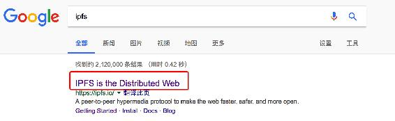
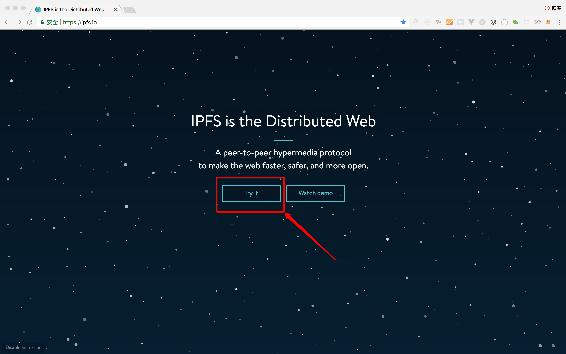
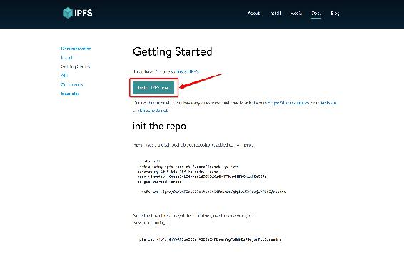
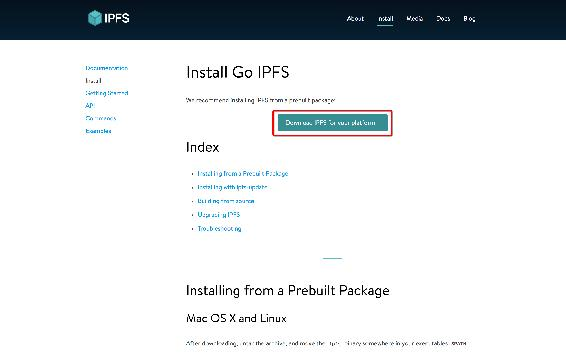
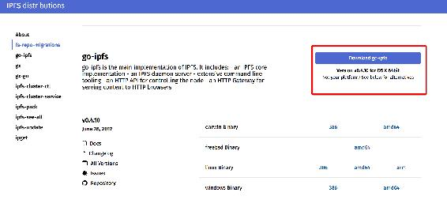
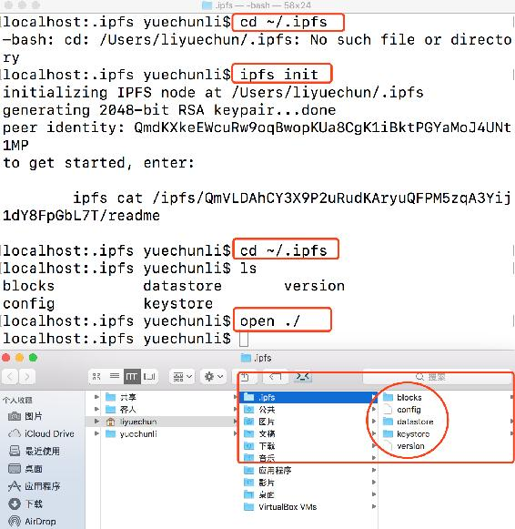
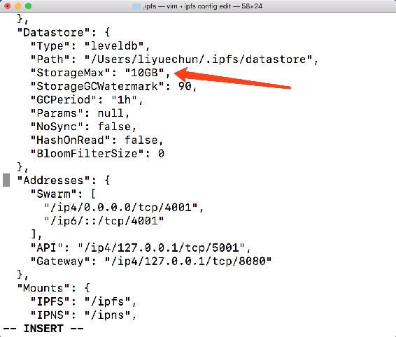
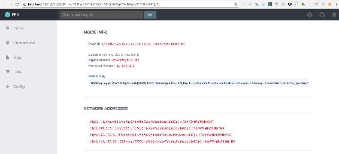

# 第一章 【IPFS + 区块链 系列】 入门篇 - IPFS 环境配置

## 目录

*   1\. IPFS 简介
*   2\. IPFS 本地环境安装
    *   2.1 下载 ipfs 压缩包
    *   2.2 安装
*   3\. 项目配置
    *   3.1 创建 ipfs 节点
    *   3.2 修改节点默认存储空间
    *   3.3 查看节点 id
    *   3.4 启动节点服务器
    *   3.5 跨域资源共享( CORS )配置
*   4\. 下篇预告

## 1\. IPFS 简介

`IPFS（InterPlanetary File System）`是一个点对点的分布式超媒体分发协议，它整合了过去几年最好的分布式系统思路，为所有人提供全球统一的可寻址空间，包括`Git`、自证明文件系统`SFS`、`BitTorrent`和`DHT`，同时也被认为是最有可能取代`HTTP`的新一代互联网协议。

`IPFS`用基于内容的寻址替代传统的基于域名的寻址，用户不需要关心服务器的位置，不用考虑文件存储的名字和路径。我们将一个文件放到`IPFS`节点中，将会得到基于其内容计算出的唯一加密哈希值。哈希值直接反映文件的内容，哪怕只修改`1`比特，哈希值也会完全不同。当`IPFS`被请求一个文件哈希时，它会使用一个分布式哈希表找到文件所在的节点，取回文件并验证文件数据。

IPFS 是通用目的的基础架构，基本没有存储上的限制。大文件会被切分成小的分块，下载的时候可以从多个服务器同时获取。IPFS 的网络是不固定的、细粒度的、分布式的网络，可以很好的适应内容分发网络的要求。这样的设计可以很好的共享各类数据，包括图像、视频流、分布式数据库、整个操作系统、模块链、8 英寸软盘的备份，还有静态网站。

`IPFS`提供了一个友好的`WEB`访问接口，用户可通过`http://ipfs.io/hash` 获取 IPFS 网络中的内容，也许在不久的将来，IPFS 协议将会彻底替代传统的 HTTP 协议。

## 2\. IPFS 本地环境安装

### 2.1 下载 ipfs 压缩包







### 2.2 安装

```go
liyuechun:Downloads yuechunli$ pwd
/Users/liyuechun/Downloads
liyuechun:Downloads yuechunli$ ls
go-ipfs_v0.4.10_darwin-amd64.tar.gz
liyuechun:Downloads yuechunli$ tar xvfz go-ipfs_v0.4.10_darwin-amd64.tar.gz 
x go-ipfs/build-log
x go-ipfs/install.sh
x go-ipfs/ipfs
x go-ipfs/LICENSE
x go-ipfs/README.md
liyuechun:Downloads yuechunli$ ls
go-ipfs					go-ipfs_v0.4.10_darwin-amd64.tar.gz
liyuechun:Downloads yuechunli$ cd go-ipfs
liyuechun:go-ipfs yuechunli$ ls
LICENSE		README.md	build-log	install.sh	ipfs
liyuechun:go-ipfs yuechunli$ mv ipfs /usr/local/bin/ipfs 
```

`tar xvfz go-ipfs_v0.4.10_darwin-amd64.tar.gz`文件解压。

`mv ipfs /usr/local/bin/ipfs`，将已解压的文件夹中的`ipfs`文件移动到`/usr/local/bin/`文件夹中。

## 3\. 项目配置

### 3.1 创建 ipfs 节点

为了运行项目，我们需要通过`ipfs init`在本地计算机建立一个`IPFS`节点。

```go
localhost:.ipfs yuechunli$ cd ~/.ipfs
-bash: cd: /Users/liyuechun/.ipfs: No such file or directory
localhost:.ipfs yuechunli$ ipfs init
initializing IPFS node at /Users/liyuechun/.ipfs
generating 2048-bit RSA keypair...done
peer identity: QmdKXkeEWcuRw9oqBwopKUa8CgK1iBktPGYaMoJ4UNt1MP
to get started, enter:

	ipfs cat /ipfs/QmVLDAhCY3X9P2uRudKAryuQFPM5zqA3Yij1dY8FpGbL7T/readme

localhost:.ipfs yuechunli$ cd ~/.ipfs
localhost:.ipfs yuechunli$ ls
blocks		datastore	version
config		keystore
localhost:.ipfs yuechunli$ open ./
localhost:.ipfs yuechunli$ 
```



### 3.2 修改节点默认存储空间

执行完`ipfs init`命令后，会在根目录生成一个`.ipfs`的文件夹存储节点数据。`.ipfs`节点默认存储空间为`10 个 G`。

如果你自己想修改节点默认存储空间，可打开终端执行下面的命令。

```go
localhost:.ipfs yuechunli$ export EDITOR=/usr/bin/vim
localhost:.ipfs yuechunli$ ipfs config edit 
```

执行完`ipfs config edit`命令后会打开一个文件，在这个文件中找到下图中春哥「微信：liyc1215」绘制红线的位置，将`10GB`修改成你自己想要的存储空间。修改完毕，保存退出。（PS：输入`i`可以开始编辑，编译完毕后按`esc`键，再输入`:`，再次输入`wq`保存并且退出）。



### 3.3 查看节点 id

```go
localhost:.ipfs yuechunli$ ipfs id 
{
	"ID": "QmdKXkeEWcuRw9oqBwopKUa8CgK1iBktPGYaMoJ4UNt1MP",
	"PublicKey": "CAASpgIwggEiMA0GCSqGSIb3DQEBAQUAA4IBDwAwggEKAoIBAQDqJlLivZerwIYTI5K8pEzbRnmNti3rObvpa17AixKpgTPnWAvPmZr1SLBzYUjpy3coymLHkNldcEZixnWTIihKIF1pVhxJG2MzFg8vHnG7uF8vxyYE4wOZ6V4rTauYbGau1Tj/TSjzI9oKOoezitTn6ggD3p2Y6Y1/FWGRfAvG7UUBFXSMtwVkwM/F0aaP2k8vHgsZDeYLY8UCpq67dC+AgbVNieLrX/tht6D7iTYS5Ch5dMIpwxMdRLkrNx8k9CVFgvnILhdTJL4QfdNA4L5FnWJy3axhj6bRdVkBpcdgn2WAHxYW6FwkB/eFSKxwNCKsO2/C52mUNNMouN2XlObTAgMBAAE=",
	"Addresses": null,
	"AgentVersion": "go-ipfs/0.4.10/",
	"ProtocolVersion": "ipfs/0.1.0"
}
localhost:.ipfs yuechunli$ 
```

`QmdKXkeEWcuRw9oqBwopKUa8CgK1iBktPGYaMoJ4UNt1MP`为你的节点`ID`每个节点都会有一个唯一的`ID`。

### 3.4 启动节点服务器

```go
localhost:.ipfs yuechunli$ ipfs daemon
Initializing daemon...
Adjusting current ulimit to 2048...
Successfully raised file descriptor limit to 2048.
Swarm listening on /ip4/111.196.241.208/tcp/7723
Swarm listening on /ip4/127.0.0.1/tcp/4001
Swarm listening on /ip4/192.168.0.107/tcp/4001
Swarm listening on /ip6/::1/tcp/4001
API server listening on /ip4/127.0.0.1/tcp/5001
Gateway (readonly) server listening on /ip4/127.0.0.1/tcp/8080
Daemon is ready 
```

### 3.5 跨域资源共享 CORS 配置

为了后续的开发方便，我们还需要对跨域资源共享`( CORS )`进行配置，`ctrl- c`退出`ipfs`，然后按照下面的步骤进行跨域配置。

*   `ctrl- c`退出`ipfs`
*   `ipfs config --json API.HTTPHeaders.Access-Control-Allow-Methods '["PUT", "GET", "POST", "OPTIONS"]'`
*   `ipfs config --json API.HTTPHeaders.Access-Control-Allow-Origin '["*"]'`
*   `ipfs config --json API.HTTPHeaders.Access-Control-Allow-Credentials '["true"]'`
*   `ipfs config --json API.HTTPHeaders.Access-Control-Allow-Headers '["Authorization"]'`
*   `ipfs config --json API.HTTPHeaders.Access-Control-Expose-Headers '["Location"]'`

### 3.6 验证

*   启动服务器

```go
$ ipfs daemon 
```

*   新建终端执行下面的命令

```go
ipfs cat /ipfs/QmYwAPJzv5CZsnA625s3Xf2nemtYgPpHdWEz79ojWnPbdG/readme 
```

```go
localhost:~ yuechunli$ ipfs cat /ipfs/QmYwAPJzv5CZsnA625s3Xf2nemtYgPpHdWEz79ojWnPbdG/readme
Hello and Welcome to IPFS!

██╗██████╗ ███████╗███████╗
██║██╔══██╗██╔════╝██╔════╝
██║██████╔╝█████╗  ███████╗
██║██╔═══╝ ██╔══╝  ╚════██║
██║██║     ██║     ███████║
╚═╝╚═╝     ╚═╝     ╚══════╝

If you're seeing this, you have successfully installed
IPFS and are now interfacing with the ipfs merkledag!

 -------------------------------------------------------
| Warning:                                              |
|   This is alpha software. Use at your own discretion! |
|   Much is missing or lacking polish. There are bugs.  |
|   Not yet secure. Read the security notes for more.   |
 -------------------------------------------------------

Check out some of the other files in this directory:

  ./about
  ./help
  ./quick-start     <-- usage examples
  ./readme          <-- this file
  ./security-notes
localhost:~ yuechunli$ 
```

*   浏览器输入下面的网址

打开[`localhost:5001/webui`](http://localhost:5001/webui)会看到一个漂亮的`UI`界面。



## 4\. 下篇预告

本篇文章为`IPFS + Blockchain`第一篇文章。

下一篇内容：

*   如何在 IPFS 新增一个文件
*   新增一个目录
*   如何在 IPFS 部署博客
*   如何访问博客
*   如何申请`IPNS`
*   如何将`IPNS`对博客`hash`进行解析
*   如何新增给博客新增文章