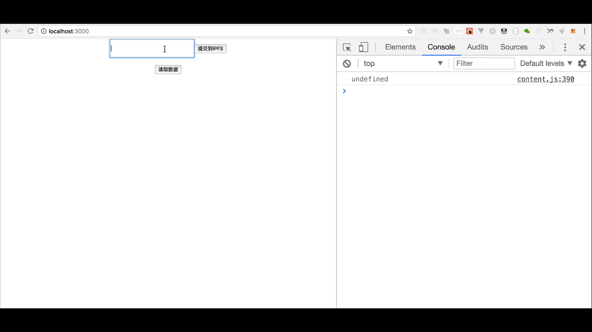
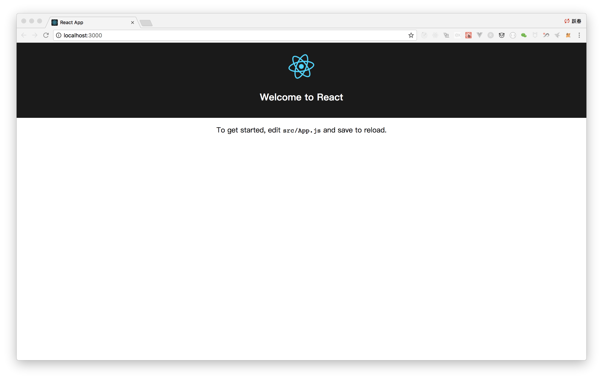
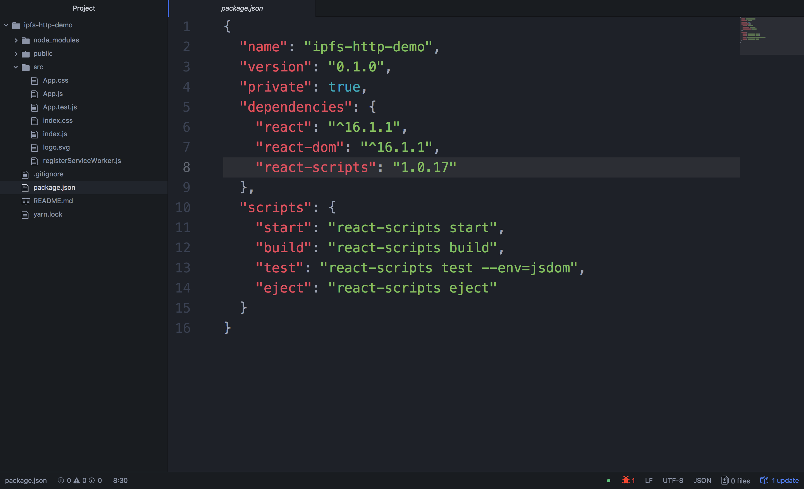
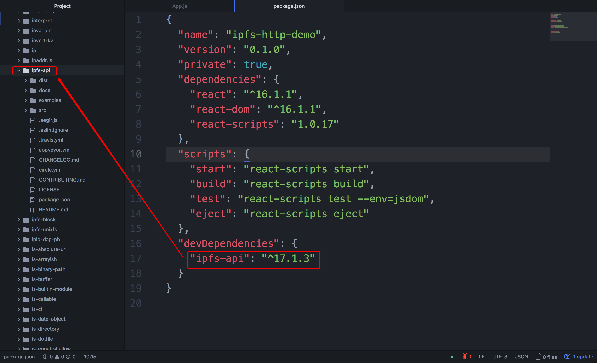
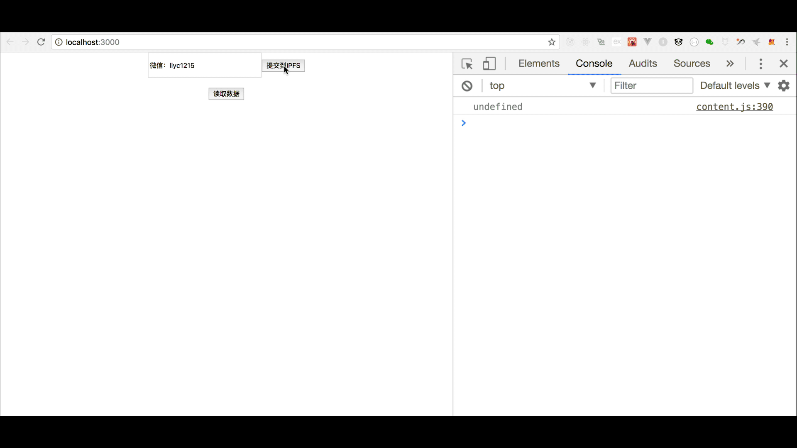
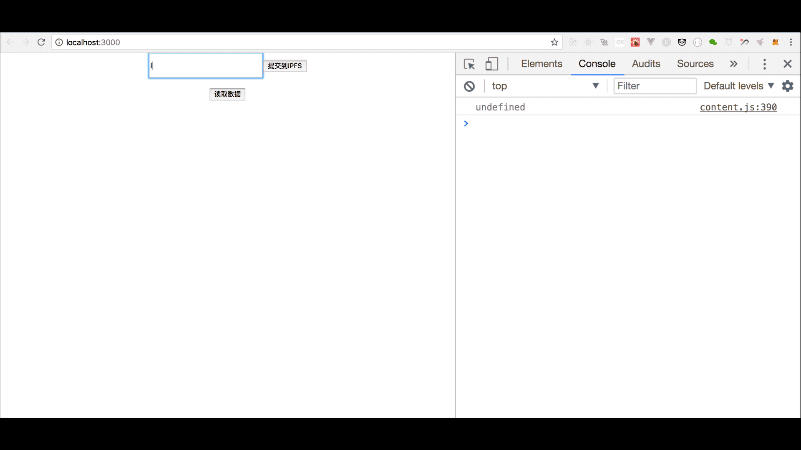
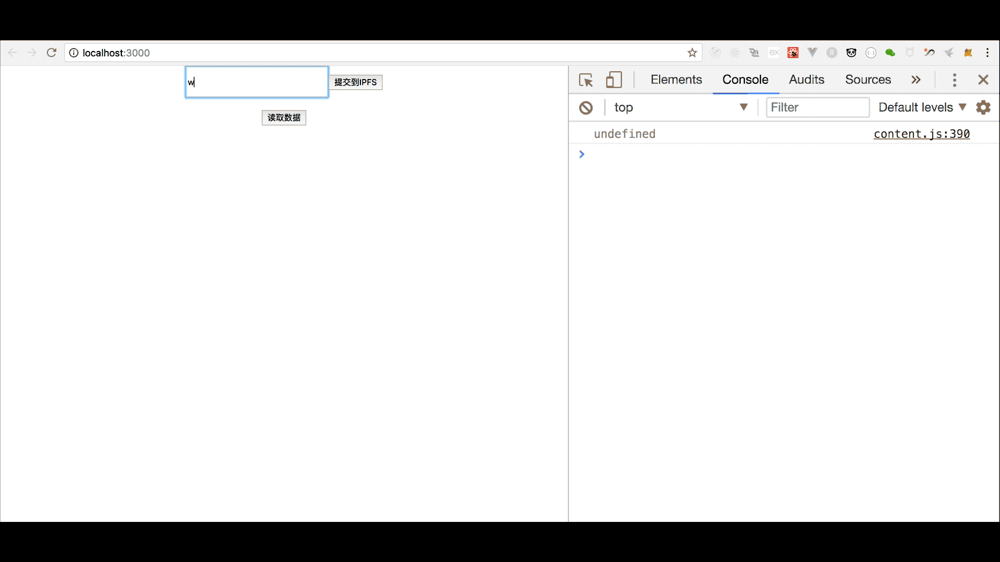
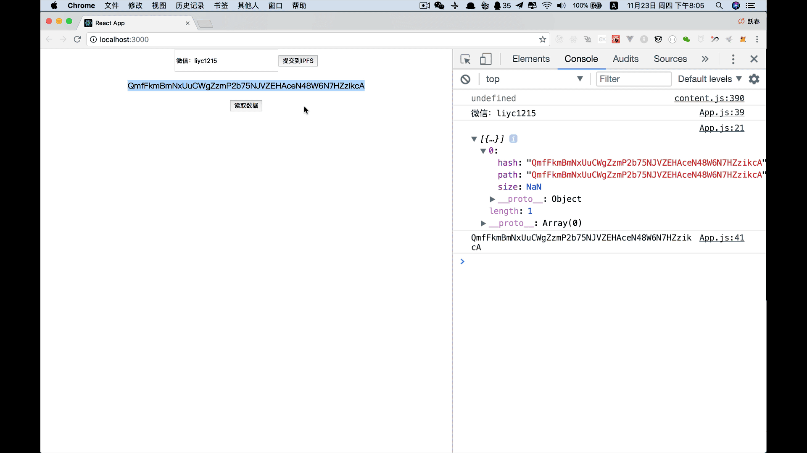
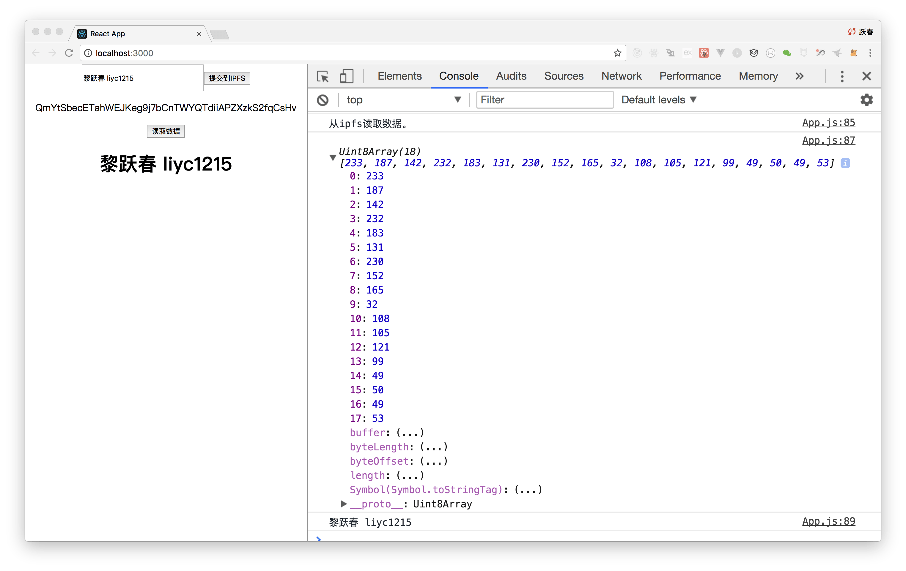

# 第三章 【IPFS + 区块链 系列】 入门篇 - IPFS + Ethereum （上篇）-js-ipfs-api

## 目录

*   1\. 内容简介
*   2\. IPFS-HTTP 效果图
*   3\. 实现步骤
    *   3.1 安装 create-react-app
    *   3.2 React 项目创建
    *   3.3 运行 React 项目
    *   3.4 浏览项目
    *   3.5 安装`ipfs-api`
    *   3.6 完成 UI 逻辑
    *   3.7 导入 IPFS
    *   3.8 编写上传大文本字符串到 IPFS 的 Promise 函数
    *   3.9 上传数据到 IPFS
    *   3.10 跨域资源共享 CORS 配置
    *   3.11 再次刷新网页提交数据并在线查看数据
    *   3.12 从 IPFS 读取数据
    *   3.13 总结
*   4\. 下篇文章预告

## 1\. 内容简介

*   [【IPFS + 区块链 系列】 入门篇 - IPFS 环境配置](http://www.chaindesk.cn/witbook/12/139)
*   [【IPFS + 区块链 系列】 入门篇 - IPFS+IPNS+个人博客搭建](http://www.chaindesk.cn/witbook/12/140)

在前面两篇文章中，第一篇春哥给大家详细介绍了`IPFS`环境配置，第二篇介绍了`IPFS`如何搭建个人博客，通过这两篇文章相信大家已经对`IPFS`有所了解，接下来的这篇文章，我们将为大家讲解`js-ipfs-api`的简单使用，如何将数据上传到`IPFS`，以及如何从`IPFS`通过`HASH`读取数据。

## 2\. IPFS-HTTP 效果图



## 3\. 实现步骤

### 3.1 安装 create-react-app

**参考文档：**[`reactjs.org/tutorial/tutorial.html`](https://reactjs.org/tutorial/tutorial.html)

```go
localhost:1123 yuechunli$ npm install -g create-react-app 
```

### 3.2 React 项目创建

```go
localhost:1123 yuechunli$ create-react-app ipfs-http-demo
localhost:ipfs-http-demo yuechunli$ ls
README.md	package.json	src
node_modules	public		yarn.lock
localhost:ipfs-http-demo yuechunli$ 
```

### 3.3 运行 React 项目

```go
localhost:ipfs-http-demo yuechunli$ npm start 
```

```go
Compiled successfully!

You can now view ipfs-http-demo in the browser.

  Local:            http://localhost:3000/
  On Your Network:  http://192.168.0.107:3000/

Note that the development build is not optimized.
To create a production build, use yarn build. 
```

### 3.4 浏览项目

浏览器浏览`http://localhost:3000`。

效果如下：



### 3.5 安装`ipfs-api`

**⚠️：在这里我就不过多的去介绍 React 的使用以及开发，如果感兴趣的可以去看[这套 React 的视频](http://edu.csdn.net/course/play/4749)，学完这套视频你可以直接进企业找 React 相关的前端开发工作。**

*   项目结构



*   安装`ipfs-api`

切换到项目根目录，安装`ipfs-api`。

```go
$ npm install --save ipfs-api 
```

```go
localhost:ipfs-http-demo yuechunli$ ls
README.md	package.json	src
node_modules	public		yarn.lock
localhost:ipfs-http-demo yuechunli$ pwd
/Users/liyuechun/Desktop/1123/ipfs-http-demo
localhost:ipfs-http-demo yuechunli$ npm install --save ipfs-api 
```



**⚠️：ipfs 安装完后，如上图所示，接下来刷新一下浏览器，看看项目是否有问题，正常来讲，一切会正常，🍭🍭🍭，Continue，Continue，Continue…**

### 3.6 完成 UI 逻辑

拷贝下面的代码，将`src/App.js`里面的代码直接替换掉。

```go
import React, { Component } from 'react';
import './App.css';

class App extends Component {

      constructor(props) {
          super(props);
          this.state = {
            strHash: null,
            strContent: null
          }
      }

    render() {
      return (
        <div className="App">
          <input
            ref="ipfsContent"
            style={{width: 200,height: 40,borderWidth:2}}/>
          <button onClick={() => {
            let ipfsContent = this.refs.ipfsContent.value;
            console.log(ipfsContent);
          }}>提交到 IPFS</button>

          <p>{this.state.strHash}</p>

          <button onClick={() => {
            console.log('从 ipfs 读取数据。')
           }}>读取数据</button>
           <h1>{this.state.strContent}</h1>
        </div>
      );
    }
}

export default App; 
```

上面的代码完成的工作是，当我们在输入框中输入一个字符串时，点击**提交到 IPFS**按钮，将文本框中的内容取出来打印，后续我们需要将这个数据上传到`IPFS`。点击**读取数据**按钮，我们也只是随便打印了一个字符串，后面需要从 IPFS 读取数据，然后将读取的数据存储到状态机变量`strContent`中并且展示出来。



### 3.7 导入 IPFS

```go
const ipfsAPI = require('ipfs-api');
const ipfs = ipfsAPI({host: 'localhost', port: '5001', protocol: 'http'}); 
```

### 3.8 编写上传大文本字符串到 IPFS 的 Promise 函数

```go
saveTextBlobOnIpfs = (blob) => {
    return new Promise(function(resolve, reject) {
      const descBuffer = Buffer.from(blob, 'utf-8');
      ipfs.add(descBuffer).then((response) => {
        console.log(response)
        resolve(response[0].hash);
      }).catch((err) => {
        console.error(err)
        reject(err);
      })
    })
  } 
```

`response[0].hash`返回的是数据上传到`IPFS`后返回的`HASH`字符串。

### 3.9 上传数据到 IPFS

```go
this.saveTextBlobOnIpfs(ipfsContent).then((hash) => {
    console.log(hash);
    this.setState({strHash: hash});
}); 
```

`ipfsContent`是从文本框中取到的数据，调用`this.saveTextBlobOnIpfs`方法将数据上传后，会返回字符串`hash`，并且将`hash`存储到状态机变量`strHash`中。

**目前完整的代码：**

```go
import React, {Component} from 'react';
import './App.css';

const ipfsAPI = require('ipfs-api');
const ipfs = ipfsAPI({host: 'localhost', port: '5001', protocol: 'http'});

class App extends Component {

  constructor(props) {
    super(props);
    this.state = {
      strHash: null,
      strContent: null
    }
  }

  saveTextBlobOnIpfs = (blob) => {
    return new Promise(function(resolve, reject) {
      const descBuffer = Buffer.from(blob, 'utf-8');
      ipfs.add(descBuffer).then((response) => {
        console.log(response)
        resolve(response[0].hash);
      }).catch((err) => {
        console.error(err)
        reject(err);
      })
    })
  }

  render() {
    return (<div className="App">
      <input ref="ipfsContent" style={{
          width: 200,
          height: 40,
          borderWidth: 2
        }}/>
      <button onClick={() => {
          let ipfsContent = this.refs.ipfsContent.value;
          console.log(ipfsContent);
          this.saveTextBlobOnIpfs(ipfsContent).then((hash) => {
            console.log(hash);
            this.setState({strHash: hash});
          });
        }}>提交到 IPFS</button>

      <p>{this.state.strHash}</p>

      <button onClick={() => {
          console.log('从 ipfs 读取数据。')
        }}>读取数据</button>
      <h1>{this.state.strContent}</h1>
    </div>);
  }
}

export default App; 
```

**测试：**



### 3.10 跨域资源共享 CORS 配置

跨域资源共享`( CORS )`配置，依次在终端执行下面的代码：

```go
localhost:ipfs-http-demo yuechunli$ ipfs config --json API.HTTPHeaders.Access-Control-Allow-Methods '["PUT", "GET", "POST", "OPTIONS"]'

localhost:ipfs-http-demo yuechunli$ ipfs config --json API.HTTPHeaders.Access-Control-Allow-Origin '["*"]'

localhost:ipfs-http-demo yuechunli$ ipfs config --json API.HTTPHeaders.Access-Control-Allow-Credentials '["true"]'

localhost:ipfs-http-demo yuechunli$ ipfs config --json API.HTTPHeaders.Access-Control-Allow-Headers '["Authorization"]'

localhost:ipfs-http-demo yuechunli$ ipfs config --json API.HTTPHeaders.Access-Control-Expose-Headers '["Location"]' 
```

`用正确的端口运行 daemon：`

```go
localhost:ipfs-http-demo yuechunli$ ipfs config Addresses.API
/ip4/127.0.0.1/tcp/5001
localhost:ipfs-http-demo yuechunli$ ipfs config Addresses.API /ip4/127.0.0.1/tcp/5001
localhost:ipfs-http-demo yuechunli$ ipfs daemon 
```

### 3.11 再次刷新网页提交数据并在线查看数据

*   上传数据，并且查看返回 hash 值



*   在线查看上传到 IPFS 的数据



### 3.12 从 IPFS 读取数据

*   `ipfs.cat`

```go
ipfs.cat(this.state.strHash).then((stream) => {
    console.log(stream);
    let strContent = Utf8ArrayToStr(stream);
    console.log(strContent);
    this.setState({strContent: strContent});
}); 
```



`stream`为`Uint8Array`类型的数据，下面的方法是将`Uint8Array`转换为`string`字符串。

*   `Utf8ArrayToStr`

```go
function Utf8ArrayToStr(array) {
    var out, i, len, c;
    var char2, char3;

    out = "";
    len = array.length;
    i = 0;
    while(i < len) {
    c = array[i++];
    switch(c >> 4)
      {
        case 0: case 1: case 2: case 3: case 4: case 5: case 6: case 7:
          // 0xxxxxxx
          out += String.fromCharCode(c);
          break;
        case 12: case 13:
          // 110x xxxx   10xx xxxx
          char2 = array[i++];
          out += String.fromCharCode(((c & 0x1F) << 6) | (char2 & 0x3F));
          break;
        case 14:
          // 1110 xxxx  10xx xxxx  10xx xxxx
          char2 = array[i++];
          char3 = array[i++];
          out += String.fromCharCode(((c & 0x0F) << 12) |
                         ((char2 & 0x3F) << 6) |
                         ((char3 & 0x3F) << 0));
          break;
        default:
          break;
      }
    }

    return out;
} 
```

*   完整源码

```go
import React, {Component} from 'react';
import './App.css';

const ipfsAPI = require('ipfs-api');
const ipfs = ipfsAPI({host: 'localhost', port: '5001', protocol: 'http'});

function Utf8ArrayToStr(array) {
  var out,
    i,
    len,
    c;
  var char2,
    char3;

  out = "";
  len = array.length;
  i = 0;
  while (i < len) {
    c = array[i++];
    switch (c >> 4) {
      case 0:
      case 1:
      case 2:
      case 3:
      case 4:
      case 5:
      case 6:
      case 7:
        // 0xxxxxxx
        out += String.fromCharCode(c);
        break;
      case 12:
      case 13:
        // 110x xxxx   10xx xxxx
        char2 = array[i++];
        out += String.fromCharCode(((c & 0x1F) << 6) | (char2 & 0x3F));
        break;
      case 14:
        // 1110 xxxx  10xx xxxx  10xx xxxx
        char2 = array[i++];
        char3 = array[i++];
        out += String.fromCharCode(((c & 0x0F) << 12) | ((char2 & 0x3F) << 6) | ((char3 & 0x3F) << 0));
        break;
      default:
        break;
    }
  }

  return out;
}

class App extends Component {

  constructor(props) {
    super(props);
    this.state = {
      strHash: null,
      strContent: null
    }
  }

  saveTextBlobOnIpfs = (blob) => {
    return new Promise(function(resolve, reject) {
      const descBuffer = Buffer.from(blob, 'utf-8');
      ipfs.add(descBuffer).then((response) => {
        console.log(response)
        resolve(response[0].hash);
      }).catch((err) => {
        console.error(err)
        reject(err);
      })
    })
  }

  render() {
    return (<div className="App">
      <input ref="ipfsContent" style={{
          width: 200,
          height: 40,
          borderWidth: 2
        }}/>
      <button onClick={() => {
          let ipfsContent = this.refs.ipfsContent.value;
          console.log(ipfsContent);
          this.saveTextBlobOnIpfs(ipfsContent).then((hash) => {
            console.log(hash);
            this.setState({strHash: hash});
          });
        }}>提交到 IPFS</button>

      <p>{this.state.strHash}</p>

      <button onClick={() => {
          console.log('从 ipfs 读取数据。')
          ipfs.cat(this.state.strHash).then((stream) => {
            console.log(stream);
            let strContent = Utf8ArrayToStr(stream);
            console.log(strContent);
            this.setState({strContent: strContent});
          });
        }}>读取数据</button>
      <h1>{this.state.strContent}</h1>
    </div>);
  }
}

export default App; 
```

### 3.13 总结

这篇文章主要讲解如何配置 React 环境，如何创建 React 项目，如何安装`js-ipfs-api`，如何上传数据，如何设置开发环境，如何下载数据等等内容。通过这篇文章的系统学习，你会掌握`js-ipfs-api`在项目中的使用流程。

这是`【IPFS + 区块链 系列】 入门篇 - IPFS + Ethereum （上篇）-js-ipfs-api`，下篇讲解如何将 IPFS 和以太坊智能合约结合进行数据存储。

## 4\. 下篇文章预告

这是`【IPFS + 区块链 系列】 入门篇 - IPFS + Ethereum （上篇）-js-ipfs-api`，下篇讲解如何将 IPFS 和以太坊智能合约结合进行数据存储。