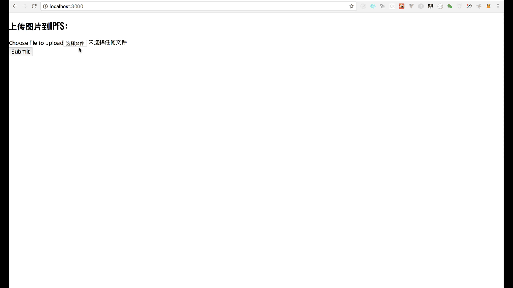
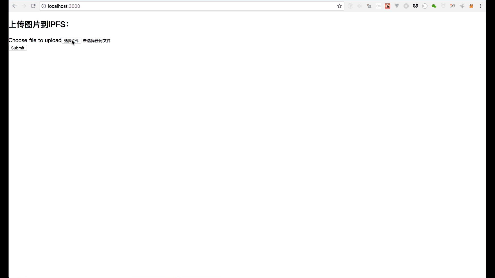

# 第四章 【IPFS + 区块链 系列】 入门篇 - IPFS + Ethereum （中篇）-js-ipfs-api - IPFS 图片上传与下载

## 目录

*   1\. 项目效果图
*   2\. 创建 React 项目
*   3\. 完成 UI 逻辑
*   4\. 安装 ipfs-api
*   5\. App.js 导入 IPFS
*   6\. 实现上传图片到 IPFS 的 Promise 函数
*   7\. 上传图片到 IPFS
*   8\. 完整代码
*   9\. 运行项目
*   10\. 总结
*   11\. 技术交流

## 系列文章

*   [【IPFS + 区块链 系列】 入门篇 - IPFS 环境配置](http://www.chaindesk.cn/witbook/12/139)
*   [【IPFS + 区块链 系列】 入门篇 - IPFS+IPNS+个人博客搭建](http://www.chaindesk.cn/witbook/12/140)
*   [【IPFS + 区块链 系列】 入门篇 - IPFS + Ethereum （上篇）-js-ipfs-api - 数据上传到 IPFS](http://www.chaindesk.cn/witbook/12/141)

## 1\. 项目效果图

选择图片，点击`Submit`将图片提交到`IPFS`，并且返回`IPFS`的`HASH`值，再通过`HASH`从`IPFS`读取图片。



## 2\. 创建 React 项目

具体不知道怎么操作的，请移步到[【IPFS + 区块链 系列】 入门篇 - IPFS + Ethereum （上篇）-js-ipfs-api](http://liyuechun.org/2017/11/22/ipfs-api/)。

```go
$ create-react-app ipfs_img 
```

## 3\. 完成`UI`逻辑

将下面的代码拷贝替换掉`App.js`里面的代码。

```go
import React, {Component} from 'react'

class App extends Component {
  constructor(props) {
    super(props)

    this.state = {
      imgSrc: null
    }
  }

  render() {
    return (<div className="App">

      <h2>上传图片到 IPFS：</h2>
      <div>
        <label id="file">Choose file to upload</label>
        <input type="file" ref="file" id="file" name="file" multiple="multiple"/>
      </div>
      <div>
        <button onClick={() => {
            var file = this.refs.file.files[0];
            var reader = new FileReader();
            // reader.readAsDataURL(file);
            reader.readAsArrayBuffer(file)
            reader.onloadend = (e) => {
              console.log(reader);
              // 上传数据到 IPFS
            }

          }}>Submit</button>
      </div>
      {
        this.state.imgSrc
          ? <div>
              <h2>{"http://localhost:8080/ipfs/" + this.state.imgSrc}</h2>
              
            </div>
          : 
      }
    </div>);
  }
}

export default App 
```



## 4\. 安装`ipfs-api`

```go
localhost:1126 yuechunli$ cd ipfs_img/
localhost:ipfs_img yuechunli$ ls
README.md	package.json	src
node_modules	public		yarn.lock
localhost:ipfs_img yuechunli$ npm install --save-dev ipfs-api 
```

## 5\. `App.js`导入 IPFS

```go
const ipfsAPI = require('ipfs-api');
const ipfs = ipfsAPI({host: 'localhost', port: '5001', protocol: 'http'}); 
```

## 6\. 实现上传图片到 IPFS 的 Promise 函数

```go
let saveImageOnIpfs = (reader) => {
  return new Promise(function(resolve, reject) {
    const buffer = Buffer.from(reader.result);
    ipfs.add(buffer).then((response) => {
      console.log(response)
      resolve(response[0].hash);
    }).catch((err) => {
      console.error(err)
      reject(err);
    })
  })
} 
```

## 7\. 上传图片到 IPFS

```go
var file = this.refs.file.files[0];
var reader = new FileReader();
// reader.readAsDataURL(file);
reader.readAsArrayBuffer(file)
reader.onloadend = function(e) {
  console.log(reader);
  saveImageOnIpfs(reader).then((hash) => {
    console.log(hash);
    this.setState({imgSrc: hash})
  });
} 
```

*   `reader.readAsDataURL(file);`上传图片路径。
*   `reader.readAsArrayBuffer(file)`上传图片内容
*   上传图片

```go
saveImageOnIpfs(reader).then((hash) => {
    console.log(hash);
    this.setState({imgSrc: hash})
  }); 
```

`hash`即是上传到`IPFS`的图片的`HASH`地址，`this.setState({imgSrc: hash})`将`hash`保存到状态机变量`imgSrc`中。

## 8\. 完整代码

```go
import React, {Component} from 'react'

const ipfsAPI = require('ipfs-api');
const ipfs = ipfsAPI({host: 'localhost', port: '5001', protocol: 'http'});

let saveImageOnIpfs = (reader) => {
  return new Promise(function(resolve, reject) {
    const buffer = Buffer.from(reader.result);
    ipfs.add(buffer).then((response) => {
      console.log(response)
      resolve(response[0].hash);
    }).catch((err) => {
      console.error(err)
      reject(err);
    })
  })
}

class App extends Component {
  constructor(props) {
    super(props)

    this.state = {
      imgSrc: null
    }
  }

  render() {
    return (<div className="App">

      <h2>上传图片到 IPFS：</h2>
      <div>
        <label id="file">Choose file to upload</label>
        <input type="file" ref="file" id="file" name="file" multiple="multiple"/>
      </div>
      <div>
        <button onClick={() => {
            var file = this.refs.file.files[0];
            var reader = new FileReader();
            // reader.readAsDataURL(file);
            reader.readAsArrayBuffer(file)
            reader.onloadend = (e) => {
              console.log(reader);
              // 上传数据到 IPFS
              saveImageOnIpfs(reader).then((hash) => {
                console.log(hash);
                this.setState({imgSrc: hash})
              });
            }

          }}>Submit</button>
      </div>
      {
        this.state.imgSrc
          ? <div>
              <h2>{"http://localhost:8080/ipfs/" + this.state.imgSrc}</h2>
              
            </div>
          : 
      }
    </div>);
  }
}

export default App 
```

## 9\. 运行项目

*   `npm start`
*   新建终端，启动节点服务`ipfs daemon`


## 10\. 总结

这本文章主要复习如何创建 React 项目，如何安装`ipfs-api`，如何编写上传图片到`IPFS`的`Promise`函数，下一篇我们将介绍，如何将图片`hash`存储到区块链，如何从区块链取到`hash`，并且通过`hash`从`ipfs`拿到图片。