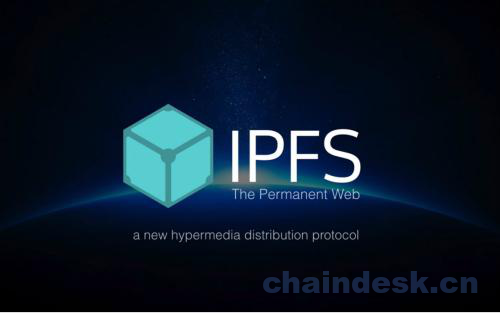

# 第一章 【IPFS 一问一答】什么是 IPFS?

# 1 什么是 IPFS?

IPFS 全称 InterPlanetary File System，中文名：星际文件系统，是一个旨在创建持久且分布式存储和共享文件的网络传输协议。

它是一种内容可寻址的对等超媒体分发协议。在 IPFS 网络中的节点将构成一个分布式文件系统。它是一个开源项目，自 2014 年开始由 Protocol Labs （协议实验室）在开源社区的帮助下发展。其最初由 Juan Benet 设计。 IPFS 是点对点的超媒体协议，可以让网络更快、更安全、更开放。它是一个面向全球的、点对点的分布式版本文件系统。数据在 IPFS 上的存储都是以碎片的形式存储的，每个碎片的大小是 256k，（最后的一个碎片如果不够 256k，或文件整体大小小于 256kb，将直接作为碎片处理，不再占用新的 block）。网络中的节点会对你的碎片进行存储。当你检索数据时，会将所有碎片收集起来，通过文件管理系统按序组合碎片得到你的文件。所以你可以看到，整个网络中并没有中心服务器，完全去中心化的。

其官网是：[`ipfs.io/`](https://ipfs.io/)