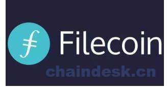

# 第二章 【IPFS 一问一答】什么是 Filecoin？

# 2 什么是 Filecoin？

IPFS 是一种互联网协议，而 Filecoin 是基于 IPFS 的分布式存储区块链项目。当然 Filecoin 并不是 IPFS 上唯一的项目。将来肯定会有更多这些 IPFS 项目。

Filecoin 在 IPFS 系统上加了一层激励机制，token 是 FIL。它旨在鼓励人们贡献他们的潜在存储空间和互联网带宽。用户可以在 Filecoin 上存储数据，也可以在 Filecoin 上检索数据。而矿工分为存储矿工和检索矿工，分别提供存储和数据检索。同时，经过选举成功的存储矿工，还有出块的功能，保证链的正常运行。关于竞争出块权，不像 pow 靠算力比拼，但有点类似 pos 机制，只不过股权从 token 权益改成了存储。也就是说存储矿工在全网中存储的数据越多，成为出块节点的概率越大。

FIL 代币总共有 20 亿枚。分配方案，总共有四个部分组成：

*   70%作为挖矿的回报：像比特币一样根据挖矿的进度逐步分发
*   15%预留 Protocol Labs：作为研发费用, 6 年逐步解禁
*   10%分配给 ICO 投资者： 根据挖矿进度, 逐步解禁
*   5%预留给 Filecoin 基金会： 作为长期社区建设, 网络管理等费用, 6 年逐步解禁

私募时间：2017.07.21-2017.7.24 成本：0.75 美元 行权期：1-3 年，折扣额 0-30% 参与人数：150+人 募集金额：0.52 亿美元 公募时间：2017.08.07-2017.09.07 成本：1-5 美元 行权期：1-3 年，折扣额 0-30% 参与人数：2100+人 募集资金：2.05 亿美元