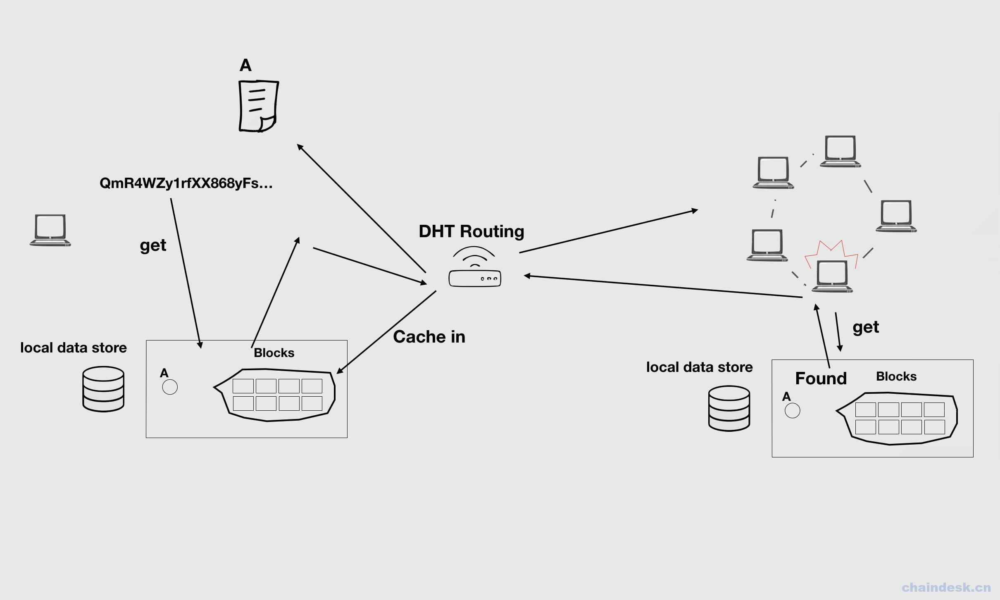
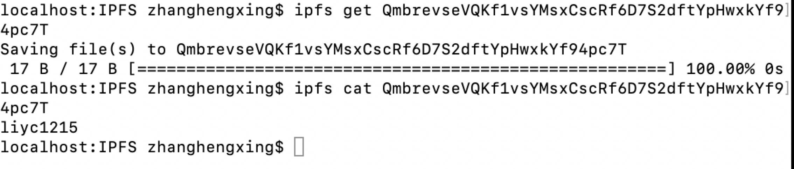
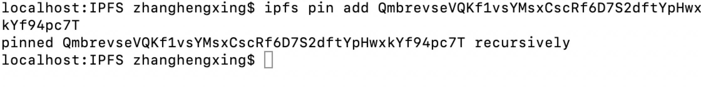

# 第十三章 【IPFS 一问一答】IPFS 文件是怎么下载的？

# 13 IPFS 文件是怎么下载的？

IPFS 将文件下载到本地节点，用的命令是 ipfs get,是缓存到本地；用 ipfs pin add 是锁定下载的缓存数据。在 ipfs 中, pin 表示将文件长期保存在本地，不被垃圾回收，而没有被 pin 处理的数据会定时清理掉。

上图展示了 ipfs 执行 get 命令的执行流程。 对于当前节点来说，所有与其连接的 peers 节点会构成一个 swarm 网络。 当本地节点发出一个 get 请求时，它首先会从本地的 blockstore 中查找请求的数据，如果没有找到，它便会向 swarm 网络发出请求，通过 DHT Routing 找到拥有该数据的节点，一旦找到一个拥有所请求数据的节点，该节点会把数据反馈回来。然后，本地节点会把收到的 block 数据缓存一份到本地的 blockstore 中，这样，整个网络中就相当于多了一份原数据的拷贝。当有更多的节点都请求该数据的时候，就变得更加容易，而由于越来越多的节点都存有该数据，数据就变得几乎不可丢失。 这也就是 IPFS 网络能够永久保存数据的原理，只要有任何一个 IPFS 节点拥有某数据，这个数据就可以被全网所获取。

在终端操作 get，获取网络中 hash 为 QmbrevseVQKf1vsYMsxCscRf6D7S2dftYpHwxkYf94pc7T 的数据，并用 cat 查看数据，如下图：  在终端用 ipfs pin add 命令，如下图 