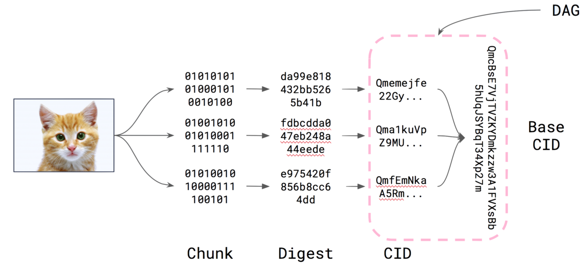

# 第十四章 【IPFS 一问一答】IPFS 文件碎片是什么？存储文件后，返回的哈希值是怎么产生的？

## 14 IPFS 文件碎片是什么？存储文件后，返回的哈希值是怎么产生的？

IPFS 网络中的数据是以打散的块存储的，这些块也叫文件碎片。ipfs 在用 ipfs add 命令存储数据时，默认是将数据按大小 256Kb 分割的，当然你也可以根据自己的意愿分割数据，如 ipfs add -r --chunker=size-10000 或 ipfs add -r --chunker=rabin-512-1024-2048 对数据进行指定大小分割存储。接下来我们只是以默认的数据分割进行分析。

ipfs add 某个数据时，本地会将数据按大小 256kb 分割，小于或分割到小于 256kb 的数据，将不再分割。这些分割后的块以二进制的形式按序存储。因为 ipfs 是内容可寻址的，所以需要块文件有自己唯一的指纹，也就是其 hash 值。

块文件的 hash 过程： 1.将块文件（二进制文件）用 sha2-256，进行 hash 散列，得到块文件的摘要值 Digest。 2.将块文件的摘要值进行 base58 处理，得到该块文件的 hash 值 CID。

这些块文件组合成一起，进行 sha2-256 散列，再 base58 处理，最后得到整体文件的索引。当你在 add 数据后，会返回给你一个以 Qm 开头的 hash 值，该值就是文件的索引值。检索数据时只要 ipfs get Qm...，就会将对应的文件下载到当前目录下。

下图展示了数据分割处理过程 