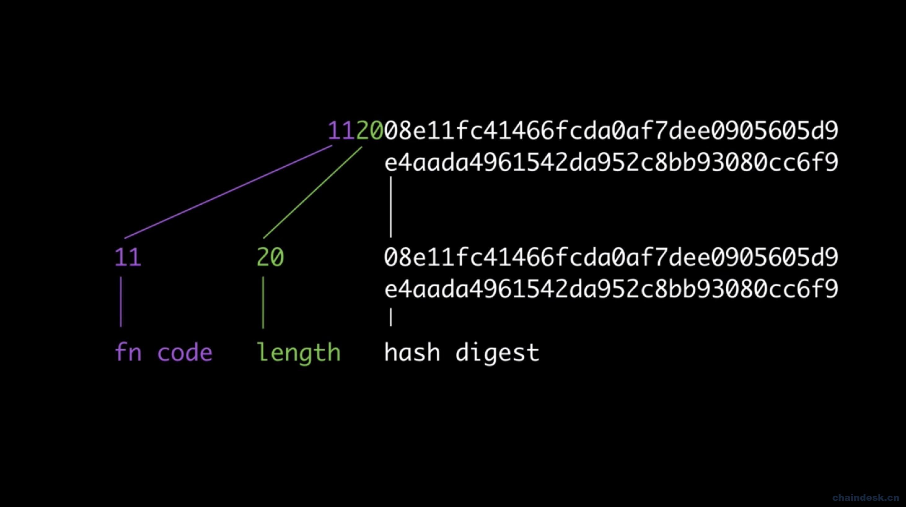

# 第二十七章 【IPFS 一问一答】解析 IPFS Multiformat 之 Multihash

# 27 【IPFS 一问一答】解析 IPFS Multiformat 之 Multihash

在传统的加密体系中，系统总是锁定某个散列函数或加密函数，来对信息进行处理，处理得到的数据是固定的长度和形式。系统中的很多工具或方法都是依赖于这套加密系统。假如后期需要对加密体系进行升级，如更换加密函数类型等等，对于整个程序来说，这将是一场噩梦。所有的与之相关的工具或方法都需要进行升级，以使用新的哈希函数和新的哈希摘要长度。这些工具可能面临严重的互操作性问题或容易出错。

为了应对这个问题，协议实验室研发了 Multihash 模型。

## 27.1 multihash 格式

Multihash 遵循 TLV（type-length-value）的格式进行描述：

`<hash-func-type><digest-length><digest-value>`

类型（hash-function-type）：采用无符号的 varints 进行描述。并采用表进行配置。 长度（digest-length）：采用无符号 varints 计算摘要的长度，以字节为单位。 值（digest-value）：表示 Hash 函数的摘要，长度为 digest-length 字节

multihash 示例 

下边用 sha2-sha256 散列函数对字符串“hello”进行散列处理，以 16 进制字符串输出

```go
var a = "hello"

b:=sha256.Sum256([]byte(a))
fmt.Printf("%x",b)

输出：2cf24dba5fb0a30e26e83b2ac5b9e29e1b161e5c1fa7425e73043362938b9824
```

然后经过 Multihash 处理后得到：

Multihash ： 12202cf24dba5fb0a30e26e83b2ac5b9e29e1b161e5c1fa7425e73043362938b9824

代表的含义为： 散列函数：sha2-256 (0x12) 长度：32 (0x20) 摘要：41dd7b6443542e75701aa98a0c235951a28a0d851b11564d20022ab11d2589a8

如果散列函数是 sha2-512：

Multihash ：132052eb4dd19f1ec522859e12d89706156570f8fbab1824870bc6f8c7d235eef5f4 散列函数：sha2-512（十六进制代码：0x13） 长度：32（十六进制：0x20） 摘要： 52eb4dd19f1ec522859e12d89706156570f8fbab1824870bc6f8c7d235eef5f4

## 27.2 安装并测试 Multihash

我们采用 Golang 来使用 multihash。

安装 multihash

`go get github.com/multiformats/go-multihash`

代码：

```go
package main

import (
    "encoding/hex"
    "fmt"

    "github.com/multiformats/go-multihash"
)

func main() {
    // 将字符串转换为字节数组
    buf, _ := hex.DecodeString("0beec7b5ea3f0fdbc95d0dd47f3c5bc275da8a33")
    // 将字节数组用 multihash 编码
    mHashBuf, _ := multihash.EncodeName(buf, "sha1")
    // 打印编码之后的摘要
    fmt.Printf("hex: %s\n", hex.EncodeToString(mHashBuf))
    // 将 binary multihash 转换为 DecodedMultihash 的形式
    mHash, _ := multihash.Decode(mHashBuf)
    // 获取数字摘要
    sha1hex := hex.EncodeToString(mHash.Digest)
    // 打印
    fmt.Printf("obj: %v 0x%x %d %s\n", mHash.Name, mHash.Code, mHash.Length, sha1hex)
} 
```

测试：

```go
> go run multihash.go
hex:11140beec7b5ea3f0fdbc95dodd47f3c5bc275da8a33
obj:sha1 0x11 20 0beec7b5ea3f0fdbc95d0dd47f3c5bc275da8a33 
```