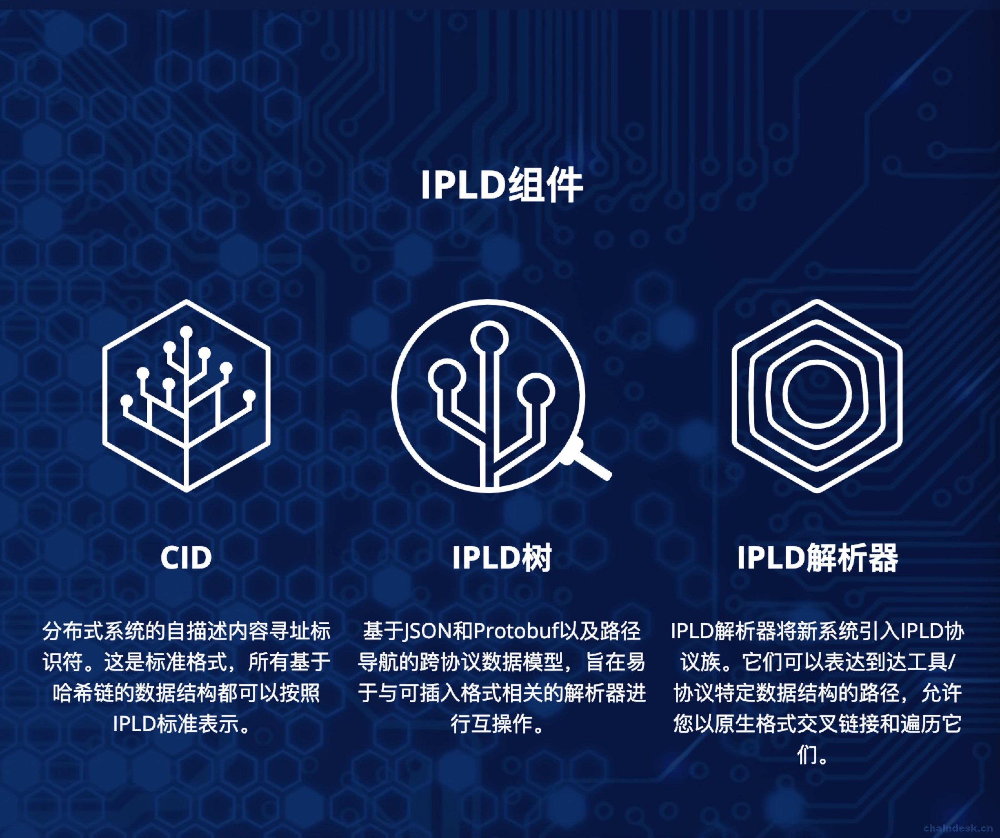

# 第三十二章 【IPFS 一问一答】IPFS 应用层之 IPLD

# 32.【IPFS 一问一答】 IPFS 应用层之 IPLD

目前很多流行的系统都使用 merkle 树和哈希链接相关的数据结构，例如 git, bittorrent, ipfs, tahoe-lafs, sfsro。 IPLD (Inter Planetary Linked Data) 定义了如下概念:

*   merkle-links 默克尔链接: merkle-graph 的关键单位
*   merkle-dag 默克尔 DAG: 任何边为 merkle-links 的图
*   merkle-paths: unix 风格的路径便于遍历 merkle-dag
*   IPLD Data Model:一种灵活的、基于 JSON 的数据模型，用于表示 merkle-dags.
*   IPLD Serialized Formats 序列化模型: 一系列 IPLD 对象可以使用的格式, 例如 JSON, CBOR, CSON, YAML, Protobuf, XML, RDF, etc.
*   IPLD 权威格式: 一种笃定的对序列格式的描述，它可以保证对于数据都使用同样的解释逻辑。这一点对于 merkle-linking 和其他的加密应用都至关重要。

 

简而言之: IPLD 是由 merkle-links 命名的，可以被遍历的 JSON 文件对象。

IPLD 的组件如下图 3 部分组成：CID、IPLD Tree、IPLD Resolvers。 