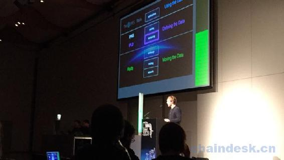

# 第一章 IPFS Weekly 1

# Weekly 1

作者：Richard Littauer，Andrew Chin，2016-01-11

欢迎来到 IPFS 周刊的第一版！

IPFS（[`ipfs.io/）`](https://ipfs.io/）) 是一种新的超媒体分发协议，通过内容和身份进行寻址，旨在使网络更快，更安全，更开放。在这些帖子中，我们将尽量强调过去一周发生的一些发展。对于任何想要参与的人，请打开本文嵌入的超链接，在 github（[`github.com/ipfs）`](https://github.com/ipfs）) 上搜索足够的信息或在 IRC（[`webchat.freenode.net/?channels=ipfs）`](https://webchat.freenode.net/?channels=ipfs）) 上加入我们。

虽然这是我们第一次推出“每周”，但我们已经包括了好几周内容了。这部分是因为我们一直在改进我们的流程，并希望让第一期周刊成为一个不错的开始。将来，它们将每周发布。如果您对此过程有任何反馈意见，请在此处（[`github.com/ipfs/newsletter/issues/7）`](https://github.com/ipfs/newsletter/issues/7）) 告知我们。谢谢！

## 12 月 21 日

以下是 12 月 21 日内容的一些亮点：

### 32c3

在这个关键期间并没有发生太多事情，因为这是假期 - 然而，它也是第 32 届 CCC 的时间。@whyrusleeping，@ diasdavid，@ lgierth，@ Dignifiedquire 以及更多的团队都前往汉堡参加活动。

*   @whyrusleeping 发表了一个简短的谈话内容（见上图）。
*   @whyrusleeping @diasdavid 和@Dignifiedquire 领导并组织了一场派对，并且现场演示 demo。
*   @MrChrisJ 主持了关于他的 Full Node 项目的讨论，其中包括 IPFS。
*   我们遇到了很多用户和其他团体（包括 Tahoe-LAFS，tor 等）。

### 更新

*   （go-ipfs） @whyrusleeping 和 @diasdavid 做了惊人的工作，解决了大约 200 个问题。这作为“2015 年的大型 ip-ipfs 问题派对”的一部分。
*   (registry-mirror) IPFS 上的 npm 由 @diasdavid 进一步推动，使其与 0.4.0 一起工作。目前，有 130,000 个模块，而且它很强大。
*   （go-ipfs） @lgierth 设置了 namaka 和 hiiaka（我们桌子上的 NUC 节点为 32c3）。这很酷。
*   (readme-standard) @RichardLitt 有他自己的重大议题派对。关于`readme standard`对 IPFS 未来的发展起到的作用充满自豪。
*   （webui） @Dignifiedquire 在`webui using webpack`改进方面，做出来令人惊叹的工作。
*   他还成功发布了 rust-multiaddr 和 rust-multihash，这意味着现在更多的语言实现了原始的 multihash 和 multiaddr 规范。

有关更多更新，请参阅[`github.com/ipfs/team-mgmt/issues/76。`](https://github.com/ipfs/team-mgmt/issues/76。)

## 12 月 14 日

以下是 12 月 14 日内容的一些亮点：

### 发布

*   @whyrusleeping 完成`fs-repo-migrations`！这些是 ipfs 客户端的文件系统仓库的迁移。这个工具是用 Go 编写的，与 go-ipfs 一起开发，但它应该适用于任何符合 fs 仓库规范的 repo。
*   @Dignifiedquire 在 rust-multiaddr 做了一些很重要的工作，即一个 Rust 实现的@jbenet 的 multiaddr。

### 更新

*   （registry-mirror） @diasdavid 负责 IPFS 项目的 npm 工作。这涉及一些新功能，将镜像移动到不同的服务器，使其能更好的处理更大的目录以及和 0.4.0 更好地工作。
*   [（js-ipfs）]（// github.com/ipfs/js-ipfs @diasdavid 也推出 js-ipfsde 的一些主要更新。
    本周报道的内容不多; 很多人都在休班，要么去 CCC，要么假期了。

## 12 月 7 日

以下是 12 月 7 日期间发生的一些亮点：

### 发布

*   @whyrusleeping 上传 IPFS 版本 0.3.10！它包含自上一版本以来的 74 个新提交，您可以在此处获取它 [`docs.ipfs.io/introduction/install/。`](https://docs.ipfs.io/introduction/install/。)
*   IPFS 的 npm！ `registry-mirror`是一个新工具，通过 IPNS 获取和缓存最新的 npm 状态，实现 npm 模块的分布式发现。
*   @jbenet 发布了一个名为 dnslink 的新工具/库，可以轻松解析 dns 链接（域名中可以指向路径的特殊 TXT 记录，如 IPFS 路径）

### 更新

*   (infrastructure) 在基础设施方面，@lgierth 已经引入了两个新存储，每个存储有 17 TB 的磁盘空间！
*   （api） @RichardLitt [已达到草案 1]（（github.com/ipfs/api/pull/13）了解 API 的文档。
*   @harlantwood 编写了一些 nodejs 代码，用于运行新的 IPFS 节点，将其设置为已知 ID，并使用该节点发布到 IPNS。
*   （specs）新的 IPFS 关联数据（IPLD）规范正在 specs 存储库中进行迭代。

### 积极的事件

*   @robcat 和@fazo96 在将 IPFS 与 pacman（Arch Linux 的包管理器）集成方面做得非常出色的表现。他们现在可以直接从 IPFS 安装 arch 包了！
*   @Dignifiedquire 一直致力于为 IPFS 提供一个有吸引力的新分发页面，这将是下载 IPFS 所有内容的新登陆页面。您可以在此处[`github.com/ipfs/distributions/issues/11 查看。`](https://github.com/ipfs/distributions/issues/11 查看。)

### 贡献者

在整个 IPFS GitHub 组织中，以下人员自 12 月 7 日起提交了代码。（我们使用此工具自动生成此列表，因此，如果您的姓名不在此，请告诉我们。）将来，我们还会包括评论的人，因为他们也非常重要。 在我们开发该技术的同时，和我们共同努力。

*   @diasdavid (David Dias)
*   @digital-dreamer
*   @Dignifiedquire (Friedel Ziegelmayer)
*   @djdv (Dominic Della Valle)
*   @fazo96 (Enrico Fasoli)
*   @greenkeeperio-bot
*   @harlantwood (Harlan T Wood)
*   @hcs64 (Adam Gashlin)
*   @ianopolous (Ian Preston)
*   @ivilata (Ivan Vilata-i-Balaguer)
*   @jbenet (Juan Benet)
*   @jedahan (Jonathan Dahan)
*   @Kubuxu (Jakub Sztandera)
*   @kyledrake (Kyle Drake)
*   @lgierth (Lars Gierth)
*   @NeoTeo (Teo Sartori)
*   @ralphtheninja (Lars-Magnus Skog)
*   @ReadmeCritic
*   @rht
*   @RichardLitt (Richard Littauer)
*   @travisperson (Travis Person)
*   @wasserfuhr (RainerWasserfuhr)
*   @whyrusleeping (Jeromy Johnson)
*   @zignig (Simon Kirkby)

谢谢，下周见！
Richard Littauer 和 Andrew Chin