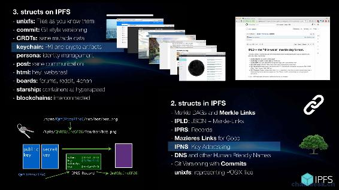
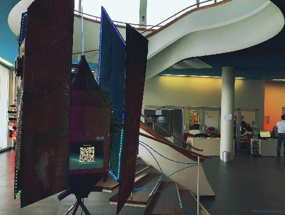

# 第七章 IPFS Weekly 7

# IPFS Weekly 7

作者：Richard Littauer，Andrew Chin，2016-03-17

IPFS（[`ipfs.io/`](https://ipfs.io/) ） 是一种新的超媒体分发协议，通过内容和身份进行寻址，旨在使网络更快，更安全，更开放。在这些帖子中，我们将尽量强调过去一周发生的一些发展。对于任何想要参与的人，请打开本文嵌入的超链接，在 github（[`github.com/ipfs`](https://github.com/ipfs) ） 上搜索足够的信息或在 IRC（[`webchat.freenode.net/?channels=ipfs`](https://webchat.freenode.net/?channels=ipfs) ）上加入我们。

如果您希望将此更新作为电子邮件发送，请注册我们的每周简报（[`tinyletter.com/ipfsweekly`](https://tinyletter.com/ipfsweekly) ）！

以下是 3 月第二周的一些亮点：

## 更新

### Orbit ([`github.com/orbitdb/orbit`](https://github.com/orbitdb/orbit) )

Orbit 是一种基于 IPFS 构建的分布式对等聊天应用程序，目前正处于积极开发中，并且将会有大量的代码需要整改。它使用 orbit-db 作为数据库层。orbit-db 是基于 IPFS 的 K-V 类型存储和事件日志的数据库，它允许开发人员将 IPFS 用作数据库。上周，orbit-db 在性能和稳定性得到了很大改进，现在正在使用 CRDT 实现最终的一致性。

### GO-IPFS （[`github.com/ipfs/go-ipfs`](https://github.com/ipfs/go-ipfs) ）

本周我们已经把之前的一些可恶的 bug 修复好了。其中一个是 yamux（我们的主流多路复用器）问题。如果当前状态有很多的飞行无线数据流处于开启时，我们开启一个新的数据流时，会导致数据挂起。因此，大型文件传输（ipfs refs -r，ipfs get 等等）时将会发生数据挂起状况。

IPFS 0.4.0 现在非常接近成型，我们非常广泛地运行了@dignified 的 randor 工具，并且对自 0.3.11 以来发生变化的回购操作更有信心。

作为一个小型项目，@whyrusleeping 开始使用 ds-bench 对每个可能的数据存储区实现进行基准测试。结果将有助于我们提高存储的性能。在同一主题上，他开始在这个新的并令人兴奋的数据存储库中进行实验，并编写了一个可以由 sql 数据库支持的数据存储实现的数据库。@whyrusleeping 随后启动了一个 postgresql 数据库（来自 docker），并在没有任何调整的情况下，针对它运行基准测试。初始性能指标显示它大约是我们当前磁盘数据存储的三倍。（注意：度量标准只是测试将随机 256k 二进制 blob 写入每个数据存储区的性能）。

### JS-multiaddr （[`github.com/multiformats/js-multiaddr`](https://github.com/multiformats/js-multiaddr) ）

该 JS-multiaddr 实现了升级。现在，它符合现在 go-ipfs 的功能。这意味着 js-multiaddr 现在支持需要使用 varint 编码的协议。varint 是一个整数，它仅使用 continuation 位描述的字节数。在此之前，我们无法声明 http，websockets 甚至 IPFS multiaddrs，因为这些协议的代码不适合字节 - 现在我们可以。

### mafmt（[`github.com/whyrusleeping/mafmt`](https://github.com/whyrusleeping/mafmt) ）

mafmt 是@whyrusleeping 编写的模块，编写的格式时 multiaddr。该模块可以过滤掉某些传输的其他不同格式。感谢@daviddias，现在也可以进行 uTP 和 WebSockets 验证。

### libp2p-swarm （[`github.com/libp2p/js-libp2p-switch`](https://github.com/libp2p/js-libp2p-switch) ）

新的 libp2p-swarm 已经发布。

## 社区

@jbenet 本周在波士顿进行了共识研究讨论。在波士顿期间，@ jbenet 参观了麻省理工学院媒体实验室的数字货币计划，在那里他谈到了 IPFS 及其对区块链，数字出版和信息获取的影响。

c-base / ipfs-ringpin 是一组用于在多方之间建立 IPFS“文件固定环”的新工具。例如，这可以用于黑客空间通过固定彼此的文件来提供冗余。pipermerriam / ipfs-persistence-consortium 和 VictorBjelkholm / pincoop 做类似的事情。

the-gred / jsjob-ethereum 是在以太坊上创建计算市场的实验。计算作业在 JavaScript 沙箱中运行，输入数据，要运行的算法和生成的结果都通过 IPFS 共享。

@jbenet 在去年的 QCon SF 上发表了一篇名为 Datastructures In and On IPFS 的演讲。这个视频（[`www.infoq.com/presentations/data-ipfs-ipld`](https://www.infoq.com/presentations/data-ipfs-ipld) ）本周发布了，所以现在你们都可以看到了！这个演讲包括一个典型的介绍（如果你很了解 IPFS 就跳过），然后潜入数据结构，包括 Merkle Links，Mazieres 链接，IPNS 如何工作，IPRS 记录，版本控制，Keychain（IPFS 上的 PKI），Persona（身份）和更多。

`IPFS powered USB deaddrop at c-base` ([`github.com/c-base/ipfs-deaddrop`](https://github.com/c-base/ipfs-deaddrop) )在`LoganCIJ 2016 Symposium`会议上得到论证。我们发不了调查性新闻发布会。这里有更多图片。如果您想构建自己的 IPFS USB 死点，请在此处查看 c-base 项目：[`github.com/c-base/ipfs-deaddrop`](https://github.com/c-base/ipfs-deaddrop) 。

即 IPFS 哥本哈根聚会之后，几天前@NeoTeo 又举行了一次会议。如果您在该地区，请在 Meetup.com 页面注册，这样您就不会错过下一个！

几个核心 IPFS 开发人员将于 3 月 28 日至 4 月 8 日前往纽约。我们将在该时间段内组织 IPFS 聚会。如果您想来，请关注此 github 问题以获取最终详细信息。如果您想出席，请在该问题上发帖。

## 贡献者

在整个 IPFS GitHub 组织中，以下人员在 3 月 7 日（中午，格林威治标准时间）和 3 月 14 日之间就 GitHub 提交了代码，创建问题或发表评论。我们使用此工具和其他工具自动生成此列表，因此，如果您的姓名不在此处，请告知我们。
@42 (42 Coffee Cups)
@aaannndddyyy
@adamc199
@anarcat (anarcat)
@atondwal (Anish Tondwalkar)
@basilmon92 (Basil M Kuriakose)
@bergie (Henri Bergius)
@brailateo (Constantin Teodorescu)
@candeira (Javier Candeira)
@chpio
@chriscool (Christian Couder)
@christianlundkvist (Christian Lundkvist)
@clkao (Chia-liang Kao)
@Crest (Crest)
@cryptix (Henry)
@davidar (David A Roberts)
@DavidBooher (David Booher)
@deawar (Dean Warren)
@deb0ch (Thomas de Beauchêne)
@diasdavid (David Dias)
@dignifiedquire (Friedel Ziegelmayer)
@djdv (Dominic Della Valle)
@doesntgolf (Nate Dobbins)
@dontspamm
@dylanPowers (Dylan Powers)
@eminence (Andrew Chin)
@greenkeeperio-bot (Greenkeeper)
@gritzko (Victor Grishchenko)
@haadcode (Haad)
@hutenosa
@ianopolous (Ian Preston)
@icf20
@Iyer-VivekAnand
@jbenet (Juan Benet)
@klauswuestefeld (Klaus Wuestefeld)
@knocte (Andres G. Aragoneses)
@krl (kristoffer)
@Kubuxu (Jakub Sztandera)
@kyledrake (Kyle Drake)
@lamarpavel
@lgarron (Lucas Garron)
@lgierth (Lars Gierth)
@lhenocque
@loadletter
@matshenricson (Mats Henricson)
@mattseh
@micahredding (Micah Redding)
@MichaelMure (Michael Muré)
@micxjo (Micxjo Funkcio)
@mildred (Mildred Ki’Lya)
@Mithgol
@mklarmann (mklarmann)
@mnp (Mitchell Perilstein)
@moritz121
@myleshorton
@Nadziv (Shahinaz)
@nginnever (Nathan Ginnever)
@nicola (Nicola Greco)
@noffle (Stephen Whitmore)
@obvio171 (Helder Ribeiro)
@pietsch (Christian Pietsch)
@plungu (Paul Lungu)
@pokeball99
@polycopter
@rht
@RichardLitt (Richard Littauer)
@rsynnest
@SCBuergel (Sebastian C. Bürgel)
@sdockray
@sexybiggetje (Martijn de Boer)
@shalnoff
@sivachandran (Sivachandran)
@skippa
@slothbag
@sptankard
@Stebalien (Steven Allen)
@suisha (David Mai)
@thomas-gardner
@Unode (Renato Alves)
@wasserfuhr (RainerWasserfuhr)
@whyrusleeping (Jeromy Johnson)
@xicombd (Francisco Baio Dias)
@yncyrydybyl (Yan Minagawa)
@yuvallanger (Yuval Langer)
@yuy168

谢谢，下周见。