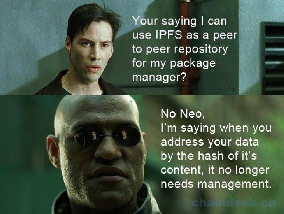

# 第九章 IPFS Weekly 9

# IPFS Weekly 9

IPFS（[`ipfs.io/`](https://ipfs.io/) ） 是一种新的超媒体分发协议，通过内容和身份进行寻址，旨在使网络更快，更安全，更开放。在这些帖子中，我们将尽量强调过去一周发生的一些发展。对于任何想要参与的人，请打开本文嵌入的超链接，在 github（[`github.com/ipfs`](https://github.com/ipfs) ） 上搜索足够的信息或在 IRC（[`webchat.freenode.net/?channels=ipfs`](https://webchat.freenode.net/?channels=ipfs) ）上加入我们。

如果您希望将此更新作为电子邮件发送，请注册我们的每周简报（[`tinyletter.com/ipfsweekly`](https://tinyletter.com/ipfsweekly) ）！

以下是 3 月 21 日和 3 月 28 日结合的一些重点内容：

## 更新

### 包管理系统

包管理系统最近一直是讨论的一个大话题。这主要是因为一些广泛使用的 npm 软件包的作者同时取消发布所有模块的问题。其中一个是`left-pad`包，它在全球成千上万的构建中使用，如果这个包被删除了，那么这些构建也就被破坏了。关于所发生事情的精彩报道在这里（[`blog.npmjs.org/post/141577284765/kik-left-pad-and-npm`](https://blog.npmjs.org/post/141577284765/kik-left-pad-and-npm) ） 。

许多人转向 IPFS，将其作为解决此问题的可能方案。使用永久文件系统，将无法取消发布。这是一篇题为“ 如何使用 IPFS 来修复 npm ”的帖子（[`amreldib.com/blog/HowToUseIpfsToFixNpm/`](https://amreldib.com/blog/HowToUseIpfsToFixNpm/) ）; 这是一个关于新的 GitHub 组织 ipmjs 的问题（[`github.com/ipmjs/ipmjs/issues/9`](https://github.com/ipmjs/ipmjs/issues/9) ），即试图找到关于如何使用永久存储系统修复 npm 的共识; 这里是一个 NPM 模块（[`www.npmjs.com/package/cowpen`](https://www.npmjs.com/package/cowpen) ），cowpen 直接发布模块 IPFS； 这是另一个使用 IPFS 和以太坊的分布式软件包管理器（[`github.com/mhhf/spore`](https://github.com/mhhf/spore) ）。

IPFS 社区长期以来一直在考虑不可变的包管理器。IPFS 本身最初是一个不可变的包管理器，它的构建使它们更容易编写。@diasdavid 有一个名为的项目`registry-mirror`，它允许你在本地运行一个 npm 注册表，该注册表由从 IPFS 而不是 NPM 直接检索的包支持。源代码在这里([`github.com/ipfs-shipyard/npm-on-ipfs`](https://github.com/ipfs-shipyard/npm-on-ipfs) )。

在类似的说明中，gx 是由@whyrusleeping 创建的 Go 包管理器，在很多关于 npm 和包管理器的讨论中也提到过，特别是在`Hacker News`上。在过去的两周里，该项目从 50 人增至 1000 人，可以看出人们现在对它非常感兴趣。

关于如何最好地使用 IPFS 作为包管理器的讨论正在进行中。

### DNS 中断

我们使用`DigitalOcean`来提供`ipfs.io DNS`。3 月 24 日星期二，DigitalOcean DNS 受到持续数小时的严重停电影响，这使得 ipfs.io 的公共网关瘫痪。我们以`ad-hoc`的方式切换到`DNSimple`，并在`DigitalOcean`仍然停机的情况下将`ipfs.io`恢复，但这一事件显然让我们错了一脚。我们将杜绝这种情况的再次发生。不依赖任何一个单节点发生故障的可能性很小。以下是我们要做的一些事情：

*   编码 DNS 区域，以及将它们上传到 DNS 提供商的工具
*   保留一个或两个备份 DNS 提供商
*   更新我们的监听和故障转移程序
    我们会在接下来的几天内在我们的博客上发布更详细的报告。

### Captain.log

嗯，你可能想检查新的 js-ipfs Captain.log 条目，伙计！
在`js-ipfs roadmap`之后，我们越来越接近一个可用的 js-ipfs 版本，它可以在浏览器和 Node.js 中使用。这将标志着 IPFS 项目的一个非常重要的里程碑，并使一整套新的分布式 Web 应用程序成为可能。如果您想参与此项工作，请查看我们的 Captain.log 条目以获取完整更新以及您可以参与的任务列表（[`github.com/ipfs/js-ipfs/issues/30#issuecomment-205884015`](https://github.com/ipfs/js-ipfs/issues/30#issuecomment-205884015) ）。

### Orbit （[`github.com/orbitdb/orbit`](https://github.com/orbitdb/orbit) ）

@haadcode 一直在努力改进`orbit-db`，`ipfs-log`和`Orbit`。消息历史记录提取现在更加稳定，并且用于加载消息的 UI 反馈是固定的。所有这些工作将改善`Orbit`的用户体验。

### js-ipfs-init

js-ipfs init 可以工作了！@noffle 本周完成剩下的部分，包括 CLI 使用。其中包括一些辅助 PR，这些辅助 PR 从该工作中逐渐消失。这使得`js-ipfsinit`进程可以生成与`go-ipfs`兼容的`IPFS repos`。

支持`zlib JavaScript`实现的字典出现了， 即 pako（[`github.com/nodeca/pako`](https://github.com/nodeca/pako) ）。

本周做出的重要贡献之一是增加了支持 zlibJavaScript 实现的“字典”`pako`。通过这一贡献，我们能够在浏览器中运行`SPDY 3.1`的框架层，即 IPFS 中使用的默认流复用库。您可以在以下问题和公关讨论中找到有关此贡献的更多信息：

*   [`github.com/nodeca/pako/issues/69`](https://github.com/nodeca/pako/issues/69)
*   [`github.com/diasdavid/js-libp2p-spdy/pull/6`](https://github.com/diasdavid/js-libp2p-spdy/pull/6)
*   [`github.com/nodeca/pako/pull/77`](https://github.com/nodeca/pako/pull/77)

### go-ipfs

@whyrusleeping 编写了一个工具，将内容从 0.4.0 移动到 0.3.11（参见 levart-emit [`github.com/whyrusleeping/levart-emit`](https://github.com/whyrusleeping/levart-emit) ）。他还在 utp 中发现了文件描述符泄漏错误，该错误会导致发生连接问题。而且他将开始研究数据存储区性能的改进工作。

`jsipfs object cli`和`http-api`端点已完成。

现在您可以按照使用`ipfs object`的相同方式使用`jsipfs object`。非常感谢 Francisco Dias，领导完成这个目标的最后阶段工作。有关开发的完整信息，请访问 github.com/ipfs/js-ipfs/issues/58。

### Nginx metrics

从 nginx 的角度来看，基础结构度量仪表板以前没有 HTTP 请求/响应度量，但是仅从 IPFS 和多重需求的角度来看。（Multireq 是我们的 v04x/v03x 多路复用代理）。Nginx 本身只通过其商业订阅提供精细化的度量。我们现在使用 mtail 来解析 nginx 访问日志中的度量并将它们公开给 Prometheus。@lgierth 还将使用 mtail 在上游贡献 nginx.mtail 程序。

## 社区

### 即将举行的会谈

4 月 20 日，IPFS 将在马萨诸塞州剑桥的麻省理工学院与 ConsenSys 举行联合会议。

### 纽约市第一次 IPFS 会议

我们在纽约举行了第一次 IPFS 聚会！它变幻莫测; 期待即将在博客上发布的帖子。

### 与 NYC Mesh 会面

@jbenet 和@lgierth 会见了`nycmesh.net`的优秀人才。在过去的两年里，他们一直在纽约市建立一个社区 Wifi 网络。我们有很多关于无线网状网络和 IPFS 的精彩对话。如果你住在纽约，你应该参加他们的聚会！

### 纽约区块链活动 ([`blockchainworkshops.org/`](https://blockchainworkshops.org/) )

上周一，IPFS comminuty 的成员参加了由 COALA 举办的区块链研讨会活动。活动地点是纽约大学商学院。主题是“过去三年一直在区块链生态系统中推动研究，政策和基础设施建设的学者，律师，技术专家和企业家之间的合作”。@diasdavid @haad @noffle 和@nginnever 参加了会议，并演讲了可扩展性和区块链技术的未来。此处将在 youtube 上提供该活动的录制内容（[`www.youtube.com/channel/UC9Lmf5FfNkSmYMoxhQh5ktA`](https://www.youtube.com/channel/UC9Lmf5FfNkSmYMoxhQh5ktA) ）。

### 里斯本研究与发展会议

IPFS 里斯本社区举办了第二届“研究与开发聚会”，由 Uniplaces（[`www.uniplaces.com）主办。重点是“分布式网络”和“机器学习+推荐算法的人工智能”`](https://www.uniplaces.com）主办。重点是“分布式网络”和“机器学习+推荐算法的人工智能”) ，分别由 David Dias 和 JoãoAscensão 讲座。如果您在里斯本附近，请务必加入[`www.meetup.com/ipfs-lisbon-meetup 以获得有关下一个的通知。可以在此处找到此演讲的资源 https://github.com/research-development-meetup/discussion/tree/master/rdm-2`](http://www.meetup.com/ipfs-lisbon-meetup 以获得有关下一个的通知。可以在此处找到此演讲的资源 https://github.com/research-development-meetup/discussion/tree/master/rdm-2) 。

### 西雅图

@whyrusleeping 在西雅图发表了一篇关于 IPFS 的演讲 - Techno-Activism 3rd Evening 。

### 比特币新闻

BitCoin 新闻讨论了使用 IPFS 和比特币实现去中心化的新闻体制。

### BitDevsNYC

Christian Lundkvist 在 BitDevsNYC 上发表了关于 IPFS 的演讲。Christian 与 ConsenSys 的 IPFS 密切合作。

本周 IPFS Meme

来自[`twitter.com/jplur_/status/712670265919086594。谢谢，jplur_！`](https://twitter.com/jplur_/status/712670265919086594。谢谢，jplur_！)

## 贡献者

在整个 IPFS GitHub 组织中，以下人员在 3 月 21 日（中午，GMT）和 3 月 28 日之间在 GitHub 提交了代码，提出问题或发表评论。以下是贡献人员列表因此，如果您的姓名不在此处，请告知我们。

@achin (Andrew Chin)
@AdamStone (Adam Stone)
@admiral-Guck (Gucky)
@alexAubin (Alexandre Aubin)
@amstocker (Andrew Stocker)
@anarcat (anarcat)
@Anthonyzou (Anthony Ou)
@area
@ARezaK
@atommixz
@Azulan (Frank Flores)
@balupton (Benjamin Lupton)
@bgrieder (Bruno Grieder)
@cb0 (Marcus Puchalla)
@chinshiketsu (Sijie Chen)
@chpio
@chriscool (Christian Couder)
@CMCDragonkai (Roger Qiu)
@ComSecNinja (Timo Virkkunen)
@darkstar (Michael D.)
@davidar (David A Roberts)
@diasdavid (David Dias)
@dignifiedquire (Friedel Ziegelmayer)
@djdv (Dominic Della Valle)
@ehmry (Emery Hemingway)
@fomkin (Aleksey Fomkin)
@gerrickw (Gerrick W)
@greenkeeperio-bot (Greenkeeper)
@haadcode (Haad)
@harlantwood (Harlan T Wood)
@hshimo (Hiroshi Shimo)
@hutenosa
@ianopolous (Ian Preston)
@iav (iav)
@ibnesayeed (Sawood Alam)
@insanity54 (Chris Grimmett)
@jbenet (Juan Benet)
@JGAntunes (João Antunes)
@jmsmcfrlnd
@josephholsten (Joseph Anthony Pasquale Holsten)
@julian-smith-code (Julian Smith)
@jwsher (Justin Sher)
@kalmi (Tarnay Kálmán)
@kevina (Kevin Atkinson)
@knocte (Andres G. Aragoneses)
@KrishnaPG (Gopalakrishna Palem)
@Kubuxu (Jakub Sztandera)
@kumavis (kumavis)
@kyledrake (Kyle Drake)
@kyrias (Johannes Löthberg)
@lgierth (Lars Gierth)
@lidel (Marcin Rataj)
@machawk1 (Mat Kelly)
@matshenricson (Mats Henricson)
@Mec-iS (Lorenzo)
@micahredding (Micah Redding)
@MichaelMure (Michael Muré)
@micxjo (Micxjo Funkcio)
@mildred (Mildred Ki’Lya)
@mitar (Mitar)
@Mithgol
@monoflash (Alex Geer)
@montagsoup
@mpgn (Martial Puygrenier)
@mrshu (Marek Šuppa)
@nginnever (Nathan Ginnever)
@nicola (Nicola Greco)
@NightRa (Ilan Godik)
@noffle (Stephen Whitmore)
@nonchip (Kyra Zimmer)
@novocodev
@palkeo (palkeo)
@pguth (Per)
@Piruzzolo
@pocketmax
@pokeball99
@polkovnikov-ph (Philip Polkovnikov)
@puffnfresh (Brian McKenna)
@rht
@RichardLitt (Richard Littauer)
@rsynnest
@sdockray
@se3000 (Steve Ellis)
@Shikibashi
@SilverWingedSeraph (Leo Tindall)
@slothbag
@Stebalien (Steven Allen)
@syang
@tadfisher (Tad Fisher)
@thomas-gardner
@tinybike (Jack Peterson)
@upfs
@voltrevo (Andrew Morris)
@whyrusleeping (Jeromy Johnson)
@willglynn (Will Glynn)
@wking (W. Trevor King)
@wmhilton (Will Hilton)
@xicombd (Francisco Baio Dias)
@xsnk (Sankrant Chaubey)
@yuvipanda (Yuvi Panda)
@Zogg

下周见，谢谢