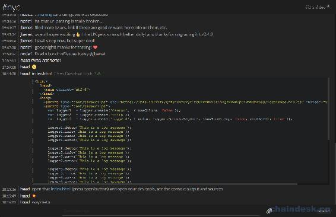
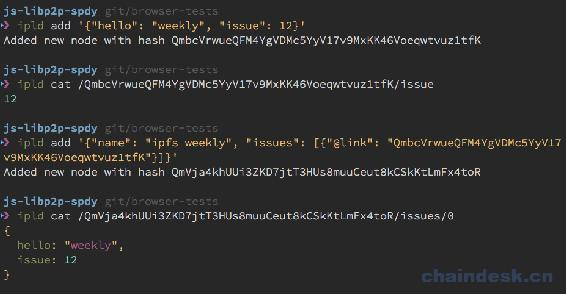
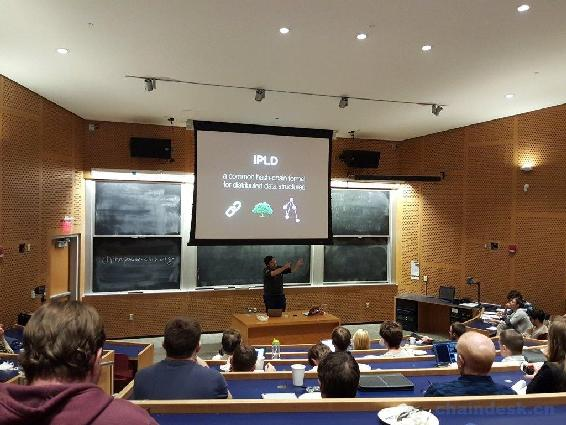

# 第十章 IPFS Weekly 10

# IPFS Weekly 10

作者：Richard Littauer，2016-05-08
翻译：张恒兴 _ 孔壹学院|CHAINDESK
QQ 群：348924182；263270946

IPFS（[`ipfs.io/`](https://ipfs.io/) ） 是一种新的超媒体分发协议，通过内容和身份进行寻址，旨在使网络更快，更安全，更开放。在这些帖子中，我们将尽量强调过去一周发生的一些发展。对于任何想要参与的人，请打开本文嵌入的超链接，在 github（[`github.com/ipfs`](https://github.com/ipfs) ） 上搜索足够的信息或在 IRC（[`webchat.freenode.net/?channels=ipfs`](https://webchat.freenode.net/?channels=ipfs) ）上加入我们。

如果您希望将此更新作为电子邮件发送，请注册我们的每周简报（[`tinyletter.com/ipfsweekly`](https://tinyletter.com/ipfsweekly) ）！

以下是 4 月 6 日至 4 月 25 日期间的一些亮点：

## 更新

0.4.0！
go-ipfs 0.4.0 已经发布！该版本对很多内容做了许多变化，包括 IPFS 通信协议的改进实施，性能的提升，IPNS（行星际命名系统）的改进，修复之前的一些 bug 以及添加了许多新功能。0.4.0 版本的 IPFS 变得更加强大。

有关详细信息，请参阅博客（[`blog.ipfs.io/14-ipfs-0-4-0-released/`](https://blog.ipfs.io/14-ipfs-0-4-0-released/) ）。

### Orbit

@haadcode 将他的所有项目升级为使用 0.4.0，使 orbit-db 和 ipfs-log 在浏览器中运行，并改进了 Orbit 的 UX。因此，改进后的 Orbit 比 0.3 以下更快更稳定！我们现在在浏览器中可以为 orbit-db 和 ipfs-log 提供可分发的工作。分发工作仍然需要一个本地守护进程才能运行，但是当 js-ipfs 发布时这种情况会发生变化。@haadcode 为 Orbit 添加了一些新功能：可以直接在聊天中预览文件，包括数据显示、音频和视频播放器，以及改进文件浏览功能。您现在还可以将文件的哈希值复制到剪贴板。它看起来像这样：


最后，@ haadcode 还创建了一个名为`logplease`的简单 JavaScript 日志记录模块，该模块可在 Node.js 和浏览器中运行。`logplease`执行两个简单的操作：将日志消息输出到控制台和/或输出到文件（仅限 Node.js），并显示具有漂亮颜色的日志消息。它是受到 log4js 和 debug 的启发得来的。

## aegir（[`github.com/ipfs/aegir`](https://github.com/ipfs/aegir) ）

AEgir 已正式发布。以前称为 dignified.js，它是我们的 JavaScript 模块的工具集。它通过标准化的测试、构建、初始化、发布和通常搭建 JS 模块的过程，极大地缩短了开发时间。它现在部署在 IPFS 上几乎所有活动的 JavaScript 项目中。查看 npm 包（[`www.npmjs.com/package/aegir`](https://www.npmjs.com/package/aegir) ）或 github repo（[`github.com/ipfs/aegir`](https://github.com/ipfs/aegir) ）。

我们还对社区 JavaScript 指南进行了全面改进，以反映这一变化，并使新开发人员更容易使用它们。

### go-libp2p 和 go-ipfs 重构

我们正在模块化 go-libp2p，目标是使用 js-ipfs 进行模块奇偶校验。这使得代码库对新手来说不那么令人生畏，并且使得维护和测试所有内容变得更加容易。

作为模块化工作的一部分，@ whyrusleeping 从 go-ipfs repo 中删除了超过 9000（没错，超过 9000）行未使用的 godeps 依赖项。它现在更容易管理，我们越来越接近纯粹的 gx 管理包。

### JS-ipld



@dignifiedquire 发布了 js-ipld 的最新版本，而且该版本现在符合最新的 IPLD 规范。此外，还创建了`js-ipfs-ipld`，它实现了在 js-ipfs 中使用 IPLD 的构建块。发布的第三个包是`js-ipfs-cli`，它为您提供了一个与 IPLD 进行交互和实验的 cli 工具。

### ipfs-blob-store v1.0.0 发布

0.4.0 中的新`Files API`([`github.com/ipfs/js-ipfs/issues/60`](https://github.com/ipfs/js-ipfs/issues/60) )带来的好处之一是,我们可以在 IPFS 之上模拟任何类型的文件系统操作，并通过这样做，可以使使用文件系统的应用程序利用 IPFS 而不需要做出任何修改。一个完美的例子是:拥有实现`abstract-blob-store`接口的模块的所有应用程序，使用`ipfs-blob-store`，以及简单的`npm install`，您就可以通过 IPFS 交换当前的`blob-store`实现。

### js-ipfs-api (现在支持 Files API)

同样，`js-ipfs-api`现在通过一个方便易用的库提供所有 Files API 的调用。

### 使 js-ipfs 和 js-libp2p 模块更加强大

@JGAntunes，@ dignifiedquire，@ nginnever，@ diasdavid 和@noffle 一直在努力将 js-ipfs 问题反馈模块([`github.com/ipfs/js-ipfs/issues?utf8=%E2%9C%93&q=is%3Aissue+coverage+dignified`](https://github.com/ipfs/js-ipfs/issues?utf8=%E2%9C%93&q=is%3Aissue+coverage+dignified) )内容变得更加详尽：带有示例和完整 API 文档的详细描述文件，以及 100％的测试覆盖率。我们在`js-peer-id`，`js-multiaddr`，`js-peer-info`，`js-ipfs-blocks` 等上进行了最后的冲刺工作！而且还有很多的模块仍然需要良好的 README 文件和文档，所以潜水的你们帮我们一把！

### go-ipfs 和 Prometheus 监控系统

我们将 Prometheus 监控系统（[`prometheus.io/docs/prometheus/latest/installation/`](https://prometheus.io/docs/prometheus/latest/installation/) ）和 go-ipfs 集成一起已经有一段时间了。如果您对它不熟悉，没关系，我大体跟您说一下。Prometheus 是一个提供监控和警报工具包的开源系统。它允许您监视各种服务、可视化仪表板中收集的指标和定义警报规则。与 Grafana 仪表板 UI 结合在一起，它将是完美的监控系统。

启动 go-ipfs 后，终端会出现打印日志暴：5001/debug/metrics/prometheus（[`localhost:5001/debug/metrics/prometheus`](http://localhost:5001/debug/metrics/prometheus) ）。
大家可以链接[`prometheus.io/docs/prometheus/latest/getting_started/`](https://prometheus.io/docs/prometheus/latest/getting_started/) ，进入 Prometheus 的“ 入门指南”，最终也会实现上边的日志记录。

### go-ipfs 和限制拨号

go-ipfs 支持使用`Swarm.AddrFilters`配置，设置限制对等节点连接到某些 IP 地址范围。以下配置示例说明了如何排除所有 IPv4 对等节点，以及所有链接本地的 IPv6 对等节点。

```go
// .ipfs/config
"Swarm": {
  "AddrFilters": [
    "/ip4/0.0.0.0/ipcidr/0",
    "/ip6/fe80::/ipcidr/64"
  ]
} 
```

## 社区

### 伯克曼中心

@jbenet 和@nicola 与伯克曼中心的研究员讨论了 IPFS。他们讨论了 IPFS 项目的核心动机，工作原理，实施状态以及 IPFS 解决的各种问题。讨论过程非常好。讨论从当今网络中存在的重要道德问题开始，继而讨论如何通过我们的网站来解决它这些问题，最后讨论如何实现 IPFS 目标。我们期待着我们社区之间更紧密的合作。非常感谢你拥有我们！

### 麻省理工学院聚会



我们在麻省理工学院首次举办了 IPFS 聚会。它由 Consensys 赞助，由麻省理工学院比特币俱乐部主办。@jbenet，@ nicola 和@CReckhow 各自进行了会谈。只要我们编辑好了视频就将其发布到 IPFS YouTube 频道，还会在博客上显示完整的文章。

### Peergos（[`github.com/Peergos/Peergos`](https://github.com/Peergos/Peergos) ）

Peergos 网络是一个去中心化的、文件存储安全的、共享的社交网络，它运用 IPFS 技术，目前工作进展非常顺利。@ianopolous 使 FUSE 绑定功能越来越接近正常工作。吞吐量并没有像他期望的所有加密和编码纠正一样糟糕，并且看起来很可能最终会成为网络 IO 绑定，而不是 CPU 限制非平凡写入。

### SpaceX 登陆

SpaceX 安装了可重复使用的 Falcon 9 助推器，这使我们更接近在火星上拥有人类殖民地。当发生这种情况时，我们打赌他们将使用 IPFS。

### 本周的内容类型

每周我们都会在[`ipfs.io 上突出显示我们在公共 HTTP-to-IPFS 网关上看到的 Content-Type`](https://ipfs.io 上突出显示我们在公共 HTTP-to-IPFS 网关上看到的 Content-Type) 。如果您正在等待下一个 Weeklies 中的一个特别有趣的 Content-Type，请通过 ipfs add -w 输入该类型的文件并从公共网关请求它来提出：[`ipfs.io/ipfs/`](https://ipfs.io/ipfs/)<hash>。</hash>

## 贡献者

在整个 IPFS GitHub 组织中，以下人员在 4 月 6 日（中午，GMT）和 4 月 25 日之间就 GitHub 提交了代码，创建问题或发表评论。如果您的姓名不在此处，请告知我们。

*   @AdamStone (Adam Stone)
*   @amstocker (Andrew Stocker)
*   @ARezaK
*   @atommixz
*   @atondwal (Anish Tondwalkar)
*   @bpcamac (Brenton Camac)
*   @c-johnson (Christopher Johnson)
*   @chriscool (Christian Couder)
*   @chrisvoncsefalvay (Chris)
*   @chungy (Mike Swanson)
*   @ComSecNinja (Timo Virkkunen)
*   @cpacia (Chris Pacia)@creckhow (Carolyn Reckhow)
*   @cusspvz (José Moreira)
*   @diasdavid (David Dias)
*   @dignifiedquire (Friedel Ziegelmayer)
*   @eboto (Erem Boto)
*   @edrex (Eric Drechsel)
*   @EliasGabrielsson (Elias Gabrielsson)
*   @eminence (Andrew Chin)
*   @fazo96 (Enrico Fasoli)
*   @felixonmars (Felix Yan)
*   @FrauBienenstich (Susanne Dewein)
*   @fzzr- (Alexander “FIZZΞR” Koz.)
*   @GitCop
*   @greenkeeperio-bot (Greenkeeper)
*   @groksie (James McFarland)
*   @haadcode (Haad)
*   @hermanjunge (Herman Junge)
*   @hutenosa
*   @ianopolous (Ian Preston)
*   @ikreymer (Ilya Kreymer)
*   @ingokeck (Ingo Keck)
*   @interfect
*   @jbenet (Juan Benet)
*   @jedahan (Jonathan Dahan)
*   @jefft0 (Jeff Thompson)
*   @jerodsanto (Jerod Santo)
*   @JGAntunes (João Antunes)
*   @kbtombul
*   @kevina (Kevin Atkinson)
*   @kevinmartinmauro
*   @krl (kristoffer)
*   @Kubuxu (Jakub Sztandera)
*   @kyledrake (Kyle Drake)
*   @lgierth (Lars Gierth)
*   @lidel (Marcin Rataj)
*   @machawk1 (Mat Kelly)
*   @mariusdarila (Marius Darila)
*   @matshenricson (Mats Henricson)
*   @mheiber (mheiber)
*   @MichaelMure (Michael Muré)
*   @micxjo (Micxjo Funkcio)
*   @mildred (Mildred Ki’Lya)
*   @mitar (Mitar)
*   @mitzip (mitzip)
*   @mrshu (Marek Šuppa)
*   @NDuma (NDuma)
*   @neko259
*   @nginnever (Nathan Ginnever)
*   @nicola (Nicola Greco)
*   @noffle (Stephen Whitmore)
*   @pfista (michael)
*   @Piruzzolo
*   @plungu (Paul Lungu)
*   @pokeball99
*   @rht
*   @RichardLitt (Richard Littauer)
*   @SCBuergel (Sebastian C. Bürgel)
*   @SilverWingedSeraph (Leo Tindall)
*   @sivachandran (Sivachandran)
*   @slang800 (Sean Lang)
*   @Stebalien (Steven Allen)
*   @sterpe (Steve Terpe)
*   @stevenh512 (Steven Hancock)
*   @TheNain38
*   @thomas-gardner
*   @traverseda (Alex Davies)
*   @upfs
*   @vijayee (Vijayee Kulkaa)
*   @vitzli
*   @whyrusleeping (Jeromy Johnson)
*   @wzhd
*   @xicombd (Francisco Baio Dias)

如果你有什么想分享的事情，请链接[`github.com/ipfs/newsletter/issues/39，在 comments 里填入你想说的内容。`](https://github.com/ipfs/newsletter/issues/39，在 comments 里填入你想说的内容。)

谢谢，下周见!