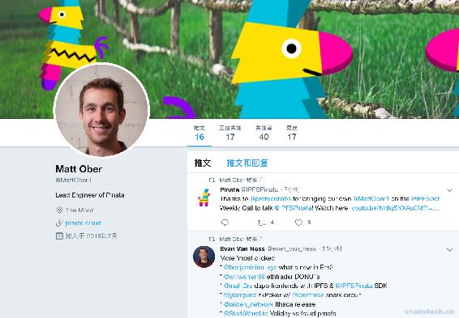
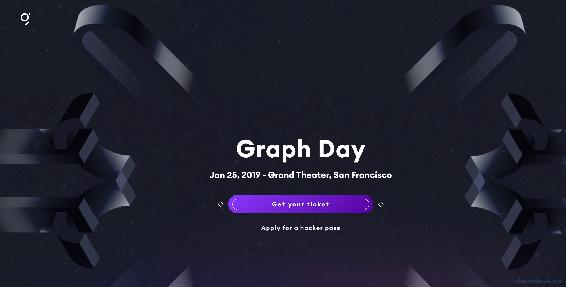

# 第二十六章 IPFS Weekly 26

# IPFS Weekly 26

作者：Jenn Turner，2018-1-22 翻译：张恒兴 _ 孔壹学院|CHAINDESK QQ 群：348924182；263270946

欢迎来到 IPFS 周刊！

IPFS 是一个新式的超媒体分发协议，数据和身份是可寻址的。IPFS 支持完全分布式的应用程序。它的目的是使让网络变得更快、更安全和更加开放。由于这是一个非常大的工程，我们将在每周期刊中跟踪整个生态系统的开发。

对于任何想要参与的人，请打开本文嵌入的超链接，在 github（[`github.com/ipfs`](https://github.com/ipfs) ） 上搜索足够的信息或在 IRC（[`webchat.freenode.net/?channels=ipfs`](https://webchat.freenode.net/?channels=ipfs) ）上加入我们。

订阅我们每周的周刊。请邮箱注册，[`tinyletter.com/ipfsnewsletter`](https://tinyletter.com/ipfsnewsletter)

## 最新动态

*   上周，`JS IPFS 0.34`发布。它较之前版本运行更加快速、程序变得更小，并可支持大的文件。它与 CID 版本及其它功能灵活的匹配，在这里阅读完整的发布说明。[`github.com/ipfs/js-ipfs/issues/1721`](https://github.com/ipfs/js-ipfs/issues/1721)

*   看看这个视频，Molly Mackinlay 的《让网络离线工作》，如果你有兴趣参加这个对话，请参加明天 1 月 23 日的工作组会议。[`www.youtube.com/watch?list=PLuhRWgmPaHtRdiy0HKNy4UZ4dKVUVL_KG&time_continue=7&v=VllPpxVNH5k`](https://www.youtube.com/watch?list=PLuhRWgmPaHtRdiy0HKNy4UZ4dKVUVL_KG&time_continue=7&v=VllPpxVNH5k)

*   即将到来的`FOSDEM 2019`学术交流会，主题是“让我们探讨下 IPFS”，令人兴奋。

*   ICYMI:介绍 ProtoSchool，了解 ProtoSchool。这是一个教育社区，通过在线教程和本地章节活动教授分散的 web 协议和工具。 视频介绍链接： [`www.youtube.com/watch?v=G5aiLkHZ7CM`](https://www.youtube.com/watch?v=G5aiLkHZ7CM)

## 认识 Matt Ober

马特·奥伯(Matt Ober)来自内布拉斯加州的奥马哈(Omaha)，在那里他花费大部分时间编写了 Pinata 的所有内容，Pinata 是 IPFS 生态系统的固定服务。Pinata 通过各种工具和 API 端点轻松管理 IPFS 上的内容。 

## IPFS 在业界

IPFS 的推特 https://twitter.com/IPFSbot ，关注最新 IPFS 内容 [`awesome.ipfs.io/categories/articles/`](https://awesome.ipfs.io/categories/articles/)

*   《区块链技术如何帮助自然灾害中的大麻回收工作》，《福布斯》2019 年 1 月 21 日

    [`www.forbes.com/sites/andrebourque/2019/01/21/how-blockchain-technology-can-help-recovery-efforts-in-natural-disasters/#3aa45d681b54`](https://www.forbes.com/sites/andrebourque/2019/01/21/how-blockchain-technology-can-help-recovery-efforts-in-natural-disasters/#3aa45d681b54) 

*   《Torrent Paradise 用 IPFS 创建分散的“海盗湾”》TorrentFreak, 2019 年 1 月 20 日

[`torrentfreak.com/torrent-paradise-creates-decentralized-pirate-bay-with-ipfs-190120/`](https://torrentfreak.com/torrent-paradise-creates-decentralized-pirate-bay-with-ipfs-190120/)

*   《建设世界上第一个 IPFS 数据中心——第一部分》2019 年 1 月 18 日

[`medium.com/@rtradetech/building-the-worlds-first-ipfs-data-center-part-1-6da08133b77c`](https://medium.com/@rtradetech/building-the-worlds-first-ipfs-data-center-part-1-6da08133b77c)

*   《IPFS VS HTTP:分布式网络如何让互联网再次伟大》Crypto Insider, 2019 年 1 月 11 日

[`cryptoinsider.com/distributed-networks-internet/`](https://cryptoinsider.com/distributed-networks-internet/) 

*   《5 步在 Ubuntu 上部署私有 IPFS 网络》2019 年 1 月 11 日。

[`medium.com/@s_van_laar/deploy-a-private-ipfs-network-on-ubuntu-in-5-steps-5aad95f7261b`](https://medium.com/@s_van_laar/deploy-a-private-ipfs-network-on-ubuntu-in-5-steps-5aad95f7261b)

*   埃及公司 Elkrem 将于 2019 年 1 月 10 日在 CES2018 上展示其顶级技术。

[`twitter.com/ElkremInc`](https://twitter.com/ElkremInc)

*   视频:《Azure 中的 IPFS》 Block Talk, 2019 年 1 月 3 日。

[`channel9.msdn.com/Shows/Blocktalk/IPFS-in-Azure`](https://channel9.msdn.com/Shows/Blocktalk/IPFS-in-Azure)

*   播客:《调用 ZaifExchange 黑客攻击和查看星际文件系统(IPFS)》Quantlayer, 2019 年 1 月 3 日。

[`medium.com/@QuantLayer/zaif-exchange-hack-and-how-we-called-it-two-months-ago-and-the-interplanetary-file-system-ipfs-532e742c4f53`](https://medium.com/@QuantLayer/zaif-exchange-hack-and-how-we-called-it-two-months-ago-and-the-interplanetary-file-system-ipfs-532e742c4f53)

*   视频:《IPFS Web 3.0 与人类文明的未来》Eric Des Courtis，2019 年 1 月 3 日

[`www.youtube.com/watch?v=xmAedcmhUvI&feature=youtu.be`](https://www.youtube.com/watch?v=xmAedcmhUvI&feature=youtu.be)

## 版本最新发布和更新

*   IPFS 集群 0.8.0 版本发布
*   Textile Photos 0.5.0 版本发布
*   IPFS 桌面客户端:Orion v1.0 版本发布
*   OneLoveDTube IPFS 上传工具 0.8.3 版本发布，包含：对移动端优化、多种分辨率视频上传支持等

## 我们的工具和项目

`Awesome IPFS`([`awesome.ipfs.io/`](https://awesome.ipfs.io/) )是一个维护和更新项目、工具列表、或几乎任何与 IPFS 相关的东西的社区，非常棒。要查看更多信息，或将您的信息添加到列表中，请访问 https://github.com/ipfs/awesome-ipfs 。

*   有人在 IPFS 上创建了一个 Udemy 课程!（链接 [`www.udemy.com/ipfs-nextgen-web-develop-deploy-integrate/`](https://www.udemy.com/ipfs-nextgen-web-develop-deploy-integrate/) 见“阅读原文”）
*   2read--将当前选项卡中的文章转换为可读格式，并将其上传到 P2P 网络(IPFS)。 [`addons.mozilla.org/en-US/firefox/addon/2read/`](https://addons.mozilla.org/en-US/firefox/addon/2read/)
*   Haven 项目--来自 OB1 的新应用程序，允许用户私下聊天、购物和发送密码。 [`bitcoinmagazine.com/articles/haven-new-app-ob1-lets-users-chat-shop-and-send-crypto-privately/`](https://bitcoinmagazine.com/articles/haven-new-app-ob1-lets-users-chat-shop-and-send-crypto-privately/)
*   PirlTube WebView 项目测试版发布了--通过浏览器访问 PirlTube 上共享的不可变和分散的视频内容，最分散的视频共享平台没有 SPF 值，完全托管在 Pirl 基础设施上 。 [`pirltube.com/ipns/QmPq5wsJx28EJaGHHxkBzbRgufVK3scJey2oM886iUQ175/#/videos`](https://pirltube.com/ipns/QmPq5wsJx28EJaGHHxkBzbRgufVK3scJey2oM886iUQ175/#/videos)
*   Nile 项目--一个分散的、免佣金的、以当地经济为中心的网上购物平台。(blockchain 免费) [`medium.com/nile-shopping/nile-954c92a56d93`](https://medium.com/nile-shopping/nile-954c92a56d93)

## 加入社区

您知道 IPFS 在 discuss.ipfs.io 上有社区论坛吗？[`discuss.ipfs.io/`](https://discuss.ipfs.io/) 注册参与有关编码，教程的讨论，查看公告和了解即将举行的社区活动。

*   2019 年 1 月 24 日:Decentralization: What Have You Done For Me Lately? (part 1 of 2)这次线下会议，不仅为开发者/设计师/营销者/工程师/企业家，还有在纽约和新泽西的“爱好者”可以过来参加。 [`secure.meetup.com/register/?ctx=ref`](https://secure.meetup.com/register/?ctx=ref)

*   2019 年 1 月 25 日:图形日最近宣布，将在加利福尼亚州旧金山的历史大剧院举行。 [`thegraph.com/graphday`](https://thegraph.com/graphday) 

*   2019 年 1 月 29-30 日:第一次阿拉贡会议阿拉贡会议将在德国柏林举行。 [`blog.aragon.org/announcing-aracon-the-aragon-conference/`](https://blog.aragon.org/announcing-aracon-the-aragon-conference/)

*   2019 年 2 月 2-3 日:指规数将是在布鲁塞尔举行的 FOSDEM 会议的一个讨论主题。加入我们! [`fosdem.org/2019/`](https://fosdem.org/2019/)

*   2019 年 2 月 6 日:Qri:由纽约人工智能医疗中心主办的“分布式网络上，最先进的开源数据科学工具”主题活动。 [`www.meetup.com/NYHAIS/events/257935451/`](https://www.meetup.com/NYHAIS/events/257935451/)

*   2019 年 3 月 2 日:2019 年全球多样性 CFP 日将在全球举办众多研讨会，鼓励和建议新演讲者将您的第一个演讲提案整合在一起，并分享您对技术人员感兴趣的任何主题的个人观点。 [`www.globaldiversitycfpday.com/`](https://www.globaldiversitycfpday.com/)

*   2019 年 5 月 17-18 日:Data Terra Nemo 是一个关于分散式协议和在其上构建的软件的技术会议。 [`dtn.is/`](https://dtn.is/)

谢谢阅读，下周见