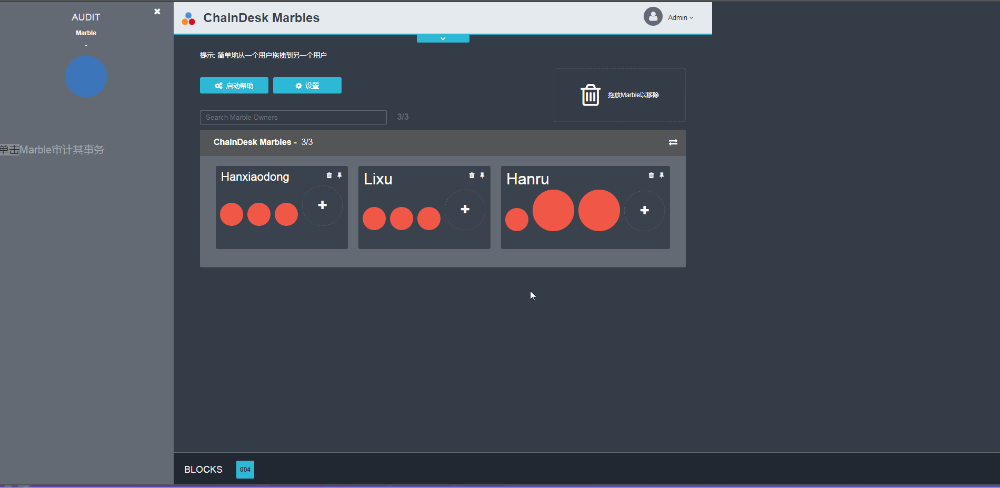
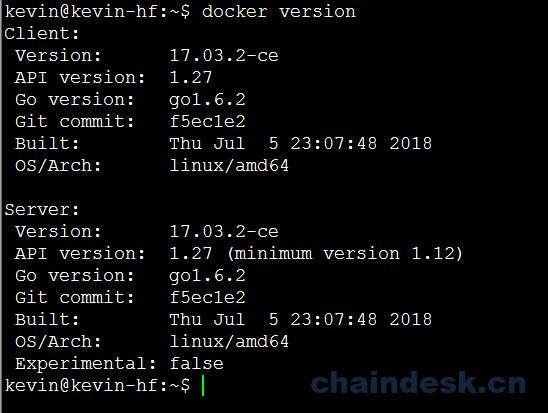
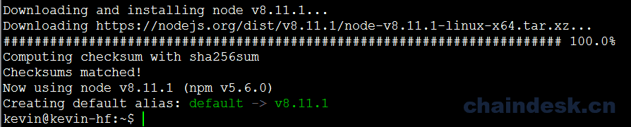
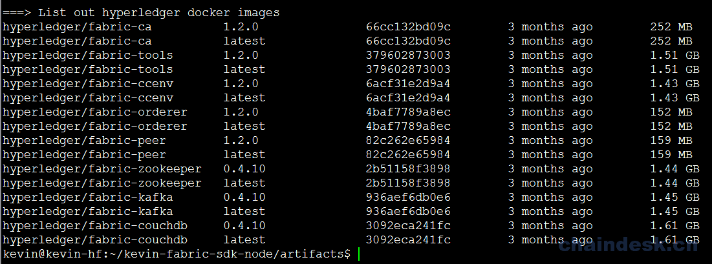
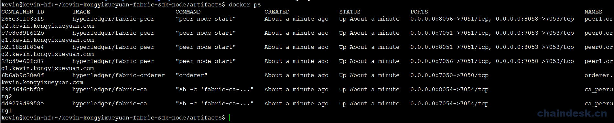

# 一、.1 网络环境搭建

## 从零到壹实现 Marbles 资产管理系统 （Fabric-SDK-Node）之－网络环境搭建

### 介绍

通过 IBM 提供的一个 Marbles 示例项目分析基于 fabric-sdk-node 的比较复杂的 web 项目的实现过程。首先我们先来看一下应用程序的实际运行效果：



此应用程序将演示如何利用 Hyperledger Fabric 在许多 Marble 所有者之间转移 Marble。 我们将在 Node.js 中使用一些 GoLang 代码完成此任务。 该应用程序的后端将在 Hyperledger Fabric 网络中运行的 GoLang 代码。 这些 GoLang 代码将称为“链代码”或“cc”。 该链代码本身会创建一个 Marble，并将其存储到链代码状态中。 该链代码本身可以将数据作为字符串存储在键/值对设置中。 因此，需要将字符串转化成为 JSON 对象，以便于在账本中存储更复杂的数据结构。

### 先决条件和安装设置:

*   **Ubuntu 16.04**
*   **Vim、[Git Client](https://git-scm.com/downloads)**
*   [Docker](https://www.docker.com/products/overview) - v17.03+
*   [Docker Compose](https://docs.docker.com/compose/overview/) - v1.8+
*   **Golang** v1.10+
*   **Node.js** v8.4.0+

#### 安装 vim、git

```js
$ sudo apt install vim
$ sudo apt install git
```

#### 安装 docker

**需要 Docker 版本 17.03.0-ce 或更高版本。**

```js
$ docker version 
$ sudo apt install docker.io
```

安装完成后执行版本查询命令

```js
$ sudo docker version
```



#### 安装 docker-compose

**docker-compose 1.8 或更高版本是必需的。**

我们目前无法一次性轻松管理多个容器。 为了解决这个问题，需要**docker-compose** 。

```js
$ docker-compose version 
$ sudo apt install docker-compose
```

安装完成后查询：

```js
$ docker-compose version 
```


将当前用户添加到 docker 组

```js
$ sudo usermod -aG docker kevin
```

添加成功后**必须注销/退出并重新登录**(如果使用的是远程连接工具，退出终端重新连接即可)

#### 安装 Golang

**需要版本 1.10.x 或更高。**如果您使用的是 Hyperledger Fabric 1.1.x 版本，那么 Golang 版本在 1.9.x 以上

```js
 $ go version 
 $ wget https://dl.google.com/go/go1.10.3.linux-amd64.tar.gz
```

> 下载受网络环境影响，如果您本地有相应的 tar.gz 包，则使用下面的命令直接解压到指定的路径下即可。

使用 tar 命令将下载后的压缩包文件解压到指定的 /usr/local/ 路径下

```js
$ sudo tar -zxvf go1.10.3.linux-amd64.tar.gz -C /usr/local/
```

设置 GOPATH & GOROOT 环境变量, 通过 `go env` 查看 GOPATH 路径

```js
$ sudo vim /etc/profile
```

> 如果只想让当前登录用户使用 Golang， 其它用户不能使用， 则编辑当前用户$HOME 目录下的 .bashrc 或 .profile 文件， 在该文件中添加相应的环境变量即可。

在 profile 文件最后添加如下内容:

```js
export GOPATH=$HOME/go
export GOROOT=/usr/local/go
export PATH=$GOROOT/bin:$PATH
```

使用 source 命令，使刚刚添加的配置信息生效：

```js
$ source /etc/profile
```

通过 go version 命令验证是否成功：

```js
$ go version
```


#### 安装 Node

**安装 nvm**

```js
$ sudo apt update
$ curl -o- https://raw.githubusercontent.com/creationix/nvm/v0.33.10/install.sh | bash

$ export NVM_DIR="$HOME/.nvm"
$ [ -s "$NVM_DIR/nvm.sh" ] && \. "$NVM_DIR/nvm.sh" 
```

**安装 Node**

```js
$ nvm install v8.11.1
```

安装完成终端输出如下信息：



也可以使用命令查看相关的版本信息：

*   检查 Node 版本

    ```js
    $ node -v
    ```

    输出: `v8.11.1`

*   检查 npm 版本

    ```js
    $ npm -v
    ```

    输出: `5.6.0`

### 配置网络环境

使用 `git` 命令从 GitHub 仓库中克隆`hf-artifacts`目录到当前登录用户的 `$HOME` 路径

```js
$ cd ~
$ git clone https://github.com/kevin-hf/hf-artifacts.git
```

修改 `hf-artifacts` 文件夹的所属关系为当前用户

```js
$ sudo chown -R kevin:kevin ./hf-artifacts
```

> 提示： kevin 为安装 Ubuntu 16.04 系统时创建的用户

重命名`hf-artifacts`为`kevin-marbles`

```js
$ mv hf-artifacts kevin-marbles
```

进入 `kevin-marbles/artifacts` 目录

```js
$ cd kevin-marbles/artifacts/
```

为了构建区块链网络，使用 `docker` 构建处理不同角色的虚拟计算机。 在这里我们将尽可能保持简单。如果确定您的系统中已经存在相关的所需容器，或可以使用其它方式获取，如果已存在相关的 docker images 镜像，则无需执行如下命令。否则请将 `artifacts` 目录下的 `pull_images.sh` 文件添加可执行权限后直接执行。

#### 下载 Docker images

```js
$ chmod 777 ./pull_images.sh
$ ./pull_images.sh 
```

> 提示：`pull_images.sh` 文件是下载 Fabric 环境所需容器的一个可执行脚本，下载过程需要一段时间（视网速情况而定），请耐心等待。
> 
> 另：请确定您的系统支持虚拟技术。

下载完成后终端输出如下：



#### 配置 docker-compose.yaml

首先，我们需要进入项目的 `artifacts` 目录下

```js
$ cd $HOME/kevin-marbles/artifacts
```

##### 创建 base.yaml 文件并编辑

```js
$ vim base.yaml
```

`base.yaml` 文件完整内容如下：

```js
version: '2'
services:
  peer-base:
    image: hyperledger/fabric-peer
    environment:
      - CORE_VM_ENDPOINT=unix:///host/var/run/docker.sock      
      - CORE_LOGGING_PEER=info
      - CORE_CHAINCODE_LOGGING_LEVEL=info
      - CORE_PEER_MSPCONFIGPATH=/etc/hyperledger/msp/peer/
      - CORE_VM_DOCKER_HOSTCONFIG_NETWORKMODE=${COMPOSE_PROJECT_NAME}_basic
      - CORE_LEDGER_STATE_STATEDATABASE=CouchDB
      - CORE_LEDGER_STATE_COUCHDBCONFIG_COUCHDBADDRESS=couchdb:5984
      - CORE_LEDGER_STATE_COUCHDBCONFIG_USERNAME=
      - CORE_LEDGER_STATE_COUCHDBCONFIG_PASSWORD=    
      - CORE_PEER_GOSSIP_USELEADERELECTION=true
      - CORE_PEER_GOSSIP_ORGLEADER=false
    working_dir: /opt/gopath/src/github.com/hyperledger/fabric
    command: peer node start
    volumes:
        - /var/run/:/host/var/run/
```

可以看到，我们在 `base.yaml` 文件中主要指定了 peer 容器相关的一些公共的环境参数，后继我们需要使用到。

##### 创建 docker-compose.yaml 文件并编辑

```js
$ vim docker-compose.yaml 
```

`docker-compose.yaml` 文件完整内容如下：

```js
version: '2'

networks:
  basic:

services:
  ca.org1.kevin.chaindesk.cn:
    image: hyperledger/fabric-ca
    environment:
      - FABRIC_CA_HOME=/etc/hyperledger/fabric-ca-server
      - FABRIC_CA_SERVER_CA_NAME=ca.org1.kevin.chaindesk.cn
      - FABRIC_CA_SERVER_CA_CERTFILE=/etc/hyperledger/fabric-ca-server-config/ca.org1.kevin.chaindesk.cn-cert.pem
      - FABRIC_CA_SERVER_CA_KEYFILE=/etc/hyperledger/fabric-ca-server-config/443a08649d8b71d5bcbe72b04147d1e9b54f1dac00a667e313a55a22497b6f07_sk
    ports:
      - "7054:7054"
    command: sh -c 'fabric-ca-server start -b admin:adminpw'
    volumes:
      - ./crypto-config/peerOrganizations/org1.kevin.chaindesk.cn/ca/:/etc/hyperledger/fabric-ca-server-config
    container_name: ca.org1.kevin.chaindesk.cn
    networks:
      - basic

  orderer.kevin.chaindesk.cn:
    container_name: orderer.kevin.chaindesk.cn
    image: hyperledger/fabric-orderer
    environment:
      - ORDERER_GENERAL_LOGLEVEL=info
      - ORDERER_GENERAL_LISTENADDRESS=0.0.0.0
      - ORDERER_GENERAL_GENESISMETHOD=file
      - ORDERER_GENERAL_GENESISFILE=/etc/hyperledger/configtx/genesis.block
      - ORDERER_GENERAL_LOCALMSPID=kevin.chaindesk.cn
      - ORDERER_GENERAL_LOCALMSPDIR=/etc/hyperledger/msp/orderer/msp
    working_dir: /opt/gopath/src/github.com/hyperledger/fabric/orderer
    command: orderer
    ports:
      - 7050:7050
    volumes:
        - ./channel/:/etc/hyperledger/configtx
        - ./crypto-config/ordererOrganizations/kevin.chaindesk.cn/orderers/orderer.kevin.chaindesk.cn/:/etc/hyperledger/msp/orderer
        - ./crypto-config/peerOrganizations/org1.kevin.chaindesk.cn/peers/peer0.org1.kevin.chaindesk.cn/:/etc/hyperledger/msp/peerOrg1
    networks:
      - basic

  peer0.org1.kevin.chaindesk.cn:
    container_name: peer0.org1.kevin.chaindesk.cn
    extends:
      file:   base.yaml
      service: peer-base
    environment:
      - CORE_PEER_ID=peer0.org1.kevin.chaindesk.cn
      - CORE_PEER_ADDRESS=peer0.org1.kevin.chaindesk.cn:7051
      - CORE_PEER_LOCALMSPID=org1.kevin.chaindesk.cn
    # command: peer node start --peer-chaincodedev=true
    ports:
      - 7051:7051
      - 7053:7053
    volumes:
        - ./crypto-config/peerOrganizations/org1.kevin.chaindesk.cn/peers/peer0.org1.kevin.chaindesk.cn/msp:/etc/hyperledger/msp/peer
        - ./crypto-config/peerOrganizations/org1.kevin.chaindesk.cn/users:/etc/hyperledger/msp/users
        - ./channel:/etc/hyperledger/configtx
    depends_on:
      - orderer.kevin.chaindesk.cn
      - couchdb
    networks:
      - basic

  couchdb:
    container_name: couchdb
    image: hyperledger/fabric-couchdb
    # Populate the COUCHDB_USER and COUCHDB_PASSWORD to set an admin user and password
    # for CouchDB.  This will prevent CouchDB from operating in an "Admin Party" mode.
    environment:
      - COUCHDB_USER=
      - COUCHDB_PASSWORD=
    ports:
      - 5984:5984
    networks:
      - basic

  cli:
    container_name: cli
    image: hyperledger/fabric-tools
    tty: true
    environment:
      - GOPATH=/opt/gopath
      - CORE_VM_ENDPOINT=unix:///host/var/run/docker.sock
      - CORE_LOGGING_LEVEL=info
      - CORE_PEER_ID=cli
      - CORE_PEER_ADDRESS=peer0.org1.kevin.chaindesk.cn:7051
      - CORE_PEER_LOCALMSPID=org1.kevin.chaindesk.cn
      - CORE_PEER_MSPCONFIGPATH=/opt/gopath/src/github.com/hyperledger/fabric/peer/crypto/peerOrganizations/org1.kevin.chaindesk.cn/users/Admin@org1.kevin.chaindesk.cn/msp
      - CORE_CHAINCODE_KEEPALIVE=10
    working_dir: /opt/gopath/src/github.com/hyperledger/fabric/peer
    command: /bin/bash
    volumes:
        - /var/run/:/host/var/run/
        - ./../chaincode/:/opt/gopath/src/github.com/
        - ./crypto-config:/opt/gopath/src/github.com/hyperledger/fabric/peer/crypto/
    networks:
        - basic
    #depends_on:
    #  - orderer.kevin.chaindesk.cn
    #  - peer0.org1.kevin.chaindesk.cn
    #  - couchdb
```

完成上面的相关配置后，我们将具有以下 `docker` 容器配置的本地网络环境：

*   1 个 CA 节点.
*   1 个 SOLO Orderer 节点
*   1 个 Peer 节点（ 所属 Org1 组织）
*   1 个 CouchDB 节点与 1 个 CLI 节点

#### Artifacts

*   Crypto 材料已使用 Hyperledger Fabric 中的**cryptogen**工具生成，并安装到所有 Peers，Orderer 节点和 CA 容器。有关加密工具的更多详细信息，请[点击此处](http://hyperledger-fabric.readthedocs.io/en/latest/build_network.html#crypto-generator)。
*   Orderer 初始区块（genesis.block）和通道配置事务（mychannel.tx）已使用 Hyperledger Fabric 中的**configtxgen**工具预生成，并放置在 `artifacts` 文件夹中。有关 `configtxgen` 工具的更多详细信息，请 [访问此处](http://hyperledger-fabric.readthedocs.io/en/latest/build_network.html#configuration-transaction-generator)。

#### 测试网络环境

为了检查网络是否正常工作，我们可以使用 `docker-compose` 命令同时启动或停止所有容器。 进入`artifacts`文件夹，运行启动或停止的相关命令。

*   启动网络

    ```js
    $ cd $HOME/kevin-marbles/artifacts
    $ docker-compose up -d
    ```

*   查看 docker 的活动容器

    ```js
    $ docker ps
    ```

    

*   关闭网络

    ```js
    $ docker-compose down
    ```

    > 注意：使用停止网络的命令时，如果没有指定对应的 yaml 文件所在路径，那么，该命令必须在 `docker-compose.yaml` 或 `docker-compose.yml` 文件所在目录下执行。