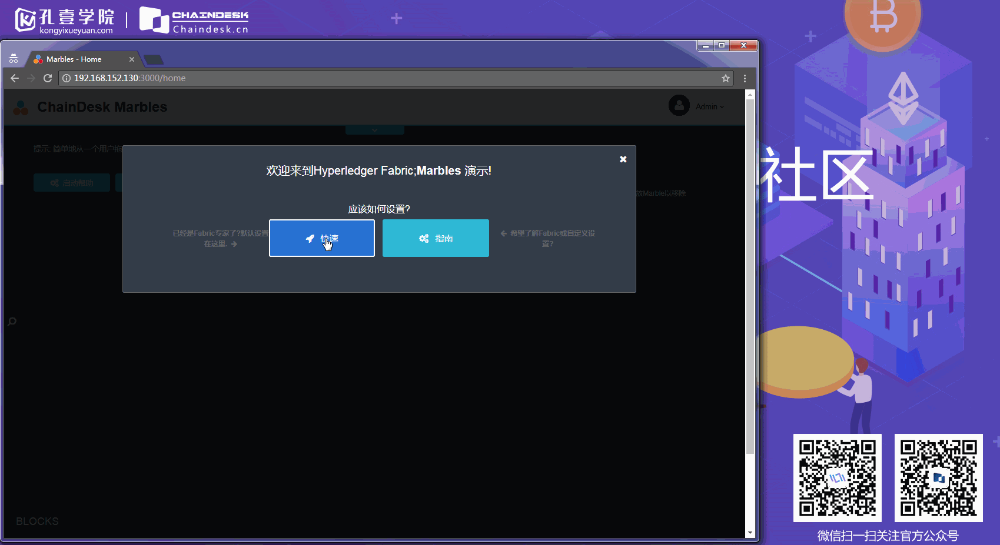
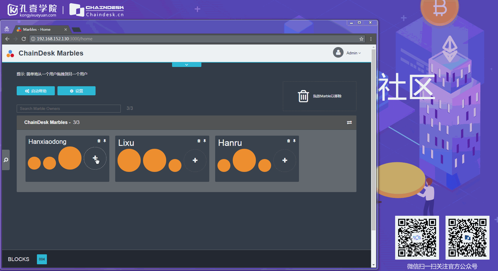
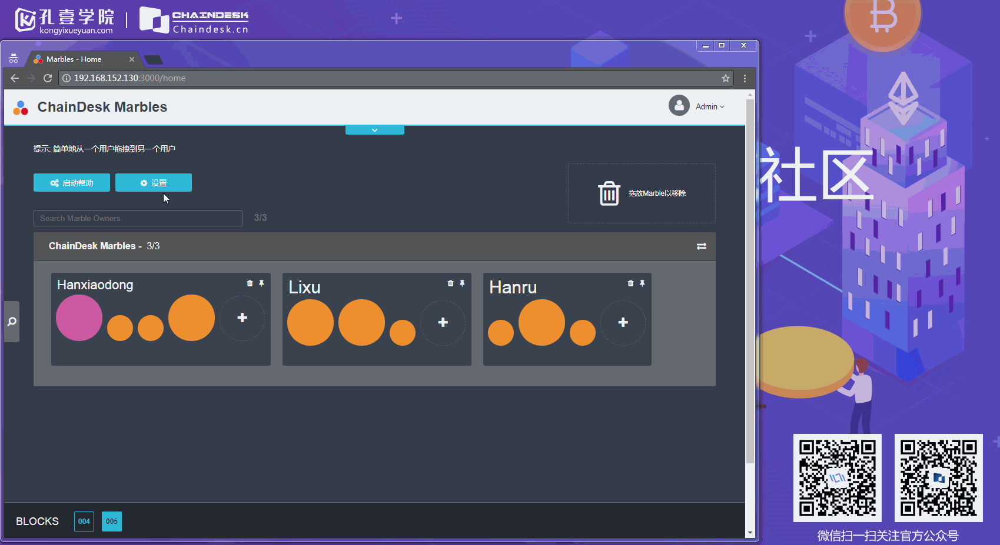
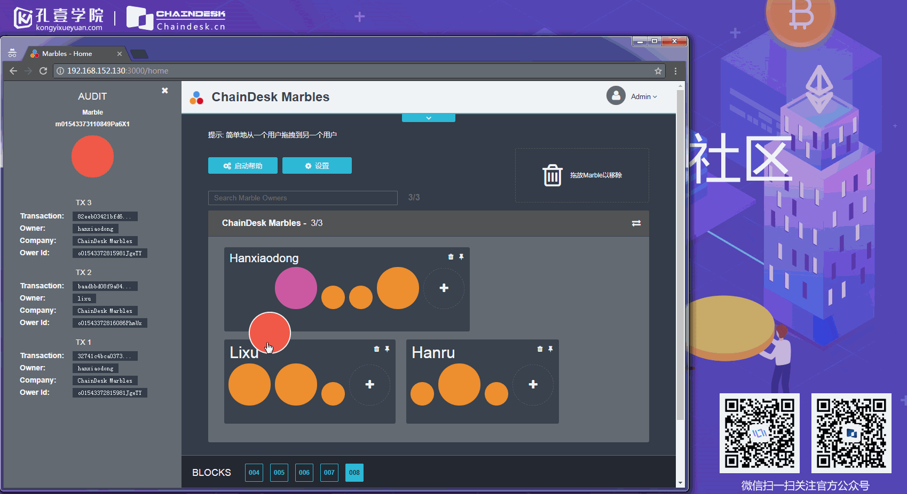
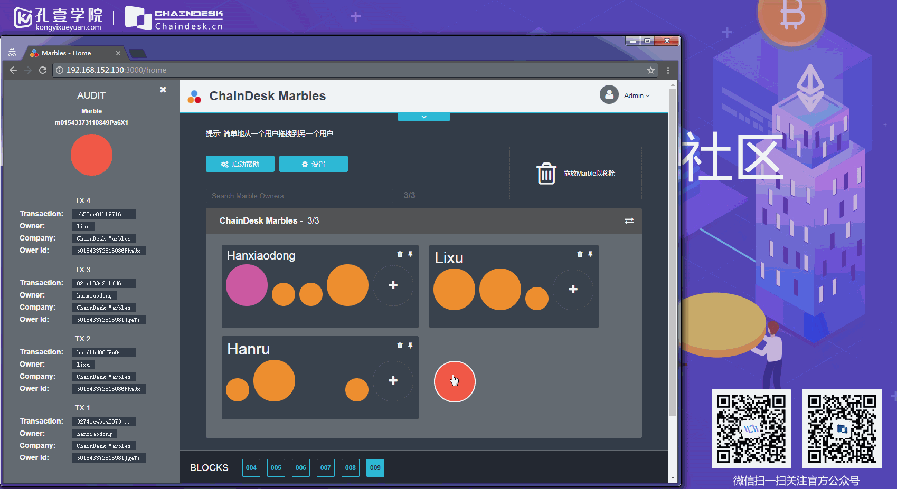

# 4.4 交互演示

## 从零到壹实现 Marbles 资产管理系统 （Fabric-SDK-Node）之－交互演示

应用启动之后，打开浏览器，在地址栏中输入：[`localhost:3000`](http://localhost:3000) 进行访问

首先进入的是应用的初始设置页面，我们可以直接点击 “快速” 按钮，让应用根据启动时指定的配置文件自动创建相关的初始数据。

初始化完毕之后，应用中有三个用户，每个用户拥有三个 Marble，我们可以对其中的用户进行创建 Marble 资产的操作

可以通过单击页面中的 “设置” 按钮，用来启用事务描述模式，

事务描述模式开启之后，就可以看到每个事务详细的执行过程：

可以将指定用户的资产转移给其他用户，直接将 Marble 拖拽到指定用户即可

也可以将指定用户的 Marble 进行删除，将指定用户拥有的 Marble 拖拽到垃圾箱中即可完成。

