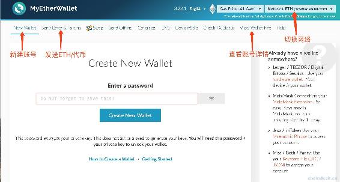
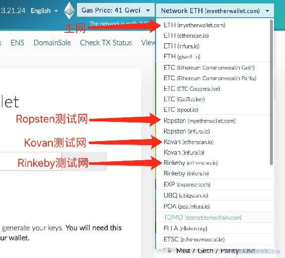
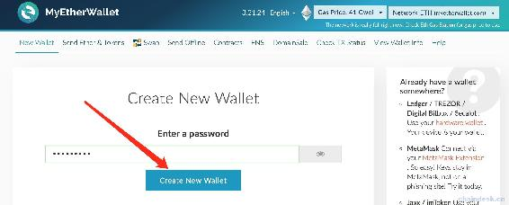
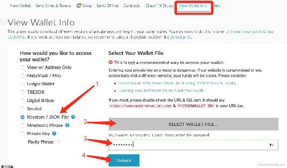
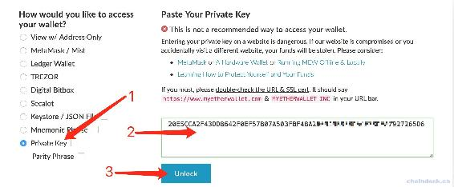
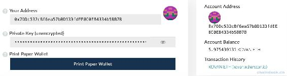
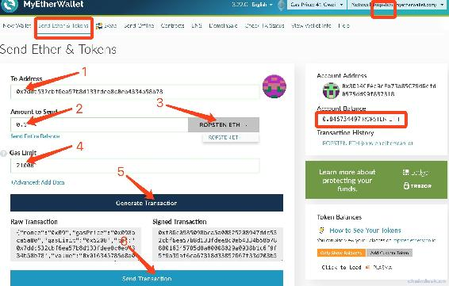
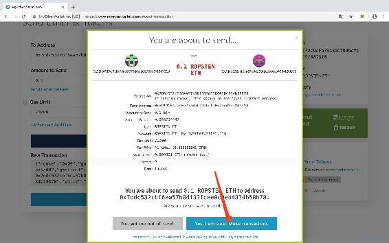
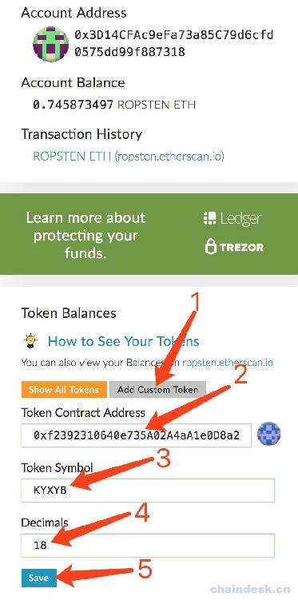
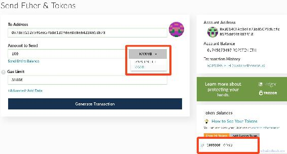

# 2.1 【以太坊钱包开发 2.1】MyEtherWallet 钱包介绍

> 本章节介绍以太坊 MyEtherWallet 钱包，了解它的重要功能以及使用方法，将以此作为咱们钱包开发需求的基础。另外还讲述了 MeatMask 钱包的总要功能，它的作用在项目开发中将作为一个不可缺少的辅助工具。

以太坊常见钱包包括：Ethereum Wallet、MyEtherWallet、MetaMask、Parity。咱们的钱包开发项目主要围绕 MyEtherWallet 钱包的相关功能进行开发，因此下面主要介绍 MyEtherWallet 的常用功能。

> MyEtherWallet 是一个轻钱包，使用起来最简单，无需下载在直接在网页上就可以完成所有的操作。在 MyEtherWallet 上生成的私钥由用户自我保管，MyEtherWallet 服务端和客户端并不会备份。支持连接所有测试网络和私有链网络。[MyEtherWallet 网址](https://www.myetherwallet.com)

打开 MyEtherWallet 的网址后，可以看到如下界面(英文不好的可以切换语言为中文)。

我们主要介绍如下功能

*   切换网络
*   创建账号
*   查看账号详情
*   发送 ETH
*   发送代币

## 一、切换网络

点击“Network”，会看到 MyEtherWallet 支持连接主网、kovan、Ropston、Rinkeby 与私有网络。

由于后面我们会演示如何转账，转账则需花费 gas，因此我们选择为测试网络，这里我们使用 kovan 测试网络。在后面的章节“搭建以太坊私有链”学习后，便可使用私有网络，私钥网络选项在网络列表最底部。

## 二、创建账号

MyEtherWallet 与 Mist 不一样，它不会保存账户列表，所以在账户模块中，只支持创建账号。

在导航栏点击“New Wallet”按钮，如下图。

需要执行的步骤如下：

1.  输入密码，注意长度不小于九位。
2.  点击“Create New Wallet”。
3.  点击“Download Keystore File”。
4.  点击“Continue”。
5.  保存显示的私钥。

用“密码”+`Keystore File`可以使用该账号，或者用“私钥”也可以使用该账号。所以一定妥善保存密码、`Keystore File`、私钥。他们之间的关系在后面的课程我们会详细介绍。

## 三、查看账号详情

查看账号详情之前，我们需要解锁账号，解锁账号的方式提供了多种。通过在上一步我们创建的账号保存了“密码、`Keystore File`、私钥”这些信息去解锁账号，下面我们介绍使用 Keystore 文件、密码这两种方式。

### 第一步：解锁账号

#### 1\. 通过 Keystore File+密码解锁

点击“View Wallet Info”按钮，然后按照如下步骤操作

1.  选择“Kystore/JSON File”
2.  选择下载的 Keystore File 文件
3.  输入创建账号时的密码
4.  点击“Unlock”解锁账号

#### 2\. 通过秘钥解锁

点击“View Wallet Info”按钮，然后按照如下步骤操作

1.  选择“Private Key”
2.  输入账号的秘钥
3.  点击“Unlock”解锁账号

### 第二步：查看账号详情

通过以上两种方式解锁成功后即可查看如下的账号详情。显示的账号详情包括：

*   账号地址
*   账号私钥
*   ETH 余额
*   代币余额（将在下一步介绍如何添加代币信息）

## 四、ETH 交易

发送 ETH 之前，我们同样需要解锁账号，解锁账号的方式与查看账号详情一样。

### 第一步：解锁账号

这里我解锁了在上一章中有 ETH 和代币余额的 Account1 账号，但是它的资金是在 Ropston 测试网络，因此使用它转账前需要经过如下步骤：

1.  切换 MyEtherWallet 的网络到 Ropston。
2.  到 Mist 客户端获取到 Account1 的 Keystore 文件，然后拷贝到桌面。
3.  到 MyEtherWallet 选择“发送 ETH”功能模块。
4.  通过 Keystore 文件+密码解锁 Account1 账号。
5.  解锁成功后即可跳转到如下的转账表单填写页面。

### 第二步：填写交易表单

按照如下步骤进行转账：

1.  填写对方账号地址。
2.  输入转账金额，如 0.1。
3.  选择币种，ETH。
4.  输入 Gas Limit，使用默认的 21000 即可。
5.  点击生成交易按钮。
6.  然后再点击显示的发送交易的按钮。

### 第三步：确认交易

点击发送交易后将会弹出交易确认的弹框，点击确定即可完成此次转账交易。

然后查看 Account1 即`0x3D1...318`账号的 ETH 余额由 0.846734497 减少到了 0.745873497，可以发现除了 0.1 外同样也会花费一定的 Gas，另外收款地址`0x7d8...C54`也会增加 0.1ETH。

## 五、添加代币及交易

在上一步“发送 ETH”的过程中可以发现，选择的币种只有 ETH，并没有可以转账的其它代币可以选择，那么如何转代币呢？

现在我们添加 Mist 钱包中发布的 KYXYB 代币到 MyEtherWallet，注意：也是在 Ropston 测试网络中。

### 第一步：获取代币合约地址

到 Mist 客户端的“Contracts”模块拷贝 KYXYB 代币的合约地址，如：`0xf23...806`。具体获取办法可以参考 Mist 钱包教程中的方法。

### 第二步：添加代币到 MyEtherWallet

到转账的表单填写界面，按照如下步骤操作添加部署的代币。

填写的数据与 Mist 客户端查看的代币合约详情保持一致。

### 第三步：选择代币进行交易

上一步点击 Save 按钮后将会自动显示刚添加的 KYXYB 代币余额。

接下来与发送 ETH 一样，填写好交易表单，最后确认交易即可完成代币转账。注意交易表单中需要选择代币 KYXYB。最后等待交易被矿工确认后该账号的余额会减少 100 个 KYXYB。

**注意**

转 ETH 成功后账号的 ETH 余额会自动刷新，但是转代币成功后不会自动刷新代币余额，需要重新解锁账号获取最新数据。

版权声明：博客中的文章版权归博主所有，未经授权禁止转载，转载请联系作者（微信：lixu1770105）取得同意并注明出处。