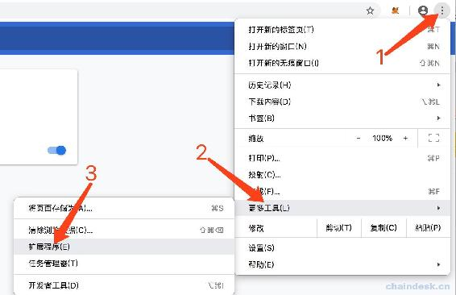

# 2.2 【以太坊钱包开发 2.2】MetaMask 钱包介绍

由于钱包开发过程中会使用到 MetaMask 插件工具辅助我们开发，所以下面主要介绍钱包开发中会使用到的 MetaMask 的部分功能。

> MetaMask 是一个基于浏览器的以太坊钱包插件，能帮助用户方便地管理自己的以太坊数字资产。不需下载安装客户端，只需添加至浏览器扩展程序即可使用，非常方便，但目前只支持 Google 和 Firefox 浏览器，并且可以很方便的调试和测试以太坊的智能合约。支持所有测试网络和私有链网络，这里介绍在 Google 中使用 MetaMask。

## 一、安装 MetaMask 基于 Google

**第一步**：进入 chrome 网上应用店。

不熟悉的可以按照如下步骤进入 chrome 网上应用店。

点击页面左上角的扩展程序。

点击页面左下角的“打开 Chrome 网上应用店”。

**第二步**：安装 MetaMask

首先在输入框输入“MetaMask”，然后在 MetaMask 后面点击“添加至 Chrom”按钮。

**第三步**：初始化 MetaMask

安装完成后将会看到浏览器右上角出现一个新图标：MetaMask 狐狸插件图标。

然后按照界面上的提示点击即可，接着会出现输入密码的页面，最少是 8 个字符，切记，切记，切记，该密码一定记住，每次重新打开 MetaMask 时都需要用该密码解锁。

接着会显示钱包的助记词，切记，切记，切记，该助记词一定不能被泄漏（下面显示的助记词只是为了演示给大家操作，实际中我并不会使用该钱包😄，别想着看里面的账号有没有钱），并且有顺序，建议记在纸上。然后界面上会让你点击该钱包的助记词，按照助记词的顺序依次点击每一个单词，如下：

最后个界面，点击“VIEW ACCOUNT”按钮即可，然后可看到 MetaMask 已经初始创建了一个账号，名称是 Account 1，连接在的主网，ETH 余额为零。

## 二、MetaMask 主界面功能介绍

打开 MetaMask 可见到如下界面，按钮数字标记分别介绍各个功能。

1.  回到主界面

2.  切换网络，支持的网络包含：

    *   主网
    *   Kovan 测试网络
    *   Ropsten 测试网络
    *   Rinkeby 测试网络
    *   本地私有网路
3.  功能菜单，主要功能有：

    *   账号列表
    *   创建账号
    *   导入账号：支持私钥导入、keystore 文件导入
    *   连接硬件钱包
    *   设置：主要功能是
        *   切换语言，支持简体中文
        *   导出助记词
4.  当前账号详情

    *   查看账号地址
    *   导出私钥
    *   ETH 余额
    *   代币列表及余额
    *   添加代币
5.  使用网页版 MetaMask

6.  当前账号简介

    6.1 账号地址

    6.2 数字货币余额

    6.3 获取数字货币

    6.4 发送数字货币

7.  交易记录

## 三、索取 ETH 测试币

由于主网上的交易需要花费 gas，这里只介绍在 Kovan 测试网络下索取以太币的步骤，其它测试网络下索取以太币的教程咱们不在此教程中详细说明。

**第一步**：打开 MetaMask，切换到 Kovan 测试网络，选择一个账号后点击下图中标记的“存入”按钮。

**第二步**：接着点击下图中标记的“获取 ETHER”按钮

**第三步**：然后会自动打开 https://github.com/kovan-testnet/faucet 网页，这里提供了两种索取的渠道。

*   通过第一种方式索取：点击上图中的链接`https://faucet.kovan.network/`，根据提示通过 Github 账号登录，然后输入需要索取以太币的账号地址，但是每 24 小时才能成功获取一次。

    
*   通过第二种方式索取：点击上图中的链接`https://gitter.im/kovan-testnet/faucet`，然后输入需要索取以太币的账号地址到群 1 或群 2 发送即可。

    

两种方式区别：

*   第一种方式会即可到账，但是每 24 小时才能成功获取一次为 1 个 ETH。
*   第二种方式需要等待群主验证再发送，等待时间不确定，一般是一天内，可获取到 3 个或 5 个 ETH。

## 四、添加 Token 代币到 MetaMask

请按照如下步骤进行添加。

*   打开 MetaMask。

*   切换到 Kovan 测试网络。

*   选择发送账号地址的账号。

*   点击左上角的功能按钮弹出账号详情。

*   按下图操作，点击“添加代币”按钮。

    
*   然后在下图中输入 KYXY 代币合约地址`0x50c9fd8e20792e2decc5e35a0c1d17a51555347b`，代币符号与精确小数点将会自动显示，若输入地址后没有自动显示，则操作有误，请重复“**第二步**：添加代币到 MetaMask”。然后点击下一步，在下一个页面按照提示点击即可。

    
*   确认拥有 KYXY 代币余额，下面的账号拥有 100KYXY。

## 五、其它

另外还有两个重要的功能：

*   ETH、Token 代币交易。
*   MetaMask+Remix 部署合约。

由于本教程的重点是钱包开发，因此对于这两个用不到的功能暂不作讲解。

**版权声明：博客中的文章版权归博主所有，未经授权禁止转载，转载请联系作者（微信：lixu1770105）取得同意并注明出处。**