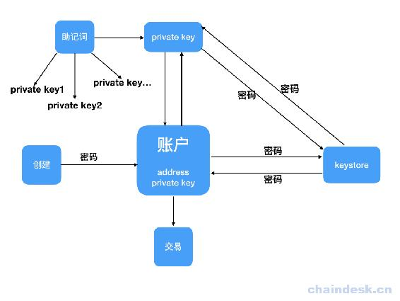

# 第四章 【以太坊钱包开发 四】密码、私钥、keystore 与助记词之间的爱恨情仇

> 在前面的教程中我们对以太坊钱包已经有了一定的认识，上一章也重点介绍了账号地址的生成过程，在以太坊钱包中一个重点就是账户系统，在这个模块中很多初学同学不是很清楚密码、keystore、助记词与私钥它们之间的关系。下面我们来看看它们之间到底有着怎样的爱恨情仇，让大家琢磨不透。

## 一、理解密码、私钥、keystore 与助记词

### 1\. 密码

密码不是私钥，密码可以进行修改或重置。它主要用途有两个，一是转账时候的支付密码，二是用 keystore 导入钱包时需要输入的密码，用于解锁 keystore。

在钱包应用程序中，创建账号时需要设定一个密码，这个密码一般要求不少于 8 个字符，为了安全，密码最好设置复杂一点。

### 2\. 私钥

私钥由 64 位长度的十六进制的字符组成，比如：`0xE4356E49C88C8B7AB370AF7D5C0C54F0261AAA006F6BDE09CD4745CF54E0115A`，一个账户只有一个私钥且不能修改，谁拥有私钥就能够掌控该账号的数字货币。通常一个钱包中私钥和公钥是成对出现的，有了私钥，我们就可以通过一定的算法生成公钥，再通过公钥经过一定的算法生成地址，这一过程都是不可逆的，是如何生成的？我们在上一章节中有详细的说明。私钥一定要妥善保管，若被泄漏别人可以通过私钥解锁账号转出你的该账号的数字货币。

在钱包应用程序中，解锁账号后可以导出私钥。

### 3\. Keystore

因为私钥不利于记忆，容易被盗，因此有了 Keystore。Keystore 常见于以太坊钱包，它并不是私钥，而是将私钥以加密的方式保存为一份 JSON 文件，这份 JSON 文件就是 keystore，所以它就是加密后的私钥。但是 Keystore 必须配合钱包密码才能使用该账号，所以只有 Keystore 文件，并不能掌控账号。对于助记词和私钥就不一样了，只要知道助记词或者私钥就能掌控该账号了。

在应用程序中，可以实现解锁账号后生成 Keystore 文件，支持的钱包有 MetaMask、Mist 等。

### 4\. 助记词

私钥是 64 位长度的十六进制的字符，不利于记录且容易记错，所以用算法将一串随机数转化为了一串 12 ~ 24 个容易记住的单词，方便保存记录。所以有的同学有了下面的结论：

*   助记词是私钥的另一种表现形式。
*   还有同学说助记词=私钥，这是不正确的说法，通过助记词可以获取相关联的多个私钥，但是通过其中一个私钥是不能获取助记词的，因此**助记词≠私钥**。

目前只有少数钱包应用程序支持导出助记词，如 MetaMask 等。通过助记词导入账号也只有少数钱包应用程序支持，如 MyEtherWallet、imToken 等。

#### BIP

要弄清楚助记词与私钥的关系，得清楚 BIP 协议，是`Bitcoin Improvement Proposals`的缩写，意思是 Bitcoin 的改进建议，用于提出 Bitcoin 的新功能或改进措施。BIP 协议衍生了很多的版本，主要有 BIP32、BIP39、BIP44。

**BIP32**

BIP32 是 HD 钱包的核心提案，通过种子来生成主私钥，然后派生海量的子私钥和地址，种子是一串很长的随机数。

**BIP39**

由于种子是一串很长的随机数，不利于记录，所以我们用算法将种子转化为一串 12 ~ 24 个的单词，方便保存记录，这就是 BIP39，它扩展了 HD 钱包种子的生成算法。

**BIP44**

BIP44 是在 BIP32 和 BIP43 的基础上增加多币种，提出的层次结构非常全面，它允许处理多个币种，多个帐户，每个帐户有数百万个地址。

在 BIP32 路径中定义以下 5 个级别：

```js
m/purpse'/coin_type'/account'/change/address_index
```

*   purpose：在 BIP43 之后建议将常数设置为 44'。表示根据 BIP44 规范使用该节点的子树。
*   Coin_type：币种，代表一个主节点（种子）可用于无限数量的独立加密币，如比特币，Litecoin 或 Namecoin。此级别为每个加密币创建一个单独的子树，避免重用已经在其它链上存在的地址。开发人员可以为他们的项目注册未使用的号码。
*   Account：账户，此级别为了设置独立的用户身份可以将所有币种放在一个的帐户中，从 0 开始按顺序递增。
*   Change：常量 0 用于外部链，常量 1 用于内部链，外部链用于钱包在外部用于接收和付款。内部链用于在钱包外部不可见的地址，如返回交易变更。
*   Address_index：地址索引，按顺序递增的方式从索引 0 开始编号。

BIP44 的规则使得 HD 钱包非常强大，用户只需要保存一个种子，就能控制所有币种，所有账户的钱包，因此由 BIP39 生成的助记词非常重要，所以一定安全妥善保管，那么会不会被破解呢？如果一个 HD 钱包助记词是 12 个单词，一共有 2048 个单词可能性，那么随机的生成的助记词所有可能性大概是`5e+39`，因此几乎不可能被破解。

#### HD 钱包

通过 BIP 协议生成账号的钱包叫做 HD 钱包。这个 HD 钱包，并不是 Hardware Wallet 硬件钱包，这里的 HD 是`Hierarchical Deterministic`的缩写，意思是分层确定性，所以 HD 钱包的全称为比特币分成确定性钱包 。

#### 以太坊对 BIP 的支持

BIP 是用于提出 Bitcoin 的新功能或改进措施，那么对于以太坊来说如何支持呢？

*   以太坊在[EIPs/issues/84](https://github.com/ethereum/EIPs/issues/84)中讨论，是否遵循 BIP32 和 BIP44，社区里提出来很多有意思的观点，比特币是基于 UTXO 的，所以可以使用 HD 钱包（BIP32）为每个交易分配一个新地址，以保护您的隐私。然而，以太坊是基于帐户，每个帐户都有一个地址，BIP 是比特币的提案，而且比特币的数据结构的设计是围绕改变地址的想法构建的，BIP 的一些提案可能并不适合以太坊。以太坊的模式和比特币 UTXO 不同，以太坊转账不能改变地址，如果在以太坊上实现 UTXO ，用户还必须签名两个交易以将余额的一部分发送到一个地址，将余额的一部分发送到第二个地址 - 这将使成本增加一倍，而且第二个交易可能不会在同一个区块中，当然以太坊也可以通过智能合约的方式实现。另外，以太坊目前官方钱包采用 KDF 的形式，也就是我们常说的 Keystore 的形式。

*   以太坊在[EIPs/issues/85](https://github.com/ethereum/EIPs/issues/85)中讨论，以太坊社区似乎也采用了 BIP32 的做法，提议 HD 路径为 : `m/44'/60'/0'/0/n`，n 是第 n 次生成地址。目前以太坊客户端实现了 BIP32 的客户端有：`Jaxx, Metamask, Exodus, imToken, TREZOR (ETH) & Digital Bitbox`。

## 二、密码、私钥、keystore 与助记词的关系

它们关系可以用下面的图来表述。在接下来的教程中我们会逐一学习如何通过代码实现下面每一条线。



## 三、钱包的核心：私钥

基于以上的分析，我们对以太坊钱包的账号系统有了一个很好的认识，那么我们在使用钱包的过程中，该如何保管自己的钱包呢？主要包含以下几种方式：

*   私钥（Private Key）
*   Keystore+密码（Keystore+Password）
*   助记词（Mnemonic code）

通过以上三种中的一种方式都可以解锁账号，然后掌控它，所以对于每种方式中的数据都必须妥善包括，如有泄漏，请尽快转移数字资产。

我们可以得到以下总结：

*   通过私钥+密码可以生成 keystore，即加密私钥；
*   通过 keystore+密码可以获取私钥，即解密 keystore。
*   通过助记词根据不同的路径获取不同的私钥，即使用 HD 钱包将助记词转化成种子来生成主私钥，然后派生海量的子私钥和地址。

可以看出这几种方式的核心其实都是为了获得私钥，然后去解锁账号，因此钱包的核心功能是私钥的创建、存储和使用。

**参考资料**

[`web3js.readthedocs.io/en/1.0/web3-eth-accounts.html`](https://web3js.readthedocs.io/en/1.0/web3-eth-accounts.html) [`github.com/bitcoin/bips/blob/master/bip-0032.mediawiki`](https://github.com/bitcoin/bips/blob/master/bip-0032.mediawiki) [`github.com/bitcoin/bips/blob/master/bip-0044.mediawiki`](https://github.com/bitcoin/bips/blob/master/bip-0044.mediawiki) [`github.com/ethereum/EIPs/issues/84`](https://github.com/ethereum/EIPs/issues/84) [`github.com/ethereum/EIPs/issues/85`](https://github.com/ethereum/EIPs/issues/85)

**版权声明：博客中的文章版权归博主所有，未经授权禁止转载，转载请联系作者（微信：lixu1770105）取得同意并注明出处。**