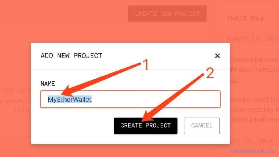

# 第六章 【以太坊钱包开发 六】Coding：生成账户的地址、私钥、keystore、助记词

## 一、使用 web3 连接到以太坊网络（测试网、主网）

### 1\. 什么是 web3

web3 是以太坊官方开提供的一个连接以太坊区块链的模块，允许您使用 HTTP 或 IPC 与本地或远程以太坊节点进行交互，它包含以太坊生态系统的几乎所有功能。web3 模块主要连接以太坊暴露出来的 RPC 层。开发者利用 web3 连接 RPC 层，可以连接任何暴露了 RPC 接口的节点，从而与区块链交互。web3 是一个集合库，支持多种开发语言使用 wbe3，其中的 JavaScript API 叫做 web3.js、另外还有 web3.py、web3j，web3.js 将是我们钱包开发项目的重点。

*   `web3.eth`：用于与以太坊区块链和智能合约之间的交互。
*   `web3.utils`：包含一些辅助方法。
*   `web3.shh`：用于协议进行通信的 P2P 和广播。
*   `web3.bzz`：用于与群网络交互的 Bzz 模块。

github 地址：[web3.js](https://github.com/ethereum/web3.js/tree/v1.0.0-beta.34)

web3.js 开发文档：：[web3.js](http://web3js.readthedocs.io/en/1.0/)

### 2\. 实例化 web3 对象

web3 要与以坊节点进行交互，需要创建一个 web3 对象，下面看看如何创建。

```js
var Web3 = require('web3');

// "Web3.providers.givenProvider" will be set if in an Ethereum supported browser.
var web3 = new Web3(Web3.givenProvider || 'ws://some.local-or-remote.node:8546');
```

根据 API 可知需要指定节点地址，我们将`ws://some.local-or-remote.node:8546`换成其它连接到以太坊网络的节点的地址，以此来确定连接的以太坊的网络。那么连接到以太坊网络的节点的地址是多少呢？这里我们需要使用到`infura`。

### 3\. 获取连接到以太坊网络的节点地址

`infura`提供公开的 Ethereum 主网和测试网络节点，到 infura.io 网站注册后即可获取各个网络的地址。请按照如下步骤获取地址。

**第一步**：打开 infura 网站地址：[`infura.io/dashboard，使用邮箱注册后登陆如下所示`](https://infura.io/dashboard，使用邮箱注册后登陆如下所示)：


**第二步**：点击上图标记的“create new project”按钮创建一个新项目。然后弹出如下弹框，在输入框输入项目名，如”MyEtherWallet“，然后点击“create project”按钮创建。



**第三步**：然后会显示如下界面，点击下图中的选择框，可以看到提供主网、Kovan 测试网络、Ropsten 测试网络、Rinkeby 测试网络的节点地址。


**第四步**：选择 Kovan 测试网络，然后复制地址，将获取到类似这样的地址：`https://kovan.infura.io/v3/d93f......cd67`，如下。


### 4\. 连接到以太坊 Kovan 测试网络

现在将复制的地址替换掉实例化 web 对象的地址，如下

```js
var Web3 = require("web3")
var web3 = new Web3(Web3.givenProvider || 'https://kovan.infura.io/v3/bc76cd31e8bf48f9a28b73770ffca805');
console.log("Web3:", Web3)
console.log("web3:", web3)
```

运行后如下所示


连接到以太坊主网与 Kovan 测试网络一样的，只需复制主网节点的地址去实例化 web3 即可。由于在主网上交易需要花费 gas，因此我们基于 Kovan 测试网络进行开发，后续开发完成后可再切换到主网。在我们开发的项目源码中，我将获取 web3 实例的代码封装到了 myUtils.js 文件的`getweb3()`方法中，用于整个项目统一调用。

## 二、获取地址、私钥、keystore、助记词

### 1\. 使用 web3 创建账号

创建账号需要使用 web3.js 的如下 API

**API**

```js
web3.eth.accounts.create([entropy]);
```

**参数**：

*   `entropy` - `String` (可选): 它是一个可选项，是一个随机字符串，将作为解锁账号的密码。如果没有传递字符串，则使用 random 生成随机字符串。

**返回值**：

Object：包含以下字段的一个帐户对象：

*   `address`- `string`：帐户地址。
*   `privateKey`- `string`：帐户私钥。前端永远不应该在 localstorage 中以未加密的方式共享或存储！
*   `signTransaction(tx [, callback])`- `Function`：签名交易的方法。
*   `sign(data)`- `Function`：签名二进制交易的方法。

**例子**

```js
web3.eth.accounts.create();
> {
    address: "0xb8CE9ab6943e0eCED004cDe8e3bBed6568B2Fa01",
    privateKey: "0x348ce564d427a3311b6536bbcff9390d69395b06ed6c486954e971d960fe8709",
    signTransaction: function(tx){...},
    sign: function(data){...},
    encrypt: function(password){...}
}

web3.eth.accounts.create('2435@#@#@±±±±!!!!678543213456764321§34567543213456785432134567');
> {
    address: "0xF2CD2AA0c7926743B1D4310b2BC984a0a453c3d4",
    privateKey: "0xd7325de5c2c1cf0009fac77d3d04a9c004b038883446b065871bc3e831dcd098",
    signTransaction: function(tx){...},
    sign: function(data){...},
    encrypt: function(password){...}
}
```

### 2\. 获取地址

使用 API`web3.eth.accounts.create()`创建了新账户后生成了一个账户对象，在该对象中拥有`address`属性，即账户的地址。

```js
let account = web3.eth.accounts.create("123456")
let address = account.address
//address：0xfF0B5A0AA68249cD161b606679DB49CBD9a12cd0
```

### 3\. 获取私钥

使用 API`web3.eth.accounts.create()`创建了新账户后生成了一个账户对象，在该对象中拥有`privateKey`属性，即账户的私钥。

```js
let account = web3.eth.accounts.create()
let privateKey = account.privateKey
//privateKey:0x348ce564d427a3311b6536bbcff9390d69395b06ed6c486954e971d960fe8709
```

### 4\. 获取 keystore

#### 方式一

在账户对象中，我们可以发现它拥有`encrypt`对象方法，声明为`encrypt: function(password){...}`，因此可以通过下面的方式去获取 keystore。

```js
let account = web3.eth.accounts.create(password)
let keystore = account.encrypt(password)
```

#### 方式二

获取 keystore 文件使用 web3.js 的如下 API

**API**

```js
web3.eth.accounts.encrypt(privateKey, password);
```

将私钥加密到 keystore 文件中。

**参数**：

*   `privateKey`- `String`：要加密的私钥。
*   `password`- `String`：用于加密的密码。

**返回值**：

Object：加密后的 keystore 文件

**例子**

```js
web3.eth.accounts.encrypt('0x4c0883a69102937d6231471b5dbb6204fe5129617082792ae468d01a3f362318', 'test!')
> {
    version: 3,
    id: '04e9bcbb-96fa-497b-94d1-14df4cd20af6',
    address: '2c7536e3605d9c16a7a3d7b1898e529396a65c23',
    crypto: {
        ciphertext: 'a1c25da3ecde4e6a24f3697251dd15d6208520efc84ad97397e906e6df24d251',
        cipherparams: { iv: '2885df2b63f7ef247d753c82fa20038a' },
        cipher: 'aes-128-ctr',
        kdf: 'scrypt',
        kdfparams: {
            dklen: 32,
            salt: '4531b3c174cc3ff32a6a7a85d6761b410db674807b2d216d022318ceee50be10',
            n: 262144,
            r: 8,
            p: 1
        },
        mac: 'b8b010fff37f9ae5559a352a185e86f9b9c1d7f7a9f1bd4e82a5dd35468fc7f6'
    }
}
```

### 5\. 使用 bip39 生成助记词

在以太坊常见钱包中，只有`MetaMask`钱包支持导出助记词，那么如何实现生成助记词呢？这就需要用到 HD 钱包。HD 钱包和 BIP 协议的相关概念请查看"04-密码、私钥、keystore 与助记词之间的爱恨情仇"章节中助记词的内容。

由于项目使用的是 web3.js 创建账号，所以这里只提供了生成助记词的示例，并没有将它集成到项目中，但是可以集成通过助记词解锁账号的功能。

下面通过 bip39 生成助记词，需要先安装`bip39`，`cd`到项目跟路径运行命令`npm i bip39`。

```js
let bip39 = require('bip39')
let mnemonic = bip39.generateMnemonic()
console.log(mnemonic)
//输出：rotate boss click maximum exercise dune diagram because only any minute monitor
```

## 三、项目源码

后端使用 web3.js 的`web3.eth.accounts.create()`方法创建账号，然后通过`account.encrypt()`方法生成 keystore 文件，提供对应的 keystore 文件与私钥给前端。

### 1\. newAccount.js

controllers 文件夹下新建 newAccount.js 文件，后端实现返回创建账号的页面与创建账户。

```js
let web3 = require("../utils/myUtils").getweb3()
let fs = require("fs")
let path = require("path")

module.exports = {
    //获取创建账号的页面
    newAccountHtml: async (ctx) => {
        await ctx.render("newaccount.html")
    },

    //创建账户的表单提交被触发的方法
    newAccount: async (ctx) => {
        console.log("password:", ctx.request.body.password)

        //1.创建钱包账号
        let account = web3.eth.accounts.create(ctx.request.body.password)
        console.log(account)

        //2.根据账号和密码生成 keystore 文件
        let keystore = account.encrypt(ctx.request.body.password)
        console.log(keystore)

        //3.将 keysotr 保存到文件
        let keystoreString = JSON.stringify(keystore)
        let time = new Date()
        let fileName = 'UTC--'+time.toISOString()+'--'+account.address.slice(2)
        console.log(fileName)
        let filePath = path.join(__dirname, "../static/keystore", fileName)
        fs.writeFileSync(filePath, keystoreString)

        //4.将账号信息返回给客户端
        await ctx.render("downloadkeystore.html", {
            "downloadurl":"/keystore/"+fileName,
            "privatekey":account.privateKey
        })
    }
}
```

### 2\. router.js

将创建账户的页面与表单提交的接口绑定到路由。

```js
......

let newAccountController = require("../controllers/newAccount")

//获取创建钱包账户的页面
router.get("/account/new.html", newAccountController.newAccountHtml)
//提交创建钱包账户的表单
router.post("/account/new", newAccountController.newAccount)
```

### 3\. newaccount.html

在 views 文件夹下新建 newaccount.html 文件，实现前端创建账户的页面。

```js
<html>

<head>
    <title>创建钱包</title>
    <script src="/js/lib/jquery-3.3.1.min.js"></script>
    <link rel="stylesheet" href="/css/wallet.css">
</head>

<body>

    <%include block/nav.html%>

    <div id="main">
        <h1>创建一个新的账号</h1>
        <form method="POST" action="/account/new">
            <input type="text" placeholder="请输入密码" name="password">
            <button type="submit">创建账号</button>
        </form>
    </div>
</body>

</html>
```

### 4\. downloadkeystore.html

在 views 文件夹下新建 downloadkeystore.html 文件，实现前端将创建后的账号信息提供给用户保存下来，如 keystore 文件、私钥。

```js
<html>

<head>
    <title>保存你的 keystore</title>
    <script src="/js/lib/jquery-3.3.1.min.js"></script>
    <script src="/js/lib/jquery.url.js"></script>
    <script src="/js/wallet.js"></script>
    <link rel="stylesheet" href="/css/wallet.css">
</head>

<body>

    <%include block/nav.html%>

    <div id="main">
        <div id="save-keystore">
            <h1>保存你的 keystore</h1>
            <a class="button" href="<%= downloadurl %>">下载 keystore 文件</a>
            <br><br>
            <button onclick="saveKeystoreNext()">下一步</button>
        </div>
        <div id="save-privatekey" style="display: none">
            <h1>保存你的私钥</h1>
            <div>
                <%= privatekey %>
            </div>
        </div>
    </div>

</body>

</html>
```

### 5\. wallet.js

编辑 static 文件夹下的 wallet.js 文件，实现隐藏 keystore 下载页面，显示私钥。

```js
function saveKeystoreNext() {
    $("#save-keystore").hide()
    $("#save-privatekey").show()
}
```

## 四、项目运行效果


**[项目源码 Github 地址](https://github.com/lixuCode/MyEtherWallet)**

**版权声明：博客中的文章版权归博主所有，未经授权禁止转载，转载请联系作者（微信：lixu1770105）取得同意并注明出处。**