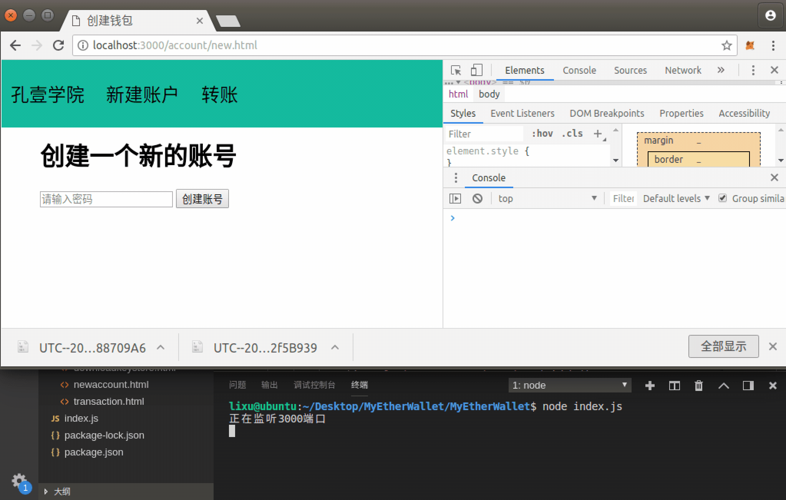

# 第七章 【以太坊钱包开发 七】解锁钱包账号姿势一：私钥

## 一、储备知识

### 1\. 使用 web3 通过私钥解锁账号

通过私钥解锁账号需要使用 web3.js 的如下 API

**API**

```js
web3.eth.accounts.privateKeyToAccount(privateKey);
```

**参数**：

*   `privateKey`- `String`：要解锁账号的私钥。

**返回值**：

Object：一个帐户对象。

**例子**

```js
web3.eth.accounts.privateKeyToAccount('0x348ce564d427a3311b6536bbcff9390d69395b06ed6c486954e971d960fe8709');
> {
    address: '0xb8CE9ab6943e0eCED004cDe8e3bBed6568B2Fa01',
    privateKey: '0x348ce564d427a3311b6536bbcff9390d69395b06ed6c486954e971d960fe8709',
    signTransaction: function(tx){...},
    sign: function(data){...},
    encrypt: function(password){...}
}
```

### 2\. 使用 web3 获取以太币余额

获取以太币余额需要使用 web3.js 的如下 API

**API**

```js
web3.eth.getBalance(address [, defaultBlock] [, callback])
```

**参数**：

*   `address`-`String`：获取以太币余额的账号地址。
*   `defaultBlock`-`Number|String`：（可选）如果传递此参数，则不会使用[web3.eth.defaultBlock](https://web3js.readthedocs.io/en/1.0/web3-eth.html#eth-defaultblock)设置的默认块。
*   `callback`-`Function`：（可选）回调函数，将错误对象作为第一个参数返回，结果作为第二个参数返回。

**返回值**：

`Promise`：返回`String`：给定地址的当前余额，以 wei 为单位。

**例子**

```js
web3.eth.getBalance("0x407d73d8a49eeb85d32cf465507dd71d507100c1")
.then(console.log);
> "1000000000000"
```

### 3\. 将 wei 为单位的余额数据转换为 ether

在代码中的计算都是以最小单位（wei）进行计算，在需要显示余额数据时才将它进行转换为单位 ether。需要使用 web3.js 的如下 API

**API**

```js
web3.utils.fromWei(number [, unit])
```

**参数**：

*   `number` - `String|Number|BN`：需要将 wei 转账的单位。可能的单位包含：
    *   `wei`: ‘1’
    *   `kwei`: ‘1000’
    *   `mwei`: ‘1000000’
    *   `gwei`: ‘1000000000’
    *   `micro`: ‘1000000000000’
    *   `finney`: ‘1000000000000000’
    *   `ether`: ‘1000000000000000000’
    *   `kether`: ‘1000000000000000000000’
    *   `mether`: ‘1000000000000000000000000’
    *   `gether`: ‘1000000000000000000000000000’
    *   `tether`: ‘1000000000000000000000000000000’
*   `unit`- `String`（可选）：默认为`"ether"`。

**返回值**：

`String|BN`：如果传入一个数字或字符串，则返回一个数字字符串，否则返回一个[BN.js](https://github.com/indutny/bn.js/)实例。

**例子**

```js
web3.utils.fromWei('1', 'ether');
> "0.000000000000000001"

web3.utils.fromWei('1', 'finney');
> "0.000000000000001"
```

## 二、项目源码

为了简化前端项目，将前端解锁账号的业务功能融合在了转账业务功能中，并没有另外单独放在一个模块，但是并不会影响后端的实现。因此下面先实现转账的解锁页面再实现解锁功能。

### 1\. transaction.js

controllers 文件夹下新建 transaction.js 文件，后端实现返回转账页面给前端。

```js
module.exports = {
    transactionHtml: async (ctx) => {
        await ctx.render("transaction.html")
    },
}
```

### 2\. account.js

controllers 文件夹下新建 account.js 文件，后端实现通过私钥解锁账户，并返回以太币余额、账户地址、私钥给前端。

```js
let { success, fail } = require("../utils/myUtils")
let web3 = require("../utils/myUtils").getweb3()

//获取以太币余额
async function getAccountBalance(address) {
    let balance = await web3.eth.getBalance(address)
    return web3.utils.fromWei(balance, "ether")
}

//配置返回给前端的数据，包含以太币的数据，还会有 Token 的数据
async function setResponseData(account) {
    //获取账户余额
    let balance = await getAccountBalance(account.address)
    console.log(balance)

    let resData = success({
        balance: balance,
        address: account.address,
        privatekey: account.privateKey
    })

    //返回相应数据给前端
    return resData
}

module.exports = {
    unlockAccountWithPrivate: async (ctx) => {
        //１．获取私钥
        let privatekey = ctx.request.body.privatekey
        console.log(privatekey)
        //2.通过私钥解锁账户
        let account = web3.eth.accounts.privateKeyToAccount(privatekey)
        console.log(account)
        //３．将账户信息返回给前端
        ctx.body = await setResponseData(account)
    },
}
```

### 3\. router.js

将获取转账的页面的接口和通过私钥解锁账户的接口绑定到路由。

```js
......

let trasactionConytoller = require("../controllers/transaction")
let accountController = require("../controllers/account")

//获取转账的页面
router.get("/transaction.html", trasactionConytoller.transactionHtml)

//通过私钥解锁账户
router.post("/unlock/private", accountController.unlockAccountWithPrivate)
```

### 4\. transaction.html

在 views 文件夹下新建 transaction.html 文件，实现前端转账的第一步：通过私钥解锁账号的页面。

```js
<html>

<head>
    <title>转账</title>
    <script src="/js/lib/jquery-3.3.1.min.js"></script>
    <script src="/js/lib/jquery.url.js"></script>
    <script src="/js/wallet.js"></script>
    <link rel="stylesheet" href="/css/wallet.css">
</head>

<body>

    <%include block/nav.html%>

    <div id="main">
        <h1>发送以太币或者 Token 代币</h1>
        <div id="transaction-first">

            <input type="radio" id="unlock-account-type-privatekey" name="unlocktype" value="1">
            <label for="unlock-account-type-privatekey">private key</label>
            <br>
            <input type="radio" id="unlock-account-type-keystore" name="unlocktype" value="2">
            <label for="unlock-account-type-keystore">keystore</label>
            <br>
            <input type="radio" id="unlock-account-type-mnemonic" name="unlocktype" value="3">
            <label for="unlock-account-type-mnemonic">Mnemonic Phrase</label>
            <br>

            <div id="unlock-account-privatekey" style="display: none">
                <h3>请输入你的私钥</h3>
                <textarea id="input-privatekey" rows="3"></textarea>
                <br>
                <button onclick="unlockAccountWithPrivatekey()">解锁</button>
            </div>

            <div id="unlock-account-keystore" style="display: none">
            </div>

            <div id="unlock-account-mnemonic" style="display: none">
            </div>
        </div>

        <div id="transaction-second" style="display: none">
        </div>
    </div>
</body>

</html>
```

### 5\. wallet.js

编辑 static 文件夹下的 wallet.js 文件，前端处理切换解锁账号的方式的页面显示与通过私钥解锁账户的网络请求。

```js
......

//通过私钥解锁账户
function unlockAccountWithPrivatekey() {
    let privatekey = $("#input-privatekey").val()
    console.log(privatekey)
    $.post("/unlock/private", `privatekey=${privatekey}`, function (res, status) {
        console.log(status + JSON.stringify(res))
        if (res.code == 0) {
            //将服务端返回的账户信息显示到页面
            //configAccountInfo(res.data)
        } 
    })
}

$(document).ready(function () {
    //改变了解锁账号的方式
    $("input[name=unlocktype]").change(function () {
        if (this.value == 1) {
            $("#unlock-account-privatekey").show()
            $("#unlock-account-keystore").hide()
            $("#unlock-account-mnemonic").hide()
        } else if (this.value == 2) {
            $("#unlock-account-privatekey").hide()
            $("#unlock-account-keystore").show()
            $("#unlock-account-mnemonic").hide()
        } else {
            $("#unlock-account-privatekey").hide()
            $("#unlock-account-keystore").hide()
            $("#unlock-account-mnemonic").show()
        }
    })
}) 
```

## 三、项目运行效果



**[项目源码 Github 地址](https://github.com/lixuCode/MyEtherWallet)**

**版权声明：博客中的文章版权归博主所有，未经授权禁止转载，转载请联系作者（微信：lixu1770105）取得同意并注明出处。**