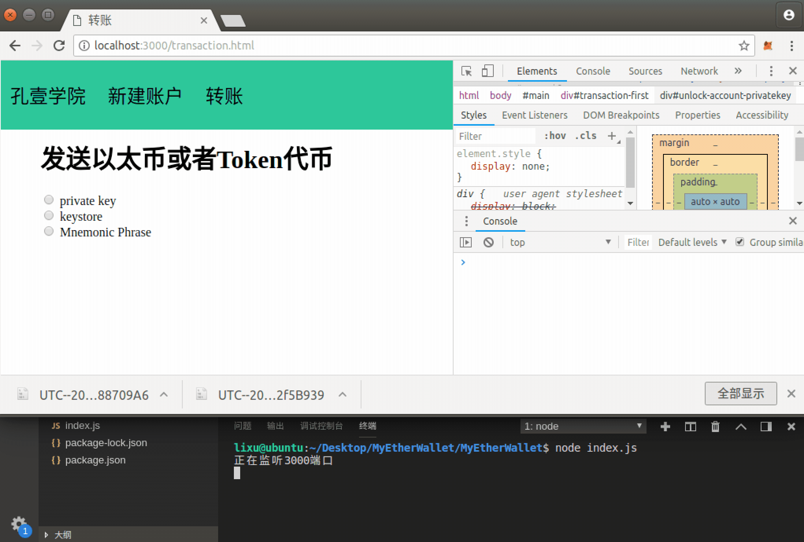

# 第八章 【以太坊钱包开发 八】解锁钱包账号姿势二：keystore+密码

## 一、储备知识

### 使用 web3 通过 keystore+密码解锁账号

通过 keystore+密码解锁账号需要使用 web3.js 的如下 API，相当于解密 keystore。

**API**

```js
web3.eth.accounts.decrypt(keystoreJsonV3, password);
```

**参数**：

*   `keystoreJsonV3` - `String`: 要解密私钥的 keystore。

*   `password` - `String`: 加密 keystore 文件的密码，一般为创建账号时的密码。

**返回值**：

Object：解密的帐户对象。

**例子**

```js
web3.eth.accounts.decrypt({
    version: 3,
    id: '04e9bcbb-96fa-497b-94d1-14df4cd20af6',
    address: '2c7536e3605d9c16a7a3d7b1898e529396a65c23',
    crypto: {
        ciphertext: 'a1c25da3ecde4e6a24f3697251dd15d6208520efc84ad97397e906e6df24d251',
        cipherparams: { iv: '2885df2b63f7ef247d753c82fa20038a' },
        cipher: 'aes-128-ctr',
        kdf: 'scrypt',
        kdfparams: {
            dklen: 32,
            salt: '4531b3c174cc3ff32a6a7a85d6761b410db674807b2d216d022318ceee50be10',
            n: 262144,
            r: 8,
            p: 1
        },
        mac: 'b8b010fff37f9ae5559a352a185e86f9b9c1d7f7a9f1bd4e82a5dd35468fc7f6'
    }
}, 'test!');
> {
    address: "0x2c7536E3605D9C16a7a3D7b1898e529396a65c23",
    privateKey: "0x4c0883a69102937d6231471b5dbb6204fe5129617082792ae468d01a3f362318",
    signTransaction: function(tx){...},
    sign: function(data){...},
    encrypt: function(password){...}
}
```

## 二、项目源码

通过 keystore+密码解锁账号。

### 1\. account.js

编辑 controllers 文件夹下的 account.js 文件，后端实现通过 keystore+密码解锁账号。

```js
......

let fs = require("fs")

module.exports = {
    ......

    unlockAccountWithKeystore: async (ctx) => {
        //1.　获取前端传递的数据，包括 keystore、密码
        let password = ctx.request.body.password
        console.log(password)
        let keystore = ctx.request.files.file
        console.log(keystore)
        //2.读取缓存文件中 keystore 的数据
        let keystoreData = fs.readFileSync(keystore.path, "utf8")
        console.log(keystoreData)
        //3\. 通过 keystore 和密码解锁账户
        let account = web3.eth.accounts.decrypt(JSON.parse(keystoreData), password)
        console.log(account)
        //４．将账户信息返回给前端
        ctx.body = await setResponseData(account)
    },
} 
```

### 2\. router.js

将通过 keystore 解锁账户的接口绑定到路由。

```js
......

//通过 keystore 解锁账户
router.post("/unlock/keystore", accountController.unlockAccountWithKeystore)
```

### 3\. transaction.html

编辑 views 文件夹下的 transaction.html 文件，实现前端通过 keystore+密码解锁账户的页面。

```js
<div id="unlock-account-keystore" style="display: none">
    <h3>请选择你的 keystore 文件</h3>
    <input type="file" id="unlock-accoutn-file">
    <br><br>
    <input type="password" id="unlock-account-password">
    <br><br>
    <button onclick="unlockAccountWithKeystore()">解锁</button>
</div>
```

### 4\. wallet.js

编辑 static 文件夹下的 wallet.js 文件，前端处理通过通过 Keystore 文件+密码解锁账户的网络请求。

```js
......

//通过 Keystore 解锁账户
function unlockAccountWithKeystore() {
    var filedata = $("#unlock-accoutn-file").val()
    if (filedata.length <= 0) {
        alert("请选择文件!")
        return
    }
    //文件上传通过 Formdata 去储存文件的数据
    var data = new FormData()
    data.append("file", $("#unlock-accoutn-file")[0].files[0])
    data.append("password", $("#unlock-account-password").val())
    var urlStr = "/unlock/keystore"
    $.ajax({
        url: urlStr,
        type: "post",
        dataType: "json",
        contentType: false,
        data: data,
        processData: false,
        success: function (res, status) {
            alert(JSON.stringify(res)+status)
            if (res.code == 0) {
                //将服务端返回的账户信息显示到页面
                //configAccountInfo(res.data)
            } 
        },
        error: function (res, status) {
            alert(JSON.stringify(res)+status)
        }
    })
}
```

## 三、项目运行效果



**[项目源码 Github 地址](https://github.com/lixuCode/MyEtherWallet)**

**版权声明：博客中的文章版权归博主所有，未经授权禁止转载，转载请联系作者（微信：lixu1770105）取得同意并注明出处。**