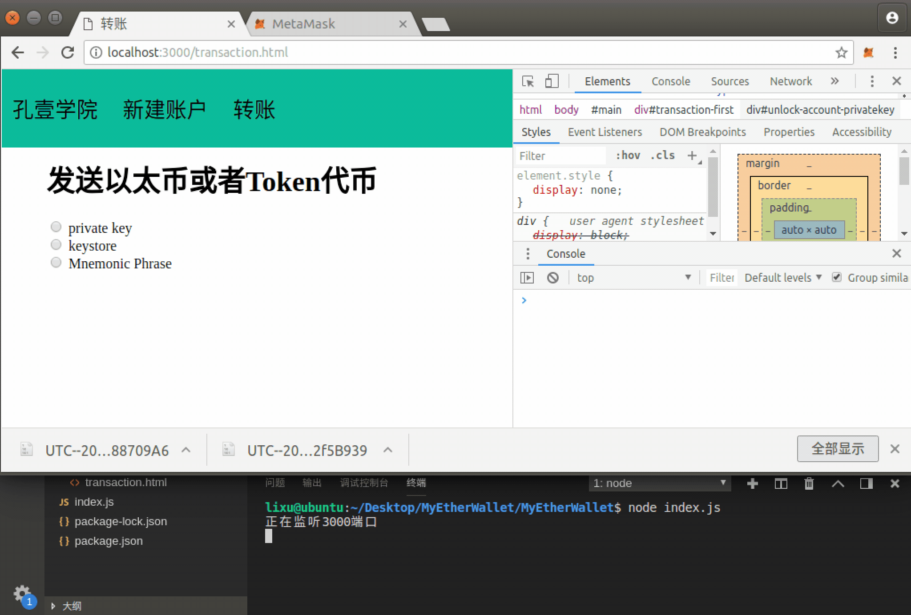

# 第九章 【以太坊钱包开发 九】解锁钱包账号姿势三：助记词

## 一、通过助记词获取所有关联的账号：公钥、私钥、地址

需要使用`bip39`协议将助记词转换成种子，再通过`ethereumjs-wallet`库生成 hd 钱包，根据路径的不同从 hd 钱包中获取不同的 keypair，keypair 中就包含有公钥、私钥，再通过`ethereumjs-util`库将公钥生成地址，从而根据助记词获取所有关联的账号，能获取到公钥、私钥、地址等数据信息。

可见助记词可以获取多个账号私钥，它比私钥重要性更高，必须妥善保管。

HD 钱包和 BIP 协议的相关概念请查看"04-密码、私钥、keystore 与助记词之间的爱恨情仇"章节中助记词的内容。

#### 1\. 依赖库

需要用到三个库：bip39、ethereumjs-wallet/hdkey、ethereumjs-util。先安装依赖库，`cd`到项目跟路径运行命令`npm i bip39 ethereumjs-wallet ethereumjs-util`。

*   [bip39](https://github.com/bitcoinjs/bip39)：随机产生新的 mnemonic code，并可以将其转成 binary 的 seed。

*   [ethereumjs-wallet](https://github.com/ethereumjs/ethereumjs-wallet)：生成和管理公私钥，下面使用其中 hdkey 子套件来创建 HD 钱包。

*   [ethereumjs-util](https://github.com/ethereumjs/ethereumjs-util)：Ethereum 的一个工具库。

#### 2\. 代码示例

```js
let bip39 = require('bip39')
let hdkey = require('ethereumjs-wallet/hdkey')
let util = require('ethereumjs-util')

//npm install bip39 ethereumjs-wallet ethereumjs-util
// https://iancoleman.io/bip39/ 验证结果

// 1.生成助记词
let mnemonic = bip39.generateMnemonic()
console.log(mnemonic)

//2.将助记词转成 seed
let seed = bip39.mnemonicToSeed(mnemonic)
console.log("seed：" + util.bufferToHex(seed))

//3.通过 hdkey 将 seed 生成 HD Wallet
let hdWallet = hdkey.fromMasterSeed(seed)

for (let i = 0; i < 10; i++) {
    //4.生成钱包中在 m/44'/60'/0'/0/i 路径的 keypair
    let key = hdWallet.derivePath("m/44'/60'/0'/0/" + i)
    //5.从 keypair 中获取私钥
    console.log("私钥：" + util.bufferToHex(key._hdkey._privateKey))
    //6.从 keypair 中获取公钥
    console.log("公钥：" + util.bufferToHex(key._hdkey._publicKey))
    //7.使用 keypair 中的公钥生成地址
    let address = util.pubToAddress(key._hdkey._publicKey, true)
    //编码地址
    address = util.toChecksumAddress(address.toString('hex'))
    console.log("地址：" + address,"\n")
}
```

#### 3\. 输出

```js
lixu@ubuntu:~/Desktop/demo/test$ node index.js
time voyage seven believe muscle trumpet later breeze pool fiscal sibling ribbon
seed：0x626f88b9b4cbb2ed80add9c4e55ca55adbaac00e92c64d928b28ec9de7e28123f1af597f4b51fc038b9c5e8fda2c7de72247eeda8de4b5af62780532022daba6
私钥：0x2798514577bba989dffe72dd123463a65900364155a3c1e62dde505958dc3a51
公钥：0x035988bc5e8e1d131013dc1d23512df7e0c4a69dfacef5f32d703da08329fd5a64
地址：0xbE0BbaBc3a715c63819D95A6C44A1491F95556CC

私钥：0x58f10113e17d4174b83155d5964bae42f8f0d29b72a43640a6e64c455d8de4a4
公钥：0x03b72425de3522df8bd806ec6f6522365db089fca744e009a02bdef21d1b9ebbce
地址：0xaC6971406c4875395e872Bf31C2D66F037719F2f

私钥：0xbc0c6cb947ae40720b0f9528f44fee327d934f2d6033e59e30500b2ae7a35957
公钥：0x039ae6575ad989deacc3508acd4be6e3b0b251986f1e09f29e239f271e45cbcbd1
地址：0xDc0d11A2Db3fC7C5c8213b876c13B742DC6a13f3

......

私钥：0x7eda34db3e6ad7174c85588263e5cd5cef76472c3f6102ace44687775b775d61
公钥：0x02154b7c8a4911f66f3b528f0e3976f67369a7525d5b4d23bd7a314274cdd6f190
地址：0x599f3e52979b8d4Ab1Ff40637fA6fE5A2caBD4c1

lixu@ubuntu:~/Desktop/demo/test$
```

#### 4\. 验证助记词

打开 https://iancoleman.io/bip39/网站输入上面生成的助记词`time voyage seven believe muscle trumpet later breeze pool fiscal sibling ribbon`，选择 ETH 币种，路径将会是`m/44'/60'/0'/0/n`，将会查询到管理的账号列表包含上面获取的账号。


## 二、项目源码

通过助记词解锁账号。

注意这里为了简化前端实现过程，故只获取了助记词的第一对公私钥，即"m/44'/60'/0'/0/0"，在实际开发工作中需枚举路径"m/44'/60'/0'/0/0"的最后一位 0，可继续取值为 0,1,2,3,4……

### 1\. mnemonic.js

在 models 文件夹下新建 mnemonic.js 文件，实现通过助记词与路径获取相应的私钥。

需要用到三个库：bip39、ethereumjs-wallet/hdkey、ethereumjs-util。

```js
let bip39 = require('bip39')
let hdkey = require('ethereumjs-wallet/hdkey')
let util = require('ethereumjs-util')

module.exports = {
    getPrivatekeyWithMnemonic: (mnemonic, derivePath) => {
        //将助记词转成 seed
        let seed = bip39.mnemonicToSeed(mnemonic)
        //通过 hdkey 将 seed 生成 HDWallet
        let hdWallet = hdkey.fromMasterSeed(seed)
        //生成钱包中在 m/44'/60'/0'/0/0 路径的第一个帐户的 keypair。
        let key = hdWallet.derivePath(derivePath)
        //获取私钥
        return util.bufferToHex(key._hdkey._privateKey)
    }
}
```

### 2\. account.js

编辑 controllers 文件夹下的 account.js 文件，后端实现通过助记词解锁账号。

```js
let menmonicModel = require("../models/mnemonic")

module.exports = {
    ......

    unlockAccountWithMnemonic: async (ctx) => {
        //１．获取助记词
        let mnemonic = ctx.request.body.mnemonic
        console.log("mnemonic:",mnemonic)

        //2.通过助记词获取私钥
        /*
        注意这里为了简化前端实现过程，故只获取了助记词的第一对公私钥，即"m/44'/60'/0'/0/0"，在实际开发工作中需枚举路径"m/44'/60'/0'/0/0"的最后一位 0，可继续取值为 0,1,2,3,4……
        */
        let privatekey = menmonicModel.getPrivatekeyWithMnemonic(mnemonic, "m/44'/60'/0'/0/0")
        console.log("私钥："+privatekey)

        //3.通过私钥解锁账户
        let account = web3.eth.accounts.privateKeyToAccount(privatekey)
        console.log("account:",account)

        //4．将账户信息返回给前端
        ctx.body = await setResponseData(account)
    },
}
```

### 3\. router.js

将通过助记词解锁账户的接口绑定到路由。

```js
......

//通过助记词解锁账户
router.post("/unlock/mnemonic", accountController.unlockAccountWithMnemonic)
```

### 4\. transaction.html

编辑 views 文件夹下的 transaction.html 文件，实现前端通过助记词解锁账户的页面。

```js
<div id="unlock-account-mnemonic" style="display: none">
    <h3>请输入你的助记词</h3>
    <textarea id="input-mnemonic" rows="3"></textarea>
    <br>
    <button onclick="unlockAccountWithMnemonic()">解锁</button>
</div>
```

### 5\. wallet.js

编辑 static 文件夹下的 wallet.js 文件，前端处理通过助记词解锁账户的网络请求。

```js
......

//通过助记词解锁账户
function unlockAccountWithMnemonic() {
    let mnemonic = $("#input-mnemonic").val()
    console.log(mnemonic)
    $.post("/unlock/mnemonic", `mnemonic=${mnemonic}`, function (res, status) {
        console.log(status + JSON.stringify(res))
        if (res.code == 0) {
            //将服务端返回的账户信息显示到页面
            //configAccountInfo(res.data)
        } 
    })
}
```

## 三、项目运行效果



**[项目源码 Github 地址](https://github.com/lixuCode/MyEtherWallet)**

**版权声明：博客中的文章版权归博主所有，未经授权禁止转载，转载请联系作者（微信：lixu1770105）取得同意并注明出处。**