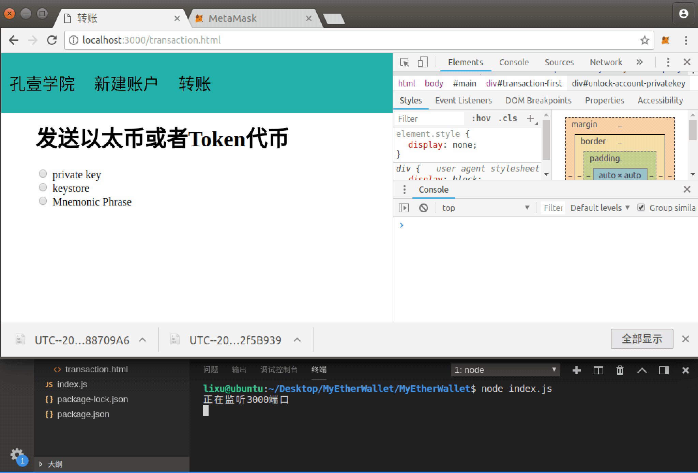

# 第十章 【以太坊钱包开发 十】浅出：如何实现以太币转账

## 一、储备知识

### 1\. 获取以太币

本章主要内容是以太币转账交易，所以前提条件是要拥有以太币（才能转账）。

以太币数量是记录在账号地址上的，账号在不同网络间的以太币余额是不同步的，主要包含：

*   主网
*   Kovan 测试网络
*   Ropsten 测试网络
*   Rinkeby 测试网络
*   本地私有网路

比如你的账号`0xbb5c219853cd0c8b86f463f9b7b480447bcfb57e`在 Ropsten 测试网络上拥有 100ETH，而它在主网上的 ETH 可能为 0，也就是说其它网络上的 ETH 余额与 Ropsten 上拥有 100ETH 没有一点关系，他们之间的资源不会共享，当然，也就在不同网络间不能转账。

但是账号在各个网络中都是可用的，账号的公钥私钥在各个网络也不会发生变化。比如您在 Kovan 测试网络创建的账号，在主网和 Ropsten 测试网络中也能向这个账号地址进行交易。

回到我们问题，如何获取以太币？主要有以下三种方式：

*   别人给您的账号地址转账获得
*   挖矿获得
*   测试网络：主动索取

在本教程中我们学习的重点是钱包开发，因此我们使用其中的 Kovan 测试网络获取以太币（因为私网没有搭建，在主网交易需要花费 gas），采用最后种途径：主动索取。在 Kovan 测试网络下索取以太币的操作步骤在 MetaMask 章节作出了详情说明，若还未获取到 ETH 请先查看该章节内容。

### 2\. 官方：发送签名后的交易

**API**

```js
web3.eth.sendSignedTransaction(signedTransactionData [, callback])
```

**参数**

*   `signedTransactionData`-`String`：以 HEX 格式签名的交易数据。

    交易数据对象可以包含如下字段：

    *   `from`- `String|Number`：发送帐户的地址。如果未指定，则使用 web3.eth.defaultAccount 属性。或 web3.eth.accounts.wallet 中本地钱包的地址。
    *   `to`- `String`:(可选）消息的目标地址，若未定义则为合同发送消息。
    *   `value`- `Number|String|BN|BigNumber`:(可选）为 wei 中的交易转移的数量，如果是合约发送消息，则是捐赠给合约地址。
    *   `gas` - `Number`:(可选，默认：待定）用于交易的 gas（未使用的 gas 会退还）。
    *   `gasPrice`- `Number|String|BN|BigNumber`:(可选）此交易的 gas 价格，以 wei 为单位，默认为[web3.eth.gasPrice](https://web3js.readthedocs.io/en/1.0/web3-eth.html#eth-gasprice)。
    *   `data`- `String`:(可选）包含合同上函数调用数据的[ABI 字节字符串](http://solidity.readthedocs.io/en/latest/abi-spec.html)。
    *   `nonce`- `Number`:(可选）随机数的整数。
*   `callback`-`Function`：（可选）可选回调，将错误对象作为第一个参数返回，结果作为第二个参数返回。

**返回**

`PromiEvent`：promise 组合的事件，将在交易完成时调用。包含以下事件

*   `"transactionHash"`返回`String`：在发送事务并且事务哈希可用之后立即触发。
*   `"receipt"`返回`Object`：在交易确认时触发。
*   `"confirmation"`返回`Number`，`Object`：每次确认都会被调用，直到第 12 次确认。接收确认编号作为第一个参数，将数据作为第二个参数。
*   `"error"`返回`Error`：如果在发送过程中发生错误，则会触发。

**示例**

```js
var Tx = require('ethereumjs-tx');
var privateKey = new Buffer('e331b6d69882b4cb4ea581d88e0b604039a3de5967688d3dcffdd2270c0fd109', 'hex')

var rawTx = {
  nonce: '0x00',
  gasPrice: '0x09184e72a000',
  gasLimit: '0x2710',
  to: '0x0000000000000000000000000000000000000000',
  value: '0x00',
  data: '0x7f7465737432000000000000000000000000000000000000000000000000000000600057'
}

var tx = new Tx(rawTx);
tx.sign(privateKey);

var serializedTx = tx.serialize();

// console.log(serializedTx.toString('hex'));
// 0xf889808609184e72a00082271094000000000000000000000000000000000000000080a47f74657374320000000000000000000000000000000000000000000000000000006000571ca08a8bbf888cfa37bbf0bb965423625641fc956967b81d12e23709cead01446075a01ce999b56a8a88504be365442ea61239198e23d1fce7d00fcfc5cd3b44b7215f

web3.eth.sendSignedTransaction('0x' + serializedTx.toString('hex'))
.on('receipt', console.log);

> { blockHash: '0xc7e2d6db8a5a5dba40f553b61699e3eedededd90d0651acf59da62d4b94d2247',
  blockNumber: 8858763,
  contractAddress: null,
  cumulativeGasUsed: 218855,
  gasUsed: 21004,
  logs: [],
  logsBloom: '0x00000000000000000000000000000000000000000000000000000000000000000000000000000000000000000000000000000000000000000000000000000000000000000000000000000000000000000000000000000000000000000000000000000000000000000000000000000000000000000000000000000000000000000000000000000000000000000000000000000000000000000000000000000000000000000000000000000000000000000000000000000000000000000000000000000000000000000000000000000000000000000000000000000000000000000000000000000000000000000000000000000000000000000000000000000000',
  root: null,
  status: true,
  transactionHash: '0xc983ac8c59b7cc74fe23637e6fa8e08b7649b6508d09768cc09abd6d800d9ddf',
  transactionIndex: 2 }
```

### 3\. 矫正：设置转以太币的交易数据对象

**报错**

若按照官方文档提供的以上方式发送签名交易，可能会出现如下错误

*   unknown field `gasLimit`

```js
Error: Returned error: Invalid params: unknown field `gasLimit`, expected one of `from`, `to`, `gasPrice`, `gas`, `value`, `data`, `nonce`.
```

须将`gasLimit`删除，即`rawTx`对象中不包含`gasLimit`字段。

*   Transaction gas is too low

```js
Error: Returned error: Transaction gas is too low. There is not enough gas to cover minimal cost of the transaction (minimal: 21004, got: 0). Try increasing supplied gas.
```

组合完交易对象会，需调用`web3.eth.estimateGas()`方法预估交易 gas，然后添加到交易对象的 gas 字段。

**注意**

*   `to`字段是转账接收方的地址。
*   `nonce`字段传入的就是发送方的交易次数的值。
*   `value`字段传入的是以 wei 为单位的值，而一般显示的以太币的单位是 ether，因此需要调用`web3.utils.toWei()`方法将单位进行转换。

若是转以太币，则必填字段是`to、nonce、gas、value`。建议将其它字段都添加上。

```js
let { fromaddress, toaddress, number, privatekey } = ctx.request.body

let nonce = await web3.eth.getTransactionCount(fromaddress)
let gasPrice = await web3.eth.getGasPrice()
let balance = await web3.utils.toWei(number)

var Tx = require('ethereumjs-tx');
var privateKey = new Buffer(privatekey.slice(2), 'hex')

var rawTx = {
    from:fromaddress,
    nonce: nonce,
    gasPrice: gasPrice,
    to: toaddress,
    value: balance,
    data: '0x00'//转 Token 代币会用到的一个字段
}
//需要将交易的数据进行预估 gas 计算，然后将 gas 值设置到数据参数中
let gas = await web3.eth.estimateGas(rawTx)
rawTx.gas = gas
```

## 二、项目源码一：显示账号信息以及以太币信息

先将账号信息显示在前端页面再实现转账业务功能，即先实现之前注释的解锁账号完成后调用的`configAccountInfo()`方法，同时取消注释（通过三种方式解锁成功后都有调用，都需取消注释）。

### 1\. transaction.html

编辑 views 文件夹下的 transaction.html 文件，实现显示账号信息。

```js
......

<div id="transaction-second" style="display: none">

    <div id="account-info">
        <div>
            <span>账户地址：</span>
            <span id="account-address"></span>
        </div>
        <div>
            <span>账户余额：</span>
            <span id="account-balance"></span>
        </div>
    </div>
</div>
```

### 2\. wallet.js

编辑 static 文件夹下的 wallet.js 文件，前端解锁账号成功后设置显示账号信息的元素。

```js
......

//解锁成功后给账户设置数据
function configAccountInfo(data) {
    $("#account-address").text(data.address)
    $("#account-balance").text(data.balance + " ETH")

    $("#transaction-first").hide()
    $("#transaction-second").show()
}
```

## 三、项目源码二：以太币转账

在前面的教程中我们通过了三种方式去解锁账号，解锁账号后就可以来实现下面的转账交易，首先转以太币。

### 1\. transaction.js

编辑 controllers 文件夹下的 transaction.js 文件，后端实现以太币转账。

```js
let { success, fail } = require("../utils/myUtils")
let web3 = require("../utils/myUtils").getweb3()

module.exports = {
    ...... 

    sendTransaction: async (ctx) => {
        let { fromaddress, toaddress, number, privatekey } = ctx.request.body
        console.log(JSON.stringify(ctx.request.body))

        let nonce = await web3.eth.getTransactionCount(fromaddress)
        let gasPrice = await web3.eth.getGasPrice()
        let balance = await web3.utils.toWei(number)

        var Tx = require('ethereumjs-tx');
        var privateKey = new Buffer(privatekey.slice(2), 'hex')

        var rawTx = {
            from:fromaddress,
            nonce: nonce,
            gasPrice: gasPrice,
            to: toaddress,
            value: balance,
            data: '0x00'//转 Token 代币会用到的一个字段
        }
        //需要将交易的数据进行预估 gas 计算，然后将 gas 值设置到数据参数中
        let gas = await web3.eth.estimateGas(rawTx)
        rawTx.gas = gas

        var tx = new Tx(rawTx);
        tx.sign(privateKey);

        var serializedTx = tx.serialize();
        let responseData;
        await web3.eth.sendSignedTransaction('0x' + serializedTx.toString('hex'), function(err, data) {
            console.log(err)
            console.log(data)

            if (err) {
                responseData = fail(err)
            }
        })
        .then(function(data) {
            console.log(data)
            if (data) {
                responseData = success({
                    "transactionHash":data.transactionHash
                })
            } else {
                responseData = fail("交易失败")
            }
        })

        ctx.body = responseData
    },
}
```

### 2\. router.js

将发送转账交易的接口绑定到路由。

```js
......

//发送转账交易
router.post("/transaction/send", trasactionConytoller.sendTransaction)
```

### 3\. transaction.html

编辑 views 文件夹下的 transaction.html 文件，实现前端发送转账交易的页面，转账完成后显示交易 hash。

```js
<div id="main">
    ......

    <div id="transaction-second" style="display: none">
        <div id="send-transaction">
            <form id="send-transaction-form">
                <div>
                    <span>对方地址</span>
                    <input type="text" name="toaddress">
                </div>
                <div>
                    <span>发送金额</span>
                    <input type="text" name="number">
                    <select id="send-transaction-token-type">
                        <option value="1">ETH</option>
                        <option value="2" id="send-transaction-token-symbol"></option>
                    </select>
                </div>
                <input name="fromaddress" hidden="hidden">
                <input name="privatekey" hidden="hidden">
                <button type="submit">发送交易</button>
            </form>
        </div>

        <div id="account-info">
            ......
        </div>
        <br>

        <div id="transaction-complate" style="display: none">
            <span>交易 hash</span>
            <span id="transaction-complate-hash"></span>
        </div>
    </div>
</div>
```

### 4\. wallet.js

编辑 static 文件夹下的 wallet.js 文件，前端处理以太币转账交易的网络请求，另外需要设置提交表单时传递的 address、privatekey。

```js
......

//解锁成功后给账户设置数据
function configAccountInfo(data) {
    ......

    $("input[name=fromaddress]").val(data.address)
    $("input[name=privatekey]").val(data.privatekey)
}

$(document).ready(function () {
    ......

    //转账
    $("#send-transaction-form").validate({
        rules:{
            toaddress:{
                required: true,
            },
            number:{
                required:true,
            },
        },
        messages:{
            toaddress:{
                required:"请输入对方地址",
            },
            number:{
                required:"请输入转账数额"
            },
        },
        submitHandler: function(form)
        {
            var urlStr
            let tokenType = $("#send-transaction-token-type").val()
            if (tokenType == 1) {
                urlStr = "/transaction/send"
            } else {
                urlStr = "/token/send"
            }

            $(form).ajaxSubmit({
                url:urlStr,
                type:"post",
                dataType:"json",
                success:function (res, status) {
                    console.log(status + JSON.stringify(res))
                    if (res.code == 0) {
                        $("#transaction-complate-hash").text(res.data.transactionHash)
                        $("#transaction-complate").show()
                    }
                },
                error:function (res, status) {
                    console.log(status + JSON.stringify(res))
                }
            });
        }
    })
})
```

## 四、项目运行效果



**[项目源码 Github 地址](https://github.com/lixuCode/MyEtherWallet)**

**版权声明：博客中的文章版权归博主所有，未经授权禁止转载，转载请联系作者（微信：lixu1770105）取得同意并注明出处。**