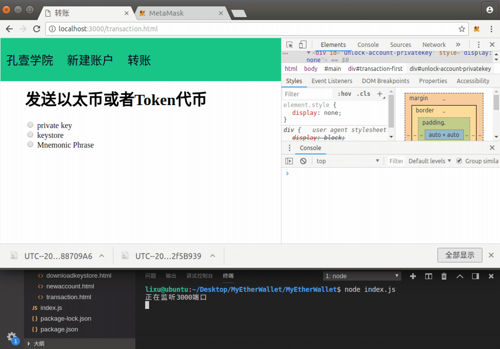

# 第十一章 【以太坊钱包开发 十一】深入：如何通过钱包集成第三方数字货币以及转账实现

## 一、储备知识

### 1\. 获取 Token 代币

本章主要内容是 Token 代币转账交易，所以前提条件是要拥有 Token 代币（才能转账）。

如何获取 Token 代币？主要有以下三种方式：

*   别人给您的账号地址转账获得
*   发布 Token 代币
*   在主网上币币交易

在本教程中我们学习的重点是钱包开发，因此我们使用其中的 Kovan 测试网络获取 Token 代币（因为私网没有搭建，在主网交易需要花费 gas），采用第一种途径：别人给您的账号地址转账获得。

在这里博主提供给大家转下面的 KYXY 代币（使用于 Kovan 测试网络），如果自己可以部署合约可跳过此步骤。需要添加孔壹学院莉莉微信：****，然后发送账号地址，我们会在第一时间转 KYXY 代币到您的账号，如：0xbb5c219853cd0c8b86f463f9b7b480447bcfb57e。

> 代币名称：孔壹学院
> 
> 代币符号：KYXY
> 
> 代币总量：1000000
> 
> 代币合约地址：0x50c9fd8e20792e2decc5e35a0c1d17a51555347b
> 
> 代币合约 ABI：
> 
> ```js
> [{"anonymous": false,"inputs": [{"indexed": true,"name": "_owner","type": "address"},{"indexed": true,"name": "_spender","type": "address"},{"indexed": false,"name": "_value","type": "uint256"}],"name": "Approval","type": "event"},{"anonymous": false,"inputs": [{"indexed": true,"name": "_from","type": "address"},{"indexed": true,"name": "_to","type": "address"},{"indexed": false,"name": "_value","type": "uint256"}],"name": "Transfer","type": "event"},{"constant": false,"inputs": [{"name": "_spender","type": "address"},{"name": "_value","type": "uint256"}],"name": "approve","outputs": [{"name": "success","type": "bool"}],"payable": false,"stateMutability": "nonpayable","type": "function"},{"constant": false,"inputs": [{"name": "_to","type": "address"},{"name": "_value","type": "uint256"}],"name": "transfer","outputs": [{"name": "success","type": "bool"}],"payable": false,"stateMutability": "nonpayable","type": "function"},{"constant": false,"inputs": [{"name": "_from","type": "address"},{"name": "_to","type": "address"},{"name": "_value","type": "uint256"}],"name": "transferFrom","outputs": [{"name": "success","type": "bool"}],"payable": false,"stateMutability": "nonpayable","type": "function"},{"inputs": [{"name": "_name","type": "string"},{"name": "_symbol","type": "string"},{"name": "_decimals","type": "uint8"},{"name": "_totalSupply","type": "uint256"}],"payable": false,"stateMutability": "nonpayable","type": "constructor"},{"constant": true,"inputs": [{"name": "_owner","type": "address"},{"name": "_spender","type": "address"}],"name": "allowance","outputs": [{"name": "remaining","type": "uint256"}],"payable": false,"stateMutability": "view","type": "function"},{"constant": true,"inputs": [{"name": "_owner","type": "address"}],"name": "balanceOf","outputs": [{"name": "balance","type": "uint256"}],"payable": false,"stateMutability": "view","type": "function"},{"constant": true,"inputs": [],"name": "decimals","outputs": [{"name": "","type": "uint8"}],"payable": false,"stateMutability": "view","type": "function"},{"constant": true,"inputs": [],"name": "name","outputs": [{"name": "","type": "string"}],"payable": false,"stateMutability": "view","type": "function"},{"constant": true,"inputs": [],"name": "symbol","outputs": [{"name": "","type": "string"}],"payable": false,"stateMutability": "view","type": "function"},{"constant": true,"inputs": [],"name": "totalSupply","outputs": [{"name": "","type": "uint256"}],"payable": false,"stateMutability": "view","type": "function"}]
> ```

**提醒：**

*   上面的 KYXY 代币合约地址与 KYXY 代币合约 ABI 数据将会在开发中使用到。
*   获取到了 KYXY 代币以后，请参照前面 MetaMask 章节的教程将 KYXY 代币添加到 MetaMask 中。

### 2\. 创建合约对象

**API**

```js
new web3.eth.Contract(jsonInterface[, address][, options])
```

**参数**：

*   `jsonInterface`- `Object`：实例化合约的 json 接口，即 ABI。
*   `address`- `String`（可选）：要调用的智能合约的地址，可以在之后通过`myContract.options.address = '0x1234..'`添加。
*   `options`- `Object`（可选）：合约的可选项。用作调用和交易的可选字段：
    *   `from`- `String`：交易发起方的地址。
    *   `gasPrice`- `String`：用于交易的 gas 价格。
    *   `gas`- `Number`：为交易提供的最大 gas。
    *   `data`- `String`：合约的字节代码，合约[部署时使用](https://web3js.readthedocs.io/en/1.0/web3-eth-contract.html#contract-deploy)。

**返回值**：

`Object`：合约实例及其所有方法和事件。

**例子**

```js
var myContract = new web3.eth.Contract([...], '0xde0B295669a9FD93d5F28D9Ec85E40f4cb697BAe', {
    from: '0x1234567890123456789012345678901234567891', // default from address
    gasPrice: '20000000000' // default gas price in wei, 20 gwei in this case
});
```

### 3\. 调用线上合约 API

**API**

```js
myContract.methods.myMethod([param1[, param2[, ...]]]).call(options[, callback])
```

**参数**：

*   `options`- `Object`（可选）：用于呼叫的选项。

    *   `from`- `String`：交易调用方的地址。
    *   `gasPrice`- `String`：用于交易的 gas 价格。
    *   `gas`- `Number`：为交易提供的最大 gas。
*   `callback`- `Function`（可选）：将使用错误对象作为第一个参数和智能合约方法执行的结果作为第二个参数来触发此回调。

**返回值**：

`Promise`返回`Mixed`：智能合约方法的返回值。如果它返回单个值，则按原样返回。如果它有多个返回值，则它们将作为具有属性和索引的对象返回：

**例子**

```js
// using the callback
myContract.methods.myMethod(123).call({from: '0xde0B295669a9FD93d5F28D9Ec85E40f4cb697BAe'}, function(error, result){
    ...
});

// using the promise
myContract.methods.myMethod(123).call({from: '0xde0B295669a9FD93d5F28D9Ec85E40f4cb697BAe'})
.then(function(result){
    ...
});

// MULTI-ARGUMENT RETURN:

// Solidity
contract MyContract {
    function myFunction() returns(uint256 myNumber, string myString) {
        return (23456, "Hello!%");
    }
}

// web3.js
var MyContract = new web3.eth.contract(abi, address);
MyContract.methods.myFunction().call()
.then(console.log);
> Result {
    myNumber: '23456',
    myString: 'Hello!%',
    0: '23456', // these are here as fallbacks if the name is not know or given
    1: 'Hello!%'
}

// SINGLE-ARGUMENT RETURN:

// Solidity
contract MyContract {
    function myFunction() returns(string myString) {
        return "Hello!%";
    }
}

// web3.js
var MyContract = new web3.eth.contract(abi, address);
MyContract.methods.myFunction().call()
.then(console.log);
> "Hello!%"
```

### 4\. 设置转代币的交易数据对象

发送签名后的交易的官方介绍和 API 可查看上一节教程，转以太币与转代币的 API 是一样的。

**报错**

若按照官方文档提供的以上方式发送签名交易，可能会出现如下错误

*   Transaction execution error

```js
Error: Returned error: Transaction execution error.
```

在转账代币交易时可能会出现的错误，需设置`from`字段为发送方的地址。

*   unknown field `gasLimit`

```js
Error: Returned error: Invalid params: unknown field `gasLimit`, expected one of `from`, `to`, `gasPrice`, `gas`, `value`, `data`, `nonce`.
```

须将`gasLimit`删除，即`rawTx`对象中不包含`gasLimit`字段。

*   Transaction gas is too low

```js
Error: Returned error: Transaction gas is too low. There is not enough gas to cover minimal cost of the transaction (minimal: 21004, got: 0). Try increasing supplied gas.
```

组合完交易对象会，需调用`web3.eth.estimateGas()`方法预估交易 gas，然后添加到交易对象的 gas 字段。

**注意：**

*   `to`字段填入的是合约地址，与转账以太币不同。

*   `data`字段必填，需要将合约对象调用的方法经过编码。此处是调用转账的 API，`myContract.methods.transfer(toaddress, balance).encodeABI()`，其中：

    *   `myContract`：合约对象。
    *   `transfer`：调用该合约的方法。
    *   `toaddress, balance`：调用该方法的参数，该方法有两个参数，第一个是转账给对方的地址，第二个是转账金额。
*   `balance`参数，是调用合约转账 API 时传递的第二个参数，这个转账金额的单位需要进行转换为该合约的小数位单位，则需要先调用合约获取小数位值的方法，操作如下

    ```js
    let decimals = await myContract.methods.decimals().call()
    let balance = number * Math.pow(10, decimals)
    ```

    而转账以太币是调用`web3.utils.toWei()`方法将单位进行转换。

*   `nonce`字段传入的就是发送方的交易次数的值。

若是转代币，则必填字段是`from、to、nonce、gas、data`。

```js
let { fromaddress, toaddress, number, privatekey } = ctx.request.body

let nonce = await web3.eth.getTransactionCount(fromaddress)
let gasPrice = await web3.eth.getGasPrice()

let decimals = await myContract.methods.decimals().call()
let balance = number * Math.pow(10, decimals)

let myBalance = await myContract.methods.balanceOf(fromaddress).call()
if (myBalance < balance) {
    ctx.body = fail("余额不足")
    return
}
let tokenData = await myContract.methods.transfer(toaddress, balance).encodeABI()

var Tx = require('ethereumjs-tx');
var privateKey = new Buffer(privatekey.slice(2), 'hex')

var rawTx = {
    nonce: nonce,
    gasPrice: gasPrice,
    to: myContract.options.address,//如果转的是 Token 代币，那么这个 to 就是合约地址
    from: fromaddress,
    data: tokenData//转 Token 会用到的一个字段
}
//需要讲交易的数据进行预估 Gas 计算，然后将 Gas 值设置到数据参数中
let gas = await web3.eth.estimateGas(rawTx)
rawTx.gas = gas
```

## 二、项目源码一：后端集成第三方数字货币

需要提供 Token 代币合约地址与对应的 ABI，实例化合约对象，才能访问该 Token。

### 1\. contract.js

在 models 文件夹下新建 contract.js 文件，后端实现根据 ABI 与合约地址创建合约对象。

注意：需要将 ABI 与合约地址相对应，并且你的账号拥有此代币合约的余额。

```js
let web3 = require("../utils/myUtils").getweb3()

module.exports = {
    getContract: () => {
        let ABI = [{"anonymous": false,"inputs": [{"indexed": true,"name": "_owner","type": "address"},{"indexed": true,"name": "_spender","type": "address"},{"indexed": false,"name": "_value","type": "uint256"}],"name": "Approval","type": "event"},{"anonymous": false,"inputs": [{"indexed": true,"name": "_from","type": "address"},{"indexed": true,"name": "_to","type": "address"},{"indexed": false,"name": "_value","type": "uint256"}],"name": "Transfer","type": "event"},{"constant": false,"inputs": [{"name": "_spender","type": "address"},{"name": "_value","type": "uint256"}],"name": "approve","outputs": [{"name": "success","type": "bool"}],"payable": false,"stateMutability": "nonpayable","type": "function"},{"constant": false,"inputs": [{"name": "_to","type": "address"},{"name": "_value","type": "uint256"}],"name": "transfer","outputs": [{"name": "success","type": "bool"}],"payable": false,"stateMutability": "nonpayable","type": "function"},{"constant": false,"inputs": [{"name": "_from","type": "address"},{"name": "_to","type": "address"},{"name": "_value","type": "uint256"}],"name": "transferFrom","outputs": [{"name": "success","type": "bool"}],"payable": false,"stateMutability": "nonpayable","type": "function"},{"inputs": [{"name": "_name","type": "string"},{"name": "_symbol","type": "string"},{"name": "_decimals","type": "uint8"},{"name": "_totalSupply","type": "uint256"}],"payable": false,"stateMutability": "nonpayable","type": "constructor"},{"constant": true,"inputs": [{"name": "_owner","type": "address"},{"name": "_spender","type": "address"}],"name": "allowance","outputs": [{"name": "remaining","type": "uint256"}],"payable": false,"stateMutability": "view","type": "function"},{"constant": true,"inputs": [{"name": "_owner","type": "address"}],"name": "balanceOf","outputs": [{"name": "balance","type": "uint256"}],"payable": false,"stateMutability": "view","type": "function"},{"constant": true,"inputs": [],"name": "decimals","outputs": [{"name": "","type": "uint8"}],"payable": false,"stateMutability": "view","type": "function"},{"constant": true,"inputs": [],"name": "name","outputs": [{"name": "","type": "string"}],"payable": false,"stateMutability": "view","type": "function"},{"constant": true,"inputs": [],"name": "symbol","outputs": [{"name": "","type": "string"}],"payable": false,"stateMutability": "view","type": "function"},{"constant": true,"inputs": [],"name": "totalSupply","outputs": [{"name": "","type": "uint256"}],"payable": false,"stateMutability": "view","type": "function"}]

        let contractAddress = "0xe5b2f5a38d6fe39a45f825d39d4cbf0a0aef5a7e"
        let myContract = new web3.eth.Contract(ABI, contractAddress)
        return myContract
    },
}
```

## 三、项目源码二：调用合约 API 实现获取代币数据

通过 Token 合约实例，调用它的的 API 获取相关代币数据，如：`myContract.methods.balanceOf(account.address).call()`。

*   myContract：合约对象。
*   balanceOf：调用该合约内的公开方法。
*   account.address：调用的方法的参数。

### 1\. account.js

编辑 controllers 文件夹下的 account.js 文件，后端实现通过调用合约 API 获取用户的代币数据。

```js
......

let myContract = require("../models/contract").getContract()
let haveToken = true

//配置返回给前端的数据，包含以太币的数据，还有 Token 的数据
async function setResponseData(account) {
    //获取账户余额
    .....

    //获取代币的数据
    if (haveToken) {
        let myBalance = await myContract.methods.balanceOf(account.address).call()
        let decimals = await myContract.methods.decimals().call()
        myBalance = myBalance / Math.pow(10, decimals)
        let symbol = await myContract.methods.symbol().call()

        resData.data.tokenbalance = myBalance
        resData.data.symbol = symbol
    }

    //返回相应数据给前端
    return resData
}

module.exports = {
    ......
}
```

### 2\. transaction.html

编辑 views 文件夹下的 transaction.html 文件，实现前端显示用户的代币数据。

```js
......

<div id="account-info">
    ......

    <div>
        <span>账户余额：</span>
        <span id="account-balance"></span>
        <br>
        <span>Token 余额：</span>
        <span id="account-token-info"></span>
    </div>
</div>
```

### 3\. wallet.js

编辑 static 文件夹下的 wallet.js 文件，设置显示 Token 的元素的数据。

```js
//解锁成功后给账户设置数据
function configAccountInfo(data) {
    ......

    $("#account-token-info").text(data.tokenbalance + " " + data.symbol)
    $("#send-transaction-token-symbol").text(data.symbol)
}
```

## 四、项目源码三：前后端实现代币转账

代币转账与以太币转账类似，调用一样的 API，但是也会有一些区别，体现在交易对象的字段取值上，下面会作出总结。

### 1\. token.js

controllers 文件夹下新建 token.js 文件，后端实现代币转账交易。

```js
let myContract = require("../models/contract").getContract()
let web3 = require("../utils/myUtils").getweb3()
let {success, fail} = require("../utils/myUtils")

module.exports = {

    sendTokenTransaction: async (ctx) => {
        let { fromaddress, toaddress, number, privatekey } = ctx.request.body
        console.log(JSON.stringify(ctx.request.body))

        let nonce = await web3.eth.getTransactionCount(fromaddress)
        let gasPrice = await web3.eth.getGasPrice()

        let decimals = await myContract.methods.decimals().call()
        let balance = number * Math.pow(10, decimals)

        let myBalance = await myContract.methods.balanceOf(fromaddress).call()
        if (myBalance < balance) {
            ctx.body = fail("余额不足")
            return
        }
        let tokenData = await myContract.methods.transfer(toaddress, balance).encodeABI()

        var Tx = require('ethereumjs-tx');
        var privateKey = new Buffer(privatekey.slice(2), 'hex')

        var rawTx = {
            from: fromaddress,
            nonce: nonce,
            gasPrice: gasPrice,
            to: myContract.options.address,//如果转的是 Token 代币，那么这个 to 就是合约地址
            data: tokenData//转 Token 会用到的一个字段
        }
        //需要讲交易的数据进行预估 Gas 计算，然后将 Gas 值设置到数据参数中
        let gas = await web3.eth.estimateGas(rawTx)
        rawTx.gas = gas

        var tx = new Tx(rawTx);
        tx.sign(privateKey);

        var serializedTx = tx.serialize();
        let responseData;
        await web3.eth.sendSignedTransaction('0x' + serializedTx.toString('hex'), function(err, data) {
            console.log(err)
            console.log(data)

            if (err) {
                responseData = fail(err)
            }
        })
        .then(function(data) {
            console.log(data)
            if (data) {
                responseData = success({
                    "transactionHash":data.transactionHash
                })
            } else {
                responseData = fail("交易失败")
            }
        })

        ctx.body = responseData
    }
}
```

### 2\. router.js

将 Token 转账表单提交的接口绑定到路由。

```js
......

let tokenController = require("../controllers/token")
//Token 转账
router.post("/token/send", tokenController.sendTokenTransaction)
```

## 五、项目运行效果



## 六、代币转账与以太币转账的区别

代币转账与以太币转账类似，调用一样的 API，但是也会有一些区别，体现在交易对象的字段取值上，如下：

| 字段 | 以太币转账 | Token 代币转账 |
| --- | --- | --- |
| to | 转账交易接收方的地址 | Token 代币合约地址 |
| value | 以 wei 为单位的值。若是其它单位的值，需要调用`web3.utils.toWei()`方法将单位进行转换。 | —— |
| data | —— | 调用 `myContract.methods.transfer(toaddress, balance).encodeABI()`方法编码 ABI。 |
| balance | —— | 注意这个不是交易对象的字段，而是调用 transfer 方法的参数，它需要经过单位换算，将最大单位值转为最小单位值。 `let decimals = await myContract.methods.decimals().call();let balance = number * Math.pow(10, decimals);` |
| from | 可选项 | 必填，为交易调用方地址。 |

**[项目源码 Github 地址](https://github.com/lixuCode/MyEtherWallet)**

**版权声明：博客中的文章版权归博主所有，未经授权禁止转载，转载请联系作者（微信：lixu1770105）取得同意并注明出处。**