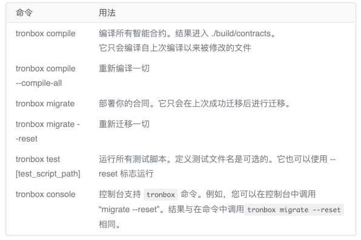

# 第二章 波场 Tron-极速环境构建的可实战工程模板

```go
 _                         _           _ _                 _       _
| |_ _ __ ___  _ __       | |__   ___ (_) | ___ _ __ _ __ | | __ _| |_ ___
| __| '__/ _ \| '_ \ _____| '_ \ / _ \| | |/ _ \ '__| '_ \| |/ _` | __/ _ \
| |_| | | (_) | | | |_____| |_) | (_) | | |  __/ |  | |_) | | (_| | ||  __/
 \__|_|  \___/|_| |_|     |_.__/ \___/|_|_|\___|_|  | .__/|_|\__,_|\__\___|
                                                    |_|
```

[** Tron-Boilerplate**](https://github.com/ChainDesk/tron_boilerplate), 是基于 Tron 公链的一套可快速搭建本地私链环境、发布合约以及配置完整的标准工程模板。

该工程模板旨在于帮助大家快速工程化本地开发环境，减少环境搭建以及调试开发流程过程中所需花费的大量时间，让大家将更多精力投入到产品设计与核心业务逻辑实现上。

使用提供的工程模板，可从以下四个方面提升开发效率：

*   一键启动或暂停私链环境
*   一键编译智能合约
*   一键发布智能合约
*   一键单元测试（jtest）

同时，本工程模板附带了一个完整的示例代码(**Todolist**)，可供大家参考与学习。示例效果如下：


最后，开发人员只需按照项目工程结构，编写自己的智能合约、前端页面及与 SDK 交互逻辑即可。

* * *

## 前置依赖

### 1\. 安装 docker

** Install Docker for Mac** : [`docs.docker.com/docker-for-mac/`](https://docs.docker.com/docker-for-mac/) ** Install Docker for Windows**: [`docs.docker.com/docker-for-windows/install/`](https://docs.docker.com/docker-for-windows/install/)

更多资料可参考: [`docs.docker.com`](https://docs.docker.com/)

### 2\. 安装 node

To install or update nvm, you can use the install script using cURL:

```go
curl -o- https://raw.githubusercontent.com/creationix/nvm/v0.34.0/install.sh | bash
```

or wget

```go
wget -qO- https://raw.githubusercontent.com/creationix/nvm/v0.34.0/install.sh | bash
```

The script clones the nvm repository to /.nvm and adds the source line to your profile (/.bash*profile, /.zshrc, /.profile, or /.bashrc).*

```go
export NVM_DIR="${XDG_CONFIG_HOME/:-$HOME/.}nvm"
[ -s "$NVM_DIR/nvm.sh" ] && \. "$NVM_DIR/nvm.sh" # This loads nvm
```

更多资料可参考: [`github.com/creationix/nvm#installation`](https://github.com/creationix/nvm#installation)

### 3\. 安装 jdk8

JDK8: [`www.oracle.com/technetwork/java/javase/downloads/jdk8-downloads-2133151.html`](https://www.oracle.com/technetwork/java/javase/downloads/jdk8-downloads-2133151.html)

如果大家不使用 tron 提供的 tron-studio 开发合约的化，可以选择不安装此项。因为使用 tronbox 同样也可以编译以及发布合约。

### 4\. 安装 tronbox

```go
npm install -g tronbox
```



注：对于最新的 Java-Tron Odyssey 3.2 版本，最小兼容的 TronBox 版本是 TronBox 2.2.1。请确保您已安装此版本。

更多资料：[`cn.developers.tron.network/docs/%E5%85%A5%E9%97%A8`](https://cn.developers.tron.network/docs/%E5%85%A5%E9%97%A8)

### 5\. 开发工具

开发工具可根据自己喜好自由选择，个人比较推荐**VSCode**。

官网链接：[`code.visualstudio.com/`](https://code.visualstudio.com/)

## 工程安装与使用

### 1\. 克隆工程

```go
git clone git@github.com:ChainDesk/tron_boilerplate.git
```

**工程结构介绍**

```go
# 项目地址: https://github.com/ChainDesk/tron_boilerplate
# 注：待工程稳定后，可能会考虑做成插件，可使用 yeoman 快速构建，欢迎大家 star.
.
├── README.md
├── bin
│   ├── libs
│   │   └── TronStudio.jar          //TronStudio 开发工具包
│   ├── start_docker.sh             //启动私链
│   ├── start_tronstudio.sh         //启动 TronStudio
│   └── stop_docker.sh              //停止私链
├── build                           //合约编译生成目录
│   └── contracts
│       ├── HelloWorld.json         //示例合约 ABI, HelloWorld
│       ├── Migrations.json 
│       └── TodoList.json           //示例合约 ABI, TodoList
├── contracts                       //合约目录，大家合约都放在这儿
│   ├── HelloWorld.sol
│   ├── Migrations.sol
│   └── TodoList.sol
├── migrations                      //发布合约目录
│   ├── 1_initial_migration.js
│   └── 2_deploy_contracts.js       //新添加的合约需要在此文件中定义，否则无法通过 tronbox deploy 命令发布
├── package-lock.json
├── package.json                    //前端 App 工程及依赖包定义，以及多个服务启动命令。
├── public
│   ├── favicon.ico
│   ├── index.html
│   └── manifest.json
├── src                             //前端 React 代码目录
│   ├── TodoList.js                 
│   ├── contracts                   
│   │   └── TodoList.json           //合约 ABI 文件
│   ├── index.js
│   ├── serviceWorker.js
│   └── tronweb.js                  //新启动的工程，需要根据私链生成的私钥以及新发布的合约地址在此重新修改。
├── test                            //jtest 测试目录，方便大家编写测试用例
│   └── web.test.js                 
├── tronbox-config.js
└── tronbox.js                      //发布合约所依赖的配置，此文件定义了本地、测试以及正式网络的 http 访问地址

12 directories, 27 files
```

### 2\. 工程初始化

```go
npm install 
```

这一步主要用于更新前端框架 react 所依赖的包文件，依赖包安装成功后，会在工程目录下看到一个`node_modules`文件夹。

如果你的前端选型不是 react 的化，也可根据自己需求进行依赖包配置修改。

### 3\. 正式开发流程

#### 3.1 启动链环境

执行`cmd+shift+p`，调用 vscode 的命令列表，选择 run task 从中选择 start*docker 任务*

 同样，如果要停止当前 docker 环境，只需选择 stop*docker 脚本即可。*

所有的执行任务配置默认只存在两个地方:

*   tron*boilerplate/.vscode/tasks.json*
*   package.json 中的 scripts 大家可根据自己需要进行添加或修改，而且也可以通过 IDE 本身的快捷键映射对应的任务。

#### 3.2 发布合约

运行 task 任务，然后从中选择`npm deploy`, 即可发布当前所有合约至私链环境。


合约发布成功后，会显示如下：

```go
Using network 'development'.

Running migration: 1_initial_migration.js
  Replacing Migrations...
  Migrations:
    (base58) TBC7CqpjBxGUt9Z9hhM4QNRFF5osvG3j6r
    (hex) 410d68b1bfd19d341bd0f772fad8697432d0d771be
Saving successful migration to network...
Saving artifacts...
Running migration: 2_deploy_contracts.js
  Replacing TodoList...
  TodoList:
    (base58) TFyEw5qRRiZTJ5boLZJxZnv2hnhpBuvkjm
    (hex) 4141d25df475fe0c053a9e2ed3a77faa10329185f0
Saving successful migration to network...
Saving artifacts...
```

#### 3.3 修改配置参数

打开文件, tron*boilerplate/src/tronweb.js, 代码如下: *

```go
...
const fullNode = new HttpProvider('http://127.0.0.1:8090');
const solidityNode = new HttpProvider('http://127.0.0.1:8091');
const eventServer = 'http://127.0.0.1:8092';

const privateKey = "<私钥地址>";
const contractAddr = "<合约地址>";
......
```

#### 3.4 启动 react 服务

执行`cmd+shift+p`，调用 vscode 的命令列表，选择 run task 从中选择`npm start`即可启动前端服务。


打开浏览器，访问 http://localhost:3000， 验证是否成功。

* * *

到此，整个工程的搭建及开发流程就介绍完毕，如中间出现任何问题欢迎加我个人微信咨询。

## 开发资料

*   波场官网：[`tron.network/index?lng=zh`](https://tron.network/index?lng=zh)
*   波场区块链浏览器（主网）： [`tronscan.org/`](https://tronscan.org/)#/
*   波场区块链浏览器 （测试网）[`test.tronscan.org/`](https://test.tronscan.org/)#/
*   Documentation: [`github.com/tronprotocol/Documentation`](https://github.com/tronprotocol/Documentation)
*   TRON 开发者文档: [`developers.tron.network/`](https://developers.tron.network/)
*   开发工具介绍: [`medium.com/tron-foundation/an-all-in-one-tool-suite-for-tron-developers-d048b2bc9b6c`](https://medium.com/tron-foundation/an-all-in-one-tool-suite-for-tron-developers-d048b2bc9b6c)
*   TRON Chrome 插件集成示例：[`github.com/tronpay/TronPay-Extension`](https://github.com/tronpay/TronPay-Extension)
*   Tron-BIP44 implementation： [`www.npmjs.com/package/@faast/tron-payments`](https://www.npmjs.com/package/@faast/tron-payments)
*   TRON 开发项目模板(tron_boilerplate)：[`github.com/ChainDesk/tron_boilerplate`](https://github.com/ChainDesk/tron_boilerplate)

* * *

> 在教程中如出现不易理解或存在错误的问题，欢迎加我微信指正！ Name: zhangliang | WeChat: rushking2009 | Mail: zhangliang@cldy.org