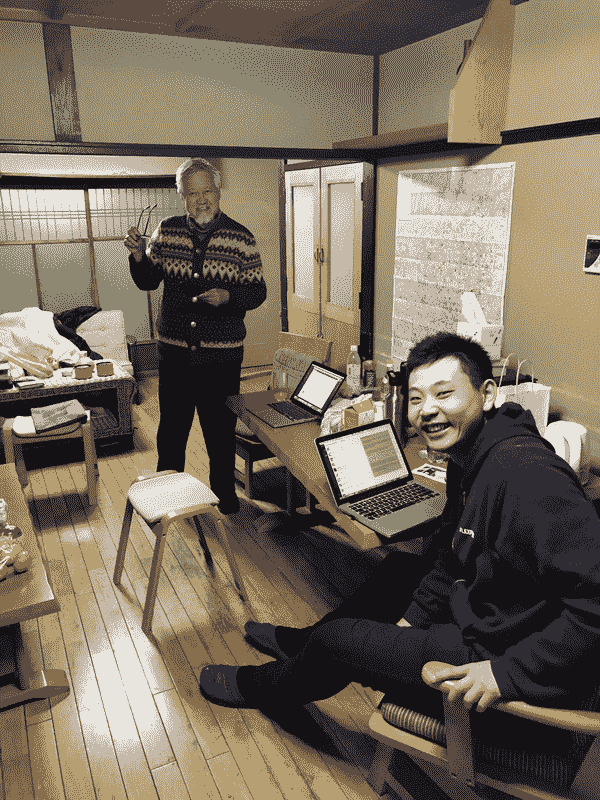
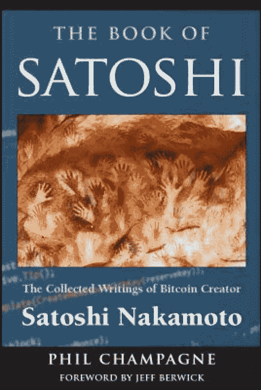

# 王峰十问第 01 期 | 中国天使投资第一人薛蛮子：与其说我是比特币信仰者，不如说是人性的信仰者（附音频）

> 原文：[`news.huoxing24.com/2018022423201493836.html`](https://news.huoxing24.com/2018022423201493836.html)

**本文来自微信公众号：[王峰十问](http://mp.weixin.qq.com/s/MNOhVxFVgR4ttTpBBTa7Ew)（ID:wangfengshiwen）**

2 月 24 日 22 点，“三点钟火星财经学习成长群”「峰火台」正式开讲！知名天使投资人薛蛮子与火星财经发起人王峰以及特邀采访助理长盛，共同进行精彩对话，并与群内好友切磋交流区块链行业的现状与未来。

薛蛮子：UT 斯达康创始人之一，曾担任 8848 董事长，投资了蔡文胜的 265、李想的汽车之家等众多知名项目，被誉为“中国天使投资第一人”。在链圈，投资了量子链、比原链、墨链等 20 余个项目。

王峰：火星财经发起人，蓝港互动集团（HK.8267）创始人，极客帮创投合伙人，投资了 OKex、小程序 SEE 小电铺、淘手游、我叫 MT、聚合数据等近百个天使项目。

长盛：原北京电视台财经频道首席主持、网易传媒副总编辑。

以下为对话原文整理：

**王峰**：您好。我上次见您，还是在华谊兄弟王中军的饭局上，记得 IDG 企业家年会，您把马未都介绍给我们，很多人觉得您神通广大，看不透。您身体很好，刚过 65 岁生日，依旧感觉您精力充沛。我们有一个共同点，都不爱睡觉。努力学习，不断成长，是我们群的使命。您是我们的榜样。先谢谢您来群里和我对话。大家再欢迎。

**薛蛮子**：开始吧老夫 ready

**第一问**

**王峰**：我记得，您跟我说过你在加州 Berkeley 读书时和软银孙正义是同校好友，是同学还是学长？后来在 UT 斯达康的投资上有过成功的合作，你曾经说过孙正义最大的成功就是投出了阿里巴巴和雅虎。您觉得蛮子基金有没有在区块链里投出下一个阿里巴巴的机会？

**薛蛮子**：孙正义是我伯克利暑假打工的老板。他付我七美元一钟头，一个假期赚了七千美。他是本科生而我是研究生（硕士）。虽然我比他大，但他钱一直比我多，并且越来越多。

其实每个投资者都盼着投出个阿里，这个真是太难了！但我感觉到了 65 岁机会来了！

**长盛**：他的成功可不可以在区块链里复制，机会跟他当初一样大吗？

**薛蛮子**：区块链是个真正的翻了桌子胡撸了桌子上所有麻将牌的大事。一切都归零了。上至 bat 下至小生意都在同一起跑线上了。你说说老头能不激动吗！所有人都有了机会干出个 BAT，尤其是 BAT 现在不能玩这个。这个是大机会！

**第二问**

**王峰**：我看到你几次提到“区块链企业家精神”，之前互联网时代我金山前老板雷军也指点江山，大谈互联网思维，甚至提出“专注极致口碑快”七字诀，你提到的“区块链企业家精神”具体是指的什么？您认识的区块链创业者中，哪些人具有这些特点？

**薛蛮子**：我想在谈什么是区块链企业家精神之前，先谈谈什么是区块链精神。

我对区块链精神的认识： 首先是信任的规模化；其次是代码即共识；第三个是赋能到个体。

再来谈区块链时代企业家精神，我这次在京都附近的天桥里看了一个奇景是屁眼看天。原本是海中有了一个长几公里的沙堤，和西湖的苏堤白堤一样，仅是一个美景而已。可是到了顶上有个地方，叫裤裆看天，每个游客必须把头伸到裤裆底下看景。这时候，这个沙堤就不是一个普通的沙堤，而是宛如一条巨龙，直飞天际。我之所以举这个例子，就是因为区块链颠覆了以往的商业逻辑。因此，颠覆是第一条（精神）。

第二个精神是有抡开膀子，时不我待的精神。

第三个精神是要有超强的学习能力，才能与时具进。眼界，胸怀，识人之能和容人之量是前所未有的重要。

无论是中国还是美国、互联网还是移动互联网，企业家精神都是相通的。每个时代的创业者，各领风骚三五年。是人才什么时候都有机会。只要 BAT 给两三年窗口期，我们会看到新一代的领军人物。（此刻的薛老着实一口气敲打了很多字，抱怨三点钟群真 TM 多，发错群让大家等待多久，赔礼道歉，薛老显得率真可爱。）

**第三问**

**王峰**：你之前提到“区块链是个马拉松的开头而已，今天热闹的公司大多数会完蛋”，现在进入区块链的人显然是越来越多了，你对新入局者有什么提醒？我直说吧，他们会不会应该冷静些？您怎么看？

**薛蛮子**：不要迷信所谓的“专家”，“大佬”的站台，更要警惕传销。整个区块链行业到处都是空气币，想要一夜暴富，都容易被割了韭菜。我建议创业者踏踏实实 3-5 年，专心研发，学习，耐心找到一个痛点，集中调动世界所有资源，一鸣惊人。

所有这些区块链孩子比当年玩互联网和移动互联网的创业者嫩得多，得给他们时间成熟起来。

**第四问**

**王峰**： 我也看到你前几天说“为了公链而公链更危险”，是否我可以理解为今天的区块链项目开发者应该向当年的 PC 视窗、智能手机 iOS、安卓时代的创业者们一样，应该把更多精力放在智能合约上写 DApp，瞄准内容、电商、社交等具体的场景应。对吗？我们群里很多开发者。

**薛蛮子**：我是初一文化的历史自学者，很可能无知地让人笑掉大牙。

平心而论，从比特币到以太坊，都有明显的交易费用，交易确认时间，可扩展性等问题。虽然量子，EOS 等公链有尝试，但这更是一个长跑。在充分解决这些公链问题之前，所有应用都有相当大的落地难度。

**王峰**：现在还有很多人做公链，我都感到担心。

**薛蛮子**：急了也没屁用。想生孩子都得怀胎十月，娶 TM 两十个老婆也不能一月出来儿子就是这个道理。

**第五问**

**王峰**： 昨天好像你提到更喜欢“为区块链公司服务的区块链公司”，不巧我最近也看了几个量化投资和资产管理的项目，它们是不是就是这一类型？它们在未来的区块链市场上会扮演什么角色？

**薛蛮子**：很多人看不起给区块链公司做白皮书， PR， 负责 ICO 社区运营，数字货币投行这样的服务公司。我认为这是绝对的刚需，如果能做成各自领域的龙头是很牛的一件事。有这样的公司赶紧来找我。

**王峰**：那我可以推荐给您。

**薛蛮子**：欢迎。

**第六问**

**王峰**：你去年曾经说过自己一下子进入一个全新的世界，可以“一个人进厨房随便点菜”。我一直觉得您非常非常聪明，当然也有人说你鸡贼啊。放眼今天，炒币已经非常热了，这让我想起巴菲特的那句话：“别人恐惧时贪婪，别人贪婪时恐惧。”很多人因贪婪而恐惧，甚至我身边很多投资人已经很成功了，却也是不时地谈焦虑，这句话适用于现在的投资吗？哈哈

**薛蛮子**：去年我是传统风投圈里最早拥抱区块链的人。

**王峰**：您焦虑吗？哈哈

群众起哄：薛老，您焦虑吗？（斜眼笑）

**薛蛮子**：今天正规军全部进场了。小平文胜都 all in 了。我反而要大声疾呼：hold 住。孩子已经疯狂了别再加火了。我一点不焦虑。冷眼向洋看世界，热风吹雨撒江天。

**第七问**

**王峰**：我注意到，有大量传统投资机构（美元、人民币）在进入区块链领域，甚至我身边的朋友用“跑步入场”在形容自己的状态。在这样的情况下，今年你的投资组合里，还有几成留给非区块链项目的创业者？毕竟，这几年还有 AI、IOT、新零售和泛娱乐等投资方向。

**薛蛮子**：股权还在继续做，不受影响。由我的助理王坤亮负责。另外有一套班子负责区块链。两不耽误。老实说，区块链的回报期要币股权投资快得多。

**王峰**：传统股权投资还占你多大比例？

**薛蛮子**：现在应该七分区块链三分传统。

群众起哄：黄金比例！

(突然微信群中蹦出可爱的薛老)

**第八问**

**王峰**：我一直很好奇，区块链这么新鲜的事物，有人甚至说 90 年以前出生的人都不懂。是什么促使你对真正对进入区块链产生了绝对信心？今天交代，谁是你在区块链世界的引路人？

群员：薛老未答猜测乱飞，李笑来、V 神、中本聪……

**薛蛮子**：早期见了很多区块链老人李笑来 ，赵东，老猫，周硕基等人。 我发现区块链跟 VR，AR 等风口相比，有着本质上的区别，区块链是对生产关系的根本改变，从历史的角度来看，是一个前所未有的机会。同时我看了很多中外的区块链书。

群员：什么宝典！！！

（薛老丢出一张图片，此书要火！）

友情奉上购买链接：[`item.jd.com/1420906853.html`](https://item.jd.com/1420906853.html)

**薛蛮子**：这个是中本聪的所有邮件和文章。中本聪真乃奇人也！中文的看了不少，长铗韩锋等人的入门书都是科普。但是浅出有了，深入不足。人家巴菲特才是大才深入浅出。复杂的话一语惊醒梦中人。

**第九问**

**王峰**：说说您的“蛮子民宿”吧，一条京都老街几乎都被您买下变成了“蛮子小路”，大家都很好奇，据说蛮子民宿接受比特币，以太坊等数字货币支付，每间目前怎么收费？如果这些数字货币的价格出现波动，会对入住的客人有什么影响？

**薛蛮子**：说说蛮子民宿的初衷。天时：改革开放以来，人民消费升级。每年新增 38%的出国人口；地利：泰国日本是出国第一第二最受欢迎的目的地，泰国落地签、物价低，日本适合购物；人和：我个人的影响力，对国外的了解，去过 80 多个国家，使得我有别人没有的优势。

总结起来：我找到了大的刚需。一代一路，凡是有国人出现的地方，就要有蛮子民宿。不到四个月的时间，我超额完成了在京都购置 100 套民宿的目标，新的目标提到 200 套。进军大阪，甚至东京！

发行蛮子币，进行宝贵的分布式 AirBnb 尝试，把区块链的技术落实到线下的场景。对了，区块链的名字叫做 INN。

群员：听到蛮子币集体高潮。。。

**王峰**：以后流行 60 岁后创业了。

**薛蛮子**：衰年变法，学齐白石。

**第十问**

**王峰**：我身边有很多 90 后的数字货币投资者，他们三四年前就开始买比特币，发财了。您懂的。其中一部分人言必称“比特币信仰”，投资策略是“小跌小买，大跌大买。”对了，你有比特币信仰吗？

**薛蛮子**：我捏着几个比特币和以太坊，但平心而论，我不是一个比特币的信仰者。我对比特币的看法：一方面是来自我对中本聪的钦佩，也是来自我对历史的了解，对趋势的认识和对人性的体会。比特币是中本聪天才的神来之笔，区块链则是最深刻的符合人性，因此它能在大年三十，三点钟，一夜之间红遍大江南北。

与其我是比特币的信仰者，不如我说，我是人性的信仰者！

声明：本文为火星财经原创稿件，版权归火星财经所有，未经授权不得转载，转载须在文章标题后注明“文章来源：火星财经”，若违规转载，火星财经有权追究法律责任。