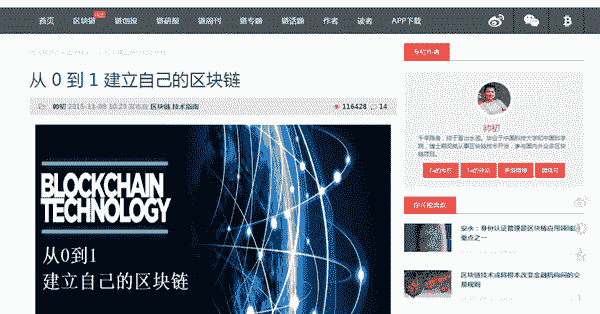
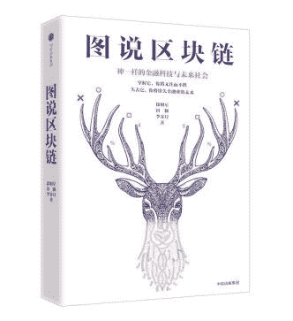

# 王峰十问第 02 期 | Qtum 量子链发起人帅初：区块链短期难以撼动 BAT，建议朱啸虎对新事物应动态看待（附音频）

> 原文：[`news.huoxing24.com/2018022523383179478.html`](https://news.huoxing24.com/2018022523383179478.html)

**本文来自微信公众号：[王峰十问](https://mp.weixin.qq.com/s/pnLD83u88Zy1O6RdlKTtCQ)（ID:wangfengshiwen）**

对话时间：2 月 25 日（周日）22 点（北京时间）

微信社群：3 点钟火星财经学习成长群

对话嘉宾：

帅初：Qtum 量子链发起人，毕业于 Draper University（英雄学院）和中国科学院，之前就职于阿里巴巴，博士期间就致力于区块链技术的开发和研究，具备丰富的区块链行业的开发经验。

王峰：火星财经发起人，蓝港互动集团(HK.8267)创始人，极客帮创投合伙人，投资了 OKex、小程序 SEE 小电铺、淘手游、我叫 MT、聚合数据等近百个天使项目。

蒋涛：中国最大的程序员社区 CSDN 掌门人，曾在巨人集团、金山软件长期负责技术和产品研发。

以下为对话原文整理：

**帅初**：（开门见山直接晒出自拍，真是别具一格的帅！）

**第一问**

**王峰**：群里很多人会有兴趣，我想问已处于链圈技术中心地带的你，怎么看待昨天陈伟星和朱啸虎有关区块链立场的这场嘴战？

感觉这是现有互联网利益守护者和新一代区块链颠覆者的公开撕逼。这边伟星说今天的 ofo 最大机会是区块链化，哇塞都这么快了啊，那边啸虎则说现在的 Blockchain 最多相当于 94 年的 Netscape 之前的互联网，天啊，这比大家常拿来类比的 1998 年 Web1.0 又贬回去了四年时间啊，你怎么看？

**帅初**：区块链不单单是一个技术变革，更多是给了大家一个新的理念，打开一扇窗，让大家意识到，原来世界还可以这样来协作和运行。我个人感觉区块链技术的影响力是一个 10 年 20 年的事情，你很难想想在 2000 年可以通过手机喊一个 Uber, 从这个角度讲，我觉得不用着急，技术的影响力会慢慢通过越来越多的应用落地，并提升商业运行的效率。

98 年的互联网，查看了一下维基百科，哈哈，对我们 90 后或者接近 90 的创业者很陌生，我记得当时美国 SEC 听证会里面提到一个细节，大量年轻人聚集的领域和地方，很有可能会慢慢发展起来。

**群员起哄**：你怎么看待昨天陈伟星和朱啸虎有关区块链立场的这场嘴战呢？

**帅初**：我个人觉得争论是很正常的事情，对于一个新的技术，需要大家全方位的讨论和辩论，美国应该举办了很多次辩论了，对大家都是一个互相认知和互相学习的机会。

**王峰**：如果你给朱啸虎建议呢？你回答这个问题，对我们吃瓜群众很重要。

**帅初**：哈哈，没什么建议。思考清楚了才会产生行动力，但是对待新事物可以动态的看其发展，很多新事物刚出现的时候，看起来往往是不好看的。

**王峰**：陈伟星呢？你会不会觉得他被包围了？一夜之间，哈哈哈

**帅初**：比特币创造了一个新的组织范式，一个价值 1500 亿美金的网络，背后没有主人，没有公司，这个在人类历史上，应该是第一次吧。

**王峰**：所以，我也认为说今天的区块链是 94 年的网景有点扯。

**第二问**

**王峰**：我查了你的百度百科，介绍异常简单，但却链接了你获得 2017 年 Forbes 中国 30 位 30 岁以下精英榜单的 URL，里边入选了鹿晗和迪丽热巴，也竟然还有我投资的物联网 Ruff 的联合创始人荆天为（CEO 是 Roy Li 也在我们学习群里），以及做 QuickDeal 的崔超，小骄傲一下。

最近几天进一步补课，发现你可能是目前区块链创业者中最早做技术传播的人，比如你写了《从 0 到 1 建立自己的区块链》开发手册，同时我发现你还是几个社区的狂热布道师，这与你的 Qtum（量子链）的成功的宣传策略有关？

**帅初**：当时应该是 13 年开始，在 bitcointalk 上面开始大量发帖子和关注各种新项目的进展，当时中文的加密货币和区块链技术的信息非常少，就在考虑写写一些基础的技术教程，当时在巴比特和 bitcointalk ，发表了大量的技术教育的帖子，希望大家可以更多关注到这个新技术的潜力，当时写帖子的时候，最初的想法是想结识更多的技术开发者，这个在 13 年和 14 年，国内是非常非常少的。后面才发现，当时发布的帖子，成了这个行业的入门指导。

**王峰**：我看了一些帖子，很棒。

**帅初**：哈哈，现在看来很多帖子都很初级，但是 15 年的时候，确实国内很少写任何技术性的帖子。

写作说明 

自从 2009 年 Satoshi Nakamoto 发布了 Bitcoin 的开源项目，区块链技术作为其背后的支撑技术也在慢慢发展，2014 年以来，越来越多的科技巨头和产业资本逐渐进入了这个领域，对区块链技术的发展也起到了极大的促进作用。 

我们可以把 bitcoin 看做基于区块链技术的第一个金融应用，它是一个去中心化、无需信任单个节点、隐私又透明、在共识机制下由人人维护的货币系统和支付清算网络。这样的一个去中心化的清算网络正在成为另外一种互联网的基础设施，就像计算能力、带宽是互联网的基础设施一样，比特币的支付网络正成为另外一种互联网基础设施—“信任”，这样的一个基础设施每天由全世界的矿工共同维护，并越来越散发出迷人的魔力，并成为 Fintech 创新的温床和基础设施，也吸引了越来越多的资源进入该领域。 

除了在支付和金融领域的应用，区块链作为一种去中心化的、共享的、无需信任单个节点的公开透明的数字账本，也在逐渐应用到物联网、身份认证、供应链管理、版权管理、去中心化的应用等众多领域。区块链技术解决了计算机领域著名的“拜占庭将军”问题，使得在无需信任单个节点的情况下，创建一个去中心化的共识网络。 

目前大多数和区块链技术相关的项目都在国外，国内区块链技术的开发和应用相对滞后，因此计划在闲暇时间写一些简单的开发手册，希望可以帮助到从事这个行业的个人或者小公司。

**王峰**：V 神也是从写比特币文章入手的。

**帅初**：Bitcointalk 这个地方，应该是聚集了早期行业里面的各路精英。 包括 satoshi 之前也一直在上面发帖子。

[`bitcointalk.org/index.php?action=profile`](https://bitcointalk.org/index.php?action=profile);u=3;sa=showPosts 这个是中本聪隐退前，所有的发言集合。

**王峰**：btw，这个方面还有更加科普的。我们群里的 Okex 掌门徐明星也有一本《图说区块链》，很生动，里边还有漫画和比喻，我和很多小朋友推荐过。哈哈。

**王峰**：我怎么感觉，你的 Qtum 项目也是从社区中孵化中出来的？社区的力量真强大。

**帅初**：当时写文章的时候，没有太多想法，一个是兴趣，一个是热情吧。

**第三问**

**王峰**：你在 2012 年中科院读博期间接触到比特币的时候，就开始研究其背后的区块链技术，可是那时候我们正在死磕移动互联网，社交、工具、游戏，甚至一群上海交大的学生还做了一个饿了么的 O2O 应用，几乎没有人特别留心比特币和其背后的区块链机会。你曾经提到，2015 年你在淘宝基础产品部工作的时候，进一步动了做区块链创业项目的念头。我的问题是，这段阿里淘宝研发和中科院读书时期钻研比特币的经历，以及曾在硅谷学习并与当地区块链初创企业接触的经历，对你后来创业做一个区块链平台 Qtum 有什么影响？

**帅初**：Qtum 属于和社区走的很近的，大部门的技术和想法都来自于社区，因为比特币和以太坊都是开源的项目，Qtum 最初的想法是希望融合比特币和以太坊的优点。

**王峰**：你是社区狂人。

**帅初**：当时 14 年的时候，整个行业进入了谷底吧，而且当时博士辍学了，也在寻找一个突破的方向，当时在考虑如何做一个流行的区块链产品，学习了一段时间的产品设计的理念，后面也去硅谷学习了几个月，想看一下硅谷的技术发展，慢慢的也积累 Qtum 的想法，回过头看，每一段经历都很有价值。

而且在 14 年的时候，币圈 （当时还没有链圈之说，链圈应该是 17 年的事情了，区块链概念的流行是 15 年底）很多人离开了这个行业。但是群里面很多朋友，都坚持到了今天。

目前行业还面临很多技术挑战，我个人感觉还没有到精耕细作做互联网的产品的阶段。

所以从互联网成熟的产品体系看区块链的应用，你会发现非常不成熟和产品很初级。

中科院读博士期间，给了自己很多的自由时间来探索各个加密货币的技术方向吧，基本上整个读博士期间就做了这个事情，其他博士的事情都没怎么做好。

**王峰**：辍学生都厉害，何况博士呢？

**帅初**：当时感觉着迷了这个事情，确实没有时间和精力准备博士论文了，博士最后一年退学了。

**第四问**

**王峰**：我对你讲故事的印象很深，比特币 VS 以太坊，两拨信徒都不喜欢对方：一个称对方为“比特神教”；一个斥对方为“以太坊骗局”。教主，你想这两个社区连接在一起，既保留比特币 Peer to Peer 电子货币协议的底层架构，又在应用层上继承以太坊的 Smart contract，比如你提到可以很好的兼容以太坊虚拟机，这样看来你打的是如意算盘，天下的便宜被你都捡到了。那两拨人看见你的东西出来以后，会不会同时把双矛赐给你呢？比如，要是我的话，我就可以拿系统的安全性和稳定性的问题来攻击你。哈哈。

**帅初**：比特币和以太坊的定位不一样，各有优缺点吧，比特币定位于一个点对点的电子现金系统，以太坊定位于一个去中心化应用的平台。

比特币比较简单，通过一些标准的交易类型和有限的脚本能力，来完成自己的定位，从这个角度上讲，比特币这个网络不是一个平台，你不大可能基于比特币搭建第三方的应用，但是以太坊通过引入虚拟机，把一套加密货币拓展成为了应用平台了，有很好的灵活性，别人可以在上面搭建应用。

**王峰**：进一步追问你，如果量子链遭受大规模 DDOS 攻击，你如何反应？

**帅初**：Qtum 当时设计的需求是 可以兼容这两个最大的社区，安全、稳定、可靠的比特币的底层，再加上虚拟机的灵活性，然后再加上我们自己的创新（共识机制 POS 和更好的治理协议），我当时想法是这样更容易吸引到社区的开发者，因为都是他们熟悉的东西，另外在安全和灵活上，做一个折中。

DDOS 对区块链的系统，不会造成太大的威胁，但是区块链系统会有很多其他的攻击向量（Sybil Attack 女巫攻击和微尘攻击等，针对共识机制和智能合约也有其他的攻击方式），区块链系统只要有超过 100 个以上的全节点，DDOS 起来难度应该就非常大，因为区块链系统通过冗余的设计，保证了高可靠性，在 CAP 中，对区块链来说，A 应该是最重要的。比如比特币网络，从运行到现在，应该是从没有宕机过。

**王峰**：理解，毕竟比特币和以太坊都有一套框架规范了，开发者不那么陌生。很多人对你的这个设计思想很好奇，你不建议讲资金量大的项目放到智能合约上操作，怎么理解？

**帅初**：关于智能合约的安全性，智能合约的本质就是对资金和数据进行自动化的操作，合约的安全是一个挑战，并且合约的多样性和合约所使用的编程语言，都给合约的安全带来了很多的挑战。如果大量资金放到合约中，万一合约代码出现问题，资金是否能够取回就是一个挑战。之前 parity 钱包的多重签名合约出现了问题，应该是造成了 1 亿美金左右的以太坊被永远锁定，在不硬分叉的情况下，这笔钱，基本上就永远丢失了。

相比来说，比特币对资金的处理模式更加标准化和规范化。包括多重签名和一些标准的交易类型，当然也和比特币的灵活性不足有关系，但是也意味着犯错误的可能性降低了很多。

**王峰**：我还在我关心你系统的相关问题，问句题外话，和你有关，怎么看待刚刚发布的以太坊 ERC 2.0？最近好像有更新的迭代版本了。合约开发语言 Solidity 很多开发者不熟悉，有点类似 JavaScript，但量子链支持更多语言？或者说谁支持更多现有编称语言？

**帅初**：ERC2.0 通过一些标准的接口，让 token 的发行极其容易，这也是 17 年以来，各种 ICO 项目兴起的动因之一吧，恩,最近还有 ERC721 的一种新的 token 类型，non-fungible tokens，可以更多的用到数字资产领域。因为目前 Qtum 是兼容 EVM 的，所以所有以太坊上面的合约都可以在 Qtum 上面使用，关于未来支持更多的编程语言，主要是我们在开发自己的智能合约虚拟机 Qtum X86,可以支持 C C++ RUST 等主流的编程语言来写智能合约，因为 EVM 也有很多局限，也有很多需要改进的地方。

更多细节参考这里：

（新一代智能合约虚拟机：QTUM X86 虚拟机 [`baijiahao.baidu.com/s?id=1591217421346753187&wfr=spider&for=pc`](https://baijiahao.baidu.com/s?id=1591217421346753187&wfr=spider&for=pc)）

**第五问**

**王峰**：我看你几次提到前 100 名公链里，中国只占到 2%到 3%的样子，互联网这波走过来，一开始我们是 copy to china，好不容易在移动互联网利用大市场和后发优势扳回来，成了 copy from china。

**帅初**：恩，目前前 100 中，中国项目应该是 4、5 个吧。

**王峰**：我的看法，中国超过美国互联网是因为我们善于在应用层做体验和迭代，我们善于也得益于毛泽东和史玉柱那样的人海战术和群众运动，而不是卡尔马克思和中本聪那样的底层逻辑，比如我们能找到写底层系统的工程师很难，但硅谷很多以一当十的系统工程师，美国人的底层架构化思维比我们强，所以你看人家 Blockchain 一下子又走到了我们前面。我看文章上说你预计中国人会在里边占到 20-30%，这个判断来自哪里?如果以太坊为加密新经济的中心，中国在这一轮新竞赛中的优劣势是什么？

过去是 DOS/WinTel、后来是 ARM/Android，今天可是比特币/以太坊啊。残酷！

**帅初**：我感觉中国这边的技术研发也会慢慢跟上，另外就是我们巨大的移动互联网用户基础加上丰富的场景优势。长期来看，我感觉中国在公有链领域、产品落地、场景落地、细分行业应用都会慢慢上来，并有机会领先。

至于我们劣势，我感觉还是在于研发和底层技术吧，很多区块链领域的基础研发，目前还是海外比较多，并且早期这个领域，不论是比特币还是以太坊，几百名核心开发者中，中国程序员很少很少。

当然这个有很多历史原因了，也和早期加密货币的理念大多来自于海外有关系。

**第六问**

**王峰**：麦刚同学昨天下午给我电话谈圈子里的事情，手机断电了两次，急死我了，其中说到现在很多人是傻逼和装傻逼，他说可爱的是有人不懂装懂，可气的是有人懂装不懂（暗道自己怎么把麦刚给出卖了。。。）比如，现在这些人一提到进入区块链时候，言必称去中心化吗？这让我想起务实的邓小平说“计划经济和市场经济各有利弊，不能一刀切”的那句话。你觉得未来的社会生产和生活场景中，哪些使用中心化技术的场景肯定还会继续造福我们？哪些去中心化应用将会很快让我们受惠？

**帅初**：互联网经过几十年的发展，人们的吃喝玩乐衣食住行的领域，各个互联网公司已经做出来了非常好用的产品，我个人感觉区块链在这些基本的需求领域是没有太多机会的，从这个角度讲，区块链是很难短时间内对 BAT 有什么冲击的。我个人感觉区块链适用于一些特定领域，例如：

1、游戏行业（虚拟道具和游戏渠道变革）；

2、数字内容领域（视频音频文字）；

3、各种 ID 的变革（人的 ID 和机器的 ID 等）；

4、金融领域（例如：人人通过智能合约提供保险服务，自金融领域）；

5、组织架构变革，代替公司制度；

6、投资领域 （VC、PE）；

7、为数字资产提供服务的机会（钱包交易所衍生品和流动性）等。

未来的场景应该是遍地开花，但是目前阶段还没有看到能够颠覆 BAT 核心业务的机会，BAT 解决了人类很根本的一类需求，也具备广泛的共识。

**蒋涛**：中国有多少区块链核心技术开发者？

**帅初**：中国慢慢有一些应用的开发者了，但是在解决区块链面临的一些基础挑战的时候，国内的研发和技术积累，我感觉还不够。按照比特币和以太坊对核心开发者的要求来看，我个人感觉这个级别的开发者，国内还是非常少的。

**王峰**：BAT 都是中心化，未来区块链时代还会继续吗？

**帅初**：这个取决于如何定义去中心化的程度了，目前行业对去中心化的程度是没有一个精确的定义的。另外一个区块链系统的进入门槛也非常重要，如果门槛太高，很多时候反而不容易得到社区的支持，但是面向企业应用还是可以的。

**第七问**

**王峰：**我看你讲了很多你和 EOS 的区别，人家是你的假想敌吗？EOS.IO 的技术白皮书我简单浏览过，开门见山就大谈其可以支持数百万级 TPS（每秒交易量处理），可是你却说区块链不是为 TPS 诞生的，更快的 TPS 可以用支付宝和微信支付。可是，如果按伟星说的 ofo 应该去做区块链，那不是基于 EOS 才好，毕竟 Uber、Airbnb 都至少在数千万日活跃 userbase 上，求解？

**帅初**：关于 TPS 这个问题有不同的切入途径，类似 BTC、ETH、Qtum 都是先保证网络的去中心化程度，在通过各种提升 scalability 的方案，例如：扩容、分片、状态通道等，再提升 TPS, 因为从区块链诞生原因来看，decentralization 应该是很多项目第一原则。因为如果我们需要中心化的方案，有太多中心化的解决方案了，但是也有另外一条路径，例如 ripple 和 bts 和 eos, 从 tps 入手，再慢慢解决网络的 centralized 的问题，最终还是依靠市场来选择吧。

**第八问**

**王峰**：我看量子链的 web，你们团队的 black T-shirt 照片很帅，你的 web 页面几乎是我看到国内团队最帅酷的，其中的 DAPPS 二级页面上已经放了很多 LOGO，其中有 INK、Qbao 和 Flash 他们研发的 BeeChat，你最看好他们谁？此外，你最缺什么类型的 DAPP？几个细分领域的应用场景，你提到了可以道具化和渠道化的游戏、电影音乐文学等娱乐、金融保险、物联网 ID 等，能否给我们稍微举例？

我今天才看到你的网站，有点酷，比做游戏的还酷。

**帅初**：目前从行业的角度来说，技术和产品都在同步发展，从行业的角度来看，我们需要找个除了加密货币和 ICO 之外的，能够不断落地的应用，但是目前很多 Dapp 应用都处于早期的概念阶段，还很难到 C 端口用户的手里，但是确实有不同领域的团队在做不同的尝试，我们需要一些能够紧密结合区块链技术特点，并能带动 C 端用户的例子。

例如在视频领域，互联网视频的分发、版权保护、支付体系等，可以借助区块链技术变革现有的视频（电影、短视频）的创作和分发体系。通过新的文件格式，借助于智能合约技术，实现视频的分发和付费的统一，并且可以实现视频版权的保护和点对点的交易，从内容领域推动互联网从信息互联网到价值互联网的变迁，重构现有的互联网内容分发体系。这个领域，我个人觉得还是非常有想象力的。

**王峰**：现在的 DAPP 组合中，你赞哪一个?我看到你们平台上有 50 多个合作 DAPP 了，都是第三方的吗？

**帅初**：另外智能合约给程序员也打开了一个新的世界，因为区块链系统提供了一个无门槛的和可信的清结算协议。

很多时候，人们的需求只是需求程序的功能，其实并不希望天天下载不同的 App, 从这个角度来讲，比如我如果需要一辆车，其实我并需要滴滴或者 uber 或者易到等，我只需要对我的手机说句话，我需要一辆车，去哪里就可以了，人们需要 app 的功能，但是这些功能并不一定通过 app 来实现，你也可以在智能合约上面实现。

从这个角度讲，我感觉这个有机会重构软件开发的流程，当你用 3 行智能合约的代码，可以借助区块链的平台，实现一个 app 功能的时候，就没有程序员愿意给 app store 和 google play 开发应用了，这个有机会颠覆软件行业，因为其他的执行逻辑，区块链作为一个全球计算机，会帮助你执行，你不需要自己去管理 server 了或者网络了等。

**第九问**

**王峰**：区块链掀起了人类历史上第一次用技术重构生产关系的革命，这是要在一群人还没有尽兴的酒席上掀桌子的架势，先不谈政府监管各国态度不尽相同，且说 Apple 和 Google 已经很大了，毕竟眼下的我们对他们有设备上的路径依赖，他们不会审核通过你支持的 DAPP，虽然我们只能选择使用企业应用或者被逼重新回到 web 模式获得体验，新利益集团的对立，互不相让，我很担心，这场革命极有可能引发全球生产力发展的阶段性停滞甚至倒退，你觉得呢？

**帅初**：我觉得这个不至于吧，但是加密货币必然会面临更多的约束和监管。但是，区块链平台本身本质上提供一个信任创造平台，trustless Platform，更低成本建立信任必然会降低商业交易的成本，提升商业效率。从这个角度来看，我觉得并没有那么大的冲突。

**王峰**：Trustless，这个词好。

**第十问**

**王峰**：你大学时代就开始接触比特币，并陆陆续续走上了追随中本聪的道路，现在你也在开辟一条自己的道路，很多人跟你走，连我都在公司内部开发团队里说是不是要和你合作。那么，今天的你还有比特币信仰吗？

**帅初**：哈哈，最后一个问题，我发之前写过的一篇文章。可以更全面的阐述我对这个问题的看法：《[如果在历史上找一个人对标中本聪，我想那个人应该是牛顿或者香农。](http://www.8btc.com/blockchain-tech-productive-forces)》

我想说的是，中本聪搭建了第一辆汽车，我们都不用骑马了，我们都在汽车上，但是如果对汽车迭代，并且发展出飞机是我们长远的努力方向。

**One more question**

**王峰**：昨天区块链行业发生了一件大事，比特币 Core 组发公开信，说打算修改比特币的共识机制 POW（工作量证明），引入 POW+POS（权益证明）混合机制。据说是为了应对吴忌寒的比特大陆对比特币算力的垄断。吴忌寒反驳说，这么做会让比特币在虚拟货币市场的份额跌倒 10%以下。你觉得这场抢夺比特币话语权的斗争会以什么方式收场？

现在大家普遍感觉比特币“不好用”：转账时间和费用受到诟病，更核心的是没有以太坊智能合约支持下的生态体系。我刚才一开始也提到了，量子链更像是比特币+智能合约的糅合体。这两天发生的事情，你对此早有意料吗？ 

你又是怎么看待吴忌寒支持的比特币现金（BCH）呢，有人认为它才是真正的比特币？

**帅初**：社区有人想引入新的共识机制，我觉得这个是正常的，去做就好了，市场自由竞争，不同技术和分叉之间也自由竞争，但是当我们谈论 CryptoCurrency 的时候，很多时候，不是技术来决定的，背后的因素超越技术。对比特币的批评，取决于比特币社区如何定位自己吧，不同的定位也决定了不同的技术方向。我觉得市场自由竞争是好事情，行业也才刚刚开始，回看 btc 的社区，我觉得应该有更多的创新和迭代。

上午的时候 我也写了一点，也 post 这里：

1、作者对中国和 bitmain 有偏见 ；

2、要改算法自己修改就可以了；

3、POS 的 btc，其实已经有好几个了

4、btc 定位于 digital gold 还是 money transfer system，决定了其技术演进的方向；

5、Qtum 本质上是一个 POS 版本的 BTC+ 智能合约；

6、BTC 社区 需要更多大胆的想法和创新。

声明：本文为火星财经原创稿件，版权归火星财经所有，未经授权不得转载，转载须在文章标题后注明“文章来源：火星财经”，若违规转载，火星财经有权追究法律责任。