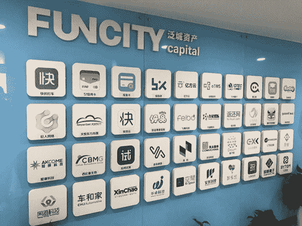

# 王峰十问第 03 期 | 快的打车创始人陈伟星：我想活在新世界、赵长鹏很像王兴、失去快的天天买醉、用区块链解决世界难题（附音频）

> 原文：[`news.huoxing24.com/2018022701085099964.html`](https://news.huoxing24.com/2018022701085099964.html)

本文来自微信公众号：[王峰十问](https://mp.weixin.qq.com/s/zUpt9nQZSkD_SKGA3QA5-A)（ID:wangfengshiwen）

对话时间：2 月 26 日 22 点(北京时间)

微信社群：3 点钟火星财经学习成长群

对话嘉宾：

**陈伟星：**快的打车创始人，泛城控股集团有限公司董事长，区块链投资新锐，已投资币安、量子链、火币、波场等多个区块链项目。

**王峰：**火星财经发起人，蓝港互动集团(HK.8267)创始人，极客帮创投合伙人，投资了 OKex、小程序 SEE 小电铺、淘手游、我叫 MT、聚合数据等近百个天使项目。

**王峰：** 今天的王峰十问，很多人期待，我也期待，因为我们请来了眼下风头最劲的陈伟星同学。本来我做十问，想从伟星的区块链语录里去找一些素材，后来我一想，那我肯定会陷入到他文字的枪林弹雨中，加之今天的模式是十问，本来就应该换一个气氛和主题。伟星，今天可以轻松一下。

所以我决定更多从他的创业、投资和区块链思想的成长轨迹入手，结合一些当下热点话题。还是采用十个问题一问一答中途追问的问话方式，希望不要太严肃，可以娱乐一点，FUN FIRST。

这次的主题是：为什么是你陈伟星?

我也不想从伟星的语录中刨根问底，伟星的话如今在网上已经是随处可见了，他强悍的简历，网上百度百科很容易找到。

为什么是你陈伟星?

**陈伟星阐述为什么所持数字货币永不套现**

**第一问**

**王峰**：近一段时间里，大众开始接受一个新词儿，是一种草本植物，叫韭菜。北方人喜欢拿来包饺子。区块链里谈的韭菜，和饺子没有关系，而是在数字货币投机市场里交学费的散户或者赔钱户。我之所有这样开头，是你和金沙江创投朱啸虎的互怼中多次提到这种草本植物。昨天和量子链帅初的王峰十问中，我把你们之间互怼，看成是新旧利益集团的公开撕逼（我们就事不就人啊）。

我看你事后很快发朋友圈声明，所持加密货币永不套现，且绝不割韭菜。朋友圈留言“真正的信仰者，绝不割韭菜，也不当韭菜！只有卖的才是韭菜。”我那天在网上一看，一震。你的话让我想起鲁迅先生说的“真的猛士，敢于直面惨淡的人生，敢于正视淋漓的鲜血。”

你确定这不是你的意气用语？如果是真心话，为什么？

**陈伟星**：我说的是真心话啊。因为未来没有非加密货币的钱，所以，我在未来等你们哈哈。

我和朱啸虎没有新旧利益之分，我也是旧时代过来的人，混得比他帅，只不过他想死在旧社会，我想活到新世界了。

**慕岩**：王峰，伟星最近不仅耿直，还“无理”，我好不容易说服美联储做了十年经济学家的魏晨阳进群，伟星马上说“美联储经济学家都来了我们屌丝还怎么自己讨论问题”，好不容易请来的魏老师就退群了，，，卧槽，这是啥“耿直”？

**陈伟星**：你好好去干活。

**慕岩**：半点虚心被狗吃。

**陈伟星**：你送了薛蛮子几个币？送了李明远几个币？你募集的 200 个比特币套现了没？赵东的币想退你退了没？

**慕岩**：同意伟星应该虚心听一听美联储经济学家意见的请打 1，我继续去延请魏晨阳参与讨论和辩论，让真理越辩越明。

**陈伟星**：你说川普的家人投你，外交部给你发奖状了吗？

**慕岩**：你所说的没有一个是事实，我已经让律师取证，起诉你！

**陈伟星**：我都忘了啥问题了。

**群员助攻**：纷纷贴出王峰的第一问。

**陈伟星**：传统的 vc、pe、preipo 到二级市场，是一个套路。其估值体系是基于 p／e rates 这样的共识机制，通过与其他股票对比、预期以及货币效应，被市场选择出来的。是货币效应，决定了其价格的上限。

是不同股票和预期，决定了相对价格，有的低有的高，有时低有时高。

一旦货币供应过量了，而且其传导机制原因，央行放水的钱，通过银行扩大信用，大部分钱传导不到老百姓手上，去了金融市场空转。使得金融市场的泡沫越来越大，相对价格变化越来越剧烈，为了平滑风险，各种结构化资金和金融衍生品不断增加，被动投资不断增加。

金融市场变成了一个大赌场，极少数人赚钱，大部分人亏钱。即使在美国散户没那么多的环境下，短时间内亏钱的人不多，但大部分钱依然只传导到极少部分人手上。

美国的利润总额里面有 60%以上是资本利得，中国更高。但实际财富是劳动者、创造者、组织者创造出来的。

为什么整个金融市场能赚走我们的实际财富创造者的大部分价值？

**王峰**：为什么？美国民众不也经常抱怨华尔街贪婪吗？

**陈伟星**：因为货币是他们创造的，他们把货币借给干活的人，干活的人要给他利息。这就是我们现在的金融制度，债务就是诱惑性的奴役工具。

**王峰**：他们有货币权，人家就说了算。

**陈伟星**：所以，为什么信用货币不是劳动者和创造者创造的呢？我们每一次 tokenize，就是一个创造者创造信用的过程。

你给我一个比特币，我还你 1000 星星币，只要星星币有流动性，你依然可以拿星星币去买可乐打游戏。我也可以用比特币去支付工资搞开发。

你给我比特币，是因为你觉得我能使用这个比特币创造更多的价值，所以星星币相对比特币会涨。这是你的预期，如果正确了，你就赚了；错误了，你就亏了；但你应该承担这个风险。

这样整个市场上，有了很多星星币，比特币也没有丢失，星星币就是创造出来的信用。但是是创造者创造出来的。

**王峰**：相当于硅谷夺了华尔街的饭碗啊。技术有能力 Token 化之后，要自己掌握货币权。

**陈伟星**：是的，华尔街会被硅谷取代。这是历史的必然，是人类的幸运。

**陈伟星：不需要老百姓理解区块链，要创造出他们喜欢的东西，让他们用起来**

**第二问**

**王峰**：你知道你自己一个人在春节到底发了多少个帖子吗？3 点微信区块链群有今天的影响力，你认为你在其中起了多大作用？很多人看区块链，是因为徐小平老师当年振臂一呼“all in 区块链”，又是蔡文胜的那句“不参与才是最大的风险”，再就是看到你一系列的精彩观点，比如区块链是“泡沫先行，之后财富上链”。

我觉得，你在春节期间提高了区块链在互联网精英群体中的进一步关注度，感召了一大批人，同时加剧了另一大批人的焦虑感。你感觉，很多人还在等什么？为什么这么多人还在观望，甚至持不屑和怀疑的态度呢？

**陈伟星**：我对区块链感到激动的事情，是因为以前一直解决不了的困惑找到可以赖以解决的技术手段了。

为什么生产力发展到今天，那么多人还在挨饿？

为什么有人东西卖不出去，有人没有工作，有人没有钱？

机器人越来越强，未来都被资本垄断了，不需要工人了，那更多的人失业，该怎么办？

为什么滴滴快的这样的估值能高成这样？

**王峰**：为什么？小时候我学政治经济学，抱怨资本主义生产关系不合理。我们通过计划经济解放生产力的。很早了。后面有不让这样说了。

**陈伟星**：买上海一个高端房子，比很多上市公司 10 年的利润还高；而这个上市公司的 1%的股票，可能还能买上海的一套房子？

这些问题，实际上和我们每个人息息相关。可惜太大了，没人愿意去想。大家都想着赚钱，拼命找工作，拼命加班。不断的投资，不断的找人接盘，想办法上市套现。

**王峰**：现有股权结构化的公司体制就是这样循环的。我的公司（蓝港互动）做八年才上市啊。

**陈伟星**：这些问题，都源于刚才讲过的货币制度和金融工程。这些问题我初七都讲过一遍了。

**王峰**：对区块链化，大家还在观望中啊。

**金宇**：所以，为什么信用货币不是劳动者和创造者创造的呢？--这个问题堪比苏格拉底之问

**陈伟星**：老百姓是没办法理解复杂事物的，他们需要的是体验，用体验的激励，改变他们的行为，群体的行为就会改变社会文化，社会文化会影响他们的认知。不需要他们理解，需要创造出他们喜欢的东西，让他们使用起来，慢慢就理解了。这个当年打车是一样的，我刚开始做的时候很多人反对、嘲笑我、打击我们。

**陈伟星：怼人首先是因为比特币信仰，张颖让我去讲课，朱啸虎不想好好学习**

**第三问**

**王峰**：有人说你有“看透人生，玩弄傻叉于股掌之间”的那种优越感，比如我看群里就有人挺讨厌你的腔调，但是群里大部分人喜欢你，甚至叫你耿直 Boy。可是，我看这不到十来天里的时间里，你不但怒怼了人家独角兽捕手朱啸虎，还陆续惹恼了人缘极好的百合网慕岩、最懂牛腩和美甲的互联网思想家雕爷、人和你一样帅连公共账号都比我们写得好的经纬老大张颖、还有国金苏亮等一大票人。

在我看来，你这么年轻又很早在财富上获得成功（有人说了赚了几百亿），很多今天很多上市公司 CEO 口袋里的现金和股票账面估值远低于你，你能有今天的气候，必有你的成功法则。我今天先不问你的成功法则，这个留着半年以后问你。

我的问题是，你一言不合就开怼的性格是怎么产生的？为什么要一下子怼这么些人呢？是你相信狭路相逢勇者胜，还是因为比特币信仰？

**陈伟星**：我觉得首先是因为对于区块链的信仰。你看我和张颖关系还是不错的，他之前发朋友圈或者微信，我也反对他的观点，试图和他解释区块链的价值。

张颖是我们快的打车的早期投资人，也是我们保险师的早期投资人，我们是战略合作伙伴。

**王峰**：嗯呢，毛泽东思想不是教导我们，要团队一切可以团结的力量，即使攻城之法为不得已也要先盯着一个打吗？万一他们联合起来怼你怎么办？哈哈。原来，那么多年我真不知道你脾气啊。

**陈伟星**：但张颖我反问他一些问题，说一些不同观点，他马上会和我认真的探讨，甚至私信问我问题，让我去给他们公司讲课。

朱啸虎是压根不想好好学习，一棍子把一群热心创业的青年打死，还道貌安然，我觉得很好笑。

今天是不是说，把 ico 说成是庞氏骗局，是侮辱了庞氏骗局？你们确认下他说过这个话吗？

**王峰**：控制脾气吧，少树敌。

**陈伟星**：树敌会被暗杀吗？再说，我们就是学术之争，又没约架。

现在全世界的债务危机，本质就是全世界的庞氏骗局，只能不断的借新债还旧债，其实永远还不出来，问题就越来越大，不断的演变成政治危机，欧债危机和英国脱欧就是例子。

那些骗钱的项目，是欺诈行为，是需要通过法律制裁他们，这是我们需要完善的。

当一个人要胡说八道的时候，真的没法好好的聊天了。他的时代已经过去，区块链根本不缺他。

我是 social design 派，我相信这个社会未来是可被编程的，人与人的关系不需要中介来守信，用只能合约来实现。现在的中介转走了绝大部分钱，未来只需要给机器一点点能源。

**陈伟星：区块链四大要点已经具备，第一波大机会就在未来 6 个月**

**第四问**

**王峰**：你昨天私下和我说，你非常不认同把今天的区块链技术当成是 1994 年 Netscape 刚刚推出网络浏览器 Navigator 的年代，觉得这话很 TM SB。我表示基本认同，否则怎么解释 3000 亿美金比特币市值，哎呀我们怎么总是谈钱啊。

但我又注意到，你已经开始和 ofo 戴威讨论他的小黄车如何用区块链和 Token 设计新的生产关系了，我相信听完你这话，急的不一定是戴，更可能是摩拜的胡玮炜了。其实，听到你这样说，何只是戴威和胡玮炜呢，你的老对手滴滴的程维不急吗？难道我们不就更急？据说那些还没有进入三点钟学习组织的人更是急得不行。

我的问题是，区块链的春天真的到来了吗？如果是，为什么？我记得，记错了你千万别怼我，我怕怕，好像你和张颖争论的时候，说这个区块链风口期最多只有半年。为什么？

**陈伟星**：说区块链是人类的春天，不为过。现在能看得到的大机会，实际上是越来越清晰了。

**王峰**：风口来了吗？风口期有多长时间？你预计今年会有折腾到什么局面？

很多人去日本，不在国内干。国内有机会的扩容，还要看监管如何做。

ofo 们今年会有人 tokenize 吗？滴滴们呢？

虽然我一直想去日本看看区块链环境，但是更期待中国的机会。

**陈伟星**：区块链发展有四个要点：1.信仰并长期持有比特币的人数与持币量；2.波浪形抬高的大泡沫；3.健壮的基础设施；4.不断上链的资产。

基础底层链的 community、经济体链的 community、去中心和中心化的交易所、钱包等各种基础设施，已经很多团队都在开始研发了，这些是必然需要的，后来者很难赶上。

资产上链是被大泡沫吸引上来的，和当年我们很多公司为了国内的高估值拆 vie 回来一样。

第一波的大机会，已经很明确，这六个月会有足够的选手。

后来者，只好在这些 community 里面去做内容，再要去创新，需要新的技术突破。

实际上，第一波机会，区块链上现在并不缺什么，都是看得到的技术需求；后面一波重大的技术突破，还没有看到。

**陈伟星卖掉快的之后想找更大机会却快抑郁了，开始研究经济学，继而发现区块链**

**第五问**

**王峰**：你在三点钟讨论群里的言论，涉及到了大量宏观经济学和货币经济学知识，感觉你信手拈来，奥地利自由市场学派、凯恩斯、哈耶克都在你的文字里不时被提及，有人开玩笑说你一个春节就成为了民间第一经济学家，也有人说你是区块链第一思想家。连群里的阿里巴巴曾鸣教授都夸你有很好的宏观经济学底子，我当时好奇，你怎么可以知道得这么多。

后来我想你和我们都做过网络游戏，都知道消费产出供求关系，后来你做快的打车肯定没少和地方官员乃至中央部委级官员打交道，他们大多人重视宏观经济，我想你总要拿一些理论知识来对付他们吧。

但是我还是想知道，你为什么会对宏观经济、货币史有如此丰富的涉猎？我记得你大学是学土木工程的，为什么你如此深通经济学？进一步问你，和你很熟悉的马云，曾经在演讲中多次提到他最不相信经济学家，你作为一个快的出身的创业者，为什么开口闭口都是经济学家的口吻呢？哈哈。

很多人觉得你现在讲话越来越深奥了。

**陈伟星**：这个世界上的知识，想明白了都是简单的；复杂的往往是不明白的。

**群员起哄**：星总经济学得好啊！

**陈伟星**：我这两年吃饱了撑着，去看了很多经济学的书，也去全世界访问了很多奇葩，经历了无数个夜晚的苦思冥想。

不是因为要去忽悠官员，因为想找大的创业机会，想超越之前，不然抑郁症了，拼命喝酒拼命思考，创业者活着就是为了解决一个又一个更大的问题，这样很爽，所以要找问题，我是先思考经济和金融，再发现区块链的。

一开始只理解比特币，我投了一圈区块链后，越来越理解区块链的速度了。我最早投的区块链项目，基本都是边喝酒边决策投的，哈哈哈，根本喝不醉，越喝越不想回家。全靠喝酒解愁，哈哈。

自从找到了区块链，酒也戒了，女朋友也不要了。

**王峰**：没有想到你喝酒喝出来的经济学，我后面有类似问题要问你。

**陈伟星**：喝完酒回家思考人生，哈哈。

**陈伟星坦然承认当年卖掉快的很痛苦，借酒浇愁，反而读了大量经济学的书**

**第六问**

**王峰**：卖掉快的那两年，你心里甘心吗？雷军当年卖卓越网给 Amazon 的时候，我在金山办公室恭喜他发财，他说你试试卖儿卖女就知道这是什么心情。

快的滴滴合并时的规模，是和美团大众点评、58 赶集合并的 case 同一个量级的，都是百亿美金量级，甚至你们的影响力更大，但很多人只知道当年大众点评的张涛、赶集网的杨浩涌，还有很多人那时只知道快的，不知陈伟星，为什么那时你如此低调？怎么前后好像变了一个人一样，哈哈。

**陈伟星**：WC，我没办法啊，输了啊。所以借酒浇愁去了，喝着喝着就开心了。

我没啥好和公众讲的，也没啥兴趣讲，所以就几乎拒绝一切媒体采访。

区块链是一场生产关系的变革，需要传播，他和别的技术不一样的地方是，信仰和共识比技术还重要。比特币这样，技术更新那么慢，到现在已经是非常牛逼的。智能合约、扩容，其实对比特币没那么紧急重要。

**王峰**：卖了就卖了？喝酒酒量大吗？

**陈伟星**：这两年无聊，让我认识了各种各样的精英，学习了很多东西，喝了很多好酒，挺好的。想明白区块链后我变化才大。

**群员**：星星总有了更好的开始，程维现在一定比星总痛苦啊！

**陈伟星**：我和程维很不一样的性格，其实我们当时是同一届的北京化工大学同学，但我不喜欢那个学校读了三个月就退学了，他坚持到最后。我对于不喜欢的环境，要么改变，要么离开。

**陈伟星：不以赚钱和独角兽论英雄，要以改进社会缺陷论英雄** 

**第七问**

**王峰**：我知道你在进入区块链之前，可能处在一个相对空档期。做快的不久你引入了 CEO，转而扮演更宏观一点的董事长角色。快的和滴滴合并之后，你转型纯粹的投资人，投了很多项目。这个时期，你一定想过你自己的大方向再去创业吧？为什么没有再创业？我是指像当年快的那样自己做一个新的 BigOne。

**陈伟星**：我和程维很不一样的性格，其实我们当时是同一届的北京化工大学同学，但我不喜欢那个学校读了三个月就退学了，他坚持到最后。

我对于不喜欢的环境，要么改变，要么离开。

**王峰**：你和程维有缘啊。

**陈伟星**：不是去中心化的问题，是如何解决公平性问题和劳动者激励的问题。

你不能以赚钱论英雄，不是以独角兽论英雄，要以改进了多少社会缺陷来论。

现在是人民对美好生活的追求与不均衡不充分发展的矛盾。

如何解决这个矛盾，才当前全世界的最大的机会。

区块链就是解决这个矛盾的技术工具。

所以我们要恭喜人类和人类的领袖们，他们有了从未有过的历史机遇。

要寻找大机会，得深刻的理解人们的痛楚，而不是数自己的功绩。

**群员**：VC 大多数一群焦虑抑郁的人群，投出独角兽的是极少数赢家，朱啸虎不是天天说他很焦虑么？因为他也不知道下一个风口是什么。

**陈伟星**：朱啸虎更关心他投资的公司的估值和套现的时机，而不是社会的问题，这样就缺少了思考这些问题的动机。

**陈伟星：首次见赵长鹏觉得像王兴，丑和帅都像，就投了** 

**第八问**

**王峰**：我看到你在区块链产业的投资，非常震撼，几乎是大获全胜。我曾说过，最早的移动互联网成就了 IDG 周全、熊晓鸽，电商成就了红杉的沈南鹏，而移动互联网成就了经纬的张颖，甚至 O2O 还成就了金沙江的朱啸虎，而你几乎卷走了区块链早餐最好吃的蛋糕，我看过你的区块链投资组合，包括币安、火币网、Qtum 和 TRON 等一大批市值最高的中国团队项目。所以，我套用红杉沈南鹏他们惯用的“赛道论”，你是不是把数字货币交易所和基础公链都当成了赛道？如果我的“赛道论”猜想是正确的话，老实坦白，你到底投了多少数字货币交易所？又投了多少公链？你是怎么发现币安的投资机会的？

**陈伟星**：朱啸虎更关心他投资的公司的估值和套现的时机，而不是社会的问题，这样就缺少了思考这些问题的动机。

你不去关心别人，就会失去最早服务别人的机会，每一个创业者需要最早的发现别人的痛楚，最早的去服务他们。

**王峰**：恩恩，放过啸虎吧。

**陈伟星**：国内打车软件我快的第一家做成功的，他搭了我们的顺风车，不知道为啥那么自豪。我都觉得我是运气，他把自己当神了，哈哈哈

**群员**：老实坦白吧，投到数字货币交易所了？

**陈伟星**：我就是盲投的，币圈老人们，一看人品好的我全投，见面聊十分钟就说投。很多人不让我投，哈哈哈

**王峰**：今天我才觉得星星实在。

**陈伟星**：我没数过啊，大几十家吧。

**王峰**：哇噢！

**陈伟星**：很多间接投的，我根本不看白皮书。

（此时，群员丢出一张照片）

**群员**：照片已存哈哈哈。

**陈伟星**：好吧，做广告哈哈哈。

**王峰**：对了。你怎么看待赵长鹏和李林这两人的不同？又怎么看待帅初和孙宇晨这两个人的不同？从投资人角度上看，这些区块链创业者们最大的相同特质是什么？

**陈伟星**：我和他们两都不熟，直觉都是伟大的企业家！哈哈哈。

我是被何一逼着去见长鹏的，然后边吃泡面边听他讲，我觉得他的面相和王兴很像，于是吃完泡面我开心的走了。

李林是个有格局的人，他投资了很多从他公司离职的同事，帮助了很多人。我真心的非常喜欢这样的格局，第一面就很喜欢他。

**王峰**：我也是这样的人，自我感觉啊。李林厉害！

**陈伟星**：李林对从火币离开的人，确实够可以。

帅初是个非常简单、明了、大度、有前瞻性而且坚定的人，他和赵东两教给我很多币圈的历史。

就是他们两丑的和帅的神情都挺像的。

**王峰**：昨天我采访帅初。他口才比不了你。

**陈伟星**：孙宇晨就是个乐观简单挺会做生意的 90 后，他被历史和缘分推上去的，我是被站台的。但他是个非常认真做事情的人，也非常聪明，我真心觉得他可能会是个传奇。

他们都想解决问题，不是单纯为了赚钱。

**群员**：徐小平和蔡文胜呢？

**陈伟星**：徐老师就是个老师，喜欢当老师的老师，内心无限信任年轻人，见到谁帅就投帅。

**王峰**：我很赞同。我爱徐老师真的。徐老师心内透明。

**陈伟星**：文胜是个直觉天才，我觉得他从来没有完整的想明白很多事情过，但他就是个直觉天才。

我夸人还可以吧，哈哈哈。

**王峰**：文胜如果做产品，肯定是很好的运营经理。

**陈伟星**：文胜如果去编程，会使一个很好的产品经理。哈哈哈。

孙宇晨是我同学，和慕岩一样是我湖畔的同学。我批评同学从来不客气，孙宇晨不是非常成熟的企业家，但他是个简单干练想做事情的人。他的负面和运气是平衡的，因为他有一些生意人特点，有一些缺点，过度 pr，很多人不喜欢。

但很奇怪的是，老外大妈们挺喜欢的，说他是来自东方的神秘力量。审美不一样哈哈哈。

**陈伟星：名人站台，资本估值更高;要紧盯新技术和新文化的形成** 

**第九问**

**王峰**：你说过资本市场受名人影响越来越大，估值模型脆弱，为什么你这样说？按理说，今天的世界，不止是互联网，还有 AI、IOT 和 Blockchain，这些科技的力量，足以让一个能人不要任何资源就可以崛起，比如当年的马化腾和扎克伯格，只要足够的聪明，或者说有更清晰的认知，根本不愁没有机会。但是，如果真的以名人影响来做价值评估上的尺码，是否意味着今天的这个社会，感性认知因素要占据理性认知因素的上风了？如果是，面对今天的环境，青年创业者们该怎么办？不会这么悲观吧？

这个问题，不知道你是否可以明白我的苦心？

**陈伟星**：因为我们的资本市场的力量太大了，资本在创业优势里面越来越大，名人站台，可以比普通创业者更加容易吸引聚集投资者，估值更容易高，资本市场都这样。

年青人的机会，永远靠两点，新技术和新文化。

**王峰**：名人站台已经是区块链的标题打法了。传统股权投资不是这样玩的，乐观看未来。

**陈伟星**：我们要相信，他们也曾年轻过，他们也都很聪明，如果没有新的技术和新的文化因素，问题轮不到我们来解决。所以要创造优秀的企业，一定要紧紧的盯住新技术发展，和新文化的形成。

**王峰**：我昨天突然悟出来，新的就是对的，年轻就是对的。世界要向前，大家看不懂的东子，很有可能是大事。

**陈伟星**：传统股权也一样的，现在融资节奏太快了，资本的力量太大了，所以现在的创业者，一定要注意在机会来临的时候，聚拢势能，迅速提高资本门槛。

**陈伟星：区块链最大魅力是共享主义，趣谈夫妻链** 

**第十问**

**王峰**：第十问有四个问题，10.1 如果没有区块链，今天的你最想做什么？

**陈伟星**：晚上没事就喝酒。

**王峰**：10.2 投资人和创业者，只给你一个选，你要哪一个？

**陈伟星**：看书看信息找机会，寻找活着的意义，哈哈哈。

**群员**：喝酒改变人生，喝酒给了你力量。

**陈伟星：**创业者啊，投资很无聊的。但我甘于做背后的支持者。

**王峰**：10.3 还有，有人悄悄地问我，你有女朋友了吗，或者说你想换一个女朋友吗？

**群员**：星星请正面回答，我们还要机会吗？

**蔡文胜**：剧透一下，星星说，自从搞区块链，不喝酒不吃美食，也没有性生活了。

**陈伟星**：区块链搞得我女朋友都不知道去哪了啊？这里有八卦新闻记者吗？

**群员**：今夜，我们都是八卦新闻记者！没人来学习，都是来征婚的！

**陈伟星**：区块链最大的魅力，是真正的能实现共享主义。

**群员**：共享女友吗？

**陈伟星**：可以通过智能合约来确认男女朋友或者婚姻关系，登记在区块链上，自由选择合约模式。

**群员**：女友链？夫妻链？怎么发 Token？

**陈伟星**：谁来搞，我来指导。

把有血缘和情感的关系族谱，永远定格在区块链上。

可以自由选择，是几夫几妻模式，选择违约分配方式，采用分布式仲裁。

**王峰**：10.4 最后，严肃地问一句，你有比特币理想吗？怎么为我们描述你的区块链理想？

这是最后的 qiuestion，Finally.

**陈伟星**：区块链时代，改变世界不是一个人能干的，而是，大家都永久持有比特币，干掉美元霸权。

**王峰**：“可以自由选择，是几夫几妻模式，选择违约分配方式，采用分布式仲裁。”伟星这样描绘它的区块链理想。

**群员**：星星说的是 family chain。

**陈伟星**：同时，要通过硬分叉这样的机制，和社区博弈，来保护比特币的物理性（不受人为控制）。

**王峰**：“区块链时代，改变世界不是一个人能干的，而是，大家都永久持有比特币，干掉美元霸权。”伟星抽了口烟，淡淡地说了一句。哈哈。

**陈伟星**：然后，各种共识下的 token，来实现多货币机制，去中介化的信用机制，来把交易成本降到最低。

未来会非常有趣。

甚至，我觉得人民公社类似的会继续兴起。

一个公社主任，带来大家生产比如橘子，与另外一群公社主任，带领着生产不同类别产品的群体，提前交换，组成混合型币，通过智能合约锁住规则。这样，一个农民只要生产出产品的时候，就已经实现了交易。

努力的生产 100 个橘子，就已经有了 100 种不同的商品和服务，丰富会让他感受到富裕，为了这种富裕的感觉他更加努力工作，就促进了更多的财富创造。

声明：本文为火星财经原创稿件，版权归火星财经所有，未经授权不得转载，转载须在文章标题后注明“文章来源：火星财经”，若违规转载，火星财经有权追究法律责任。