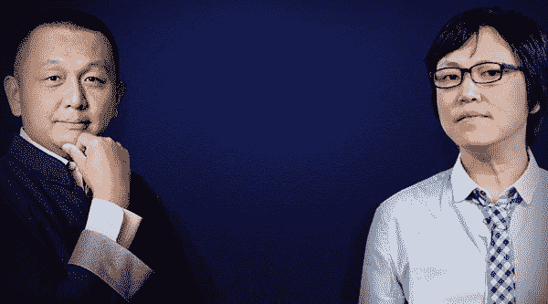

# 王峰十问第 06 期 | 金沙江创投朱啸虎：作为早期投资人，我们对任何技术都有好奇心（附音频）

> 原文：[`news.huoxing24.com/2018030716083225690.html`](https://news.huoxing24.com/2018030716083225690.html)

**本文来自微信公众号：[王峰十问](http://mp.weixin.qq.com/s/STvphEWsBjWXMwGe-Jv_IA)（ID:wangfengshiwen）** 

**对话时间**：3 月 7 日 22 点

**微信社群**：3 点钟火星财经创始学习群

**对话嘉宾**：

朱啸虎：金沙江创投董事总经理，拥有复旦大学的世界经济学硕士学位，上海交通大学通信工程学士学位。

朱啸虎专注于互联网、无线和企业 IT 投资。他因为在饿了么、滴滴出行、ofo 小黄车和映客等公司的早期投资中创造的极高投资回报，被称为“独角兽捕手”。在《福布斯》发布的 2017 年全球最佳创投百人榜，43 岁的朱啸虎成为榜单上中国区最年轻的投资人。

**王峰：火星财经发起人，蓝港互动集团(HK.8267)创始人，极客帮创投合伙人。**

**以下为对话原文整理：**

****王峰**：给大家介绍今天来的嘉宾，相信没有人不知道。他就是被人称作是独角兽捕手的朱啸虎。让我们看一看他过去的投资成绩：**

**2011 年，饿了么；**

**2012 年，滴滴；**

**2015 年，映客；**

**2016 年，ofo；**

**2017 年，狼人杀和小电。**

**今天我们和啸虎探讨的十个问题，关乎于他的成长、世界观、方法论以及争议。啸虎，今天你能来，不管你给出什么回答，行业里产生了什么反应，我都非常非常佩服你。正如我多次邀请你做“王峰十问”时对你说的那样，我十分欣赏你坦诚、直率的性格。你说过，兄弟，我们之间不用见外。**

****朱啸虎**：说实话，怕影响各位赚钱，本来不想再谈区块链和 ICO 相关的事情了。但是实在和王峰认识太多年了，不好意思推却，所以答应了来参加这个十问。** 

****第一问****

****王峰**：我第一次见你的时候，好像是 2010 年夏天，我们约在了中关村理想国际大厦 2 楼的一家餐馆。说心里话，我第一次见到你，就觉得你人天生三分傲气。话又说回来，我们聊得挺开心的。那时候我刚刚和 CSDN 蒋涛创办极客帮，打算邀请你做我的 LP。我记得你非常激动地向我介绍，你刚刚完成投资的项目——拉手网，并对创始人吴波赞不绝口。时间过得好快啊，你怎么评价当时的吴波？**

****朱啸虎**：说实话，很少有人觉得我傲，当年的程维还让我坐了半小时的冷板凳。**

**放到当时看，吴波确实是很有想法的，也是真心想做事情的。**

**他有之前做焦点网的经验，他知道怎么推广，怎么迅速做大，早期这些经验确实是非常有帮助的，所以我们在团购一开始投拉手，投吴波肯定是正确的。**

**当然后来也出现了很多问题，拉手在长跑中落后，这也是每个创业企业需要吸取的很大教训。**

****王峰**：事实上，王兴在日后几年陆续击败了所有类 Groupon 的竞争对手，也包括拉手网。当时的王兴或许也曾找过你，你怎么评价那时候的王兴？**

****朱啸虎**：前两天正好是美团 8 周年生日，也在这里祝贺美团！**

**我们和王兴认识很多很多年了，当年在看团购网站的时候，我们的确是比较过拉手和美团。我年前和王慧文吃饭，我们还谈到当中的故事。**

**我们当时要投团购，在做尽调的时候问了收购王兴之前公司的人。然后，就没有然后了……**

**所以我和王慧文也说啊，我们复盘一下，这个尽调怎么做，找谁做，还是很有讲究的！**

****第二问****

****王峰**：我不知道是哪一年，媒体就在朱啸虎这三个字前面加了这样一个称呼“独角兽捕手”。比你出道早的红杉沈南鹏、IDG 熊晓鸽、周全，甚至个性有些略显霸道的赛富闫炎，名字前边也没有安上一个这样的称呼啊。科普一下，独角兽是西方投资市场舶来的名词，指公司市值超过 1 个 billion 的创业公司，即 10 亿美金。**

**你连续捕获这些独角兽的秘诀是什么？你 enjoy 这样一个称呼吗？你认为，为什么媒体将你称作为独角兽捕手？**

****朱啸虎**：事实上我们并不认可“捕手”这个讲法！**

**我们和创业者之间都是相辅相成的关系，没有说谁是捕手，谁是猎物这种讲法。**

****王峰**：这个词很酷，但是有别的意思，总觉得啊，总有企业家被你那样的感觉啊。**

****朱啸虎**：现在独角兽也太多了，没必要过分追求这个概念。**

****第三问****

****王峰**：你和创业者之间的关系怎样？在你众多的投资组合中，你最欣赏其中哪位创业者或企业家？你给过创业者什么建议？你从创业者身上学到过什么？**

****朱啸虎**：投资人和创业者肯定是彼此成就的，没有创业者的努力，就没有我们吹牛的资本。**

**我们过往投过很多非常优秀的创始人。像程维，像张旭豪，他们都是非常典型的，他们是有非常强的学习能力的。今天的程维和张旭豪和我们当年投他 A 轮的时候已经是完全不一样了。**

**我们看早期的中国互联网企业，发展是非常非常快的。**

**一个企业如果一年收入、员工数量或者用户数量增长三、四倍，很多创业者可以驾驭，但是如果增长十几倍、几十倍，甚至上百倍，我觉得很多创业者是驾驭不住的。但是程维和张旭豪学习能力非常非常强，都给我们树立了非常好的榜样。**

****王峰**：在你为 ofo 和摩拜合并四处呼吁之时，ofo 创始人戴威讲过“我觉得作为创业者，我们也非常感谢资本，因为资本助力了企业的快速发展，但是我也想说，我觉得资本也要理解创业者的理想和决心，它是一个创业者跟投资人的良性互动，共同发展，解决问题、服务社会的这么一个过程”，你怎么看？**

****朱啸虎**：先在这里澄清一个误解。之前说合并，并不是我在四处呼吁。**

**那是在复旦的一个经济学论坛，一个非常私密的学术交流的场合说的，后来被泄露出去。**

**说实在的，ofo 的投资人都是见过钱的，也是曾经合作过很多项目的，如果创业团队真的是为了公司的利益，愿意继续打下去，哪怕是打到山穷水尽，作为投资人，我们和我们的兄弟基金都会支持到底的。**

****王峰**：我本人不是那么确定，你是否在创业者公司里处于强势心里地位的那一方。我注意到，从你投拉手网开始，你每投一个项目，不遗余力地为创业者站台，甚至冲在最前面抨击竞争对手，你不像一般的 VC 那样，很谨慎地对所投项目进行公开表态，有时候你的状态像比创业者还创业者。是因为你的心中有一个很强烈的一定要赢的执念吗？**

**有些让你不高兴啊。** 

****朱啸虎**：强势是外界对我们的一个误解。**

****王峰**：不是吗？媒体上风头很劲！**

****朱啸虎**：事实上，早期投资人和创业者一定是更紧密的。而且我们金沙江创投的风格是一个赛道只投一家公司，所以我们和创业者的利益也是非常一致的。** 

****王峰**：我就是感觉你强势啊 ，也许是错觉啊，和张颖风格类似，又不一样啊，我都很欣赏啊。**

****朱啸虎**：很多时候是创业者需要我们来帮忙站台，我们一起商量，怎么相互配合对公司是最好的，不存在什么我冲到创业者前面的问题。** 

****王峰**：弱弱地问一句，你觉得创业者怕你吗？**

****朱啸虎**：为什么会怕我呢？**

**我们都是互相尊重，相互成就的。刚刚我们也提到了尽调嘛，对于投资人最好的尽调就是去问他投过的创业者。**

**而且说实在的，我们在一开始投的时候，前几个月，可能交流更多一点，探讨多一点，真的上了轨道以后，我们基本上会放手。像滴滴、饿了么，在后期，我们基本上很少参与了。**

**我们一直说，创业这件事肯定是靠创业者的，我们投资人只是搭便车。在此也感谢所有和我们并肩战斗的创业者兄弟姐妹！ **

****第四问****

****王峰**：金沙江创投是 2004 年由原亚信科技 CEO 丁健创办的，而你是 2008 年加入的，为什么今天一提到金沙江，大家想到的不是丁健，而是朱啸虎？你和丁健的关系怎样？我见过丁健一面，在我眼里，丁是一个十足的搞技术出身的企业家，身上散发着强烈的工程师气质，内敛、含蓄。一个在公众眼里张扬高调的朱啸虎，是如何在办公室内和内敛、含蓄的丁健合作共事的？（丁健是和田溯宁一同回国创办中国第一个在纳斯达克上市的亚信科技的创办人之一）**

**** 朱啸虎**：林仁俊、丁健和我，我们三个都是金沙江创投的合伙人。合伙人之间互补是非常重要的。**

****王峰**：三人组合真好。**

****朱啸虎**：丁健在技术的前瞻性上非常好。他提前好几年就开始关注人工智能，这是他的强项。而且他在技术圈的人脉也是非常深厚广泛。** 

**作为创投基金，几个合伙人之间的技能啊、社交圈啊，包括性格，都需要互补的，这样大家做出的判断和决策才会比较综合。**

****第五问****

****王峰**：话又说回来，我发现一个很有意思的现象：陈伟星是这一段时间怼了 N 个人，而你则是在过去 M 个时间内怼过不同的人。我今天已经不记得你俩怼过的人谁更多，在我心里你们俩都很会怼人。在你和陈伟星互怼之前，你不止激怒过 60 后创业者王学宗，甚至还为 ofo 和摩拜谁是第一怼过 Pony Ma。说心里话，我还是蛮欣赏你敢于直言的那股劲儿的。**

**我的问题是，你这种敢公开批评他人的性格，是自小就有，还是最近几年才有的？我好像上次问过陈伟星类似的问题。**

****朱啸虎**：好多要在这里澄清啊！**

****王峰**：总是逃不掉这个问题。性格决定命运。**

****朱啸虎**：我真的没有怼人，也没这个爱好，也不是这个性格！** 

**群员：如王峰总开场说的，自带三分傲气。**

****朱啸虎**：我当时就是出差看到路上的小黄车有感而发，发了个朋友圈，没想到 Pony 主动回了，我们就在朋友圈里就这个锁的技术问题做了一个探讨。**

****王峰**：轰动很大，你们原来讨论过吗？**

****朱啸虎**：完全没有，也没有必要。**

**我们完全没有怼人，我们就是讲道理，就事论事在讨论一个问题，真理不辨不明嘛。**

**我们和创业者聊天的时候，有时候确实会故意问一些挑战性的问题，来测试创业者的性格和反应能力。**

**【插播一下】**

**本次「王峰十问」由关注区块链倾听好音质的「小青 AI 音箱」 特约赞助**

**「小青 AI 音箱」是一款具有区块链精神的高保真立体声高端智能音箱。搭载了百度对话式人工智能操作系统 DuerOS，能够通过语音对话的方式轻松点歌、听音乐、听故事，玩语音互动游戏、查询各类日常信息，更可以用独有的「火星财经」技能实时查询数字货币，收听区块链快讯播报。**

**目前正在限量首发公测中，仅 300 台，先到先得。**

**预售地址：[www.xiaoqing.ai](http://www.xiaoqing.ai)**

**** 

****第六问****

****王峰**：我没想到，原来你有那么喜欢玩王者荣耀。王者荣耀是腾讯推出的 MOBA 手游，MOBA 中文译为多人在线战术竞技游戏，这类游戏不同于 MMOARPG，玩家可以任意选择一个喜欢的角色，不需要长时间的升级、收集、合成来培养自己角色的战力。而是上来一言不合就开黑，这是否与你的性格有关？你打游戏是自小的爱好吗？**

****朱啸虎**：从投资角度，游戏本身就是一个很大的赛道（当然很遗憾的错过了蓝港）。我们做早期投资的，什么新的东西都要去看一下，体验一下，学一下，你才知道这个产品好不好，为什么能火嘛。**

**拿王者荣耀来说，它是五对五，它的口碑传播效应会非常强，在迅速积累用户上功不可没。其实还有非常多的细节啊，里面非常有讲究的，不玩肯定是体验不到的！**

**我最近也在玩吃鸡，王者荣耀 10 个月做到 2000 万日活，吃鸡在 4、50 天就做到这个量级，你需要自己去玩，才会真正体验到它们成功背后的原因。**

****王峰**：汗，别错过火星财经。** 

****朱啸虎**：火星的 A 轮又没找我。** 

****王峰**：一直看你朋友圈，打游戏厉害。**

**群员：朱总可能说投资人里游戏打的最好的。** 

****第七问****

****王峰**：最近一个阶段，你总是不断质疑目前区块链项目的用户活跃度和真实社会价值，而大量的区块链创业者则对你的意见表示反感。甚至英雄互娱的应书岭也在朋友圈评论里直言不讳地说“你老了”。你有没有想过，你这么不看好区块链，没准儿是你真的老了？你有没有注意到，当下区块链领域的大部分创业者，正是你专注于投资的那个年龄群体——90 后？**

****朱啸虎**：作为早期投资人，我们对任何技术都有好奇心。**

**但我更关心的 use case（应用场景）。不仅是区块链，我见任何赛道的创业者，都会先问他，你要解决什么问题？这个需求是否真实存在？痛点是不是足够痛？你要先搞清楚这一点，再来看用什么样的技术最合适。** 

****王峰**：嗯，你原来也做研发我记得。** 

****朱啸虎**：对于区块链，目前我没有看到一个必须使用这个技术的应用场景，这是一个最大的问题。而且整个链圈好像都对应用场景讳莫如深。**

****王峰**：游戏很快啊。**

****朱啸虎**：区块链游戏的数据怎么样，你更有发言权。**

****王峰**：哈哈，信心越来越大，我们还在向前推演。** 

****朱啸虎**：我最怕创业者一上来就讲概念，讲我是做大数据的，做人工智能的。这很多时候说明创业者没想清楚他到底想做什么事情。** 

**所以，创业者关键要想清楚，你解决了什么真实存在的问题，这个痛点是不是足够痛，你到底为用户提供了什么价值。** 

**群员：个人认为区块链依然是 yellodudu 最先解决流通问题和落地，但是 vc 不敢进。**

**群员：这个方面我是认同朱总的。我们的观点是区块链的应用场景应该是互联网应用场景的子集。**

****王峰**：你是否看过有关区块链技术或商业的书籍？你怎样看待以太坊和 EOS？**

****朱啸虎**：我看过很多这方面的文章，我去年夏天在硅谷的时候，那时候区块链和 ICO 已经很热了，我们也去了解过，那时候就找过一些团队聊天。**

**以太坊算是里面比较成功的应用了，到今天为止技术上还有很多问题，而且，在以太坊跑的应用，除了发币之外，基本没有其他的应用能真正活跃的。**

**群员：人非圣人，反正我是没脸跟朱总比，更没资格评价他，有的时候人的思维模式是不是进入了一个认知或者舆论怪圈，但是朱总对区块链认识跟我是完全不同的。**

****王峰**：你是不是过于用形而上学唯物观来看待今天一日千里的新世界呢？这就像你在 DOS 上还没有看到优秀的办公软件之前，就矢口否认软件业的机会。或者这样比方，就像你没有看到在互联网上出现支付、电商、社交和游戏之前，就否认互联网产业在应用、消费及娱乐上的机会。**

****朱啸虎**：确实，一般新技术，游戏是最早落地的，但是同样我们需要看到数据。**

**曾鸣教授之前做十问的时候说得特别好，所谓风口的标志是什么，就是诞生一款千万日活的应用，这是一个重要的指标。**

**任何一个大的细分赛道，如果出现了一个千万日活的应用，那说明这个行业真正开始起来了。** 

**之前移动互联网就是这样的，2007 年出了第一代 iPhone，2009 年出现了第一款风靡全球的游戏愤怒的小鸟，这是非常标志性的事件。** 

**如果说区块链是一个风口，那也会诞生这样一个千万日活的应用。但是，到今天为止我还没有看到。我们更关心日活用户数。** 

**群员： 如果草榴或者 91 发币您敢投吗？**

****王峰**：草榴是啥？91 我懂。**

**群员：老司机们，别装。**

****王峰**：你之前投资的滴滴、ofo 都给传统世界带来了革命性的改变。为什么今天当又一个新的革命出现的时候不去拥抱它，而是去打压这个方向？当滴滴刚出来的时候也遇到各种问题，包括政策，包括有乘客遇到过危险；当 ofo 刚出现的时候，也出现了很多乱停乱放，给城管带来了很大压力。为什么这些东西你能够容忍，反而到了新时代，区块链出现了一些问题，你却一下子不能接受了呢？ **

****朱啸虎**：我们对新技术推动社会发展是一直是乐见其成的，但是核心是要有用户真的喜欢用。**

**滴滴和 ofo 确实方便了人们出行，每天都有几千万的用户在使用，这是有很大的社会价值的。虽然早期会面临一些问题，但这都是正常的，是可以解决的。区块链最大的问题就是除了炒币外，没有用户在上面用。** 

**区块链话题上我们发声是因为它和 ICO 直接相关。如果只是谈区块链技术本身，没有问题，我们质疑的也不是技术。像“人工智能”的概念之前也火过，也三起三落，这些我们不会去否定。** 

**大部分区块链创业者，我们问他商业模式，他都是绕很大的圈子，最后很害羞地说，发币……那发币就是有问题的。** 

**向没有专业投资经验的、所谓的不合格投资人去进行私募，这在大部分的文明国家都是不合法的。** 

**而且，欺负弱者，向弱者收割，我觉得不仅是法律不能接受的，道德上我们也没法接受。我们不是有道德洁癖，但我们是有底线的，一是违法的事绝不做，二是收割弱者、欺负弱者的事情我们是绝不做的！**

**我在朋友圈讲过，瑞波有一个很好的概念，但是同样的到底有多少真实用户，多少真实交易在上面跑？** 

**群员： 老冒说全美最牛逼的人从微软、google 更公司出来 ico，你怎么看？**

****陈伟星**：合格投资人投一级市场，不合格投资人负责投二级市场，合格投资人通过“保护韭菜”的方式“收割韭菜“。**

**用区块链干调度未来机器人。**

**我们的保护机制，让 90%的“不合格”投资人在二级市场输钱。** 

**现在二级市场的股票，唯一的作用就是用来“炒股”，极少数股票分红，也就 1%不错了。** 

**股票除了卖掉别无他用，而币可以用来买东西甚至打折买东西。** 

**股票的共识，公司法与资产负债表，本质上也是一份合约，是落后的合约，而智能合约可以制造丰富的更先进的合约。** 

****朱啸虎**：我一直的观点是：首先你想解决什么问题，然后看解决这个问题需要什么样的技术，什么样的团队** 

****第八问****

****王峰**：你在微信朋友圈写到：人以类聚，安心做好我们的“古典互联网投资"，赚自己看得懂的钱，赚能每天晚上睡得香的钱，赚能心安理得告诉女儿爸爸靠什么赚钱的钱！我下意识地反应，啸虎你肯定是一个爱家的好男人，爱女儿的好父亲。我听说您的父亲朱德明先生是位大数学家，而你自小就是个数学天才，一路拿下过上海市高中数学竞赛一等奖、全国高中数学联赛一等奖和美国数学邀请赛一等奖，并保送到上海交通大学试点班学习通信工程。你的父亲和家庭对你的成长产生了多大的影响？**

**你是一个具有反叛精神还是相对保守的人？面对下一代人，你给他们什么人生建议？** 

****朱啸虎**：家庭的培养，我最大的受益是教会我理性的思考。所以我在投资里面一直在关注，到底解决什么问题，这个问题是不是真实存在，给用户创造了什么价值，单位经济模型是否能跑通。**

**面对下一代的建议，保持理性的思考，不要盲目追逐热点。**

****第九问****

****王峰**：其实我认为，无论是去年的王学宗怼你，还是今天陈伟星和应书岭与你交锋，并被媒体抓出来放大，都是因为你依然处在互联网投资的中心地位，他们都希望能得到你的承认。我今天就想让你说句真心话，区块链究竟有没有让你觉得有价值的地方？**

****朱啸虎**：说实话，我们真心没觉得我们在互联网投资的中心，只是幸运的抓住了几多浪花而已。**

**同样的，对于区块链，我们关心的始终是到底有没有什么真实应用场景可以落地的，没有看到一个必须使用这个技术的应用场景，这是一个最大的问题。**

**解决了这个问题，才能谈价值。** 

****陈伟星**：区块链就是用来指挥、登记、交易、改变所有权和机器人劳动量。每一个 tokenize 一个新合约下的新生产组织。我们要拉拢一个是一个，给年轻的创新者带一些安全感，认真创业干货。**

****王峰**：下午红杉的人我们还聊了一会，很重视。**

**据我所知，IDG 和红杉等大批 VC 都在布局区块链行业投资，甚至组建了专门投资区块链的项目基金，我想问啸虎，你们是如何规划 2018 年的投资策略的？比如 AI、新零售、泛娱乐谁为中心，真的不考虑区块链？**

****朱啸虎**：金沙江创投基金一直是专注互联网的，在消费互联网、企业服务、人工智能等等都有一些布局。**

**就区块链目前来看，之前李笑来说的很好，不要着急。我们判断这是个伪风口的可能性比较大，但即使是个真风口，也不用着急，都是要经历死亡谷的。** 

**帅初也在讲，90%的虚拟货币 2 年以后会归零，我们讲的是 99.99%，不管是 90%还是 99%，都说明这是巨大的风险，真的想在里面做成事情的，不管是投资还是创业，到死亡谷右侧再进入，我觉得都是更合适的。** 

**像之前的互联网，也是经历过死亡谷的。亚马逊是 96 年成立的，但即使你 96 年没有投，到了 2000 年互联网泡沫破灭的时候入场，也有很大收益。对创业者也是一样，泡沫之后成立的互联网公司，后来也跑出了巨头。** 

**群员：一个去中心化的共享单车，成本肯定会降低到五毛钱一下，这个应该被 ofo 拿走的钱，受益方成了用户。用上区块链的这个逻辑肯定是通的，也是未来势不可挡的，未来已来，只能拥抱！**

****朱啸虎**：后来的移动互联网也是一样。在智能机出来之前，还有 10 年的功能机时代，那时候有创业者做功能机时代的微信，做到了几千万用户，现在这些公司都没有了。** 

**任何科技刚刚发展起来的时候都会有一个泡沫期，然后很快会有死亡谷，创业和投资我觉得都可以在死亡谷的右侧来进入，千万不要着急，被焦虑赶着入场！**

**群员：99.9%的区块链项目都死了。**

****陈伟星**： 2 年 90%的死亡率低于传统公司**

**群员：实体企业、互联网公司、区块链项目，99.9%的活不过三年，这是常识，而不是针对哪个行业。**

****王峰**：你是风口论主义者吗？雷总一直谈风口啊。** 

****朱啸虎**：我不关心风口，我一直关心一件事情，到底解决什么问题，为用户创造什么价值** 

****第十问****

******王峰**：还是几个小问题，老规矩。大家猜？****

****群员：快问吧，等不及了。****

******王峰**：第一小问，你到底有没有投资过 Deep Brain Chain（深脑链）项目？很多人让我问你这个问题，请说实话。****

******朱啸虎**：金沙江创投投过义语智能这家公司，没有参与过任何 ICO，我本人、金沙江创投基金、我们金沙江的全体员工都没有参与过 ICO，也从未持有 DBC 这个虚拟币。****

******王峰**：第二小问，春节后你说集中看了一批区块链项目，实际上，一共看了多少？就没有姿色好的？****

******朱啸虎**：挺多的挺多的。现在市面上一半项目都是区块链啊，然后谈到商业模式，最后都羞涩地说，发币啊……****

****我的态度非常明确，反对我们投资的公司发币。**** 

****再次重复一遍，向没有专业投资经验的不合格投资人私募，在大部分的文明国家是违法行为。**** 

******王峰**：第三小问， 现在，很多区块链创业者，夜里 3 点都不睡，你怎么看？呜呜呜****

******朱啸虎**：革命还很长，大家保重身体。****

******做完六期“王峰十问”以后，王峰感言：******

****很多人问我为什么我做“王峰十问”，我想真心地对大家说，“王峰十问”看起来引起了很多人争鸣，大家谈论哪些人可以问，哪些人不能问；哪些话可以问，哪些话不能问。我想告诉大家，这些都不是本质。****

****“王峰十问”是问历史，问人性，其他的都亦或是浮云，早晚都会随风散去。最终铭刻在我们心里、久久不能忘记的，是那些和我们一起聊过、遇到过、相处过的有血有肉的人。****

****谢谢啸虎兄弟，非常感谢你今天能来到这里。****

****声明：本文为火星财经原创稿件，版权归火星财经所有，未经授权不得转载，转载须在文章标题后注明“文章来源：火星财经”，若违规转载，火星财经有权追究法律责任。****