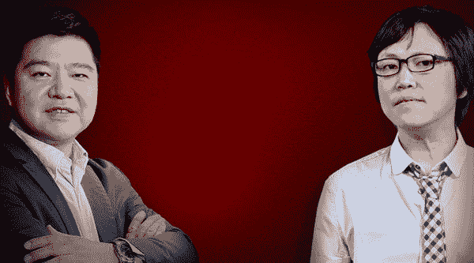
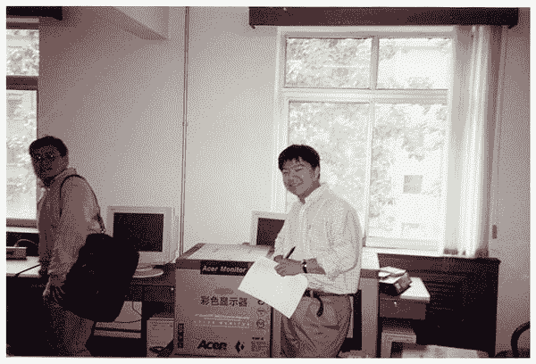
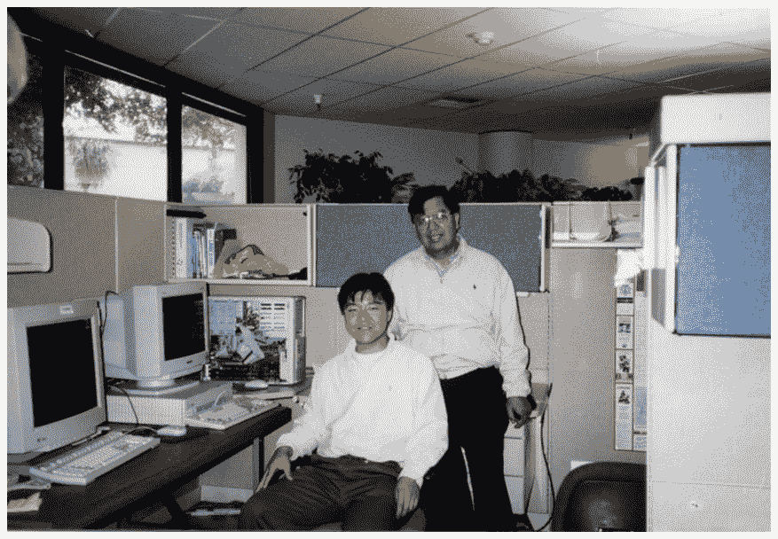

# 王峰十问第 07 期 | 互联网老男孩杨宁：区块链给了 90 后掀桌子的机会（附音频）

> 原文：[`news.huoxing24.com/2018031219443257249.html`](https://news.huoxing24.com/2018031219443257249.html)

**本文来自微信公众号：[王峰十问](http://mp.weixin.qq.com/s/q1EYkn9Nl1UVayvJttZ21Q)（ID:wangfengshiwen）** 

**对话时间**：3 月 12 日 22 点

**微信社群**：3 点钟火星财经创始学习群

**对话嘉宾**：

杨宁：乐博资本创始合伙人，相继创办 ChinaRen、空中网和悟空搜索。其中，1999 年创办了 ChinaRen，2000 年把公司卖掉；2002 年二次创业，创办了空中网；2004 年带领空中网登陆纳斯达克，成为最年轻的上市公司总裁；2008 年，第三次创业，开发手机搜索引擎“悟空搜索”。2011 年，“悟空搜索”进行业务转型，杨宁仅以股东身份参与，自己则全身心投入天使投资人的工作；2018 年，ALL IN 区块链项目消费链（CDC）。

王峰：火星财经发起人，蓝港互动集团(HK.8267)创始人，极客帮创投合伙人。

**以下为对话原文整理：**

**第一问**

**王峰**：我和你是老朋友，但面对面聊的并不多。上次见到你，听你兴奋地说，你现在的朋友都是娱乐圈，跟韩庚、周笔畅、黄征等明星一起做了乐华娱乐。现在一转眼你就跑到了链上。你的两个老搭档，陈一舟做了人人网，另一个搭档周云帆则步入了仕途，你们三个最近见面还多吗？这两个人里你跟谁聊得更多？ 

**杨宁**：我们 3 个一起见面不多，我跟他们两个人都还保持着很好的联系。因为大家的身份角色都不相同，我们更多的是保持在网友状态，哈哈。

发一张我们当年一起创业的照片啊，哈哈，周云帆拍的。

**王峰**：当时的陈一舟在你眼里是什么形象，当时的周云帆在你眼里又是什么形象？据说，业界一大批技术背景的高层，比如王小川、许朝军和周枫，都是那个时候你们三个人从清华宿舍挨个踢门找出来的，你们当时怎么那么牛？

**杨宁**：陈一舟是一个很会吹牛的人，他非常喜欢谈格局。因为他是 MBA 出身，商学院的气息很浓。他从来就是一个会赚钱的人。在斯坦福读书的时候就教我跟周云帆炒股。赚点小钱。

周云帆从来就是一个知道自己想要什么的人。他对我最大的影响是把我们拉回中国了。因为我初中高中大学研究生都是在美国读的，我在回国之前对中国非常的陌生。周云帆是一个非常脚踏实地做实事的人，非常关注细节。所以我们斯坦福三剑客的分工就是陈一舟出去忽悠钱，我负责技术产品开发，周云帆负责运营盯摊。我们配合还是非常默契的。

**第二问**

**王峰**：你一直敏感于技术的前沿趋势，我印象里你过去几年陆续在关注人工智能和 VR 等几个热点，尤其在人工智能上花了不少心思，现在一下子 ALL IN 区块链，这几天你谈论区块链的信息一直在刷屏，为什么转变得这么快？你做了多少准备？无独有偶，美国人工智能领域的旗帜人物张首晟教授，现在也以旗下的丹华资本积极布局区块链。为什么大批人工智能的吹鼓手，一夜之间变成了区块链的赶潮者？

**杨宁**：我 13 年就开始关注和投入人工智能相关领域，因为看到了新的深度学习算法使得人工智能从概念到逐渐可以投入使用的状态。这是非常让人兴奋的看到人工智能这样一个赋予机器生命的一个过程在我们这个时代展开。

为什么区块链？因为人工智能是一个循序渐进叠加式的发展，而区块链是一个瞬间爆发的分水岭，会有一个明确的分界线。它能够影响的方面更加广泛，跟互联网一样，是通过一个技术而改变我们行为方式，社会组织形式，我们的存在方式。

**王峰**：我们都以为未来就是 AI 了。

**杨宁**：我全力投身于区块链并不表示我对人工智能不看好，恰恰相反，我认为区块链更好的链接了实体世界和人工智能世界通过区块链所代表的价值网络。只不过人工智能发展还有待时日。而区块链时代已经时不我待。

**王峰**：转变好快啊！哎呀，可是，创新工场的李开复老师，前不久退出了所有 3 点钟区块链群，对区块链三个字几乎避而不谈，你怎么看？

**杨宁**：我觉得李开复老师决定专注与人工智能挺好的。我相信区块链最终会影响到每一个人，所以入场时机每个人都会有自己的判断，我是那种必须第一时间进入的。

**第三问**

**王峰**：我听说你花了两周时间研究了以太坊，把底层代码全拷过来了，还写了智能合约在上面跑。前一段时间，仅仅一个以太猫（CryptoKitties）游戏，就把整个以太坊网络搞瘫痪了。（CryptoKitties 是一种电子宠物类游戏，是一种基于以太坊协议开发的去中心化应用（DApp）。每一只数字猫代表着一种独一无二的加密资产，并且其所有权无法变更，因为这些所有权记录将会被整合到不可更改的以太坊区块链上。）

那么，假设我们蓝港互动要做一款游戏，直接基于以太坊，是不是已经不是很好的选择？你推荐我用谁的公链？是不是我们应该自己动手干游戏生态的公链？

**杨宁**：哈哈，春节的时候我跟大家一样都特别的兴奋，晚上不睡觉，我没有在群里泡着，而去 Github 上下载代码和在我的苹果笔记本上搭建开发环境。我已经多少年都没有写代码了， 快有 15，6 年了吧。

我把以太坊和比特币拷下来之后开始研究他们的架构和机制，学习了以太坊自己编的语言 Solidity （网上连教材都没有）学习编写智能合约，因为在以太坊跑程序是要消耗币（gas）的，我就在测试网络上跑。也要消耗测试以太坊，天天可怜巴巴的问以太坊要测试币。

但是我很快就得出一个结论，以太坊的底层设计是有极大缺陷的。第一也是最重要的缺陷是以太坊只有一条链，没有侧链，它把所有的程序对等的跑在所有的矿机上。这样一个很耗资源的程序就把所有的矿机搞死。这个问题越来越严重。

第二个缺陷，也许是因为第一个缺陷还有遭遇黑客攻击以太坊虚拟机漏洞问题而设立的跑智能合约每一步都要收 gas 费。也就是说就算你想用以太坊来写一个 DAPP，去中心化的应用，你也跑不起。

如果蓝港要做一款基于区块链的游戏，我真的不推荐以太坊。目前看来都不适合，因为区块链的计算资源分布在众多矿工的机器上，计算资源相比集中的服务器是非常昂贵的。我建议要不自己开发一个公链，要不等一个带侧链功能的专门适合游戏的公链出现。

**王峰**：写字的冯唐曾说过，文学的标准的确很难量化，但是文学的确有一条金线，一部作品达到了就是达到了，没达到就是没达到。我想问你，以你今天的技术眼光看，好的公链有没有一条评价的金线？

**杨宁**：1\. 我觉得公链的好坏重要在于是否适合自己，再好的东西自己用不了就像一件特别好看的衣服自己穿不上一样。全功能公链现在很受追捧，但是我认为全能就像瑞士军刀，什么都能做，但是什么都做不好。我认为未来是行业公链的时代。

2\. 公链还有很多发展的方向和空间，还有很多未解决问题。

**第四问**

**王峰**：我们私下开玩笑说，一个杨宁进入区块链，后面还有成百上千个像你杨宁这样的互联网精英在做“起步跑”。光我们这个群里，就有遨游浏览器的陈明杰、美丽说蘑菇街的徐易容、前猎豹移动副总裁陈勇等人，你在互联网做了 20 年，你觉得你的朋友圈有多少人已经进来了，有多少还在观望，又有多少对区块链仍然不看好？这一大批拥有成熟互联网应用开发运营经验的兄弟们如果很快上来，你首先是竞争心态还是合作心态？你希望和什么样的人合作？

**杨宁**：我感觉我朋友圈里面几乎所有人都对区块链关注，但是看好看衰的参半。看好的总是转发正面文章，看衰的反之。基本上创业者们普遍看好，如果不是手头有特别重要的事情例如准备上市，公司处于快速增长期，普遍都在入局区块链。

相反投资人里面做的好的投资人普遍对区块链嗤之以鼻。也许在他们眼里，江湖秩序不会改变。在传统投资领域不得志的投资人几乎全部进入区块链了。

我认为区块链世界会有前所未有多的优秀的人进入。以前区块链是个小圈子，所谓的币圈链圈大家互相都认识，未来就不再会这么说了，就像现在没人再会说互联网圈怎么怎么样。

互联网圈和区块链圈核心的区别是理念上的区别，互联网更多的是竞争，平台的竞争你死我活，甚至例如饿了么和美团还出现员工打架斗殴现象。区块链世界里讲的是共识和分享。

源代码都是开放的随便用，不同意可以硬分叉，没有什么竞争可言。在圈子里大家听到最多的话就是咱们怎么合作。

**第五问**

**王峰**：2014 年你投资马佳佳，几乎以此掀开了 90 后创业者的序幕。3 年过去了，我听说马佳佳也放弃了原有的生意，转型到了新的方向。你怎么评价马佳佳以及过去 3 年的 90 后创业者？而今天的区块链行业，似乎轻松地就被 90 后夺了旗，你又怎么看这个平行世界的 90 后创业群体？此时的你宣布区块链创业，却与 90 后同台竞争，有个人说“3 点睡觉是及格，5 点睡觉是优秀”，你的身体还能熬住吗？

**杨宁**：我觉得 90 后是互联网的原住民，但是也是被互联网压制的一代。几乎所有的互联网创业机会，甚至边角料的机会，都被 70 后 80 后垄断了。我特别能理解 90 后创业者的绝望，大批大批的 90 后创业者空有能力，激情，和努力，但创业创成狗。

当区块链到来的时候，给了他们一个掀桌子的机会。重新洗牌。每一次大的技术革新就是一次掀桌子的机会。有人会说区块链不是什么新技术，20 年前就有了，他们忽视了一点，一个技术的爆发要在一定的客观环境下。

我 90 年代在斯坦福学网络专业的时候，网络技术是在 70 年代就有了，但是在计算机全面普及的前提下才有了互联网的革命。而区块链的普及必须在互联网的全面普及的前提下。由信息互联网转向价值互联网。

这一次是 90 后的机会去颠覆那帮 70，80 后的老炮们。不管过去有多辉煌的成就，重要的是要有一颗谦卑的心。我在跟年轻人学习，他们是第一个发现时代变化的人。

**第六问**

**王峰**：币圈有一句话，没有穿越过两次牛熊，不算真正入币圈。你的产品一发，似乎就迎来了区块链行业的春寒，虽然今天的数字货币市场又全线看涨，但今年新推向市场的区块链项目，似乎远不如去年那样容易得到市场认可。这让我容易联想到了 2000 年互联网泡沫寒夜，你们把 ChinaRen 卖给了张朝阳，做了“互联网的逃兵”，我记得陈一舟给我说过他去美国晒了两年太阳才缓过伤痛，如果历史出现惊人的轮回，再次遭遇区块链市场的持续不利，这一次你还打算逃吗？换言之，你今天的选择，是市场投机吗，还是区块链信仰？哈哈。

**杨宁**：不经历寒冬，真的不知道坚持是什么。寒冬最惨的一点是你不知道还会不会有春天，还能不能熬到那一天。我记得春节前整个圈子都是一种亢奋的状态，都不是在投项目，而是在抢项目。抓着手机就要转币拿份额。而现在群里却是哀嚎一片。

其实都不用国家来劝阻参与私募项目，现在的市场环境已经让投机冷静下来。作为创业老炮，有一点优势那就是经历过几次行业寒冬了。

所有的寒冬都有一点一样，那就是冬天不管再冷，都会过去。不同的是寒冬的时间越来越短。第一次 2001 年的寒冬持续了大概两年，第二次 2009 年寒冬大概只有一年，而这次寒冬我认为会持续半年就会结束。

就像三体说的我们的文明在延续一个指数级增长速度，我们的寒冬周期也是一样。在寒冬里唯一能依赖的也只有信仰了吧，哈哈。

之前几次创业戛然而止真的是很无奈，还是要熬到春天的到来。

实体经济寒冬真不知道什么时候会好，也许需要区块链解救。

**第七问**

**王峰**：说说消费链（CDC）小程序吧，研发了投入了多少人月？你本人在其中参与了哪部分具体工作？你是怎样理解的以太坊创始人 Vitalilk 提倡的理想组织 DAO（Decentralized Autonomous Organization），即去中心化自制组织？在你的项目里是怎么践行的？你本人在其中的角色是什么？对比过去我们习惯的几个职务，CEO/CTO/首席架构师/PM，你更接近于哪一个？

**杨宁**：消费链团队从去年 11 月的两人到现在 50 多人全球化团队（光技术团队就 20 多人），消费链的社区从两人到现在几十万人（团队，+用户，+合作伙伴，+投资人，+买币的小散），这是一个迅速增大的过程，这就是区块链精神，这个链不属于任何人，它属于所有参与者。

这就是 Vitalik 提出的 DAO 概念，那就是过去中心化公司的控制与命令的管理模式让位与平等和共识的参与模式。团队和社区的参与感和自豪感是爆棚的。过去创业的时候一个创始人最关心的控股权，特别怕投资人参与后稀释股份而丧失控制权。甚至上市之后还要通过 A, B 股的形式来维系控制。

这在区块链世界是完全荒诞的思维，如果币都在创始人手里，那根本就没有人跟你玩了。

关于消费链做了多少个月，大家都知道区块链世界是不睡觉的，工作效率是传统的不知道多少倍，我经常开玩笑的说我们消费链团队成员都不上班，因为他们都不下班，哈哈。我们的第一步实验型产品小程序已经上线了，我们的公链代码已经部分上传 GitHUB 了，我们的动作还是很快的。我们是一个做实事的团队，每天考虑的事情就是早日落地，早日扩大规模，而不是去炒币价。

**王峰**：此外，我更为好奇的是，为什么你扬言致力于打破中心化，打穿数据孤岛的区块链应用，却“寄生”于微信这样一个强大的数据中心化场景？你的程序是基于微信小程序的啊。

**杨宁**：很好的问题啊，哈哈。至于我们第一个产品是基于微信这样一个中心化平台也是无奈之举，因为微信的用户和渠道的垄断地位。其实就算我们做 APP 也离不开苹果的中心化体系。只有安卓，甚至于只有基于 WEB 才是真正能打破商业垄断。

**第八问**

**王峰**：我们彼此都在互联网行业厮杀多年，知道这样一个残酷的现实，一个产品要想成功，必须经历从 0 到 1 这样的冷启动过程，你是如何实现这一步的？在你心中，你觉得多少用户量级是第一个分水岭？1 年后，你希望消费链（CDC）上有哪些真正给人们以福祉的消费应用？如果做到这一点，你第一个要冲击的是哪个互联网巨头的生意？

**杨宁**：我们的小程序短短几天就获得了几十万用户足以证明其实冷启动不是想象中那么难，因为在区块链的世界，用户有空前的参与感和拥有感。

因为利益在区块链世界是大家分享的。而不是像传统公司形态，用户跟公司天然对立。消费链在一年以后公链功能大部分上线之后我相信一定会有数百万级的用户每天在我们平台上交易。我们第一个要冲击的自然是 Google，Baidu 和阿里巴巴。

**第九问**

**王峰**：2002 年 3 月，你刚刚创立空中网时，曾经在黑板上写下了“新浪、搜狐、网易、腾讯”四大巨头的名字，后面加上“空中”，激励自己的员工说：“我们以后是要和它们齐名的公司！”16 年后的今天，你在接受我们火星财经记者专访时，将 BATJ（百度、阿里、腾讯、京东）四大巨头视为靶子，指责他们利用数据的垄断、对用户的垄断、对渠道的垄断开始称霸互联网界，导致大家只能依赖于他们。很显然，时代不同了，你的角色从跟随者成为了颠覆者。

你不怕得罪这些巨头吗？马化腾他们听到会不会不开心？你不惜以挑动 BATJ 眼球为宣传点，不怕微信有一天把你的小程序封了吗？

会不会应该广积粮、高筑墙、缓称王，先选择其中一个巨头打更合适呢？哈哈。

**杨宁**：哈哈，这个问题提的非常好，我们看到了这几个巨头通过数据垄断制造了不平等，用户和产业链被压迫，这是客观事实。

如果他们愿意减赋，如果愿意不能压榨合作伙伴，我觉得我们的目的就已经达到了。

就算我提出这个观点，我想他们也不会把我放在眼里。 我是互联网时代他们几个的手下败将，不自量力，妄想螳臂当车，痴人说梦。

古话说千里之堤毁于蚁穴。我就是那只蚂蚁，会拉拢千千万万被他们欺压的小商小贩来组织一个没有欺压的平台，让大家更好的做交易。

**第十问**

**王峰**：Finally，第十问，我分成几个小问题。

第一小问，我听说，你把去年区块链市场的竞争比作亚运会，而你认为，今年才是真正的奥运会，是不是你认为去年的区块链先驱们不如你？你怎么看小蚁、量子链、AChain 等一批先起步的公链？哈哈。

**杨宁**：我不是认为我比这些先驱强多少，而是我指的是因为区块链的火爆，更多优秀的人加入到这个行业，更多优秀的技术会出现，这是一个世界级的赛事，会促进所有的参与者进步。如果已经先起步的公链故步自封，就算是 V 神也会被拉下神坛。

**王峰**：第二小问，听说你很推崇王阳明，为什么？你心中的王阳明是什么样的人？

**杨宁**：我非常推崇王阳明，学习了他的思想很多年。他讲的心即是理，至善在每个人的心中。而不是去外界去寻找真理。做事情只要刨去心外的私欲，格物，致知，正心，诚意，修身，齐家，治国，平天下。我做消费链的目的是让所有小商小贩不被欺压，这是我的初心，而不是要获得什么。只要我不忘初心，牢记使命，不相信不会成功。

**王峰**：第三小问，你成功很多次，今天不谈成功，谈谈失败。你如何评价你的第三次创业“悟空搜索”？你有什么经验和教训分享给今天的青年人？

**杨宁**：我的第三次创业悟空搜索在 2007 年开始创业的时候已经时机不再了。那时候百度已经强大到不可打败了。我之后甚至腾讯和阿里试图去做搜索也没有成功。因为如果在同一维度，他们已经做得太好了，唯一的机会是用更高维度的产物去挑战他们。就像三体人的水滴一样。

**王峰**：第四小问，也是最后一问，杨宁你觉得你今天的心里年轻多大？有没有给你娱乐圈的朋友讲比特币和区块链？

**杨宁**：我永远是我当年创办 Chinaren 时候的年龄，我相信见过我的人都会感受我对这个事业的激情。

我跟娱乐圈的这些朋友们都在讲区块链，他们都非常的感兴趣，都在问怎么参与。上次互联网时代很多人都错过了，这次不能再次错过，会后悔一辈子的。

这张照片我 23 岁，研一。

**王峰**：记得电影《老男孩》里，一对痴迷迈克尔杰克逊十几年的平凡“老男孩”，为了重新登台找回梦想的故事，让我们很多人不禁泪目。这里，也衷心希望杨宁兄弟永葆“老男孩”的初心，在区块链创业的征途上一切顺利，早日实现心中梦想！

**杨宁**：不忘初心，牢记使命，开创新时代。

**王峰**：再次谢谢杨宁兄弟，感谢你今天能来到这里。谢谢各位。第七期到这里了。

编后记：

2018 年 11 月 6 日，乐博资本创始人杨宁宣布消费链（CDC）团队已经解散，并表示“进入币圈是我职业生涯中最后悔的事”，“自己被坑了，维权无门”。消息一出，让人唏嘘不已。杨宁在参与以上十问对话时提到的“冲击谷歌、百度和阿里巴巴"的豪情壮语，似乎还在耳边萦绕。究竟杨宁经历了怎样心路历程，对区块链的态度发生了 180 度的大转弯，我们不得而知全部真相。但十问对话时的杨宁，和如今的杨宁，已然判若两人。我们相信，是非对错，历史会给出答案。

本文为火星财经原创稿件，版权归火星财经所有，未经授权不得转载，转载须在文章标题后注明“文章来源：火星财经”，若违规转载，火星财经有权追究法律责任。