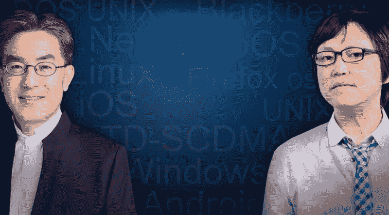
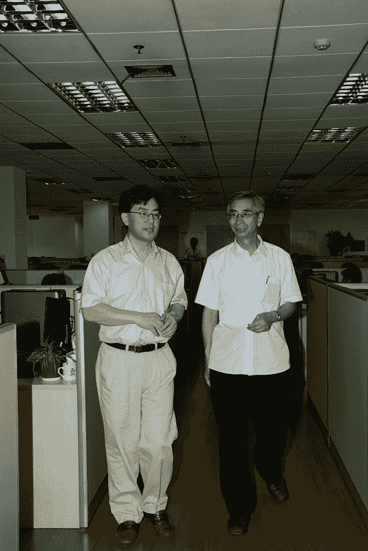

# 王峰十问第 09 期 | 亦来云创始人陈榕：我为什么要坚持做区块链操作系统（附音频）

> 原文：[`news.huoxing24.com/2018032008240863734.html`](https://news.huoxing24.com/2018032008240863734.html)

对话嘉宾：

陈榕：亦来云创始人、策划人，亦来云基金会理事长。

陈榕是清华大学计算机系七七级学生，先是在美国伊利诺伊大学研究了七年操作系统，随后又在微软总部八年参与了 Windows 操作系统底层模块的开发，回国后一心做操作系统苦熬 17 年。 2017 年 6 月，作为联合创始人参与策划成立亦来云（Elastos）基金会，支持亦来云——区块链驱动的互联网项目。 

王峰：火星财经发起人，蓝港互动集团（HK.8267）创始人，极客帮创投合伙人，曾任金山软件高级副总裁。

**第一问**

王峰：我还是称呼您为陈榕老师吧。不如我先问您一个当下大家最关心的问题。您做了亦来云公链，按说您该是链圈的人，但我认为真正理解区块链的人是链圈币圈越来越难分开说。昨天，以太坊跌破到了 3000 块人民币，一天就跌了 16%。虽然今天有所反弹，但过去 2 个月全球区块链数字货币市场确实陷入了熊市。您认为造成如此快速下跌的根本原因是什么？有想过以太坊如果跌到 1000 元人民币怎么办吗？会不会造成币圈的彻底崩盘？

对于近期的市场行情，很令人担心。近 3 个月的市值波动看，NEO 从 176 亿美元跌到 55 亿美元；Qtum 从 64 亿美元跌到 8.7 亿美元；Tron 则从 130 亿美元跌到 16 亿美元。您的亦来云，从 5.31 亿美元跌到 2.07 亿美元。作为区块链行业的从业者，您看到这一幕心情如何？

陈榕：我从 1984 年开始做操作系统，到今天三十四年了，差不多是中国最老的几个做操作系统的人了。

最近的币价下跌，其实很大原因和前不久快速的上涨有关系。大家也知道这个有一千多种 Token，但是真正有技术含量，或者有流量的其实并不多。

有人讲，曾经的移动互联网时代，是做流量；如今的数字 Token 时代，要做协议。从我过去十八年创业的经历来看，其实做技术、做协议，是非常非常悲观的。我并不认可说，以太坊只是在做协议，其实比特币和以太坊还是大量在做用户。

比特币从 2009 年上线到 2012 年，市场的刚需逐步被人发现，到 2013 年迎来了第一次的浪潮。之后像以太坊是来自于比特币的融资，以致于以太坊后来成为很多 ICO 的融资渠道。这些其实都是大量流量的结果，也就是要有人用，导致了一些刚需。

我觉得中本聪的发明很伟大，以太坊的智能合约其实也非常出色，概念很好，也解决了世界上非常重要的难题。但从代码量，从编程的协议质量来看，相对 TCP/IP，也并不见得要难多少。

技术是支撑流量的，没有流量的技术，其实很难兑现。所以我觉得，最近很多区块链的创业公司一开始定位在做协议、做技术，跟我 2000 年回国犯了同样的错误。当时我回国时，觉得用 C++重写.NET，才会有重大的科技进步，所以我就致力于做这件事儿，没有太关注市场，最后的教训非常惨痛。

今天的很多区块链创业公司其实犯了同样的错误，一开始就去改进以太坊、改进比特币，不是说改进没有意义，但没有客户，其实没有前途。

至于亦来云的币价，我基本不看，其他的几个币价，我也不看。眼不见心不烦。我们的工程进展还是比较顺利的，所以我觉得我们能够度过寒冬。寒冬来了，很多 ICO 回归也正常，大家早期太高估了区块链的作用。

**第二问**

王峰：我虽然之前没有见过您，但您一大批好朋友常常提起您，十分不易，技术超牛，却找不到自己切入市场的最好机会，回国十七年，Windows 2000 之后微软就疲惫了，后来又是嵌入式 OS，Web 起来后几乎没有人关心操作系统，进入移动互联网时代，城头大王旗是 Apple 和 Google。有没有感觉到总是生不逢时？做了那么多年操作系统，好不容易赶上区块链这趟车，追上去的时候却发现，和年龄小两轮的技术创业者比，公司市值还有不小差距，您心里有一点点落差吗？

此外，我听说能做公链开发的人非常稀缺，今天市场这么冷，会担心核心技术团队不稳定吗？

陈榕：我不看币价，也不看年龄。另外，我觉得其实有一些经验还是蛮有用的。

我过去一直做操作系统。其实，因为操作系统是一个比较费时间的技术，所以相对来说，从业人员并不多，像做 TCP/IP 协议栈的人也不是很多。今天说区块链的人缺乏，我倒不这么看。其实区块链人才的绝对数是缺一些。但是总体来说，不应该有这么多人做区块链。很多区块链技术，我看了看，做得其实没有意义。

我的最主要感觉是，区块链不是面向客户的，不是 to C，也不 to B。区块链根本就是一个亦来云网络操作系统内部的一个部件，非常关键。但是，并不面对客户。所以，比如说在区块链上直接写 DApp，就是画蛇添足，做那玩意儿，浪费时间。

另外说说微软。微软是在 2000 年以后，PC 走向成熟，手机方兴未艾，苹果跟谷歌站起来了。但是，其实我们回归历史，大家也都听过这个故事，Windows 是施乐发明的，后来是施乐死了，诞生了微软和苹果。这一轮，微软有可能会死,苹果跟谷歌会生。但是，并不代表微软原来研究的技术方向不对。

大家忘了施乐曾经发明 Windows。后来，苹果跟微软占据了 PC 的机会。现在，苹果跟谷歌又如日中天，微软在手机软件方面好像穷途末路。其实在富可敌国的时候，微软还是做了很多非常有意义的研发，这些技术的正确性，我是坚信不疑的。大家往往忽略了施乐给我们带来了 Windows（包括还有鼠标、图形界面），以太网，以及面向对象编程。这三大发明，其实对人类的影响，至今是不可忽略的。

微软在 1998 年、1999 年提出 SaaS 的想法，后来其实没有完全实现。做了向外 web service 这种东西大家就以为就是 SaaS。其实，Web Service 还远远没有达到我们当时的设想，直到今天，Win10 才在很大意义上完成了 1998 年 1999 年那时候的构思。

比如说 Win10 提出了 Universal-App，一个应用能在手机、平板、电脑、电视上都运行。大家知道，手机一定是 ARM 的 CPU，PC 一定是 x86 的 CPU。今天做一个应用，在所有设备上都跑。其实能够跨 ARM、跨 x86，很难设想。但是，毕竟他做到一个运用跑到这些设备上，其他操作系统做不到。

另外一点，像 Win10 提出，以后没有 Win11，Win10 就是最终操作系统。为什么这样做？首先，今天进入了物联网，Edge Computing 的时代。你拿着手机，跟周边的设备互动。能不能有 Device Driver？因为周边的设备，跟你的 Driver 很难同步。过去 PC 的时候，你可以升级自己的 Driver，但是在物联网时代 Edge Computing，你其实不能强迫周边的设备升级 Driver。

（对网友插问的回答）DApp 本身不是画蛇添足，在区块链上开发 DAPP 是画蛇添足。

因为在区块链上开发 DApp，实际上大家还是回归到了 Browser/Server Model，就是 BS 模型。比如某个游戏直接用区块链作为 Server，然后用手机当作 Browser。如果几千个用户一起来访问 Blockchain as aServer，这个 Blockchain 显然是支撑不了。

再讲刚才的 Windows，其实像这些技术对今天的互联网非常重要。因为刚讲到如果说我们就是加密猫，几个人在玩加密猫，这几个手机终端其实要自己形成另一张 P2P 网，要传视频、音频、文件。这就讲到两层的 P2P 网，一层 P2P 网是我们常用的类似 BT 下载的 P2P 网；另一层 P2P 网才是区块链的 P2P 网。

亦来云其实就是在做这张通用 P2P 的网，比如说要下电影、下文件、说语音。那么这张 P2P 网其实就是类似 Skype，像 QQ 物联这种 P2P 网。那么这个网的第一步就是要做到去中心，利用区块链技术把这个 skype.com、tencent.com 去掉。亦来云的去中心 P2P 网已经开源了，第一个云盘的范例程序应该在最近两三周对外开源发布。

另外一个，要做到终极操作系统。因为是网络，就是互联网上各个网站、各种 Server，他们的版本号非常难统一。所以今后的操作系统都是智能设备，大家都是服务与服务之间的交互，这样的话，不会强调对方的版本号是什么。

在亦来云的网上，其实只用到了区块链的一些成熟技术。比如说，亦来云的这个 P2P 网上，要有去中心化的 ID，这个去中心化 ID 就来自于亦来云的公链。其次是亦来云的公链提供了溯源的基本能力。第三是基于亦来云公链做侧链，营造数字资产的稀缺性。

**第三问**

王峰：对于在一个高技术含量的公链项目，我一直很好奇：如何分配 Token？参考过谁的方案？遇到过什么困难？在您的股东里有杨向阳、刘晓松、林栋梁，还有火币李林，这几位都是您的清华校友。在我眼里他们都是赫赫有名的投资界大佬，李林也是占据交易所优势地位，我前两天刚在三亚见了很久未见的杨向阳，投资界领袖的气场。你们在分配的时候有过争议吗？这些股权投资大佬公开为您站台，他们的股权投资比例和 Token 分配比例是按照一一映射关系分配的吗？此外，您和 NEO 达鸿飞和比特大路吴忌寒的合作，是怎样的考虑？

陈榕：我觉得这个问题稍微有点不够准确，像刘晓松，林栋梁，杨向阳他们，都是我的朋友。他们最近都提供了很多帮助，他们都是传统的移动互联网这方面大佬。而亦来云是一个社区项目，百分之百开源，没有股份。所以，这几位大佬也并没有占什么股份，当然也就谈不上跟他们有什么投资比例，或者什么为难的地方。

大家知道像流通币，有 Utility Coin 和 Security Coin 的区别。Utility Coin，就是流通币，其实你拥有一个流通币并不代表你拥有任何的百分比。反之 Security 币，才代表你拥有了一些权益。那么对于 Security 币，各国政府监管都很严，我们亦来云恰恰不是 Security 币，所以我们也恰好在美国进行了公募，大概在 1 月 2 日的时候，非常成功，这也是第一个过了美国的 Howey Test，按照美国合法合规做的公募 Sale。

像大阳他们参与亦来云项目，其实我觉得和上一轮的互联网有关。上一轮的 Web，比如说浏览器诞生了，大家不一定拥有 Netscape 的股份。可是认真研究未来的趋势，就产生了像雅虎、Google 等大的公司。其实有很多公司会在互联网大潮上占据先机。我们做的这个亦来云，我认为现在互联网进入了第三个阶段。

第一个阶段，我也恰恰有机会参与，就是我 84 年去美国的时候，ARPANET 改名叫 Internet，我正好经历了这个阶段，当时就有 email 帐号，也经历了改名，也学习了 Socket 编程。那时候还是非常早了，那当然就用 FTP，用 email。到了 1987 年，也参与用卫星搭建美国的一个超级计算机网。后来这个超级计算机网，最成功的地方就是导致了 Web Browser 的诞生。

87 年那时候太早了，所以我参加的时候还是非常萌芽的阶段，浏览器应该在 90 年左右。但是在 87 年，我们就在研究多窗口、显示技术，然后用 FTP 从克雷巨型机上把代码、数据不断地拉下来，然后在 PC 上显示，后来这个模型导致了浏览器的诞生。

说回来，我真的鼓励大家认真研究，第一，如果一个互联网有去中心 ID，那么我们的互联网会是什么样子？第二，如果一个互联网可以溯源了，会对人、对诚信有多大的影响？第三，如果互联网可以有稀缺了，如果有一万本书在互联网上流行不增不减，每两三分钟可以换手，那这个时候其实商品的稀缺经济就有可能诞生。

如果互联网有了这个三个特性，（我们一会儿再讨论几个技术的进展），其实，人类就已经有了非常长足的长进。那么在区块链上当然有很多其他，像闪电网络、并发等等，大家讲很多这个，没问题，研发要同步进行。但是这些技术因为还不成熟，我们没有时间等着这几个技术成熟，我们先把三个比较成熟的用在互联网上，已经能对人类产生非常大的影响。那我们为什么不想想市场呢，为什么不想想 to C to B 业务呢？

这也就是我为什么不大看得上所谓做协议的说法，做协议其实就是做技术。其实更大的事情，对人类有影响的事情，我们其实现在已经可以开始做了。可是大家因为对互联网的理解，对基础操作系统的理解还有所欠缺，那么只看到了局部，没有看到一个整体的战略布局，我觉得这是我跟其他很多创业公司的不同。虽然十七年不成功，但也恰恰一直在想，如何走出困境，我觉得价值互联网这一步应该是非常重大的一个机遇。

互联网如果有了溯源、稀缺、去中心 ID 这三个功能，互联网就能够有长足的长进。当然这三个协议已经基本成熟了，那么再做协议，比如说一些小公司，做闪电网络不是没有意义。但是，在增强互联网能力方面短期内我们等不了这些研发。

区块链的技术已经开源了，也很成熟了，比如说比特币的技术，以太坊的底层也还好。一些小公司做研发，不 to B 不 to C，就针对做协议，to VC，大家也知道 to VC 的下场是非常悲催的。

那现在不 to VC 了，to ICO，那这肯定是割韭菜，一点疑问都没有。因为一些年轻公司，初生牛犊不怕虎，但是互联网大潮里见过非常非常多的公司死得很悲惨。

小公司（在）区块链没机会，只有极个别能把技术做到成熟。比如说以太坊其实是凤毛麟角，年轻人做得很好。不能说绝对没有，但是这个百分比来说绝对是非常非常少的。

新的协议、新的公链只是前提，不是有了协议、有了公链就自然有了信任，基于用户流量建立信任的公链一定是非常困难的，原因是老百姓其实记不住超过三到五个值得信任的公链。

**第四问**

王峰：您 20 年来一直在研发一线，是许多程序员的榜样，我注意到 2004 年《程序员杂志》还将您列为“影响中国软件开发的 20 人”第一位。但现在领导一家区块链大公链项目，要实现社区化运营，部署生态化建设。在您多年的外企职业生涯和创业旅途中，是什么时候开始有信心来运转一个商业组织体系的，涉及到团队管理、商业合作、公司运营，对您的挑战是什么？在亦来云这个项目之前，您从微软总部西雅图回来有十七八年时间，这期间哪个阶段最成功？我见过很多从微软出来的技术精英，回国后都找了一个非常出名的国企或者民营互联网企业做要职，你为什么那么执着地要创业？

您和联合创始人韩锋的合作，是怎样分工的？你们是什么时候认识的？我注意到你的核心团队里有一些开源软件社区的人。在一个世界级商业软件巨头工作多年的您，和他们是如何一起工作的？

陈榕：2004 年《程序员》将我列为影响中国软件二十人之一，当然非常感谢《程序员》。说第一，我觉得也夸张了，其实没有。其实二十人我觉得也配不上，后来像百度，腾讯，阿里巴巴，真的是做的非常的伟大，我就相形见绌了，觉得很惭愧。

说到从微软回来创业十七、八年什么时候最成功？十七、八年没成功过，当然几个亮点，第一，我们在 2002、03 年的时候，做了第一版本的内核，2007、07 年的时候做了完整的一只智能手机，智能手机百分之百做出来，都是自己设计自己写的，没用人家的。这是非常难的一个课题，但是最后没卖动，命运多舛。

刚刚我们做完了手机，人家苹果、安卓也出来了。我们的手机做出来量产，后来给了一些客户使用，反馈比 Windows CE 更稳定、效率更高，其实是达到了当时一个工业的水平。但是，安卓跟苹果实在是太强大了，我就知道不行了，后来这个公司就卖给了富士康。在富士康的支持下，2012 年又进行了第二次出发，主打工业互联网。当时我觉得工业物联网和智能家居，端到端的安全，用 C++做会有机会。而同时，微软启用 Win10 计划，用 C++来写.NET，我觉得这是一个非常重大的机遇！

后来这个项目基本上做出雏形了，比如说我们的智能路由器，达到了产品级别，当然没有量产，也对外进行了演示。在 2015 年贵阳大数据会议上，国务院副总理马凯来参加，郭台铭也来了。可是，当时由于种种原因没有决定量产，就被减缓。一年以后，突然在 2016 年，我觉得区块链有机会，决定开始转向区块链。

其中的原因很简单，我 2012 年底的时候开始做工业物联网，比如我们开始做这个 P2P 的网，然后两边这边做智能路由器，那边也开始做手机。前两天我在美国也演示了一下我们的手机，大家有兴趣可以在 YouTube 里边看到我演示的手机。手机和智能路由器端到端安全直接接管网络，这是网络安全的一个最基本点。

**第五问**

王峰：您一直坚守于自己的操作系统之梦，非常不易。从当年的微软.NET 的新一代操作系统架构开始，到后来回国你参与了 TD-SCDMA 开发。以及后来的 2012 年，您在富士康的支持下写了“物联网操作系统”。我印象里，前几年看报道，您当时就做了“亦来云”，是基于大数据的云操作系统。我也注意到，这几个操作系统，可以说并没有获得真正的商业化应用。其中原因？

从微型计算机桌面时代开始，中国好像从来没有在操作系统上有过什么建树，我昨天见到 UCDOS 发明人鲍岳桥说他是一个另类，之前我前老板金山早起一位重要创始人求伯君开创过 WPS 时代，但只是基于文本表格编辑的大应用程序，红旗 Linux 不能算真正意义的自主操作系统吧。在 PC 时代，是微软 Windows 的天下；到了手机时代，是 Apple 的 iOS 和 Google 的 Android。中国人好像从来就在操作系统层面没有成功过。我想问陈榕老师，为什么在区块链时代的操作系统就有机会？此外，我更想跳出之前的逻辑问一个问题，区块链真的需要一个操作系统吗？

陈榕：当然需要。其实需要的是虚拟机。虚拟机技术在 2013 年就开始研发了。昨天我发了一个朋友圈。我们的虚拟机今天已经能在 iOS 和安卓上跑出 Hello World，其实这也是一个非常伟大的进展。我们现在的口号是，做所谓的 Smart Web，就是下一代的 Web。Smart Web 就是能跑程序的 Web，能跑 DApp 的 Web。那么，能有一个 C++的浏览器至关重要。

上一代浏览器基本上是一个信息互联网，能够通过 URL 点击一个网页，后来有 Java Scripts，有了微信小程序。最终的试金石是，浏览器能不能跑 C 代码,能不能跑 C 代码的 Instant App?跑 C 代码最大的问题就是病毒。所以虚拟机的技术进展就非常重要，昨天我在朋友圈里写了一句：程序员的一小步，是人类科技进步的一大步。

区块链，其实不需要操作系统。因为我们理解的操作系统是跑应用。这个过去操作系统是跑硬件抽象，做内核。那么硬件抽象现在已经非常的成熟了，Linux 现在改进的空间已经不大了，因为 Unix 公开使用超过四十年了，它也影响到了 Windows，当然更大地影响到了 Linux。其实现在的操作系统在做的是虚拟机，即多虚拟机操作系统。

从另一个角度说，虚拟机就是我们要支撑什么样的应用提供 SDK，比如说我们提供 DApp 还是 App？App 就是面向消费者，消费者看到的软件运行就叫做 App，而程序员看到的软件运行，真的不是 App。

比如说硬盘上有电路板，硬盘上也有操作系统，那么硬盘上写的软件，就是做 NAS，做容错，做读写平衡，比如说让这个坏的扇区要跳过去，这都是靠软件来完成的。可是这些软件对消费者来说基本没有人知道，也没有多大意义。

区块链作为网络操作系统的一个部件，它提供了 ID 的分发，提供了溯源，提供了稀缺的能力，就像是他提供了公证处，提供了版权管理局等等。这些能力要展现给用户，其实不是通过区块链本身展现。所以就像硬盘上面需不需要一个 OS，你也可以说需要，你也可以说不需要，不需要是说没有应用看得见。

对于红旗 Linux，过去中国这十几年也做了很多的尝试，也有不少单位做自己的操作系统，像一些政府关键部门和军方使用这套操作系统，其实是非常必要的。但有一些操作系统技术的研发，尽管我们做了十七年，也参加了一些项目的研发，最终因为没有面向客户，所以效果不尽人意。

**第六问**

王峰：我本人也在通用软件产业有过十年工作经历，知道操作系统不同于 PC 应用程序或者我们手机里的 APP，在人家现有的生态上写应用就好。从历史上看，做操作系统从来就离不开硬件的支持，Bill Gates 能做操作系统的根本原因，是因为他先搞定了 IBM 的订单生意，赢得了和 Intel 创始人 Andy Grove 的 Wintel 联盟，苹果从来自己做硬件，Google 有强大的搜索引擎和基于 Web base 的应用，加之生态化的 Android 阵营。我想问的是，亦来云的操作系统在什么环境下运行？谁来支持做我们的应用呢？

追问您一个问题，我们知道中心化的互联网时代安全是没有保证的，比如有 DDOS 攻击、木马病毒、隐私泄露等等。我的问题是，在去中心化的操作系统上，安全问题就可以一劳永逸了吗？面临的新挑战是什么？

陈榕：这问题很好，我们回国这几年其实最大的心痛，就是没有硬件能力。我本人后来也做过手机，也做过智能路由器。但是像供应链，做这个稳定，包括开模，其实都是另一个领域的问题了。人的精力有限，或者能力也有限，反正我做了几次硬件，都是以失败告终。像当时微软能够找到 IBM，或者跟 Intel 联盟，这个真的是非常非常不容易，不管是机缘巧合还是做了正确的决定，微软也真的走出来了。

我觉得今天有机会的地方在于，刚才我也讲到就是下一代的操作系统应该是虚拟机操作系统，那么虚拟机其实是脱离开硬件了。比如说前两天我在美国的展示了我们两年前做的手机。最近也有人在做区块链手机，然后也融到了一些钱，大家就以为我们拿出这只手机是要做区块链手机，其实这个说法是误导了大家。

我根本就不觉得应该用区块链做手机。因为做区块链手机，其实像成本问题，制造供应链、品质问题解决不了，挑战三星，挑战华为，挑战苹果，机会其实是非常非常渺茫的，但是他们在 ICO 市场上融到资，只能说，恭喜他们。

我解释一下我前两天演示的只是我们两年前的产品，不想有任何的误导，我不会去做手机的。如果今天做区块链手机，我们会在世界上是最领先的，但是我不认为这条是活路，所以我不会走。

虚拟机，原来的机器跑多进程，现在的机器跑多虚拟机。这个虚拟机其实也很好解释。一个进程，就是一个地址空间的隔离。那么像当年我们做 DOS，其实就是一个单进程、多任务并发。只要给进程配上一个硬盘，它就是虚拟机，不要把虚拟机想成跑 Linux、Windows 这么重的东西，其实 Java VM 其实就是一个虚拟机。

但是 Java VM 有两大问题，这也是为什么我当年 99 年离开微软，就是因为微软当时采用 CLR（Common LanguageRuntime）来跟 java 竞争，摒弃了 C++的路线。Java 的两大问题，第一是 Java 不能写百分之百的程序，因为他写游戏引擎的时候要走下 Linux，要通过 JNI 走到底层的操作系统。

说到这一点，Java 程序绝对是图灵完备。但是图灵完备并不意味着能跑百分之百的程序，因为大家要有物理的选择，因为硬件都是有局限性的：有速度、有内存、有电源管理等等限制。不可能因为你图灵完备，跑一个程序跑一百年，人是不可忍受的，对吧。

很多区块链创业项目，动不动张嘴就说图灵完备，我觉得这个说法除了误导，还是误导。能编程不是什么大事儿，对吧？当然，比如说中本聪选择不图灵完备，他有他的想法。比如说亦来云公链，放在亦来云的 Elastos.net 这个网络平台上，根本就藏住了，我们不会在亦来云公链上支持智能合约的。

不支持智能合约，我写四五个功能，我为什么要让他图灵完备呢？为什么要让人有可能攻击他呢？那么这个选择，智能合约其实是一个用户态的事儿，用户态写智能合约，然后写图灵完备，这个绝对是伟大的。图灵完备的智能合约是以太坊的一个发明。我们也很尊敬，我们在用户态的这个侧链上，也会支持智能合约，也很有可能将来会支持 EVM，但是现在我们会先选用 NEO 的智能合约。

那再说 Java 的第二个问题，就是没有做到端到端。其实 Java 语言的发明是 1992 年，给机顶盒发明的。当时机顶盒上有 x86，有阿尔法或者 PowerPC。因为机顶盒的 CPU 不同，所以就要把 Java 传送到机顶盒端，然后按需编译。但是他当时没有设想这个 Java 跑在 Server 上。如果 Java 不跑在 Server 上，就是 Server 和端都要跑 Java 的话，中间的网络就有可能被接管。

这是微软设计.NET 的初衷，就是说服务器用了微软的云，那么端上跑微软的 CLR。那么这个时候它端到端两边跑自己的运行时，通过一个技术叫 Reflection，就可以动态产生 RPC，把软件封装成服务，就是一个软件的黑盒子。那么定义接口、定义事件，有了接口，有了事件你就不用管那个软件服务是 Java 写的还是 x86 写的还是 ARM 写的。你就调用就行了，或者把硬件也可以做成服务。那这样的话，生成 RPC 就能规避 DDoS 攻击，能规避隐私泄露和病毒。

因为 TCP/IP 太灵活了，用户是可以一式发两份，或者发 DDoS，向同一个地址发，那么这些就是今天互联网不稳定的始作俑者。

曾经互联网的发明其实很伟大，当时做了一个非常英明的抉择，就是当时美国军方投资做互联网可以选择做一个类似 NASA 这样的中心，像宇航中心一样做一个网络中心，或者呢把它全部开放，做成去中心，谁有服务器都可以接到互联网上。当然最后互联网的创建者们决定，把它做成去中心的，然后谁都可以接上去导致了今天互联网的繁荣。

当然恰恰因为这个英明的决定，导致了今天互联网的所有问题，比如说谁都可以接上去，你们谁都可以发软件包，谁都可以做中间人攻击，谁都可以做 DDoS 攻击，谁都可以伪造身份。这个问题导致了病毒的大量传播，隐私泄露。当然木马还有一个原因就是操作系统有 Daemon，现在今天的操作系统完全可以做到没有 Daemon，没有后台守护进程。

那再说互联网，这些互联网的问题导致了今天垄断的产生，因为安全问题大家不得不诉诸于像谷歌、微软、腾讯、阿里巴巴，因为他们提供了安全的保障。 

比如微信小程序，其实就是一种操作系统。在微信里边大家知道有 Built in 的浏览器，就是内嵌浏览器。你给个 URL 找到网站、找到公众号，公众号儿其实就是网站。那么端到端都被腾讯管了，所以这时候微信公众号被人伪造公众号做 DNS 攻击，做 DDoS 攻击，可能性都是微乎其微的。这个 ID 就不用说了，都是腾讯发的。所以呢你找一个人在腾讯上，结果是一个人令人冒充的机会也非常小。

你也看到小程序就是操作系统，有用户、有存储。但是他的问题呢，就是你放一个淘宝的网站试试，那腾讯给你屏蔽了是吧，那显然这个不是一个公平、公正、中立的一个做法。

同样的问题也出现在谷歌、苹果身上，比如苹果 iPhone 比别的操作系统更安全，比如 iPhone 跟 iCloud，端到端管理。但是 Big Brother，大哥收百分之三十的保护费，你喜欢不喜欢就它了，是吧？那么今天有了区块链，我们能够有去中心的 ID，如果能够做到端到端的安全，那就不用给大哥交百分之三十的保护费了，其实也是非常明显的。

说到去中心 ID，我们再讲讲去什么中心。其实大家想有几种去中心，我觉得区块链的伟大之处，大家要细分。比如说有了去中心的 ID 和区块链的自动运行，当然是靠挖矿的人主观为自己挖矿挣钱。客观呢，把这个区块链的这张网给建起来了，然后呢，自动运行了，那么这个去中心是去运营中心。比如说我们打电话有个运营商，我们两只手机就是 P2P，那么去掉这个中移动，这种运营商就是去运营中心。

当然广义地讲，我们在腾讯里两个人用微信语音讲电话，那去掉腾讯也是去掉运营中心。比如说微博，有人写 Blog，有人看，有作者有读者。新浪也是一种运营中心，Facebook 也是一种运营中心。我们通过区块链的自动运营，能把这种运营中心去掉。那么有人就管这个叫 DApp 了。

另一种去中心大家经常忽略，我在这儿说一下，也许对大家有启发。就是要去媒体播放器中心。什么叫媒体播放器中心，广义地讲我们今天看软件，大部分软件都是一种中心，比如说 MP3 要被媒体播放器播放，电影要被媒体播放器播放，Doc 文件要被 Word 播放，比如 HTML 要被浏览器播放，所以软件就是一个很大的中介。

那么软件作恶也常见不鲜。比如说浏览器里边，为什么大家要做浏览器，就把人家的广告给踢了，然后把自己的广告嵌进去了。或者呢，这个媒体播放器进行二次盗版，比如说这个电影放了一万次还是放了百万次，那么只有播放器知道，其实作者是不知道的。那么片前片后的广告放的是谁的，怎么挣钱，其实只有媒体播放器知道对吧?

那如果我们刚才讲到虚拟机技术能够不上网，没有后台守护进程，不能装驱动。我们如果一个虚拟机达到了这三条，那么把软件跑起来其实是很难传播病毒的，因为你上不了网，你偷着东西往哪传呢，然后一个虚拟机只跑一个程序，就像一个 PC 只跑一道程序，这时候你病毒想传给谁呢，是吧，传病毒都是没有意义的，当然不能说完全绝对做不了。

今天很容易就把一个电影，做一个模版，做一个工具，就把电影，通过一个电影就生成一个电影游戏，一首歌就生成一个歌的游戏，这歌儿只能快进、快退、暂停。其实不难想象就是说，我们把媒体播放器去掉了，就让做一个程序，程序就自动播放自己。

其实你想，虚拟机能把媒体播放器跑起来，媒体播放器把一个数据加载起来。所以呢，间接的看，虚拟机就是播放器的播放器。如果我们把播放器给去掉了，就是去掉了二次盗版，去掉了软件中介，把所有的数据变成程序，这样的就会给作者带来更大的利益。

今天我们在社交网络上传播的都是数据，无一例外，那么在原来浏览器上传播的也都是数据。比如说传首歌，传个视频，传文档，如果我们能在社交网络上传程序，这个时候，整个的用户体验，整个的收益模型会有一个革命性的改变。

第三个就是说过去的互联网上，所有的网站都是一家机构控制的，比如说我们现在想做供应链金融，想让这个网站更有一些诚信，那这个时候，我们把网站，一个网站由一个服务器来运行，当然这一个服我是广义地讲，可能后面有几十万家这个硬件的支撑，比如说百度.com 或者是阿里巴巴.com。我们暂且说他是一台服务器好了。

如果说，我们把网站变成是有个共识完成的，有几个机器。大家通过一个智能合约，每次要做个决定，大家放个智能合约，然后得到各方的认可，把这个 Web 服务来更新，那时候我们就做到了有共识的网站。有共识的网站显然是可以有更多的诚信。起码在这个供应链金融里，这几方能有更多的信心。这类网站在过去的互联网上也是不存在的。

由于区块链的技术，由于智能合约技术的进展，这种共识网站成为可能。但是我要强调的是，这种网站对于一个网络操作系统来讲，其实是用户态东西。比如说十家单位要形成一个供应链金融，他们各自选用各自的云服务器，有人选阿里云，有人选百度云，有人选亚马逊。那么在这上用 POS 形成智能合约来共同运行。这个其实跟公链节点，跟亦来云的公链联合挖矿，跟比特大陆，基本上是没有关系的，但是他诚信可以递归。那么，比如去中心 ID 可以从公链来，那么有一些哈希值也可以记录到公链去。将来，这几家公链金融不可抵赖，不可毁约，那这个时候其实我把智能合约想成是一个侧链的东西，想成是一个应用态东西。

可能会冒犯很多人，我认为把智能合约跑在公链上是不明智的。因为公链，第一，我觉得没必要做智能合约，也没必要做图灵完备。当然刚讲侧链，智能合约是要做到图灵完备的，这是两件事儿。把这两件事儿混为一谈，自然会碰到效率的问题，自然会碰到这个捉襟见肘，服务得了这边就服务不了那边，因为一台计算机是不可能服务所有用户的。 

一台计算机，比如说我们记一个帐，尽管是六千个节点，宏观的看六千个计算机协同记账，一个账本就是一台计算机。只不过这台计算机，不由任何机构控制，也关不了，也不能可能悔改。创造的稀缺，其实这是区块链计算机的伟大之处。但是我们不可否认它是一台（很慢的）计算机。如果把它想成是一个分布式系统，那这就看你对谁说了。作为设计师，对于内部人员，它是一台计算机，他是这个分布式的。比如说银河机。银河机其实也是有好几百个 CPU 组成的。那么这些好几百个 CPU，你可以想象内部有光纤，有总线。每个机器上有自己的内核，然后又形成一个网络计算机。但是对于老百姓来讲银河机就是一台计算机。

像这种概念大家混淆了。把六千个节点，想成是六千台计算机，在不同的高度上。比如说，我们把区块链当作一台计算机。其实对大部分消费者，这样的说法是明智的。那么在一台计算机上，他自然各有千秋。比如说银河机比我的 PC 算得快，但是我家里装不下银河机我也付不起那个电费对吧。那么我的手机省电好用，但是他做不到实时的智能驾驶，因为工业上用不了手机，他要实时，要容错。所以各种计算机的用途不同，然后有各种架构。怎么可能是一台计算机，让所有人都满足了，且不说这台机非常慢。

所以在以太坊公链上做智能合约，做 DApp，把多少个用户的应用程序一起跑在以太坊上，哪怕你的终端上，手机上是跑的所谓 DApp 的前端。但是你的后台依赖于区块链，也是不明智的。比如说，我们亦来云其实并不依赖于亦来云公链作为后台，它其实依赖于，其他的服务器节点作为中介的，或者作为 P2P 的。那么这个时候我们的公链只提供像 ID、溯源、稀缺这么几个功能，它并不提供服务的运行，对吧，一秒钟做七次运算能提供什么服务啊？想想也知道了，不可能嘛，那大家就编故事说要能上。

**第七问**

王峰：有人在知乎这么评价：亦来云=一个目前没有成功的操作系统+蹭区块链技术热点。这话您先不要生气，事实上，很多毒舌们给国内区块链项目的评价都不高，认为大部分的项目都是 AirCoin。而且他们认为，亦来云根本不是为了区块链开发的，仅仅是有 2000 万行的代码，本质上是一个写了 18 年没有写完的操作系统加了一些区块链模块。您怎么回应这些言论？

陈榕：这些人这样说其实也没错啦。我们确实是做了十八年，中间几次差一点儿就量产了。但是命运多舛，都没有做成，我也不辩解。

之所以现在还做，首先不关别人事，是我自己愿意做。当然也很难责怪这些投资人，继续努力吧。其实是蛮有机会。我们认为，技术走到今天，就像微软能够做到 Universal App，一个操作系统，能满足物联网的需求，希望大家能够意识到这是工业物联网的关键问题。

回头看，我们两千万行代码也好，几千万行代码也好，今天我们把这些代码迅速搬到区块链为基础的网络操作系统上，其实还是蛮领先的。比如，我们的 P2P 去中心网络，已经开源了，在 4 个月左右，就上线了，其实你从头做一个 P2P 互联网，4 个月是做不完的。

我昨天发布的虚拟机，都不能说是 0.1 版，反正 hello world 跑起来了，其实刚才讲到如果能够自动产生 RPC，能够没有 Daemon，没有 Driver，这样的“沙箱”，在世界上开源版本中我没见着。所以我认为能为人类做贡献就好了，别人怎么说随他吧。

Elastos（亦来云）这个名字我还是蛮得意的，这是我 2002 年起的名字。你仔细看 Elastos，其实就是 E-Last-OS。后来，亚马逊管云计算叫弹性计算，elastic compute。为什么叫 elastic compute？就是弹性计算，按需起虚拟机；为什么叫 compute？因为是虚拟机。computer 就是物理机，computing 就是程序的运行。

我的有生之年，如果做了一个没驱动、自动服务化的系统，互相发现，互相适配，那会是一个非常完美的结果。2015 年，Win10 出来的时候，直接从 Win8 跳到 Win10，没有 Win9，因为 Win10 就是下一个 generation 的 1.0，而且永远不会有 Win11，这就是物联网操作系统。这件事儿我也在 2002 就了解，所以冥冥之中，亦来云的名字也暗合此意。

**第八问**

王峰：您曾经自嘲过，您创业做的事情非典型（操作系统太难），年龄也非典型（年龄太大，42 岁创业）。我看过您的一篇早年采访，提到您 1982 年大学毕业后，考上中科院计算机所倪光南的出国研究生，当时他正在开发汉卡。倪光南不断呼吁中国要有自己的芯片和操作系统，并且给当年的红旗 Linux 亲自站台。您对操作系统的坚持，是不是一定程度上有倪光南的影响？

您现在跟倪光南院士有来往吗？有可能通过他获得政府更多的支持？

陈榕：刚才有人问 AWS Lambda。我先回答下：你讲的很有意思。1985 年，我们那个时候人工智能方兴未艾。上一代人工智能的浪潮，忽悠了很多人，也有很多教训。但是，那时候也学会了什么是 lambda。那么今天呢，亚马逊提供一个 lambda service（无需配置或管理服务器即可运行代码）。也就是说在我们亦来云网上，完全的 P2P 其实是不现实的，一定会有服务器。这个服务器大部分就是 lambda service。

正式回答第八问。其实柳传志、倪光南他们创业时大概也是四十二岁。就像我刚才讲的，我 82 年秋天开始进入联想。当时还不是联想，是科学院计算所六室（外设实验室），那个时候就是在做联想汉卡。倪老师当时在加拿大当访问学者，所以我就老偷懒儿，老去图书馆学英文不干活儿，因为老师看不见。

后来我在美国的时候，突然发现有个公司叫联想已经做得非常好。偶然发现，那不是我当年在那个实验室嘛。开个玩笑，如果在那儿就跟着当创始人了。但是呢，其实在那也呆不久，就出国了。后来我回国以后跟倪老师其实有多次来往，我也非常敬佩他。联想对中国有贡献，包括倪老师，孜孜不倦，在追求中国应该有自己的技术。

像红旗 Linux，像后来的很多的 Linux，倪老师还是花费了非常多的心血，包括做芯片。从另一方面讲，我认为像一些关键部门应该迅速启动自主可控的操控系统，这个还是非常必要的。这不妨碍做一些基础研发。这方面我们其实做了一些尝试，也跟倪老师汇报过。但说到让他帮忙，我觉得超出了倪老师的能力，因为是大量消耗资金，要有像富士康这样的工业巨头的支持，这个不是一个像倪老师一两个人可以帮忙的。

倪柳之争，这事儿说了很久了。我一点都不知道，因为那时候我在国外。那个时候，我们实验室一共也就五个人。我每周去一次，当时带我的老师叫竺迺刚，是跟倪老师一起的导师。每周我就跟竺老师说一下老师我又干了什么。反正进去，就一共就五个人的办公室，就跟大家点个头就算了，就跟竺迺刚老师讲个话，完了以后赶快就出去玩儿了。后来才知道，认识人有多重要，当时实验室就五个人，我也没把人名儿数全。其中，有一个人后来才知道叫柳传志。所以最后非常后悔，我要是认得柳传志老师的话，今天可能会有所不同吧。但是这也就是笑谈了！

**第九问**

王峰：我常常感慨，时代造就人，性格改变命运。在您过去的四个 10 年里，我猜测每 10 年都有一次重大转变：1977 年，邓小平对当时的教育部部长二十分钟拍板恢复高考，您有幸第一批考入清华大学计算机系；1987 年，在美国一等一的学府伊利诺伊大学研究计算机操作系统；1997 年，微软宣布全面转战互联网，当时 Window98 正面临空前的反垄断危机之际，您参与设计新一代网络操作系统.NET；2017 年，和校友韩锋一起策划成立亦来云（Elastos）基金会。到底是哪些机遇造就了你？我相信在这四个 10 年里，您也一定遇到过各种困难和挑战，您性格里最重要的特质是什么？从中得到和错过了什么？

如今，价值互联网新世界的大门已经开启，您打算给年轻一代的技术人员什么建议？

陈榕：我觉得自己的经历要分五个 10 年吧。1967 年，文化大革命开始，因为家里出身问题，我那时没有上小学，去了农村。那个时候你想，我在城里大院长大，在农村上小学，其实这是一个非常扭曲的人生。每天早晨上学的时候，附近的邻居小孩儿都往一个方向走，我和四个小孩儿往另一个方向走，往农村走。我当时十岁，心里受到了很大的挫折，内心非常非常扭曲。

后来因为学习成绩好，被人家说可教育好子女。当然也得到后来中学很多老师的培养和鼓励。其实就是一个事情，不能放弃，就算别人都是根红苗正，我们是那个另类，但社会一定是需要另类的人，需要干活的人。你想那些搞革命的人根本不干活儿，干活儿的就是那个扫厕所的知识分子，但国家其实是靠这些知识分子们撑起来的。 

我们当时的唯一出路，就是努力。我在农村插队的时候，没有看到前途，但是每天在相当长一段时间，读五十页书，即使困的不成，也要把五十页读完，虽然根本就不知道书在讲什么，闭着眼睛读，根本就没有脑子的读，读完了就算了，结果高考抓住了机遇。

后来也是因为命运还不错，考上清华，上科学院，然后去了伊利诺伊大学，都是非常科班的工程大学，非常正统，训练非常严格。再之后去了微软研究院。所以说做操作系统，算是大理段氏一阳指吧。

自己过去走了很多弯路，就是因为太自信了。所以，其实人生、人都是很有限的，人的能力也都是非常有限。当时回国以后，自己认为一个人就能写个操作系统，但是这个操作系统又太专注技术了，也因为做操作系统，错过了中国互联网的大潮。 

1984、1985 年那时候，互联网的第一代叫 Internet；九五年是互联网的第二代，叫 Web。恰恰，我是微软 IE 的第十号员工，参加写了 Active X。那个时候因为没有看到.com，看不起人家开网站的。结果呢，人家开网站都发财了，做技术的人都惨兮兮的。

今天，我们讲 Smart Web，就是 Web as a Computer（互联网就是计算机）。以太坊管它叫世界计算机，其实互联网计算机这个事大概率会做成，就是互联网要跑程序。

这个时候，有很多要做到相互兼容，要便于移植。比如说，我们很快会把一些安卓类的应用稍加改动，就跑在亦来云上。但是更多的应用，更多的机遇，因为有了溯源，因为有了 DID（Decentralized IDs，去中心化身份识别），因为有了稀缺，一个巨大的智能经济体会诞生，其中还包含了所谓 Token 的正反馈激励，所以我觉得这件事儿会比现在的 Web 更大。

其实一个重大的机遇面前，大家不要太纠结区块链，而是应该看到整个互联网，几乎所有软件、所有生意模型都有机会。

**第十问**

王峰：1995 年，SUN Micro 的创始人麦格里尼提出网络计算机（NC）主张，扬言网络就是计算机，Network isComputer，以对抗如日中天的微软个人计算机（PC）阵营。许多年后，亚马逊的 AWS 和阿里云占据了全球大部分云计算市场，将当年 SUN 创始人的技术主张变成千亿美元级价值。又过了多年，中本聪打开潘多拉魔盒，将比特币网络有无数台计算机节点构成的算力链接而成，在区块链构成的新世界里，网络就是一台超级计算机的观点，再次成为去中心化技术主义者的谈资，历史的矢量从计算机生产力解放，跳跃到计算机生产关系革命，您有什么感慨么？

又问，我清楚地记得，当年我们使用基于 P2P 技术的音乐共享软件 Napster，这个创始人叫 Sean Parker，他的公司倒掉于美国音乐版权保护运动的控诉，虽然这个哥们后来洞察到 Facebook 巨大的商业想象，以一个老江湖的身份，把小扎从哈佛院墙带入硅谷走向华尔街，一洗前耻。很多年后，中本聪们再次祭旗 P2P，结合数学哈希算法，将信息互联网带入到价值互联网，我问，如果当年中本聪遇到了 Sean Parker，世界会被改写吗？技术的赌桌，会重新发牌吗？哈哈，我就是跟您开开玩笑。

陈榕：第一，刚才讲到这个网络操作系统也好，世界计算机也好，计算机都是跑软件的。这个计算机一定需要一个去中心的 P2P 网，但这张 P2P 网一定是能传视频、声音、文件，能够去中心的兑现，兑钱，能做去中心的游戏。

如果有一个 PC 能跑多虚拟机，虚拟机之间是不知道距离的，虚拟机之间跑了应用，两个虚拟机之间的应用与服务，它怎么知道这个虚拟机跑在 Linux 上还是在 Windows 上？他们跑在一个机器上还是跑在局域网里？还是保在互联网的两端？其实虚拟机里的程序是不知道远近的，这就是网络计算机的开始。

只不过这张互联网的计算机 ID，不能由一个公司发，比如说互联网是没有一个公司控制的。所以，这就是区块链的非常重要的一个要点，而且自动运营。

简单讲，我们理解网络计算机，用到了区块链的一些技术，而不是区块链计算机能做到世界计算机本身。区块链是做不到世界计算机的，这是我的一个基本的对世界计算机的理解。

这个基本原因，其实不能说中本聪把多少台计算机的算力连起来，那个算力跟计算机的算力完全是两回事。

我讲几个概念：

第一，叫计算与网络分离，就是图灵等价，图灵机，这些做程序在虚拟机里跑的叫应用，和网络无关。就像大家用手机打电话，看不到你的电话直接走的是光纤、卫星、海底电缆、微波、4G、5G。用户看不见网络。把人看作计算机也是图灵等价的，既然人看不见网络，就能让应用也看不见网络。

第二，计算、网络与安全分离。像刚才讲到安全，比如说 ID，稀缺，公证处，这些安全的问题，又跟通讯和计算正交。他们之间的关系，就是没有直接关系，就像说计算跟网络没有直接关系，这是网络安全的基本认识，要不然达不到网络安全。什么是安全与通讯、与计算正交？比如说，两只手机在打电话，因为某种原因反恐，要有人监听、录音存档，其实这个两个打电话的人完全感觉不到。

但是这些安全插件的插口在电讯里显然是有的。那么这些插口其实在操作系统里也是有的，比如说 COM 继插拔插件技术，动态插进去。比如说重新做这个网络流量的导向，那么在这个时候监听你，或者在这时候破译你。我们也布毋庸讳言了，伟大防火墙显然做了好多类似的事情。

我认为区块链只是一个安全模块，笼统来讲，对计算、对网络，其实都是正交可插拔的。这些成熟的工程实践，在区块链项目里完全看不到，不说速度效率，区块链做 DApp 的软件工程水平还差得非常远。

Napster 其实有两个问题，Napster 第一个问题就是说他虽然 P2P 的在传音乐，但是有一个 Napster.com。所以如果传的盗版，在美国的话，法律上就会对他进行追溯，所以他最后就倒闭了。

另外，今天我们在区块链的基础上做这种去中心的 P2P。那么传的东西，其实可以传有版权东西，做到稀缺定序。比如说韩锋老师写本儿书，那么在这个网上有一万本。那么我看完了我可以半价卖。原来在亚马逊买的纸质书呢，我可以半价卖。但是我买一本电子书呢，我没有办法半价卖。也就是说，纸质书我可以随便处置，那就是我的财产。如果电子书我买了没办法随便处置，所以他就不是我的财产。 

如果电子书能够有限量版，能够半价卖，能够直销，然后直销的人可以拿到抽成。其实这种商业模式目前是一个完全没有的。也就是说，中国三十年前开始改革开放，有了私有经济。那么今天的互联网不管是中国还是美国都没有私有经济。因为有了区块链技术，就能让这个互联网上第一次有可能看到私有经济的可能。这件事儿就不是一个中国的事儿了，这是一个世界范围的，虚拟世界的私有经济。

当然区块链也有它不好监管的一面，比如说没有人能控制住，没有政府能够 Shut Down。这个时候，如果通过这种技术传盗版文件，其实很难抓到。但我不认为这是主流，因为大家如果能够通过它做生意，因为这个版做出来就是程序。其实如果作者从源头不想让被人盗版的话也是可以做到的。

当然了，因为这个互联网上有公证处，官司也好打，比如谁写了一本书，然后呢，现在人拷贝了，大家不知道谁是原始作者。今天在互联网上，在区块链就很容易注册哈希，然后验证谁是最原始的作者，产权会更清晰了，然后也有地方说理去。我认为盗版也会逐渐减少。 

说到政府监管我也说两句。其实我不认为比特币是钱，它是一种稀缺有价商品，有人管他叫比特币数字黄金，这有一定道理。随着新一代网络操作系统，世界计算机或者叫网络计算机的蓬勃发展，其实将来大部分用协议做 ICO 机会是不大的。

前面提到，尽管区块链公链是建立信任的基础，但是大家都相信的公链也不过三五个。各国政府打压比特币，更使很多不懂 IT 的小白相信比特币不受任何人控制。信并不简单是个技术问题。所以以后基于公链的流通币 Token 会非常少的几个，比如美国政府也只认可几个是 Utility Token。这个时候，其实对于监管不是很大的难度，因为它非常有限。目前许多 ICO 为了避免监管，强说自己是 Utility Token，拼凑一些似乎是流通的需求，但没有公众的信任，哪里可能有流通吖？

亦来云与区块链的关系，刚讲就是亦来云是一个跑 DApp 的一个运行环境，那么区块链就相当于是手机的指纹识别，是一个安全模块。那他们两个是包含关系，亦来云包含了区块链，但是亦来云公链直接不面对客户。那么当然，另一方面，我们会在亦来云上支持刚才讲的智能合约，做到以共识为基础的网站，这个时候用户是看得见的，但是这样的网站是会有不同的共识，会有不同的网站。

说到 iTunes，那么因为亦来云是一个网络计算机，网络计算机上呢，会有两类存储。一类存储，就像我们这个电脑的公共存储，比如说 bin 目录，就是放程序的地方和 public 存储，每个用户都能共享文件的地方。那么还有一个存储呢，就是个人存储，比如说他的 Home Directory。亦来云上做个人云盘就是网络计算机的用户个人存储。亦来云会跟快牙一块儿做 IPFS，就是网络计算的公共存储。

亦来云也会帮助 DApp 发行 Token。Token 作为类似 KickStarter 的项目提供确认权益的便利，就是有些创业项目，类似新三板申报制发行股票。许多国家都倾向于对这类 ICO 纳入证券会监管的范畴。目前你在 Kick Starter 融资的时候，没办法立即流通。那 ICO Token 可以让权益迅速流通，让天使投资人尽早退出。你买了一些 Token，可以卖给别人。各国政府都倾向于备案制，就像跟股票一样备案。你只要承担责任，正常的报税，很多国家倾向于开放。疏导与截流并用。

最后总结一下：DID、存证溯源、稀缺定序、去网络运营中介、去媒体播放中介、智能合约共识 Web 服务，六条公理，能推导出多少伟大意义？

我同意刚才那位群友的说法，亦来云的本质是支持六条公理的网络 OS，并通过 Token 激励开源社区前进。

公链的数量，我认为会减少。就是比如以太坊，比特币，当然像 NEO 等，有几个公链还在做。从公链我会想到操作系统，操作系统能做几百个。但是操作系统主流，就是一般的不会超过三个，因为别人要在操作系统上做程序。只要是做程序，开发团队、小公司不愿意写十个 OS 不同版本的 APP。

公链为什么会将来走向有限？就是因为在上面开发智能合约。如果开发智能合约，大家会支持几十种不同的智能合约开发办法吗？也就像你可以发明几十种计算机操作系统。但是是最后只有三个五个会走入主流，其他的慢慢就变成，就是走到旁门左道去了。 

刚才有人提到 EOS，我的看法是，它没有 SDK，没有自己的编程环境，说是 OS 不准确。说 TPS 跟银河机说 FLOPS 差不多。EOS 更像机，而非 OS。互联网不说 TPS 吧？没意义。这就是区块链社区根本都战略思维定位了，“机”而非“网”。价值互联网不可能是一台区块链计算机。

从这两个角度讲都便于监管，就是公链的 Token 就剩三五个，那就好监管。因为你只要做 ICO 不可能藏着掖着，因为你一定要让别人买，一定要流转。那这个事情就纳入 SEC 备案就好了，所以我认为慢慢会走向这两条路。

快牙其实是蛮有意思的一个项目，为最近电报群（Telegram）融资十亿美金，做成去中心的电报，刚才讲这就是去掉了电信运营商。快牙也是做一个短视频的社交分享平台。通过 Air Drop 或者 Wi-Fi Direct，点到点做传播。我们跟快牙合作，你可以想想大家将来打麻将，或者玩牌的时候，其实坐在一块儿直接几个手机就可以打麻将了，其实这是有可能的。 

这些都是一些创业机会，他们一些短视频的传播、版权朔源，能给这个快牙一种新的商业模式。我们当然还有很多家合作，就是 Reactor，就是在游戏上做出限量版。这个做出高档精品，然后做到版权可朔源、可转卖，像这些也是新的商业模式了。

其实我觉得我们的合作更多的应该是互联网企业。因为简单讲就是互联网的很多企业，因为几个巨头 BAT 的存在，大家活得都不是特别好，个体户创业的机会没有。那刚才讲到如果都是通过区块链支撑的世界计算机或者互联网计算机，那这些个体户就有了他们的重新定位。有了这种新的概念以后其实我认为他们可以重新焕发青春。相比之下，区块链传统企业积累还少，面向 to C 的经验也不足，这也是为什么我更看好传统互联网企业。

我们应该在世界上面看问题，不应该在一个短期的局部市场看问题。

现在亦来云全是社区化运作，其实我已经不适合这种年轻人的社区了，但是我觉得绝对是鼓励年轻人应该在这种，社区化运作往前再走一步，那么以太坊管他叫 DAO，蒋涛管他叫 DCO。我觉得都有他们的见解，但是这个绝对是一种新的组织形式，因为刚才讲到的去中心新技术。最终会影响到社会的组织和社会的、大家的活法儿。 

阿里其实是一个很伟大的公司，他所谓的让天下没有难做的生意，也赚到了钱，我觉得这件事儿是非常值得尊敬的。阿里巴巴做区块链是否有机会？

我说点儿哲学的观点吧：有机会大家去故宫看看，交泰殿，就是皇帝放印玺的地方，匾额写的是“无为”。无为意思就是说做天下，不要瞎掺和商业的事。像操作系统，做一个网络智能经济，开源、开放、社区化运作，没有藏着掖着的利益，因为区块链百分之百开源，亦来云百分之百开源，虚拟机百分之百开源，不会把流量导到我的服务器上，也不会把钱打入我的钱包。

阿里、华为、腾讯其实和他们的运营思路，有哲学上的不同，所以要来做这么一个网络操作系统，百分之百开放，现在看来其实是两种思路。所以我就不去评价孰优孰劣了，因为产品竞争就叫“天行健，君子以自强不息”。那么一定有竞争，阿里也有竞争，腾讯也有竞争，对吧？产品是阳刚的，大家拼得你死我活，不用把代码亮给别人，底牌亮给别人，那这就是要保密。就是不用开源。所以我并不同意，有些极端的开源社区骂不开源就是“邪恶”。毕竟竞争时不开源，这是必要的。 

从另一方面讲，一个互联网平台是阴柔的，孕育万物的，“地势坤，君子以厚德载物”，比如 Linux 为什么成功？只要是基础设施，一定是要百分之百开源的，不能藏着掖着，正是这个原因让 Linux 走到了今天。但是 Linux 在研发上虽然可圈可点，并不尽人意：主要是没有反馈，没有激励。那么这个时候如果有了区块链的激励，我认为，包括 Linux 社区在内的开源社区能够重新振兴。

（本文经陈榕老师审阅，感谢他对文章的严谨校正）

声明：本文为火星财经原创稿件，版权归火星财经所有，未经授权不得转载，转载须在文章标题后注明“文章来源：火星财经”，若违规转载，火星财经有权追究法律责任。