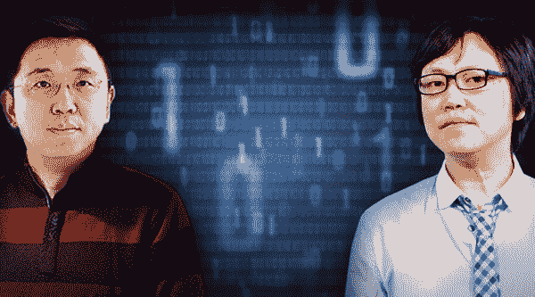
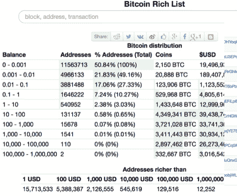
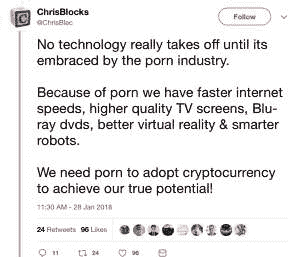
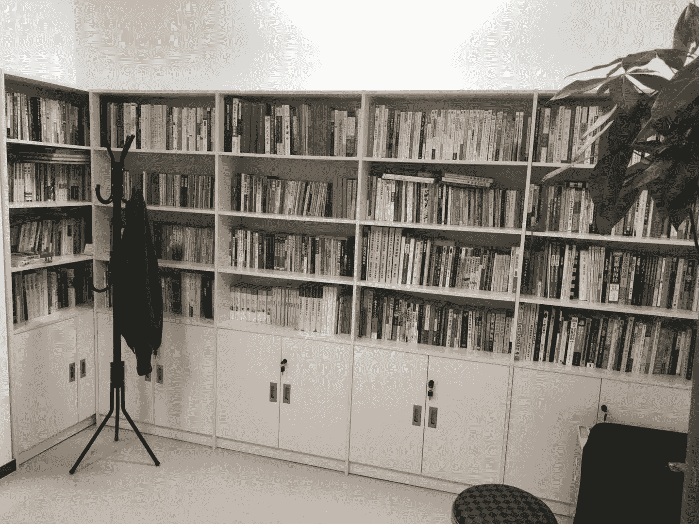

# 王峰十问第 10 期 | CSDN 蒋涛：区块链是程序员的时代，程序员的边界在于人性的边界（附音频）

> 原文：[`news.huoxing24.com/2018032620211065613.html`](https://news.huoxing24.com/2018032620211065613.html)

**对话时间**：3 月 26 日 22 点     

**微信社群**：3 点钟火星财经创始学习群

**对话嘉宾**：

蒋涛：全球最大的开发者社区 CSDN 创始人、总裁。曾担任巨人集团中文应用开发部经理，北京金山公司副总经理，联合创办北京豪杰公司。

蒋涛拥有超过 15 年软件和互联网工作经历，成功领导开发多个软件项目。1999 年创办 CSDN 社区，2000 年创办《程序员》杂志，2011 年，联合王峰创办极客帮创业投资基金，先后投资了 OKCoin、小电铺、凌云两轮智能电动车、聚合数据，巨杉数据等百余家高科技创业公司。

王峰：火星财经发起人，蓝港互动集团(HK.8267)创始人，极客帮创投合伙人，曾任金山软件高级副总裁。

**以下为对话原文整理：**

**王峰**：Hi，大家晚上好，欢迎来到“王峰十问”的第十期。

今天是我和 CSDN 创始人、极客帮创投创始人蒋涛我们两兄弟之间的对话。我们太熟了，以至于我不需要上网作业大半夜查他的底子，甚至不知道怎么定义这一期主题，只好用了“如何学习区块链“这个题目。清科创投的三亚百人会上，杨向阳和我说，蒋涛是他见到的把区块链讲得最明白的人。

我认识蒋涛，他负责北京金山的研发工作，也和大家通告下，我是通过蒋涛面试后加入金山工作的，3 年后，蒋涛创办了 CSDN，而我则追随雷军一直做到金山上市前夜。令我一直感到好奇的是，蒋涛长期以来对新技术和新趋势保持着极大的敏锐。

关于我和蒋涛的关系，用一句话概括就是：我们是兄弟。想告诉各位，我们不是喝过酒自诩的兄弟，我们在最穷的时候，把钱放到一起。现在则是更多的事情一起合作，3 月 30 日 BTA 区块链技术和应用峰会，就是 CSDN 和火星财经联合发起的。

蒋涛，我们的十问开始吧。

**第一问**

**王峰**：第一问，先聊聊一个最近刚刚发生的事情吧，涉及到中心化和去中心化之争。大家应该听说了一个星期之前 Facebook 很多个人的数据被盗的事件，这恐怕是扎克伯格最严峻的一次危机公关，其负面影响至今还在扩散之中。这要在以往，大部分人会指责其管理不善和网络安全技术徒有虚名，但在今天科技界越来越的人指出其问题的归根结底，是无数用户的数据基于一个完全中心化的系统在运行，甚至在没有被允许下就用，这本来就令人非常担心，这让区块链领域中不断提及的去中心化一词再次被大众关注。

此外，我注意到人工智能专家张首晟教授在上周六的深圳 IT 领袖峰会上指出，“所以我理想的世界，未来每人拥有自己所有的数据，这是完全去中心化的储存，这样黑客也不可能黑每个人的数据。然后用一些加密的算法在区块链上真正能够达到既保护个人的隐私，又能够做出良好的计算。”

你如何解读 Facebook 的数据被盗事件?阿里巴巴和腾讯苦心经营多年的中心化的大数据，其安全性如何不会步 Facebook 后尘?如何看待张教授的观点？

**蒋涛**：先说安全性，去中心化的系统和中心化的系统的安全性，对于顶级黑客看来是一样的，无差别攻击；去中心化的系统由于节点更多，每个节点安全性的强弱并不一样，有些节点的防护性可能更弱一些。相比起来，中心化系统会更安全。

Facebook 数据被盗，实质上是用户的数据被滥用的问题，核心问题是用户数据的所有权问题。运营平台并不应该拥有用户数据的所有权，在区块链时代可以更好地实现这个。

比如我们的身份证变成区块链的以后，你需要读取我身份证信息的时候根本用不着获取我那么多的信息，你只需要知道我这个区块链身份证是不是真的就可以了。我的信息还存储在我这里，你怎么使用我的信息，区块链上都有记录，我同意了你才能用。

现在的 kyc 本来只是要验证一个人真实性，却把你的信息全存下来，这导致了大量的滥用。

**第二问**

**王峰**：对于任何进入区块链的人来说，比特币话题是绕不过去的，那么比特币到底在区块链世界里扮演了什么角色?有人说今天的数字货币交易市场，大部分围绕了区块链目前最大的应用比特币，虽说将比特币比作是数字黄金已经被绝大多数人认同，但是这样击鼓传花下去一定会有很多人倾家荡产。你打算对一位没有任何技术背景的人如何解释比特币？

**蒋涛**：在区块链上，将来我们会形成一个数字资产的世界，它们在区块链上的锚定价值就是数字黄金，也就是比特币。就像全球经济中的货币是由美元来背书的，数字货币经济的基础本位币就是比特币。

对非技术人员来说，告诉他要配置数字资产，就像要买房升值一样，否则未来在加密货币经济体里面他就是穷人或者零资产。

最好的方法是把每月收入的 1%拿来买比特币，比买养老金更靠谱。

群员：比特币绕不开的话题，您目前持有比特币吗？如果方便的话，可以透露有几位数么？

蒋涛：倒数第四行。

（比特币财富分布表）

**王峰**：以太坊的 Vitalik 祭起了智能合约的大旗，让人人发行货币的梦想成为了可能。你认为，以太坊经济究竟为数字货币市场带来多大的价值?会不会有下一个 Vitalik，终结以太坊建立的数字货币经济体系？

**蒋涛**：比特币系统自从 2013 年 0.8 版本发布后，就没有重大更新了。2014 年以太坊的出现，实现了一个智能合约和去中心化应用的平台。

现在加密货币市场 90%以上的新项目都是通过以太坊进行的 ICO。比特币的价值在于矿工，而以太坊的价值在于开发者。从这一点来说，以太坊经济才是真正的新世界经济体。

关于终结以太坊体系，有多少人真正理解了以太坊的强悍？我们有高手阅读过以太坊的全部源码，他们的结论是要实现全部以太坊的丰富功能，性能问题的挑战很难避免。

以太坊虽然性能上有不足，但它的治理机制和整体设计是非常精巧的，号称一台全球计算机，以太币是燃料币，这是有明显用途的，所有 Dapp 都要交上机费，关于 gas 和 gas price 的设计对经济系统有很好的调节功能，解决了比特币手续费无限制膨胀的问题。很多号称要超越比特币的项目人员，并没有真正地理解以太坊系统的精髓。

未来会出现更多的公链，取代以太坊的最大可能是以太坊 2.0。

**第三问**

**王峰**：如今，区块链即将跨入 3.0 时代，江湖豪杰纷争，有人做 OS 操作系统，有人基于 Webbase，有人力争做高并发处理能力的公链，以支持更多的去中心化或中心化的场景，据说巨头们都在做跨链。百链如索，让很多人不知道如何下手。我想问你真的看好 EOS 吗？很多人很担心其创始人 BM 大神的责任心，但是又非常期待他们今年六月的新版本，你如何看待 BM 这个人？人品和能力？

**蒋涛**：BM 个性乖张，历史上和中本聪吵过架，和 bitshare 团队、steemit 团队都以分手告终，和 V 神也正在撕逼，但他确实技术水平很高，对区块链的思考也非常深刻。

他的博客思考很深入，关于区块链的技术和治理非常值得一看：[`bytemaster.github.io`](http://bytemaster.github.io/)

关于 EOS，看好的人越来越多，我们这边有人把 EOS 节点跑起来，技术上可行性已被验证，达到 1300tps，EOS 上线应该会很成功。

**第四问**

**王峰**：CSDN 从 1999 年建立以来，聚集了大量的技术领袖、计算机程序爱好者。时至今日，CSDN 注册用户有 5262 万，它依然是无数程序员眼中的社区圣地。但是毕竟 CSDN 已经创办了快 20 年，今天的热门社区中，微博已经被大 V、明星和段子手控制，百度贴吧面临产品老化，各种垂直化社区创建门槛也越来越高。面对如火如荼的区块链产业大潮，以程序员社区著称的 CSDN 将如何设计自己未来的社区模式，有没有更好的激励手段？

**蒋涛**：我要来卖 DCO 的广告了，原来 CSDN 社区是弱协作的成员关系，用户出于自愿参与，缺乏强激励机制，现在基于 Token 的新型开发者社区是强协作的，以太坊社区、EOS 社区的飞速发展就证明了 Token（jin qian）的魅力。

DCO 将构建新型软件组织，有开源的精神、商业的组织和区块链的激励机制，软件开发者在一起不仅是进行知识的分享，更重要的是一起去进行创造，创造有价值的内容或产品，并去维护这一价值的不断增长，形成一个新型程序员经济体，这是 CSDN 的区块链目标。

**王峰**：CSDN 社区升级有什么计划？说的干的。

**蒋涛**：计划要做海外版 CSDN，是面向区块链开发者和生态的，也是面向全球开发者的。

**群主**：昨晚我们讨论过社区中 Token 的作用，很多人认为 Token 只是社区的一部分而不是做好社区的关键。你觉得 Token 激励是社区的痛点吗？为什么？

**蒋涛**：Token 是痛点，这是从弱协作到强写作的重要手段，只有强协作才会持续产生价值。

区块链时代，程序员离金钱最近。软件时代要通过分销渠道，互联网时代要做服务，而区块链时代，程序员在发币。

群员：是要做一个内容激励社区么？

**蒋涛**：不是内容激励，是介于商业软件公司和开源软件社区之间的分布式协作平台 （Distributed collaboration Org，DCO）。

**第五问**

**王峰**：达鸿飞设计了小蚁 NEO，帅初设计了量子链 QUTM，最近，老冒设计了 Arcblock，前不久刚刚接受“王峰十问”的陈榕设计了亦来云。作为区块链从业者，如果想在公链之上写一个属于自己的 DApp 场景，该如何选择公链？我替很多因此感到迷茫的朋友问了这个问题。

**蒋涛**：首选需要考虑：1）工具要全 ；2）社区要丰富。选择公链，开发生态比其他因素要更重要。

以太坊的开发者数量是其他所有公链的几十倍，但是每条公链包括 EOS、NEO、QUTM 都有自己的特点。不过，除非其特长能用上，可以选择，否则 Dapp 开发还是首选以太坊。关于以太坊效率，其实现在有很多解决方案可以满足。

**王峰**：怎讲？比如？

**蒋涛**：比如开发以太坊游戏，链下中心化可以先处理交易和数据，再批量上链确证，不需要每次都先上链交易。部分数据在链上，是现在的趋势。 

**第六问**

**王峰**：前几天，你有篇文章被朋友圈刷屏了，你提出了一个关于区块链时代研发管理组织的一个新词 DCO，即 Distributed Collaborative Organization，新型的分布式协作组织，一种介于完全中心化与完全去中心化之间的新型组织。而此前，以太坊的 Vitalik 提出的解决方案是 DAO，即 Decentralized Autonomous Organization，去中心化自治组织。你提到不要求完全去中心化、不要求完全以币权为凭证、不要求完全自动化治理，是 DCO 的三大特点。在我看来，DCO 是对以太坊 DAO 过于理想意图甚至是空想主义设计的进一步优化。

你什么时候注意到 DAO 是有局限的?又是怎么想到做更务实一些的 DCO 的？哪些事情给了你启发?能举几个例子吗？

**蒋涛**：首先，我们从那些成功的开源软件的发展来看，虽说他们都是社区组织，但只有在那个灵魂人物来驱动的时候，社区才能够开发出优秀的软件，包括 Linux，包括 Python。也就是说，优秀软件的开发，是需要核心人物的。所以，纯粹的去中心化的自组织方式，效率未必能有这么高，这是我们已经看到的。比特币技术现在发展缓慢，缺乏核心人物是关键因素。

历史上像 GNU 这种纯粹理想主义的自由软件，在市场上叫好不叫座，DAO 接受程度堪忧，去中心化原教旨主义也会如此。

现在 Rchain 等社区采用全自治的方式，每个功能要 member 投票，整体进展及其缓慢。

我们应该把决定权交给每个项目发起人，他可以选择核心决策，或者分层，或者扁平。

公司治理也积累了很多有价值的机制，比如 AB 股权、所有权和决策权的分离，这些机制都将被设计进 DCO。

群员：没有 RMS 和 GNU，可能现在大家都没机会聊这些话题了。只能说从狭义的商业角度看，GNU 以及自由软件没有取得成功，但从社会角度看，其价值是无法估量的。

**蒋涛**：理想是指路明灯，落地还要靠土洋结合。

**第七问**

**王峰**：我也知道你认识很多中医、玄学的大神，而且多么多年你一直保持对太极和围棋的热爱，我最早听说龙泉寺也是听蒋涛提起的，你是怎么保持这多维度上的开放性认知的？他们彼此会在你的思维框架里和谐共处吗？你又怎么看前不久大家对区块链看法的严重割裂感？有人厌恶至极，有人奉若神明，有人敬而远之，有人趋之若鹜。蒋涛我还想问你，我一直觉得你包容心强，性子偏慢，至少没有我性子那么急，为什么这一次，你也多次提及跑步入场区块链？（捂嘴笑脸） 

**蒋涛**：关于包容性，我觉得对于整个世界的认知，目前还有太多我们不知道的地方。暗物质暗能量占了宇宙的 96%，所有的科学知识还只能看到和努力解释 4%的世界，也还不能解释所有发生在这个世上的事情。所以，我们应该对于未知保持一个充分的开放心态，保持敬畏。毕竟，科学也是在无数次地迭代，不断改进自己。我们自己也要保持这样一种心态。

区块链是一个多维度的经济体和世界，不再是原来以金钱为衡量价值的单维经济体。它能够改变组织的形态，叠加多重的价值维度，导致它的发展也在加速演变。所以“跑步进入区块链”，并不是因为炒币或是媒体的风口，而是因为区块链技术本身的演进速度，从平面信息互联网进入立体价值互联网，技术和项目的速度都是指数级增长，必须跑步才能赶上。

通过区块链还认识了很多跨界的朋友，包括文物收藏的、医疗健康的、电影文化、还有玄学界的，每个都可以发表自己的区块链精神，很有趣。

**第八问**

**王峰**：区块链时代，一部分人极力鼓吹去中心化。这让我想起了当时的西方，出现了一大批像圣西门、傅立叶和欧文的“空想社会主义理论家”，他们把一切用最美好的愿望，理论般地去书写出来，但最后成功落地的，是马克思、列宁和毛泽东所推动的适合当时历史条件和本国国情的革命。去中心化与中心化的关系，更像是资本主义私有市场经济与主张必要的宏观调控的经济模型相融合，你觉得是这样吗？

今天凡是谈去中心化的观点，会不会过于书生气了？我多少都怀疑，在相当一批公链、联盟链之上，应该有足够多场景是中心化的。未来可能是去中心化的底层上产生大量中心化应用吗？

**蒋涛**：刚才其实已经回答了，完全去中心化过于理想化，更实用的应该是去中心化与中心化的叠加，各取所需，各展其才。

V 神正积极推进以太坊的 PLASMA 计划，就是分层的以太坊系统，但也不是完全去中心化扁平化的设计。

去中心化是区块链的本质，但中心化系统也有很多优势，结合起来才是最实用的。

**第九问**

**王峰**：时代变化真快，去年还时常听到的“颜值即正义”，转眼就听到大家开始处处讲 Code is law，这句话已经变成了许多程序员点亮奔向区块链未来的指明灯。不少人认为程序英雄的时代会再度来临。作为一个优秀的程序员，你如何理解 Code is law？

**蒋涛**：宇宙是有法则来运行的，生命也是有法则的。生命的代码写在 DNA 上，宇宙世界运行的法则就是我们看到的物理定律和数学公式。所以，从这点说，上帝也是一个程序员，它的程序在永不停息地执行。

区块链世界就是在模拟这样一个生态，更接近于宇宙的真实状态，这就是 Code is law。

**王峰**：区块链技术与应用的发展，肯定会涉及到一些暗网黑市交易以及色情博彩这类很多国家禁止的行业，程序员们该如何把握自己的正义边界呢？

**蒋涛**：关于正义的定义，不同人有着不同的认知，它的概念不止有一个维度。对于程序员来说，我们最根本的任务还是技术创新，用技术来为人类社会探索新的可能。

所有技术都有正反的使用面，程序员的边界在于人性的边界。

色情业是使用新技术热情最高的，因为它的用户愿意尝试。

（图片译文：没有哪项科技能真正起飞，直到它拥抱色情业。因为有了色情业，我们的网速变得更快，电视屏幕质量更高，然后又有了蓝光 DVD、更好的 VR 设备以及智能机器人……我们需要色情业帮助加密货币领域激发真正的潜能！）

**王峰**：又问，你打算怎样对刚刚毕业的大学生介绍这场前所未有的机会？如果你今天还去技术一线编写计算机网络代码，你会从哪里做起？CSDN 在迈向区块链的产业跃升中，你本人从事什么具体角色？你觉得你准备好了吗？

**蒋涛**：随着 AI 和区块链的发展，我们未来的生活都是由程序来决策和运行的，所以对于大学生来说，无论将来做什么，花三到四个月的时间学会编程都是非常有用的。就像尤瓦尔·赫拉利在《未来简史》中所说，未来会出来神人，而大部分人将沦为“无用阶级”，要成为“神人”必须学会编程。

CSDN 的区块链产业跃升，我主要作为布道者和资源组织者，我们正在组建一个 90 后开发者团队，打造新一代开发者经济体平台。

**第十问**

**王峰**：到了点评风云人物的时候了，哈哈。在你认识的程序员中，同时代的谁最厉害？互联网时代，谁最厉害？区块链时代，你最看好的人是谁？说三个。你认为一个优秀的程序员的素质是什么？技术人员走向前台，最需要克服什么不足？

**蒋涛**：我认识的同时代程序员，梁肇新最厉害，不过我最佩服的（不认识）是 Turbo Pascal 和 Delphi，C#发明人 Anders Hejlsberg，最羡慕的是 John Carmack。

互联网时代，Google 的 Jeff Dean 是超级大神，主导了 map reduce、Bigtable、Google Brain 和 Tensorflow。

区块链时代领袖程序员要有汇聚社区的能力，表达力要好，比如 V 神写出来的文章非常漂亮、简洁有力。

国内的程序员，不是技术大神，是产品大神，包括张小龙、张一鸣、王兴。

关于好程序员，Perl 语言发明人 Larry Wall 有句名言，优秀程序员有 3 种美德： 懒惰、急躁和傲慢（Laziness, Impatience and hubris）。因为懒要写出省力程序，不干重复事；因为急躁要尽快真正解决问题；因为傲慢而极度自信，使你有信心写出（或维护）别人挑不出毛病的程序。

优秀程序员的关键能力是化繁为简，追本溯源，进行本质思考。

程序员的不足是唯机械论，缺乏同理心，把所有的人协作都视作机器和逻辑，非黑即白，没有灰度处理能力。

**王峰**：你最近读了哪些书？能否推荐几个你常去的网站？

**蒋涛**：每周都要读书，书是最有价值的思想交流，其实写过书的人都会了解要把自己的思想和故事结集成书很不容易，所以长销书和名著都是非常有价值的。

书架上的书 90%是我在孔夫子网站买的，还有毛泽东文集。

（蒋涛满满的书架）

推荐一本修练的书《如何安心如何空》，类似于理科生科学论文的写作来讲述佛学，很有力量。

网站经常上的 Medium、Techmeme、Hacker News，还有非常值得一看的 Wait But Why。

**王峰**：谢谢蒋涛今天带给我们的分享，感谢你今天能来到三点钟火星财经创始学习群。

今天是“王峰十问”的第十期。一转眼，“王峰十问”从 2018 年 2 月 24 日第一期开始以来，30 天的时间，我们陆续对话了薛蛮子、帅初、陈伟星、曾鸣、李笑来、朱啸虎、杨宁、郭宏才、陈榕、蒋涛等 10 位意见领袖与行业翘楚，引发了互联网、区块链、投资界、传媒行业以及社会舆论的高度关注。

“王峰十问”以“对话思想先锋，直面风口浪尖”为特色，紧密追踪舆论热点，深度挖掘话题价值，且倾听，且质疑，不断传递正能量，致力于打造高质量、强影响力且广泛传播的互联网财经访谈品牌。

接下来，“王峰十问”将继续邀请当下最有影响力的人物，特别是在互联网、区块链新技术相关的科技、文化以及娱乐尖峰人物，接受提问和访谈，给大家呈现更加有趣、有料的精彩内容。

“王峰十问”，有你参与而精彩！未来，还请大家继续支持，多提宝贵意见建议。谢谢大家！

声明：本文为火星财经原创稿件，版权归火星财经所有，未经授权不得转载，转载须在文章标题后注明“文章来源：火星财经”，若违规转载，火星财经有权追究法律责任。