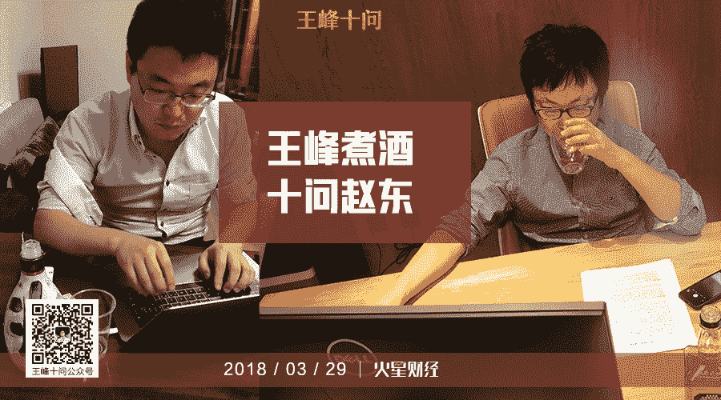
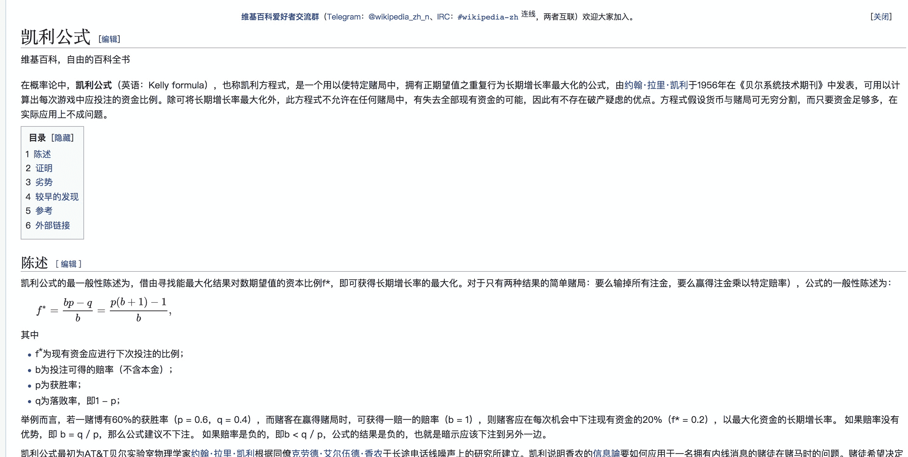
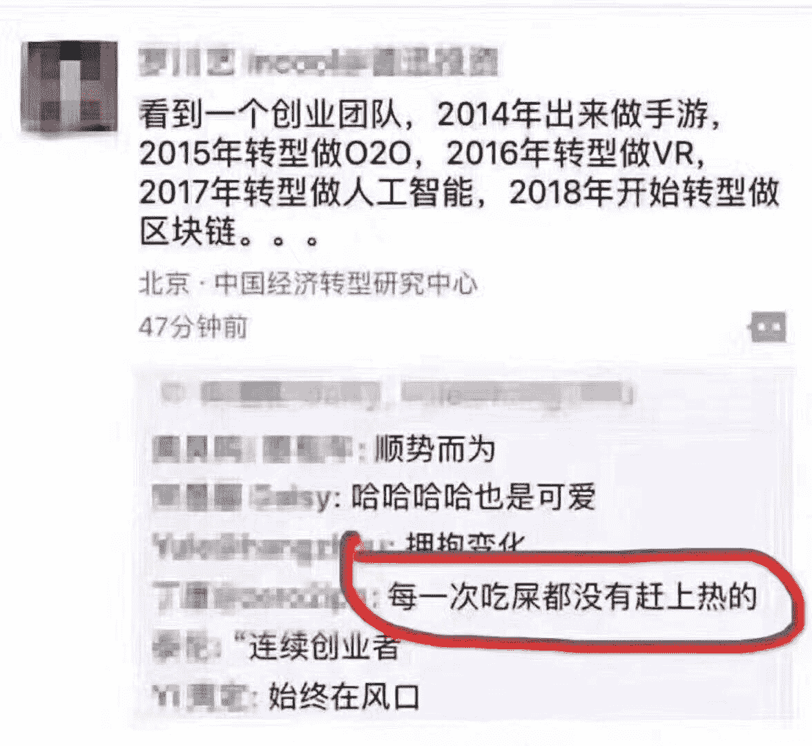

# 王峰十问第 11 期 | Dfund 创始人赵东：每一次吃屎都赶不上热的创业者千万别投（附音频）

> 原文：[`news.huoxing24.com/2018032917044604772.html`](https://news.huoxing24.com/2018032917044604772.html)

**对话时间**：3 月 29 日 22 点     

**微信社群**：3 点钟火星财经创始学习群

**对话嘉宾**：

赵东：原墨迹天气联合创始人、CTO，2012 年退出墨迹天气团队。2013 年 4 月，用 1000 万人民币起步资金闯入比特币世界，当年底个人资产迅速过亿，后经营国内最大规模之一的矿场。2017 年 7 月创立 Dfund 基金，专注数字货币领域的投资，截至 2018 年 1 月，Dfund 一期项目比特币净收益为 620%(美元净收益为 2543%)。

王峰：火星财经发起人，蓝港互动集团(HK.8267)创始人，极客帮创投合伙人，曾任金山软件高级副总裁。

**以下为对话原文整理：**

**第一问**

**王峰**：赵东你是 2013 年开始买比特币的吧。信奉“比特币越跌越买”的投资者们应该感觉捡了大便宜。一般人往往习惯于听从股市上“买涨不买跌”的跟风逻辑，所以你看现在的交易量就大大不如从前。你曾因为爆仓而威名远播，期间经历了大起大落，故事荡气回肠。在跌的时候狠吃，这是你价值投资最基本的一个原则吗？你 2014 年 2 月第一次爆仓，此后一年之内又经历了两次爆仓，总共亏了 1.5 亿元。几次爆仓之后，你能重新翻身，其中原因是什么？在我看来，爆仓的原因可能是因为贪婪，后来的翻身究竟有没有运气成分？

**赵东**：爆仓的原因，我首先自认傻逼：当然是因为我的贪婪，以及当时根本就没有任何风险意识，缺乏对于大行情的判断和认识（那之前我并没有过任何巨额的亏损）。后来翻身，首先我坚信比特币是一个能够改变人类历史命运的一个事物，那我就需要在这个行业坚持下去，不管有多困难，我也不知道会熬多久，反正支持我的动力是：我不能死，必须活着。

有没有运气成分？既有认知上的原因，运气的成分也很大。比如说去年我创立的 Dfund，我们认为赚钱的主要原因是赶上了大趋势。一个人真正要成功，除了自己的聪明、努力、坚持等，很重要的还是要把握住大势。否则，一切努力都可能是徒劳。

高中的时候就读佛经，但是我目前还不信佛。

我高中不仅读佛经，我还背《老子》、《庄子》、《论语》、《易经》（我忘性比记性好的多，大部分都忘了） 。 但是我不信任何宗教。

**王峰**：进而问一句，你是敢于孤注一掷的人吗？如果是（或者曾经如果是），你出发前的底线是什么？经历这么多，为你今天的数字货币投资决策中的杀伐决断带来了什么影响？

**赵东**：我是不是一个敢于孤注一掷的人？客观讲，我对自己的评价是：我属于比较喜欢冒险的那类人。

为什么要冒险？其实从这个问题可以从数学上面找到答案。大家是否了解一个叫夏普比（sharp ratio）的概念。打个比方，两个人扔硬币决定输赢。正面反面的概率各百分之五十。每次下注一块钱，赢的一方全拿走。那么赢的概率百分之五十，赢了之后得到两倍回报，百分之五十乘以二等于一。

夏普比等于一意味着这样的游戏持续玩下去是不赔也不赚的。那我们应该做的事情是夏普比大于一的事情。而且呢，不能寄希望于一次成功，而是要不断的去试错。

大部分人倾向做的事情是成功概率高的事情（比如百分之九十），但是忽略了回报的大小（比如百分之十）。例子中这样的夏普比是 0.99。

我做的是什么事情呢？虽然成功的概率只有百分之十，但是成功之后得到的回报是十倍，甚至一百倍。那么我的夏普比就是 10。所以说这是为什么我要冒险的原因。

如果你一次把所有的资产都 All In 到一个事物上，即便夏普比很高，但是失败之后就没有重新再来的机会了。所以我从自己过去的经历，得到最好的经验就是：要有风险控制意识，在时间精力上应该 All In 自己的事业，但是在资产上不要轻易 All In。

**第二问**

**王峰**：知乎上有人对你发问，我也综合了一些“民意”，选取若干网友的尖锐问题，请赵东老弟在此做个澄清：

1\. 你是否曾利用过矿机的预售款炒币？

2\. 你怎么看有人称你叫“黑庄东”？你是否在一些场合散布过要拉盘或暴跌的信息，进而影响市场为自己获利？

3\. 爆仓以后，你是否有过恶意做空或者低位吸货？

以上是三个毒舌问题，你有冤申冤。

**赵东**：首先说明一下，在网上那些所谓爆我黑料的人没有一个是我的投资人，或者真正参与过我矿机预售项目的人，如果是的话，请站出来。

2014 年之所以要做矿机预售，当然是因为我爆仓后资金不足，要不然的话我自己干这事儿就行了，何必预售呢。

有没有用预售的资金炒币？我们其实在不到十天的时间里，就把所有的资金退还给了投资人。所有账目都和投资人有公开，因为当时预售之后打算去买阿杰矿机，但是阿杰矿机涨价了，我们认为不合适，于是项目就放弃了，放弃之后立即给所有投资人退款。

“黑庄东”的这个称号的确是有。因为我当时交易比特币的时候，曾经有那么一段时间以为自己可以操纵市场。当然啦，事实证明我错了。

对于“恶意做空”或者“低位吸货”。 我首先不认可“恶意做空”这个提法。

如果说“做空”是“恶意”的，难道“做多”就是善意的吗？大家不都是为了赚钱吗？何必厚此薄彼？

**第三问**

**王峰**：Facebook 早期投资人 Peter Thiel 曾劝诫 Zuckerberg：“在一个变化如此之快的世界里，你最大的风险就是不冒风险”。蔡文胜也讲过：区块链是人类有历史以来最大的泡沫，但泡沫是推动技术革命的催化剂，我们只能拥抱泡沫，不参与才是最大风险。听说，不冒险是最大的风险这句话你也非常喜欢。

机遇和风险共存，换句话说，没有风险，就没有机遇。在风险面前，如何把握住机遇而不错过？在机遇面前，如何减少风险而不盲从？二者难以平衡兼顾。熊市当前，你我想听听你怎么给普通投资者建议?说实话，我之前挺担心很多人学习你的，我担心他们倾家荡产。

**赵东**：机遇和风险共存。没有风险就没有机遇。如何减少风险？其实我们并不能减少风险，我们能做的是控制风险。风险就意味着机遇在前面啊，我们要做的事，不能随便的 All In。风险控制中有个重要公式叫凯利公式。

f=（bp-q）/b 打个比方，如果你做的事情，成功率只有 10%，但预期回报是 100 倍，那么： f=（100*0.1-0.9）/100 ， 你用自己资产的 9.1% 的资产去赌。

这个赌注 10%的成功率，城后你的资产可以翻 10 倍，失败后你只失去 9.1%资产，赌还是不赌呢？所以，牛逼的人计算概率，而傻逼的人要求一夜暴富。我是用这个公式来论证风险控制，如果 2013 年我对这个公式有深入考虑，我就不会 All In 资产+杠杆去赌比特币上涨了。

**第四问**

**王峰**：丘吉尔说，伟大人物常常拥有历史联想力。“精神上，他们活在历史的车道中，可以自由穿行。”后一句是我说的。以史为鉴，去总结“问题+方法+效用”，为人们提供对未来思索的角度。你曾说，复习历史，是为了防止自己重蹈覆辙。数字货币市场的发展历史，真的具有可复习、可借鉴的价值吗？去年 11 月到今天数字货币市场的大涨大跌，和你之前历史上的哪段经历类似？

你怎么看从 1 月份以来的这轮熊市的原因？熊市改变了这个市场什么规则？什么时候群牛归来？

**赵东**：去年 11 月到今天的大涨大跌。这个经历实际上非常类似于 2013 年比特币涨到历史高位八千人民币之后的情况。

市场总有自己的规律，而这个规律呢，不是任何人能左右的，任何的市场。基本上分成三种状态：上涨、上跌、要么就是横盘震荡。

熊市的原因是什么？熊市是不需要原因的。所有所谓的“原因”只不过是“上涨”或者“下跌的”导火索而已。市场有他自身的规律，市场很少有理性的时候。他要么处在一个非理性的上涨过程中，就是泡沫不断增加的过程中，要么就处在一个非理性的下跌过程中。 非理性的上涨，会一直持续到它的价格远远超过它应有的价值。而非理性的下跌，它的价格自然也会跌到远远低出它应有的价值。

所以一个市场变熊或者变牛的时候不要问原因，市场有自己的规律。

什么时候走牛呢？看历史的话，比特币大概是四年一个周期，以挖矿减半为关键时间点。如果我们把 2013 年看作是比特币的一个“夏天”，那么 2014 年是“秋天”，2015 年是“冬天”。我本人就是曾经冻死在了 2015 年的“冬天”。

2013 年是“夏天”的本质原因是因为 2012 年比特币挖矿产量减半。2014 的“秋天”，我们虽然亏了钱，但实际上手头尚有资金可以做事的。而到 2015 年，我们才是真正除了巨额债务，手头一点钱都没有了。公司所有的人都因为发不出工资离开了。

所以啊，看今天大家这么吵吵，其实大家都是秋后的蚂蚱，蹦跶不了几天了。我不是说谁，我是说你们所有人 。

以 2016 年比特币减半为契机，开始启动了新一轮的牛市。到了 2017 年，成为比特币的大牛市。如果我们把 2017 年当做比特币的夏天的话，那到今年应该是进入又一个秋天了，而冬天会在明年 2019 年。

不过秋天不是坏事情啊，秋天，是播种冬小麦的时候。当然，如果不是可以过冬的作物，就不能播种了。

类似自然界的四季的变化，一个市场的牛熊也是在不断的变化的，没有永远的牛市，也没有永远的熊市。

我不敢保证我的推测是正确的。但是如果我的推测是正确的，这个推测能确保我的团队在四年之后在这个行业中还有立足之地。如果我判断错的话那更好，不是熊市而是牛市的话，我的团队会做得更好。

总结一句话，要抱着最好的梦想，做最坏的打算。借用《易经》里的一句话：生生不息之谓易。

**群主**：秋天，哪些是区块链的冬小麦？

**赵东**：我们只能做事后诸葛亮，不好预测的。 比如，上一个秋季的冬小麦，我就看走眼错过了大牛以太坊。

我再补充这句： 冬天的时候，可以看看哪些团队还在踏踏实实做事情，如果那时候他们的 Token 跌得太狠，可以放心买入吧。

**第五问**

**王峰**：2009 年你和金犁一起创办墨迹天气，到你 2 年后离开，这款软件累计下载量超过 1.8 亿，现在用户到了 5 亿多。 墨迹是一款典型的用户量大但商业化做得不算好的产品。你曾经也说过，你们三位创始人都不擅长赚钱。你现在还认为自己不擅长赚钱吗？会不会觉得做投资比较于做创业，更适合自己？

**赵东**：首先我是一个从来不排斥新机会，爱冒险的人。做墨迹天气之前我还在打工，金犁对我做了启发，他告诉我说移动互联网的风口就要来了，我们应该在智能手机上做应用，我们就吃了一顿饭的时间，然后就决定要一起做了。我们是大学同学，有信任的基础，然后我们也合作过一些项目。所以合作很容易就开始。我们很快了找了另外一个合伙人，也是我们的大学同学。

但是我的个性也是比较追求新鲜感的人。墨迹天气做了两年以后我感觉没有什么新的东西可以做了。所以我想结束这一段去开创一个新的东西。再加上那时候团队内部有矛盾，所以我从墨迹退出来之后在车库咖啡呆了差不多两年的时间。

现在墨迹天气 5 亿安装量，8000 万日活吧，群里至少有 50 个人每天都用墨迹天气。

车库咖啡呆着这段时间内其实我基本上是以一个义工的形式，承担 CTO 的工作，我没有领过车库咖啡一分钱工资，相反我倒是投资了好多不靠谱项目 。我还是经常写代码的，写代码的时候，我感觉自己像个上帝，可以随心所欲创造出我想要的东西。

因为程序员是最富有创造性的职业了，我认为，未来如果你不会编程，你一定会被社会淘汰。为啥呢？ 机器人可以替代人类的重复性工作，但是我不认为机器人（AI）可以替代人类的创造性工作。

那关于擅长不擅长赚钱这个问题呢，每个人的赚钱能力，其实都是需要不断的锻炼，需要练习学习的。墨迹天气最开始做的时候我的确认为我们几个人都没有商业头脑，不会赚钱。

**王峰**：为什么不自己去组织写公链？

**赵东**：谁说我不会呢？我个人，包括我后来的公司也是经历了那个从不赚钱，到赚钱，然后再到亏钱，然后再到赚钱，这样的一个不断的历练的过程。

我的赚钱能力比以前肯定是强了。做投资相比于创业哪个更适合我？我并不认为投资更适合我，其实投资只是我们的业务之一。我们的整个团队叫做 DGroup，我们除了 Dfund 之外还有好几个赚钱的项目，我们自己内部也在孵化一些新项目。

投资和创业，其实本质上都是在“投资”自己，没有本质区别。 每个人，最珍贵的是自己的时间，如何用有限的时间做最牛逼的的事情是关键。

每个人，真正的货币，是自己有限的“时间”。

**第六问**

**王峰**：苏菂给我讲过一个故事，说你当年从墨迹天气出来，对能不能拿到钱心里没底，偶然在北京昌平遇到了一个老太太，让她给你算了一卦。她说你 3 个月内能拿到 600 万，结果真拿到了。我听说，你跟她还保持有联系。我还看到你有次接受采访说，当年在做墨迹前，也曾算过金犁等几位创始人的八字。你信命吗？有人说，一命二运三风水四积德五读书，你怎么看？在你炒币跌宕起伏的过程中，如此捉摸不定的市场，你问过当年的那位老太太吗？

**赵东**：北京昌平老太太算命的故事的确是真的。当时所有车库咖啡和我相熟的小伙伴可以作证。因为事前连我自己都不知道结果。

我们当时三个合伙人，我跟金犁决定做墨迹天气时并没有看什么八字。但是我们另外一个合伙人，他是非常相信命运，是他拿了我们两个人的生辰八字去算过，之后他说大家很合，然后就和我们一块儿创业了。

客观讲我本人并不信命，我更相信个人的努力。当然在个人的努力面前啊，还要把握住历史大势，如果判断错了历史大趋势，那么努力可能是白费的。我只说事实，我不迷信算命，我也不会依靠算命去做决策。

我信我自己一定牛逼。相信自己以后一定牛逼，所以困难的时候绝对不能死掉啊！

**第七问**

**王峰**：你家是山西哪里人？晋商是中国最早的商人，其历史可远溯到春秋战国时期看，在中国商界称雄达 500 年之久。票号生意是晋商在商业历史上最广为传颂的领域。1821 年，雷履泰改设“日升昌”兼营汇兑，打造了历史上第一家票号，由此影响了整个晋商乃至中国商界版图。你说过，接触比特币不久后意识到，自己天生就是干这个的，靠的就是信用。而你在爆仓后，恰恰就是依靠你之前积累的信用，一点一点做场外交易，还上了欠下的债务。你总结晋商思维和晋商文化的精髓是什么？你心目中的晋商代表是谁？你怎么看待远在大洋彼岸的两位晋商老乡郭宏才和贾跃亭？

**赵东**：我家是在山西南部离河南比较近的地方，由于海拔较高，气候条件以及自然条件是比较艰苦的，干旱。农作物收成不是特别好，就是靠天吃饭，是有点困难的。

我觉得诚信并不是一个道德层面的东西，而更多是一个商业层面的东西。我诚信的原因，是我可以得利，我可以赚钱，所以要讲诚信啊。不是为了诚信而诚信。聪明的人会选择诚信，愚笨的人会选择欺诈。

去山西平遥，我的体会是，由于自然条件差，那里的人靠天吃饭是很难的，所以只能给人跑腿： 送钱。 做生意的人，生意来往经常需要运转资金，而跑腿的人帮人送钱，他可以选择一时欺诈骗钱，或者长久靠信用赚钱。久而久之，就成了山西票号。

**群员**：九毛九的故事知道吗？上次宝二爷那期也问过这个故事。

**赵东**：二宝生来就是富二代，而我生来家里是比较普通的。 说来你们不信，我得“东叔”这个”艺名“，实际上是因为我家穷。

我 1999 年上大学，一直到毕业，我每个月生活费只有 300 元人民币。而我后来染上了烟瘾直到现在。一包烟最便宜两三块钱，好一点的六七块钱，如果抽好烟，一天一包一个月要花 180 元，生活费怎么够？所以我买了烟斗抽，因为一包烟丝几块钱够抽一个月。我天天在教室里面抽烟斗，我一个同学看见我，说看见我抽烟斗的感觉像黑社会老大，他天天看香港古惑仔的电影，就给我起名叫”东叔“。其实我是我们班里最小的。 

我曾经创造过 2 个月仅靠 80 人民币生存的奇迹。

**群员**：你总结晋商思维和晋商文化的精髓是什么？你心目中的晋商代表是谁？你怎么看待远在大洋彼岸的两位晋商老乡郭宏才和贾跃亭？

**赵东**：晋商文化的精髓就是对于“诚信”的理解，我上面已经说过了我对“诚信”的理解。而为了达到“诚信”，山西票号前前后后可是有好多赔到倾家荡产的。所以，为了长久的利益，当我自己面对自己的承诺的时候，我选择承担而不是跑路或者自杀。

“诚信”是有代价的，特别是当别人欺诈，而你“诚信”的时候。也就是，遵守“诚信”，短期利益可能受损，但我们相信长期一定是得利的。 所以说山西商人的“诚信”，恰恰是因为山西商人的“精明”。

“诚信主要是要给自己交代，然后才是给别人交代……” 今之学者“为”人，古之学者“为”己。

**群员**：怎么评价你的两个老乡，贾跃亭和郭宏才？

**赵东**：贾跃亭我对他不了解。我可以说说二宝，二宝也不会介意我说他。

你们看二宝傻逼，但二宝实际上是一个非常聪明的人。一个可以毫无保留直接接受所有人对他的侮辱、骂名，这需要多聪明呢？反正我看到傻逼往往喜欢和别人对骂。所以啊，二宝看似 low，实际上聪明的很。

**第八问**

**王峰**：再议韭菜。有人说，韭菜之所以是韭菜，首先不是技术层面的问题，而是思维方式的问题。若你每次投资，都要看他人的评论找方向、找安全感，长期下来多数会亏钱。还有不少辛苦韭菜，钱少，却不愿意放过市场中的任何一次波动机会，为这 36 小时不睡觉，72 小时不闭眼，全球数字货币市场 24 小时不间断的交易，把他们折磨至夜不能寐，日不能食。诚如是，极品韭菜之中之大成。痛哉，悲哉。

赵东，你认为，韭菜思维的几个最典型特征是什么？如果不想自己被当韭菜割，个人思维方式上要从何处升级？如何洗心革面，重新开花，免遭再割？

**赵东**：所谓的韭菜，实际上是对自己行为不能负责的人。

我朋友常拜跟我说，大家认为市场有庄家的原因是因为：如果市场有庄家，那么我赔了钱就不是我的原因，而是因为庄家割了我的韭菜。如果说，赚了钱就认为是自己判断英明，那么赔了钱为何要怪庄家呢？为啥不反过来承认，赚了钱是因为庄家，赔了钱是因为自己傻逼呢？ 所以韭菜，就是不能为自己的决策、行为负责的人。

真正能长期在市场上赚钱的人是因为他把握住了大趋势。我爆仓之后反省得出的结论是：我爆仓跟任何人没有关系，只是因为我自己傻逼。我没有怪任何“庄家”，甚至我也没有怪任何“交易所”作恶。

我想到一个有点“污”的话题： “手淫”的唯一害处是你认为“手淫”有害。 那么“韭菜”之所以是“韭菜”，是因为他认为市场有“庄家”割他韭菜。

所以，成败完全在于自己，和别人没有关系。

**第九问**

**王峰**：你在车库咖啡的时候，一边做咖啡小哥，一边写程序，一边研究比特币，不会想到今天的赵东已经成为区块链项目很好的背书品牌吧。我想起前不久在飞机上读的一本书，叫《谢谢你迟到》，作者是写《世界是平的》的弗里德曼，他先引用了美国文学家爱默生的一句名言，“每次暂停的间歇，我都听到了召唤。”然后，他问读者：暂停的时候，你做了些什么？这话令我沉思良久。

陈伟星卖掉快的，痛不堪言，选择了喝酒和看书，然后决心和古典互联网投资决裂。你从一个技术型创业者到币圈扑克牌人物，这个转变也着实不小。我想问，你离开墨迹拿着 600 万去车库咖啡的时候，听到了什么使命召唤？

**赵东**：实际上，我们创办墨迹天气的时候，由于我们之前没有任何创业的经验，我曾经想象过一个咖啡厅，创业者可以随意自由交流的地方。当我离开墨迹后，我发现居然苏菂搞了这样的一个地方，我就去了啊。

我觉得苏菂是一个伟大的人。不，苏菂是一尊佛。 苏菂和我们所有男人一样，也喜欢钱、也喜欢女人。 但是他做车库咖啡，的的确确没有把个人的利益考虑在内，他跟我说他就是想着自己七老八十的时候，要有故事可以讲，所以他要做这样一个地方。他是为了自己的梦想。

那些做公益的人里面，苏菂是我见过的，唯一一个真心做公益的人。

苏菂不是像一尊佛，在我心里他就是佛。

曾经有很长的一段时间。包括现在，我都觉得自己是一个比较喜欢做技术的人。我在大学的时候就非常喜欢编程，直到我离开了墨迹天气之后，我还写过好多程序。作为一个程序员写代码的时候非常有创造的快感。

我并不在乎别人怎么看我，我最在乎自己的是：我能不能在自己身上得到满足感。我认为满足感是通过不断进步、创造来获取的，而不是在于别人怎么看我。

所以，当别人骂我傻逼的时候，我就和别人一起骂自己傻逼、承认自己是傻逼好了。承认自己是傻逼，才能学聪明学乖啊。

有一句话诠释一下：人至贱则无敌。我觉得我和二宝都理解这句话。用《道德经》装逼一点说就是：“水善利万物而不争，处众人之所恶，故几于道”。

**王峰**：追问一个问题，你在东京的这段时间里，有什么收获？

**赵东**：对于日本，我昨天在和李岩的对话里说了几点。

区块链公司出海，我认为日本仍然是首选，原因有： 

1 日本社会需要变革，创造新的增长点，缺乏有梦想、有干劲的创业者；

2 日本精英阶层对于区块链的理解非常深刻，他们欢迎，拥抱这个变革；

3 日本长期通缩，互联网行业的薪资待遇相比国内不高，人员成本低；

4 自然环境好；

5 地理位置离中国近，坐飞机只有 3 个小时，方便来往。

当然，日本也存在税收较高的问题，但是日本是一个法治国家，政策方面的成本很低，也就是对于区块链初创企业的综合成本相比国内可能更低。

我体会到一点，国家之间的竞争力，在于对尖端人才的吸引力。

**第十问**

**王峰**：你说 Dfund 的策略是重仓优质项目，不投空气项目，但也强调不做技术分析。那么你评价项目的标准是什么？你也说，投资逻辑本质上还是投人，创业老炮优先，自己更喜欢“连续成功创业者”。连续创业的“老司机”成功几率真的会更大吗？

从个人炒币到做基金投项目这个过程，对你来说挑战是什么？你目前的基金是怎么管理的？

**赵东**：我最讨厌的“创业者”，是那种天天追热点的。 前一段时间有一个笑话。

这种“每一次吃屎都没有赶上热的”的创业者，千万不能投。创始人确实是我们关注的第一要素。但相比于“连续成功”等能力要素，我们更关注创业者的人品，比如是否诚信、是否有责任心。人品不靠谱，不诚信，创始人再有能力，项目再好我们也不考虑。因为我们相信三观正的人才能走得长远，我们也愿意同这样的创始人一起成长进步。

但是啊，坚持的前提是，大方向、大趋势是对的。吃屎吃不到热的原因是，根本不知道下一泡热屎在哪里，等你找到的时候已经凉了。

一等人，对于大方向会有预判，比如马爸爸，九几年就看到了互联网的这个大方向，那时候他也不知道具体怎么走，他就只是相信那个方向是正确的，带领大家往那个方向摸索。其实上就智商而言，我并不认为马云比我们大家聪明多少，只是他有智慧，他看到了几十年的大潮流、大方向，再加上傻逼似的坚持。

**群员**：想家吗？什么样的情况下，考虑回来？

**赵东**：什么时候回来？ 这只是时间问题。我相信历史大潮流势不可挡、历史是有宿命的。我认为中国将会在 20 年内进入历史的鼎盛时期。就好比我对比特币的看法： 短期熊市，长期大牛。

当然，我所说的“短期”，要比一般人所认为的长一些。 大部分人对于未来，短期总是过于乐观，长期过于悲观。 比特币明天不会涨到 100 万美元，甚至可能会跌倒 1000 美元，但是长期，10 年、20 年，50 年总能涨到 100 万美元吧。

**PLUS 1**

**王峰**：PLUS 1，我记得有一次问沈波，怎样看待国内区块链项目，比如新涌现出很多各种名目的所谓公链，他的回答是国外的项目要分好坏，国内的项目要辨真假。这让很多新进来的投资者困惑，常常有人满怀热情地跟我称兄道弟，让我帮着介绍人站台，很多链的团队几乎没有实际意义的工程师，请一个兼职或者干脆请业界知名人士挂名，你觉得有几成项目是假的？有什么方式杜绝这些问题？我觉得媒体有责任把这问题曝光出来，很多人建议我们发动打假，你给我什么意见？你见多识广，说点儿狠的。

**赵东**：我的答案和沈老师略有不同。根据我个人的经验，并不能说中国的骗子就比外国的多。我甚至认为老外骗子更多，专骗中国人的。

我没有具体做过统计。但起码我接触过的骗子中，老外骗子更多的。我 2016 年赚了一千万，被老外骗了 400 万，剩下的，还债务了。 一年白干 。2017 年翻身了，债务还清了。 债务还清后，我搞了基金，你们也都知道了。很不错了，我 2015 年年初欠 6000 万，我估计自己差不多一年能赚 1000 万，加上利息，我以为至少需要 10 年才能还完债务。

另外还有一些项目是无意中成了骗子。比如有些项目比特币募资后，因为过早的把比特币卖掉用于项目开支了，九四国家要求 ICO 项目退款后，由于比特币暴涨买不回来，有些团队就被迫跑路消失了……

对于媒体曝光、打击骗子项目或者虚假宣传的项目，我是坚决支持的。 比如由于我们自己的疏漏，也不可避免的投过一些不靠谱的项目。对于这些项目，我们作为投资人，自身也是受害者。我们非常希望媒体监督曝光。并不寄希望于找回损失，而是希望媒体监督下，更多项目方注重自身信誉，减少市场的虚假、欺诈行为。

我不想说具体项目了，如果有媒体曝光我们投过的不靠谱项目，我坚决支持。

**PLUS 2**

**王峰**：PLUS 2，此外，三点钟社群里，陈伟星和慕岩吵架把你给带进去这件事，让我也印象颇深。伟星问慕岩：“赵东的币你给退了吗？”这是怎么回事？我这样问是不是有点看热闹不嫌事儿大？你可以不回答。

你知道我做“王峰十问”陈伟星的那一期之后，他给我推荐了两个人，一个是曾鸣教授，一个就是赵东你，哈哈。我对区块链圈子已经入门，但是依然不熟悉，如果你推荐一个人做下一期“王峰十问”嘉宾，你建议我问谁？谢谢。

**赵东**：慕岩的项目，我对他判断是有失误的，我们没有想到他会在项目上虚假宣传。我再傻，也不至于相信他能让 Trump 给他站台背书吧？ 陈伟星和他撕逼时，我才意识到我们傻逼了。于是我想撤资，而他一开始是同意的，后来又说他不退款是为了成全 Dfund 成为一个靠谱机构。 我的说法是，我们宁愿做一个不靠谱的机构，也要撤资，于是有了今天下午的一幕。

慕岩说我们不靠谱的意思是，我们不能随便撤资。

我并不太关心慕岩，他的项目我们投资不多，他要是不退，我们大不了认亏。

推荐十问苏菂。

**王峰**：谢谢赵东今天带给我们的分享，感谢你今天能来到三点钟火星财经创始学习群。

最后，再打个广告，3 月 30 号和 31 号，CSDN 和火星财经联合发起的 BTA 区块链技术和应用峰会，就要在北京长城喜来登酒店举行了，欢迎大家关注支持。

谢谢大家！

本文为火星财经原创稿件，版权归火星财经所有，未经授权不得转载，转载须在文章标题后注明“文章来源：火星财经”，若违规转载，火星财经有权追究法律责任。