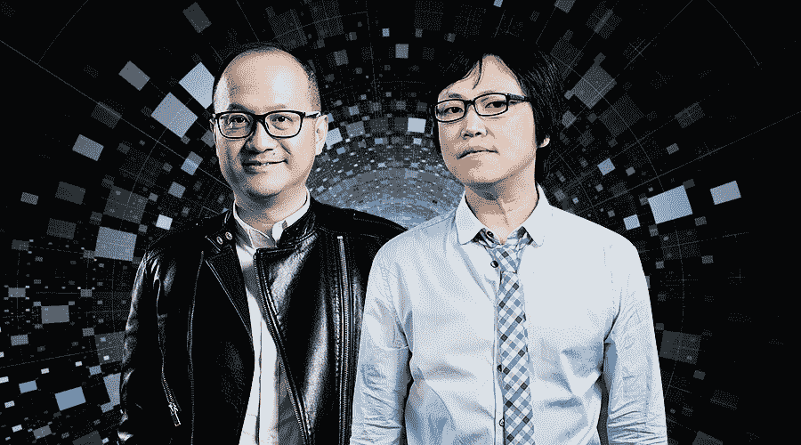
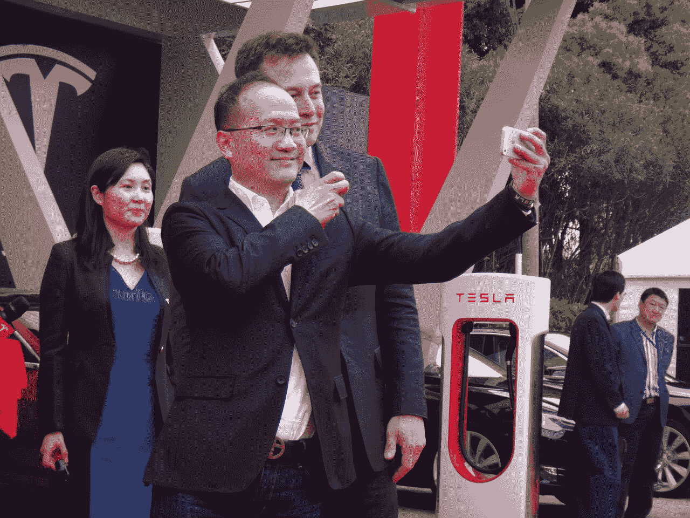
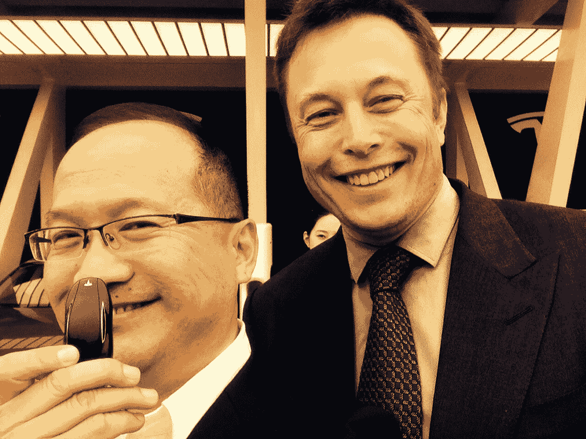
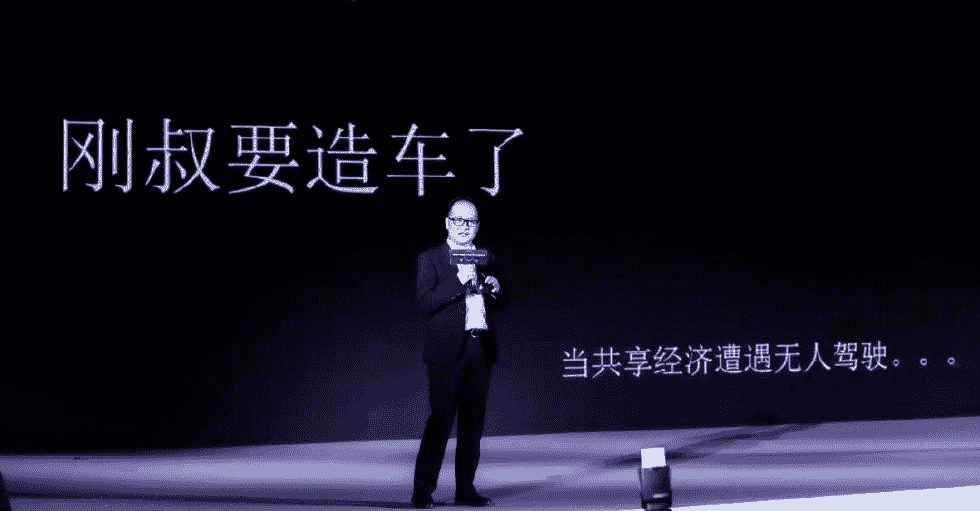

# 王峰十问第 12 期 | 天使投资人郑刚：特斯拉穿越生死无数次，坚定看好电动汽车的未来（附音频）

> 原文：[`news.huoxing24.com/2018040921070199182.html`](https://news.huoxing24.com/2018040921070199182.html)

**对话时间**：4 月 9 日 22 点     

**微信社群**：3 点钟火星财经创始学习群

**对话嘉宾**：

郑刚：紫辉创投创始合伙人，作为著名天使投资人，投资陌陌一战成名，而后他又发掘了锤子科技、映客等诸多项目。最近关键一跃，All in 造车，创办 Neuron（神经元）新动力汽车公司，出任公司董事长兼 CEO。

王峰：火星财经发起人，蓝港互动集团（HK.8267）创始人，极客帮创投合伙人，曾任金山软件高级副总裁。 

**以下为对话原文整理：**

**王峰**：Hi，大家晚上好，欢迎来到“王峰十问”的第十二期。

“王峰十问”做到第十二期了。越来越多的人开始关注我，很多人开玩笑说我抢了财经记者的饭碗，其实这真是一个玩笑。在我看来，以问为名的“王峰十问”绝不仅仅是一个财经采访，而是基于独立观察，可以随心所欲地与对话者发表产经意见的自由表达式。“十问”的关键不是问，而是一种赋予人格化的自由视角，结合历史和想象，因为这样对话一个人，才是活人对话活人。

给大家介绍今天来的嘉宾，紫辉创投的创始人郑刚。

关于郑刚，一开始提到要做他的十问，我在心里是犹豫的。一是之前的十问，大都围绕区块链领域风口浪尖的人物，除了朱啸虎例外。朱之十问，也是因为我个人非常想看看激烈争吵之中的另一面。二是觉得郑刚虽然非常活跃于天使投资，但是目前尚没有成为投资界绝对的一线大佬，站在媒体的私心上，觉得影响力还不够大。 哈哈，郑刚你别生气啊。

但是，我这些想法都是错的。因为真的猛士，早晚要挥戈舞剑，投身疆场。今天的王峰十问，起因于郑刚的纵身一跃。四十多岁的郑刚，要告别职业天使投资，选择自己创业做新能源汽车。说实话，我很佩服这样的人。

下面是问题时间，或者说是对话时间。

**第一问**

**王峰**：一提到你做新能源汽车，立刻让我联想到好几个人的名字，除了埃隆·马斯克以外，还有蔚来汽车的李斌、车和家的李想、小鹏汽车的何小鹏，甚至还有董明珠，以及因为投资电动汽车而丧失乐视帝国的贾跃亭。我想听听，你怎么看这些人，谁的胜算最大？你有想过会不会步贾跃亭后尘，成天处在资金压力下？你如何评价贾氏造车？此外，最近时断时续的消息说，特斯拉可能会在 2018 年底之前耗尽账上所有现金，或许特斯拉的生意没有想象得那么好，很多人在唱衰他的电动汽车。

**郑刚**：我对他们每个人并不了解，其中和李想在特斯拉中国总裁邀请的饭局上见过一面，除此之外并无更多交集，其他人则一个都不认识。我认为这些电动汽车公司的创始人都是敢于抓住时代赋予的机会，勇于第一个吃螃蟹的人。至于谁的胜算大，真的不好说，目前作为一个新进者，也没资格说三道四。

当然说到造车这件事情，资金问题自然是第一要素，其次还有人才、中国特色的生产资质等要素。没有启动资金进不了场，搞不定后轮资金就是死路一条。此外，没有管理和制造人才，这条路也走不通。在目前行业大热的情况下，人才的薪酬呈指数级上升，抢夺人才让原本是夕阳行业的汽车行业技术人才和高管成了香饽饽。新能源汽车作为一个新品类是对传统汽油汽车产业的颠覆，而对人才的热烈渴求反过来又焕发出了行业人才的第二春。

本来不想评论贾跃亭，因为我不认识他，也没任何瓜葛，但我们美国分公司有一部分人来自老贾 FF 的团队，因此有一定侧面的信息。我的理解是，普通大众对他造车有一定的误解，认为是造车害了他，其实不是：老贾是最早进入这个行业的，造车计划早于蔚来、车和家、小鹏等，这方面他是 Visionary，他对新能源汽车的前瞻性理解比任何人都早、深，必须佩服。不管老贾其他方面如何，他造车确实是认真的。

我是 2014 年在洛杉矶期间无意之中获知“来自中国的某土豪在 LA 秘密招兵买马在干电动车”的事情，当时国内大部分人都还不知道。FF91 电动车在新能源汽车行业里有一定的口碑，是一款完全正向开发的纯电动汽车，大、长、靓，只不过老贾倒在了量产的前夜，浪费了近 2 年宝贵的时间。

要是他不去搅手机制造的浑水，要是他对手机制造多存点敬畏之心，要是他能够聚焦在乐视主营业务和提升用户体验等的持续投入（我对互联网电视的理解来自乐视电视，我家里买了 3 台乐视 65 寸电视，北京上海办公室各放了 1 台 70 寸乐视电视），也不至于亏了数百亿，以至于整个生态轰然倒塌，继而影响到新能源汽车的持续投入。

老罗说过，我们当初要是有几十亿的资金在手，可能我们 Smartisan 锤子手机早死了。这几天报纸报道老贾或和他关联的公司在广州的投资，祝愿他/他们能成功。

我是特斯拉产品的坚定信任者，也认为企业家精神是这个年代里创新、创造所需要的最最宝贵的品质和财富。特斯拉目前碰到的问题是阶段性问题，特斯拉从成立至今应该濒临死亡好几次了吧？

从埃隆·马斯克开始接手特斯拉时死了一回，到后来车型设计出来发现成本过高，量产前全部推倒重新设计再死一回，再到撞到狗屎运，几乎免费拿到丰田和通用合资的加州崭新汽车制造厂后，因为不知道如何运营工厂，又死了一回……从上市开始到现在 Model 3 的量产，指标屡次落后预测，一直被预测要死。事实上，这家公司从诞生到现在我们享受着它的 Model S/X 等的同时，特斯拉一直是与死亡联系在一起的。

是的，我认为都是因为它已经是上市公司，上市公司的问题就是财报和运营都必须定期公布。而往往二级市场没有耐心，也有很多傻瓜分析师的各种评论。这也是很多要立志做百年老店的 CEO 们要面对的困境。

我是特斯拉 Model S 在中国的 7 个首批用户之一，也是首批 Model S P85 和 P85D 的用户，虽然或多或少有些小毛病，但是它给予我的驾乘体验和科技感，以及性价比，让我坚定了智能纯电动汽车就是汽车行业未来发展方向的看法，这是不用争辩的。

郑刚与埃隆·马斯克的合影

**第二问**

**王峰**：咱们进一步聊聊资金的问题吧。6 亿元对一般初创公司来说是一个天量融资，但对于汽车来说却可能只是九牛一毛。乐视汽车累计融资已超过 240 亿元；蔚来汽车累计融资 200 亿元；威马汽车也累计融资超过 120 亿；小鹏汽车前三轮融资总额高达 7 亿美元，而且扬言两年内计划再融资 50 亿美元……你们真的是在做同样的事情吗？

**郑刚**：6 个亿当然无法造车，但是紧凑着用，足够我们实现第一年的预期，即建立桥头堡。

桥头堡：初具规模的国内外高端人才的聚集，实现产品定义和 1-2 款可变动的车型设计，量产选址和商务开拓，样车的制造以及品牌的初步建设。

我有一些战术性的策略，但暂时还不成熟。

和外界对我的理解不同，其实我一直是个“穷”惯了的人，我一直认为必须用最少的钱去做最大的事情。

紫辉创投从第一天开始就是个“穷”基金，我并不认为我们募到很多钱，投到很多项目就能够产出更多的好独角兽，我一贯的认为 GP 和 LP 必须是利益共同体，才能获得最大的收益回报，因此我们较少在外面募资，我们赚到的钱也大部分再次投入基金里，与 LP 共同担风险。

所以面对募资，实话说，我经常心里是矛盾的。你想想，自己用血汗和不分昼夜的拼命，最后 80%要别人拿走……我们不愿意分享这些血汗成果，因为那是不对的。目前市面上普遍存在的道德风险就来自于这些分配比例的问题。

作为以前通用汽车和德尔福汽车的高级财务分析师，我以前的工作就是从财务可行性上把控零部件和产品的投资，测算回报率，也因此经常被各个项目总监、产品总监嫉恨，因为我会从物料成本、劳力成本、出货量、运输成本、投资节奏、设备厂房工装投资额，甚至全球通货膨胀指数、资金来源、资金成本等因素去挑战那些花钱不经大脑的工程师或产品经理。

所以，我可能是这些造车势力的创始人中最懂财务分析和最看重投资回报和可行性的创始人。我说的不烧钱是这个意思。这种理解，只有你真正去深入到汽车公司里，和产品经理、工程师、采购、跑过几百页的财务模型，你才知道我在说什么。

我曾经因此得罪过一些位高权重的跨国公司负责人，包括我创业失败后到另外一家精细化工企业负责并购和投资，我始终把财务可行性和回报放在第一位，否决了很多不靠谱的投资行为。我会秉持这个原则来看待我们这个初创企业。

**王峰**：你最近接受媒体采访说，考虑到新能源+无人驾驶汽车远大、漫长的前途，虽然 Neuron（神经元）起步晚，但却与这些先行者处在一个起跑线上，可以透露一下你的杀手锏吗？

**郑刚**：杀手锏不敢说，作为早期投资人，你知道初创企业的竞争策略或者杀手锏往往一开始并不靠谱。我们甚至现在还不能说已经诞生，Neuron 还处于非常早期的阶段，这个时候最重要的是诞生下来，把基础工作做好，然后靠产品、靠管理、靠愿景、靠口碑、靠用户去赢得信任和时间。

当然这并不妨碍 Neuron 有自己的愿景，就是要成为未来人们出行的解决方案提供商。这话说得可能大家觉得有点虚，其实实际得很，我们会采取差异化竞争，牢牢以用户为中心，用算法、用极致的产品和服务赢得用户的信任和使用。因此你问我们是做同样的事情么？我认为有很大的本质的不同，而这也正是我们信心的来源。

**王峰**：你说烧钱是流氓行为，问题是在汽车领域，你要赚钱，不烧大钱，只花小钱，玩得转吗？

**郑刚**：有以上为基础的认识，我认为才配资格去使用大钱。造车要用很多钱，但是是用投资人的钱铺路，还是用敬畏之心、财务严谨、战术战略的正确布局用钱，这同时押上自己的身价性命，这与别人有本质的不同。目前我只看到市场上叫嚣“没 200 亿别来造车”，而实际上你知道那些人已经拉了一裤子屎了。

**第三问**

**王峰**：之前，一直觉得你做天使投资挺好的，可能是因为性格吧，你很容易和人走的近。比如你非常敢于自我表达，亲力亲为创业者产品发声。

前几年看到你在映客上直播，当时我差点笑喷，上面都是 90 后的青春靓丽的小女孩，一堆大叔点赞送花、送车，但是你却选择大叔直播自己引来妹子围观。老罗的锤子手机，我也是投资人，但是实话实说，你参与度明显高过我们很多人，只要有关于老罗的好消息，你都发到我们和老罗一起的锤子投资者群里，即使那是黑老罗的段子你也发，哈哈，有时候我真怕老罗会烦你。总之你那么轻松自如的人，一下子转变身份去创业，我都要适应一下，你自己做好准备了吗？

**郑刚**：老罗估计累瘫了吧……今天我没去现场。

上面叙述我的那些部分观察蛮仔细的，没想到你还看我朋友圈哈哈哈……明显点赞不够……有一次我用了个工具统计看过我朋友圈的人，结果发现只有 1/3、1/4 的人点赞或者评论。

我直播也是因为我真的从直播活动获得很大乐趣，也是通过这个方式认识一些人。这种产品在早期有很多可能性，你必须深入成为其中一份子，才有可能接触到它的本质和潜力在哪里。

很多人默默注意你，但是惜言、惜手指头。可能和创始人一样，作为投资人，你在重大的方向上必须作出正确的判断，一旦作出判断，你就必须和这个判断的成果和后果联系在一起，此外，你既然作出了你的判断，你为什么不能相信它，为他鼓掌呢？其实，我也投了很多项目，到最后我也并没有为之鼓掌，因为我发现他们有问题。

做好准备了吗？做多少准备算“准备好了”？我根据目前行业的发展状况、竞争格局、技术实现的可能性、市场空间、切入时间点、我们自己能够掌握的资源和人才、能调动的合作伙伴等来作出判断。我想与其他造车创业者当初并没有什么不同，虽然时间上不一样。至于这个时间点上是否不再有优势，我也自有判断。

**王峰**：从我过去的经验看，投资者对创业者来说只是旁观者，大部分情况下是拿得起，放得下。换句话说是输得起，但是创始人全心 All in 一件事情，倾其心，用其情，尽其能，旁观者很难理解其中感受，但一旦失败，会非常痛苦。尽管梅开二度、三度的创业者大有人在，但是我真心你说三个字，难！难！难！你确定你将来不会后悔这个决定吗？我的前老板雷军在创办小米科技时，也曾讲过这样自嘲的话，一个 IT 老革命成功多年，再创业如果失败被人笑话。

**郑刚**：我从来就不怕被别人笑话，真的。其实我一直走在被人笑话的路上，从小身材五短，170 不到（我网上有版本是 172），手指头跨度不大，却在钢琴上要和别人一较高低，虽然总是被同龄人比下去，但是我把这个爱好从小一直坚持到现在，发现周围我这个年纪的，还没有看到弹得比我好的（虽然现在功力下降很大）；

我的中学、大学学习成绩一直中不溜秋的，但是一直努力，直到哥伦比亚大学商学院毕业；即使在哥大读书期间，没人愿意与一个英语不好的中国人一起做 Term Paper，导致我只能与懒散的混混学生为 group，最后我一个人单枪匹马负责收集资料、建财务模型、缮写报告一条龙，最后获得班上强手如林的战略 Paper 第一名，真没吹牛。那个印度教授给我的鼓励至今难忘。

回想自己职业生涯，大部分是在动荡过程中度过的，真的也是走了很多弯路，失去过很多机会，付出过很多没有回报的努力和汗水，在人生的低谷品尝过几乎无家可归的境遇。所以，真的没什么。

我的一个特点是永不放弃努力，可以调整方向，但是永不认输。即使失败了，被笑话了，那又怎样？

**第四问**

**王峰**：在我们心里，你是地地道道的锤粉（当然，我也是很支持老罗的）。听说你前前后后，在罗永浩的锤子手机上共投了 2 亿人民币，罗永浩产品和营销都超强，唯独在融资上步履艰难，曾经差一点拿到阿里巴巴的钱，但最终被放了鸽子，害得他一度到处借钱，事后你还跳出来发朋友圈怒怼阿里。你曾经说，自己对罗永浩很有信心，至少要等到锤子科技的估值达到 300 亿人民币的时候才考虑退出。我是在锤子 20 多亿估值的时候，带着几个兄弟投进去几千万的。今天，你在这里，我想问一下，你以什么参照，做出锤子科技至少有一天 300 亿估值这个判断的？很多人想知道，我猜包括老罗自己。

**郑刚**：300 亿对于老罗这个注定要影响一代人精神的企业不算什么。如果说非要量化，你算笔账：老罗只要卖出 5 百万部手机，每部手机利润 500 元，那么纯利就是 25 亿。市盈率 10 倍就是 250 亿。当然这是简单计算，具体还要看产品定位、毛利、增长速度、市场空间、成本趋势、竞争格局、投入成本等等。我认为这个指标并不难达到。锤子科技在设计、交互、用户体验、颜值方面已经建立品牌效应。需要给他更多时间去实现。

别忘了苹果电脑从诞生到真正被用户广泛接受用了几乎 30 年啊！所以有过创业历史观的美元基金建立在这种历史上就会有 30 年、20 年的基金长度。因为它们知道伟大的公司锻造是需要耐心和时间的。

**王峰**：一位你的好朋友私下告诉我，在你投完罗永浩锤子手机 1 亿元的当天，你打了一个三蹦子回家了，这是真的吗？

**郑刚**：去锤科开完会的某天，我确实打了三蹦子回家，北京的交通状况你懂的。这没啥啊，我的交通出行以实用、便捷、高效为主，什么车都能坐。而三蹦子车是让我觉得特别快乐的体验：坐在三蹦子车厢，和司机聊聊天是我觉得蛮有意思的体验。不过最近好像三蹦子绝迹了。

我们作为投资人和创业者要记住，不要脱离社会和关注各行业的人群的思想和需求。社会变化和消费趋势的指向是来自多维度的。所以我很少去昆仑饭店、中国大饭店等等装 X 的地方开会。去那里，你会感觉自己在云端，不接地气。

**第五问**

**王峰**：通常情况来看，一个公司最大的内部矛盾，要么是创始人之间的矛盾，要么就是创始人和投资者的矛盾。我极少看到一家好公司，投资人和创业者一片和气。你在你投资的公司里，是怎样与创业者处关系的？创业者和投资者之间，常常彰显出矛和盾的关系，不过我自己也投资也创业，我常常感慨，创始人和投资者之间应该是彼此互为镜子，你从创业者身上到底学到了什么？

你会选择从失败走出来的创业者吗？

你会投资连环失败者吗？

**郑刚**：没有刻意安排和创业者的关系。我一般是顺其自然，需要帮助，我不遗余力，再晚我都会出现。但是不需要帮忙，我也会躲得远远的。我非常注意创始人的意愿，我不希望自己是个麻烦人物，但是基本有求必应。

不过，这也是有个度的：在天使投资行业里的失败率是如此之高，投资人虽然讲究除了资金之外的资源优势，创业成功与否基本是创始人和创始团队的努力问题。

我从创始人身上也学到了一些产品思维，就是想问题要想透，做产品要考虑好面对的目标用户的喜好，需要有持续性的改进能力。需要极度简单，极度的用户体验。

**王峰**：我听说，你曾经有过一段非常不同寻常的创业时期，据说是赔得是底朝天，有过惨痛的失败，好像你自己也不愿再提及了。日后，你华丽转型，从失败的创业者成为活跃一线的天使投资人，屡战屡胜，佳绩不断。现在，你即将又一次成为创业者，经历从投资人向创业人的转变。你担心自己再一次掉进创业失败的心理阴影吗？

**郑刚**：我投过连续创业者，也投过刚刚创业失败的创始人。不过，目前好像还没有啥好运气。

其实也不是说不愿意提及，首先是谁也不会把自己的失败拿去到处诉说，这些是很私人的东西，但是有可能的话，我建议大家尽量早失败早超生，学费早缴纳比晚交纳好很多。

对失败有担心，但是也有成功的信心。我现在能调动的资源已不是当初作为一个普通的创业者能比的。这次说要造车，很多大咖送来祝福之词。我自问自己为啥趟这么大一混水，我想除了内心一直有的不断挑战自己的创业冲动外，更重要的是，希望给社会创造一个美好的出行产品和体验。

不断挑战自己的能力边界应该是我目前为止人生的一条主线吧，虽然天使投资有一些成就，也能够一直持续下去，但是更大的挑战来自于某个大领域的某个机会的把握。

我早年在美国曾经做过到处敲门卖书的直销人员。开着车，每天奔波 200——300 英里，是英里！持续三个月，晒成黑人。每天面对着不同的客户，每天面对着不确定性，每天面对着拒绝和冷漠。3 个月下来开上万英里……真的不是人干的，不过从此对陌生事物和人不再有恐惧感。

**第六问**

**王峰**：关于矛盾，我又想到，之前我们多次讨论过古典 VC 与区块链投资之间的矛盾。在我看来，即使在古典投资领域里，也存在着以 BAT 为中心的生态投资和以传统一线投资机构为中心的风险投资之间的矛盾，而且给我们的感觉往往是 BAT 获得胜利。

2017 年 8 月，你曾发朋友圈，指责阿里承诺投资锤子却拖延半年后放弃，你还总结称，BAT 对创业公司无法、不可能怜悯和雪中送炭；不到企业发展的成熟期，千万不要让他们投。如今，阿里和腾讯已经实质上成了中国乃至全球最大的投资机构之一，BAT 基本上达到了想看的项目随便看、想投的项目随便投的阶段，从滴滴快的合并、58 赶集合并、美团大众点评合并到携程去哪儿合并，BAT 都起了终极裁判兼主力队员的作用。根据《2017 年度中国互联网“独角兽俱乐部”榜单》，全部 124 家独角兽中，有 50.8%的公司与 BAT 有直接或间接的股权关系；估值超百亿美金的 11 家公司，有 10 家公司都和 BAT 有关。

我的问题是，传统 VC 在 BAT 巨头垄断的情况下，投资人怎样抢到好项目？对于那些坚守“投资伟大公司为使命”的 VC 们而言，到底是选则独善其身，另辟蹊径；还是放下屈尊，去主动抱腾讯爸爸和阿里爸爸的大腿？

**郑刚**：我认为专业化最后还是会胜出。早期的好项目一定还是早期投资机构的天下，虽然我们看到了很多机构在往早期和后期两边扩张，但这是行业混乱的短期现象。我一直认为什么动物吃什么食物，生物链和食物链的形成是有道理的，混吃最后的结果是效率低下，成功率不高。

中国 BAT 巨头垄断是个自然现象，任何投资人和创业者都必须面对，这就提高了创业和投资门槛，也迫使创业公司小步快跑，快速成长。只有自身硬朗，才能摆脱宿命，创业成功。

投资和创业本身也是漫长过程和需要选择正确合作伙伴的过程，谁对自己在成长的能够有帮助，就应该正确地选择谁来合作。作为创始人，快速学习和做正确选择的能力非常重要。

**王峰**：我注意你投资的两大独角兽中，陌陌和映客的下一轮投资者分别是经纬的张颖和金沙江创投的朱啸虎，你和他们两人应该交往不少，你怎么评价两人的投资风格和处事风格？

**郑刚**：这上面叙述的有不正确的地方。两个独角兽投资中，经纬、金沙江和我们都是同一轮进去的，只不过是我们的决策更快，资金到位更早。有一定的先后，我们更坚决而已。

张颖讲究彪悍、狼性，这没啥问题。不过我们也没被他咬过，很少项目一起投资。朱啸虎的投资主要看数据，他不太相信直觉之类的东西，说话言简意赅。他们用成绩证明了自己的市场地位，有值得学习的一面。

**第七问**

**王峰**：你怎么看当下美团和滴滴的新一轮打车大战？王兴曾说，如果美团和滴滴打起来，这不是一场战役，这是“战争”。现在战争已经爆发，在我看来，美团与滴滴的这场相互侵入对方领地的战争，很可能是一场持久战，甚至可能出现战争升级。二战时期，德军快速在欧洲战场获胜，是有古德里安这样在战场上以坦克部队横扫千军的“闪击英雄”，但最终的胜局，很大程度是源于刚刚接任美国总统的杜鲁门给空军飞行员下达了原子弹轰炸命令，完成了直接对日本本土的毁灭性打击，结束了旷日持久的二战。

我们大胆假设，美团和滴滴的打车大战，会不会出现这样的可能，最后拼的可能不是补贴问题，而是逐渐发展成为一场车辆供给之战，甚至升级为争夺车辆制造之战。你最近接受媒体采访，言及要把你的新能源汽车定位于“共享”的“新能源+无人驾驶”，难道你也把滴滴当作了假想敌？

**郑刚**：不存在假想敌的说法，因为我们目前什么都不是，和他们不在一个体量上，无法对比，目前只是一个大家比较关心和好奇的点而已。

不过，我还是要向王兴致敬，我认为他进入这个领域并不是外界认为的去抢夺滴滴的市场，而是一个顺理成章的行为，而且这个行为是基于未来的预期，即用户打车是为了什么？用户打车是为了从一个地方到另外一个地方去做什么，这是美团的优势，现在只不过是用进入打车的领域把这个点对点的需求连接起来而已。

未来会撼动这个格局的是无人驾驶技术车辆的普及，像你所说的“发展成为一场车辆供给之战，甚至升级为争夺车辆制造之战”，至于谁拥有车辆，这是个悬而未决的问题，导致未来变数横生，但这是美团和滴滴不得不面对的问题。目前他们这场战争，大家更多的只是旁观者，而消费者会获取实实在在的好处，这就是竞争的美妙之处。

**第八问**

**王峰**：据 IT 桔子数据，今年第一季度国内 VC 项目中，41%为区块链项目，主要业务包括媒体（12 家）和虚拟货币（37.3%）两大方向。我听说，今年初你曾在自己投资的项目 CEO 群里，号召大家抓紧时间研究项目与区块链结合的可能。但从实际来看，你并没有大举进入区块链行业，这是什么原因？你是怎么看待区块链机会和风险的？如果没有造车这件事，你会对区块链投资投入重金吗？你曾在我们火星财经群里询问大家，区块链会与自动驾驶有什么结合？现在想来，你当初必早预判，你有答案了吗？

**郑刚**：问题很好。很大的原因应该是一些所谓的传统理性思考导致没有大举进入。我在去年 8 月中旬的时候注意到了 ICO 引发的关注区块链的投资机会。也曾经在微信上声称要“两个月完成两年的知识积累”类似的说法。

深入下去的时候，发现自己无法探到技术理解的底层，虽然我们投资移动互联网也不需要直接懂得 App 怎么开发，啥前端、后端、云服务器、技术架构什么的，但是我可以立竿见影地见到产品本身和接触到产品的交互，可以立即成为用户，进而判断是否是个有意思的东西。

但是区块链技术为底层的应用目前除了比特币和以太坊或者代币，尚未看到实实在在的产品和应用，这是一个很大的阻力。虽然不必向 LP 汇报投资的项目逻辑，但是过不了心里的坎。

其次，作为机构参与，我们从基金角度只能以投资形式获得公司股权，获得代币这件事情，机构无法参与，必须用个人名义，这也是很大阻碍。进而理解到 ICO 实际上不是 IPO，ICO 也无法监管、无法追索等等原因。其实我也不保守，我反而认为 ICO 如果让靠谱的公司靠谱的创业者去获得，那么是存在成功的可能性的，对股权融资是个颠覆。

实际上我们也投资了 3 个我还算能理解的区块链项目，投资金额都不大，也不发代币。当然错过了类似币安和波场这样的不管你认为是不是机会的机会。只是作为投资人和创业者一样，你如果没有在这个行业里有积累和深入，你是无法把握这样的机会。

数字货币基金可以理解，不过怎么设立法律架构，怎么监管……这些估计没有答案。

区块链和无人驾驶汽车有什么结合？我正在寻找，目前看来在防止黑客入侵和控制、个人隐私保护、取证方面是可以有作为的。我们已经找到一些合作伙伴开展这个工作了。

**第九问**

**王峰**：我觉得你对社交产品比较上心，不仅因为你投了陌陌和映客，而是我感觉你算是社交产品的重度用户。我看你玩过很多社交产品，在映客上，你也一度是活跃的网红主播，有 24.3 万粉丝，还曾经豪掷 170 万人民币给网友打赏。

你肯定注意到了，区块链正在试图重塑社交产品。我一直认为，区块链和社区是天然一体的。据《香港经济日报》2 月 12 日消息，拥有上亿活跃用户、有“俄罗斯微信”之称的电报（Telegram）完成首轮 ICO，发行规模达 8.5 亿美元，创下新的融资纪录。你看好电报的发展么？你会沿着你擅长的社交产品方向上布局区块链项目吗？你认为，区块链能给社交产品带来什么改变和创新？

**郑刚**：去年 8 月份恶补区块链知识的时候，我就想到了区块链可能给社交产品带来巨大的潜在改变，这可能让人兴奋。大家也知道了区块链技术应用在社交上的是否真的可以去中心化，分布式节点存储个人信息，防止黑客入侵，和防止虚假个人信息以及新闻上的报道。我目前不是 Telegram 的用户，但是好的技术必须配以好的产品设计和用户体验，否则再好的技术也撑不起来一个产品王国。

过去的互联网带给我们的教训是：能够左右乾坤的产品一般不是在技术浪潮的第一波出现的。你想想当初互联网时代的那些社区产品、聊天工具，现在哪一个还存在？从 Yahoo 到 MSN（除了 QQ 以外，但微信几乎就取代了它），从美国的 GeoCity 到天涯社区，从街旁到各种博客。所以我虽然还没用 Telegram，但是我判断这只是一个我们学习和体验的过渡性产品，真正的大家伙还没出来，需要耐心。

**第十问**

**王峰**：这几天，摩拜单车被美团收购的消息处处刷屏。据说是摩拜创始人胡玮炜已套现 2 亿美元，折合约 15 亿人民币。随后一篇《摩拜创始人套现 15 亿背后，你的同龄人，正在抛弃你》火爆朋友圈。日渐低调的韩寒用长微博表达了自己的看法，他认为，这种文章论调不仅仅是在贩卖焦虑，而是在制造恐慌，成功的定义绝不只是套现几亿、十几亿。如果看了那篇文章，心潮澎湃地抛弃其他同龄人，以这样的定力和心智去开公司，估计也只能春夏秋冬地为欲望折磨，被房东割韭菜。作为一路风雨又重新上路的大哥级人物，你给年轻人什么建议？你的成功标准是什么？

**郑刚**：我的成长经历一直不是大家想象的那样和我自己期望的那样一帆风顺，这也给我机会去历练和思考。人生几乎要过半，回想起来，真的认为跌宕起伏的人生还是更精彩些，虽然这有点自证和马后炮的意思，但是我一直认为做事要踏实，做人要正直，君子爱财取之有道，与人为善是做人的基本原则，这些做到了，人生就成功一半了，我认为我也只是在这条路上不断修正自己的方向，不见得我就做得多好，我也经常半路翻车或者迷路，但是你得有这个观念作为你人生的航标灯。

在此基础上，尽早在自己人生的青年时期养成独立思考的习惯，多动手去做自己喜欢的事情，多考虑怎样奉献自己的价值，而不是动不动就把自己的利益放在至高点去衡量一切。这些也做到了，我认为成功会以它相应的方式在你身上迟早体现出来，不要着急。

此外，借此文章，我在微信朋友圈也趁机发表了一些看法，在这里复制粘贴一下：“大家都在转发，我转发的目的不一样，不意味着全部同意此文观点，而是借此让大家思考：前几天徐老师在创客峰会上呼吁在创业和投资的时候思考下社会责任，有社会责任的企业能走得更远！烧钱烧死对方；同台竞技一定要搞死对方；竞争企业之间没有底线的互黑；监管缺位情况下对市场无底线的探底：没有最 Low，只有更 Low；对消费者信息不对称不利地位的无底线利用和盘剥……这些，最后都会打回来，可能也让你一夜之间啥狗屁都没了……我一直认为竞争不能没底线，做人不能仅仅凭块头大小，商业模式需要考虑和你没有直接相关的社会后果，否则要么你最后亏得底裤不剩，或者赚取的是被人诟病的黑钱，赚了钱，没了人……世风如此，你怎么选择？”

我知道作为投资人和创业者在成功的早期去推崇这种观点，很多人对此会有保留意见，但是我认为你如果没有这个观念，最后还是会归零。

**王峰**：今天的十问很欢乐，谢谢各位参与，我知道，大家是喜欢刚叔，不是因为我。

新能源汽车，被看作是中国在汽车行业弯道超车的节点。你说过，热情可以让自己做的事情更有趣。衷心希望你的共享新能源“造车梦”能够早日顺利实现！

谢谢郑刚兄弟，感谢你今天能来到三点钟火星财经创始学习群。

本文为火星财经原创稿件，版权归火星财经所有，未经授权不得转载，转载须在文章标题后注明“文章来源：火星财经”，若违规转载，火星财经有权追究法律责任。