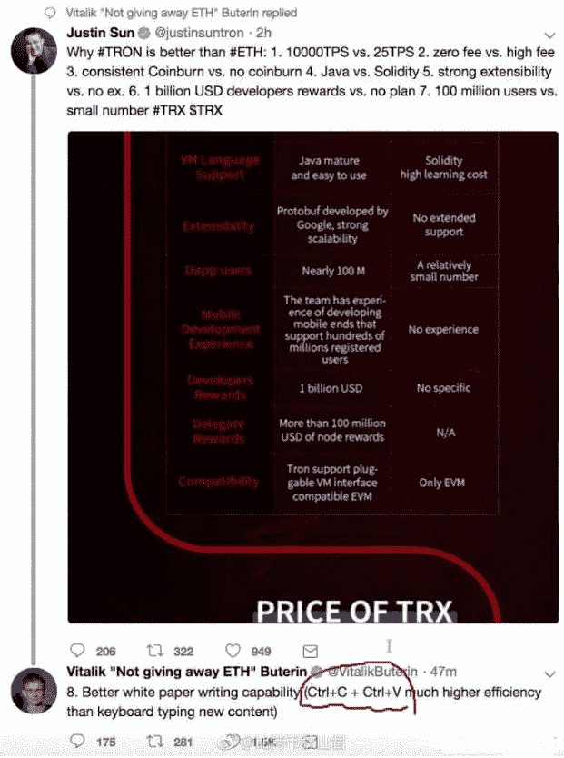
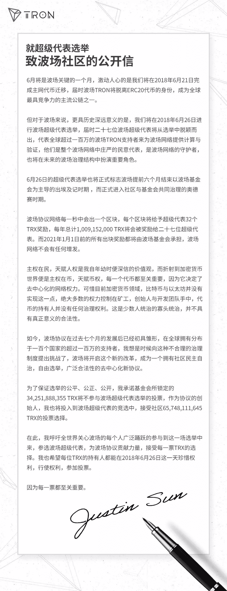
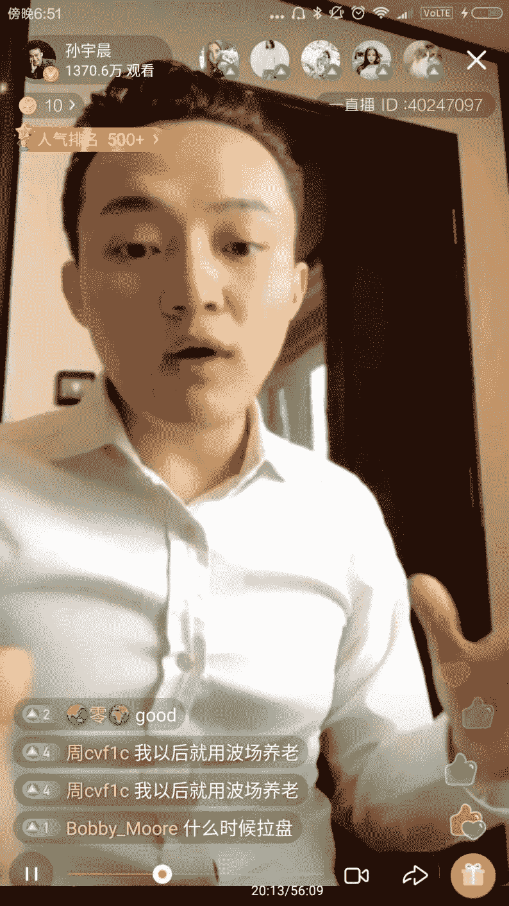
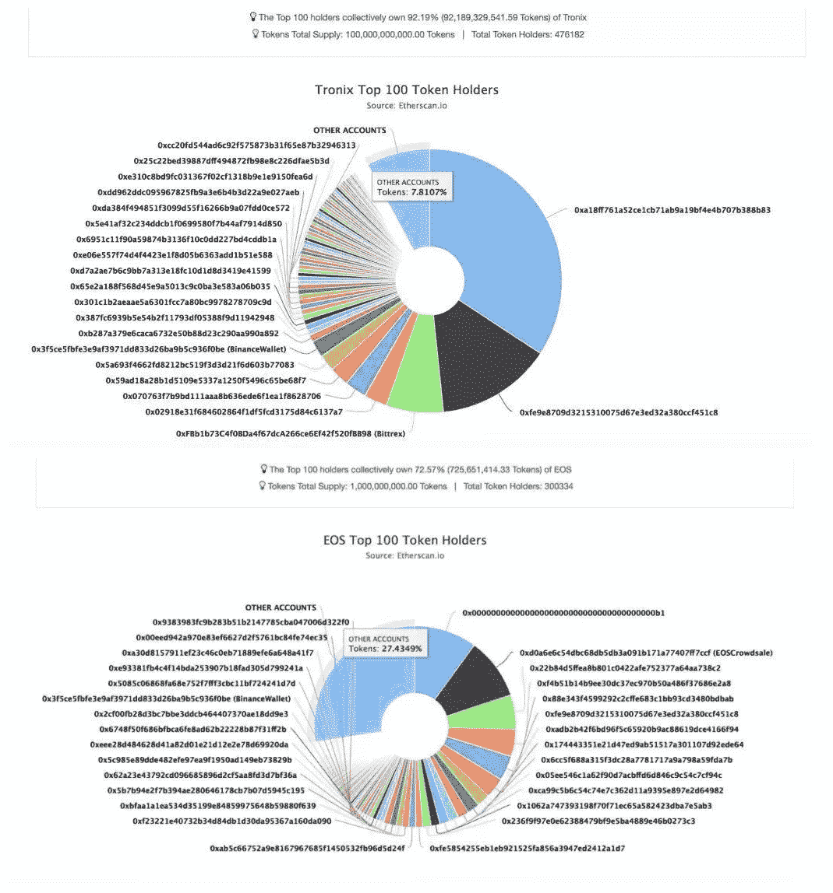
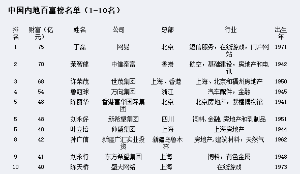
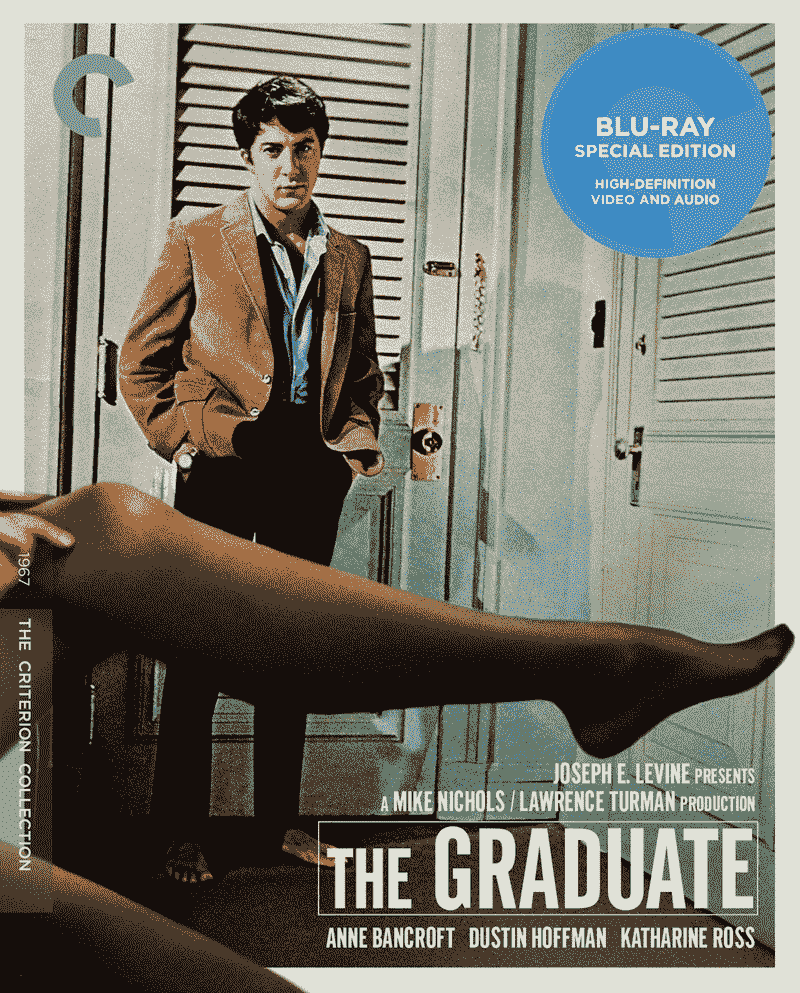
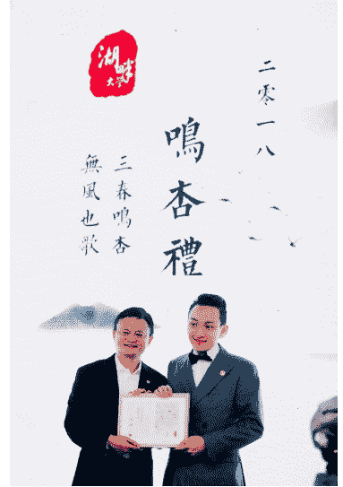

# 王峰十问第 13 期 | 波场 TRON 创始人孙宇晨：宁可背负骂名把事情做成，也不做悲剧英雄（附音频）

> 原文：[`news.huoxing24.com/2018042519304176847.html`](https://news.huoxing24.com/2018042519304176847.html)

**** 

**对话时间**：4 月 25 日 21 点 30 分  

**微信社群**：3 点钟火星财经创始学习群

**对话嘉宾**：

孙宇晨：波场 TRON 创始人，移动社交应用陪我 APP 创始人兼 CEO，锐波创始人兼 CEO，《财富自由革命之路》发起人。世界经济论坛（达沃斯论坛）全球杰出青年，被评为福布斯 2015 年中国 30 位 30 岁以下创业者；中国 90 后创业者的代表人物之一。

王峰：火星财经发起人，蓝港互动集团（HK.8267）创始人，极客帮创投合伙人，曾任金山软件高级副总裁。

**以下为对话原文整理**：

**第一问**

**王峰**：很多名人都被媒体记者威逼利诱做过普鲁斯特问卷。我科普一下，普鲁斯特问卷（Proust Questionnaire）是包含被提问者的生活、思想、价值观及人生经验等的一系列问题，问卷因法国作家普鲁斯特的经典回答而被命名。我打算从中选两个问题问宇晨：“你最满意身体的哪一个部位？”“你自己的哪个特点让你最觉得痛恨？”这两个问题，其实是问你最自豪和你最不满意的地方是什么？我读过一些社会心理学书籍，一些观点上看，人往往因为满意而产生自豪感，比如明星靠精致的面庞。比如成绩不好、体育不好的孩子往往不合群而童年产生自卑影响一生。在你从小到大的成长过程中，这些满意和不满意，给你带来了什么？你有过刻骨铭心的创伤吗？我之所以这样问你，是觉得你比同龄人走得顺很多，你今年才 28 岁不到，却赶上了区块链头班星际列车，很多人一辈子赚的钱也远远不如你，很多人羡慕你。还是社会心理学的观点，公众都有偷窥癖，今天，我们都是公众，哈哈。

**孙宇晨**：我觉得第一个问题，你最不满意的地方分别是什么，这个问题是一个问题的两面，我原来创业的时候，写过一句话，我觉得挺表达我自己的想法的，当然，我那时候把自己创业不够成功的原因归结于时代。比方说王兴，80 后可以有很多机会，他先抄 Facebook，做不成功，可以抄推特，推特做不成功，可以再去抄 Groupon 做美团，他人生中上帝反复给他失败的机会，而到我创业的时候基本上移动互联网所有的窗口全部关闭了，所以那个时候我也自怨自艾，我也很自大地说，如果给我一个好的机会，我也能做 100 亿美金的公司。

所以我当时可能很长一段时间最不满意的，某种程度上是自己身处的时代。但是现在我觉得当前区块链成了 90 后弯道超车的一个非常重要的领域，所以某种程度上，我现在最自豪的也是身处这个时代。

**王峰**：不断换战场，就是不断试错，不断 Debug。

**王峰**：据说，你从小便信奉的行事原则就是“一定要当第一” ，而且你也确确实实做到了：你拿过第九届新概念作文大赛的第一；以北京大学历史学系年级第一的成绩毕业；你是马云创办的湖畔大学第一位 90 后学员；你创办的波场是 Twitter 第一大区块链社群……你曾经说“这是一个按了加速键的时代，我绝不能被甩在后面。”不被甩在后面、拿第一，对你意味着什么？如果在一个领域做不到第一，你会怎么办？继续拼，还是选择换个赛道？

**孙宇晨**：首先，我要澄清一下，其实网上很多说法都是不准确的，就像我们经常看到网上调侃说鲁迅说了什么，然后鲁迅：“我没说过”。这个话确实是我人生很重要的一个原则，我觉得如果在一个领域做不到第一，尤其是这种差异化的第一的话，某种程度上确确实实是没有存在的必要，不光是这个公司，或者是你做的产品，包括你存在的价值就非常低了。所以这就是为什么我经常讲战略非常重要，人还是要选一个自己擅长的，自己喜欢的，如果是创业的话，那就是赛道了。

**王峰**：你眼中的世界，似乎除了成功，就是失败，没有中间地带。你要求自己保持 7×24 小时全天候的工作状态，这个高强度的工作状态，你自己是享受其中？还是因为焦虑而不得已为之？

**孙宇晨**：如果说是人生的话，那可能就是你自己喜欢的一个领域。我觉得人生最痛苦的那就莫过于你自己非常喜欢做一个领域，但确实在这个领域就是做得不成功，或者还有一种情况，你根本不知道自己喜欢做什么，找不到自己的位置。从某种程度上来说，我这个阶段基本上延续到人生的 22 岁创业之后，这个问题才基本得到解决了，我终于算是找到了我自己愿意去做擅长去做的一件事情。

**王峰**：嗯，宇晨，我想起毕淑敏在《在不安的世界里，给自己安全感》书里曾经写道：世界的不安宁是个常态，如何在这个不安的世界里，寻找属于自己的安全感，是每个人人生的必修课。你的安全感来自哪里？成绩？财富？名气？荣誉？

**孙宇晨**：我个人觉得高强度的工作状态，也不是说我享受其中，我觉得它是一个必要的创业生活的要求，或者也是一种自然而然发生的事情，所以谈不上是享受其中，还是不得已而为之，用一个很简单的话地讲，这么多年就这么过来了，也谈不上刻意的多么努力、多么用功，其实并没有刻意地去做。我们刻意 24 小时工作，是并不客观的，从某种程度上只是一种自然而然选择的结果。但现阶段可能确实忙一些，也很正常，因为创业绝大多数都还处于草创的阶段，要比成熟的平台耗费更多的精力，这也是可以理解的。

**王峰**：秀场和战场，一定意义上没有区别。

**孙宇晨**：我觉得从这个程度上来说，秀场肯定比战场的意义更大，因为我觉得某种程度上如果你要从人生中大的层面去讲，其实没有必要去在乎宏观层面人生的输赢，因为其实每个人都有自己独一无二的一面，我倒是不建议是战场，每个人都要去战胜对方，所以从这个角度确实是秀场，就是你能把自己淋漓尽致展现出来就足够了。我个人感觉这个世界的不安宁是个常态，它的本质的意思其实就是这个世界的变化是一个常态，我觉得我们的安全感还是来自于长期处于拥抱变化的状态，这个世界唯一不变的肯定就是变，所以你必须某种程度上时刻去拥抱这个世界的变化。

所以从某种程度上来讲呢，这个甚至也是我创业这么多年最大的体会，就是刚才讲的成绩、财富、名气、荣誉其实某种程度上都是过眼云烟，而且这些东西我们统称为别人或者世界给你的承认或者一种认可，但这种认可都是有保质期的，所以即便一个明星表现非常好了，但是可能有几年稍微缺乏一些作为，就会说他过气，原因很简单，就是因为这个时代别人给你的认可永远是有保质期的，所以这就需要你不停地去拥抱这个时代，某种程度上用英文讲就是要有 deliver。

**第二问**

**王峰**：4 月 6 日，你发推特炮轰以太坊，做足了影响力。你列出了 7 条波场币优于以太坊的理由：

*   1\. 波场 10000TPS VS 以太坊 25 的 TPS；
*   2\. 波场零手续费 VS 以太坊的高手续费；
*   3\. 波场一致的 Coinburn VS 以太坊的无 Coinburn；
*   4\. 波场的 Java 语言 VS 以太坊的 Solidity 语言；
*   5\. 波场强大的可扩展性 VS 以太坊的无可扩展性；
*   6\. 波场 10 亿美元开发商奖励 VS 以太坊没有计划；
*   7\. 波场 1 亿用户 VS 以太坊的少数用户。

Vitalik 立刻回怼：应该加上第 8 条理由，“更强的白皮书书写能力（Ctrl+C 和 Ctrl+V 比键盘键入新内容有更高的效率）”，讽刺波场白皮书存在抄袭行为。4 月 18 日，V 神在接受媒体采访时，又怼了波场，称波场“没有灵魂”，波场随即公布了针对以太坊用户的 3000 万 TRX 空投计划。说实话，看见 V 神在推特上回怼你的时候，是不是很开心？为什么选择波场与以太坊，而不是 EOS 或其他的数字货币做对比？在绝大多数人看来，这个热度蹭的不错，是你对 V 神的心态有过揣摩？

**孙宇晨**：首先，先回答为什么选择以太坊作比较？原因也很简单，我们波场长期在以太坊上面做开发，所以我们对于以太坊这个平台无法满足开发者和绝大多数 DApp 的需要，是有一个切身的体会的。所以我们刚才前面列出了 7 条我们比以太坊好的地方，也确实是我们基于我们自己一线的实践，得出的一些非常接地气的看法，这也是我们为什么选择以太坊进行比较的一个重要的原因。

其实热度蹭得好不好，我们也没有揣摩，我发推特的时候也没有艾特 V 神，也没有解释，他也愿意和我们一起主动讨论，增加话题性，我们也表示欢迎的。当初我们当然没有期望他会来回应，或者怎么样。

**王峰**：追问，你在之前回应“波场优于以太坊”中提到：“商业社会中，老问抄袭这个事情，没有任何意义”。客观看，中国的互联网行业其实就是个抄袭行业，美国搞个 eBay、我们就有阿里巴巴；美国搞个谷歌，我们就有百度；美国搞个 ICQ，我们就有 OICQ……几乎中国的互联网全是复制美国硅谷的中国版。你认为，商业社会的抄袭，会不会让人们丧失创造力，丧失创新的勇气？如果有一天你发现有项目抄袭了波场，你会怎么处理？

**孙宇晨**：我认为商业社会本质上比的还是执行力和是否能真正把一件事情 deliver 出来。做出来，我觉得才是最重要的，某种程度上来说，争论这个想法本身是谁的，其实是没有意义的。比方说微博这个事，推特做出来之后，王兴可以做，新浪可以做，腾讯也可以做，最终还是看大家的执行力，谁把这个东西 deliver 出来，用户去选择谁。所以我个人觉得商业社会本质的成功是用户选择的结果，而在我们区块链领域，一个公链，一个事情做得够不够好，本质上说就是 DApp 的开发者与全球用户共同选择的结果，这某种程度上依赖于区块链技术的开发，TPS，包括它的治理结构，包括它的对 DApp 开发者的服务能不能做到位，这些事情是商业竞争能否成功的关键。

如果有一天有项目抄袭波场了，这怎么处理？其实我们波场现在很多的想法已经被行业抄袭了，举一个简单的例子，我们锁仓到 2020 年，是行业里面非常早开始锁的，我们去年锁了之后有无数的项目方式模仿我们这种事情，某种程度上我们能够被行业抄袭，意味着我们做得还不错，对行业有一定的贡献。其次，我觉得如果我们发现对手抄了，还是要把执行力提上去，要把这件事情做好。某种程度上腾讯做产品的功夫很强，哪个团队如果发现腾讯抄了他们的产品，至少自己做的方向是对的，腾讯他们用自己的行动认可你。其次是一个很危险的信号，这个赛道有非常多的竞争对手，你要足够能力才能做好。

**第三问**

**王峰**：我们直接谈谈当下热点吧，EOS 的全球 21 个主节点之争，正在如火如荼地举行，薛蛮子、李笑来、老猫、易理华、暴走恭亲王等业界最活跃的投资人，以及诸多引力波等多家 EOS 社区都纷纷加入 EOS 超级节点之争。目前，参与超级节点竞选的团队已经多达 55 家。

无独有偶，3 月 31 日，你的波场 TRON 公链测试网络上线不到 9 天时间，已经拥有了 2739 个节点，目前除了南极洲，波场 TRON 的节点已经遍及全世界。4 月 12 日，你发表了《就超级代表选举致波场 TRON 社区的公开信》，宣布 2018 年 6 月 26 日进行首次 27 名超级代表选举，建立广泛选举的自治社区。

你的市场把握时机很好，我预感有了 EOS 的市场教育，你的超级代表的竞选也一定很被关注。为什么 TRON 的超级代表和 EOS 超级节点的选举时间那么接近？是巧合还是有意为之？是否有蹭流量之意图？（我看得出，你的市场嗅觉很好。）进一步说，TRON 和 EOS 相比，有什么创新和优势？说重点就好。

**孙宇晨**：首先，TRON 的超级代表和波场的超级节点也是自然而然发生的结果，也不是看 EOS 火了来做超级代表，如果有这样的印象的话，其实对波场还是不熟悉。我们很早就公布了我们的路线图及我们的 TPOS 机制本身就是要选举超级代表，这个相当于 EOS 和我们采取了同一个治理机制，而且大家开发速度还是蛮快的，尤其是我们自己开发速度还是蛮快的，EOS 比我们早两个月启动，大家代表选举的时间差不多或者较为接近，主要的原因还是因为我们蛮用功，开发的速度比较快导致的，所以我觉得应该不算有蹭流量的结果，也是自然而然发生的结果。

TRON 和 EOS 相比不敢说有什么创新和优势，但是我可以谈谈我们自己的重点，希望大家予以关注。我们波场超级代表是 27 人，显然比 EOS 的 21 个超级节点更容易当选，目前波场超级代表报名机构已经有二十家，正处于火热报名阶段，希望大家多参与，而且我们不排斥大家参加 EOS 之后再参加我们的超级代表，高考也可以填了第一志愿，再填个第二志愿。我们所有超级代表奖励每年高达 10 亿 TRX。

我们现在有一个非常大的支持是对 TRON 上面 DApp 开发者以及 TRON 整个大的项目，PROJECT GENESIS，这个项目我们投入了 20 亿美金支持这个项目，所以希望大家关注这个项目，参加这个项目的编程大赛，Bug Bounty, TRON LOAN，这些子项目，来波场上开发 DAPP，领取总计 20 亿美金的开发者奖励资金，来一起建立一个好的波场社区。与 EOS 不同，我们现在波场的测试网络也已经发布了，可以参加模拟投票。所以大家可以去领取免费测试的 TRX 在波场网络中进行投票，也关心大家关注我们的 Github，来领取免费的测试 TRX，来当波场的节点，同时也可以当选波场的代表。

现在 POS 还处于一个很早期的发展阶段，我们希望能与 EOS 一起建设 POS 社区，我个人认为 2018 是 POS 的大年，会出现不少好的 POS 公链项目，对比特币以太坊的 POW 构成新的补充，我在这里也真心邀请 EOS 的竞选者可以考虑一起来竞选波场超级代表！

**第四问**

**王峰**：有人说你是“直播市值管理”的开创者，去年 8 月份，Tron 第一次登陆币安，5 亿波场币（Tron 的电子 TRX）53 秒内被抢购一空。之前你就做了大量直播和线下活动，并组建了几百个微信群，你是看如何“直播”这件事的？郭宏才（宝二爷）说，区块链本质是流量的生意，我是否可以理解为你“创业网红”的身份非常契合这一点？

**孙宇晨**： 第四问我觉得蛮多问题其实可以放在一起答的，包括我们怎么看待直播这件事情，包括区块链是不是流量生意，包括我们是不是有这种独家的秘笈传授给大家，我觉得可以放在一起答。为什么要放在一起答？区块链本质是一个 DAO，英文叫做 Decentralized autonomous organization，翻译成中文叫做去中心化自治组织，而在一个去中心化自治组织早期的阶段，创始人与社区的联系与互动，确实是一个社区中最重要的一个治理结构。其实做公司并不需要，但是做 DAO，做社区，这是必须的一个选择。所以我个人觉得如果说我们有什么秘笈可以赢得海外社区这件事上，我觉得最重要的还是要用心去拥抱整个社区，用心去与社区的每一个人交流，我觉得这点确实是最关键的。

**王峰**：此外，我发现你也玩转了社交软件，你在 Twitter 上的粉丝有 40 多万，波场基金会的 Twitter 粉丝也有近 30 万，每条留言的评论都数百条，加上你 Facebook 粉丝也有近 30 万，我感觉这些数据在全球范围内的区块链项目在社交平台上的活跃度也能进入 TOP3 之列。而且，波场还建立了韩国、日本、俄罗斯、西班牙、阿拉伯等小语种的国家社区。目前你在 Twitter 和海外社交媒体上的不俗表现，是怎么做到的？据说波场的海外粉丝 90%都是老外，你到底怎么把波场和孙宇晨的品牌传递给他们的？在赢得海外社区这件事上，你愿意在这里给你的同行们传授点独独家秘笈吗？

**孙宇晨**：我觉得互动的真实性还是很重要的，很多创始人觉得直接通过公告或者他人的方式与社区去沟通，效果其实真的是不好，最好还是创始人要亲自去用心沟通。真实的去沟通，这个方面很多项目方需要提升，尤其是今年新出现的很多项目方，连负责人是谁都看不到，躲在后面，唯恐别人知道，社区一片迷茫，更不要说真实有效的去和社区沟通了。

**第五问**

**王峰**：目前，EOS 和 TRX 的 Token 都还没迁移到主网，还在以太坊的地址中。有媒体对以太坊的情况进行了统计分析，发现：TRX 一共拥有约 47 万的地址，只有 7.8%的比例属于散户持币；EOS 中一共拥有约 30 万地址，而有 27.4%属于散户持币。在 TRX 钱包余额排行榜中，排名第一的是波场基金会，约 34%，目前已被锁仓无法进行二级市场进行交易，占据第二名、第三名的地址，一共持有了近 20%的代币，可以说，筹码非常集中。

我的问题是，究竟是两个怎样的大户，持仓能逼近基金会？TRX 到底是谁的 TRX？TRX 是不是已经被高度控盘？

**波场和 EOS 持币地址数量和前 10 钱包持币分布的对比** 

**孙宇晨**：首先，这个问题确实是一个我觉得非币圈人很容易产生误解的问题，之前不光包括我们 TRX，比特币也被这样的误解过，比如说比特币的筹码也被认为是非常集中，其实这都是交易所账号。

排名第一１４万比特币的账户是 Bitfinex 的账户，后面的大额账户也都是各个交易所的。关于 TRX，其实这个问题很简单，这两个大户是 Binance 和 Bittrex，大家可以看到这两个交易所本来也是在我们整个交易量中占得非常大的主流交易所，下面的其他大户账号，分别是 upbit 和 Bithumb、火币、OKEx 的冷热钱包账户。

所以某种角度来说呢，其实交易所的持币越多越反映这个币越分散，就像我们经常说中国人的钱包里已经没钱了，钱全在工商银行、建设银行、招商银行，支付宝里面，工商银行和建设银行的钱也不是他自己的钱，本质上是储户的钱，Binance 和 Bittrex 的钱并不是他自己的钱，而是用户的钱，是一个道理。

**第六问**

**王峰**：刚才你也提到，波场 TRON 官网正式发布 20 亿美金社区奖励计划 PROJECT GENESIS（简称 TronPG），TronPG 包括 Github 奖励计划（首期 100 个 10 万美金支持项目）、BUG-BOUNTY、波场创业者基金等。火币最近也推出了以平台通证 HT 为流通介质的规模 2 亿美元的全球生态基金；OKEx 上周也正式公布了生态建设路线图，即将推出全球合伙人计划，在未来推出全球数字资产开放计划。而腾讯最近 5 年一直也在力推开放计划，根据腾讯 COO 任宇昕公布的腾讯开放五年成果：累计成就 30 家上市公司，注册创业者超过 600 万，实现合作伙伴总收益达 160 亿元。

在我看来，去中心化的区块链项目的生态建设，对于中心化的腾讯等传统互联网巨头来说，完全是一种新秩序的建立。你怎样看待区块链世界的开放和腾讯开放平台所推动的开放之间的区别？互联网的诞生，是始于去中间层的，但是今天的互联网巨头革命掉了传统中间层，自己变成的绝对一家独大的中心，今天要讲互联网繁荣，估计很多人心头都是痛，小公司度日如年的日子你当初应该感受强烈。

**孙宇晨**：区块链世界的开放和腾讯开放平台所推动的开放还是有很大的区别，毕竟腾讯开放平台所推动的开放是建立在古典互联网思维上的开放路线。本质上说区块链开放是一个 DAO 性质的开放，也就是某种程度上来说，如果区块链世界开放战略成功的话，绝大多数我们人生中能够接触到的各种基础设施服务都会变成 DAO 来控制，就像我们今天的比特币就是一个典型的 DAO，就要它没有任何组织、任何个人可以对这个基础设施进行完全意义上的控制，它是一个完全去中心化的一个局面，一个去中心化的结构。

而腾讯的开放平台并不是这样的，它是始终以腾讯为中心的开放平台，在这个开放平台中，所有的数据、所有核心的资源始终是握在腾讯手中的。但是区块链世界的开放战略肯定不是这样的，它的数据是属于用户的，它所有的核心资源都去中心化来摆放的。

王峰讲的是非常对的，就是中心化的互联网对整个人类的影响非常大，而且我个人觉得随着这几年的发展负面效应越来越明显，且不说前段时间或遍全球的 Facebook 听证会，让我们明白了其实 Facebook 可以通过非常小的广告上的一些变化，甚至可以去影响美国总统当选。

因为很简单，他只需要用非常少的数据去影响中间人，中间选民的看法，就基本可以左右美国的大选，更不用说巨头垄断了数据和流量，对其他互联网的公司尤其是小公司的挤压是非常厉害的，所以我觉得现在也到了变革互联网结构的时候，这也是为什么波场始终的愿景、价值观，英文叫 decentralize the Web，用中文讲就是要互联网重新去中心化。

**第七问**

**王峰**：分析 BAT 的发展史，实现他们走过百亿美金市值绝非易事。腾讯，1998 年 11 月 11 日成立，2007 年市值达到 100 亿美元，耗时 9 年；阿里巴巴，1999 年成立，2009 年市值达到 100 亿美元，耗时 10 年；百度，2000 年成立，2009 年市值达到 100 亿美元，耗时 9 年。今年 1 月 5 日，波场的市值达到历史最高值 130 亿美金，但距离去年 7 月创立波场，才过了半年时间。还记得 1 月 5 日那一天你得知这个消息时，心里一颤的东西是什么吗？大部分互联网公司在市值曾经突破 100 亿美金

时，主流媒体都给予了充分报道，但实现 130 亿美金市值的波场却被大部分人所不了解，为什么？

**孙宇晨**：其实我要先更正一下，其实 1 月 5 日波场最高市值 130 亿美金应该是流通市值，我们真实市值可能达到过 250 亿美金，如果真的按全部市值来说的话，其实达到过 250 亿美金，要比 130 亿美金还要更高一些。

实际 1 月 5 日那天其实就是在公司干活儿，我这个人很少去查价格，因为公司基金会的币也是锁仓的，和我自己没太大的关系，所以我很少查价格，是同事告诉我的，而且大家也知道没撑多久，也没必要谈。其实和我感觉并没有多大，我个人感觉市值多大和我个人关系并不大，我觉得一个团队要 deliver 出一个内容才有真实的价格，所以我和团队还是着重于去 deliver 真实的价值，而非关心价格。

我觉得现在主流媒体报道并不多的原因也很简单，因为我们也做事情去中心化互联网这一个愿景和使命价值观，现在还是一个非常小众的价值观，绝大多数的媒体还在关心古典互联网的今天、明天和未来，大家并不关心去中心化的互联网。但是我相信随着时间的推移，会有越来越多的媒体关注去中心化的互联网的发展。当然，我觉得今天的王峰十问其实就是一个开始。

实际上经常直播的时候大家看到的是一个人加半个助理，甚至是我自己一个人，但背后确实离不开波场团队与社区支持者的努力，现在波场全球有超过一百人的研发运营团队，超过一百万的支持者，每天 24*7 的工作与努力。我只是有幸出现在镜头前记录了这一切，而波场今天的成绩，更多的归功于他们的努力。

**王峰**：你在开始做波场时，是怎么设想波场的发展路径的？掌控一个百亿级的经济体，对你来说有没有一个时刻存在无法驾驭它的感觉？

**孙宇晨**：我自己一开始做波场的时候，是怎么设想波场发展路径的，这个事情我愿意花稍微长一点的时间仔细给大家回答一下这个问题。其实做波场的时候，绝大多数人接触我们是通过我们的直播，是通过我们做波场的新闻当中接触到我们的。但是其实对于我自己做波场的时候，其实我已经对波场有一个非常详细、详尽的理解和规划我才开始的，这也是为什么波场这个项目道路上遇到了非常多的艰难险阻，遇到了非常多的困难，大家也知道我们波场不仅不是含着金钥匙出生的，真的是经历过很多艰难困苦，但是我们都撑过来，我觉得核心是想清楚我们想做什么事情是非常有关系的。

刚才群里面有人问锐波是什么，很多人不知道，其实我 2012 年接触比特币，2013 年就进入 Ripple，开始自己在区块链领域的生涯。其实那个时候并没有区块链这个词，我们还称作价值网络、价值互联网、分布式清算技术。所以 2014 年我就得到了 IDG 资本的投资，以及 Ripple 的创始人 Chris Larsen，还有 Greg Kidd 的投资，就在中间组建了锐波，就是今天我们公司的前身，就开始在中国推行区块链技术与智能合约。其实我们是中国非常早期做区块链和智能合约的公司之一，所以当 2017 年以太坊做的已经非常成功的时候，我们受到了很大的刺激，感觉错失了智能合约的机会。当时对我这样的创业者来说确实压力是非常巨大的，就像王兴做饭否，眼睁睁看着新浪微博上市，并在纳斯达克上市，我相信再给他一次机会，他一定会把饭否做起来。

所以我们做波场的时候，我们真的不愿意失去这次机会，所以我们做得非常坚定。可以说整个 2017 年确实是拼尽全力希望把失去的时间夺回来，有点像老三届被耽误了高考的人生，不惜一切在大学想把失去的光阴弥补回来。

**王峰**：今年初，关于区块链创业者最大的质疑声音是，ICO 在挑战人性。比如，有谁在拿了这么多钱后还会好好干活？相比较于传统互联网创业者一步一个脚印地从融资到实现业绩，最终苦熬 IPO 或者卖掉，ICO 的成功来得实在太快。

**孙宇晨**：我个人觉得，分布式募资仅仅是项目开始，而远远称不上成功。

**王峰**：2003 年，刚入而立之年的陈天桥以最大黑马的身份进入《胡润中国百富榜》TOP10，当时他的 MSN 签名曾被人反复提起：“十年回首，谁人会，登临意”。此一时，彼一时，你可曾有过当年与陈天桥一样的感慨？

**孙宇晨**：把我和陈天桥对比，我很荣幸，其实陈天桥曾经当过中国的首富，我对他的故事也花了蛮长时间研究，他也是我非常喜欢的一个人物，当然我不愿意重复他当年的故事，我还是非常希望在时代给了我真正机遇的时候，我不仅仅要抓住它，而且还要为这个时代带来一个全新的未来。

就像陈天桥因为传奇有了一个很大的平台，有了一个娱乐帝国的梦想，最后由于种种原因没有实施下去，其实非常可惜的，所以我不愿意成为这种有悲情色彩的英雄，更愿意哪怕背负骂名把事情做成，这是我这些年最大的变化，可能与成为一个英雄相比，我更在意能把事情真正做成。

这个也是我在朋友圈更新过的一句话，我觉得其实蛮应景的，因为今天大家问我的问题是陈天桥在 MSN 的签名，叫十年回首，谁人会，登临意。而现在没有 MSN，都是用微信，而我新的签名则变成了，叫做年轻时做了很多激烈的事情，只是为了让世界注意，长大了做一些平淡的事情，只是为了让世界需要。

**网友问：**到处都是你圈钱 120 亿的说法，不如讲讲资金真实状态？

**孙宇晨**：套现 120 亿是完全不存在的，我们也是行业里面最早选择锁仓的团队，甚至是这方面的模范团队，我们控制的 342 亿 TRX 已经在 2017 年 12 月份锁定至 2020 年。

**第八问**

**王峰**：不知道你看过 60 年代的美国电影《毕业生》吗？很多年轻人不一定看过，但一定听过其中的那首脍炙人口的《斯卡布罗集市》，影片通过描写大学毕业生本恩的爱情经历，体现了青年人的成长以及对成年人社会的奋起反抗。电影背景映射到到了美国的六零年代，透过摇滚乐、张狂的酗酒、吸毒寻求自我解放，年轻人背叛了沉默的上一代无法反抗的中产阶级的伪善与物欲，他们找到了可以团结起来爆发反叛能量的方式，六零年代是年轻人集体「与众不同」的年代，“垮掉的一代（the BeatGeneration）”应运而生。

正是所谓“垮掉的一代”，催生了日后蓬勃涌现的信息革命，我们在电影《硅谷海盗》中看到，比尔盖茨和乔布斯都在自己的青春印记中留下这样的「与众不同」的气质，甚至是狂妄不羁。盖茨曾多次因超速或无照驾驶而被警方逮捕，乔布斯则迷上大麻和迷幻剂。在我看来，中国社会中的 90 后，所谓互联网后，和美国电影《毕业生》那个时代的一批人气质类似，他们的流行文化是嘻哈、二次元、直播甚至抖音，你是怎样看待自己的时代的？我想你懂我的意思，我相信你一定可以回答好这个问题。

**孙宇晨****：**其实上世纪美国 60 年代的年轻人是我在北大读书时期很崇拜的一群对象，这群人在全球文化的影响力也是非常大的，甚至在企业界塑造了像比尔盖茨和乔布斯等非常强的企业家，他们的精神生活在 60 年代都带上了非常强的印记。甚至我们可以看到今天 iPhone 中很多浪漫主义的元素和那个年代的印记都是相关的。

其实我要讲讲，因为我自己是 90 后这一代人，我还是蛮羡慕美国上世纪 60 年代的那些年轻人，当我作为一个 90 后，当我走向社会的时候，当我走向历史舞台的时候，我感觉我们这一代人所面临的围追堵截是远超之前的每代人的，基本上统治结构的网络已经是非常密了。大多数的窗口让你挥洒才华，让你感受到浪漫这些元素它都消失了，或者它即便能够出现也会在很大程度上，你会发现它会被控制，或者很快烟消云散了。

尤其我们这一代中国年轻人，我们遇到的围追堵截与控制，我觉得是很强的。所以我们可能并不能像美国 60 年代的年轻人一样，好像能够尽情挥洒，把自己的想法尽情挥洒出来。我觉得随着年纪的增长，90 后的年轻人变得更为内敛了，但是我觉得这并不限制我们可以做出我们的贡献。就像上一个问题所答的，我觉得内敛恰恰是沉淀的开始，也恰恰是把很多事情做成功的一个开始，在美国 60 年代的年轻人，他们经历了文化突进的年代之后，可能到了 90 年代和 2000 年，他们才迎来了自己的人生和这个社会真正的收获期，而这个恰恰距离他们出生已经三四十年了。

我觉得对于 90 后这代人年轻人，真正看到他们向这个时代开始 deliver，出现属于他们的增长，可能就是未来的这 10 年或者 20 年吧。所以我还是非常珍惜未来 10 年、20 年，能为这个时代所产生的贡献。

可以说，90 后是青春还未开始就已经结束的一代人。是青春早夭的一代人。但是我觉得这未必是坏事，等待他们更精彩的事情也许在后面。

**第九问**

**王峰**：还是要祝贺你在湖畔大学毕业。不过，过去半年你没怎么在湖畔大学上课吧？你刚到湖畔大学的时候，做的是互联网产品陪我 APP，好像没怎么成功，毕业时已经换成了区块链。我看你的同学大都做的都是传统互联网，你从中能底能学到什么东西？包括马老师讲的案例也是传统互联网吧。

你的大部分同学并不了解区块链，甚至有很多人误解区块链，你是怎么跟他们讲区块链的？陈伟星也是你湖畔大学一期的同学，今天也是区块链领域里又一个颇具影响力的人物，在湖畔大学期间，你们两个谁谈及区块链更多？一直忘了问你，一路主修历史专业的你，没有理工科背景，是怎么入行区块链的，哪位高人带你入道？

**孙宇晨****：**首先，湖畔大学的学业一共有三年时间，最后一年是讨论以及写毕业论文，所以过去半年确实在湖畔大学上学的时间少了一些。我的毕业论文也是关于区块链与波场发展的，我想很快我们就将开源公布出来，届时也欢迎大家关注。

我个人觉得传统互联网的案例，因为毕竟也是创业者的案例，所以对我的这个创业者身份帮助还是非常大的，从创业者的角度去学习其他创业者的经验，我觉得这个事情本身确实是很有意义的，这也是马云的湖畔大学和哈佛商学院比一个最大的差别。哈佛商学院老师讲的都是案例，而湖畔大学请来的是真正在战场上摸爬滚打，厮杀的一线战士和将领去给你讲课。比如说马云给我们上课的那个 session，他还叫了阿里的 CEO 张勇（逍遥子），还叫来了彭蕾，还叫了前任 CEO 陆兆禧、Joe Cai 和我们一起复盘阿里面对关键时刻是怎么做选择的。我个人觉得这些对我们作为创始人成长都有非常大的帮助。

湖畔大学确实目前就只有我一个项目是主做区块链为主的，我当时印象很深，就是今年上课的时候，包括马云老师也蛮关注我们这个项目的，当时因为我们项目太火了，可能社会上大家有很多讨论，马云当时还玩笑地对我说，宇晨你是不是也没想到这个事会弄得这么大。我当然向马老师第一是表示希望我们这个新闻没有打扰到他，然后同时我也说确实是，我们自己在当初做的时候，也不知道这个项目本身会向一个什么方向发展，包括社会与时代会怎么看，马老师他也跟我说，他当年自己去做电子商务的时候，他也没想到阿里巴巴到今天可以做得这么大。所以我觉得这对于每个创业者来说都是一个宿命。

我个人觉得在湖畔大学期间，陈伟星谈区块链谈很多，伟星比较外向，他经常谈一谈区块链。可能我在班上还是属于比较沉默内向的一个类型的同学。

其实我进入区块链很早了，2012 年我刚知道的时候，我们当时经常在线下来 OTC 购买比特币，那个时候购买比特币的方式，因为没什么成型的交易所，其实某种程度上并不能像今天大家这样非常方便的在各个交易所交易，有非常好的交易平台，我们那时候往往去银行取美元的现金，那时候我还在费城读书，通过面交的方式买了很多比特币。但是通过面交的过程确实认识了非常多币圈的朋友，我进入区块链最早的朋友都是通过面交比特币认识的。

**第十问**

**王峰**：关于区块链企业家精神，我在“王峰十问”第一问就问了薛蛮子，他当时的回答是：区块链企业家精神有三条，一是颠覆；二是抡开膀子，时不我待；三是有超强的学习能力。冯仑在湖畔大学面试时问过你，“你现在很年轻，如果未来创业成功，你想做什么？”你回答，希望能推动商业文明发展、推动企业家精神的培育。你眼中的 90 后企业家精神是什么？今天你的心里，装下了这些企业家精神吗？

**孙宇晨****：**首先，今天我其实创业还远远没有成功，也甚至才刚刚开始，我觉得未来我可能还有十年的时间需要去把事情做成，去真真正正开放属于自己的时代，去建造属于自己的 Legency，所以从这个角度来说，其实我未来十年的主题可能还是去做之前陈伟星讲的，我就是一个很简单想干事的年轻人，我就把自己想干的事情给做成了，这其实就是我现在的 90 后企业家的精神，就是把事做成了，很单纯，就像我微信签名讲的，就是做一件很简单的事情，被世界所需要，这就是我眼中的 90 后的企业家精神。

也许，当我们能够在未来的十年内把今天简简单单，很单纯的想法实现了，把事情做成了，我们能够谈更多的事情。不要成为悲剧英雄，让一个非常伟大的梦想成为了水中和镜中月，而让它真正成为一个可以被所有人看见以及享受的未来。

**王峰**：“维特根斯坦临死时告诉世人，‘我度过了美好的一生’；司汤达在面对死亡的时候，满足的说，‘活过，爱过，写过。’奥斯特洛夫斯基也有一段耳熟能详的话：‘人最宝贵的东西是生命，生命对于人只有一次。人的一生应当这样度过：当他回首往事的时候，不因虚度年华而懊悔，也不因碌碌无为而羞愧。这样，在他临死的时候就能够说，我的一生都献给了世界上最壮丽的事业——为人类的解放而斗争’他们的声音总在我的灵魂深处回响，我害怕自己死的时候说不出这些话，所以一直在努力。”

上面的文字，是 2007 年宇晨参加第九届新概念作文比赛复赛时，写的《从这里出发的旅程最远》一文。我节选给大家了。

**孙宇晨****：**感谢主持人给我机会与大家交流，那篇文章是 06 年写的， 距离今天已经有十二年的历史，十二年改变了很多，但是没有改变的是初心。

本文为火星财经原创稿件，版权归火星财经所有，未经授权不得转载，转载须在文章标题后注明“文章来源：火星财经”，若违规转载，火星财经有权追究法律责任。