# 王峰十问第 14 期 | 美图公司董事长蔡文胜：未来三年每个互联网公司都会结合区块链技术（附音频）

> 原文：[`news.huoxing24.com/2018050214251434055.html`](https://news.huoxing24.com/2018050214251434055.html)

**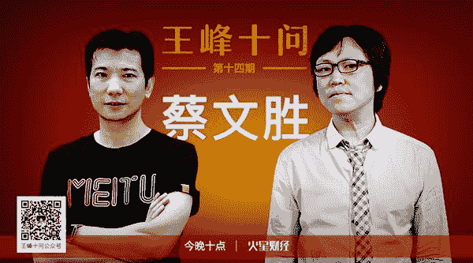** 

**对话时间**：5 月 2 日 22 点

**微信社群**：3 点钟火星财经创始学习群

**对话嘉宾**：

蔡文胜：美图公司董事长，265.com 创始人。2005 到 2007 年，连续举办三届中国互联网站长大会，被广大站长尊称为个人网站教父。先后投资暴风影音等数十个优秀网站，成为中国著名的天使投资人。

王峰：火星财经发起人，蓝港互动集团（HK.8267）创始人，极客帮创投合伙人，曾任金山软件高级副总裁。 

**以下为对话原文整理**：

**第一问**

**王峰**：大家都知道你第一桶金是域名，你曾经交易过 uc.cn(优视)、qiyi.com(奇艺网)、fm365.com(联想门户网站)、t.cn(新浪微博)、360.cn(360 公司)、g.cn(谷歌中国)、weishi.com(微视)等优质域名，所以你也被称为“域名大王”。2005 年 4 月，你个人出资包下全部食宿，在厦门连办两天“第一届中国互联网站长大会”，邀请了国内流量最大的 150 名个人网站的站长参加，其中包括李兴平(hao123)、庞升东(51.com)、姚劲波(58 同城)、王微(土豆网)、俞军(9238 搜索)和猛小蛇等，还邀请了雷军、周鸿祎、刘韧等国内互联网大佬和 IDG 等主流投资机构代表。这一届的站长大会被普遍认为是个人站向商业站转型的标志，也开创了互联网草根创业的浪潮。当时你为什么想要组织站长大会?

**蔡文胜**：我是从 2000 年开始进入互联网的，之所以从域名切入，第一我没有技术背景，第二选择域名创业成本比较低，一台电脑加很少的资金就可以注册域名。

到了 2003 年，我开始做个人网站 265，并因为它到了北京，获得了 IDG 投资。当时我是草根网站第一个拿到 IDG 主流基金投资的，我就觉得还有更多的个人网站、个人站长，可能也需要有这么一个平台，能够获得风险投资从而做大，这是为什么我要做站长大会的原因。

我选择厦门，是因为我是从厦门出发，所以我希望，也能更多地帮助厦门的一些个人站长。

**王峰**：当时为什么选择互联网创业从域名和个人站长开始?域名和个人站长的这段经历，对于日后你做投资、创业有哪些启发?

域名和个人站长的这段经历，对我以后的投资和创业最大的影响在于，域名是一个互联网的基础，你在注册域名的过程中，会了解中国所有网站的域名注册信息：包括网站是如何做的，谁做的，怎么做成功的。这个部分会对我有很大的帮助。

当时我能做到，中国某一天流量 IP 超过 10 万的个人站长，我都知道是谁做的，他是如何做到的。这种学习很重要，后面我进入天使投资领域，我也会尽快地去了解中国做得一些成功的天使投资人是谁，和他们交流。同样，现在我对区块链感兴趣，我也会用最短的时间接触中国甚至世界上做区块链投资最成功的那些人。

这是我的一个方法论，对大家可能也会有启发。

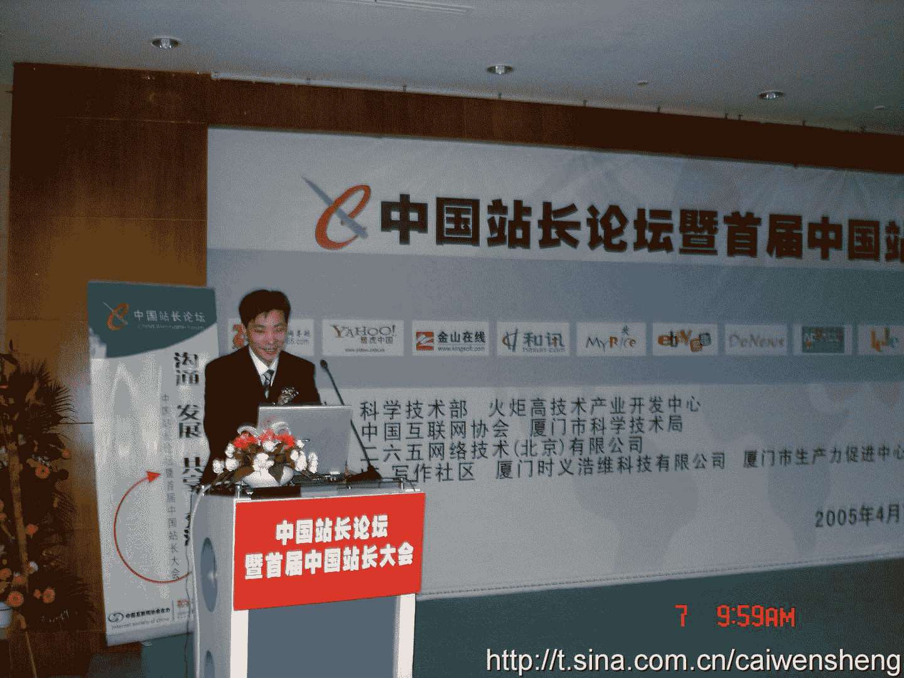

蔡文胜在第一届站长大会演讲

**第二问**

**王峰**：4 月 24 日，中国天使投资人大会在香港举行。我知道你和雷军、李开复、徐小平、薛蛮子、杨向阳、何伯权、倪正东、龚虹嘉、包凡、王刚、姚劲波、袁岳和曾李青等人都是天使会成员。你们在这个会上讨论了什么话题？你认为在这些人里，谁取得的成就更大？作为非常有影响力的投资人，你认为中国的投资人除了投资回报，应不应该有价值观的考虑？你是怎样践行的？哈哈，这个问题有点大，但是既然要问你，值得我们听听。

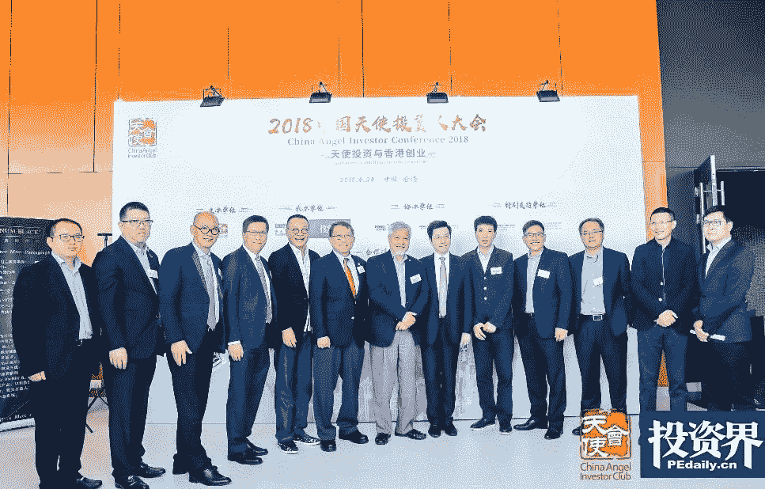

**蔡文胜**：中国天使会每年都会举行一次对外的会议，主要话题就是为了推广天使投资、鼓励创业。这次进入香港，主要的原因是天使投资在中国内地已经做得非常好，我们应该往国际化去发展，香港刚好是一个中西结合的地方，我们希望借此来讨论未来的投资方向，获得更大成就。

至于天使会的 14 个人里，谁取得的成就更大，我觉得是不能完全按经济指标，以赚钱来论成就，每个人其实都有各自的方法。我想讲一下我理解的每个人的特点。

比如李开复的投资风格是偏逻辑性，包括从数据方面，团队方面，发展方向，他都会从逻辑性去衡量一个项目。他也会偏爱投资一些有大公司从业经验的人。

徐小平，我觉得他是偏浪漫型的，只要你的项目能够感动他，他觉得这个是很有意思的事情，他就会投资。

薛蛮子，是我见过最容易接受新事物的人，他更多是一个广撒种的方式，只要投入资金不用很大，他就愿意去投，项目众多，等待它成为爆款。

杨向阳是一个偏情怀的人，他早期是投医疗的，后来投了一些硬件。他早期投医疗时，他觉得中国能不能在医疗方面有突破，能够挽救更多人的生命；他做硬件，也是觉得中国工业制造比较薄弱，他愿意去帮助一些工业 4.0 这一类的项目。他经常为情怀买单。

雷军的风格，早期的投资他一般只投熟悉的人，或者是熟人介绍的项目。另外，我觉得他的评估标准是这个项目有没有机会能够得到更多投资人的认同，能够组建足够强的团队，我认为这是他的风格。

王刚，他是天使会里面最年轻的人，但我觉得他的投资风格最成熟，他几乎都会深入到团队里面去，包括方向、人才和资本。

关于天使投资有没有价值观，我觉得每个人都一样，早期投资是为了赚钱，当赚到足够多的钱，更多的考量是从社会价值去衡量的，比如海康威视的龚虹嘉，他从海康威视赚到了几百亿。有一次我们在私下聊天的时候，他说他其实很彷徨，他不知道要用这些钱干什么？

后来他想明白了，他说他觉得老天给了他这么多钱，就是要让他承担更多的责任，去帮助更多的人。所以，他现在就加大了投资范围，把他所有的钱投到更多的项目里面去。

我本人也一样，其实我大大小小投的站长最少几百个，大家知道的有几个成功的，还有很多是不成功的，当时我投资他们的时候，我也知道可能不会赚到钱，可能没有商业价值，但是我觉得他会帮助更多的人，我就愿意投他。

举两个例子。我投了一个新农网，它是帮助农民用养殖技术、种植技术发展农业的网站，一开始我也觉得不一定能赚到钱，但是它真得能帮助一些农民怎么样更好的养殖，我觉得这是非常有意义的。另外，我投了一个网站叫贷帮网，这个网站当时也是在湖南、湖北发展，就是小额贷款给农民。这个已经投了 10 年了，当时他希望能够做一个像中国的尤努斯，帮助农民获得小额贷款。这个项目到现在基本上也不算成功，但他直接帮助了很多农民。

**王峰**：追问一句，过去十年里你最没有想到的成功者是谁？你的投资和创业生涯里，你曾经有过接近于做成 BAT 这样规模的路径机会吗？

**蔡文胜**：我觉得连草根都能成功，所以每个人都有机会成功，我从来不会去想哪个人不会成功，我觉得每个人都有机会能成功。

我觉得当然有机会投出 BAT。比如雷军的小米，现在就是一个这样的段位，当时我是有机会去投资到他的，因为小米的融资非常快，而且一开始规模就很大，超过了天使投资的范畴，所以当时虽然觉得小米会成功，但自己却没有主动去投资。

还有美团，我记得当时王兴 2007 年要做美团的时候来找我，他当时刚卖掉了校内网准备团购，当时我认为团购是很难成为一个巨大的商业平台的，但是王兴很厉害，他在团购的基础上其实已经做成了现在大家看到的美团。

我跟张一鸣也是 2005 年就认识了，当时他是跟吴世春在做酷讯，后来他出来创业做了 99 房， 他当时是在 99 房的基础上做了今日头条。因为那个时候刚好我已经想回厦门创业投资了，不留在北京，所以就错过了头条。

这三个项目其实是接近 BAT 的，当时只要我主动一点，都可以投进去，但是错过了。

**第三问**

**王峰**：你从 2005 年开始，先后投了 4399、暴风影音、58 同城、知乎等知名项目，已经在古典投资功成名就的你，为什么今年春节期间在“三点钟无眠区块链”微信群高调发声，把自己变为区块链投资先锋？后来为什么你选择逐渐淡出三点钟群，一段时间里，你开始很少发声？

**蔡文胜**：我之前也说过，把互联网归为古典是不合适的，我个人认为区块链的本质就是基于 P2P 的技术，也是属于互联网的技术产生的一个新商业模式。

我在这里面看到了一个全新的价值，就像 2000 年我对互联网的感觉，觉得互联网是一个巨大的机会，我也希望我身边的人和更多的人能认识到区块链的价值，能参与到这里面来，这是我在 3 点钟发声的初衷。

后来为什么选择慢慢地淡出呢？同样因为区块链是一个全新的东西，所以它必然也会带来很大的争议。虽然区块链是一个未来，但是它还是需要时间，我也不希望所有人短期太过乐观，别盲目的投入进来。再加上我个人还有一些传统的投资和事务，综合起来就会比较少出现了。

**王峰**：你认为“三点钟无眠区块链”微信群为什么会在春节期间大火？谁起到了关键推动作用？

你曾经说，“区块链是人类有历史以来最大的泡沫，不参与才是最大风险。”对此，你怎么看？

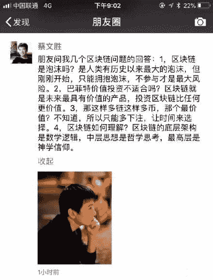

**蔡文胜**：三点钟第一个关键人物是玉红，因为当时就是他发起的，一开始他去拉了跟游戏、娱乐相关的人进来，因为是靠近春节，所以那个春节一开始大家就在里面发红包，也拉了一些娱乐明星进来，就形成了一个热潮。

在这个过程中，我觉得我起到的作用有三点：

第一，我提出了群主可以轮值，可以按照个人不同的主题风格，来做一天群主。

第二，提出了约法三章。关键点一：这里面不能发红包，大家是做区块链的人，再发红包有点古典了，因为发红包都是刷屏，不能发红包就不能刷屏。关键点二：发币或者是发糖果可以，但是不要把钱包代码写上来。关键点三：欢迎、表扬、称赞别人，但是不要重复 copy，要有诚意积极手写。我们进到一个群里面，经常一个大佬进来，大家就千篇一律的欢迎、鼓掌，底下满屏都是同样的信息，如果要致欢迎词，要手写。

因为有了这个约法三章，就变成有一些主题去讨论，讨论的内容就非常有意义，所以就变成了去传播这些观点，所以就火起来了。

第三，我进来以后，拉动了一些互联网投资大佬进来，比如说阎焱、沈南鹏等人，同时，我也把一些区块链大佬拉进来，比如吴忌寒、李笑来等人，就把互联网投资和区块链投资结合在一起了，影响也加大了。

后面整个三点钟群起来，其实还有很多因素，包括陈伟星、帅初、Dovey、王峰等起到很大的推动作用：陈伟星鲜明性格让大家印象深刻，他对货币经济学研究非常到位；帅初对区块链技术发展的见解独特；Dovey 邀请了几个美国区块链投资大佬参与讨论；而王峰十问，更加延续了三点钟的热度和深度。当然还有许多嘉宾专家如曾鸣、杨东等等的参与，也让三点钟群更受关注。

当然还有一个挺重要的原因，因为刚好那个阶段是春节，大家没有热点，刚好比较闲，所以就变成了一个全民的现象。

关于泡沫，我的理解是，人类历史上曾经发生过很多次资本市场的泡沫，包括郁金香，包括 1929 年美股大崩溃，包括近一点的，比如说 1997 年的东南亚危机，包括 2008 年的次贷危机，但这些泡沫基本上都是有区域性的，参与面并没有涉及到全世界。现在的比特币是覆盖了全世界和全人类，风暴规模是最大的，所以它如果是泡沫，一定也是人类历史有史以来最大的泡沫。

但是现在全世界玩比特币和数字货币的人也就 3000 多万人。那么，这个数量还是在一个很早的开始。它带来的变革可能是一个全球性的，那么，到底未来数字货币会不会成为最大的成功？我不知道，但是它刚刚开始，所以我觉得不参与才是最大的风险。

**第四问**

**王峰**：关于美链，很多人还是一头雾水。2 月 23 日下午，美链 BEC 在 OKEX 公开交易，上线当日开盘暴涨超过 4000%；据证券时报报道，发现 70 亿枚 BEC 中有 99.9321%掌握在前 4 个地址当中，BEC 数量分布非常集中；而且，美链 BEC 的白皮书并未公布私募、公募规则，也未进行公开认购。上市后 1 个月内，美链 BEC 的价格下降了近 8 成。在很多人眼里，发币就是 ICO，你可否在这里给大家科普一下什么是 ICO？这种模式可否有借鉴？很多人关心。你不妨多说说。

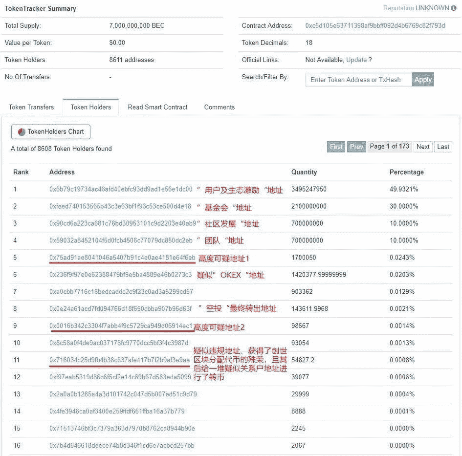

99.9321%的 BEC 币在前四个地址里，分别为 49.9321%、30%、10%、10%

**蔡文胜**：首先，我要在这里强调一下，BEC 美链不是美图公司做的，也不是我个人做的。

大家都在讨论 ICO，但 ICO 并不代表区块链，也不代表数字货币。不是所有的数字货币都会 ICO 的。比如 BTC，2009 年创建，它就没有私募，没有 ICO，对不对？这很正常，因为它不需要募集资金。

第二，很多人认为 ICO 完成，才能够进到交易所交易，这也是一个误解。目前在交易所交易的百分之五十以上的数字货币，是没有 ICO 的。有一些是融的天使投资，做的私募，也没有向公众 ICO，它也会上交易所交易。

所以并不是说发币就是 ICO。也并不是说要 ICO 完成才能去上交易所交易。这个模式，我觉得接下来一定会有更多的区块链项目会选择不去 ICO。

因为我们知道 ICO 最成功的项目是 ETH。是因它的创始人 Vitalik 非常年轻，他需要资金去开发以太坊，所以才进行 ICO。接下来如果有一些比如说互联网公司，它们原来已经具有资金实力，有技术团队，他们是可以不募集资金，不需要 ICO，也能够把区块链项目做起来的。我觉得未来更多的会这个模式做。

我觉得对交易所来讲，什么样的币能上交易所？这个币得有很大的流通性，特别是它的地址要分散。通过上链查询可以了解到，BEC 目前的地址是 36 万个，36 万个地址分散已经是一个非常可观的数字了。比如 EOS 也差不多 40 万的地址分散。

我们知道交易所除了你正常申请，交易所如果看到你的地址足够分散，流通性足够大，他也愿意主动帮你上交易所，甚至都不会通知你。比如 BTC、ETH，中本聪从来没有叫交易所上它的币，但是所有的交易所主动会上 BTC、ETH。对不对？

作为交易所，愿意让 BEC 去交易，我觉得一个考虑，就是觉得它们的地址足够多，有 36 万。另外，我来分析，上线当天 BEC 为什么会暴涨？暴涨那么多，这其实是目前交易所存在一个弊端。我们知道股票市场，有股票 IPO 时，它会有一个盘前交易，撮合交易。但数字货币交易所是没有盘前交易的。所以在上线的瞬间，有人只要花个几千美金，都会让这个币涨几十倍。

很多币在交易所上线的第一天，都是上涨几十倍，只是那个交易金额极小。可能因为传闻 BEC 和我扯上关系，所以就被媒体报道说成炒作，但其实是大部分新上币的惯例。所以我这里也认为，交易所过后应该会改革，会进行一个盘前交易。

至于说发现 70 亿的 BEC 里面，99.9%都是在前 4 个地址，更加说明 BEC 没有任何割韭菜的行为，如果要割韭菜，它就会募集资金，但它一分钱都没有募集。第二个它可能会把这个币发到交易所里面去交易，只有百份之零点零几的币，可以通过链上查询，在 OKEx 上交易所里面的 BEC 币从来没有超过 300 万个。怎么去割韭菜呢？如果要割韭菜，它就更应该把大部分的 BEC 挂到交易所里面去交易，对不对？

当时 BEC 只有两个方法可以得到：一是空投，就是等于白送人家的，二是通过当时的合作方 BeautyPlus，拍摄或分享照片可以得到 BEC。通过这两个方法你拿到的 BEC 都是免费的。

它上交易所，其实是让这些免费拿到的 BEC 有一个交易的地方。当然，这里面不排除有少数的人，会在高点去买到 BEC。但这个其实是极少数的人，而且是极少数的行为。据我了解，BEC 当天上币的交易并没有超过 10 万美金，之后每天平均的交易额也没有超过 10 万美金。

虽然 BEC 不是我做的，但我想用我了解的情况来分析这个过程。

**王峰**：巧合的是，美图 2 月份也上线了一款区块链钱包产品“贝客钱包”。那么，BEC 美链究竟是不是美图上市公司的资产？BEC 美链和美图到底是什么关系？美链 BEC 事件引发了社会很大争议，这可能会让你始料未及，你能否在“王峰十问”里对公众解释一下？

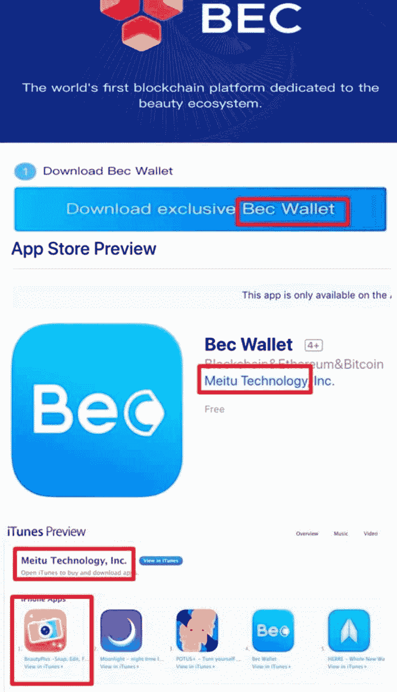

**蔡文胜**：就像我们公告中所说，美图公司跟美链 BEC 没有任何的关系。它不属于美图上市公司的资产，美链是一个在新加坡成立的，以独立基金会的形式成立的一个区块链项目。的确，我也看到他们的白皮书并没有团队的介绍。以我的了解，是因为 BEC 团队想低调的做事情，因为它不对外募集资金，所以它们也不写上他们的团队介绍，有些区块链项目也是选择这样低调的方式。

刚好相反，如果它是一个想要骗钱、割韭菜的项目，它反而会贴上一大堆非常有名气的人，来做团队的顾问，这谁都能做，对不对？如果你想要去募集资金，想要更多人来买你的币，那不就更应该把团队列出来，贴上几个非常牛逼的人？这个很容易做到。

据我了解，BEC 基金会经过这次的事件以后，应该会深刻反思，会在恰当的时机展示出 BEC 的团队成员并重新规划 BEC 的发展。

贝客钱包是美图做的，因为我们看到钱包是政策允许的，那么美图公司想去拥抱区块链，所以做了贝客钱包。当时我们是用海外的产品 beautyplus 跟美链 BEC 合作的，美图在海外有 3 亿的用户，希望在这 3 亿用户里面可以做一个尝试，看区块链如何能跟互联网产品结合落地。后来大家也看到，因为引起争论太大，BEC 自身也出现重大技术漏洞，美图公司也终止了跟美链的合作。

**王峰**：4 月 22 日，BEC 美链由于被黑客发现了漏洞，造成大量 BEC 增发，最后引发黑客抛售 1100 万 BEC。有人说，BEC 高达 280 亿美金的市值，当天瞬间就归零了。同时，OKEX 也紧急停止了 BEC 的交易。之后，美图宣布旗下海外产品 BeautyPlus 终止与 BEC 美链的海外推广合作。为什么 BEC 会出现被黑客攻击那样的技术漏洞？很多人关心区块链的安全问题。

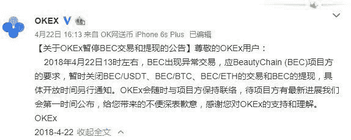

**蔡文胜**：说 BEC 高达 280 亿美金的市值归零，这个理解非常错误。280 亿美元的市值，是有人按照第一天交易的最高价格 4 美元乘以总要发行 70 亿个 BEC，得出的市值，这是错误的计算方式。

这里也跟大家普及一下，数字货币市值一般都只算你的流通量，并不算你的总量，不管是现在的 BTC、以太坊、EOS，所有的数字货币都不是按照你要发多少币，是按照你能流通的数量来算你的市值。

所以 BEC 它的市值就应该是它空投加使用场景发行出来的，到现在为止，根据我了解，只有 900 万个 BEC 在市场流通，市值只有几百万美元。

这里我还要讲一下，之前很多人在说 BEC 破发，这也是一个错误。BEC 当时在 OKEx 的发行价是 0.1 美元，直到黑客攻击那一瞬间是 0.35 美元，从来没有破发过。你不能去说最高点涨到多少钱，现在跌了多少，然后就定义为破发，BEC 从来没有破发过。如同 BTC 最高两万美元，现在跌到九千美元，也不能说是破发。

这里我觉得要表扬一下 OKEx，因为 BEC 在 22 日下午 1 点 18 分发生，他们在 1 点 45 分就发现问题并停止了交易，反应速度是非常快的，也避免了用户的损失。

据我的了解，到 4 月 28 日，BEC 已经完成了全部回滚，所有的交易都回滚，买到假的 BEC 的钱都退回了给用户，没有任何一个用户受到损害。黑客抛售了 1100 万个 BEC，得到价值 60 个比特币。但黑客转走的只有 20 个比特币，其他的 40 个被交易所及时冻结了。

BEC 基金会承担了所有交易的损失，另外再加补偿用户 10%。BEC 基金会也采取积极措施来补救。第一时间协调二个交易所进行回滚，退回当时交易费用并适当补偿。第二，检测所有代码与安全性，重新发行新的智能合约。第三，最快时间完成对外流通的 900 万个新的 BEC 映射，发送地址达到 36 万个 BEC 钱包地址。所以没有任何一个用户受到损害。

BEC 的技术漏洞，后来有一些技术论坛里也专门做了说明。有几十个基于以太坊 ERC20 的数字货币都出现这种问题。BEC 可能是因为比较受关注，第一个引发了黑客攻击。我觉得这个对整个行业可能是件好事，也让大家更关注区块链的安全问题。

区块链的确就是一个全新的东西，它有巨大价值，同样它有巨大的风险，那么，通过这个事件，我觉得会让整个行业借鉴，后来引发了整个行业全部在自查这个安全漏洞，我觉得这个可能是一个好的推动。

这也促使大家思考，如果要做区块链的创业，不是简单发个币就行。通过这件事情，我个人认为，区块链的创业门槛是非常高的。它不单单涉及到技术方面，包括你对发币的经济逻辑，包括你的营销能力，包括你的社群运营能力，都要求非常高。只有都很懂，才能真正做成一个区块链项目。而且发币的人要用上你这辈子所有积累的信用，如果没有决心长期去做区块链项目，尽量不要随便发币。

**第五问**

**王峰**：接下来问点实际的。你买了多少比特币？你是什么时候开始投资区块链项目的？到现在为止，投资了多少个区块链项目？4 月 21 日凌晨，你在“三点钟无眠区块链”群中分享了几点思考，其中提到：“这次回暖不会鸡鸭都升天，除了基础货币 BTC，ETH，EOS。其他能落地，人脉关系强大，有实力团队才能起来。”这是你区块链投资逻辑的一部分吗？在过去几个月的熊市基本盘里，能否透露下你的盈亏情况？

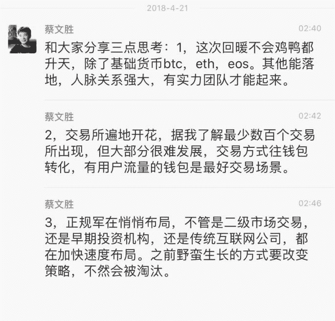

蔡文胜 4 月 21 日的分享记录

**蔡文胜**：今年一月份我还只有个位数比特币，只是玩票。当我确定区块链和比特币是未来，我给自己定的目标是拥有一万个比特币。当时到 12 月份高峰的时候，我个人觉得价格已经有点高，我没有买。后面我应该是在 2018 年 1 月底，才逐步随着价格下降不断建仓，不断地买。现在这个小目标基本实现了。

我认为投资与投机最大的差别是，当你购买了某个股票还是某个数字货币，价格不断下跌，你的心态是越跌越高兴，可以不断补仓，那才是算投资，反之，买完不断下跌就懊悔抱怨，那就是投机。当然，决定投资某个标的，你必须认真研究和分析，才能坚定自己的信念。

我大大小小，投了差不多十几个区块链的项目，比如 Theta、Ontology（ONT）本体、Cortex（CTXC）、ArcBlock（ABT）、Zipper（ZIP）、YeeCall（YEE）、Dxchain（DXC）、Charter（CAF）等，这里有回报很多的，也有现在还是亏钱的。

我投资的区块链项目，现在看有浮赢有浮亏的，但是这只是短期表现。区块链还在初期阶段，很多场景很没办法落地，需要大家多方面的支持和宽容。长线看，我是非常看好的，很多项目还需要更多时间来验证。

我个人理解，现在区块链的投资就如同 2000 年你去做互联网投资，挺难保证大部分会成功，可能少数会成功。但是，区块链的项目如果你投中了一个，可能回报就是几十倍。

这里想强调一点，作为投资人，去投一些区块链的项目，如果这个币涨了，我会赚到钱。有用户买到它，也会赚钱，大家都开心；但如果我投了一个币，亏钱了，有用户也可能会亏钱，但是，用户不能因此说因为有蔡文胜投了，就会保证你不亏钱，我觉得这个逻辑，大家不能去这样理解。投资人也会投错项目。

所以这里我也想为其他投资人说句话，大家要去好好的分辨，不能因为有某个大佬背书，或者投资了某个项目，大家就觉得这个项目一定会赚钱，这个投资的逻辑一定是错误的。

我这里可以讲一个，在 3 月底熊市，是大部分投资区块链最艰难的时刻，比特币跌到了 6500 美元，以太坊跌到 360 美元。但是大家忽略了一个趋势：从更长时间维度看，它其实是涨的。我们用比特币做例子，3 月 31 号，比特币不到 7000 块美元，但是 2017 年的 3 月 31 号，比特币只有 1000 美元；2016 年比特币只有 400 美元。2015 年 BTC 多少钱呢？还不到 100 美元。所以，从这个趋势来讲，数字货币它其实是不断涨的，只是它中间可能会波动比较大。

我要强调的就是，在去年 1 月份以前，大量的这种新的 ICO 发行出来，在分辨力不足的时候，随便什么数字货币都会涨。我觉得经过了这段时间的熊市经历和教训，接下来大家的分辨能力会加强。不可能什么乱七八糟的币都会涨，要真正的做实事的人，能落地的东西，它才是未来。

区块链投资就是提供一个普通投资者能够和著名投资人和著名投资机构一样成本的进入机会。大家基本在同一个起跑线。区块链项目也反应出著名投资机构不一定就是比普通投资者聪明多少。

一个项目，机构投资人也就提前一点点时间进入，上交易所交易以后，大家机会都是一样的，如果你看好一个项目长期发展，任何时候进去都是对的。

**王峰**：2017 年 12 月 15 日，你在海南“互联网+”创新创业节的演讲上提到，“区块链经济带来了一场认知的革命，区块链的核心不是技术，而是商业逻辑的重构。”这句话，你能否进一步谈谈自己的理解？此外，你认为区块链项目可以离开 Token 而独立存在吗？有人将区块链比作通证经济，指出 Token 和链不可分离。

**蔡文胜**：我的理解，区块链是基于 P2P 的技术发展起来的，P2P 的技术其实已经是在 1999 年就出现了。这个技术并不新鲜，那么，它真正的引发大的革命，是因为中本聪把 P2P 的技术用于数字货币，变成了价值的传递，这引发了整个商业逻辑的变化。

同样，在这个数字货币的发展过程，延伸出来的 token，包括 ICO，也让我们重新去思考，组织架构是不是可以变化？比如公司的出现是在 1600 年，荷兰东印度公司是世界上第一家公司。1606 年，同样出现的第一个股票公司，也是东印度股票；但是在人类的历史发展长河里面，几百年挺短暂，所以，说不定未来这种 ICO 方式，这种 token 的方式，可能会让我们重新树立一个组织架构。

所以我认为，真正的去理解区块链，是从它的商业逻辑重新思考的。包括未来我们雇一个人，是不是给他发工资，或者就用 token 的激励方法都能完成？这些都是值得思考的。从中本聪的例子也能看出来，一个创始人，他提出了一个理念，创建了项目，现在我们都不知道他是生是死，他也不去管这个项目，比特币依然继续存在。这些都是颠覆我们的认知的。

区块链的项目可以离开 token 独立存在吗？我认为是可以的。当然好的区块链项目，一般都要跟 token 结合，它能发挥最大的价值。但是，有一些是可以不用 token 的。特别是技术方面，比如我们现在看到，不管是中国、美国，包括中国的银行业，在用区块链的方式改造银行系统，包括我们可以看到澳洲的交易所，用区块链方式去改造它们的交易所。有太多的例子可以证明区块链的技术它是可以独立存在的，它会提高效率，为很多企业应用。

当然，我认为全新的，有一些创造性的项目应该需要跟 token 结合，才能产生巨大的价值。

我之所以选择互联网创业，就是可以不用应酬，专注喜欢的事情。现在喜欢区块链，就是选择自由精神。人若无名，专心练剑！其实我很怀念 2004 年之前在厦门的日子，没有谁认识我，也没有谁会来找我聊天，这样可以专注做喜欢的事情，可以主动去找其他人请教。人有点名气能带来一些好处，信息资源和影响力，但也会带来相应的坏处。

**群友问：**区块链技术和区块链实际落地应用哪个更重要，我个人认为落地场景才能推动技术的革新与升级，您认为呢？

**蔡文胜**：我觉得明年会有很多落地场景实现，目前是金融，游戏和娱乐先开始。

**第六问**

**王峰**：你早年做的 265 和 4399 都是满足互联网普遍性简单需求的工具，没有太多技术含量。265 卖给了 Google；4399 到现在为止都还是中国最大的小游戏平台。后来的美图更不用说了，有 4.5 亿月活用户，说实话我没想到美图能做今天这么大。我看你投资和实际创业的所有公司，基本上都不是以技术为核心驱动的。互联网行业发展到今天吗，越来越重视技术上的军备竞赛，BAT 就不说了，像机器学习之于今日头条、系统安全之于猎豹，搜索技术积累之于搜狗，团队都需要有极高的技术实力。近十年的后起之秀中，张一鸣、王兴、王小川要么是程序员出身，要么是技术型产品经理，同他们相比，草根站长出身的创业者还有机会做到今天美图这样的规模吗？

**蔡文胜**：在互联网发展早期，265 导航当时就抓住了一个最常用的需求，你不用输入网址，通过 265 能够快速找到网站。4399 其实也是抓住了当时一个需求，很多家庭限制小孩玩网络游戏，但允许小孩玩碎片化的小游戏，我们抓住机会很快把 4399 做起来了。美图也通过一个简单的修图工具，积累了数以亿计的用户。

我认为，有的项目刚开始可能并不需要太多的技术含量，但到了某个阶段，它必然会出现瓶颈。我们很早就认识到这一点，依靠技术驱动能力，才能更快速地发展用户。

美图能走到今天，做到这么大，其实已经在几年前就开始专注技术了，也一直在大量招聘技术人员。可能很多人不知道，会问为什么有 2000 多个人去做一个修图软件呢？美图 2000 多名员工，70%都是技术和产品岗位。你看到的美颜相机、美图秀秀等产品，它们已经应用了非常多的大数据、AI、机器推荐等技术。

我觉得，同样草根站长出身的创业者，还是有机会做成最大的公司。有句话讲“将相本无种”，多年前的 BAT，你也没想到它会发展到今天，所以我认为每个人都有机会，特别在区块链这个全新的领域里，未来一定会出现甚至能超过 BAT 的公司。

但这里必须要强调一点，有的项目初期做得好，可能是因为你的一个创意好，或者是你的营销能力强，但是在未来，一定要结合技术能力，同时要具有组建管理团队的能力，才有可能做成一个巨大的项目。

对于创业者来说，他本身要有自我学习能力和不断的进化能力。我们可以看到，无论是 BAT，还是美团、今日头条等等公司的创始人，必须具备强大的自我学习能力、自我纠错能力，不断改正，才能有今天的成就。

**第七问**

**王峰**：我看你去年也非常关注人工智能、工业 4.0 方向，这一点我跟你也一样。我们共同感兴趣的可能还有短视频、互联网金融等领域。你是怎么看去年这些还特别热的互联网创业机会呢？好像现在谈论的人一下子少了很多。美图前不久任命斯坦福大学物理系教授张首晟教授为独立非执行董事、提名委员会及薪酬委员会成员。为什么聘请张首晟作为独立非执行董事？你和张教授的相识渊源是什么？张教授的丹华资本之前专注于 AI，但随后迅速在区块链领域发力发声，影响很大，你们之前有什么默契？

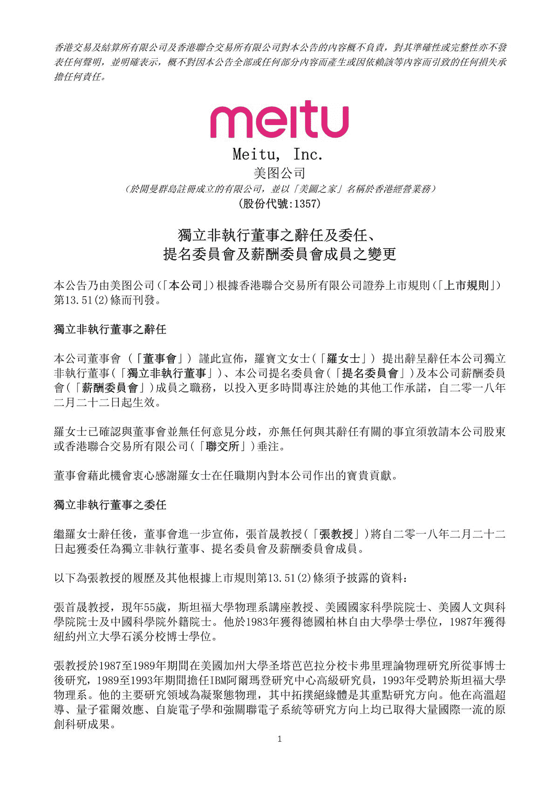

美图任命张首晟教授为独立非执行董事、提名委员会及薪酬委员会成员

**蔡文胜**：任何技术的发展，它都会经历这么一个阶段，就是突然一个热潮上来，所有人都在谈论它，然后过了一段，大家才发现，并没有想象中那么快速地发展，之后，有些人半途而废就退出了，有一些人坚持留了下来，几年后才会看到最大价值的出现。

前两年都在谈论人工智能、工业 4.0 等等方向，今年基本上都不是大热点了，但以我的了解，其实有不少公司已经取得很大的进步，比如专注于计算机视觉和深度学习的商汤科技，也是我投的公司，它已经在人工智能方面，不管是布局，还是应用，都做得非常好。我在厦门投资的另一家人工智能公司，目前也已经进入盈利阶段。

区块链是现在的热点，大家都喜欢去追逐热点，所以就忽略了人工智能，但我认为，未来人工智能跟区块链是可以很好地结合起来。

虽然区块链现阶段非常热，但是相对于投在互联网、人工智能方面的资本来看，投在区块链方面的资本其实还是非常少的。互联网还处于高速增长阶段，吸引了最多的人才和最多的资本，还能发现巨大的价值。

我跟张首昇教授其实已经认识了有几年了，是去美国硅谷的时候认识的。当时他邀请我投资了他们的丹华资本，我是丹华资本的 LP。当时，我做丹华资本的 LP，也是看中了丹华资本在 AI 方面的布局，我们会经常互相沟通对未来的看法。刚好，丹华资本在区块链方面，算比较早介入，我觉得这算是个不谋而合，刚好大家都看到了区块链的巨大机会。

我作为美图的董事长，因为看到了区块链巨大的机会，我也尽力去推动公司往区块链技术去发展，所以，我们聘请张首昇教授做我们的独立董事，这是一个自然而然的事情。如同美图公司原来就请李开复做我们的董事，因为我们认同开复对美图人工智能 AI 的推动。

所以，无论是邀请人工智能非常厉害的李开复，还是与区块链行业专家张首晟的合作，其实都说明了美图积极拥抱未来技术变化的开放态度。

**王峰**：那么，在你看来，未来三年，区块链与互联网之间将会是怎样一种关系？勉强融合还是逐渐颠覆？以及，在你未来投资组合里，区块链和互联网创业项目的比例会是怎样呢？

**蔡文胜**：我觉得区块链和互联网之间会加快融合，可能就不会再分什么是区块链的项目，或者什么是互联网项目了。比如现在的移动互联网跟新零售的结合，像阿里巴巴投了那么多新零售项目，你很难说阿里的业务是线上还是线下。

未来三年，可能每个互联网公司，都可能会有结合区块链的技术；同样，好的区块链项目，一定也要结合互联网现有的技术和用户资源，才能真正的做大，这是我的理解。

关于我未来投资组合里区块链项目的占比，其实我并没有设定一个比例，因为我创立的隆领投资，没有 LP，全部都是我个人的资本。我任何一个投资项目都没有时间的要求，也没有领域的区分，只要我看中了就投。

我在前几天的“2018 中国天使投资人大会”上也说过，每个人投资都有不同路数和打法。

我的打法第一规则，就是不按行业规则。因为规则都没用，社会进步的速度比规则制定的速度快得多。

第二，要能非常快的接受新东西，只要发现新东西都能快速接受。

第三，是投的这个项目能不能服务更多的人？因为所有东西打交道还是跟人有关，服务足够多的人就是商业模式。在前面十几年，因为我接触更多草根，所以我会偏向投资草根，但是其实在最近几年，不管是从大公司出来的，或者精英，或者草根，我觉得只要团队足够优秀，我都会投资。

所以，总结一下我个人的投资规则就是：一是不按规则，二是敢拥抱新的变化，三是服务于更多的人。

**第八问**

**王峰**：关于地域创业问题。我记得 2004 年你创办 265.com，以打破 IDG 两个纪录（学历最低，高中没毕业；没有商业计划书 PPT）的形式拿到投资，之后便将 265.com 搬到了北京。到了北京后，你和互联网主流人物、公司接触的机会大大增加。265.com 原 COO、明势资本创始人黄明明曾经回忆，那时候，你在故宫旁边的南池子的一个四合院，与创业者一拨接一拨来聊天，一天至少聊十几拨人，每天晚上灯火通明。有一次就是冯鑫带我去的，那时候我还没有离开金山。中国的第一代互联网创业公司大多数诞生在北京，北京集中了政策、资源、人才和媒体各种优势，而且，这些优势在一定程度上是不断累积的。可是，为什么你后来选择回去福建厦门重新创业？

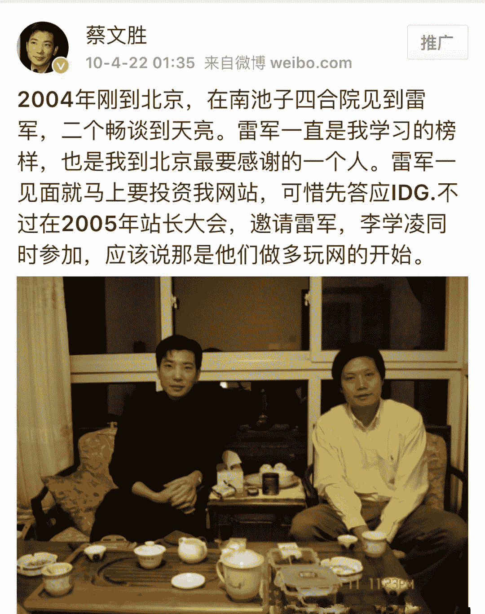

**蔡文胜**：我 2000 年到 2004 年是在厦门创业，当时到北京去发展，其实我受到雷军的影响。在 2003 年的时候，我跟雷军认识，是因为他找我买域名，我们经常通电话聊天，雷军不断鼓励和动员我：文胜，你为什么不来北京发展？后来我就选择了 2004 年去北京创业。

到了 2008 年，我卖掉了 265 给谷歌。那个时候，不管是从人脉资源还是其他各方面的优势来讲，留在北京继续创业，机会可能会更大。但当时我有三个考量，所以选择回到了福建。

第一，我发现，当时的我已经小有名气，找我的人越来越多，感觉时间都被浪费掉了。第二，自己会处于一个焦虑当中，觉得自己会很难再成长。如果离开北京这么繁华的地方，回到厦门，可以给自己一个重新出发和安静成长的机会。另外，我自己一个人到北京创业，家人在厦门，希望回去能够好好陪我的家人。第三，是家乡的情结，因为我是福建人，从福建出去，也希望能再回到福建，帮助更多福建的创业者。

当然，回到厦门后的成绩也是非常不错，除了自己创办了 4399 和美图秀秀以外，我在厦门投资了十几家互联网公司，按照福建省公布的前几大福建互联网企业中，有一半都是我投资的，跟我个人相关。

**王峰**：互联网时代，涌现了一批敢打敢拼的福建系创业者，他们中很多成为了闽商的传奇人物：你是福建泉州石狮人；美团网王兴和今日头条张一鸣，都是福建龙岩人；雪球的方三文，福建武平人；91 手机助手的创始人熊俊，福建龙岩人；比特大陆 CEO 詹克团飞，福建福州人……福建人经商能力超强，不少人总把你当作商人而不是实业家，而且说你是典型的福建商人，喜欢赚快钱，你自己如何看？对了，福建还有莆田系，哈哈。

**蔡文胜**：福建的确是一个善于经商的地方。在传统产业里，已经出现了很多优秀的福建企业，比如像恒安、安踏等等。而且，福建的商人大多是跟实业家结合在一起的。

但可能有些福建商人也的确做了一些比较短平快的事情，但我觉得不能因为有少数的人这样做，就把这个现象地域化，这是不公平的。不能因为少数人或者少数公司，就把人群标签化和地域化，未来，互联网创业与区块链创业都是不分地域的，甚至是跨国界的。

说我喜欢赚快钱，其实刚好相反。我所有最成功的投资，全部都是需要时间的。

比如我注册域名，在 2000 年，注册一个域名花 60 块钱，我真正的回报是 2010 年以后才开始的。如果我在 2003 年、2004 年卖域名，那个时候好一点的域名也就卖几万块，但是如果 2010 年卖的话，每个域名都是几十万，甚至百万。所以，域名的投资也是需要 10 年以上。

我投资过回报最高的两个项目，一个 58 同城，一个是暴风科技，它们都是我在 2005 年投资的。到 10 年后的 2015 年才开始回报。我 2008 年创建美图秀秀，到现在也是整整十年了。

所以，包括在区块链领域，如果你投资一个数字货币后，快速赚到钱，其实日后挺难再去发展壮大了。这里，我也想劝一下现在做区块链项目创业的团队，如果太早通过 ICO 募到钱，或者太早快速的成长，其实都是双刃剑，都会给创业者带来极大的困扰，有可能没办法坚持到最后。

今年前三个月的熊市，我觉得是一个非常好的机会，如果没有这个熊市，这么多人快速拿到钱，可能都会失去了创业的初衷，变成了一个炒币市场，很多项目就不会有发展。因为有了熊市，刚好给创业者们锻炼的机会，踏实做事的团队反而会脱颖而出。

**第九问**

**王峰**：乔布斯在 2005 年斯坦福大学毕业典礼演讲时提到，人生某种意义上就是 connecting the dots（连接不同的点）。作为创业者，创业一路遇到的每一个贵人，好比刚才说的那个 Dots，对个人的影响是连续和演进式的。2016 年 12 月 21 日，你发布了在美图上市答谢宴上准备的一封感谢信，信中回顾了 30 年来的创业史，自己如何从一个懵懂少年到商业领袖的奋斗励志过程。在人生每一个重要的阶段，你都遇到了贵人，包括薛蛮子、李开复、过以宏、汪东风、黄明明、肖枫、冯波、姚劲波、阎焱、小林等等，都给予过自己很大帮助和支持。你刚才还提到雷军也曾力劝你到北京发展，对你帮助很大。很多人感慨怀才不遇，其实就是说没有遇到可以帮扶一把自己的人，你怎样看待事业旅程中的“贵人相助”？

**蔡文胜**：我在美图上市答谢宴上，确实准备了一封感谢信，但那封感谢信主要是针对到场嘉宾的感谢，还有很多没有到场的人，对我也帮助很大，我也非常感谢，就像那天也不在答谢宴现场的雷军、新浪曹国伟、265 原 COO 秦致、265 原 CTO 林兴陆（小林）等等。我认为自己算比较幸运的人，因为的确这一路走来，能够碰到那么多帮助我的人。

一个人要成功，或者一个企业要成功，一定会碰到很多坎，在这个过程，他会碰到无数的贵人，可能哪怕是一个程序员帮你修改了一个 BUG，或者是一个销售员帮你拿到了一个很重要的订单……这些都组成了你成功的因素。所以，为什么说失败是必然的，成功是偶然的。因为要成功，需要很多环节都做到，包括好运气，不然是很难的。

创业是这样，如果在某个点成功了，可能会是运气因素比较多，但是，一个人如果想要连续成功，除了运气，跟他本身的努力和自我学习、自我变化的能力都有很大关系。每个人的人生都会有几个重要的转折点，在每个转折点，你的选择必须是对的，才能继续下去。

在 2000 年的时候，当时我自己一个人在默默创业、注册域名的时候，我也感慨：为什么那些 VC 会投资给张朝阳，投资给马云，投资给丁磊？为什么那些 VC 不看中我呢？后来我慢慢明白了。首先要看你有什么，你能做什么，然后做起来，并且慢慢积累，直到做出一定的成绩，投资人自然就会找上门来或者帮助你。如果抱着我必须拿到钱，或者我必须要有什么条件，才能去创业的心态，永远不会成功。

**第十问**

**王峰**：在和你对话准备材料中，我想起 KK 的一本书《失控》，这是一本关于机器、系统、生物和社会的“大部头”，这本作者写于 1994 年的关于社会进化的书，成为了后来一步一步验证互联网发展的“先知预言”，作者思想主要涉及两个方向：一个是整个世界的未来应该是去中心化的、分布式的结构，这就是全书的主题以“失控”为名的答题喻义。其次，是生物和机器的界限越来越模糊，最终都会融为一体成为超生命。我印象最深的是对蜜蜂群体行为详细的描述，没有统一的管理和命令，而且单个蜜蜂寻找花粉时往往很迷茫。但是，当众多蜜蜂对少数侦查蜜蜂反馈的“某个方向有花粉”进行民主投票时，整个蜂群逐渐形成了统一的意见，能进行高效的采蜜。如今，区块链会让我们人类成为爬在各自公链和社区里的那些蜂群吗？

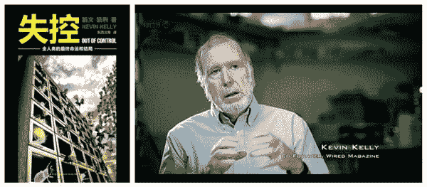

**蔡文胜**：我和王峰的看法一样，我之前也推荐过 KK 的这本《失控》，书里讲的很多内容都会在区块链社会里兑现，特别提到人类社会结构可以像蜂巢那样。

但是，如果我们人类成为了爬在各自公链和社区里的那些蜂群，我不希望是这样。因为这说明世界上 90%以上的人，都在干着重复的事情，没有理想也就没有未来，这其实是挺悲哀的一件事情。我更希望未来区块链世界会有几个大的公链存在，然后建立一些基础的应用，出现百花齐放的局面，同时成千上万甚至几十万个不同的区块链社群存在，形成了就像地球一样千奇百态的生态景象。

最近有一部电影，斯皮尔伯格导演的《头号玩家》，我看了三遍。我觉得《头号玩家》给我们的启发更大，随着 AI 人工智能的发展，未来可能很多人只能活在虚拟世界。这让我们反思，它到底是不是我们未来想要的生活？

或者未来还有更伟大的发明，让每个人都能去干自己喜欢的事情，而不是千篇一律的工作。那才是真正激动人心的梦想世界！

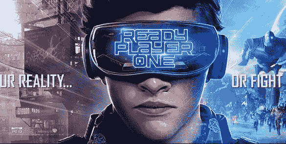 

电影《头号玩家》剧照

所以，不管是人工智能也好，区块链也好，它的确会促进人类社会往前发展，提高社会运行效率，产生更大的财富。但这里面，我觉得必须加入人文精神，这个世界才有意义。

如果我们一味追求技术的进步，一味追求效率和财富，其实最终并不会快乐。不管是我本人，还是我接触到的很多有钱人，说实话，当你财富到达一定阶段以后，你吃的就那么多，你穿也就那么多。最终，大部分人都会去反思，我们应该为这个社会做什么，推动这个社会往哪个方向去发展？这其实也是我自己坚信的。

人工智能无论如何发展，它也很难代替人类。因为人工智能是冷冰冰的，没有情感，没有思想，也没有灵魂。在相当长的时间里面，人工智能都很难代替人类。

像区块链的这种价值传递，他是用基础逻辑去解决我们的货币问题，但未来真正的价值是什么？我觉得，不一定是货币形式。如果未来通过区块链，把我们人类的情感、思想变得有价值，比如文学家思考的价值可以直接传递和体现，那就更加伟大了。

**王峰**：文胜，如果今天你还是那个初出茅庐的追风少年，你会 All in 哪个领域？

追风少年蔡文胜

**蔡文胜**：我觉得我现在还是个初出茅庐的追风少年。一个人的年轻不是年龄，是他的心态，当你自己觉得很年轻，即使到 80 岁，你也依然可以追风。

我会不断的去拥抱新变化，现阶段我还是全力做好美图公司，同时会关注人工智能、区块链等新技术的应用，未来可能还会出现更新的技术革命，我想我还会去全力投入。

**Final question**

**王峰**：你的未来人生理想是什么?

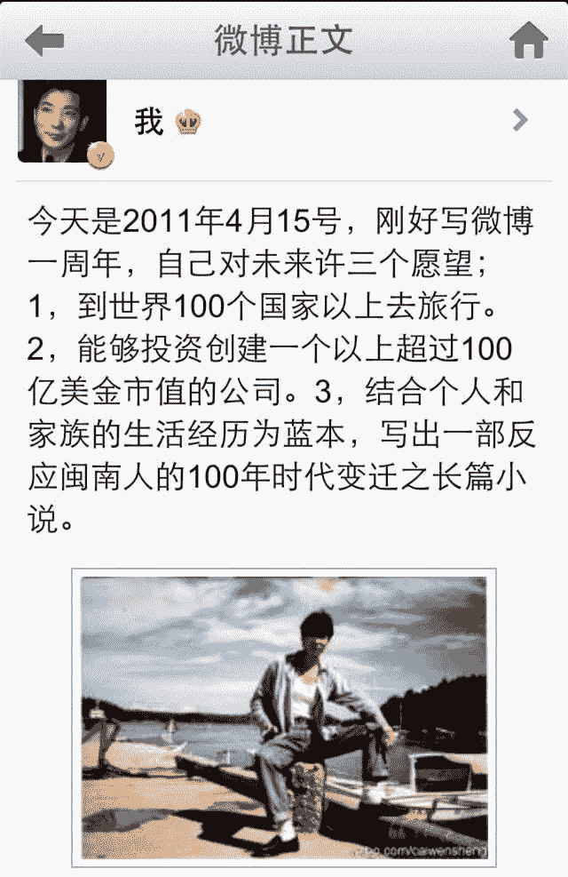

蔡文胜 2011 年在微博上许下的三个愿望

**蔡文胜**：很遗憾，2011 年的这三个愿望都实现一半而已。到 100 个国家旅行现在实现 50 个左右，我觉得人生就要到处去看看，才算真正来过这世界。

第二个愿望做到一家百亿美元公司奋斗中，希望不久将来可以做到，离的最近是美图公司，我会更加努力！

第三个愿望，我还是有家乡情结，特别我从农村出来，后来出国，再回到厦门，去北京创业再回到福建，我从高中辍学排地摊，做服装做建筑做各种各样生意，再到互联网高科技，经历很多不同的过程，如果能够记录写出来，是很有意思的事情。

本文为火星财经原创稿件，版权归火星财经所有，未经授权不得转载，转载须在文章标题后注明“文章来源：火星财经”，若违规转载，火星财经有权追究法律责任。