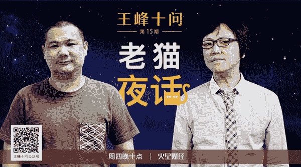
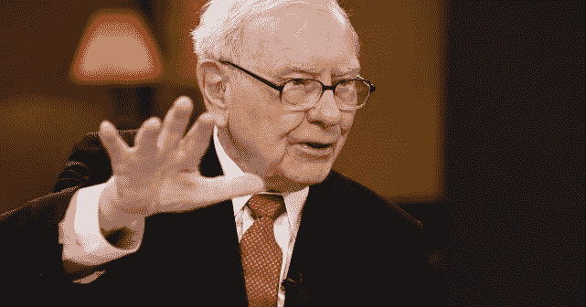
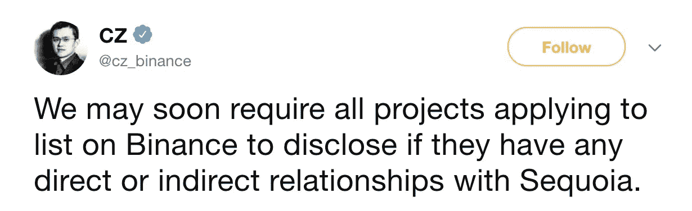
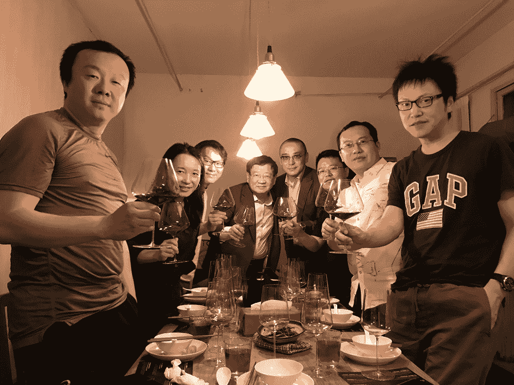
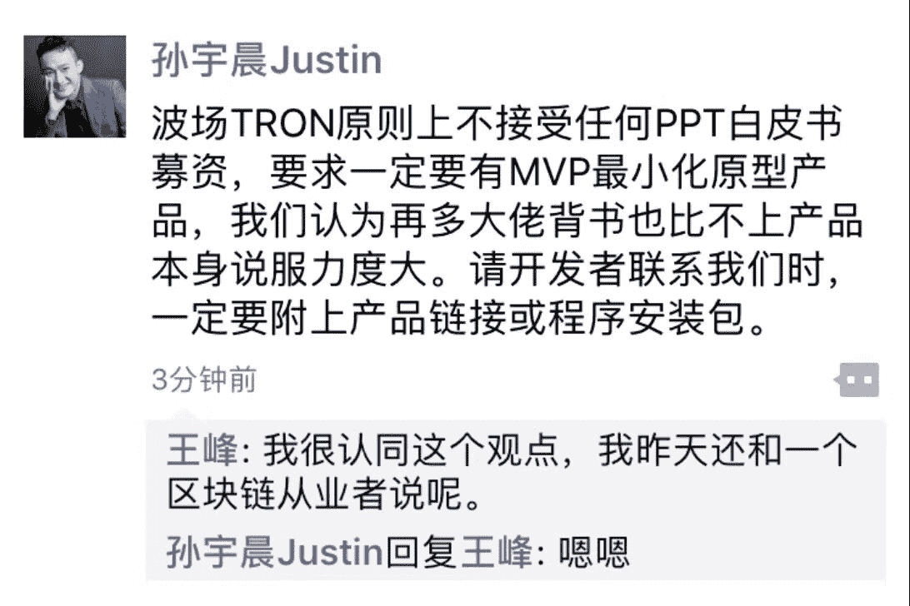
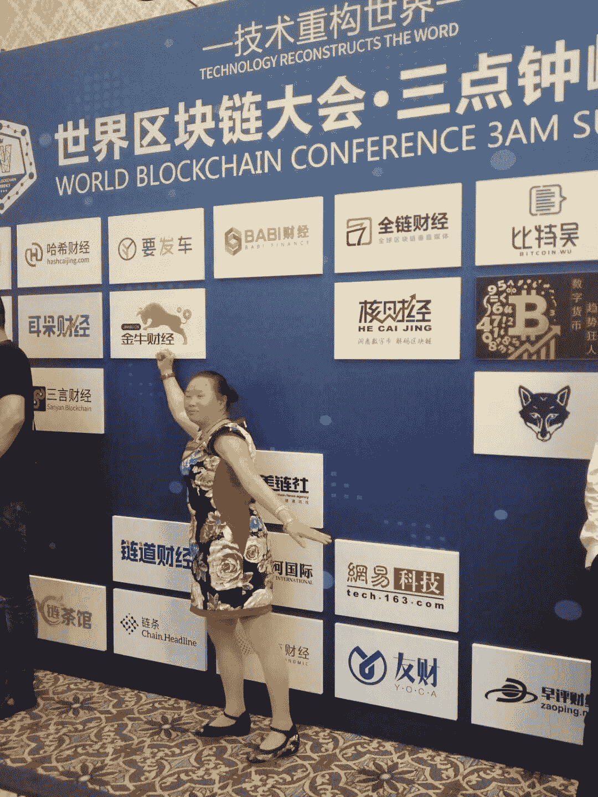
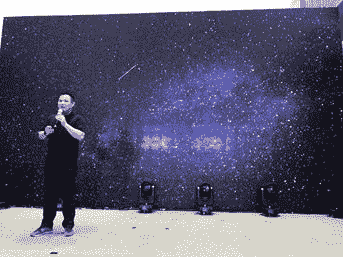

# 王峰十问第 15 期 | 币圈大佬老猫：相信中本聪，还是相信巴菲特？（附音频）

> 原文：[`news.huoxing24.com/2018051017533566446.html`](https://news.huoxing24.com/2018051017533566446.html)

**对话时间**：5 月 10 日 22 点

**微信社群**：3 点钟火星财经创始学习群

**对话嘉宾**：

老猫：INBlockchain 联合创始人、雄岸基金管理合伙人、拥有多年区块链行业投资管理经验，现任 Big.one CEO、曾任云币网首席运营官，其公众号“猫说”累计发表行业文章 200 余篇。

王峰：火星财经发起人，蓝港互动集团（HK.8267）创始人，极客帮创投合伙人，曾任金山软件高级副总裁。 

**以下为对话原文整理**：

**王峰**：先让我们看一看他的经历——老猫传奇。年轻时曾在江苏常州一家事业单位工作，30 多岁辞职去了上海。后来，给朋友打过工，在淘宝上卖过保暖内衣，还给某体检品牌运营过淘宝店。

2013 年 3 月，在微博上偶然得知在国内就能买到比特币，便立刻用手里仅剩的 6000 元买下了 20 个比特币。自此，开始参与比特币投资。

2014 年，创建国内第一个比特币购物平台“菠萝集市”，并因此接受了福布斯杂志的采访。同年，云币网正式上线。

2016 年，作为 ETH 早期价值发现者和布道者，推动云币网成为国内第一个上线以太坊的交易所。

2017 年，发起成立 ICOINFO；与李笑来联合建立 INB 硬币资本，投资区块链项目超过 30 家，整体回报超过十倍。

2018 年，出任雄岸基金管理合伙人，该基金总规模为 100 亿元人民币。

老猫还打造了区块链行业第一自媒体《猫说》，独立撰写行业相关文章近 200 篇，是行业关注量和阅读打开率最高的自媒体之一，并建立了行业最大的社群之一“猫友圈”。

**第一问**

**王峰**：先从股神对比特币的诋毁开始吧。我注意到你批评过他不懂比特币，甚至也对互联网投资不感冒。在今年的伯克希尔·哈撒韦公司股东大会上，九十岁的巴菲特称加密数字货币不会有好下场，比特币本身没有创造任何东西，“你全部指望的不过是下一个买家以更高价接盘。”巴菲特的老搭档芒格甚至说，应该像躲瘟疫一样避免比特币。几天后，比尔·盖茨接受 CNBC 采访时说，“作为一类资产，比特币没有产生任何东西，所以你不该指望它会涨。它纯粹是‘博傻理论’那一类的投资;有机会会做空它。”这里给大家科普一下博傻理论(greater fool theory)，是指在资本市场中(如股票、期货市场)，人们之所以完全不管某个东西的真实价值，而愿意花高价购买，是因为他们预期会有一个更大的笨蛋，会花更高的价格从他们那儿把它买走。通俗点，实际上就是大家经常说的“击鼓传花”。

巴菲特被称为美国“股神”，是世界级的投资大师，与巴菲特共进午餐曾经拍卖到 260 万美金，如今依然有很多人像朝圣般去竞拍，很多聪明人(比如 oppo、vivo 幕后大老板段永平，私募领域大咖赵丹阳，还有我们游戏行业出身的朱晔)都参加了巴菲特午餐。巴菲特的言论，会造成跟风炒币族们的恐慌吗?为什么巴菲特、芒格、盖茨等三位美国上流社会的顶层精英都对比特币嗤之以鼻?真的是受到他们过去投资经验限制，而没有看清比特币的实际价值吗?还是另有原因?对于很多人来说，相信巴菲特，还是该相信中本聪呢?这可能是个问题。我相信你会有自己的一番见解。

**老猫：**这个问题很高级啊，不过，之前我还真写过相关的问题。

这个问题其实去年我在我的公众号《猫说》中有过解读，但既然你在这里再次提问这个问题，我想在这里补充新的思考。

之前巴菲特的言论，只不过是简短的说不看好比特币，我之前的解读无非是，这是他的年龄和对高科技行业理解的局限造成的，再进一步的话，就是因为他富国银行和 JP 摩根股东的身份，使他因为利益的关系站队，仅此而已，没必要做过度解读。

这是我去年文章中表达的意思。但这次巴菲特的表态，明显是有“气急败坏”的感觉，说比特币是老鼠药，不会有好下场之类的话，基本上是不想讲道理，直接下结论的做法。而他的合伙人查理芒格也补刀说：比特币不能创造任何东西。看到这里的时候，我是直接笑崩了。一个纯粹做金融投资的公司，竟然能说比特币不能创造任何东西，我只想问：他们的伯克希尔股票，每股高达 29.999 万美金，一个历史上从来没有过分红的股票，请问，这个股票创造了什么东西？

如果把比特币看做未来全球最大金融系统的股票，可能是一个比较靠谱的类比，那比特币能创造的东西，可比伯克希尔股票多多了，以比特币为基础的整个区块链行业生态系统完全是伯克希尔无法比拟的。

**我要说重点了。**现在伯克希尔的股票市值是 4920 亿美金，比特币的市值才 1593 亿美金，只是伯克希尔公司股票的三分之一，在我个人看来，作为未来全球最大的金融系统的股票，比特币市值超过伯克希尔公司的股票市值，不过是时间问题，但如果一旦这个事情发生，对伯克希尔的投资者来说，可能会带来信心的溃败，巴菲特的神话将不在。这是我刚才新浪股票查的数据。所以，这才是巴菲特气急败坏的原因。

对他来说，比特币确实是老鼠药。至于比特币有没有好下场的事情，以巴菲特的年龄，应该是看不到了。另外一个问题，巴菲特能成为投资大师，是特定的时代造就的，我始终把成功看成 30%的努力和 70%的运气。

我之前研究过巴菲特，他其实就干了两件重要的事情。奠定他投资大师地位的第一件事情是他 1964 年（当时他 34 岁）收购伯克希尔公司，第二件事是 1988 年投资可口可乐，在这两件事情面前，他的其他投资可以忽略不计。所以，不要神化巴菲特，特定时代有特定的机会。如果把他合适的投资年龄放在日本的泡沫期，搞不好就是投资失败的典型，但这样的典型是没有人会记得住的。

至于巴菲特、芒格、盖茨等社会精英对比特币嗤之以鼻，这个问题回答起来很无聊，我有个类比，你们肯定会笑。

就像一个 3 岁的小孩，对你说：我要打败你，你一定会嗤之以鼻的，并且会认为他不过是个熊孩子！但是，20 年后，你可能就不配做他的对手了，一切不过是时间问题。另外，我不觉得会有什么恐慌问题。区块链行业，懂得人就是懂了，不懂的人就是还没懂，他们本来就生活在两个不同投资观念构成的世界里。

**所以，最后一个结论。**在这个世界里，巴菲特不是神，不过是一个气急败坏的可怜老人，那个他看成老鼠药的东西，正是这个行业里每个人期待拥有的打开未来世界的钥匙。这个问题，我就回答到这里。

**第二问**

**王峰**：最近的另一个热点是币安红杉之争。5 月 7 日，币安 CEO 赵长鹏的一条推文激起了千层浪，称未来申请上币安的项目，需要披露是否接受了红杉资本直接或间接的投资，算是对红杉一纸诉状的还击。之所以币安和红杉关系闹得这么僵，在于红杉没有成功投资到币安。红杉投资币安是先签协议，再支付投资款，但期间需要 6 个月的排他期，然而，排他期数字货币价格一路飙涨，估值价格变化浮动很大，后来 IDG 资本横刀夺爱，给出币安 4 亿美元和 10 亿美元的两轮估值，最高超出红杉估值的 10 余倍。说实话，我确实认为很多大 VC 至今还保留的六个月排他期的条款是霸王条款，后来的很多 VC 和天使这方面做得很好，VC 真的要与时俱进，但是如果你是赵长鹏，该怎么选择?也有人说长鹏聪明到没有朋友。

**老猫：**这个问题，得罪人啊。不过，我冒险来回答下吧（币安何一也在群里）。

关于红杉和币安谁占理的事情，我不是当事人，仅仅凭大家发出的文字的东西，我是很难正确判断的，我甚至无法判断是不是存在红杉所说的违约问题，我相信法庭能做出正确的判定。这个问题，其实外人无解。

如果我是赵长鹏，我当然会选择对己方利益最大化的方向，因为自己的利益最大化，实际是股东利益和用户利益的最大化，在这个事情上，己方利益和股东权益和用户利益应该是一致的。

**王峰**：我经历过五六期美元风投，其中一些感觉可以悟出来。我们都不是当事人。

**老猫：**顶尖聪明的人从来都是孤独的。所以，如果因为这个原因没有朋友，换做我，也认了。

**王峰**：有趣的是，币安红杉事件还没平息，火币又强势发声叫板币安。5 月 8 日，火币网 CEO 李林发布了一条朋友圈：火币是红杉资本投资的企业，不保证所有红杉投资的项目都会上线，但对于像红杉等这种全球顶级 VC 投资的项目，在交易所上币审核时会得到加分。聪明的李林，显然是为了给红杉搬回颜面而发声的。无独有偶，恰恰在李林发声的头一天晚上，在徐小平老师和冯波的私家饭局上，我目睹了 OKCoin 老板徐明星和李林交杯痛饮的场面，照片露出后还引发了各方猜测，哈哈，实际饭局里讨论的话我暂时不敢说。实际上，这不是两大数字货币交易所老大第一次一起吃饭了，如果当时赵长鹏在中国，高概率事件是他们三个人会在一起喝酒。我认为主流交易所之间的关系，几乎是同乘一条船，一荣俱荣，一损俱损，你觉得呢?

**老猫：**我得搞清楚有多少人在这个群里，哈哈哈，那我硬着头皮来了。火币和 OK 的关系一直很好，除了经营主体不同，很多事情一直都是神同步的。他们成立得时间相差不多，最早他们在一个楼里办公，后来两家公司距离也相隔不远，两家的老板在 2013 年前后也常常一起喝酒撸串，本来私交就不错。

下面开始得罪人了。后来两家一起用免比特币交易费的方式，直接导致了 BTCC 被边缘化。两家在差不多的时间上线了杠杆交易，2014 年 9 月份在北京相隔两天都作为主场开了场面盛大的会议，我也是在这个会议之后，加入李笑来的貔貅团队（后来的云币的）。最后一个神同步 ：2017 年 3 月 8 日两家更是同一时间停止了比特币的提币，同年 9 月 16 日同步宣布停止比特币交易。所以，如果你非要说这纯粹是巧合，那我只能说你智商感人，哈哈哈。感觉气氛很凝重。

另外，有个历史性事件是赵长鹏和徐明星之间当年因为 bitcoin.com 的域名合作协议的事情有过严重的争执，是当时圈内讨论的焦点，我当时还写了篇文章评论，刚才我去巴比特看了一下，我的专栏竟然找不到了。狠话来了，千万不要揍我，这件事情应该彻底的终结了他们之间本来可能还存在的一点友谊，这事件之后，我觉得赵长鹏和明星在一张桌子上吃饭的可能性就很小了。另外，我不觉得主流交易所之间是同一条船，但火币和 OK 成为一艘双体船倒是可能的，其他的交易所在他们看来，或许甚至没有构成友军的资格。

说到这里吧，估计要几年没人请我吃饭了。

**第三问**

**王峰**：我们再聊一次 BM(Daniel Larimer)，看他这几年的个人经历，他应该算是全世界最成功的区块链连续创业者。BM 非常不简单，过去短短几年间，他相继创立了比特股(BitShares)、Steemit、EOS 三个重磅的区块链项目，虽然很多人批评他有始无终，但从目前市场反馈看，他的几次创业一次比一次受到瞩目。前不久，BM 宣布 EOS Dawn3.0 正式发布(近日已经发布了 Dawn4.0 了)，其提出的 21 个 EOS 超级节点竞选也引发了全球关注，引发了很多人争相效仿。显然 BM 的商业设计能力也开始越来越成熟。从这个角度上看，仅仅是讲 Code is law 也许已经过时，将技术能力、组织模式创新、新社群、杀手级场景应用以及生态体系构建结合起来，才能在未来区块链的发展中找到存在。我的预感是中国会出现一批类似 BM 这样的人进入区块链领域，靠产品说话，敢于不断折腾。

我之所以讲 BM，是想提醒国内的区块链行业不要浮躁，人家拿产品说话，我们拿白皮书说话，一大批跟风赶超的人进来，不会写代码不会做产品，但先学会了写白皮书，就到处开会去了，这个现象不是好事。昨天，Tron 的发起人孙宇晨在朋友圈上说：“波场原则上不接受任何 PPT 白皮书募资，要求一定要有 MVP 最小化原型产品”。老猫，我认为，区块链创业，已经呈现出与互联网越来越相似的局面，拿产品说话，而不是拿白皮书说话，创业者必须有真刀真枪，不能搞花拳绣腿，对此你怎么看?硬币资本今年的投资选项目的依据是什么?

**老猫：**本来就应该这样的啊，难道不是么？之前白皮书就能融资，也是市场因素决定的。投资和被投资，本来就是你情我愿的买卖关系，我说得这么直接，行不行？资本太多，投资标的少的时候，啥都能端上桌子，但现在投资标的已经太多了，能被看得上眼的就少了。

我说下自己的观点吧，继续得罪人。我今年元旦宣布我个人不再进行任何投资，一方面，是我已经没有赚钱的欲望了，另一方面，也是很难有被我看得上的项目，毕竟看过太多项目，这个行业里，自我感觉将来会成为独角兽的不少，但实际上，大多数项目能像羊驼一样活着就不错了。羊驼的别名你们懂的。

我愿意以年为单位，去等待一个霸王龙级别的存在。但投资机构和我的做法肯定不同，他们本来是有投资的使命，也是他们的业务模型，所以，选择一些靠谱的有成长空间的项目去不断的投，是合理的做法，但项目越来越多，他们选择更多，必然变得更为挑剔。所以，对于创业者，没有真刀真枪就别出来丢人现眼了，区块链行业创业，是用一生的信用去下注，一切都是用信用来承载的，如果你下注失败，可能后面就没有东山再起的机会了。所以，我现在做事非常小心，我每一件事，都是用信用在为自己背书。

回答问题的最后一点。硬币资本的投资依据，应该依然是李笑来开源的区块链投资原则。另外，我现在并不负责投资的事情，所以，是否有新的变化不是很清楚，但我觉得既然是原则，就不会轻易改动。这个问题到这里算是回答完了。

[`github.com/xiaolai/INB-Principles/blob/master/Chinese.md`](https://github.com/xiaolai/INB-Principles/blob/master/Chinese.md)，这个网址，是区块链的投资原则，李笑来的 GitHub。

**第四问**

**王峰**：老猫，我们还继续说说 EOS，人家实在是太热门了，今年币圈情绪回暖全靠 EOS 了。如今，距离 EOS 主网 6 月上线还有一个月左右的时间，超级节点的竞选备战气氛日趋白热，截止到现在，全球有 74 个候选者（国内有 20 个）参与竞选。有人称 “这是币圈的一场美国大选”，更有人直接断言：“这是一场政治化的游戏。”对于 EOS 超级节点活动本身，你能否在这里给大家进一步科普一下？此外，我还有些好奇，为什么你要以独立的方式参与竞选而不是和你的好搭档李笑来合作，毕竟你们一起有硬币资本？

**老猫：**这个问题，我回答起来比较容易了。让我先吹个牛逼，超级节点这个词最早出现，应该是从我 3 月 9 日的公众号《风雨飘摇之际，我选择做个超级节点》开始的，我在谷歌搜索了下，在这个日期之前是没有这个词的。有订阅我公众号的，可以翻出来看到。其实我不只创造过这个词，在创造这个词之前，我还创造过一个词叫“区块链资产”，之前这个词也是没有的，你到现在去谷歌搜索这个词，排名第一的还是在我当时做 COO 的云币网页。另外一个可以证明是我创造这个词的人是沈波先生，不知道他在不在这个群里。

让我再吹最后一个牛逼，然后说正事。我还创造的一个东西叫区块链行业指数，这个指数 2017 年 1 月 1 日是 1000 点，现在是 12464.23，这个我们以后再说吧，这个话题很大。之所以连续吹几个牛逼，是想证明我能够独立创造一些东西，有的在现在看起来似乎还没那么重要，但如果我的这些小创造，能给行业带来哪怕一点点的便利，我都会很自豪。感谢王峰，感谢火星，给我这个吹牛逼的机会。我们[inblockchain.com](http://inblockchain.com)的网页上有指数，也有说明。

说正经的了，对于 EOS 的超级节点之争论，其实是被中国区块链媒体和互联网过分夸大了，在国外，这还是一个技术圈子的小事件，这也说明了为什么中国会占到将近三分之一的竞选团队。我有时候想，是不是因为我的加入，而让超级节点的竞争在中国看起来变得更加白热化了，但是，我对这个竞争白热化是乐意见到的。EOS 作为一个面向全球的区块链基础平台，有足够多的高质量节点来保障其性能是非常重要的。实际上，我觉得竞选的激烈程度还不够，我鼓励更多有实力的团队来参选。原本 EOS 的计划是 21 个 BP（超级节点），100 个普通节点，现在全球竞选的数量都只有 74 个，根据这个情况，可能会把普通节点改成 50 个，如果这样的话，哪怕没有竞选上超级节点，作为普通节点也是一个很不错的机会。普通节点也是有收益的。根据投票数量获得不等的收益。所以，如果有能力参加竞选的，欢迎参加。至于政治化游戏之类的，我觉得都是一种过度解读，内心装满了政治和游戏的人才能把这件正经事政治化、游戏化，而我看到更多的是技术和人文，因为我既不懂政治，也不会玩游戏。

下面说说不结盟的事情。为什么我会坚持不结盟，这是因为，我始终认为每个超级节点应该有独立性，如果超过一半的超级节点之间是盟友关系，那万一有关于项目未来发展决定性的投票，就是这个联盟说了算了，这对项目的发展是不利的，所以，我会坚持我的独立性，不和任何一家结盟。我也是保持我不结盟的原则，还请多多包涵。

给国内竞选小伙伴一个忠告，又要得罪人。实际上，在全球节点开发者的网络会议上，除了我们，很少有其他团队参加，我呼吁国内的节点不要光记着参加各种聚会，真正的技术沟通很重要的。至于贿选，现在 EOS 官方表示会违反宪法，另外，每个币能投 30 票，我觉得贿选的意义很小了。因为贿赂成本可能太高了，基本经济学的逻辑吧，为了给国内超级节点的竞选者们一些帮助，我会在这两天在我的 EosLaoMao 官网上把我们收集的超级节点部署相关的重要资料分享给大家，我不愿意参与结盟，但不会吝啬把我们的技术资料分享给其他节点。至于胜算，我从来没有太在意，但问本心，不问前程，或许这也是所谓的佛系吧。

最后说说为什么我独立参选。我之所以以个人身份独立竞选，是因为这个事情本来我觉得不大，没有必要调用 INB 的资源，没想到后来这个事情被媒体发酵放大了，反而好像我以独立身份参加竞选有点另类，不过，我并不会因此而作什么改变，我这么佛系，何必要如此功利的拉上 INB 呢，李笑来该给我投的票肯定会投的啊。回答完了。

**王峰**：我们接着聊 EOS 超级节点，温州帮、宝二爷、交易所、矿池、社群和一些专门面向区块链的资本都在积极备选。我们火星财经也以全球首个专业区块链媒体的身份入场，并在 5 月 5 日宣布正式启动参选。我认为，对于一个新兴的技术领域和市场领域来说，我们专业媒体的首要任务是科普，并让大众看见各方意见。我曾经向引力区的廖洋阳请教了一些这方面的知识，也得到了他的一些鼓励，我在他身上看到了 EOS 信徒般的虔诚，至少他身上衣服和帽子上都印上了 EOS Logo，也上网看了他的一些视频演讲，说实话我被他感染了。我们安排了一个技术合伙人带队参选，也有 EOS 开发者邀请我加入了他们的微信社区，我发觉里边的气氛和我们火星财经学习群一样热烈。老猫你是怎么做 EOS 超级节点竞选准备的呢？

**老猫：**问我怎么准备是吧，我 13 号晚上会做个专题视频访谈直播，在熊猫直播。 似乎整个直播在回答你这个问题，不过是我和我的小伙伴们做直播，[eoslaomao.com](http://eoslaomao.com/) 上会有入口，13 号晚上 8 点 30 分。

**第五问**

**王峰：**有人开玩笑说区块链最大的应用是开会，咱们聊聊这个话题。现在每天都有很多会议邀请，今天澳门，下周新加坡，接下来是迪拜和普吉岛，后面还有柬埔寨和马耳他等等。我很感激，但大部分我都拒绝了，确实是有些不堪其扰。前不久澳门的区块链峰会，有人发照片黑“大妈上墙”，我跟发起人玉红说，这恐怕是最好的一次区块链普及宣传了。媒体话音未落，新加坡区块链大会就开始了。哈哈，但纵观整个行业，我有点困惑：我们需要这么高密度地带着一帮中国人去全球各地开会吗?

**老猫：**严肃的回答这个问题。我其实已经用实际行动回答了这个问题，我几乎不参加任何一方组织的会议，在这个事情上，我是认真的，我认为全球各地的会议，才是行业泡沫的表现。之前是行业上升期，很多公司和个人赚钱太容易了，根本不在乎那些会议的成本，这才会什么会议都有人去，而一些收高额门票以此为盈利方式的主办方也是看中这一点，找几个大 V 过来，就可以攒出一个峰会。会议过程不重要，重要的是凑一个局，互相刷个脸熟，以此找到存在感。有些参会者以为刷次数多了，就能把自己刷出自己是大 V 来了。2018 年，我听说过的各种峰会超过 10 场了，谁能告诉我，有没有哪个会议出了重要的成果？有没有哪个会议对行业的趋势有重要作用？我们一个小公司，如果开会，都会追求一个会议成果，但币圈峰会只追求热闹的感觉，追求参加会议的存在感，其实，这个需求和大妈去跳广场舞是一样的，所以，在各个会场上，见到大妈，一点都不意外。**这句里面有重点，会议=广场舞。**

**王峰：**哈哈，我怎么认为没有大妈入场的会议，都不是真正胜利的大会呢，很难上新闻联播。所以，三点钟澳门峰会是非常成功的。@玉红

**老猫：**那让我来再吹个牛逼，我也是组织过会议的，2017 年 7 月份，我在上海搞过一个 400 人的会议，有可能是行业会议中唯一一次没有大妈的会议。这个会议很低调，没有任何宣传，甚至没有公开卖门票，整个会议，主要是我的社群成员，但嘉宾阵容非常强大，当时市值排名靠前的交易品种的 CEO 大多数都到场做了演讲，其中包括 EOS 的三位重要成员，当时有同行说：老猫，你这个会议开的，以后其他人没法开了。

**廖洋阳**：这点我和老猫意见不同，我和社群接触的过程中认识到的是，群众们需要 meetup，这是需求。

**老猫：**我要说下这次会议的成果：这次会议是 EOS 在中国启动的开端。我不知道这个群里有没有人去参加过这个会议，毕竟我才进来，还不知道这里有谁。薛蛮子其实到了现场的，还被踢了，所以，我对开会本身并不反感，但不会参加任何看不到成果的会议。人民群众需要会议，这个我同意，大妈也需要广场舞，我也同意。

**网友：**似乎任何行业会议密集程度都是泡沫指数，会销是就是互相吹泡泡，所以这就是我问您出门前会决定参加什么会议?

**老猫：**我习惯性直接回绝，不是我孤傲，实在是我看了太多无聊的会，怕躺着也中枪。

**第六问**

**王峰：**很多刚进入区块链的朋友普遍会问我一个问题，就是白皮书上看不到谁是真正的发起者和创业者。我知道，这里面有一些客观原因。但从投资者的角度看，他心里会失去坐标感，他看不到，也没法衡量创始团队，尤其是核心人物，无法感知，更无法评价。从这个角度看，我倒是觉得孙宇晨干得漂亮，有无数坑，他冲在前面，大家能看到他的那股子精气神，能评估他对这件事有多投入。我前面说中国的很多区块链创业者只学会了写白皮书，而且我猜 90%的白皮书都不是自己写的，没有产品原型也就算了，很多项目甚至没有实际创业者敢于为自己站台，你怎么看这种隐形人现象?

**老猫：**隐形人现象，是特定时期的特定现象，也是在特定的监管状态下的一朵奇葩。毕竟没有谁愿意在高压态势下顶一个“非法集资”的罪名，但这样做显然对项目的发展很不利，因为有可能信任基础不存在了，而这种情况会导致项目代币在市场表现不佳，影响项目社区的建设。孙宇晨我不评价，他的“成功”没有任何模仿的价值，他的项目如果在现在发行，是不是会匿名也是不确定的。时间段不同，用来比较会失去合理性。隐形人的项目有两种，一种其实是好项目，只不过背后是成熟的大公司，考虑到公司业务的安全，在海外业务主体没有建设完成之前，暂时不公布主体，是一种无奈的选择，但这种项目通常会在比较靠谱的平台发行。毕竟区块链是风口，许多公司都在暗暗较劲，但在落实的时候，却有政策障碍。另一种就是烂项目，假装我前面说的好项目来骗钱的，这种项目消失和跑路是正常的，我只能建议普通投资用户对于没有任何背书的隐形项目敬而远之，最起码，选个靠谱的平台。

**李笑来：**不怕得罪人， 反正天天躺枪。

**老猫：**我反正也不常回来，哈哈哈。这个问题到此为止吧，实在没啥好多说的。笑来一来，我更加起劲了，后面啥问题，快抛出来。

**下面为网友问答**

**点头大付：**当年比特股搞理事会制度，BM 自己占了 6 个，5 个是好友。

**老猫：**这就是我认为不结盟的重要性。

**第七问**

**王峰：**有一个有意思的现象：在区块链世界取得很大成绩的人，据我观察，貌似都不是在互联网时代有那么显赫的位置。(当然了，赵东例外，他当时做的墨迹天气已经很不错，只不过没找到商业的着力点。)比如老猫你，曾经在在淘宝上卖过保暖内衣，给某体检品牌运营过淘宝店，用主流意识语言表达就是“从基层干起”。老猫的名字是从店名来的吧?怎么淘宝店里的老猫，三下两下就摇身成为了信者云集的币圈大佬?这个过程有哪几个关键转折点?

**老猫：**这个问题问反了吧？我觉得正确的问法应该是：为什么在互联网时代的显赫人物在区块链世界都没有建树？得罪了@王峰。

**王峰****：**逆否问题啊。 

**老猫：**其实，任何成功机会，都有时代感的，譬如，乔布斯和比尔盖茨这个年代，就出现他们这样的成功机遇。而互联网时代，网易、搜狐、新浪也占据了他们的位置。无线互联网时代，BAT 成为了赢家。这句比较扎心：已经成功一次的人再次成功，比之前没有成功过的人还要难。新的机会出现的时候，一开始看起来都像个玩具，如果区块链行业没有做到足够大，之前的大玩家是不会进场的，那么一开始就参与的人就会有更多的机会。这个问题李有讲到我个人的问题，这里我准备敞开聊下。我最大的机缘是 2014 年在行业的寒冬加入了这个行业，并且遇到了李笑来。那时候阿里巴巴刚上市，我觉得该离开电商行业了。毕竟，风口红利结束了，阿里巴巴要来收割了，从此之后，很少听到逆袭的电商。 

**王峰****：**电商的人和做游戏的人，都在运营有独到见解，对数据解读能力强。 

**老猫****：**让我认知升级并不断成长的最重要的人也是李笑来。既然李笑来来了，我就多说他一些。 

**王峰：**李笑来老师帮助过很多人啊，哈哈。 

**老猫****：**在遇到他之前，我只是一个“能把一件事情写明白”的初级写作爱好者，但因为他莫名其妙的建立了一个支付宝的社群《比特币生存指南》，让我运营，到差不多的时候，他把群主转给了我，让我开始有了工资以外的收入。这个群其实是个烫手山芋，运营一个社群，没有任何经验，你说烫手不烫手？我那时候在笑来面前特别紧张，怕把这个事情做砸了，那很丢脸的好不好。迫于社群的成长压力，我不断学习，不断输入，然后做分享输出，后来，为了把输出体系化我开始写了公众号，迫于公众号内容的高质量输出的需求，我开始拼命努力研究这个行业。而这个过程，我的认知也不断升级，并且以我的认知能力带动我社群很多成员实现了财富越级，这些成员的口碑和传播才造就了我的声誉。如果说我有点小小知名度的话，可以说是被笑来推动的，然后被这个行业逼出来的，这也证实了我之前说的，所有的成功，都有 70% 的运气，当然另外 30%来源于我自己的努力，这个我就不谦虚了。我为了认知升级，研究行业，写稿子，多少个晚上 3 点钟以后睡觉已经无法计算了，如果我这个认知水准在行业里还无法成功，那上帝眼瞎啊！所以，3 点钟对我的意义，可能是很多次晚睡觉。 

**陈伟星：**有一种共识，叫欺诈性共识；所有帐都搞不清晰的基金会，对运营社群韭菜都是不合区块链精神的。我觉得现在太多的社群，基本的公共财富都没管好，奢谈共识啊，伪共识啊。我觉得现在社群的最大问题，就是组织者不照顾参与者。

**老猫：**陈总，我的社群给我交的钱，是我自己的收入，不属于社群共同资产，我只负责提供知识，不负责为别人保管资产。谢谢陈总光临，我还继续会发这个问题。 

**陈伟星：**你这个教知识没问题，不是发币。我指的是发币的社群。 

**老猫：**误会，我刚好说到社群，脑子没转过去。

**老猫：**在这个行业里的成功，是运气加努力的成果，只不过这个行业发展太快了，以至于，我这个本来只是小小的成功被放大了，所以，我并没有觉得自己是什么大佬，那只不过是别人的抬举而已，我要真觉得自己是大佬，那就是和傻 X 没区别了。这个问题到这里好不好。各位大神，那个小圈子只是我胡言乱语的地方，没必要进去，会失望的哦。 

**陈伟星：**为了谁获得信任，谁就获得真正的共识。透明、公开、公正、共享，这样才能获得真正的共识支持。 

**老猫：**严重同意，信任是这个行业最重要的船票。 

**陈伟星：**说实话，我真心觉得你们坚持那么多年，为整个区块链做了历史性的贡献，这个不是后来者随便能比的。我说的只是当前的问题，就事论事啊！

**以下为网友问答：**

**网友问**：按照冰山理论，我们看到的区块链的样子，会不会只是上面的一角？BAT 的布局，是没有浮出水面，还是我们故意的视而不见？

**老猫：**一切皆有可能，但我觉得他们目前应该是在试水，不过，区块链的本质，是解构中心化的，所以，这个尝试，对他们来说，有点两难。

**第八问**

**王峰：**前段时间杭州成立百亿雄岸基金的发布会上，你也做了一个演讲，我看讲得挺好。但我发现其实大部分人没注意到你，因为大部分媒体的目光都给李笑来了，哈哈。作为硬币资本最重要的合伙人之一，你好像一直很低调，虽然你写了一手观点独到的好文章。就连你们在硅谷的合伙人 Eric(他前段时间是火星主群的副群主)，也比你出镜多，一个美国人北京话说得比本地人都好，都快变成网红了。我还看到你的文章说，你在硬币并不负责投资，你在其中到底扮演什么角色?从这点上说，我觉得你和李笑来的关系，有点像真格基金徐小平和王强的关系，一起搭档多年，互相信任，但一个是极其活跃的掌舵人和社会活动家，一个是深居简出的创业者教练兼心灵按摩师?

 

**老猫**：大部分目光关注李笑来是对的，他配得上这个关注。本来他就一直是行业瞩目的焦点。我的演讲从来只是为了那些能听懂的人，我认为一样的话，说给不同的人听，效果是不一样的，所以，我现在很少公开说话，能听明白我话的人，很多是我公众号的读者，以及跟着我社群一路成长起来的人，有他们，我觉得很满足了。另外，Eric 当然应该多出镜，他是我们的一个宝，我也很欣赏他，我也觉得现在应该让年轻人多出面，不管是能力，还是精力，都有优势，这个行业注定将来是年轻人的世界。我和笑来尽管是合伙人，但他在我心目中一直是明灯一般的存在，所以，能成为他合伙人是我最大的荣耀，这也是我最为自豪的身份。如果没有笑来，我充其量是个炒币赚了点钱的人。  

我们 INB 内部确实存在分工，笑来负责投资基金业务，我负责海外业务和新兴业务，我们之间确实存在着非常高度的信任关系。我并不在意所谓的定位，顺其自然，做自己喜欢的事情，做自己判断未来会很牛逼的事情，这可能是我认为“自由”的一种方式。这个问题，到这里啦。

**第九问**

**王峰**：我试试八卦一问，江湖久有传说，说你和李笑来有一个微信群，入群门槛是 500ETH(我晕，火星群搞了这么久还是免费)上次他参加王峰十问我居然忘了问他了。我注意到，李笑来在 2017 年度总结里有段话：“2015 年年底的时候，我创建了一个收费社群比特币生存指南，后来我交给老猫同学的时候，这个群里面大概有两百多人吧，老猫接手管理。短短的两年不到的时间，在这个群里已经出现了很多的亿万富豪千万富翁。”这是真的吗?过去这几个月市场一度很冷，数字货币行情也是大跌，最近才开始回暖，这段时间你群里的朋友们情况怎么样?说说那里边的人和事情。

**老猫：**看来这个群快要收费了，这是找我取经呢。不过，你可能把两个事情混为一谈了。如果想学习收费，后面的内容是非常重要的。

**王峰：**下来请教你如何做付费转化设计，还有如何提升 Apru，感觉我开了一个传奇私服呢。

**老猫**：你说的 ETH 群应该是笑来投资部门筛选合格投资者收的 600ETH 的群费，但这个群现在只有少数成员了，大多数已经退出，并且退还了他们的 ETH。以后别人想进去也不可能了，这些留下成员才是筛选出来的真正配得上和 INB 一起投资优质项目的合格投资者。

你说的肯定不是这个，所以，我先理清一下。不过，这些 ETH 一个都没动，我全给保存着，我们有计划为这些人用这些币做一些意向不到的事情。至于比特币生存指南，确实是笑来在支付宝创立的群，一开始免费，后来收 88 一个人，我接手的时候 200 人左右，那时候可能是收 198 一个人，后来人越来越多，我迫于压力，收费也越来越高，最终高到 8888 一个人。我不知道这个群里有没有我社群的优秀成员，如果有，来喊一声，没人会打劫你。

这些人大部分现在还在我一个封闭的 500 人的满员群里，外面人根本进不来，每个位置空出来都有很多人抢，要说群，我可能只在这一个群里，其他群我都退完了。

我的群不是消息群，我之前的社群分享，都在公众号里面的“老猫茶馆”系列里面。大多数讲方法论，如果我用消息带着大家炒币，你们觉得我配得上现在名声吗？我刻意留下分享记录，也是为了证明自己，传播的是知识，是认知，而不是消息和跳大神。我前几天整理了下我的公众号。老猫茶馆真正持续了半年，每周都做分享，从 2016 年 6 月初写到圣诞节。

我现在有考虑把这个社群转移到密信里面去，这样能扩大规模，突破人数限制，也会开启收数字币的年费模式，但可能采取  资产+年费的自动验证模式，毕竟一个社群也需要新鲜血液。我希望用新的社群管理工具，继续我的社群之路。

**陈伟星：**ETH 收费的事情我也问了笑来老师，这个我也在当时预备群里，而且大部分币直接破发。为啥笑来有那么多听起来挺实在的不良传言啊？

**老猫：**我们老说，笑来有天生招黑体质。其实，破发的时候，真是之前的一个熊市谷底，现在再看看，很多已经赚钱了，所以，笑来也很感慨，越强大，越脆弱，我深深感到这句话的无奈。

**陈伟星**：还是先声明下啊，我个人觉得你和李笑来的历史贡献不可否认，当前问题就是论事。

**老猫：**譬如你陈总，会有很多成功负担，你做了那么多事情，只要有一两件不周全，被黑一个锅底朝天，你就知道越强大越脆弱是什么意思了。

**陈伟星**：传闻中的，发币拿百分之几十的费用呢？

**老猫：**之前的 600ETH 群只是过滤，不算收费。

**王峰：**我从老猫参与对话的认真劲来看，老猫是实在人。

**陈伟星**：再声明下，我觉得笑来老师赚钱，哪怕赚了一些不合适的钱，毕竟都是在币圈发展过程中，没啥大不了的。路上看功远大于过。

**老猫：**这个说法很片面，譬如，你投资一个项目时候，肯定想最低投资额度拿最高的股份，在双方愿意的情况下，这叫你情我愿，事后 BB 的，都是傻 X，有些项目找到笑来，愿意给 50%，问题是这些项目，根本都看不上，拿如果我拿了 20%，成功的运作了项目，是多了还是少了？

**陈伟星**：但是你们推荐给散户的时候，没有声明这点，散户买了高价的，被很多免费的币击穿了价格。这个感觉不是很合理啊。

**老猫：**你参与的所有私募都给散户同等的平权条件了么？另外，是否声明是个例，我们讲的的是整体，这里我们似乎在聊不同的话题，我不清楚笑来的每个项目，我只是讲基本逻辑。至于细节，可能我没法很好的回答你。

**陈伟星**：我所有的币都是按项目方的报价，公开的价格买入的，项目方都是声明的。

**老猫：**和散户一个价格吗？让我今天先完成夜话。

**陈伟星**：我买的是项目方公开申明的价格，基石价格往往会比散户低，但是项目方有责任公开这些信息。

**老猫：**我不负责投资的事情，这事我真的没法很好的回答你。

**陈伟星**：我觉得就事论事啊，在区块链早起不完善的时候，很多事情都是可以被原谅的，但未来方向应该是公开公正披露。

**老猫：**非常同意。

**第十问**

**王峰：**去年底你在《2017 的年度总结》一文中，提出 2018 愿景，第一条就是选择全新的生活方式：移居日本。如今，你已经在日本开启了自己事业和生活的新篇章。赵东也在日本，他和你经常聚吗?在日本从事区块链的中国人平时大家走动和见面多不多?日本当地人怎么看来自中国的区块链创业者?你打算什么时候从日本回来?

**老猫：**赵东也在这里哈，我和赵东是好朋友，我们有空会聚，上个月 22 号晚上很晚他还来我家里喝了一杯，但是，我们都很忙，大家有空想喝一杯得凑时间。刘勇已经是我邻居了。

**王峰：**我去日本，你们都不在，没有人理我，哈哈。

**老猫：**其实来了日本，只要开始做事，都会很忙，真没时间一直互相走动，我除了和赵东经常见面，唯一一次走动是去暴走恭亲王的黑客马拉松作为嘉宾捧了一个场。

**王峰：**去买光盘还忘了带护照，空手而归。

**老猫：**哈哈，下次找我，不白来。经常有国内的朋友来找我，基本上我一周会见到 3~4 个国内来见我的人，目前还都是老朋友，我家客厅是圈内朋友到东京来的必经之地，据说因为能看东京湾，已经被评为为 5A 景区了，在想以后是不是来也要搞个收费模式了。这是我昨天窗口拍的。

**王峰：**今晚绝对是夜话，这样漫谈，谁能好好整理出精华。

**老猫：**不过我顺便开了个安桥公司，专门为区块链行业的人到东京投资创业以及置业安家提供服务，也算是为国内的朋友提供便利了。

anqiao.jp，我公司的网站，今天来群里的我的同事化博是安桥负责人，如果有需求找他就好（此处为硬广）。日本当地人大多数看不懂区块链行业，对于他们来说，我们就是普通的旅居者，我觉得日本人没有那么好奇八卦，每个人过自己的生活都很开心，来了东京一段时间，越来越理解日本的人文文化。少数日本人知道这个行业很赚钱，会表示很羡慕，但很有分寸，不过听说某些娱乐场所的价格被中国来的区块链富豪们抬高了。至于回来的时间，我没有确定，甚至没有计划，一切看手里的事情吧，如果我就此在东京定居，也不是没有可能，到我这个年龄，能随遇而安了。

**王峰：**Plus1，你最初的人生目标是什么?今天的生活是你想要的吗?这多年里，你一直坚守的，以及终于背叛的，各是什么？Plus2，你有多少比特币？最后的两个问题，多多谢了。这是送分题，哈哈。

**老猫：**还有附加题啊，我的人生目标是“自由”，我觉得我已经阶段性实现了，现在的生活我很喜欢。我一直坚守的，是善良和干净，这一点，我觉得我也做到了，而且能以这种方式获得一定程度的成功，我觉得我很幸运。背叛的，我想不起来，在我的世界里，只有疏离，没有背叛。比特币不多，有个大三位数吧，你要问我 EOS 的话，我会觉得自豪一点，但现在不想告诉你了。ETH 我不敢说，就不要追问了。

**谢智勇：**我有个好奇的问题，漂流到海外的大哥们，年龄也不小了，怎么就能说走就走？完全割舍掉中国大陆的生活，开始一个中年男子的诗和远方呢？年轻的时候可以说走就走，人到中年，拖家带口，为了心中的区块链，还是财富的自由带来的幸福感？

**老猫：**一个人的内心有多潇洒，有多浪漫，在他局限在一个小空间的时候，是无法想象的。幸福感，所有用钱能解决的问题，真的不是问题。

**王峰：**再次谢谢老猫兄弟，和你的夜话很尽兴，也很过瘾，感谢你今天能来到这里，祝你在日本一切顺利！

**老猫：**谢谢大家！今天对各方多有得罪，但请相忘。

**王峰：**美国科幻大师阿西莫夫在其 1986 出版的《基地与地球》书中曾经畅想：未来的星际演化，任何一个超有机体或行星将共享一个“完整的信息数据库”；每一滴露珠、每一颗小石子所确定的共同信息，都会入库。如果区块链真正能推动人类文明发展走向星际，我们现在为区块链做的每一步，都是值得自豪的。正因为如此，今晚“王峰十问”夜话老猫，也有了不一样的意义。谢谢各位。

本文为火星财经原创稿件，版权归火星财经所有，未经授权不得转载，转载须在文章标题后注明“文章来源：火星财经”，若违规转载，火星财经有权追究法律责任。