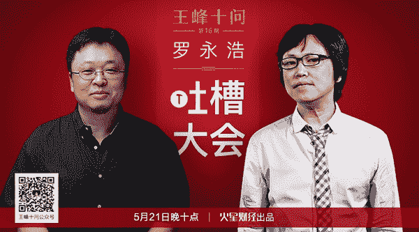
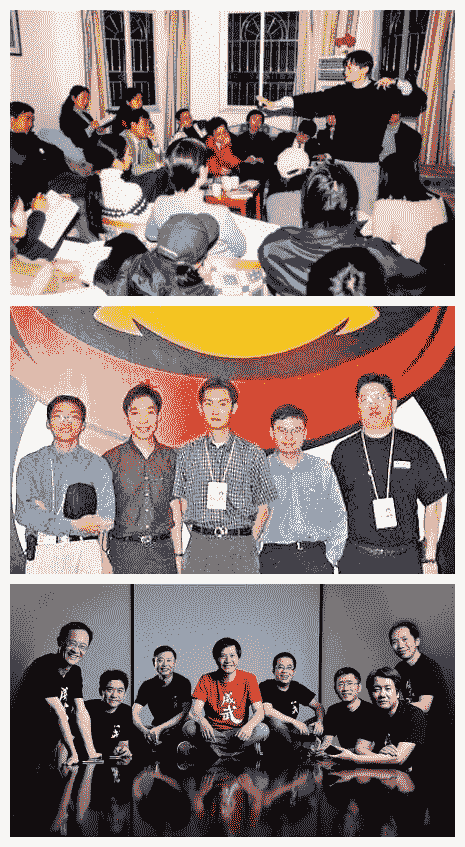
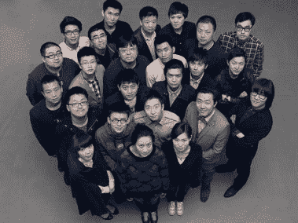
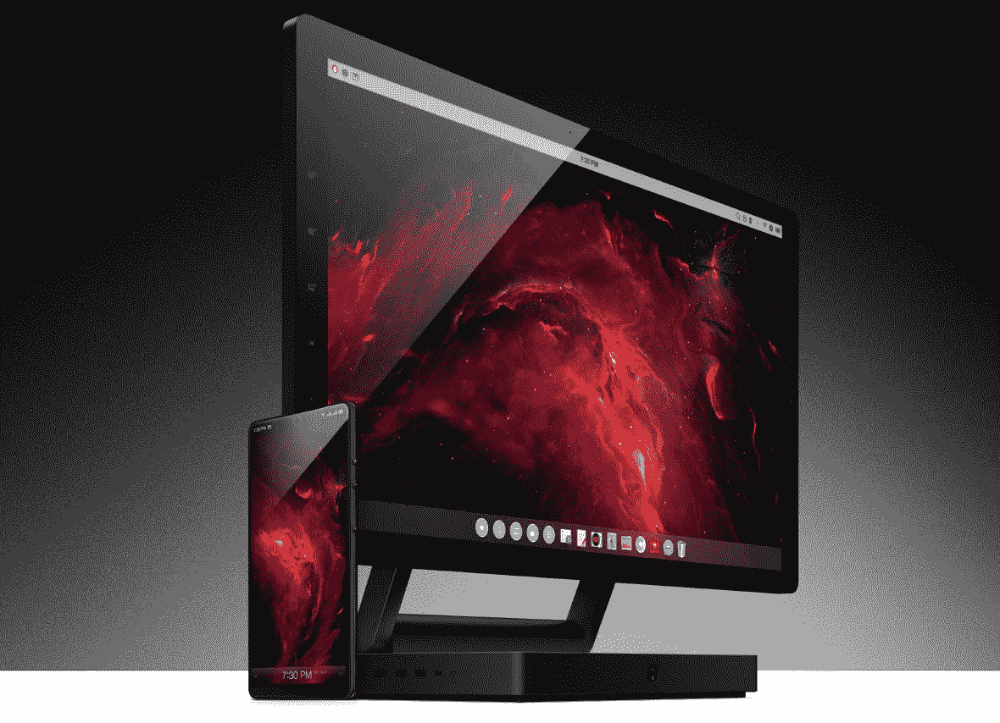
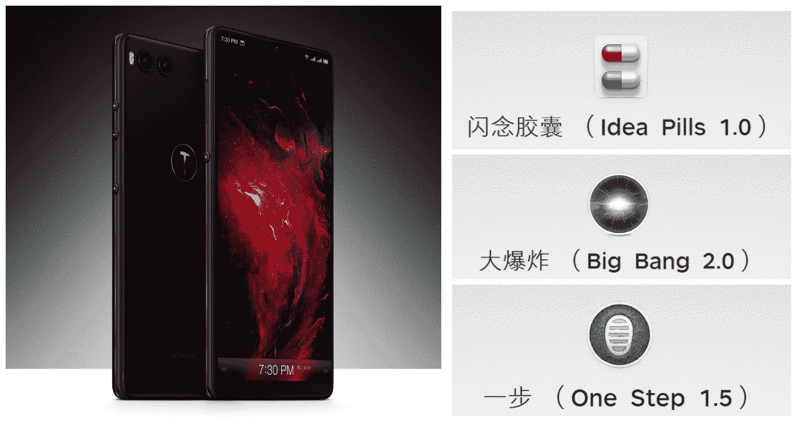
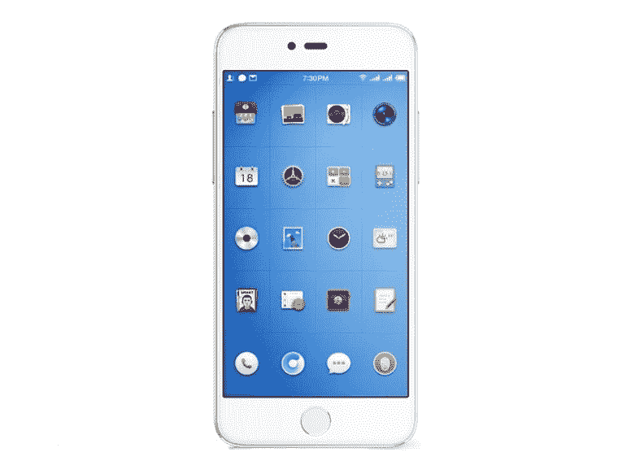
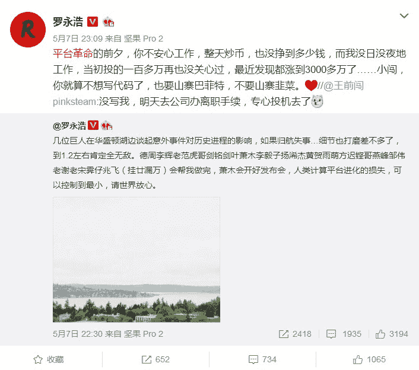
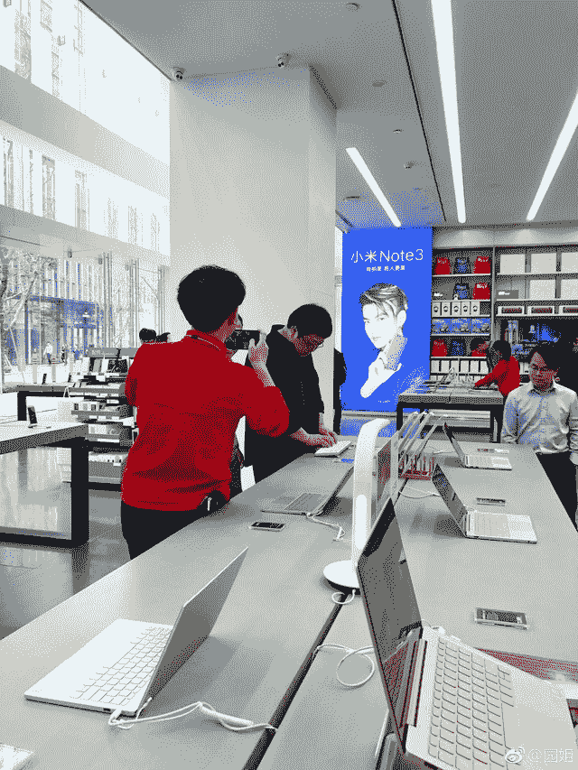

# 王峰十问第 16 期 | 锤子科技创始人罗永浩：再谈创业十大关系，首次披露“区块链手机一定会做”（附音频）

> 原文：[`news.huoxing24.com/2018052116403630201.html`](https://news.huoxing24.com/2018052116403630201.html)

**对话时间**：5 月 21 日 22 点

**微信社群**：王峰十问大本营

**对话嘉宾**：

罗永浩：锤子科技创始人。曾先后创办过牛博网、老罗英语培训学校，2012 年创办锤子科技，两年完成 B 轮融资。著有《我的奋斗》、《生命不息折腾不止》等。

王峰：火星财经发起人，蓝港互动集团（HK.8267）创始人，极客帮创投合伙人，曾任金山软件高级副总裁。

**以下为对话原文整理**：

**王峰：**首先要恭喜老罗啊，前几天的锤子 515 新品发布会很成功，锤子成为首个在鸟巢举办发布会的手机厂商，据说，这也是今年全球规模最大的一场发布会，参与人数达到 37000 人，门票收入突破 480 多万。

当然，很多人也为你捏了一把汗，朋友圈被连续刷屏，网上新闻铺天盖地，我知道你在发布会上已经大汗淋淋，但见疯狂吐槽，又岂是一个汗字了得。看到了很多关于这次发布会的吐槽评论，是被打脸还是改变世界？

一个民营企业家的商业活动，引来如此多的关注和争议，为什么？你怎样思考问题？这是我力邀你来做“王峰十问”访谈的动因。

在我看来，你差不多是当今活跃在市场一线最受争议的科技创业者。我注意到，锤子科技百度贴吧有粉丝 74 万人，同时，还有人注册了锤黑吧，竟然也有 6000 多人关注；515 发布会当天，虽然网友吐槽不断，网友评价再次冰火两重天，但你发出的微博最高评论还有 9000 多条，其中大多数还是挺你的。一个事实是，这次发布会之后，对你的争议不但没有降低，反而变得更强了。网上的热评，从你的公司到产品，一直追究到怎么看罗永浩这个人。

今天，围绕你一路走来的争议，我想抛开杂音和琐碎之语，问你以下十个问题，涉及团队、创新、品牌、竞争及个人意识等相关问题。其实，这些问题也是我一直在思考的，我在 2016 年新浪创业训练营上有过一次四个时的分享——《创业者必须要面对的十大关系》，今天，这些问题正好映射到和你的对话中来，是为切磋学习，以如明镜，照见我们自己的更加不完美和十分平庸。

今天的十问，涉及到我所提到的所谓“十大关系”，下面，让我们开始吧。得罪之处，务必请包涵。实在不行，私下饭局再骂我。

**第一问**

**王峰：**关于投资人。事先说明，我也是锤子的投资人，但我更想站在公共立场问一些问题。每逢锤子发布会结束，大家都会很关心锤子的融资情况。现在锤子还会经常处在资金紧张的状态吗？

**罗永浩：**目前还好，已经不亏损了，我们不用融资也能走下去。但是为了研发投入和尝试做一些不一样的东西，我们的资金还是挺紧的。

**王峰：**我至今还记得 2015 年第一次跟你见面，在你们公司附近一个餐厅和你午餐的时候，我心里的疑惑：你的投资人名单上，没有 IDG、红杉这类老牌主流投资机构，甚至没有启明、金沙江这些新兴的独角兽捕手。你跟媒体说过，你曾在 1 个月见了 50 多个投资人，但他们绝大多数并不能听明白你讲的事情。

我的观察是，最后投了你的投资者大多是喜欢你，信任你。他们听你的报价，其实都没有把短期投资回报率放在第一位。某种程度上，他们也是锤粉。为什么市场号召力如此强大的罗永浩，没有得到更多主流 VC 的青睐？

**罗永浩：**我们做的不是风口上的项目，如果不考虑远大的计算平台理想（其实这个他们听不太懂，但这很正常），那看到的只有一片红海，所以多数机构都不想投是正常的，合乎投资逻辑的。

另外，很多成功的主流机构吹嘘自己很少错过重要项目，其实他们为了维持这种名声，也经常是到了谁都能看懂的后期阶段，求爷爷告奶奶硬塞进去一些钱，然后再吹这个牛的。

**王峰：**嗯，了解。锤子科技从创立到现在经历了一系列挑战和艰难，曾经一度几乎被低价收购。据说由于收购方实在拿不出剩下的一笔小资金，导致最后收购失败。这些投资人当中，也有些由于基金性质和投资期限的问题，有退出的需求。但是锤子科技目前所选择的道路，是一条需要工匠精神和耐心的赛道。不知你是如何协调投资人需求和企业长远发展需求之间的矛盾的？

**罗永浩：**我们的投资者，有些是看好我们的长远前途，并对此有充分的准备，这种比较简单。

还有些是因为投资周期的关系，需要在一定的时间内退出的，这种我们会尽量想办法帮助需要退出的投资者退出。

有时候，一些新投资者希望前面的股东退出，这时候就比较好处理，否则还是挺麻烦的。这样的时候，就只能坦诚沟通，争取相互理解了。

**王峰：**我自己也完成过多轮融资，我知道在传统股权投资机构里，创始人与投资人的关系始终是微妙的，好像很多创业者处理不好这种关系，容易走到两个极端。要么失去自我，被投资者挟持，要么太过强势，拿下所以决定性投票权。其中关系千万重，我个人的经验是，创业者对投资者一定要坦诚，这是很重要的一点。你觉得自己对投资人够坦诚吗？

**罗永浩：**当然。无论是对投资者，还是其他人，我的问题一直都是过于坦诚了，这方面我的分寸感很差。

**第二问**

**王峰：**关于合伙人关系。这个我觉得挺有意思。马云创业时有“十八罗汉”，印象最深刻的当属彭蕾，一路追随，指哪打哪；马化腾创业时，“腾讯五虎将”里，既有马的中学同学陈一丹，也有他的大学同学张志东；雷军创立小米时，不仅有微软谷歌精英，更有黎万强等一众金山老同事；王兴创立美团时，叫上了清华室友王慧文。盖茨创立微软时的搭档是中学同学保罗·艾伦和大学同学史蒂夫·鲍尔默；乔布斯创立苹果的搭档是在 Palo Alto 一起玩大的技术天才斯蒂夫·沃兹尼亚克；佩奇创立谷歌时的搭档是大学同学谢尔·盖布林。任何一个领域的创业公司，有且至少有两人有过创业前的交情，其中大都以同学和前同事居多，我发现相知相熟的合伙人关系往往在企业发展中扮演着非常重要的作用。

阿里十八罗汉、腾讯五虎将、小米八大金刚

我的问题是，在锤子团队中，有这样一个人，是你过去一路走过来的拍档吗？这个问题我想过很久，创业维艰，有时看起来就是找人过日子，顶尖合伙人关系堪称模范夫妻关系，或者不是兄弟胜似兄弟的关系。有没有恋爱就结婚的好夫妻关系？有没有素不相识就一起扛枪的兄弟关系？

**罗永浩：**早期的时候完全没有，因为我跨界跨得有点狠，原来的朋友基本都是文化圈子的人，像作家、编辑、记者、出版家这种，还有就是英语培训业的前同事，所以起步的时候大部分是一些岁数差很多的小兄弟。那个时候比较惨的就是，压力再大的时候，也不敢跟他们说，怕吓到他们，怕他们知道有些事情我也搞不定，罩不住。

熬到现在好多了，吴德周、彭锦洲、苗颖、成红霞这些合伙人陆续加盟后，公司现在有什么大事，我可以很有底气地和他们沟通，听取他们的意见，不用硬着头皮假装自己什么都能搞定了。

锤子全家福

唐岩以前跟我说，如果你的公司里，所有的人都是乖乖听你的，没有任何人敢提反对意见，你也没有任何担心走掉了就会很麻烦的人，公司就多半会出问题。所以头几年我一直是很焦虑的，现在这方面好多了。

**王峰：**德周和锦洲都是华为系啊，我都有接触，人很实在。进一步说，我理解的合伙人，既要有明确的强核心，又要充分发挥合伙人的长处。你的个人风格强烈，保持强核心没有问题，尤其是在品牌、营销和设计方面，明显见长，但在充分发挥合伙人能力上，你是怎么做的？比如，在技术能力上，对你帮助最大的合伙人是谁？

**罗永浩：**发挥他们的能力方面？我什么都没做。我找的合伙人，都是某个方面远胜于我的，我请他们来，就是因为那一块儿我搞不定。所以就交给他们就好了。他们知道那块儿的责任完全在自己身上，这是最好的动力。

技术能力上，对公司帮助最大的，当然是我们的产品线和研发负责人，现任 COO 吴德周。

**第三问**

**王峰：**关于创新能力。在 5 月 15 日的发布会上，令我们大为意外的是，你仅用了不到半小时介绍坚果 R1 手机，却用了近 2 个小时介绍锤子 PC 工作站 TNT，这的确是一个很有想象力甚至是大胆的产品，但也引来了发布会最大的槽点，我罗列了主要槽点：第一，价格太贵；第二，长得太像 Surface Hub；第三，我们真的需要一个工作站吗？第四，用语音操作 PC，可能会把办公室变成菜市场。以上槽点，你有什么要回应的吗？有冤说冤啊。

发布不久的坚果 TNT 工作站

**罗永浩：**首先，TNT 的核心，不是那块一万块的屏幕，而是革命性的操作系统。我们的屏价格贵不贵，根本就不是问题所在。因为除了我们自己做的不惜工本的那个坚果工作站版本，还有我们的合作商即将推出的从 500 元到 5000 元的全系列产品。所以不管你的预算是多少，总有一款适合你。

第二，长得像 Surface Studio 确实很遗憾，坚果工作站是六个月弄出来的第一代 TNT 概念机，这个周期实在太短了，所以我们就找了一个做过类似底座转轴方案的供应商，用最快的时间赶出来了一个。后续迭代的产品的样子，会非常不一样。

第三，大家都用马车的时候，全世界只有几个造汽车的疯子觉得人民需要汽车，就像大家都用键盘的时候，全世界都觉得鼠标是玩具，“不是干正事儿的”。

如果严重地改变交互方式，工作效率的提升只有百分之三十、四十，那就什么也改变不了。如果工作效率真的提高百分之三百到五百，那就不是改良，而是革命。革命来临的时候，怀抱着腐朽的键鼠嘲笑语音操控的傻 x 们，会被扔进历史的垃圾堆里去。整个人类的工具进化史，就是一部直觉战胜非直觉，低学习成本战胜高学习成本，便利战胜非便利的历史。

除非直觉、低学习成本、便利的工具和方法在工作效率上有严重的折扣，否则结果是没有悬念的。

何况，这么说吧，百分之三百到五百的效率提升，足以让每个人都戴上耳麦，足以让每个员工把工作拿回家做，足以让每个老板都给工位加上隔断......没做过老板限制了他们的想象力不奇怪，但他们至少应该做过员工。

发布会后，这么多人不是在讨论这套系统能否提高百分之几百的效率，而是在讨论办公室会不会因此成为吵闹的菜市场……这大致相当于汽车发明出来之后，脑子里只有马车和马粪的人，讨论汽车发动机会不会太吵，抱怨汽车还要费油，提醒马粪其实是有其他用途的，“马身上全是宝”。

**王峰：**锤子科技从诞生起，无论中间有什么波折，总在创新上有神来之笔，比如上一代坚果手机的“闪电胶囊”，更早之前有 One Step 和 Bigbang，再早还有 Smartisan OS 焕然一新的操作界面，可是最新发布的坚果 R1 手机，有什么创新突破吗？好像大家还没看出来。你的发布会上大部分时间都没有交给手机。不过，说实话整个智能产品厂商的发布会，都没有几年前市场那种疯狂热度。是不是整个智能手机领域都遇到创新的瓶颈了吗？你想过做区块链手机吗？（别告诉我你没有考虑过啊）

发布不久的坚果 R1，富有创新的闪电胶囊、Bigbang 和 One Step

**罗永浩：**这次在软件上的创新突破是爆炸性的啊，我在手机里不是做了一两个创新的软件或特性，而是索性做了一个革命性的桌面级系统，回头你只要买一个几百块或几千块的专用触控屏，就可以得到一个工作效率远胜 PC/Mac 的强大电脑。

智能手机是一个烂熟的行业，肯定是遇到创新瓶颈了，但那些大厂商也没那么在乎，反正他们也不是靠创新成功的。至于区块链手机，一定会做，详情还不方便说。

**第四问**

**王峰：**关于设计能力。去年，你在坚果 Pro 发布会上说，M1 是锤子科技工业设计史上的耻辱。当时为什么这么讲？然而我了解到，作为“锤子工业设计耻辱”的 M1，是锤子产品里卖得很不错的，为什么在你看来工业设计严重不及格的 M1，市场和消费者反而给了非常大的认可？预判与市场反应相悖？

锤子 M1

**罗永浩：**先补充回答一下之前有位朋友关于 300% 效率提升的问题。300% 的效率提升，我们在很多场景下实测过,有 AB 比较，再怎么熟练的技术工，也不能跟自动化生产相比较，其实单是以我们那个演示视频，就应该知道，像自动生成 PPT，这种效率提升是远远超过百分之一千、两千的。

关于王峰这个问题，M1/M1L 谈不上多成功，卖了几十万部而已。它上市时的媒体评价和消费者接受度还是不错的（在互联网销售为主的产品上，这两者常常是一件事，线下销售的话，情况会复杂一些），但也不能算是多么成功的产品。

一般说来，科技媒体的判断逻辑是比较务实和简单的，你把材料堆足，各项均衡一些，再加上没有什么特别大的硬伤，大家就都说你做得好，很多非常平庸的产品，也能得到他们普遍的好评，就是这个原因。

我们早期不被他们认可，主要原因是那时候研发和生产实力不足，所以产品总有一些毛病和槽点，当然这完全怪我们自己。而我们投入心血做的那些创新和差异化的用户体验，以及设计上的成就（这些都是我真诚地吹牛 x 的基石），虽然获得了很多国际金奖银奖的认可，并赖以转化了一批非常死忠的支持者，而且这个产品方向在文青群体中其实受众也并不小，但这些对多数科技媒体来说，是难于理解和莫名其妙的。

在我没有用高调的方式激发他们的反感时，他们中的很多人，即便是用客观冷静甚至是友好地分析我们的产品时，也会觉得那些设计和创新是无关紧要的。本质上，我们和这些科技媒体之间的冲突（无论是性格上的还是观念上的还是动手掐架式的），是来自两个截然不同的世界，本该完美错过的两种人类之间的小概率意外相逢导致的尴尬。

你可以想象一下，如果我们是做实木、陶瓷物件，或某种类型的小资产阶级印刷品的创业公司，即便我性格再张扬两倍，即便我们刚起步的时候受限于各种条件和经验，产品有各种各样的小毛病，只要设计极端漂亮、创意异常新颖，也不会被各种产品评论家们骂成这个样子。

关于这个“耻辱”的理解，也是被讹传很广的。我说 M1/M1L 是我锤设计上的耻辱，是因为研发过程中出现的各种问题，使得它的正面到最后被迫修改得越来越像 iPhone 了。作为一个屡获殊荣的工业设计驱动型公司，做了一个正面酷似 iPhone 的手机，这对我们是一个耻辱。但这并不是说它难看，其实 M1/M1L 挺好看的，比同时期的多数手机都好看。

**王峰：**锤子产品好看是不假。据说，你个人非常推崇“对称美学”。以 T1 为例，为了能与顶部的耳机孔对称，特意将电源按键设计成同样大小的圆形，更令人称道的还是隐藏传感器的设计，将光线距离传感器巧妙地隐藏在了听筒内部，使得机身正面十分整洁，T1 也因此获得了 iF 国际设计奖金奖。你在发布坚果 U1 时使用的广告词“漂亮得不像实力派”，至今让人印象深刻。有人说，锤子科技在品牌塑造过程中做得最成功的一件事，仅仅是在美学设计上比同行有着更高一点的追求，你认同这种说法吗？也有人说，会不会“漂亮有余，实力不足”？你会不会很生气？

**罗永浩：**美学设计上的卓越成就和追求，不是我们为品牌塑造所做的努力和工作，也不是“更高一点”，它是构成我们企业基因的一个重要组成部分。想象一下，如果苹果试图把自己的品牌塑造成一个很朴实，很极客，很工程师文化的技术驱动型公司，如果微软试图把自己的品牌塑造成一个很酷，很有性格，很有品位的设计和产品驱动型的公司，一定都会很尴尬。

工业设计的本质，是让一个产品更好地为它要服务的特定人群工作，不仅仅是外观好看。外观好看对某些群体非常重要，这时候外观就是一个产品“更好地工作”的一部分；对某些群体完全不重要，这时候好看的外观就很可能不是一个产品“更好地工作”的一部分，至少不是重要的组成部分。

**第五问**

**王峰：**关于员工关系。发布会前不久，你在微博上调侃一位叫小闯的员工说，他在“平台革命的前夕”无心工作，一心想投资加密货币，但他的收益却远没有你这样一心工作，投资完就放一边的人高。据说投了 100 万获利 3000 万？哈哈，看起来你很适合做区块链。这是真的吗？我猜双方都有开玩笑的成分。不过，我也很好奇你和员工之间的关系：有多少员工在进入锤子之前多少是锤粉？进入锤子后，他们多少会遇到一些现实问题的修正吧，这很正常。跟一些投资人类似，我知道很多员工看好锤子独立上市的前景而选择多拿股票，少拿工资。对他们而言可能还需要再坚持一段时间。你是如何建立起员工的长期与现实驱动力的？

老罗的微博

**罗永浩：**是真的，做锤子科技的初期，我跟着朋友起哄稀里糊涂投了点钱，然后接着忙我的工作，再然后就发现那一百多万变成三千多万了。我不喜欢投机生意，所以不会花精力去炒币，国家相关的政策正式出台之前，也不会考虑做 ICO。但区块链技术能改变世界，我是坚信不疑的，所以区块链技术的可能应用，我们一直在积极研究和学习。

早期的同事，可以算是“罗粉”、“锤粉”的还多一些，现在已经没那么多了。如果我没过分自恋的话，我相信他们在熟悉导致轻视的正常过程中，对我失望的部分应该不是人品，这是我为之骄傲的。

而他们对我可能失望的那些部分，我会怀着惶恐之心，努力学习和改进。坦率地讲，我们在鼓励、激励公司同事努力奋斗方面的具体工作，做得是远远不够的，到现在战斗力也没出什么问题，相信很大程度上是因为有所谓“正确的价值观”，和远大的理想和目标驱使，才得以维持的。

**王峰：**你曾经说过，私下里员工给你打招呼，你比他们都紧张。你跟员工私下聊天多吗？你跟普通员工沟通的模式是怎样的？他们清楚知道你想要的东西吗？

**罗永浩：**我通常会怕跟陌生人讲话，所以公司人多了之后，这就成了一个不大不小的问题。另外，看到陌生的面孔跟我微笑打招呼，我又知道他们是公司的同事，这时候我不认识对方就会让我很愧疚和尴尬，总之，这个问题一直没解决好。

除了工作，我跟公司同事私下聊天不多。创业初期，我本来是喜欢加班后跟他们去吃个宵夜谈谈心什么的，后来我老婆警告我说，傻 x 老板才会觉得公司员工愿意跟自己吃宵夜呢，何况还是劳累了一天之后。我觉得她这是洞察人性的深刻看法，所以后来就更不敢了。让全体同事知道公司想要的东西，通常都是管理层先开会统一认识，然后在分部门开会传达下去的，但我们有时候会觉得，这未必是最好的方式。

跟外界想象的不一样（很多人误以为我在公司天天搞全体大会给同事们洗脑），其实我在公司内部很少搞集体讲话，最多年会的时候简单说几句，但那对我也是跟开发布会差不多的煎熬。

年会讲话的时候，我最喜欢讲的一句话是，“好了，我讲完了，大家吃好喝好。”顺便说一下，年会上我最喜欢的部分是用手机发红包，这是一个集体活动需要活跃气氛时，人类所能发明的最低成本的方式，竟然比酒精还快还管用，实在是太伟大了。

**罗永浩：**插一句，关于 TNT，另一个经常被问到的问题是说，使用 TNT，如何解决别人听到隐私的问题？这个问题太奇怪了：你打电话的时候，边上也会有人听到，一个正常的人，完全不需要有人教，你就知道哪些可以在边上有人的时候说，哪些不能。话又说回来，你每天在工作电脑上处理的工作里，有多少是隐私呢？除了色情小说作家，旁边的人听到只言片语又有什么关系呢？特别是在工作效率能提升好几倍的情况下。

另外，刚才前面有一位老师说，他说话速度比打字慢，相信他不是打字快，而是用口语表达障碍。

**第六问**

**王峰：**我们也说说媒体舆论。发布会结束后，有媒体说，这也许是锤子科技历次发布会前后，舆论反馈的期望值和实际值二者差距最大的一次。你觉得，是什么原因导致媒体普遍对这次发布会评价不高？你认为媒体最关注的点是什么？如果满分 100 分，你给这次发布会打几分？你给当天的自己打几分？

**罗永浩：**回答王峰的问题。这次发布会的感受，其实还好吧，2014 年 T1 发布的时候，舆论反应也是这样的。这就是我们的传统文化嘛，只要有人高调，大家就一定要灭他，这事儿我们和巴普洛夫都预料到了。以我这次发布会之前的高调宣传，即使当天晚上我发射了一枚火箭，大家也会说，伊隆.马斯克早就发射过了。至于我们这次为什么这么高调？一半的原因是担心鸟巢坐不满，另一半的原因，你会在我们的下一次发布会时知道。

我觉得多数媒体关注的都是点击量，而不是什么点。至于自媒体，他们的编辑、记者自己爽不爽，比科技领域发生了什么变化，出现了什么革命更重要，这些都是意料中的。当然，由于时间严重不够用，加上我们第一次操办这么大型的活动，所以当天出了很多小的故障和意外，所以整体表现，以我的真实水准，也就是七八十分吧。

**王峰：**有自媒体（我不知道算不算锤黑）总结过你的一些特点：1\. 热衷于打自己脸。曾经说锤子手机“如果低于 2500，我是你孙子”，结果，就有了坚果手机不到 1000 的最终售价；曾经说“水粉色系就是臭土鳖喜爱的颜色”，结果，就有了粉红色的坚果手机。2\. 喜欢自吹自擂。曾经说“我们做两到三代产品之后，灭掉苹果是没有问题”，“乔布斯死了之后，赶超苹果也只是迟早的事。希望我们崛起前苹果不要走下坡路，免得赢了也没什么意思。”你觉得自己是不是有媒体招黑体质？

**罗永浩：**不低于 2500 元和孙子之间的关系，是指发布时的开售价，不是后来公司出事要倒闭了的时候被迫甩货的价格；坚果一代不是水粉色系，只是网上的一些图看起来很像，那个红色版本实际是接近 Airbnb 的肉红色，不是粉红色。

我们的产品，商业上当然还完全谈不上灭苹果，但产品上，我们很多方面早就超过苹果了，如果再考虑价格因素，那就远胜苹果了。缺人缺钱缺资源，同时擅长做病毒传播，所以我当然会有意无意地说一些吹牛 x 的大话和玩笑话，但很多流传很广的说法，根本就不是真相，但对他们来说，真相根本不重要。

为了打击我，安抚他们自己，他们经常捡着片菜叶子就说是找到刀了。我的性格，在我们的传统文化中，当然是容易招黑的异类，这是我的命运，我不为此高兴，也不为此难过。他们绕着我无能为力地生气，或是挥舞着菜叶子觉得特解气，我都理解，但我有我的事情要做，不太关心这些。

**第七问**

**王峰：**关于合作伙伴。雷军说手机本质上是“海鲜”生意，现金量巨大，需要提前订货，库存周转要求高，稍有不慎就是万丈深渊。2016 年时小米遇到两次 2~3 个月的缺货，雷军随后亲自挂帅手机供应链，找到十几个供应链大牛，组建供应链、硬件产品、销售三大部门联合参谋团队，才渡过难关。做锤子手机后，你也曾经在发布会感谢供应商没到楼下扯标语。在最困难的时候，你是如何说服供应商支持你？

**罗永浩：**很惭愧，我个人没有做什么格外管用的事去说服他们支持我们，这是我们的供应链团队做得好，主要是负责人吴德周和严敏善的功劳。另外，我觉得我们运气很好，有那么多理解和愿意帮助我们挺过难关的供应商合作伙伴，比如蓝思科技的周总，在我们形势最艰难的时候，都给了我们难以置信的信任和帮助。还有高通、三星、新思、群创、舜宇等很多业界知名的优秀公司，一直不嫌我们的订单小，在任何时候都给了我们最好的支持和帮助，并鼓励我们坚持差异化的路线走向成功，这是我们时常感念的。

**王峰：**锤子科技除了手机领域之外，正在开疆拓土布局锤子生态。之前有网友爆料，你本人亲自考察小米门店，向小米公司学习。2017 年，互联网手机品牌做得非常艰难，我们目睹了乐视的死亡，360 手机的挣扎，值得大书特书的是，不断学习和迭代的小米却逐渐甩开了效仿者，走出了危机，并形成了稳固的小木生态竞争能力，锤子科技会不会像小米一样，陆续发布路由器、锤子电视等生态产品？锤子生态的定位是什么？

老罗亲自考察小米之家

**罗永浩：**我们确实从小米公司身上学了很多，但比起他们基本无敌的性价比路线，我们更愿意做一些偏中档或高档，但不是豪华级别的智能硬件产品。

我们已经做了全世界最好的空气净化器，这“最好”可是媒体说的哦，稍后我们还会做最好的加湿器、新风机、旅行箱包、智能音箱等等。暂时没有计划做路由器和电视机，但不排除合适的时候做。我们硬件生态的定位？就是消费升级时代的中高端智能硬件，也许后面还会做一些非智能的硬件。

**王峰：**几大手机厂商广告都以明星代言为主了，连小米的广告也是铺天盖地。如果锤子有钱，你会去赞助《中国有嘻哈》、《这就是街舞》或者在抖音上投放广告吗？锤子，现在是坚果，如果选一个明星代言的话你会选择谁？

**罗永浩：**当然。如果预算充足，我们当然也希望公共场合和网站、电视、应用里，到处都是我们的广告牌，除了帮我们做品牌，卖东西，它们还会显著地改善市容市貌，改善视容视貌，毕竟我们是一下设计驱动型的公司。

为了和我们的品牌调性相符，我们可能会找一些知名度足够，同时有一些性格和态度的明星和公众人物，比如朴树、陈冠希、李宇春等等，我们也很认真地考虑过任志强，只怕请不动他老人家。

**第八问**

**王峰：**关于竞争对手。如今，智能手机市场正在日趋饱和，根据 IDC 和 Strategy Analytics 研究报告，2018 年一季度全球智能手机市场出现了 2.4%的下滑；国内市场情况更是不容乐观，根据中国信息通信研究院发布的数据显示，今年 1-3 月，国内手机市场同比都出现了 20%-30%左右大幅下滑。随之而来的是，消费者不再狂热地关注手机新品发布会，过去，无论是苹果、小米，也包括锤子，都不缺发布会看点，很明显，智能手机发布会变得越来越不 cool 了，大众对发布会出现了审美疲劳的倦怠情绪。锤子等智能手机市场份额排名较后的品牌，将如何面对现在的市场竞争？

**罗永浩：**去年和今年第一季度，全行业都是明显下滑的，但我们还一直在增长。对我来说，不一样，并且更好，一定是人性的终极需求，这是信仰，所以没有见招拆招，我们永远都是这一招。现在的财富和资源是他们的朋友，时间是我们的朋友。至于说到手机行业的发布会，我……我不说了，没有必要再因为实话实说，又掀起一轮口水战，你懂的。

**王峰：**哈哈，我的看法是，千万不能找太 low 的竞争对手。既然决定以生死相搏，那也得盯个大的概念，盯一个值得你去打、去学习的竞争对手。你一度把苹果当作标杆，希望能够做一个苹果这样的企业。而在 5.15 发布会之前，你却说，失去了灵魂的苹果会疯狂地抄袭锤子。我有些惊讶，你难道认为现在的锤子在产品设计上已经超越了苹果这个曾经的标杆？

**罗永浩：**我也很惊讶，你作为我们的投资人和前产品经理，怎么会没发现我们的产品设计在很多方面早就超越了苹果？

发布会之前我们的硅谷和西雅图之行里，我秀东西给那些科技巨头的大佬们看的时候，“你注册了国际专利？你一定要快，我打赌苹果看完了会几乎完整地全抄一遍，毕竟交互专利要绕过去没有那么难”，这是其中一个科技巨头的老大亲口说的，我丝毫不怀疑这一点。

**王峰：**你的软件系统我喜欢，硬件真的很不好干。迈克尔·波特（Michael Porter）在影响企业竞争力的六大因素中提到一点——公司现有竞争对手的实力、活力和能力：竞争对手数量多吗？它们的资本是否雄厚？它们是否清清楚楚地瞄准了你？以上几点，你仔细做过调研吗？你曾说，“拼参数、拼做工那几个转变，在（手机）行业里，我坦率的讲，也不怎么关心他们讲什么，我只会关注我们关注的东西，行业趋势这些我们是不太关注的。我们判断一个产品受不受欢迎，是从人性的角度考虑的，而不是从市场趋势角度考虑的。”你真的不关心竞争对手的情况？几年前华为消费者 BG 余承东他们对迅速崛起的小米手机几乎到了贴身盯防的战略战术，而曾经有很强设计优势的魅族，老板行事风格特立独行，今天似乎越来越缺少关注。

**罗永浩：**是的，不怎么关心，除了跟他们一样，会关心供应链里又有了什么新技术之外。

**第九问**

**王峰：**说说创业者家庭吧。515 发布会上，你在用 TNT 工作站演示“子弹短信”功能时，想给老婆发短信说 “过去 6 年辛苦了，今天我早点回家睡觉。”你很少提到自己的家庭，也坦言，创业后自己对老婆的亏欠是蛮多的。昨天（5 月 20 日）你们两口子是怎么度过的？

**罗永浩：**昨天我出差，我老婆自己在家。我们这些创业的人，单看对家庭这一项绩效考评的话，都应该下地狱。

**王峰：**我真的不知道怎么问别人家庭问题，但我觉得，只要一个人创业不停歇，你很难说你彻底平衡了家庭关系。很难过上普通人那种财米油盐的温馨日子。你在 2016 年初发文总结了自己三年半以来的创业经历，称如果没有意外，后半生的全部，除了家庭，也就是这个公司了。如今你的工作压力这么大，怎么平衡家庭关系？可有高招？

中国的市场竞争环境越来越激励，创业者承受的精神压力，旁观者根本无法想象，中国的创业者哪怕是看起来已经功成名就的企业家，成天的状态都是大禹治水，因为公司里天天发水啊。哈哈。我现在开始相信，夫妻创业还是有一定的现实意义，至少他们志同道合。水浒里，菜园子张青和母夜叉孙二娘开夫妻店，也比宋江和阎婆惜互相拆台好很多。

**罗永浩：**完全没法平衡，除非退休，或退二线。

**第十问**

**王峰：**如何看待我们自己。那些实际上没有怎么接触过你的人，他们对你的印象大多在爱批评的罗老师阶段，谁让你当年好好的老罗语录不说了，一言不合就砸人家冰箱呢。这几年，熟悉你的人看到的，更多是你越来越明显的精英主义色彩，至少是技术和设计精英主义吧。你在设计和美学上的推崇和讲究，引来了又一批人的情有独钟的好感。彪悍的人生，不屈和忍，一开口就引来众声喧哗，结合了精致的设计主义思想，真是有趣。你怎么看待你身上那么多被人贴上的标签？

**罗永浩：**做锤子科技的初期，我还经常因为他们的千姿百态感到各种惊讶，这六年下来，我看到什么都不觉得意外了。人只能活一辈子，所以在不危害公司的前提下，我还是就保持本色吧，他们爱贴什么就贴什么好了。

**王峰：**做了公司创业者，相比较做英语老师，你最大的改变是什么？一直没有变的是什么？哪一个阶段的你，活得最痛快？

**罗永浩：**变化很多啊，进步很大，现在能想起来的一个大变化是，作为一个本性睚眦必报，吃不得半点亏的人，可以为了公司利益，为了理想和目标，忍受各种完全不是我的对手的笨蛋们的挑衅和羞辱，这让我时不时有一种武林高手不打小混混般的成就感。

**王峰：**我有一点观察。工程师背景的创业者喜欢控制，在我身边从事互联网乃至科技领域里，工程师出身的成功创业者做多，不一一举例了。在工程师思维中，插手人越多越不是好事。他一堆 Bug 在等着你，你还要有专职 Texting 队伍跟上，你看陆奇在百度做总裁干了那么多事，还不是 16 个月就走人了。教师背景的创业者，喜欢纠错人家，也自我批评，他们更关心问题的真理在哪里，往往对事物具有前瞻性洞见，这方面颇有建树的企业家，还有大谈企业价值观的马云马老师。但是，军人背景的创业者喜欢指挥，韩信点兵，多多益善，三句话离不开一个战字。你看王健林、任正非和柳传志的语言风格，就能体现出来。哈哈。

在我看来，创业是今天和平年代里一项最好的自我修炼，很多人在创业中完成了人格上的洗礼和重塑。你最大的创业感悟是什么？

**罗永浩：**完全同意，如果不去创业，我完全想象不了一个四十多岁的人还可以一直进步，我相信如果一直做公司，人到了六七十岁也会继续进步，因为你不得不进步和修炼。作为一个打小就希望成为伟人、巨人、神人的人，我觉得创业是我这辈子最大的幸运…也许除了碰到我老婆这件事。

**王峰：**最后一问，如果接下来有机会，让你选择做布道师或者设计师，二者只能做一个选择，说的更具体一点，万众期待于聚光灯下的宣讲台，与反复推敲状态中同设计师泡在一起的工作室，哪个是你心中真正的应许之地？

**罗永浩：**回答王峰的最后一问，我不喜欢布道，我没有耐心。

**王峰：**哈哈。你在发布会的最后，引用了滑翔机之父奥托·李林塔尔的一句名言作为回答：少许的牺牲是必要的，指引着我们去做不一样的东西。虽然锤子的下一步，还是个未知的答案，但对不一样的未来，能去不断探索，不断进取，不断投入，都值得我们鼓掌喝彩。

再次谢谢老罗兄弟，感谢你今天做客“王峰十问”，祝坚果 R1 和坚果 TNT 工作站大卖！

加油。老罗。

本文为火星财经原创稿件，版权归火星财经所有，未经授权不得转载，转载须在文章标题后注明“文章来源：火星财经（微信：hxcj24h）”，若违规转载，火星财经有权追究法律责任。