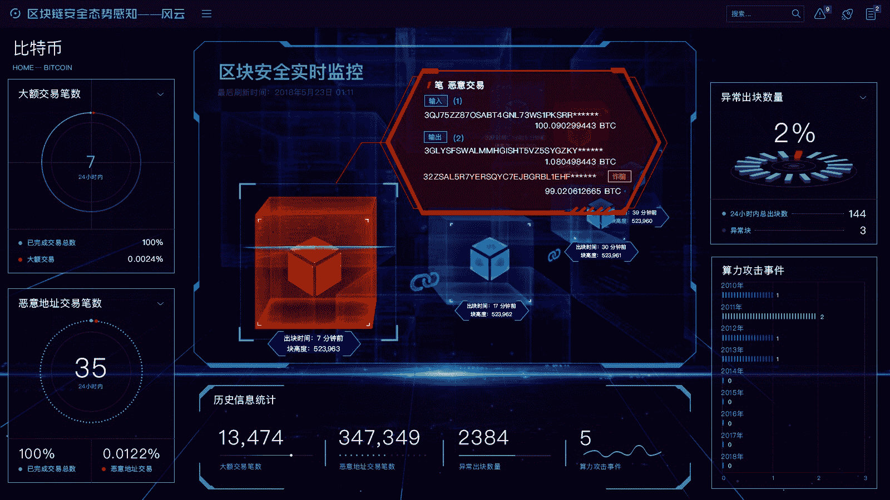

# 王峰十问第 17 期 | 奇虎 360 董事长周鸿祎：区块链数字货币史诗级漏洞，不是最后一个，也不是最厉害的（附音频）

> 原文：[`news.huoxing24.com/2018053012060827682.html`](https://news.huoxing24.com/2018053012060827682.html)

**对话时间**：5 月 30 日 12 点 30 分

**微信社群**：王峰十问大本营

**对话嘉宾**：

周鸿祎：奇虎 360 公司董事长、著名天使投资人。2011 年 3 月 30 日，周鸿祎带领奇虎 360 在美国纽交所上市。2016 胡润 IT 富豪榜，周鸿祎以 150 亿元排名第 23。政协第十三届全国委员会经济委员会委员。

王峰：火星财经发起人，蓝港互动集团（HK.8267）创始人，极客帮创投合伙人，曾任金山软件高级副总裁。

**以下为对话原文整理**：

**王峰：** 昨天中午 360 发布 EOS 高危安全漏洞消息的时候，当时我正好在和联创策源的老大冯波在外面喝咖啡，听到消息心里一震：360 对区块链动手了！随即冯波就给周总发了微信，没想到周总很快就回复了。所以，今天我们请来了江湖大佬，人称“红衣主教”的周鸿祎同学做客“王峰十问”，主题是：EOS 安全风暴。

昨天我冯波在一起，冯波帮忙和周总联络了。

**周鸿祎：**我不是大佬，现在满大街都是大佬，还有大大佬，叫我老周好了，反正都是老朋友。冯波是我的人生导师，他擅长爱情，婚姻、家庭 、育儿各个方面

**王峰：** 先让我们看一看他的经历吧。本科毕业于西安交通大学电信学院计算机系，后被保送西安交大管理学院系统工程系攻读研究生。曾创办 “3721 网络实名”，开创中文上网服务之先河，历任雅虎中国总裁等职务；2006 年创立 360，推出“免费安全”战略，开创了中国互联网的新格局；2011 年 3 月 30 日，周鸿祎带领奇虎 360 在美国纽交所上市；今年 1 月，周鸿祎当选“2017 十大经济年度人物”；2 月份，360 集团在上海证券交易所成功上市。周鸿祎同时也是政协第十三届全国委员会经济委员会委员。

**第一问：**

**王峰：** 360 以 PC 安全卫士起家，其后一直从事互联网安全应用，我也只到近几年也逐渐布局于企业级安全领域，为什么你的安全触角一下子进入区块链领域。我们团队浏览一遍你最近一年的个人微博，也仅仅有两次与区块链相关，一次是去年“九四监管”前后，一次是昨天转发 360 安全卫士针对 EOS 安全漏洞的公告。中间很长一段时间，鲜有提及区块链。在今年春节之后，3 点钟微信群火爆区块链期间，你也从未轻易表达过对区块链的看法，可是昨天，通过爆料 EOS 严重安全漏洞之际，360 闪电出击，在一天之内连续公布了与币安、欧链、EOS LaoMao、Dbank 等项目的合作，这是为什么？看起来你是蓄谋已久啊，后面还有大招？

昨日老周发的微博

**周鸿祎：**其实也没有谋多久，从年前开始，我自己也在努力学习区块链的东西。

我在 3 点钟群里没怎么表达看法，是因为确实还没怎么看懂一些东西。

但在安全上我们是专家，所以在 17 年年底 18 年年初，实际上我们就已经在关注区块链安全，开始研究区块链技术和相关的安全问题。

在这个过程中，我们和业内很多项目也都有过接触沟通和交流的，我们的心态还是比较开放的，我们也希望大家都能够关注安全问题，所以当大家主动来找我们，希望在区块链安全方面有些深入沟通交流，我们也非常愿意为区块链行业提供更安全的解决方案。

后面我们肯定还是会继续深入研究区块链安全问题，也会继续保持开放心态，欢迎大家来交流合作。

尽管很多区块链、数字货币的设计都标榜非常安全，但任何软件系统，只要非常复杂，这种复杂度，都会带来 bug 和漏洞，bug 和漏洞被人利用，就会带来风险，就会有安全问题。

区块链技术也一样，现在比较火热，我们现在关注的也比较多，我们最近发现很多区块链系统、交易所系统、钱包系统存在问题。

之前大家都在关注区块链带来的商业机会，但是很少有人关注区块链安全问题，最近 EOS 准备上线，在区块链行业里非常具有代表性，我们这次发现 EOS 漏洞，提交给对方，希望督促他们修补系统，所以我们披露漏洞，是我们安全公司的职责所在。

没有大家想象的什么蓄谋已久，也没有什么大招，我们的大招就是踏踏实实帮助区块链行业排除风险 。

我至今也不觉得自己懂区块链，我个人也没有买虚拟货币，看着大家在这些群里热烈的讨论，每个人都忧国忧民，每个人都像经济学家、哲学家、思想家一样的发出各种见解，我真的觉得自己像个白痴一样听不太懂。但是我们比较懂的就是安全，所以我们希望和大家一起交流，让区块链行业更安全。

第一题再补充一点，至于很多人和我们合作，说明大家开始重视安全，是个好事。

我们也很开放，我们没有任何立场，对所有的玩家来说，我们都愿意帮助他保护用户的安全。我们希望把区块链行业的安全生态发展起来。

**第二问**

**王峰：**在 360 公布#3498 EOS 漏洞之前，EOS 的 bug 已经在 Github 上提交了 3497 条，但 360 出手前鲜有人关注并产生如此之大的影响。实话实说，你如何看待昨天披露安全漏洞的严重程度？为什么称这个漏洞价值百亿美元？为什么 360 安全卫士在微博上将之称为“史诗级”漏洞？在我过去的理解里，“史诗级”一般来形容丰功伟绩，是对某件事的高度赞扬，哈哈，好一个“史诗级”啊。

**周鸿祎：**我们没有立场，是中立，我们提出任何一个系统的漏洞，都是为了帮助这个系统改善安全性，保证它的安全，不是为了打击它。区块链这个行业里，大家其实是在一条船上，作为新生事物，某一家不安全会让大家对整个行业产生质疑、失去信心，对行业是不利的。所以我们反对大家利用安全问题做文章，把安全问题变成竞争的工具。

我先来解释下这个漏洞被人利用可以用来干什么。如果漏洞被人利用，可以控制 EOS 网络里面的每一个节点每一个服务器，那就不仅仅是接管网络里面的虚拟货币、各种交易和应用，也可以接管节点里面所有参与的服务器。拿到服务器权限，就可以为所欲为了。如果有人做一个恶意的智能合约，就能够把里面所有的数字货币直接拿走了。

所以这个对于区块链网络来说，不会有比这个更严重的漏洞了。

再说“史诗级”，EOS 在区块链发展史上的重要性大家肯定知道，如果说，这个漏洞我们没有提出来，EOS 没有修复，等到 EOS 主网上线了，被恶意的黑客发现并利用了，那时候 EOS 会不会一夜之间就被搞掉了，我们都不好说。

EOS 现在的估值至少百亿美金了，所以我觉得这个漏洞价值百亿美金并不夸张。

另外就是这个其实是我们安全圈内部的说法，是半个舶来语。“史诗级”是从“Epic”翻译过来的，国外安全社区经常用“Epic bug”或者“Epic fail”来形容比较重大的安全漏洞。

当然我从公关的角度来看，史诗级这个词大家理解不一样，太文艺青年了，所以说成百亿美金的漏洞，大家会不会觉得更接地气一点。

因为很多标题党 “吓尿了、吓哭了  、吓软了、崩溃了”都被滥用了 ，所以用了个“史诗级 ”，其实说百亿美金级别最好了。

**第三问**

**王峰：**今天凌晨，EOS 创始人 BM 在电报群中回应 360 披露的 EOS 安全漏洞问题，称 360 报告中提到的漏洞早已被 EOS 修复，且早于 360 发布报告的时间。对于漏洞本身，BM 称大部分漏洞是来源于第三方代码库而非 EOS 核心代码；且该漏洞并不能改写可执行内存，且不能获得 Root 权限，除非部署节点时就已经是以 Root 用户身份来运行。BM 的回应，暗指 360 制造恐慌，并声明对于任何挑起市场恐慌的行为将取消其奖励资格。对此，你怎么看？

说实话，我觉得 BM 很厉害，他反击的时候，我和我们火星财经旗下的 EOS Galaxy 的负责人许波正在看到了他直接在电报群的回复，他的迅速回应减轻了大众对 EOS 安全隐患的恐慌感，反而让更多人猜测是 360 精心策划的安全炒作。鸿祎，这个问题，我希望你能更直接给予回复。

BM 凌晨在电报群的回应

**周鸿祎：**没问题，慢慢来，让子弹先飞一会，你说的消息其实已经不是最新的，最新的嘛，慢慢说。

**王峰：**我们团队内有 EOS Galaxy 的 BP（超级节点）竞选项目，所以内部技术团队也非常关心。

赵东发朋友圈力挺 360

**周鸿祎：**对于已经修复这个事情，我还是需要和大家普及一个知识，就是我们安全厂商对外公开披露的漏洞，一定是先和对方沟通，提交给对方去修复，在得到他们修复的确认之后，然后我们再公开。因为如果 EOS 没有修复，我们公布出来了，肯定会有一大波黑客立马上去搞他们，所以我们发布报告的时间当然会是晚于修复时间的。

这个不仅仅是对 EOS，对微软谷歌苹果都是一样的，对于安全漏洞，通常的步骤就是，首先是挖掘漏洞，挖出来之后就会研究，会怎么被黑客们利用，把这些研究透了，再向相关的厂商汇报，比如这次 EOS 的，就是把怎么利用的视频还有涉及的详细代码报告给了对方，再然后就是对方修复，等对方确认修复之后，我们才会对外公布。

**商思林：**为何 BM 这么明确地说修复时间更早呢？

**周鸿祎：**他提到的这个 root 权限，root 权限是指计算机系统里面的最高权限。是否获得 root 权限，不影响攻击者控制 EOS 节点，没有 root 权限也是一样的。如果用户使用 root 权限运行 EOS，那么攻击者就可以获取 root 权限。BM 的回应有点让人混乱，看起来以为是我们报告前他们已经修复了，其实是我们遵循了负责任的行业标准流程，报告->修复->公开。

非常明确地说，我们先私下联系了 BM，通知了他们 EOS 漏洞 ，希望他们先修复  这都是有聊天记录截屏的，等到 EOS 修复了，我们再对外发布这个漏洞公告。

今天我们也还在和对方继续保持沟通，对方对我们表示感谢，也表示会给我们发放漏洞奖金，会对外发致谢。

这也是安全圈的行业通行做法，对方不修复，我们不会公告。这事我们一直在和 BM 单独沟通，他在 Telegram 上的留言截图是昨天晚上的，比较断章取义。实际上那个留言之后，他很快回复说，漏洞是真实存在有效的，但是就被截了一点儿。

至于制造恐慌，如果说我们要制造恐慌，直接在主网上线时放出这个，恐慌效果一定比现在要好的多。

我再强调一遍，我们提交的漏洞，EOS 官方是确认真实有效的，并且我们在和 EOS 官方及 BM 一直在沟通关于漏洞提交和定性的事情，而且，今天早上在和 BM 沟通时，他们依然是非常认同我们的成果和技术实力的。

在这整个过程中，360 都是非常负责任的严格遵循安全行业的安全漏洞披露原则的。我们作为国内最大的一家安全厂商，在全球也是排名前三的安全厂商，我们希望和全球同行和科技公司一起，解决网络安全问题，降低网络安全问题给用户带去的损害。帮助大家发现漏洞、修补漏洞，让大家提供安全放心的产品给用户，是我们共同的责任。区块链作为新兴的技术方向，我们参与进来，无论是这次披露 EOS 漏洞，还是之前和其他区块链机构的沟通，都是希望和大家一起共同构建安全放心的区块链产品和服务。

**王峰：**今年的区块链最大的话题就是 EOS，现在很多人都担心 EOS 会延期发布公网版本，这个安全隐患被曝光后，更多人关心他们的发布时间。以 360 安全技术团队评估，EOS Dawn 4.0 的公网版本是否有可能推迟发布？

**周鸿祎：**我认为应该延迟上线的，我们的安全团队还在发现一些 EOS 的漏洞，我们也会第一时间及时的提交给他们，我们建议修复之后再上线。

**第四问**

**王峰：**此次发布 EOS 漏洞事件，让 Vulcan（伏尔甘）团队一战成名，可是此前行业内很少有关于他们的消息，大家对他们依旧很陌生，能否向我们具体介绍下他们？我们注意到，你最近不断提及 360 安全大脑，能一并介绍下吗？在这个事情上，你们安全大脑团队跟 BM 团队是通过 telegram 直接交流的，你们实质接触是从什么时候开始的？坊间说，你们和 EOS 很快有合作要公布，你方便在这里透露吗？

屡次获奖的伏尔甘团队

**周鸿祎：**你们说的行业内，肯定不是安全圈子里面。360 Vulcan 团队在安全圈子里，大家应该多多少少都知道。Vulcan 最早是我们 360 安全卫士的攻防研究团队，有一年他们要参加 Pwn2Own，这是个比较厉害的世界黑客大赛，要参加这种大赛，所以他们组了一个小组，就是 Vulcan 团队。

他们在攻防研究、挖掘厂商漏洞和帮助厂商修复漏洞上实力很强的。上面那张照片，应该是他们 2015 年组队去参加 Pwn2Own 2015 获奖的，当时用了 17 秒攻破了微软的 IE11，是历史上首支成功攻破 IE 的亚洲团队。Pwn2own 黑客大赛上，Vulcan 团队连续多年斩获了十几项冠军，在 Pwn2own 2017 上更是拿到了世界总冠军。所以圈子内部，对他们是绝对不陌生的。

Vulcan 参加 Pwn2Own2017，拿下“Master of Pwn”（世界破解大师）总冠军时的合影。

最近的安全大脑是这样的，从名字上大家就能看出来一点，大脑，肯定要能学习、还能做运算做决策的。所以简单说，360 安全大脑，是一个具有感知能力、学习能力、推理能力、预测能力和决策能力的综合性智能系统。然后就是 360 安全大脑能够干什么，这次 EOS 漏洞的发掘，其实就是结合 360 安全大脑和安全专家的能力。

再给大家举个例子说一下吧。不知道大家记不记得 2016 年美国曾遭遇过一次大断网事件，这个事情后来查出来了，是黑客利用安防智能摄像头搞了一次 DDoS 攻击，360 被邀请参与了事件的紧急处置，最后还受到了 FBI 的致谢。360 安全大脑在这中间做了什么呢，其实这个事情发生之前，我们就在安全社区，我们圈子里做了预警，我们是最早做过预警的，就是我们的 360 安全大脑，发现了有针对安防智能摄像头的异常访问流量。

安全大脑是人工智能基于大数据的分析判断，加上我们的富有经验的安全专家的人脑，构成了真正的安全超脑。

跟 BM 团队联系是我们安全团队直接联系沟通的，最早应该就是 28 号的时候。

我们和 EOS 方面目前没有直接合作的，区块链安全是我们一直关注的问题，此外 360 也是互联网科技企业，像 EOS 这些主要的公链，我们在技术研究方面一直有投入。从年初开始就已经与一些合作伙伴，就 EOS 生态建设、安全防护、主节点的竞争等方面进行交流讨论。

**第五问**

**王峰：**让我们直面一下阴谋论吧，虽然我不相信，但坊间有传闻，360 联合某些组织在做空 EOS。抱歉我不得不问这个问题，因为在国内有很多 EOS 超级节点的参与者，他们中有很多人是 EOS 的狂热支持者，昨天 360 曝光安全漏洞，引发了各种猜测和起哄，有群友要求提出这个问题。

**周鸿祎：**大家从我们披露漏洞的时间其实应该就能知道我们肯定不是在做空。假如我真想恶意做空的话，完全可以捂着，等 EOS 主网上线，直接爆出来。我们现在的做法是什么？是安全行业标准的漏洞通报机制，先和 EOS 团队联系，提交漏洞详情，然后等他们修复完成了，我们才对外公布，这是非常负责任的做法。我们是希望 EOS 乃至整个区块链行业发展的更好。

**赵东：**这个问题我倒是很相信老周没有做空，因为做空利益对 360 或者老周都非常有限，而利用这个事情炒作进行借机入局更划算（声明我对商业炒作没有任何负面看法），你说对不对？当然，实际上只要没有非法入侵，没有偷币，即便做空也无可厚非的。浑水公司就是通过找资本市场找公司漏洞，合法做空盈利的公司，无可厚非。

**第六问**

**王峰：**关于安全问题，我从“王峰十问”一开始就问过做量子链的帅初。后来发现其中很多隐患，比如除了 EOS 之外，我注意到以太坊也有过几次严重的安全事件：2016 年 6 月 17 日，当时最大的众筹项目 TheDAO 遭到攻击，导致 300 多万以太币资产被分离出资产池；2017 年 7 月 21 日，智能合约编码公司 Parity 确认有 15 万以太币被盗。以及，最近的 BEC 被巨量增发抛售。以 EOS 和以太坊如此的体量和实力尚且如此，对于其他区块链项目而言，也需额外警惕安全风险。你认为区块链企业自身应该采取哪些措施，加强区块链的安全性？

**周鸿祎：**区块链领域里面，我认为真正的安全问题其实还没出来。通过这次披露 EOS 漏洞，我们希望是让大家能够重视区块链安全问题。在网络安全行业里，有两种情况是最可怕的，一种是做沙漠里的鸵鸟，知道不改，还有一种是知道了不爆出来，最后被人利用，这两个才是最可怕的。我最近还在提一个概念，叫“大安全”，简单说，就是网络安全的影响已经从最初简单的信息安全，演变到现在，从线上到线下，都会受到网络攻击的威胁，并且新威胁越来越多。区块链作为这两年新火起来的技术，它遇到的安全威胁，我也把它归到新威胁里面。

这种情况下，光靠某个企业，比如区块链行业里，你某个项目自身，安全防护能力肯定是有限的，反过来光靠 360 这样一家安全公司也不行，所以应该是整个安全行业需要得到发展。所以，区块链行业，要能够与网络安全行业，做到协同开放，大家一起来做这个事情。你上一个区块链项目，区块链本身，王峰你肯定比我懂得多，但是安全问题上，肯定我的人更专业，那如果我们来给你们做一下安全检测，是不是安全风险就会降低很多？

我们一定要记住，有这么一句话，叫“没有攻不破的网络”，只有没被发现的漏洞，或者被发现没公开的，不存在没有漏洞的网络。所以，我们希望无论是区块链行业，还是其他行业，要能够正视网络安全问题的重要性。

**王峰：**从目前的漏洞产生机制上看，360 安全团队只曝光了 EOS 智能合约的设计缺陷，实际上，从漏洞风险上看，我们认为可能在 P2P 端口、RPC 端口、服务器与集群等方面还可能潜藏着很多安全的大坑。360 的技术团队对这些问题是否会对 EOS 进行系统的评估？这个问题，比较技术向一些。希望您和 360 安全团队给我一些你们的看法。

**周鸿祎：**上一个问题，再补充一下，做法上除了我刚刚说的利用网络安全行业的外部公司力量，你还可以做一些漏洞奖励计划，让整个安全社区都来帮助你解决安全问题。我们每年都会帮谷歌、微软和苹果他们解决很多问题，他们都有自己的漏洞奖励计划，对提交漏洞的团队给予奖励。

**杨博：**如果可以漏洞做空，社区为啥要报告，自己撸不就行了。

**周鸿祎：**是的，从黑客攻击者的角度来说，对一个系统或者应用来说，有很多的攻击面，他们通过各种途径和方式尝试突破，软件设计和实现的缺陷是其中一个也是最直接的攻击面。

360 有很多安全团队，他们会从不同角度发现系统的脆弱性，通过评估给出整体的安全解决方案。目前区块链应用主要以智能合约应用和数字货币为主，从 360 安全团队发现的安全威胁来看，在区块链新领域的确还存在很多安全威胁，我们会逐步在这方面拓宽关注和研究的方向。

**第七问**

**王峰：**一位从事过信息安全的朋友提醒我问您这样一个问题，显然是只有你同行才有这样的水平。这个问题是：在 Vulcan 团队发现这个大漏洞之后，你们是如何考量曝光漏洞的时机和方式？你们认为现在这样的漏洞爆出时机和方式，是否体现了或者符合网络安全行业通用的、负责任的处理方式？

**周鸿祎：**前面我也说了，这次我们的处理方式，是非常负责任的，也是网络安全行业比较通用的。时机上，我们发现漏洞之后，Vulcan 团队在完成对这个大漏洞利用研究测试之后，立刻联系了 EOS 创始人 BM，我们是希望帮助 EOS 开发团队先解决这个漏洞的，保证漏洞不会攻击者利用，在他们修复完成之后才披露的。

采用这种比较公开的方式，我们也是希望以此呼吁大众关注区块链技术的同时也注意区块链安全。我认为现在的漏洞爆出时机和处理方式都是合适的，负责任的。

**第八问**

**王峰：**如果 360 进入区块链行业，360 的机会在哪里？你如何评价目前区块链行业数字货币交易所处于中心地位的状况？

**周鸿祎：**我们现在看区块链，涉足区块链，肯定还是围绕安全。安全问题不是说这次我们披露了，大家热闹一天就完了。我希望大家记住，EOS 这个漏洞，不是最后一个，也一定不是最厉害的一个。未来区块链行业一定会出现更多的安全问题，之前传统互联网领域里面遇到的安全问题，区块链行业里面一定也会遇到。这就是我们在其中的机会，当然我们也有自信和实力在其中担起责任，保护区块链行业健康稳定安全发展。

**王峰：**其中，我们有注意到，360 在 5 月中旬发布了“区块链安全态势感知系统”，同时针对钱包、交易所、矿池和智能合约四大块推出了“区块链生态安全解决方案”。已经上线的产品有 Dbank 数字钱包，功能比 imtoken 还要多。能否介绍下 360 在区块链安全方面的布局和方案，比如：交易所安全怎么做？矿池安全怎么做？智能合约安全方面又怎么做？

**周鸿祎：**过去这段时间，360 在区块链方向上，我们的安全团队还是很用心的研究了很多，也拿了一些方案。我们未来会基于区块链安全生态推出三个系统，主要包括数字货币钱包安全审计系统、区块链安全态势感知系统和区块链节点安全解决方案。

第一个，数字货币钱包安全审计系统，这里面会详细地列一些审计的要点，阐述如何做一款比较安全的数字钱包，从而保障用户的财产安全。第二个是区块链安全态势感知系统，这个系统是基于 360 安全大脑的，可以自动对异常区块、异常交易、异常地址和智能合约进行监控，不仅可以将交易风险降到最低，而且还可对非法数字货币进行溯源。最后一个是区块链节点安全解决方案，目前主要会针对 EOS。

**王峰：**未来几年，区块链行业会出现一家像 PC 互联网时代的 360 这样有影响力的安全企业吗？在区块链时代，360 安全产品是否能否全面开源？

**周鸿祎：**区块链行业里会不会出现一个 360，我觉得应该不会出现这种情况，区块链方面的问题的解决会是产业化的，360 肯定会是其中的主力，但不会像 PC 时代那样一枝独秀，会有很多从事安全的企业和个人一起来保障区块链的安全。

补充一下，这是我们已经对外发布的区块链安全态势感知系统。

**第九问**

**王峰：**在前不久的第二届世界智能大会上，你提到过“人工智能本身就存在安全问题。”你举例说，360 安全团队曾利用超声波干扰技术，成功实现对特斯拉的欺骗，让它相信前方的障碍物并不存在；360 安全团队也因为上报了这个漏洞，进入了特斯拉名人堂。你的观点是，人工智能也许可以有 99.99%的概率保证识别是正确的，但是对于安全来讲，它只要出现一次识别错误，就会造成严重后果。比如，前段时间，Uber 公司改装后的自动驾驶测试车在美国撞死了一位女士，充分表明今天的人工智能技术并不是一个完备体系。真没想到 360 在安全方面考虑和涉猎到这么广的领域，我好奇地是，360 定义的安全业务的边界有多大？360 定义的安全业务的边界有多大？AI/IOT/Blockchain？

Uber 改装后的自动驾驶事故

**周鸿祎：**我们关注人工智能或者区块链，其实不管是 AI 和区块链的安全，都有一个共同点，就是无论是 AI 的算法，还是区块链的算法，都是要写代码实现的，而代码是人写的，肯定会有漏洞的。

我之前看到过一个数据，开源软件中，每千行平均就有 6-8 个安全漏洞。

所以对于新生事物，不管是新兴技术还是什么，看到美好一面的同时，作为搞安全的，我会不自觉的看到他们潜在的安全风险。搞安全的人更像是一个“看门人”，时刻都要保持一颗怀疑之心、守护之心。关于边界这个事情，我们现在在进入一个大安全时代，为云计算、大数据、人工智能还有物联网这些新技术的发展，网络安全已然不是最初的信息安全，而是从个人的信息安全、金融安全、家庭安全、出行安全，到企业安全，再到社会的公共安全，再到国家的信息基础设施安全、政治安全、军事安全……

所以我觉得不能把安全业务的边界框死了，网络安全行业，有越来越多的安全问题会出现，这对于 360 来说，是我们面临的挑战，但也是我们的机遇。

作为一个创业者的角度看，或者从企业运营者的角度看，企业也不应该是框死在一个事情上的，我们核心是安全基因，基于此，我们的边界是一个有限的无限边界。

**第十问**

**王峰：**在 PC 互联网时代，360 和腾讯的 3Q 大战，堪称中国互联网史影响最大，波及用户范围最广的一场战争，也创下了 360 发展史上的辉煌记录，事后马化腾在腾讯内外也多次提及，是 3Q 大战刺激了腾讯的开放平台战略。而在移动互联网时代，今日头条、小米科技、美团点评等等迅速崛起，与 PC 互联网时代占尽先发优势不同，360 优势并不明显，这会不会让你感觉到失落？我们都知道你是一个不服输的人，这会不会是 360 有一天大举进军区块链很大的动力？

曾经的互联网大事记：3Q 大战

**周鸿祎：**其实做安全这个行业，说刺激也很刺激，你看不管是去年 5 月的勒索病毒，还是昨天的 EOS 漏洞，一下子就让全行业都关注到你了。

但与此同时，实际上，搞安全是一件需要耐得住寂寞，需要长久投入努力的事情。比如上面我说 Vulcan 他们参加黑客大赛 11 秒攻破 IE11，但在那之前，他们扒代码的时间你是想象不到的。然后，不参加比赛了，虽然帮助微软帮助谷歌帮助苹果修复了很多漏洞，你们都不知道，我们更像是一群守护者，站在大家身后的人。

PC 时代那时候，病毒木马横行，我们顺应潮流用 360 安全卫士、360 杀毒帮大家解决了安全问题，可能获得的关注比较多。但在移动互联网时代，实际上我们也做了很多事情，你们可以看看去年谷歌致谢榜单里面，我们在安卓上，帮助谷歌修复两百多个漏洞，全球第一，是第二名的三倍。除了这类工作，我们还和公安合作，比如推出猎网平台，打击电信电话网络诈骗。这些事情，可能不会像当年一样刺激，但我觉得我们是做了非常有价值的一些事情，从内心来说，我们还是比较骄傲的。

这些年，我们在原创核心技术上积累也是非常多的，比如上面说的安全大脑，其实是我们多年技术积累的结晶。360 安全大脑的网络安全空间大数据，现在是全球规模最大的。也因为有这些大数据和数据中心，360 安全大脑的态势感知、智能查杀、攻防与溯源，包括应急响应上，现在在全球都非常具备竞争力。

我不服输，但不是说非要进军区块链什么的，而是说，在大安全这个新时代里面，希望能够继续发挥 360 安全守护者这个作用。区块链应用以后有可能深入生活、生产的多个方面，360 作为国内最大的安全公司，当然希望充当一个“守护者”的角色，为区块链应用保驾护航。

**王峰：**一直想做"王峰十问"和周鸿祎的对话内容，想不到 BM 和 EOS 给了我机会，不知道接下来你们有什么动作，无论怎么火星财经会继续关注区块链安全问题。上一期的罗永浩说一定要做区块链手机，让我印象深刻，显然，越来越多的企业进入区块链领域，从自己擅长的领域切入，我预感后面会有更多的企业进入区块链领域。

“我不害怕世界的变化，也不怕巨头的围剿。我担心的是失去进取心，不再有挑战的精神，被自己击倒。”这句话是你说的，我很喜欢。听说你最近出了一本新出，上次的书《颠覆者》，这次又是讲产品的《极致产品》，大家可以看看。

老周是牛人，我们认识二十年了吧，哈哈。希望我们团队继续保持这样的拼劲，向你学习。

本文为火星财经原创稿件，版权归火星财经所有，未经授权不得转载，转载须在文章标题后注明“文章来源：火星财经（微信：hxcj24h）”，若违规转载，火星财经有权追究法律责任。