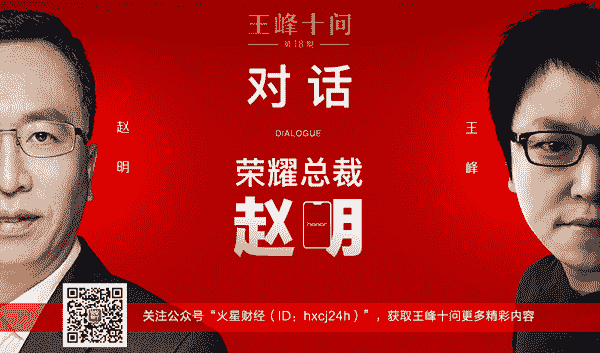
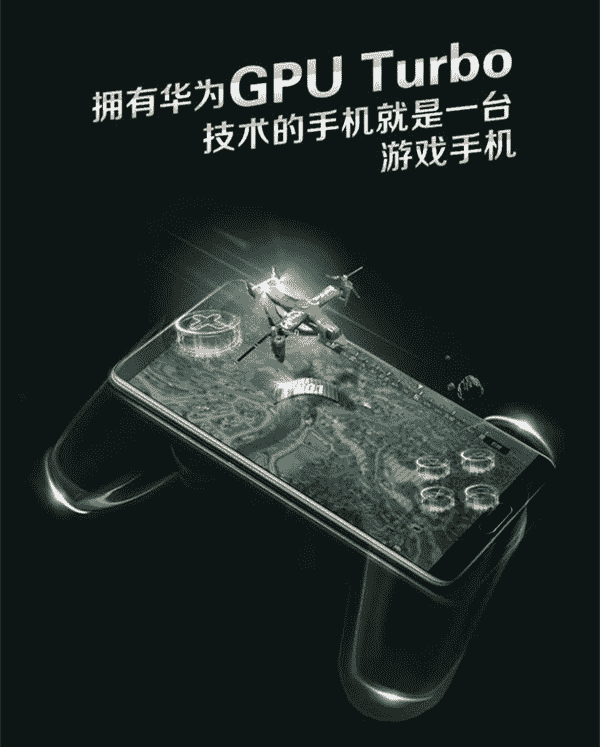
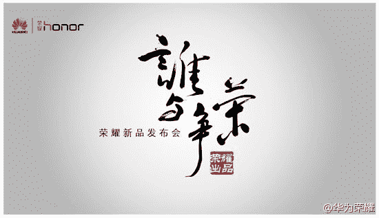
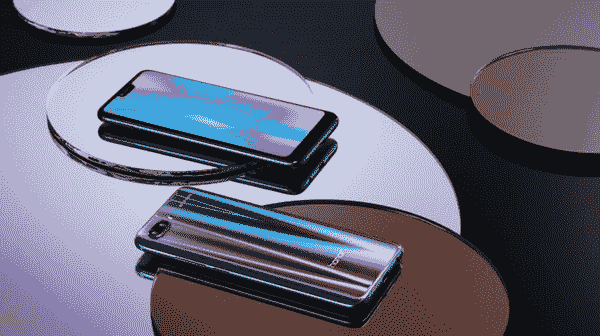
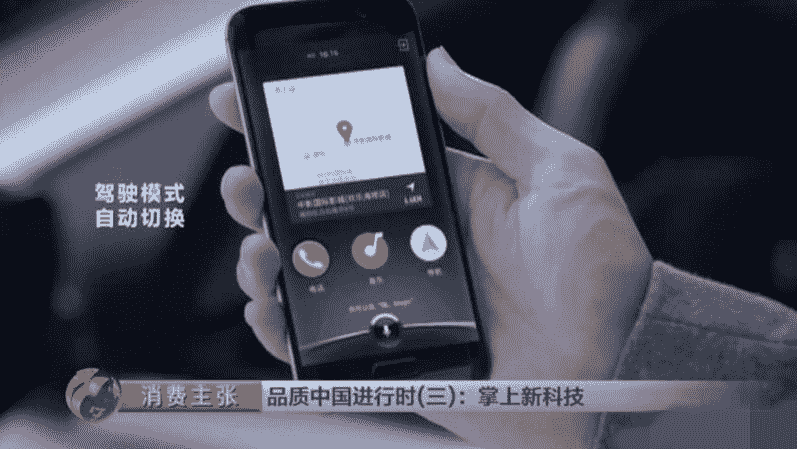
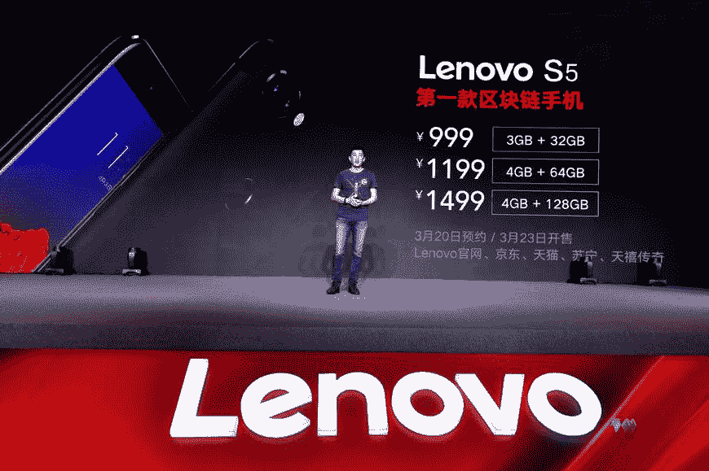
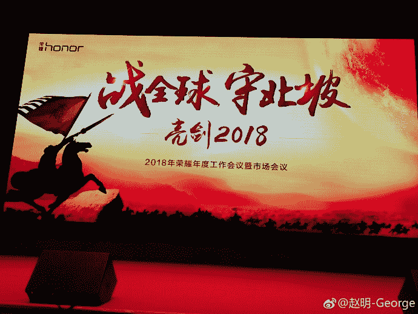
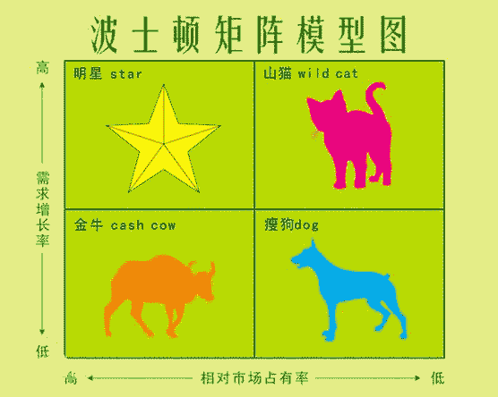

# 王峰十问第 18 期 | 荣耀掌门赵明：我不赞同将手机类比 PC 行业（附音频）

> 原文：[`news.huoxing24.com/2018060817344720393.html`](https://news.huoxing24.com/2018060817344720393.html)

**对话时间**：6 月 8 日 22 点

**微信社群**：王峰十问大本营

**对话嘉宾**：

**赵明：**荣耀总裁。1998 年 3 月加入华为公司，历任华为 CDMA/WiMAX/TD 产品线总裁、全球无线解决方案销售部部长、西欧地区部副总裁等职务。2015 年 3 月任荣耀总裁一职，全面负责荣耀业务。

**王峰：**火星财经发起人，蓝港互动集团（HK.8267）创始人，极客帮创投合伙人，曾任金山软件高级副总裁。

**以下为对话原文整理**：

**王峰：**这段时间，“很吓人的技术”几乎成了中国智能手机行业最火的一句宣传语，今天，我们就请来了“很吓人技术”的幕后主帅——荣耀总裁赵明做客“王峰十问”。我和赵总还未曾谋面，所以今天的聊天该算是网友聊天啊。但我对赵总很是钦佩，他带领荣耀短短几年功夫，就做到了国内互联网手机品牌的第一。我发现，身边的同事朋友用荣耀手机的越来越多，不少人还从“果粉”变成了“花粉”，足见荣耀魅力之大。

不知不觉，“王峰十问”做到第十八期了。虽然边界从区块链拓展到了互联网、科技及财经等领域，但是，问历史、问人性的角度不变，且倾听、且质疑的方式不变。最终铭刻在我们心里、久久不能忘记的，一定是那些和我们一起聊过、遇到过、相处过的有血有肉的人。所以，非常期待今晚与赵明的对话。

**第一问**

**王峰：**我知道，荣耀是华为旗下重要的手机业务品牌，华为掌门任正非对荣耀寄予了厚望，明确提出打造荣耀的独立品牌。从荣耀的 V8，V9，再到 V10 和最新发布的荣耀 Play 等等，都取得了市场佳绩。可是我发现，虽然每次都是你亲自登台做新品发布会，荣耀产品也叫好也叫座，然而，在公众视野中你鲜为人所知，相比较而言，同样是发布会上的常客，无论是小米雷军、锤子罗永浩、还是你的同事余承东，都比你更为被大众所熟知，是华为要求干部不能太高调，还是你个性使然？我发现，最近几年，大量的互联网产品往往都助力于品牌人格化，如果产品负责人或业务负责人过于低调，会不会让产品失去个性？比如苹果的乔布斯就极其重视这方面，这个印象大家能理解吧。

品牌人格化的代表——苹果乔布斯

**赵明：**这一方面公司的文化比较低调，也和我的个性有关，另一方面我认为，品牌和产品比个人其实更重要，更值得宣传，也更值得吸引大众眼球和引起大众关注。华为公司的高管包括老余，都是理工男的背景出身，专注于打磨自己的产品和品牌，用产品和品牌去影响用户，就像这次发布的荣耀 play 一样，其实都是产品和技术自带流量。从公司的整个发展理念也可以看到，我们本身就不是靠哗众取宠来取胜的。我们 2017 年研发投入就达 104 亿欧元占营收的 14.9%，超过苹果，位列全球研发投入排名第六位。我们更擅长用产品说话。

**第二问**

**王峰：**我们回到你刚刚到发布会上的内容吧。前天下午，华为消费者业务 BG 的 CEO 余承东和你在北京开了一场发布会，推出了 GPU Turbo 和荣耀 Play 手机新品。听说，GPU Turbo 的图形处理加速，是一项“很吓人的技术”，哈哈，瞧这词儿用的。

很吓人的技术

虽然，现场演示的游戏表现确实很惊艳，但很快我们发现，不知是网友揭发，还是你的友商刻意安排，网上开始有这样一个观点“GPU Turbo 只是针对少量游戏做的特别优化，仅仅算是营销噱头”。针对这样的暗讽，你要不要在这里回应下？哈哈。

**赵明：**研发小伙伴要知道这个说法该非常愤怒了。GPU Turbo 是一个革命性的图形处理增强技术，它是基于软硬件协同和一体化设计，把整个软硬件的体系做到极致。相当于把 GPU 里面的微码进行调整，跟操作系统融合在一起设计出来的。这一技术是基于我们自家的软件和硬件开发，暂时其他的芯片平台还无法支持。目前阶段，我们所优化的 6 款游戏涉及各个领域和方向，是非常具有代表性的，比如说《王者荣耀》和吃鸡游戏，这两类大型的对于资源消耗比较大的游戏我们都能够胜任，那么大家可以想象，类似的这类其他游戏肯定都没有问题。所以说，并非如外界所说的，是只对个别游戏做特别优化。另外我想强调一点，类似发布会上展示的和友商的 PK，用单线程战胜了多线程，这么高难度的动作，只有华为和荣耀能做到。如果大家都是在单线程上，那我们不止甩对手一条街，不知道会甩几条街。

**朱啸虎：**和 P20 比怎么样？

赵明：P20 很快也会升级支持 GPU TURBO，一样在天上飞。我吃鸡游戏以前玩的少，这次发布荣耀 PLAY，亲自测试了一下，玩起来特别爽，王者荣耀也能轻松满帧。

**第三问**

王峰：前天的发布会上，余承东和你同台，为荣耀新款手机加油打气，足见华为对荣耀品牌的重视。我注意到一个数据，同门双子星的华为+荣耀两大品牌系列手机 2017 年出货量累计达到 1.53 亿台，中国市场份额保持第一，全球份额稳居 TOP3。余承东预计，2018 年华为+荣耀双品牌的销量将突破 2 亿台。可是我查了很多资料，都没有找到荣耀在整个华为手机业务中的销售量占比，你在今天的“王峰十问”，方便透露相关数据吗？且我发现，国内智能手机市场上各家公布的数据不一。

**赵明：**我去年年中的时候说过，两年之内不再公布我们的销售数据。这一方面是为了更专注于做自己的事，也是为了避免跟别人打嘴炮，目前来看我们做到了。其实现在的很多数据报告都可以作为参考，在国内，我们认为赛诺的数据是相对准确的，海外的可以参考 GFK 的数据。

**王峰：**追问，荣耀品牌从 2013 年 12 月开始独立运作，到现在已经有四年半的时间。荣耀起初的定位是互联网手机，我想了解一下最初这个定位是基于什么考虑？且如今，市场形势已经发生了很大变化，我看到任正非去年底在华为内部说，荣耀的销售不再拘泥于形式，不要过多强调线上、线下。这是否意味着荣耀“互联网手机”定位的历史使命已经完成？ 

荣耀最初发布会的主题——谁与争荣

**赵明：**互联网手机是伴随移动互联网的快速发展应势而生的，它带来了用户沟通、品牌体验、产品研发、营销效率的全面革新，直到现在，互联网手机轻资产、快沟通、易购买、高效率的优势依旧存在。但是，我们这里要明确一点，互联网手机模式不仅仅是渠道模式，更加是一种思维模式和商业模式，单纯用渠道来定义或衡量一个品牌是不是互联网手机品牌，显然过于片面了。在我看来，线上线下融合的全渠道模式，是互联网手机不断进化的一个体现。互联网手机的核心在于能更快捕捉消费者的需求，然后更快速的去响应与满足，利用线上和线下融合的方式把效率提升到极致。

荣耀目前在全球范围内的全部团队成员不到 600 人，可以说我们是最有效率的手机品牌。此外，我们的营销费用也是全行业最低，每年的营销费用不足总营收的 3%。

全球不到 600 人的营销和销售人员，可能找不到比荣耀更高效的团队了，这就是荣耀互联网手机的魅力。

**第四问**

**王峰：**对于华为与荣耀两个品牌，任正非很早就明确了要独立运作，并给予了分工，华为品牌面向高端，荣耀面向年轻人市场，形成 “双犄角”。可是我了解到，华为和荣耀的同代产品之间，无论是硬件配置，还是价格，在中低端区间有大量重叠。那么，这两个品牌的区别和要覆盖的目标市场到底是怎么界定的？同时做两个独立品牌对于华为的战略价值分别是什么？我可以理解这种打法类似于 OPPO 和 vivo 两个品牌保持同门竞争，但加起来又确保了总份额优势的竞争策略？，此外，你怎么评价荣耀手机的同门师兄——以华为品牌直接命名的这个竞争对手？

**赵明：**感觉是个小坑呢 ，不过在我们内部真不是问题。我们互相学习互相促进，我们向华为学习如何构建品牌、打造产品，华为向荣耀学习如何利用互联网做营销，更加贴近年轻人。双品牌运作中，我们更多看到的是全面满足消费者的优势，过去 7 年，华为+荣耀双品牌销量增长了 51 倍。

华为和荣耀分别满足不同消费者的要求，用各自面对的不同人群来定位我们这两个品牌，当然，有一部分产品的用户可能会有重叠，也有一些产品会在价格、配置上有重叠，因为双品牌是独立面向市场的，各自有各自完整的产品序列是很正常的。

荣耀定位是极其鲜明的，就是打造面向年轻人的科技潮品。从市场和消费者的角度来看，华为品牌和荣耀品牌的品牌调性、品牌区隔也越来越明显。目前，双品牌运作带来的市场份额的增加是可以显而易见的。感受一下荣耀产品调性。

**第五问**

**王峰：**我的感觉，荣耀手机在互联网上的声量，似乎没有小米手机大，但是我们一看公布出来的销量却一点不差。很多手机厂商都想用小米的线上营销方式去打败小米，结果大多数都失败了。很多人看来，小米营销在明处，荣耀营销在暗处。天下武功，各不一般，我相信你们一定有自己的独特手段，那么说说你的秘籍？

**赵明：**我认为在目前市场上，可能没有任何一个品牌的互联网营销比小米更强，互联网营销是小米最强的部分。但是荣耀最强的是产品本身，是产品的品质、质量、性能、体验等等。市场竞争主要是看谁的长板更长，营销我们做到尽自己最大的努力就好。其实，荣耀一直是个长跑选手，你会看到，每一年我们都在提升自己，我们和消费者的沟通也在改善，因为用过我们产品的人都说我们的产品好，我们产品的 NPS（净推荐值）一直处于领先的位置，在中国市场，华为、荣耀、苹果并列第一，NPS 达到 47%。从长期竞争来讲，我们的优势就体现出来了。当然，在营销方面我们也要向小米和雷总学习。

**第六问**

**王峰：**你最近开始不断强调，AI 是荣耀手机的核心战略。在手机 AI 方面，荣耀算得上开创了业内很多先河，从 2016 年 12 月发布的荣耀 Magic，开启了手机人工智能时代，到荣耀 V10 的 AI 1.0，再到现在荣耀 10 的 AI 2.0。不少人认为，手机厂商提 AI，只是为了在同质化竞争中加入新概念进行包装罢了，噱头大于实用。对此，你如何回应？

央视曾报道荣耀人工智能手机 Magic

**赵明：**现在每次海外发布会，媒体还问我 magic 怎么不在海外发布。

AI 分三层，第一是 AI 底层的 AI 算力，荣耀 Play、荣耀 10、荣耀 V10 的 NPU 在人工智能算力上都是最强的；人工智能的第 2 层面是智慧的操作系统，荣耀 Magic 中我们首次引入了人工智能的操作系统 Magic Live；第 3 层是应用层，在这个层面我们可以把 AI 的算力、处理能力和体验赋能出去，从而改善应用，优化使用体验。

我们今天可以看到，从荣耀 Magic 以后，我们在 AI 的三个层面都开始发力，我们是在三个层面同时发力的手机品牌。从荣耀 Magic、荣耀 V10 以后，几乎市场上所有的品牌都在蹭我们 AI 的概念，但是如今荣耀的 AI 已经走到了 AI 2.0 时代，在这个方面，我们至少领先其他品牌半年到一年。

我认为，人工智能是手机行业一个跨越发展的契机，在未来是最能够极大改变手机应用体验的技术方向。

**王峰：**我们知道，人工智能的基础是大数据，不能掌握足够大的数据资产，狭义的人工智能应用效果会很差。但今天，消费者行为数据已经被互联网公司控制了，美国是 Facebook、Google、Amazon，中国就是腾讯、阿里和百度，甚至是今日头条，荣耀作为硬件厂商开发 AI 智能，会和苹果面临同样的问题，数据不在自己手里，空有 AI 算法还是不行。我觉得，荣耀的人工智能不好做啊。你觉得呢？

**赵明：**其实我在荣耀 Magic 发布的时候就说过，人工智能的时代，中国有可能领先，但前提是我们首先要打造一个开放、合作的生态关系。荣耀一直坚持“有朋友，有未来”，从目前来看，我们和互联网公司、服务提供商们并不是一个冲突的关系，而是合作的关系。荣耀从来没有去幻想打造一个封闭的生态，什么都自己做是不行的。不管是共享人工智能的能力和接口，还是共建人工智能生态圈，这需要大家都把各自的能力贡献出来。荣耀希望更多的合作伙伴和互联网公司意识到，AI 对各个行业、对整个产业链都是一个巨大的机会，大家应该加入到这种合作的同盟当中来。

**李劳：**在 AI 方面 赵总最想和谁合作？

**赵明：**AI 围绕个人生活提供服务，这方面伙伴希望越多越好

**第七问**

**王峰：**区块链被业界称为引发第四次工业革命的重要技术。习大大不久前在中科院第十九次院士大会、中国工程院第十四次院士大会上指出，新一轮科技革命和产业变革正在重构全球创新版图、重塑全球经济结构；以人工智能、量子信息、移动通信、物联网、区块链为代表的新一代信息技术在加速突破应用。如果我没记错，这应该是中央最高层领导首次在公开发言中提及“区块链”。据我了解，各大硬件厂商围绕区块链技术已经开展了很多布局。联想在 3 月推出了“自家第一款区块链手机”S5，锤子科技 CEO 罗永浩在之前做客“王峰十问”时，也表示锤子一定会做区块链手机。今年四月中旬，华为云发布了区块链白皮书，并强调只做技术不碰虚拟货币，也有传言华为手机在海外安装数字货币钱包，你是如何理解区块链的？区块链如今这么热，荣耀会考虑推出区块链手机或硬件业务吗？

号称联想的第一款区块链手机 S5

**赵明：**有些传言已经澄清过了，区块链是一项突破性的技术，但相对于 AI 在手机上的应用还是一个概念。我们目前聚焦于打造 AI 技术，更看好 AI 对手机能力的提升，区块链技术也在关注。

真正的区块链手机兴起，应该伴随着用户真正需求的解决、现实应用的普及。未来如何让区块链手机在手机现实应用上落地普及，并且产生真正有益消费者的实质性收益，还是需要业界同仁一起做更多的努力和探索。

**第八问**

**王峰：**有业内人士分析，荣耀人工智能引擎对腾讯、百度等互联网企业有所触动，涉及互联网服务入口这一重大核心利益，对他们构成了战略性的威胁。你是否同意这个说法？

赵明：应该是过度解读和紧张了。华为/荣耀作为硬件和手机公司，在互联网服务上与腾讯、阿里巴巴、今日头条、百度、美团都是合作的关系，我们需要一起努力，共同打造 AI 的生态系统。

我们不能画地为牢，而是应该把能力贡献出来，实现数据和逻辑对接，这样人工智能才能提供更好的体验。如果都是画地为牢，我的东西你不能碰，我也不开放给你，未来人工智能的发展会受到很大的阻碍。

**第九问**

**王峰：**2017 年下半年，你曾提出用三年左右的时间，在海外再打造一个荣耀，复制中国快速成长的故事。但在这个时间点出海，无论是小米，还是同门的华为手机，都已经在欧美、东南亚等主要手机市场占据了很大份额。荣耀在海外是否会面临内外夹击的局面？身为荣耀掌门，你打算如何在海外市场破局？是会借助同门华为已有渠道，还是另辟蹊径？

亮剑 2018

**赵明：**荣耀走向全球市场的时候，是独自去构建自己的能力，独自面向市场、用户、渠道和零售，只有把自己的能力夯实，未来才走得更远和踏实。在整体上来看，荣耀这一次海外战略应该是从 2017 年下半年逐渐成型的，先是在集团内部开始讨论然后全面实施。

去年 12 月 5 日的伦敦发布会，我对外正式公布了荣耀海外三年战略，也就是到 2020 年的时候实现全球销量排名前五，国内销量和海外销量是 50：50，2017 年的时候这个比例是 15%，85%的销量来自于国内。2018 年 1-5 月份海外市场的销售增速是超过 100%。现在，海外占比超过了 20%，今年全年来看可以达到 25%或者 30%。

**许波：**请问赵总打头阵的海外市场是哪里？

**赵明：**俄罗斯、西欧等国，俄罗斯现在第二了。在海外市场，我们并不惧怕竞争，还是会坚定我们品牌的核心理念，打造属于年轻人的科技潮品。所以我们的品牌定位和走向市场的方式，绝对不会因为竞争的关系而以低价来占领市场。

其实这是很多中国品牌走向海外时常用的手段，就是用低价占领市场，但这样给人的感觉就是，你的品牌永远升不上去。

今年的上半年，我们的海外业务增长是 100%，到现在荣耀在海外的发展都是健康而且高速的。你会发现一点，荣耀是以旗舰机开路，我们代表荣耀品牌的是荣耀 8、荣耀 9、荣耀 10。其实在伦敦发布会的时候媒体问我：“怎么看你的竞争对手”，我说在我回答你的问题之前，我先问你一个问题，你看到荣耀想到荣耀这个品牌，你想到荣耀的产品是什么？荣耀 8、荣耀 9。今年荣耀 10 在海外的销量跟荣耀 9 比，是荣耀 9 的 300%。还有很多国家没有上市。所以目前这个销量提升是非常快的。我们在海外市场树立自己的品牌形象是非常清楚的，在旗舰机的品牌带动下，我们的千元机系列销量增长更为迅猛。

**第十问**

**王峰：**在经历了连续几年的快速增长之后，全球智能手机市场出现下滑迹象。据 IDC 数据显示，2018 年 Q1，全球智能手机的出货量为 3.361 亿部，同比下降 2.4%；中国智能手机市场出货量为 8750 万台，同比下降 16%。虽然，2018 年 Q1 荣耀手机保持逆势增长，但我大胆设问，会不会在 1 年之后，全球的手机厂商将面临 PC 当年不得不面对的市场大拐点的窘境？即使有摩尔定律的加持，PC 也最终像当年家电业一样，从“明星业务”沦为“瘦狗业务”，好像所有的消费电子产品都会迎来这样的大拐点。你判断，手机行业的大拐点还有多久会到来？

瘦狗业务是波士顿矩阵中业务类型之一

**赵明：**这点我倒是有不同看法。手机行业的拐点，跟荣耀手机的拐点是两个概念，我们至少能看到在未来 3-5 年中，荣耀手机还是会处于一个健康和高速发展的阶段。我不赞同拿手机行业类比家电行业或者 PC 行业。

从全球发展来看，移动通信技术是每隔十年就会有大的升级换代，从 4G 到 5G，一定会带来革命性的应用体验，电脑行业反倒是没有这样的技术革命的驱动。

十年前的电脑能干的事情，和十年后能干的事情，没有本质的差别，无非都是图像处理、PC 游戏，它没有改变人与机器、人与人之间的关系。

但手机不一样，从 2G 打电话、发短信；到 3G 能够上网；4G 能够看视频、打网络游戏；每一次通信技术的革新，都会带来新的应用、新的技术的发展，而最重要的是改变了人与机器、人与人之间的关系，这种关系变化就是融合与连接的实现。虚拟现实应用会越来越普及。到了 5G 时代，由于通信技术的进步，又会有很多革命性的应用涌现，人与机器、人与人的关系还会发生怎样的变化，这一切都非常值得期待。

所以我认为所谓的拐点，没有可对比性。手机每个技术周期都会强制重新刷新一遍，这个是普遍性的，也是手机与 PC 周期和规律不太一样的原因。移动通信 10 年左右一个周期，和建设周期、成熟期、回收期都有关系。

**王峰：**有人问，你眼中的荣耀是什么样？你说用“笨鸟”来形容荣耀更贴切，荣耀是在互联网时代不等风的笨鸟，努力练硬自己的翅膀，不管是顶风还是逆风，一旦认准方向，就执着向前。成功没有捷径，也许，在很多行业崇尚说概念、讲故事的今天，最需要的就是“笨鸟”思维，我们应该为不等风的笨鸟“荣耀”点赞！

**赵明：**笨鸟是真实写照而已

**王峰：**再次谢谢赵明总，感谢今晚做客“王峰十问”，祝荣耀大卖，再创佳绩。

本文为火星财经原创稿件，版权归火星财经所有，未经授权不得转载，转载须在文章标题后注明“文章来源：火星财经”，若违规转载，火星财经有权追究法律责任。