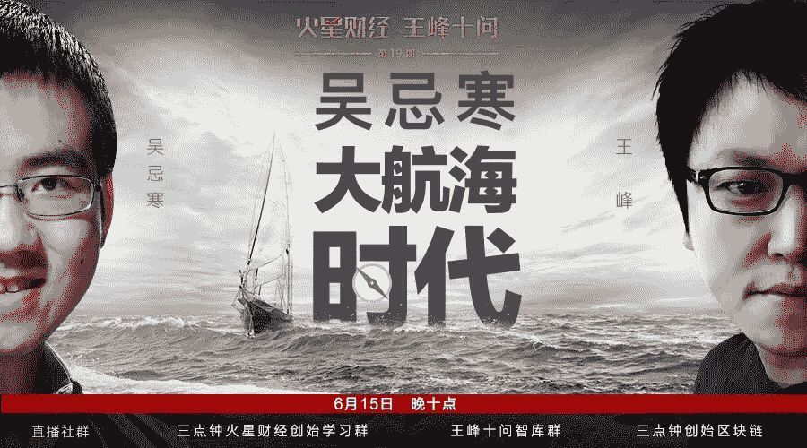
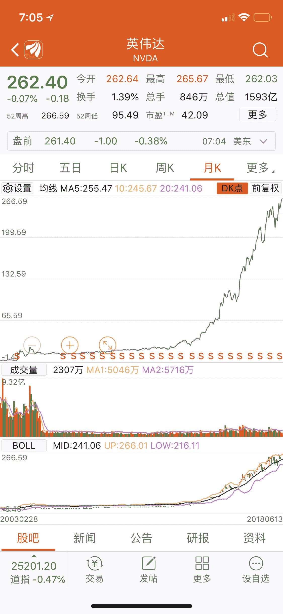
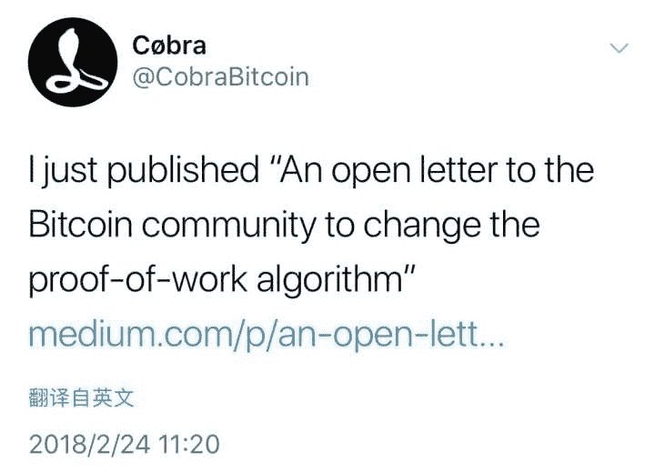
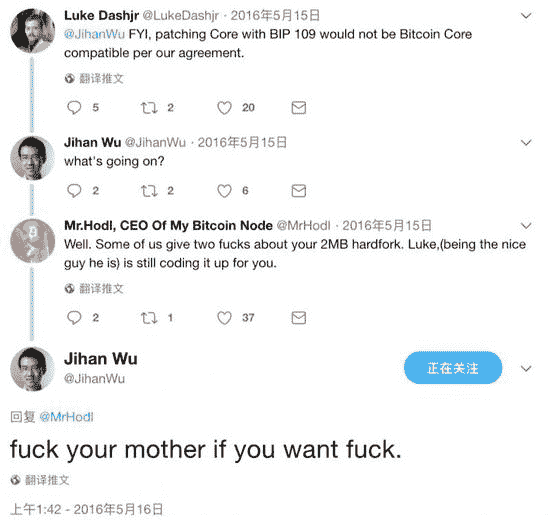
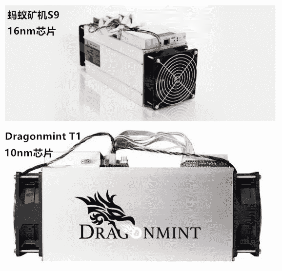
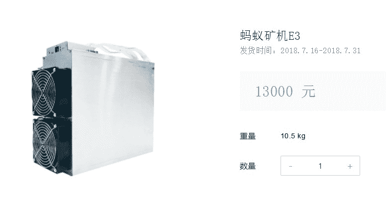
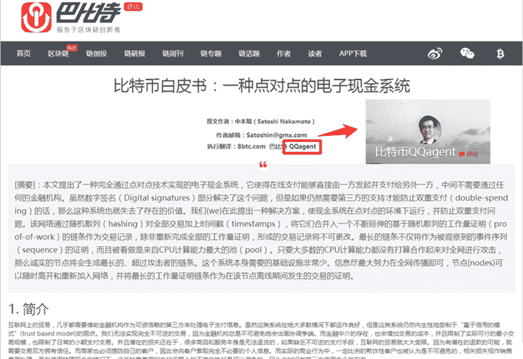
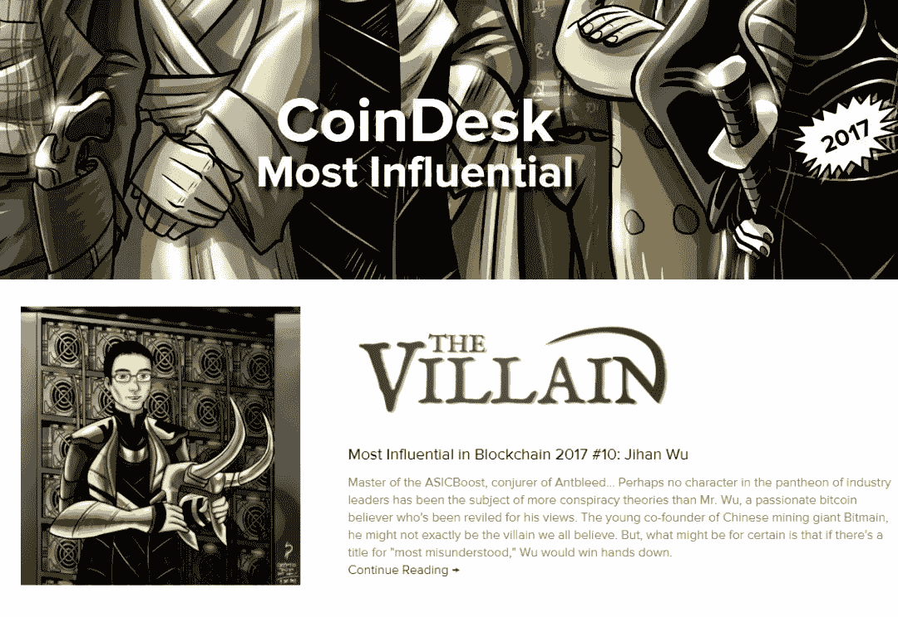
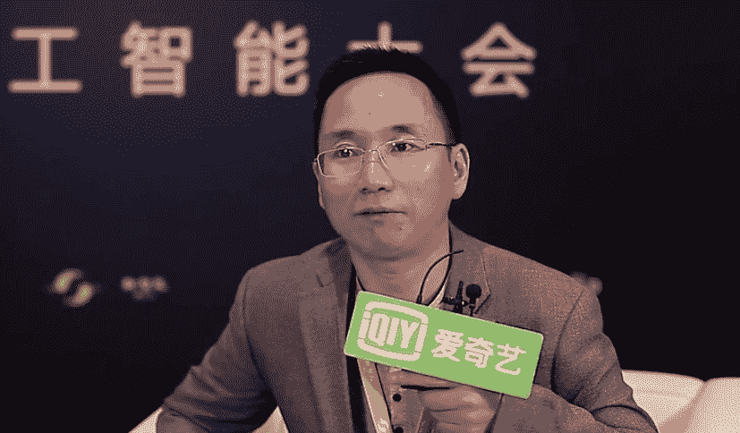

# 王峰十问第 19 期 | 比特大陆联合创始人吴忌寒：我不是一个精明的商人（附音频）

> 原文：[`news.huoxing24.com/2018061517234807956.html`](https://news.huoxing24.com/2018061517234807956.html)

**** 

**对话时间**：6 月 8 日 22 点

**微信社群**：王峰十问大本营

**对话嘉宾**：

吴忌寒：比特大陆联合创始人。毕业于北京大学，拥有经济学和心理学双学位。2011 年参与比特币社区，联合创办了中国比特币社区重要媒体巴比特(8btc.com)；2013 年创办比特大陆（BITMAIN），任公司董事和联合 CEO，主要负责市场、销售、战略投资和投资人关系。

王峰：火星财经发起人，蓝港互动集团（HK.8267）创始人，极客帮创投合伙人，曾任金山软件高级副总裁。

**以下为对话原文整理**：

王峰：给大家介绍今天来的嘉宾：比特大陆联合创始人吴忌寒，一位非常神秘的人物。先让我们看一看他的经历：2009 年毕业于北京大学，获经济学和心理学双学位。在创业之前，曾从事私募股权母基金的投资分析师和投资经理工作。2011 年接触到比特币，并与长铗等人联合创立了中国比特币社区巴比特，同年，他首次把中本聪的比特币创始论文《比特币：一种点对点的电子现金系统》翻译成了中文。2013 年创办比特大陆（BITMAIN），任公司董事和联合 CEO。

不久前我和忌寒在徐老师和冯波的饭局上第一次见面，因为都是重庆老乡，格外亲切，他话不多说，给人第一印象是温文尔雅，谦逊从容，我很难把媒体描述的“矿霸”“教主”“恐怖分子”“恶棍”这些字眼和他直接画上等号。

但我相信，他平静的外表下，内心一定无比澎湃激昂。经历过比特币世界从空无到繁盛并几度起落浮沉的他，拥有价值千亿美金比特币世界绝对权力的他，正在区块链所引发新的“大航海时代”中，带领比特大陆这艘航船劈波斩浪前行。新的大航海时代，未来我们将走向何方？通过对话小寒，希望今晚的“王峰十问”能给大家一些启发和思考，这也正是本期“大航海时代”主题的初衷所在。下面，开始我们今天的“王峰十问”吧。

**第一问**

**王峰：**根据上周四彭博社报道，我们知道红杉和新加坡政府基金以 4 亿美元参与了比特大陆的 Pre-IPO 融资，传闻此轮估值达 120 亿美元。如果这个消息属实，可以想见不久后，我们会见证在传统资本市场上最大的区块链 IPO。鉴于比特大陆进入人工智能芯片领域，彭博社将 MTK、英伟达等 IC 厂商拿来与你做估值对标。但是，我有一个问题，每家公司都对标的是自己的时代，而不是某个厂商。GPU 芯片厂商英伟达赶上了世界对人工智能逐梦的红利，虽然之前他们的市值曾横盘了 13 年，被业界和投资者不重视，但从 2016 年初开始一路狂涨，10 几个月增长 10 倍，达到创历史新高的 1600 亿美金市值。另一个例子是高通，这家移动设备芯片霸主在 2014 年就过了千亿美金市值，他们赶上了苹果、三星、华为、小米等推动的智能手机大爆发热潮，虽然现在降到 800 多亿，但它依然是移动互联网浪潮的最大受益者之一。再之前，英特尔赶上了个人电脑走进家庭和企业桌面的红利。总之，他们都是背靠巨大增量的市场，成为产业的领导者。

英伟达市值一路狂涨

我的问题是比特大陆作为控制数字黄金比特币等数字货币市场上的矿机霸主，作为区块链产业中具足轻重的力量，什么时候会迎来一个自己的市场价值巅峰？比特币最高市值 3200 亿美金，现在是 1100 亿美金。你是否曾想过，有一天你公司的市值可能会超过比特币的市值？期待小寒的回复。

**吴忌寒：**市值是比较虚幻的东西，有一个概念叫做流动性幻觉。就是说某一类资产感觉“总市值“多少多少，每个投资人都觉得，假如自己卖出手里的股票或者资产，就能得到”价格*数量“那么多钱。但是这里面是有一个幻觉存在的：当所有投资人都要在同一时间套现，就很难以这样的”价格“真正卖出去——如果投资人集体抛售，价格就会低很多。

巴菲特常说，你如果要买一个股票，就要假设一下，假定股票市场明天就关闭十年，你是否还愿意买入。在经营企业时，天天盯着市值，也是有害的，因为财务投资人的风险偏好和个体情绪、宏观经济波动等都会影响市值。行业的周期波动，也会带来企业“市值”的巨大变化，做企业的还是盯着自己企业核心竞争力的发展比较好。创始人不理会二级市场的市值，这样的魄力其实对于企业的发展很关键。你刚才提到的某家企业，创始人就敢于冒所有人的反对，对一些未经证明的方向猛下赌注；它的竞争对手，是职业经理人掌握的，就做不到这一点了。最后总是关注二级市场反应的竞争对手吃亏很大：）

**王峰：**假设是创新之本，和做互联网状态一样啊。

**第二问**

**王峰：**今年 2 月份，Bitcoin.org 网站的管理员 Cobra 发布公开信，打算修改比特币的共识机制 POW（工作量证明），引入 POW+POS（权益证明）混合机制。据说就是为了应对比特大陆对比特币算力的垄断。上周五，Cobra 又发布推特称，吴忌寒和 ViaBTC 的 CEO 杨海坡两人可以轻易对比特币发起 51%的攻击，彻底击垮价值 1300 亿美元的比特币网络。

2 月份，比特币开发代表 Cobra 通过推特发表一封公开信

这里再科普一下“51%攻击”，它的原理在于数字货币采用的分布式记账机制。以比特币为例，51%攻击是掌握了比特币全网的 51%算力之后，用这些算力可以重新计算已经确认过的区块，使块链产生分叉并且获得利益的行为。而后，你在推特上回应：“在修改（比特币）原始白皮书前，请阅读中本聪关于 51%攻击的分析；它（51%攻击）不会成为比特币的终结者。”容本人冒昧地说一句，我猜 99%的比特币拥有者都没有像你那样，仔细读过比特币的原始白皮书，你能否进一步解释你在推特上的回应？

**吴忌寒：**“设想如下场景：一个攻击者试图比诚实节点产生链条更快地制造替代性区块链。即便它达到了这一目的，但是整个系统也并非就此完全受制于攻击者的独断意志了，比方说凭空创造价值，或者掠夺本不属于攻击者的货币。这是因为节点将不会接受无效的交易，而诚实的节点永远不会接受一个包含了无效信息的区块。一个攻击者能做的，最多是更改他自己的交易信息，并试图拿回他刚刚付给别人的钱。：——中本聪的比特币白皮书。

里面的重点是：1）即便攻击成功，整个系统也并非就此完全受制于攻击者的独断意志；2）一个攻击者能做的，最多是更改他自己的交易信息，并试图拿回他刚刚付给别人的钱。在中本聪的白皮书中，他论证了，51%攻击只会导致部分系统使用者，也就是接受攻击者支付的人，在没有防范的情况下，会受到伤害。

Cobra 是 Bitcoin.org 的域名的联合控制人，他（或她）个人与 Bitcoin Core 的分歧很大，今年还曾经采取单边行动，把 Bitcoin.org 推荐的客户端从 Bitcoin Core 改成了一个不知名的 Bitcoin Knot。[`www.yours.org/content/the-bitcoin-conspiracy--luke-jr-and-cobra-bitcoin-b344bf498005`](https://www.yours.org/content/the-bitcoin-conspiracy--luke-jr-and-cobra-bitcoin-b344bf498005)

Cobra 算是少数很狂热的人了，同时反对几乎所有重要的比特币企业，我不幸或者荣幸地成为其反对对象之一。

**王峰：**话说回来，就在上个月，比特币的分叉币之一 BTG（比特币黄金）就不幸沦为“51%攻击”受害者，攻击者成功实施“双花交易”，向自己发送了超过 38 万个 BTG。哈哈，疯狂。我们简单计算，如果所有资金被盗，攻击者从交易所的损失中将获利超过 1800 万美元。而且，根据一些外媒报道，Monacoin、Zencash、Verge 和 Litecoin Cash 等不少数字货币已经遭遇过“51%攻击”，蒙受了上百万美元的损失。

作为拥有比特币网络接近一半算力的比特大陆掌门人，你如何让我们相信，对由中本聪一手创造的、寄托人类更美好未来的原生比特币网络不会被人恶意破坏？在你看来，随着“51%攻击”现象的频频出现，未来可能会动摇整个数字货币世界的根基吗？

**吴忌寒：**首先，俺没有“拥有”那么多比例的算力，很多我们的客户，自己运维自己的矿机，但是把算力指向我们经营的矿池。这种算力指向是随时可以变化的，如果我们作恶，我们的客户会立即响应，把算力切到其他矿池，不会坐视我们作恶不管的。我们可以算作是“受托”了很多比例的算力。

51%算力攻击没有办法凭空创造价值，也就是说，没有办法凭空增发。

说到 BTG 网络攻击，其中还是有很多疑点的：攻击者控制了 38 万个 BTG 的私钥，那么请问谁有这么多的 BTG 呢？

按照一般的攻击手法，这些 BTG 被送往了交易所，会立即被卖出，换成其他种类的币并且提现提走。但是这么大量的 BTG 应该是不可能完成整个攻击流程的。——交易所不傻，提现 1800 万美金，让一次性提吗？能够允许大额提现的账户，都经过了严格的 KYC，跑得掉吗？同时，理论上这么大量的卖出，我们当时却看不到 BTG 价格的巨幅下跌。那么，攻击者到底是否真的对交易所实施了双花攻击呢？

这些疑点该怎么解释？我想我最好就不要继续分析了。

51%攻击的发起人，攻击者可能会让自己的挖矿设备的价值大幅减少；

BTG 等被 51%攻击的货币，一个重要特点是，采用 GPU 等通用计算设备挖矿。有关的算力据说来自 nicehash 网站，这是一个专门租赁云算力的网站。租算力的人不需要投资硬件，可以随时挖矿。

BTG 这类币，攻击者攻击跨了一个，还可以挖其他的币，因为计算设备是通用的；nicehash 租用算力，反正硬件是人家的，也不担心硬件贬值。在 ASIC 挖矿的币种上，攻击者付出的代价就要大很多。

怎么相信比特币网络不会被破坏？简单来说，不要相信。任何区块链从业者只要告诉你，自己的区块链不会受到攻击、是绝对安全的，那么你听听就罢了，感受一下这个人的狂热自信就好了（也就是所谓“为信仰充值”），不要当真。我的微博的签名是：比特币现金（BCH）是一种独立的、去中心化的记账单位，没有任何个人与机构对它的价值给予任何承诺与担保。

中本聪在比特币的创世白皮书中就详细分析了攻击者采用 51%的算力攻击整个区块链的情形，对其可能遭到破坏的后果进行了描述。这种科学和诚实的态度，是我们应该学习的。

那么为什么大家还是认为比特币网络是安全的呢？不是它不会遭到 51%攻击，而是在遭到攻击的情况下，损失有限，而且社区还有很多技术手段对整个系统进行恢复。简单说：区块链对于攻击具有极强的免疫性。

如果一个币的网络被 51%攻击了，该怎么办呢？

 可行的选择有很多，一是被动等待网络恢复：因为攻击者单纯发动 51%攻击是没有直接收益的，必须和具体的卖空、假充值挂钩的，具体来说，往往是为了双花某一笔交易。攻击者攻击一下就不攻击了。持续攻击成本很大，一旦得手就会停止攻击；二是社区可以发布紧急布丁，给区块链加上 check point，社区紧急约定攻击者的区块链无效；

所以，51%有很多应对办法，不会是一个区块链的世界末日。

**第三问**

**王峰：**随着比特币投资交易的日渐火爆，比特币网络拥堵严重，扩容成为了一个亟待解决的问题。2016 年 2 月，你和一群主要来自美国的 Bitcoin Core 方面的代表在香港达成和解协议，主张在实现隔离见证的同时，把区块容量扩大两倍。但是之后被搁置。2017 年 5 月，由 DCG 创始人 Barry Silbert 召集 22 个国家的 58 个公司代表举行了纽约会议，达成了 Segwit2X 的比特币扩容方案共识，把区块大小从 1M 扩容到 2M 左右，这样既解决了扩容的问题，又避免了分叉的出现。

但在 2017 年 7 月 17 日，比特大陆投资的 ViaBTC 宣布分叉比特币，并将新生成的币种命名为 Bitcoin Cash（BCH），据说这让签署了纽约共识的人非常气愤。今年 5 月份，BCH 又完成二次升级，通过硬分叉扩容到 32M，支持 100+TPS，承载能力和交易速度大大增加。当初你们围绕比特币扩容争议的分歧点在哪里？有人说 BCH 才是真正意义的比特币，可有此说？怎讲？

**吴忌寒：**说到纽约共识（New York Agreement），这个阶段性的妥协成果，最后是被扩容的大区块主义者和小区块主义者两个方面同时放弃的。2017 年 4 月，由于 Core 作为一个整体拒绝认可香港共识签署代表们的承诺，比特币扩容面临僵局。数字货币集团（DCG）创始人 Barry Silbert，投资了大量比特币，他感到自己必须站出来，推动行业打破僵局。Barry Silbert 私下跟我说，虽然 DCG 投资了很多种类的数字货币，但是 BTC 占据了最主要的仓位。他希望比特币可以顺利扩容。Barry 也是每年 5 月份在纽约召开的 Consensus 大会的主人。

整个 4 月份，Barry 异常勤奋地工作，和业内主要的公司、开发者代表展开了一对一的联系，他尽了极大的努力，去担任斡旋人的角色，付出了极大的心血之后，Barry 初步了软化了各方的立场。Blockstream 的 CEO, Adam Back 答应了 Barry 要在 5 月份去纽约参加面对面的磋商。但是 Adam 在临出发前，被 Blockstream 内部的另外一位重要的合伙人严厉地阻止了。这是 Adam 亲口在香港告诉 Micree 的。Adam 在纽约的会谈前夕，临时宣布拒绝参加会议。与此同时，Blockstream 派出了级别较低的缪永权参加会谈。

由于一些重要的比特币生态企业的抵制，缪永权被会议主持人 Barry 拒绝了。这些抵制缪永权的企业家威胁说，如果缪永权参加会谈，他们就拒绝出席。因此缪永权没有能够参加会议。为什么大家要抵制缪永权参加会议呢？主要是因为缪永权在 Twitter 上经常对于一些社区成员进行没有下限的人身攻击。

需要特别说明的是，我并没有参与到 Samson 抗议者的行列。这个过程可以说明，Blockstream 以及整个小区块阵营的开发者，一方面他们被行业内主要的公司排斥；另一方面，他们也是拒绝沟通的，Adam 临时决定不参加会议，反而派出名声很差的缪永权（经常以搅局者的面貌出现），就是一个很好的例证。

我查看了日历，会谈是在纽约的 2017 年 5 月 21 日进行。那是一个星期天，上午的阳光非常好。Barry 组织大家在一个酒店的楼顶，露天里，进行了一场会谈。因为阳光强烈，很多参会者都戴着墨镜。参会完后，我裸露的脖子后背还被晒伤了。Barry 邀请了社区主要的代表参加会议。

会议的讨论的焦点，就在于，SegWit 激活是否应该绑定硬分叉扩容，让两者同时进行。Barry 有意代表了不曾到场的 Adam，站在 Adam 的立场说话，希望大家可以同意先激活 SegWit，把扩容的事情放一放，先达成一个君子协定，将来再说。

但是现场的大多数企业，都希望能够绑定在一起。例如 Bitpay、Blockchain.info 等都指出，目前的比特币扩容形势已经刻不容缓。如果不能绑定在一起扩容，他们的用户就会被迫持续支付高额的手续费，他们就会立即开始支持替代性的密码学货币，例如以太坊。还有企业说，如果今天不能达成条件彼此绑定的有效协议，就立刻退场。他们说，Core 已经拒绝执行香港共识，我们为什么要在纽约重复制定一个香港共识？

Bitfury 的代表参加了这次会谈。Bitfury 是一贯支持小区块立场的，但是令我感到惊讶的是，Bitfury 的代表异常坚定地支持绑定一起扩容。那位代表认为，如果这么多企业一起达成共识，少数 Core 的极端小区块主义者，做不了什么，比特币扩容一定可以成功。

Barry 坚持着，希望在场代表能够接受 Adam 的提议，也就是先上 SegWit，别的以后再说。此时又有三家重要的企业代表威胁立刻离场。其他人虽然没有那么强烈的立场，但是都表示附和。最后，在场的代表——强调一下——在场的代表形成了共识，准备实施 SegWit+2M 绑定扩容的方案，也就是后来广为人知的 SegWit2X。这里其实有一个非常有意思的技术细节，希望跟大家分享一下。

比特币在做算力投票的时候，有多个投票位点。SegWit 的投票激活，是在位点 1 投票。而纽约共识推出的 SegWit2X 方案，为了明确表明社区是对 SegWit2X 进行投票，和 SegWit 本身区分开来，会议商定，准备在位点 4 进行投票。

为什么要选在位点 4，而不是位点 2、位点 3 呢？就是怕有什么不曾公布的社区方案，准备采用位点 2、位点 3。保守起见，选定位点 4，这样避免撞车。会议经过一个上午就开完了。Barry 在散会后，草拟了有关内容，并给与会代表确认。然后，Barry 就开始搜集更为广泛的签名支持。Barry 希望在马上就要召开的 Consensus 大会上宣布这个消息。自然而然地，在这个协议向公众公布之前，社区一些主要的开发者、企业家就都得知了协议内容。

紧接着周日的周一，协议依然只是在企业间收集支持签名。周一晚上，令人意外的事情出现了。Bitcoin Core 方面的一个开发者，名字叫做 James，在协议公布之前，他抢先提出了一个非常吊诡的方案，被编号为 BIP91。这个 BIP91 也决定采用位点 4 来进行投票。由于纽约共识的协议和方案没有被公布，看上去这个意外的撞车没有任何问题！当然仅仅是看上去没有问题而言。

SegWit2X 和 BIP91 都采用位点 4 进行投票。我们先不用管 BIP91 是什么，如果 BIP91 和 SegWit2X 都采用了位点 4 来投票，等投票真正发生的时候，就会分不清楚投票者到底投的是哪一个了。更进一步，一个投票者还可以持有一个模糊的立场，对自己的投票行为进行任意解读。

BIP91 的内容是什么呢？其实比较简单，就是先在位点 4 投票，等达到 80%的同意票数，就开始强制要求在位点 1 进行投票，然后 SegWit 就得以通过，解除 SegWit 需要 95%投票却一直达不到的僵局。至于扩大区块呢？就完全不存在了。BIP91 的前半部分，也就是激活 SegWit，和 SegWit2X 是一模一样的，唯一不同的是，到底是否在 SegWit 激活之后进行区块扩容。BIP91 没有区块扩容内容，SegWit2X 包含得有。当时国内两家矿池，就借此声称，先是支持纽约共识，后来又宣称，自己投票其实支持的是 BIP91。从 BIP91 故意抢着占用位点 4 开始，这几乎就是明说了，等到 SegWit 通过之后，他们就要立刻反悔对纽约共识的支持。纽约共识要流产的前景几乎是注定的了。与此同时呢，部分极端的 Bitcoin Core 的活动家，开始极力主张所谓的 UASF。这个 UASF 并没有得到 Core 的官方的支持。一时间，小区块阵营同时发布了两个客户端：UASF 客户端和 Core 客户端。UASF 没有得到所谓 Core 的支持，但是几乎整个 Blockstream 阵营都倾巢出动，在社交媒体上煽动对 UASF 的支持。

这些支持者作为资深的开发者，不是不明白，UASF 是一个非常危险的方案，在 UASF 期间，整个比特币网络会分叉成两个币，一个是 UASF 币，一个是正常的比特币。但是如果 UASF 的价格在后续的交易过程中变高，那么算力就会被吸引到 UASF 的链条上，然后 UASF 的链条变得更长，就会覆盖原来的比特币链条。UASF 实际上是一种依靠市场手段策划的 51%攻击行为。由于绝大多数交易所和用户都不明就里，不知道 UASF 的危险性所在，毫无防备可言，如果 UASF 发生，很多交易历史都会出现巨大的争议和混乱。整个比特币的链条出现超长深度的回滚，很多交易所、很多用户都会丢钱；因此这个时候，为了至少保证有一条链上的交易不被回滚，就必须采取措施了。于是我们和大区快社区内很多专家，基于另外一个提议，叫做 BUIP055，一起讨论出了被命名为 UAHF（用户激活硬分叉）的方案。UAHF 方案一开始是防守性的，是为了保证万一 UASF 被激活，整个比特币的交易历史还有一条备份存在，不会被完全抹除。UAHF 方案被实现后，很快大区快社区里，就出现了一些社区成员，策划将 UAHF 这个防守性的方案，变成一个进取性方案。大家研究发现，只要坚持实施 UAHF，加上特定的技术手段，一条崭新的大区快的区块链就会诞生，就会独立于比特币存在。于是，在预见到纽约共识必然遭到言而无信的小区块主义者的背叛的前景之后，UAHF 技术驱动下的 BCH 就诞生了。BCH 诞生之后的很长一段时间都没有人关注，整个大区块社区都积极推动纽约共识实现。Roger Ver 说，他会坚定地支持纽约共识，但是如果纽约共识不能实现，他和整个 Bitcoin.com 就会立即支持 BCH。纽约共识的部分签署者确实愤怒了。例如国内某小区块主义的矿池经营者说，我们不是明明支持纽约共识了吗，为什么 BCH 还是要独立。他忘记了，他在私下里到处说，他只是支持 BIP91，不是支持纽约共识。他支持纽约共识是为了激活 SegWit，不会执行区块扩大的部分。他们感到愤怒的是，他们希望把比特币区块链永远锁死在 1MB 的企图失败了。

“BCH 才是真正的比特币”，我个人不同意这种说法，但是我非常同情和理解。因为大区快主义者，包括很多早期就为了推广比特币而付出了巨大热情的人，对“比特币”这三个字有一种执着。所谓的“比特币”意味着什么呢？对于这些比特币的早期支持者而言，“比特币”意味着速度快、手续费低、没有中间人的支付网络、可以当作电子现金使用、中本聪原本计划好的扩容路线图等。那么对比 BCH 和 BTC，BCH 更加具有这些特性，因此有的人会说，BCH 才是真正的比特币。

我不同意这种说法。BCH 是从 BTC 社区独立出来的，它们共同享有一段历史，从 2017 年 8 月 1 日之后，就分家过日子了。就好像美国从英国的统治之下获得独立，但是美国人把自己的国家叫做美国，不会有哪个美国人说，美国才是真正的英国。加拿大是一部分美国人因为政见不同，逃亡北美洲北部成立的，也不会有加拿大人声称，加拿大才是真正的美国。

这里我也呼吁 BTC 社区和 BCH 社区，友好相处，在各自的技术路线图上好好发展。不论 BCH 的成功，还是 BTC 的成功，或者他们共同成功，都是这项伟大发明的成功。BTC 社区内一些早期的重要贡献者也修改了自己的说法，例如 Gavin 说，BCH 是他从 2010 年就开始为之努力的那个项目。

**王峰：**你这一问答，彻底刷新十问单一问题回复记录。我们重庆崽的性格，还是在关键时候体现出来。在 BCH 被人指责中心化的罪名时，你在 Twitter、Reddit 等平台上，对所谓的“敌人”破口大骂，比如那句著名的“Fuck your mother if you want fuck”？哈哈，你的情绪容易控制吗？毕竟，你掌握了比特币网络那么大的权力。今晚，月光凌厉，虽隐匿于云层中。

**吴忌寒：**当时回答那句话时，觉得只是人家在 twitter 上说脏话喷我，我就必须喷回去。后来发现，吃亏的是我，以后就不这么喷回去了。我的这句脏话广为流传，还有人做了 T-shirt，反正以后尽量不说了就是了。

“权力”真的谈不上，我们自己完全拥有的算力很少，大量算力都是受托，任何僭越的行为都会遭到我们客户谴责和抵制。希望努力维护矿池的信息安全，不要出事儿就好。

**王峰：**理解，可是前不久，又有一些人集体向你开炮，称比特币分叉背后的主使人就是吴忌寒，他们指责：“为什么在纽约共识已经达成的情况下，你要单方面破坏纽约共识，分叉出 BCH 呢？”网上还有一段故事，我不知真假，听说你还找来一位“假的中本聪 CSW”（一个名为 Craig Steven Wright 的澳洲商人，2016 年自称是 “中本聪”，但一直没有提供证据）给 BCH 到处站台。以上质疑，你做回应吗？这些人好像也在我们火星财经群里。

名为 Craig Steven Wright 的澳洲商人

**吴忌寒：**CSW 早先并不支持 BCH，他后来突然大力支持的。CSW 由来已久，有关他的专题报道无数，我拉不来。我和他的观点多有不同，我拒绝评论 CSW。

**第四问**

**王峰：**这是关于你新的竞争者进入问题，你可能需要招架一番了。最近，日本的 GMO 宣布其 7nm 矿机芯片已经接受预订货，届时 GMO 全网算力将比现在增加 9 倍；下龙矿业的 DragonMint T1 则采用了三星生产的 10nm 芯片，性能也很强悍；相比之下，比特大陆的 Antminer S9 使用的只是 16nm 芯片。比特大陆该如何应对 GMO 等竞争者的挑战？

**** 

矿机对比

**吴忌寒：**区块链网络是开放的，因此也必然会充满竞争。竞争可以让网络更加安全。更多更强竞争者的出现，说明区块链已经达到了势不可挡的地步，才会吸引更多竞争者加入。希望大家一起能够携手让区块链发展更好。

**王峰：**我听到过对你精明的很多评论，其中就包括比特大陆会先根据算力回本周期，计算矿机价格，而不是根据成本计算矿机价格？云云。其实我倒是觉得这个无可厚非，毕竟你有科班经济学的底子，类似小米的成本良心价做大市场，以及基于市场供需，不断调整用户心理价以获取市场主动权的定价手段，自然都各其道理。但是坊间有人说，比特大陆最新产品会先给自己的矿池使用？我的一个直觉，你在北大的心理学和经济学双学位功底，给了你进入这个新兴市场如鱼得水的自信？你自认为自己是一个精明的生意人吗？

**吴忌寒：**很难说得上自信，真实的状态是，内心总是觉得公司还有很多方面做得不好，但是也还要忍住，不能过多把这样的情绪传递给自己的同事。如果我是精明的生意人，大概我不会去参与到比特币扩容的纷争之中。假装什么都不懂，全力投入到其他区块链领域的发展，才是最为正确的。自己本身对于中本聪早先设定的路线图具有过于强烈的热忱才是真的。

市场经济的基本原理就是，需求方真金白银愿意付出的，才是价格。所以我们定价肯定要根据市场需求情况来，不能盯着自己的成本。客户不关心你的成本，客户只关心付出的价格能够换回什么东西。

**孔华威：**市面上的说法是有算力定价权的，各矿工手头的矿机，何时需要更换，其运营的总体毛利率，除了 btc 等的价格波动以外，毛利率是“被控”的。

**吴忌寒：**控制不了，市场的力量远大于我们公司。

**第五问**

**王峰：**在过去 6 年里，比特币市场波澜壮阔，也曾长期处在最黑暗的岁月，甚至投资比特币是被人耻笑和不屑的，我相信当初没有人能准确预料到有今天的局面。2012 年，恰中国第一批矿机诞生之初，正是这个时代，让我想起了哥伦布时期的大航海时代，野心勃勃启程，历经艰辛，却不知道是能到达彼岸的梦想中的新大陆，还是该安全返程回到初始的港口？你的这段经历中，最好的日子是哪一年？最黑暗的时候又是在哪一年？什么时候，你才有了真正的心理安全？

**吴忌寒：**新大陆被发现之后，有的人游山玩水、去去就回，而有的人也就永久定居在新大陆了。不同的人都会有不同的选择。社区有的先行者，很早就开始尝试搞“只用比特币生存 xx 天”的活动；或者“只用比特币、周游全世界”。这大概就是最为坚定的要在新大陆定居的人。社区绝大多数的投资人，则高抛低吸，希望改善自己的生活，这大概就是返回出发港口的人吧？我自己，则对于航行本身有兴趣，在哪里定居，将来再说。

最好的一年肯定是 2017 年，行业发展超乎想象，公司也享受了行业增长的巨大红利；公司最困难的是 2014 年，那一年行业是个大熊市。公司几乎破产。

心理安全——如果追求心理安全，就不做企业了。最重要的事情是公司全体同事一起做的。

**王峰：**比特大陆并不是矿机的最先进入者，事实上，烤猫 2012 年开启了矿机时代，几乎同一个时间，嘉楠耘智的南瓜张也进入到这个市场。据说你先是投资烤猫的股票，后来还买过南瓜张的矿机。我注意到你 2013 年 11 月推出第一代矿机，但 2014 年比特币就进入了长期熊市，直到 2016 年初才开始进入大的上涨周期。在这个阶段之后，当比特币重回大牛行情时，比特大陆一举占据了比特币网络的最多算力。穿越长期的熊市，我相信你一定有驾驭的手段，保持桅杆不被风浪折断，在这个过程中，你做了哪些重要的事情？

已经失踪多时的烤猫

**吴忌寒：**我们主要是在技术研发、生产组织、产业整合等方面做出了大量的工作。公司也不断在多个国家整合跨国的研发力量。

**第六问**

**王峰：**前不久，比特大陆开发出了一款针对以太坊挖矿的 ASIC 矿机——蚂蚁矿机 E3，其挖矿效率比传统 GPU 矿机高出 250%。这引起了以太坊社区的强烈反应，有一种观点认为，一旦大面积推广这款矿机，极有可能会导致以太坊算力集中化，进而威胁到以太坊的去中心化网络。以太坊开发团队 Piper Merriam 提出硬分叉方案 EIP958，改变算法，用来抵抗 ASIC 矿机。以太坊创始人 Vitalik 也透露，以太坊计划在 2018 年实现将 POW（工作量证明） 机制改为 POW/POS（权益证明） 混合共识机制，你认为以太坊最终会脱离 POW 算法吗？

**** 

蚂蚁矿机 E3

**吴忌寒：**Vitalik 是一个坚定的理想主义者，他早期在 BTC 社区内，是一个写一篇新闻报道挣十多美金的少年记者，他也是属于那种准备定居在新大陆不会回来的人。他原本希望在 BTC 的 op_return 空间内发展他的智能合约计划，但是后来因为他意识到了 Bitcoin Core 的敌意，决定独立发展。在 BCH 社区诞生的时候，他给予了大力的声援。Vitalik 希望推动区块链实现 PoS 的努力已经持续很多年了。中间也遇到过挫折。最早，ETH 希望能够一次性实现完全的 PoS，但是很快就退回到 PoW+PoS 的混合设计。Vitalik 虽然非常坚定地希望实现 POS，但是他也是一个在面对事实和真理的时候能够非常诚实的人。据我观察，ETH 整个社区也大体是如此的。他们在将来 PoS 具体方案出台的时候，还会谨慎地分析其风险。我们自己的技术研究判断，完全 PoS 系统的安全性和去中心化特性，短期内都是不可能的。我们会积极跟踪 PoS 技术的发展。

目前看来，要做到没有中央权威，只有 PoW 是经过验证且安全的。对于 Anti-ASIC 的算法，本身是任何一个区块链独立社区的自由选择，我觉得这是任何外人都无话可说，我们必须尊重的。但是他们的选择是否是明智的？是否真正为了社区的前途做出了正确的思考？我是持怀疑态度的。Anti-ASIC 的算法，不一定安全，也不一定去中心化。一些对 CPU 非常友好的算法，几乎都是黑客控制的肉鸡在挖矿。肉鸡的控制者在这些币种上面占据了绝对的优势，者难道是去中心化的吗？而我们知道，黑客很难控制 ASIC 矿机。PoW 市场会随着整个行业的发展而起伏不定。但是总体而言，PoW 会分享整个区块链行业的成长，只是市场份额是否能够保持的问题，但是成长是一定的了。比特大陆本质上是在从事区块链业务，不会局限自己为挖矿业务。我们对于 PoS 的理解能力和技术储备其实比很多正在进行中的 PoS 币种的理解要领先很多。时机成熟的时候，比特大陆也可以进军 PoS 市场。

**王峰：** 如果以太坊由 PoW 转向混合机制，挖以太坊将变得不再这么有利可图。这并非没有先例：门罗币矿机问世后，门罗币社区集体更新算法导致旧的门罗币上，基本只剩下比特大陆的矿工们，市值从 26 亿美元掉到 8400 万美元，门罗币创始人 Riccardo Spagni 斥责比特大陆为“毒瘤”。我们也注意到 2018 年以 EOS 超级节点竞选为代表，很多新的公链都采取了类 PoS 的机制。你如何看待 PoW 挖矿市场的发展前景？你对未来 PoW 挖矿市场规模的预期是？ 

**吴忌寒：**PoW 会分享整个区块链行业的成长，只是市场份额是否能够保持的问题，但是成长是一定的了。

**王峰：**我也就此问题征询了中科院计算技术研究所上海分所所长孔华威先生的意见，他认为如果未来数字货币启动 Anti-ASIC，比如比特币出现 ProgPOW（可编程 POW）,会让比特币回到 2009 年人人可挖币的时代。果真如孔所长所说，这对比特大陆的商业策略会有什么影响？有消息说，比特大陆正在为十几种加密货币销售定制的矿机，而且计划增加更多？

**吴忌寒：**对于 Anti-ASIC 的算法，本身是任何一个区块链独立社区的自由选择，我觉得这是任何外人都无话可说，我们必须尊重的。但是他们的选择是否是明智的？是否真正为了社区的前途做出了正确的思考？我是持怀疑态度的。Anti-ASIC 的算法，不一定安全，也不一定去中心化。一些对 CPU 非常友好的算法，几乎都是黑客控制的肉鸡在挖矿。肉鸡的控制者在这些币种上面占据了绝对的优势，者难道是去中心化的吗？而我们知道，黑客很难控制 ASIC 矿机。

比特大陆很长时间以来，就都是研发多种矿机的了。我们未来还会研发更多矿机。

**第七问**

**王峰：**早在 2011 年底，你还在风投公司做分析师和投资经理时，自己就去社区申领任务，把中本聪的比特币创世论文《比特币：一种点对点的电子现金系统》翻译成了中文，这也是目前流传最广的版本，很多人因此称你是“比特币布道者”。然而，时至今日，已经过去了快 7 年，提起比特币和数字货币，依然还有不少人存在误解：一种总量受限的货币对公众到底有什么意义和价值？比特币是不是一种金字塔的游戏，或者一种传销的陷阱？你能否用大妈都能听得懂的通俗语言，澄清以上误解，向大众再做一次科普？

**** 

吴忌寒翻译中本聪的比特币白皮书

**吴忌寒：**目前通常意义上的比特币，已经离我翻译的中本聪白皮书很远了。如前面所说，比特币现金（BCH）社区已经独立了，我个人的精力和热忱都在比特币现金（BCH），对于比特币（BTC），我不想进行评论。我相信 BCH 目前遭到的误解和 BTC 在 2011 年遭到的误解一样大、而其中蕴藏的投资机会也和 2011 年的 BTC 一样大。BCH 正在全力实施多项技术，为成为互联网的电子现金做技术上的冲刺。BCH 是最具潜力的点对点电子现金——谦虚一些，加上之一吧。

这里可以简单列举一下一些重要的技术和项目，包括：giga block、weak block 技术、op_codes 再次激活，UTXO 证明、canonical transaction ordering、sharding、op_return 扩容、tokenization 技术、money button 等。BCH 具有很大的潜力成为电子现金，价值基础非常牢固，不需要任何信仰充值的行为。BCH 将会被广泛用于互联网的多种小额支付场景。

**王峰：**听说你最早是在淘宝和 Mt.gox 购买的比特币，当时你是怎么了解到比特币的？谁是你在比特币世界最初的引路人？你目前持有多少比特币？很多人都非常关心比特币行情方面的问题，这波熊市还会持续多久？

**吴忌寒：**我是在一个博客上看到的比特币介绍，其他问题不回答了，感觉话题好敏感的。

**第八问**

**王峰：**和那些忙着为项目站台割韭菜的币圈大佬不同，你一直在矿机业务领域低调深耕多年。但我感觉，很多人对你的不满，好像比那些割韭菜的大佬更甚，你甚至被美国最大的区块链媒体 Coindesk 戴上了“恶棍”的称号，海外论坛上，不少人还故意错解你的名字“Jihan”，喊你是“Jihad”(恐怖分子)。在你看来，自己为什么会遭到那么多人的斥责和反感？

**** 

The Villain

**吴忌寒：**这些非议主要是因为我在扩容问题上的坚持而来。区块链社区其实很扁平的，不管你是谁，这里遭遇一下口水仗、被人喷一下，在所难免。另外，企业的规模和影响力越大，其创始人在某些问题上坚持一个观点，受到的非议就会越大。这是一个非常希望实现去中心化理想的社区，我作为一个对中本聪原初技术路线图有极大热忱的社区成员，与我比特大陆联合创始人的身份重合了，这种重合的身份，让一些极力希望比特币免于权威控制的人感到了极大的担忧。

尤其是在我坚持认为小区快路线图很荒谬的时候。我觉得平常心对待就好，很多在网上天天喷我的人，到了线下见面，感觉都是挺温和的人。

如果要论被喷得有多惨，我觉得 Vitalik 曾经比我惨多了，Blockstream 的人天天在背后说 Vitalik 要被 SEC 调查了、要坐牢了什么的，ETH 也天天被一些小区快主义者各种喷，说 ETH 技术很烂、漏洞很多云云。在 ETH 出现 TheDAO 的安全事故时，小区快主义者综合动用了黑客、水军、舆论公关对 ETH 进行打击，当时一些攻击 ETH 的文件，迅速被人有组织地翻译成世界多国语言。但是以太坊该发展还是发展，并不因为喷子说了什么而停下脚步伤心哭泣一番。Vitalik 对于主要由攻击他个人而独立的 ETC，也表示了极大的宽容和谅解，认为这是 ETC 社区拥有的自由。

**王峰：**听说，在接触比特币之前，你和很多年轻人一样，视股神巴菲特为人生偶像，但巴菲特老先生对比特币和数字货币嗤之以鼻啊，称比特币就是“老鼠药的二次方”。你现在还把巴菲特当做人生偶像吗？你怎么评价巴菲特对数字货币的批评？

**吴忌寒：**巴菲特是个睿智的人，值得长期研究和学习。但是不见得巴菲特一直是对的，就像巴菲特很早就发现他自己的老师并不一直是对的一样。巴菲特年轻时候投资某家他认为要快速增长的、尚且名不见经传的保险公司，他四处兴奋地分享他的见解，他失望滴发现没有人相信他，大家都怪异地看着他。这样的境遇，会发生在过去、现在、未来的许多人身上——那些只有未来的事实才能证明他的判断是正确的人身上。

**第九问**

**王峰：**提到比特大陆，我们不得不提到你的另一位联合创始人——被称作比特大陆“技术大脑”的詹克团。在我看来，你们之前的合作算得上是金牌组合，詹克团比你大七岁，从中国科学院毕业后，一直在从事集成电路的设计工作。2013 年，詹克团花了 6 个月时间便开发出了比特大陆的第一代矿机，挖矿效率远超当时同行，成为比特大陆日后崛起的关键。据说，你和詹克团的缘分归结于一次“路边推销”？在公司内部，你和詹克团怎么分工？有传闻说，詹克团才是比特大陆最大股东？

很多人可能会注意到，一直隐居幕后的 Micree 开始频频走到台前，多次代表比特大陆发声，但他的身份是“比特大陆联合创始人、联合 CEO”。据我观察，联合 CEO 的 title，基本上使用在两家公司合并的过渡阶段，比如美图和点评合并后的王兴和张涛，最后王兴组局张涛淡出，一个企业总是要有一个人最终说了算。而比特大陆是你和詹克团两人合伙创办，那么设立联合 CEO 目的是？ 

 

比特大陆“技术大脑”詹克团

**吴忌寒：**可能最近区块链行业急剧扩大，很多不了解我们的记者朋友必须要写点什么稿件，就比较关心 co-CEO 的事情。其实这个是旧闻了，Micree 和我一开始就是 co-CEO，这一点在中国的区块链行业内大家一直都了解的。到了 2017 年，扩容争论激烈的时候，国外的 Blockstream 的人才突然知道，他们长期私下有未披露的合同关系的记者大举报道此事，一时兴奋不已。Adam 感觉这里有机会，还单独约见了 Micree，希望能够找到突破机会，但最后也没啥效果。我和 Micree 更多是一个互补组队的局面，就像一个乒乓球双打比赛，球打过来，谁在最佳接球位置谁说了算，大家配合比赛，获取胜利是关键。

**第十问**

**王峰：**去年底，比特大陆在 2017 世界人工智能大会上发布了面向人工智能应用的专用定制芯片算丰 SophonBM1680，深度学习加速卡 SC1 和 SC1+，以及智能视频分析服务器 SS1，正式进军人工智能行业。三体迷一定知道，“算丰”这个名字，就来源于刘慈欣科幻小说《三体》中的智子（SOPHON）。根据你的估计，未来 5 年内，比特大陆 40%的收入将来自 AI 芯片。你是怎么做出要进军 AI 芯片领域这个决定的？从矿机芯片开发转型到 AI 芯片开发，哪些技术积累可以适用，将要遭遇的最大挑战是什么？

**吴忌寒：**本质上比特大陆是一家高性能计算芯片企业，在区块链与数字货币领域获得成功后，我们看到了人工智能作为一个新的应用领域。我们发现传统的芯片没有办法满足深度学习的计算需求，需要一个新的 ASIC 架构来为它做专门的处理器。本质上比特大陆是一家高性能计算芯片企业，在区块链与数字货币领域获得成功后，我们看到了人工智能作为一个新的应用领域。我们发现传统的芯片没有办法满足深度学习的计算需求，需要一个新的 ASIC 架构来为它做专门的处理器。

**王峰：**最近，Intel 推出了最新版 NNP 芯片，英伟达推出了 Jetson Xavier，谷歌也推出了新版 TPU 3.0，IBM 推出了“真北”，就连 Elon Musk 的特斯拉也宣布要开发自己的人工智能芯片，显然芯片的研发竞争已经成为食物链顶端竞争了。与这些巨头相比，你的比特大陆的竞争优势是什么？是否有差异性的竞争选择？

**吴忌寒：**本质上，我们跟他们还不算是竞争关系。人工智能是一个新兴市场，应该是这些企业共同把这个蛋糕做得更大。比特大陆和英伟达这些公司的策略也不太一样，比特大陆作为一家新晋公司，我们会从应用的角度来看，会跟他们一起把应用做得更好。Google 是一家非常开放的公司，TPU 是开源精神引领的作品，对我们帮助很大。

**王峰：**在 AI 场景落地应用方面，比特大陆如何考虑？据说，比特大陆已跟腾讯、阿里等互联网巨头在 AI 领域展开合作，能否透露更多合作信息？

**吴忌寒：**比特大陆的人工智能产品可以应用于安防监控、语音处理、图像识别、机器人等各个领域。互联网巨头拥有大量数据，也有机会打造一些非常棒的场景，是比特大陆人工智能产品重要合作方与应用领域，目前第 2 代人工智能芯片已经完成测试，第 3 代和第 4 代产品也沿着研发路线图加速进行，我们与业内主流互联网公司均保持紧密的合作与沟通，但具体细节暂时无法透露。

**十一问**

**王峰：**从 2015 年起，比特大陆就陆续在旧金山、以色列和荷兰等地设立研发中心；但 2018 年一开年，公司的海外布局突然提速，接连在瑞士的“加密货币谷”Zug 州设立分公司；在新加坡开建地区总部；在加拿大魁北克地区寻找适合的地点设立矿场；在俄罗斯设立 ASIC 矿机服务中心等等。比特大陆对于出海业务的整体布局是怎样的？为什么今年以来突然发力海外业务？

**吴忌寒：**比特大陆一开始就是全球布局的公司，我们会根据每个国家的优势来进行布局，也力求为当地的经济发展和创造就业机会做出贡献。以往公司人手少，很多办公室只有几位员工，2017 年因为行业整体发展，办公室的数量增大了，每个办公室的人数也扩充了。以往我们前往某地开设办公室是没人注意我们的，现在我们刚刚开始咨询中介设立公司主体，当地媒体就开始报道了。所以给人一种“发力”的感觉。其实我们一直没有放松过。

**王峰：**你在接受彭博 TV 采访时表示，美国是比特大陆最大的目标市场之一，公司比特币挖矿业务将在美国“有巨大的扩张计划”，你打算如何扩张美国市场？目前进展怎么样？

**吴忌寒：**美国地大物博，人才很多、能源也很便宜，我们目前在美国的发展比较顺利，已经初步了克服了很多困难。 

**十二问**

**王峰：**我能感受到，比特大陆已经在投资上做深度布局了。自 2017 年以来，比特大陆已经投资了亦来云、ViaBTC、AICHAIN、英雄互娱、恺英网络等多个区块链项目。今年 5 月，又以 1.1 亿美元，领投了移动支付和加密货币交易公司 Circle Internet Financial。比特大陆在区块链投资布局是怎么考虑的？会重点选择哪些赛道或细分领域？

**吴忌寒：**我们非常看重区块链服务实体经济的能力，我们将重点选择那些对于实体经济有帮助的区块链项目。

**王峰：**比特大陆官网上这样写道：“尽管现在我们还不是人工智能的巨头，既不是扩张速度最快的，也不是最善推广的，但我们对专业的坚守、对行业的理解，终将使我们成为征途中最耀眼的那一个。”

或许，新的大航海时代已经开启，纵使惊涛骇浪，纵使千沟万壑，希望你坚持初心，永不言弃，早日找到属于自己的那片新大陆！

谢谢你今天来到王峰十问，很精彩，很受益。我相信群里的各位都可以感受到你的用心。

本文为火星财经原创稿件，版权归火星财经所有，未经授权不得转载，转载须在文章标题后注明“文章来源：火星财经”，若违规转载，火星财经有权追究法律责任。