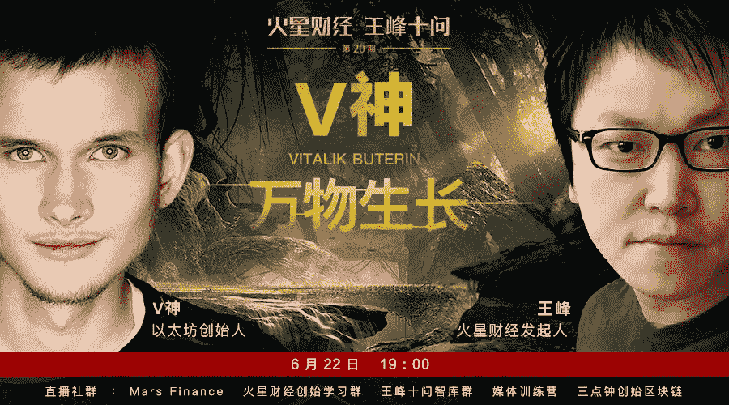

# 王峰十问第 20 期 | 以太坊创始人 V 神：ETH 价值并不依赖比特币（附音频）

> 原文：[`news.huoxing24.com/2018062216114032338.html`](https://news.huoxing24.com/2018062216114032338.html)

**对话时间**：6 月 22 日 19 点

**微信社群**：Mars Finance

**对话嘉宾**：

V 神（Vitalik Buterin）：以太坊创始人，1994 年出生于俄罗斯，2013 年提出以太坊的概念。2014 年 7 月项目启动众筹，2015 年 7 月 30 日以太坊正式激活上线。截至 2018 年 6 月，ETH 成为仅次于比特币的第二大加密货币。

王峰：火星财经发起人，蓝港互动集团（HK.8267）创始人，极客帮创投合伙人，曾任金山软件高级副总裁。

**以下为对话原文（由火星财经、罗丹、xiafeng92 整理）：**

王峰：我的朋友们！！这是我感到非常自豪的时刻，我想衷心地感谢你们使之发生，并给我这么多的灵感，举几个例子，Qtum 的 Patrick Chu，CSDN 的 Jiang Tao 许志宏，而这个名单是很长的！我也要感谢我出色的团队和我一起工作，日以继夜地工作，使事情变得更好。不仅是对我，作为火星财经的创始人，对火星家族来说，这也是个令人兴奋的时刻，有 V 神和你们所有人在这里。我们将沿着国际发展的道路继续前进。火星财经将进一步把中英文世界连接起来，致力于把中国与世界连接起来。我们很荣幸能与所有这些杰出的行业领袖，以及今天与 V 神进行对话。我没想到火星会发展得这么快。再次感谢您对我的支持和帮助，一路上我亲爱的朋友。仅仅在 3 个月内，火星财经团队就与从事区块链行业的企业家和资本家进行了 20 多次深入的对话。V 神是我的偶像，因为我认为他改变了世界，我希望我们会有一个伟大的对话。我很荣幸能在王峰十问上和大家在一起，因为今天我们有 V 神！

**第一问**

**王峰：**6 月 15 日，你在 Ethereum Core Devs 会议上表示，以太坊将考虑改变 Casper 和分片(Sharding)的激活上线顺序，不再分别发布，而是可能让它们同时激活更新。我们了解到，Casper 是以太坊考虑已久的 POS 共识，不同于其他 POS 共识，在该共识下，系统可以快速惩罚节点的作恶行为；而分片（Sharding）是一种基于数据库分片传统概念的可拓展技术。你是什么时候开始构思 Casper 机制的？这一机制的建立受到了什么启发？

**V 神：**大家晚上好！最初的计划是将 Casper 作为一种智能合约运行在以太坊上，让人们更轻松地设计开发，同时继续开展分片工作。但是，以太坊在 POS 和 Sharding 的研究上已经取得了很大的进展，我们可以对原先的 Casper 做一些修改，如果继续沿着这个路线图，将导致更遭的产品，造成大量浪费，我们不得不重新构建 Casper 首个版本，新的路线图仍然是“先 Casper 后分片”(Casper then Sharding)，但是 Casper 的第一个版本将会被修改，以便它可以实现构成一个完整的 Casper 和分片部署(Sharding)。还有一些其他好处。例如，我们正在考虑在短期内使用 BLS 聚合以及长期使用 STARK 进行签名聚合，它允许 Casper 机制管理更多的验证节点，也能让我们把验证节点所需 ETH 的大小从 1500ETH 减少到 32ETH。Capser 背后的核心思想是将链的权益证明和传统拜占庭容错（BFT）算法整合在一起，就像 Lamport、Paxos、PBFT 等等。许多人问我们，为什么不直接使用这些传统算法？答案是，我们觉得这些算法既复杂又不适合区块链的范式和需求，因此我们钻研算法, 并创建了一个我们认为更简单，更适合区块链范式的版本。数据可用性问题是分片中最具挑战性的问题之一，（可以参阅：[`github.com/ethereum/research/wiki/A-note-on-data-availability-and-erasure-coding`](https://github.com/ethereum/research/wiki/A-note-on-data-availability-and-erasure-coding)）我也发现，许多其他项目，甚至是那些和加密算法相关的项目，其实对于这个问题也没有太过重视。

**王峰：**我们对早期的 POW、POS 机制都比较熟悉，今天你能否用通俗易懂的语言，再次简单介绍 Casper 机制的工作原理？

V 神：现在的挑战是，仅仅验证区块链是否是不够的，还必须验证在 p2p 网络中，所有区块链中的数据是否可用，并且要让所有人都可以可以下载任何数据片段（如果他们想要的话） 。否则，即使区块链有效，但也可以通过链接一些不可用的区块用于攻击，从而阻止其他用户从他们的账户中取钱，因为他们有拒绝更新加密见证节点的手段。我们有解决方案，虽然它们有些复杂; 这些方案主要涉及编码冗余数据和允许用户随机抽样以检查大部分加密见证节点是否在线; 如果你认证了大部分加密见证节点是在线的，你可以使用冗余来恢复其余的数据。在整个 P2P 网络内，加密见证节点都是随机分布的。

当前 Casper 实现背后的基本思想是，用户可以将 32 个 ETH 发送到智能合约中，一旦它们包含在区块链中，就会被添加到当前的验证节点聚集合中。每个区块都由当前验证节点集合的随机成员创建，并且，验证节点（validator ）每验证完 100 个区块，就需要发送一条信息"finalizing" 给检查节点（checkpoint）在以太坊环境中，区块链必须确保数据是 100%有效且可用的；而在 Filecoin 的情况下，如果有一个或两个文件丢失是可以的。

**王峰：**关于 Casper，我咨询过中国一个知名公链的设计者，他提出，“为什么 Casper 设计安全存款来阻止小玩家成为以太生态系统中的验证节点？ 即使在今天，如果你是 BTC 或 ETH 的独立矿工，你仍然有可能挖掘一个块，但是在 Casper 之后，所有的小矿工都不再有任何可能验证一个块，这是否意味着 Casper 为块链系统带来了更多的不公平和特权节点？”能否在这里帮我解答这个困惑？

**V 神：**首先，32ETH 大约等于 10 万人民币。我认为，在任何情况下 PoW 矿工都不会小于这个数量。如果你的算力小于这个数量，可以用加入矿池的方式来参与。我们预计总共会有大约 10,000,000 枚 ETH 权益，因此接管整个分片需要至少总共数量的 40%，所以成本是非常高的，即使真的有人拥有了接管分片的能力，如果遭受了攻击，我依然有能力恢复。

**第二问**

**王峰：**很多业内人士都认为，2018 年将是区块链应用落地的关键年。你在 2018 以太坊技术及应用大会上也表示，金融行业可能应用得最早，游戏行业其次，此外如身份认证、价值链等也逐步被其他场景加以应用。如今，2018 年已经过去近半，为什么我们还没有看到真正的大规模区块链应用出现？你认为，影响区块链大规模应用落地最重要的因素是？如今，2018 年已经过去近半，为什么我们还没有看到真正的大规模区块链应用出现？你认为，影响区块链大规模应用落地最重要的因素是？

**V 神：**是的，我认为金融业和游戏行业是最先应用区块链技术的两行业。以金融行业为例，相比于其他形式的数字技术，如今的金融技术其实是非常落后的，甚至“快要被时代淘汰了”。为什么我不能像发送电子邮件一样，轻松地在世界各地汇款？当然，我知道中国境内汇款很有效率，但在世界上很多许多地方，还没有广泛采用更好的解决方案，当你想把钱从一个人转到另一个人，汇款操作会困难。很多公司对在游戏内应用区块链技术也非常有兴趣，因为他们希望游戏内置资产打造一个市场，显然，这是许多人非常感兴趣的一块领域。

除此之外，在短期内，我认为区块链可以在其他行业提供的主要功能是互操作性。我希望在一个共同的平台是，可以让一些服务提供者之间进行互动，这样一样，用户也可以更轻松地域另一个服务的用户进行互动，这种方式能够在不创造集中垄断的前提下带来很多好处。现在金融行业里已经有一些案例了，比如 OmiseGO 和台湾的 AMIS，我希望在其他行业也能看到类似的概念。

谈到其他行业采用区块链技术时所面临的主要挑战，其实就是公有链的效率其实还不够高。因此很难说服人们接受使用现阶段的公有链，因为的确有很多不便，比如确认时间较长，交易费用较高，等等。

**王峰：**在不少人看来，区块链仅有为数不多的应用场景，其中最重要的，一个是数字货币交易，一个是 ICO。严格来讲，市面上很多 DApps 来自于糟糕的设计想法，并没有实际用途。你对以太坊生态的开发者有什么建议？

V 神：我认为，状态通道（state channels）在短期内可以做很多事情，让一些去中心化应用程序（dapps）获得更好的用户体验、更容易进行扩容。来自 L4 的 Jeff Coleman，还有其他一些公司最近做了很多工作，他们让“状态通道”技术更加标准化，也更容易使用。最近他们还发布了一个关于状态通道的论文([`counterfactual.com/statechannels`](http://counterfactual.com/statechannels))。侧链 Plasma 可能对企业级应用特别有帮助，因为它允许以半中心化和半去中心化的式方式构建应用程序，一方面可以受益于区块链的高安全性，另一方面也能获得中心化系统的效率优势。另外，开发人员还应该多了解一些 Vyper（[`vyper.online/`](http://vyper.online/)），这是一种相对较新的智能合约开发语言，这个开发语言还是比较容易理解的。它采用了类似 Pytheon 的语法，也有更多安全功能。最近 Vyper 发布了一个测试版（[`github.com/ethereum/vyper/releases/tag/v0.1.0-beta.1`](https://github.com/ethereum/vyper/releases/tag/v0.1.0-beta.1)）。我听说很多中国开发人员喜欢 Python 编程语言，所以我认为当他们尝试 Vyper 的时候，会觉得很容易上手。

我知道有些团队正致力于跨链交流，但我个人对此并不感冒。

**王峰：**如果我们脑洞大开，站在更远的未来审视，今天的智能合约对于区块链发展会不会是一个错误的指引？哈哈，我怎么敢和 V 神说这样的话。

**V 神：**我认为很多人都误解了智能合约。 有一个刻板印象是，智能合同是为了完成这样一些事情，比如“我付了 10 枚 ETH 来建立一个网站，所以我把这 10 个 ETH 放到了一个智能合约中。智能合约来检测你是否建立了网站。如果它检测到网站已完成，会自动支付 10 个 ETH。“这里的问题是，进行这种验证难度极大，智能合约代码本身根本无法告诉你“某个东西”究竟是不是一个网站。实际上，应该把智能合约看作是一种经济机制。智能合约并不是要把所有事情都做掉，而是为各方设定一套可以相互交流的规则——其中一方可以是仲裁员，或者，也可以使用博弈论创建智能合约，即使没有任何仲裁员也可以产生良好的激励。现在有一个叫做 2-of-2 的托管概念，只要产生争议，所有人的钱都会被“烧掉”。这种概念看上去很苛刻，但一旦这么做，即使没有仲裁员来确定争议中谁是对还是错，也能激发各方诚实行事的强烈动机。即使是“状态通道”和 Plasma 也都依赖于成熟的智能合约逻辑来实施这些机制。而像比特币这样纯粹的“以支付为中心”的设计，其实很难实施这样的结构;比特币不能执行 Plasma，只能通过在“状态通道”上设置更多限制和更复杂的方式实现类似 Plasma 一样的侧链，而太坊则活了很多。

不过，我发现这种模式的一个问题是，如果你创建了一个通用系统，那么由于图灵完备性，你知道该系统在二十年内仍然是通用，并且在二十年内仍然可用。另一方面，如果你为某个行业创建了一个专用系统，那么，如果该行业的需求迅速发生变化，那么这意味着协议规范需要每隔几年更新一次。这对于基础层公有链来说，并不是很好，因此，它需要在治理机制上付出很多心血，以便就新的协议规则达成一致，这样反而会导致产生中心化。但是，我坚信，对于某些特定行业，Plasma 链会非常有潜力。

**第三问**

**王峰：**6 月 15 日凌晨 2 点 11 分，EOS 主网成功激活。EOS 通过并行链和 DPOS 的方式解决了延迟和数据吞吐量的难题，性能上超过比特币和以太坊。

我曾留意过 BM 的 EOS 白皮书，他把 EOS 定义成区块链的 3.0，于是乎，今天很多区块链从业者的 PPT 里都会有这样的介绍：

BTC=Blockchain 1.0； ETH= Blockchain 2.0； EOS= Blockchain 3.0

你是否同意这样的描述？什么是你眼中的区块链 3.0？ 

**V 神：**从性能角度看，Cray 超级计算机可能在 1976 年的时候，就超过了比特币和以太坊。我不太喜欢用 1.0、2.0 和 3.0 来讨论问题，但是如果存在区块链 3.0 这样的东西，那么可扩展性无疑是其中的一个重要部分。我知道，EOS 的性能比比特币和以太坊还要高但差距不是太大，我记得最近在一些测试网站上听到几百 TPS。我坚信，要实现大规模应用所需的可扩展性不仅仅是投入更多的算力问题；它需要全新的方法和大量的探索来实现。这就是我在状态通道、plasma 和分片技术上努力探索的原因，这是非常有价值的。EOS 绝对是一个有趣的实验，它试图做到跟以太坊和其他平台完全不同。 这不仅仅是一个技术实验， 也是一场政治科学实验，EOS 社区试图在区块链上创建一种数字政府，包括宪法、行政部门（21 个节点）、司法部门（仲裁员）等。从他们的哲学思想中看，有一点非常明确，就是 EOS 认为“代码不是法律”，并且这个数字化的政府有望积极地解决人们的问题。

话虽如此，这种方法是有风险的，所以我预计会有许多应用程序发现它的风险太大，对区块链感兴趣正是因为它们希望一个更安全、更难以改变的平台。EOS 已经冻结了 7 个帐户，并且很快就没有任何警告；这当然可以帮助人们从盗窃和诈骗中找回自身的损失，但它也带来了问题。当您尝试在 EOS 上构建一个应用程序时，会发生什么，而 EOS 中央机构并不喜欢？EOS 本身能够在以太坊上运行其 ICO 和代币，我们没有权力阻止它；您认为 EOS 仲裁者会对运行 ICO 的 EOS 竞争者同样友好并在 EOS 上颁发一个代币吗？你确定吗？

我认为，预言机 oracles 通过向智能合约提供外部信息从而让智能合约更好地工作。Oraclize 长期以来一直致力于集中式开发，但我也对去中心化的 oracle 项目感兴趣。 Augur 有一个内置的去中心化的 oracle，来确定某个事件的“真实”结果。在日本有一个名为 Reality Check 的项目，由 Edmund Edgar 运营，也试图做类似的事情。 我认为，这对于智能合约很有帮助。

**王峰：**伴随着 EOS 主网上线，EOS 第一批 21 个超级节点也随之产生，但你一直对 EOS 节点颇有微词：“EOS 的 21 个超级节点并不是 21 个不同实体，节点之间可能存在内在联系的共谋；天然会导致财阀的统治。” 后来，BM 发表了《加密经济治理的局限性》，解释了 DPOS 选举机制的初衷和意义，回应你的质疑。BM 说，你致力于寻找一种加密经济的黑匣子，它假设不能依靠股权（财阀政治）或个人（民主政治）来投票；而他相信人性本善；你们的主要区别在于基本假定的差异。”在今天的“王峰十问”，你要不要再做一下回应？

**V 神：**我的哲学观点是，我们希望底层链在尽可能广的场景下工作，而且确实很难预测将来加密币持有者未来会有什么样的利益和价值。经济激励之所以如此有用，是因为它们是一种应用最广的激励；无论是富人还是穷人，个人还是公司或机器人，美国或中国或朝鲜，我们都知道，提供激励会影响他们的行为，并促使他们以某种方式采取行动。话虽如此，在我们彼此关系密切、相互了解的环境中，经济激励措施的意义要小得多，而在这种情况下，依赖善意通常会更好。以太坊是一个面向世界的基层块链平台，因此它不能对谁参与其中或者谁在运行相关验证程序节点的证明进行假设。另一方面，在以太坊之上的应用程序，在许多情况下可以作出更多的假设，并依赖更具社会性而非经济性的方法。我认为分散式平台肯定有空间，看起来更像是“社区平台”，而不是“世界平台”，尽管这些平台是作为独立平台构建的，还是作为以太坊等公共区块链的第二层等 plasma 链构建的，还有待观察。

**王峰：**目前，任何涉及到以太坊的行为，无论是简单交易，还是智能合约，甚至 ICO 都需要一定量的 GAS（燃料）费用。然而，随着 ETH 新项目越来越多，网络使用成本越来越高，对于开发商和智能合约创造者来说，GAS 都是一笔不小的成本，有人甚至质疑：高昂的 GAS 费用正在扼杀一些以太坊项目，GAS 成为了以太坊的绊脚石。

**V 神：**对于以太坊的普及，我认为现在还不是到全世界去说“以太是伟大的，你们现在都应该进入它”的时候，因为现在还是很少的应用进入，一个普通人目前唯一真正能做的就是购买和交易，我认为这是不应该关注的事情。现在重要的是构建技术，使它最终能够处理更多的用户，并尝试与社区建立联系，以帮助我们实现这些目标。这就是为什么我们已经与密码学家建立了许多联系，现在正在与经济学和设计界建立联系。最近，越来越多的经济学家开始谈论区块链，包括格伦·魏尔(Glen Weyl)，一些边际革命的作者，等等；我认为从他们那里了解区块链可以为社会提供价值是很好的。CryptoKitties 和游戏肯定有助于促进兴趣和采纳，我认为在这一点上，人们对游戏产业的兴趣是很明显的；我希望我们也能很快开始超越仅仅游戏。

**第四问**

**王峰：**上周四（6 月 14 日），美国证券交易委员会（SEC）财务部门总监 William Hinman 在一次公开活动上称，以太坊及其加密数字货币以太币不属于证券。受此消息影响，以太币价格当天上涨 8%至 520 美元。实际上，早在 2013 年美国就曾发布过加密货币监管的声明，但至今是作为“证券”由证券交易委员会（SEC）监管，还是作为“商品”由期货交易委员会（CFTC）监管，还没有明确的立法。

**V 神：**我们在 2014 年非常认真地考虑过证券监管法规等问题，我们与多家律师事务所进行了磋商，并仔细确认了我们所做的事情是否符合当时的法律。我们很高兴看到，美国证券交易委员会认为并非所有的加密货币都是证券。我觉得，监管政策绝对会继续影响区块链技术的进步，尽管主要是从应用角度来看。我认为总的来说，各国政府已经认识到，彻底关闭公链网络是非常困难的，但监管它们要容易得多。

我觉得，有激励机制的多跳网络（mesh networking）和需要付费的无线接入热点可能是区块链技术得以应用的两个领域。如今，仍然有很多人无法访问互联网连接，有一些互联网连接还被人用密码“封锁”，现在虽然有了一些解决方案，但是仍然无法满足庞大的互联网访问需求。我还认为，有激励机制的多跳网络可以在人道主义领域发挥巨大潜力，但是这种潜力目前是被忽视的。比如，在战区提供互联网接入服务。

对于目前的金融行业来说，我并不是非常期待他们应用区块链技术，尽管现在已经有很多金融机构开始尝试这一新兴技术，我现在更多地是关注新项目和更直接的 P2P 交互。我希望，美国证券交易管理委员会官员 Hinman 的言论能够鼓励区块链变得更加去中心化。

我认为评估加密货币的价值是非常困难的，这也是为什么加密货币行业如此混乱、以及很多新加密资产不断涌现的主要原因之一。我预计在未来几年，整个行业会稳定下来，之后新发行的加密货币（代币）数量会不断减少。越来越多的项目会更重视提供价值，而且加密货币（代币）的基础价值和市场价格之间会存在更多相关性。但是，我们可能还是会看到成千上万种代币，但是我希望所有这些代币都是好代币。我个人非常希望退休基金不要大规模投资加密货币。比如，如果我是一位 70 岁的老奶奶，如果我知道自己的退休金投资了波场（TRON），我肯定会非常沮丧。

**王峰：**根据最新的行情显示，比特币市值 1088 亿美元，以太坊市值 489 亿美元，以太坊的市值未来可能超过比特币吗？我们不妨大胆假设，如果比特币价值归零（当然我们认为可能性基本为零），以太坊还会有价值吗？哈哈

if (BTC value == 0) { ETH value = ?;}

**V 神：**尽管现在加密货币价格和比特币价格走势的关联度很高，但是在这样极端的状况下，我依然认为以太币并不依赖比特币。比特币只是众多加密货币中的一种。我们个人其实是非常高兴的，因为现在加密货币行业已经非常多样化了，我认为这对去中心化是非常有好处的，当你有更多方法去尝试不同技术时，关闭所有加密货币就会变得非常非常困难。可以肯定的是，很多优秀人才都在开发区块链项目，我们希望他们中间至少有一些人能够非常出色，并取得成功。

**第五问**

**王峰：**6 月 5 日，微软宣布，斥资 75 亿美元收购在线代码分享和协作平台 GitHub。目前，GitHub 上托管了 8500 万个存储库，2800 万开发者为它们提供了贡献。有人欢迎这一举措，也有一些区块链开发者对这次交易感到不安，认为微软向来都与开源社区和其他公司作对，收购后会滥用自己的支配地位。其实，微软一直有段开源软件的“黑历史”，早在 10 年前，微软就被指控暗中攻击开源软件 Linux 的专利权，前 CEO 史蒂夫·鲍尔默甚至将 Linux 标榜为“癌症” 此外，微软现在还继续要求 Android 厂商支付 Android 专利费用等等一系列事件的发生，让很多开源爱好者和开发者都认为微软不值得信任。你是如何评价微软收购 GitHub？你看好 GitHub 未来保持真正的独立发展吗？ 

**V 神：**我知道微软之前一直非常反对开源，在本世纪初，互联网社区认为微软是最大的“邪恶敌人”。不过，从我与微软的互动中，可以看到微软正在尝试改变自己的形象。我觉得，他们已经采取了很多措施来改进与开源社区之间的关系，比如，我们看到他们为 Linux 提供了 Azure 云计算服务，对开源的贡献也越来越多，但是还不够，微软在这方面做得还不够完美。我个人认为，初创公司总是关注自己的主要商业模式，然后风投公司则希望自己投资的初创公司能够被大企业收购，这样的想法是非常不健康的。因为这样一来，初创公司创造的东西反而更像是计划经济里的产品，而不是自由市场里的产品，而且激励措施也不是由客户来设定，而是由一小部分大企业设定的。谈到 Parity 协议，我们提出了 EIP 999 协议，过在 GitHub 和 Reddit 论坛里，我们看到一些人对 EIP 999 有父母反应，在 etchain 投票中， “no”的比例为 55%，“yes”的比例为 39%([`www.etherchain.org/coinvote/poll/35`](https://www.etherchain.org/coinvote/poll/35))，似乎人们对推动这个协议没什么兴趣。在这一点上，我认为以太坊很可能永远不会再看到任何加密币的复苏，因为有足够的案例在政治上引起争议，任何设置 bar 的尝试都会导致低于 bar 的人抱怨他们没有被包括在内。 虽然也有可能当我们转向分拆时，会出现某种“清理”公共连锁的行为，这将会尽可能地让资金恢复到尽可能多的人群。 也就是说，我认为这不是我做这个决定的地方，甚至是影响它的地方。

**第六问**

**王峰：**让我们谈谈中国吧，这里有很多关于你的传说。有人说，2015 年你曾在上海外滩的一个欧式酒店里路演以太坊，台下有人说你是一个“骗子”；在深圳某次区块链聚会的合影中，你站在最后一排最右侧不起眼的角落里；还有很多人宣称你曾上门拜访他们。有趣的是，他们中的一些人拒绝了你的募资。能不能在这里再讲讲那次中国之行？当时中国区块链从业者们对以太坊有哪些典型的评价？

**V 神：**我是在 2014 年第一次来到中国，我觉得那次中国之行非常有意思，让我第一次看到了华人区块链社区。当时，人们对交易和采矿有着浓厚的兴趣，当然在某种程度上，我发现中国真正的区块链技术项目也在不断增多。但不幸的是，我不是非常了解华人社区的反应，也不知道究竟有多少人对区块链感兴趣，有多少人认为我是个骗子。

事实上，当你创建了一个所谓“激进的”新项目时，自然会有很多人觉得不靠谱，觉得很疯狂。但其实，我很理解人们会有这样的想法，因为有太多项目真的很疯狂。 我觉得，中国区块链行业里的开发人员质量正在不断提高。今年六月，我在北京参加的一次活动上，很多与会者的素质真的很高，而且也给我留下了深刻的影响。我觉得，中国区块链行业现在面临的主要挑战，其实是研发。如果你看一下是谁在发明算法，比如权益认证、分片、零知识证明等等，会发现其实都是以色列人、美国人发明的，还有些欧洲人发明的区块链算法。而在亚洲，似乎只有新加坡。不过最近，我已经开始看到很多来自中国的学术论文，我希望中国区块链行业能在研究方面有所改进。

**王峰：**我曾经问过分布式资本沈波如何评价中美公链，他的回答是，美国项目是好坏问题，中国的项目是真假问题。

**V 神：**我没有花太多时间关注数千个不同的区块链应用程序，我需要专注于自己认为重要的东西，现阶段，我认为重要的东西是底层区块链协议。 我认为，对于任何一个区块链协议来说，最好的办法就是切换、或直接使用权益认证（PoS）。ASIC 太中心化了，我知道现在比特币领域里，有一个人生产了市场上的绝大多数 ASIC 矿机，而且已经开始使用这些矿机进行挖矿了。（编者注：不知道 V 神是否暗示比特大陆吴忌寒）。一些工作量认证（PoW）算法开始抵抗 ASIC 挖矿，而且是去中心化的。但是今年，我们发现很多抵制 ASIC 挖矿的加密货币都受到了攻击，这些事件表明，与 ASIC 挖矿对抗并不是一件容易的事情。具体可以参阅 David Vorick 写过的一篇文章（[`blog.sia.tech/the-state-of-cryptocurrency-mining-538004a37f9b`](https://blog.sia.tech/the-state-of-cryptocurrency-mining-538004a37f9b)） ，这绝对需要一个硬分叉。如果你的问题是，硬分叉是否会引起像 ETC 这样的连锁分叉，我认为答案是否定的，部分原因是我觉得，所有重要的工作量认证（PoW）用户已经迁移到了 ETC。

**第七问**

**王峰：**我们知道，你进入区块链的启蒙者是你的父亲 Dmitry Buterin，他是一家早期区块链孵化器的联合创始人。据媒体报道，他在你 17 岁时第一次给你介绍了比特币，你一度还对此表示怀疑，但 2 年后你开始进入区块链。对于你现在做的事情，你们还会经常交流吗？他给过你什么建议和提醒？当以太坊第一个版本上线给他看的时候，他有什么反应？据说，你在“不相信”区块链的两年里，一度很喜欢玩魔兽世界。你在游戏里玩什么职业？日后你设计以太坊时，有从网络游戏中获得启发吗？

**V 神：**当我发布以太坊的时候，我的父亲非常自豪，而且还参与了推广活动，邀请了额很多他的好朋友帮忙。最近，我的父亲卖掉了自己的公司 Wild Apricot，我知道他这么做，是想要在区块链行业里最更多事情，他现在已经加入到了 BlockGeeks，因为我们总是会有很多话要谈。

**王峰：**据说，你在“不相信”区块链的两年里，一度很喜欢玩魔兽世界。你在游戏里玩什么职业？日后你设计以太坊时，有从网络游戏中获得启发吗？

**V 神：**我《魔兽世界》玩得很不错。我在《魔兽世界》里有很多游戏角色，我有一个 80 级的法师和 80 级的术士，还有 73 级的圣武士。当然，我还有很多其他游戏角色，但是我忘记了。我已经有八年时间没有玩儿游戏了。现在我常常喜欢在公园里散步，相比于虚幻的游戏世界，我更喜欢看到真实的大自然。

我不认为《魔兽世界》和以太坊之间有很多联系，虽然《魔兽世界》里面有个敌人角色名叫“Ethereal”，看上去和“Eethereum”很相似，但这可能是个巧合，或是人们潜意识里觉得有关联。

另外，我其实和彼得·泰尔（Peter Thiel）没有很多互动，这可能让人觉得有些惊讶。不过，我和一些他的项目工作人员有过很多交流，比如彼得·泰尔基金会（Thiel Foundation），Mithril, 等等。

之所以和彼得·泰尔没有太多交流，是因为我们两人的想法有很多不同，我认为应该权力下放，去中心化，而他却认为垄断很棒！

**王峰：**我看到有报道说，以太坊最早的一笔资金，是硅谷著名的天使投资人彼得蒂尔的 10 万美元。彼得蒂尔被视为硅谷的思想家，PayPal 的创始人之一，还是 Facebook 的首个外部投资者。他曾说过：对于大多数的数字货币我都很怀疑，但是我认为人们低估了比特币的价值。

**第八问**

**王峰：**今天的智能合约让区块链应用成为可能。但到目前为止，以太坊最大的作用是发行 token，网上甚至有 3 分钟用以太坊发行自己的 token 的教程。

根据高盛的研究，在 2017 年 6 月，ICO 筹资金额首次超过了早期 VC 投资总额。同时，这种一诞生就等同于上市的募资形式极大激发了全球的财富效应，它让很多幸运的年轻人顷刻之间拥有了豪宅、兰博基尼。

经历了个人财富爆发式增长，你的生活方式有什么变化?我知道你也曾向盖茨基金会和 GiveDirectly 基金会捐款，你是什么时候考虑向他们捐款的?

**V 神：**对我个人来说，财富增加对我的生活没有太多变化，只是我不需要为了花费两美元乘巴士这些琐事担心。我有钱的目的不是为了买大房子、或是豪车，而是希望拥有安全感。有钱之后，我就就可以随心所欲地做我想做的事，而不必担心钱的问题。所以，我现在不用把时间浪费在赚钱上，而是可以专注于创造我认为有价值的东西。而且，对于那些和我价值观有悖的事情，我也用不着妥协。

此外，我很高兴以太坊基金会获得了足够的资金，可以安心经营多年。而且，我们现在可以通过自己的资助计划，为外部团队提供资金，也可以为一些前沿项目研究提供资金，比如最近，我们就向斯坦福大学的 Dan Boneh 实验室([`cbr.stanford.edu/`](https://cbr.stanford.edu/))提供了 500 万美元赠款。

另外，我还给反疟疾基金会(Against Malaria Foundation)、GiveDirectly 和 SENS，提供了捐款，当然，我们的捐款方式可能和比尔和梅林达盖茨基金会不太一样——虽然我们都在反疟疾方面做了很多工作。我觉得，当我有了钱，能够让我有机会来拯救成千上万的生命。显然，钱应该到它应该去的地方，比如可以用来保护成千上万的非洲人免受疟疾灾难，或是让他们有钱去购买食物。

**第九问**

**王峰：**今年 1 月份，你提出了 DAICO 的融资模式，区块链项目方募集资金的很大一部分可以通过智能合约的方式，以类似业绩对赌的形式，逐步发放给项目团队。这一融资模式是基于什么原因提出的?

现在已经过去 5 个月了，DAICO 落地到什么程度了?就你的观察，区块链创业者是不是真的接受 DAICO 这种自治模式?

**V 神：**我之所以要推出 DAICO，是因为看到了 ICO 出现了一系列问题。现在 ICO 项目资金主要来自于前端，所以当一个项目想要获得资金的时候，他们就有动力做大量营销工作，但是一旦这家公司募集到了资金，就没有动力继续发展项目，确保项目质量了，有的甚至会跑路。

DAICO 的设计理念，是构建一个结构，让项目开发者每次只能获得少量资金，然后让项目代币持有者投票决定该项目是否值得获得更多的资金。此外，项目代币持有者还可以投票决定是否取消该项目，然后把剩余资金归还给自己。这种方式，可以让项目代币持有者和项目开发者之间获得更好的协调性激励。

现阶段，DAICO 只是我的一个想法，但是我发现很多项目正试图实施它。我希望，首先可以尝试几个试点项目，然后看看这种策略是否有效，或是吸取一些经验教训。 从前几个实验中会看到它的工作有多好，我们将能够从中学习。

我觉得区块链和智能合约是一个构建去中心化经济体制和解决问题的平台，有了这个平台，我们就不需要把所有权力交给那些中心化可信机构了。因此，如果我们的社区能够认真对待这个问题，可以首先尝试解决一些行业内的问题，之后在逐步拓展，这会非常非常有意义。

我们会在柏林召开一次会议，讨论 Casper 和分配的工作进度情况。我知道 Prysmatic Labs 正在构建基础设施，并在 Geth 上实施分片，现在他们这项工作已经取得了很大进展。我希望，今年晚些时候可以看到测试网发布。

**第十问**

**王峰：**在成立以太坊之初，你坚持 The DAO 是一个非盈利组织。虽然最初的 10 位联合创始人中曾有人建议成立公司，但你一直在恪守它的非营利定位。

你曾在媒体采访中透露说，你甚至为此“解雇”了两位核心成员。这是一件很有意思的事情，一个去中心化的非盈利组织会用到“解雇”这个词汇。

我们必须承认，你个人对于以太坊来说是一个至关重要的中心，2017 年，一则你去世的谣言曾一度导致以太坊市值大跌 40 亿美元。同一年，你曾力排众议，以主动硬分叉修改以太坊，来解决被盗 3600 万 ETH 的危机。

你曾说，区块链有核心开发者，但他们只有暂时的权力。那么，你有没有设想过，像中本聪那样玩消失，隐匿于你所创造的以太坊世界之外?

或者如果你完全休息一年，你觉得以太坊还会向你期望的方向发展吗?

**V 神：**以太坊基金会仍然是一个传统组织，直到我们可以用某种方式找到彻底取代 DAO 的方法，所以，它仍然是一个“组织”，所以可以解雇人员。但是我需要说的是，我只是从“组织”中解雇人员，而不是在社区中解雇人员。我们组织中有很多人被解雇了，也有些人辞职了，但是他们还在为以太坊社区做了很多很棒的工作，这其实是以太坊去中心化本质之美。

如果说的再确切一点，解雇人员其实不是由以太坊基金会决定的，而是由市场决定的。

至于我的死亡传闻是不是造成以太坊价格下跌，我现在还不是很清楚，因为当时市场本身就比较低迷，而且价格下跌已经发生了。我非常坚信的是，DAO 分叉这件事发生，社区内是有很多人支持的，当时有进行碳投票、各种社区民意调查等等，结果就是有 80%的人支持分叉。其实正如我之前所说，随着时间的推移，我很希望 DAO 分叉这样的事情变得越来越难。

我觉得，以太坊团队即便没有我，也绝对有能力完成 Casper 和分片路线图，即使我自己想要消失一段时间，我也完全相信他们会做的很好。

以太坊实际上每年发行量已经减少到 700 万个。但是我觉得，即便是工作量认证(PoW)难以保证平等，也没有理由通过工作量认证(PoW)来增加以太坊供应来让分配变得更加供应。给以太坊供应量设定一个上限，是很合理的，而且最终实施的时候，我们也相信它能够发挥作用。

**加问 1**

**王峰：**在全世界范围，区块链都会受到不同程度的监管。各国对区块链市场的态度主要分三类：

1、在全世界范围，区块链都会受到不同程度的监管。各国对区块链市场的态度主要分三类：

2、美国、欧盟等经济体对区块链创新技术保持欢迎，但对 ICO 的证券化特征保持谨慎态度;

3、中国、俄罗斯为代表的国家，对 ICO 和数字货币实施严控，对区块链技术本身保持欢迎。

一些国家希望把区块链应用放入现有的监管框架中，但因为种种原因，政策推进缓慢或者监管效果并不理想。对于各国的监管机构来讲，管什么，谁来管，如何管?你有什么建议?

**V 神：**我想要给的主要建议，是去专注于那些沙盒、以及特殊用途准则等领域的技术。

研究这些领域的技术，可以让你围绕加密行业的具体经验和挑战来制定规则，而不是试图重新解释几十年前的规则。软件行业与传统金融有着不同的文化，金融行业需要经历很多年的“考验”，还要在合规性(比如聘请律师)上投入大量成本(数十万美元)，定期发布传统风格的审计报告和招股说明书，我觉得这些都是不合理的，所以我觉得需要给软件行业一些尊重。

事实上，我认为这些传统方法通常无法很好地满足人们真正想要的消费者保护和信息披露。我个人愿意公开表示，我发现许多国家现行的授信投资者规则非常不公平，而且很势力，只允许有钱人(百万富翁)投资证券。在某些情况下，他们其实会让事情变得更糟糕，因为这意味着，普通人只能用更高的价格去购买证券，结果很容易就让这些普通人变成受害者。

也就是说，现在监管方面仍然有很大的改善空间，比如要求信息披露和透明度，鼓励调整奖励措施，等等。当然，我也认同每个国家需要根据自己的实际情况来做，比如在很多发展中国家，金融教育水平很低，人们难以发现欺诈和冒险，在这种情况下，严格监管是有意义的。

我还认为，到目前为止，包括美国证券交易委员会在内的许多监管机构采取的措施都是非常有帮助的。他们采取了一些针对性的方法，专注于打击那些最严重的诈骗活动，鼓励营造一个更谨慎的行业氛围，而不是试图打击整个行业。

我还要补充一点，对于那些通过技术应对我们在区块链行业里所遇到问题的解决方案，我非常感兴趣，比如 DAICO 就是为了解决代币发行中的问题，Plasma 为了解决交易所资金被盗的问题，等等。

对于无币区块链我并不乐观，首先，“无币区块链”只能用在私有链上，只要你是一个公有链，就肯定需要激励。不管是在中国还是其他地方，我都看到了一些私有链项目，有些私有链项目声称已经投产了。实际上，这些私有链往往只有 7 个节点左右，而且所有这些节点都由同一家公司控制，所以基本上根本不是去中心化(分权)。

我认为，对于那些想要部署在公有服务器和中心化服务器上的应用程序，有一个更好的折中方案，那就是在以太坊上构建一个 Plasma 链。

**加问 2**

**王峰：**两年前，当 Amazon、Apple、Google、Facebook 等国际巨头还对区块链布局没有大动作时，你认为它们都有所谓的“区块链盲点”，只是把区块链技术看作是一种风险。

但如今，巨头们竞相入局区块链，最近两三个月内，Amazon 发布了第一个区块链云计算 SaaS 解决方案；Apple 正在为 Apple Pay 引入 Ripple(瑞波)的 Interledger API 协议；Google 正在开发自己的分布式电子账本，以支持第三方发布和验证交易；Facebook 也成立了新的区块链部门，可能有计划推出自己的加密货币。

你认为，未来区块链世界的话语权，会被当今互联网的寡头们所把持吗?

**V 神：**我认为，互联网巨头们会进军区块链行业，但我认为他们并不能控制它。与互联网不同的是，一些理想主义者认为互联网巨头入局可能会导致更多去中心化，但这个想法其实只是区块链发挥作用中的很小一部分。在区块链中，最最核心的是维持去中心化。有很多企业试图控制某个行业，这种做法也遭到了不少人反对。然而到现在为止，他们还没有找到一个能够控制像以太坊这样的平台的方法。

谷歌那件事是个笑话，很明显，这封电子邮件来自于一位谷歌招聘人员，他/她可能使用了谷歌的招聘算法，这个算法只要远程判断出你是一个出色的、能够胜任他们工作的程序员，就会自动发送招聘邮件。

[点此直达王峰十问 V 神英文版](http://www.huoxing24.com/newsdetail/2018062223420574778.html)

本文为火星财经原创稿件，版权归火星财经所有，未经授权不得转载，转载须在文章标题后注明 “ 文章来源：火星财经”，若违规转载，火星财经有权追究法律责任。