# 王峰十问第 22 期 | 币安 CEO 赵长鹏：谈周游列国、上币规则，再评“交易即挖矿”（附音频）

> 原文：[`news.huoxing24.com/2018070613145350079.html`](https://news.huoxing24.com/2018070613145350079.html)

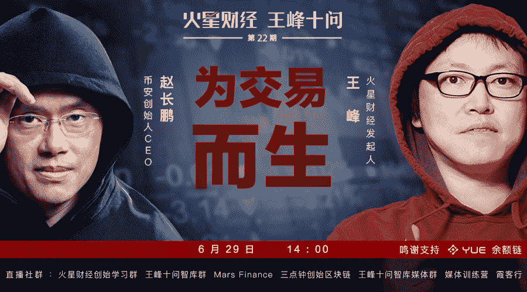

**对话时间**：6 月 29 日 14：00~16:40

**微信社群**：3 点钟火星财经创始学习群

**对话嘉宾**：

赵长鹏：Binance 币安创始人兼 CEO，区块链和交易系统专家，前彭博商品期货研究团队主管，前 Blockchain.info 技术总监。

王峰：火星财经发起人、蓝港互动集团（HK.8267）董事长、共识实验室创办人，以及极客帮创始合伙人。

**以下根据对话原文整理：**

**王峰**：Hi，大家下午好，欢迎来到由余额链赞助的火星财经“王峰十问”的第二十二期。给大家介绍今天来的嘉宾：Binance 币安创始人兼 CEO 赵长鹏。很多人称呼他 CZ。

先让我们看一看 CZ 的经历：

1977 年，出生于江苏连云港；

1987 年，随父亲来到加拿大，后在温哥华读了 6 年中学，在蒙特利尔就读大学。

1997 年，大学毕业后，在日本东京从事金融交易所系统的相关工作。

2001 年，担任纽约 Bloomberg（彭博社）技术总监。

2005 年，回国创业，创办富讯信息技术有限公司，主要从事国内外金融、证券系统软件开发、系统集成等业务。

2013 年，退出富讯，全职投入比特币行业，加入 Blockchain.info。

2014 年，以联合创始人的身份加入 OKCoin，出任 CTO，管理 OKCoin 的技术团队，并负责 OKCoin 的国际市场团队。

2015 年，从 OKCoin 离职。同年 8 月，创立比捷科技，提供交易所快捷搭建服务。

2017 年，创立币安，担任币安 CEO。

2018 年 2 月，入选福布斯数字货币富豪榜，位列第三，个人虚拟币净资产约 11-20 亿美元。

今年初，CZ 被《福布斯》点名，一下子引发了舆论的高度关注：他只用了短短的 180 天时间，就成为了数字货币富豪榜上的亿万富翁。然而，很多人往往忽视的是，CZ 自大学毕业后为交易所搭建网络交易系统到现在，已经足足有 21 年从事交易相关的工作经历。

如果按照一万小时定律：1 万小时的锤炼，是任何人从平凡变成世界级大师的必要条件。所以，CZ 今天获得如此财富和成就，也就并不意外了哈。

最近，随着交易挖矿为代表的新生代交易所的强势突围，数字货币交易所战场硝烟弥漫。币安这个百亿帝国能否继续立于不败之地？相信经历过交易所风风雨雨的 CZ，心里自有定数。

CZ 比较低调，很少公开露面，除了在个人 Twitter、微博上发布一些动态外，也一直极少接受媒体采访，今天非常感谢 CZ 能出来参与火星财经的“王峰十问”。

**赵长鹏**：说实话，真的整整做了 20 年，应该有 2 万个小时，至少。

**王峰**：我才知道，自己和 CZ 都是水瓶座，据说，水瓶座最大的特点就是“乐于发掘真相”和“拥有理性的智慧”，所以期待今天和 CZ 的对话，能在问答间碰撞出更多火花，给大家更多启发。下面，开始我们今天的“王峰十问”吧。

**第一问  乌干达作为币安法币交易第一站是为了普及数字货币**

**王峰**：长鹏，先恭喜你，昨天晚上我看到了你的一个好消息，币安第一次涉足法币交易，在乌干达将建立数字货币交易所，推出新平台 BinanceUganda，支持当地法币乌干达先令和其他主要数字货币交易。不过，相对于其他竞争对手来说，币安在开通法币交易的步伐明显慢了很多。币安迟迟没有开通的原因是什么？为什么选择乌干达做币安法币交易的“第一站”？据说，币安可能在亚洲某个国家开通法币交易，可否多透露些细节？

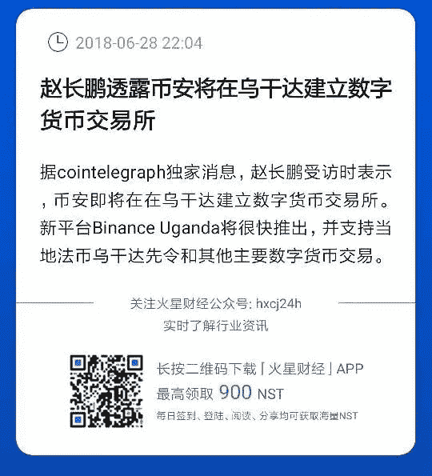

赵长鹏透露币安将在乌干达建立数字货币交易所

**赵长鹏**：很多人都盯着很发达的经济金融国家，的确比较容易赚钱。但是我觉得我们要把行业做深耕，还是要把区块链和数字货币普及到世界的各地。非洲是一个人口基数非常大的地方，我觉得我们作为行业的领头羊，还是要做这件事情。

关于币安的战略和策略，我们有一直自己的节奏，一般不会跟人家的节奏。所以别人都在做法币交易所的时候，我们先去做了币币交易所。当时有好多人问我说为什么不支持法币，市场更大，我当时不那么觉得。但我觉得现在倒是一个比较好的时机，去把我们的法币渠道、各个桥梁全部打开，让体量更大的人可以直接进入到 binance 的体系里，为行业做增量和基础建设。乌干达作为第一站，我觉得这样子更适合我们的全球性战略。我们不管做法币还是做币币，都是用全球的眼光去做。

**王峰**：开通法币交易，可以让更多新的投资者通过法币购买加密货币，给交易所带来更多流量；同时，投资者可以方便地把数字资产变现。然而，法币交易行为并不被所有人看好，有人持反对意见：数字货币其本质只是一种具有稀缺性的信息代码，在公开平台上以法定货币交易数字货币，不是数据创新，最终的结果只能是资产泡沫。相信你一定已经和乌干达等国家金融监管机构进行过深入沟通交流，想先听听你对此的看法。

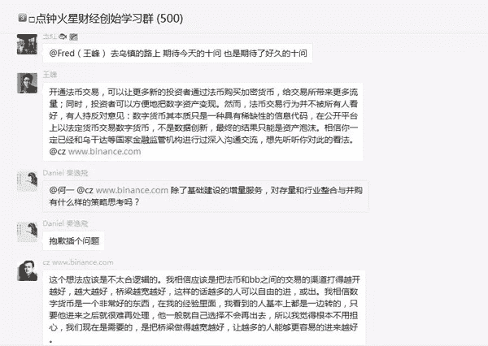

直播群王峰对话赵长鹏截图

**赵长鹏**：这个想法应该是不太合逻辑的。我相信应该是把法币和币币之间的交易的渠道打得越开越好、越大越好、桥梁越宽越好，这样的话，越多的人可以自由的进或出。我相信数字货币是一个非常好的东西，在我的经验里面，我看到的人基本上都是一边转的，只要他进来之后就很难再出去，他一般自己不会选择再出去，所以我觉得根本不用担心。我们现在需要的是把桥梁做得越宽越好，让越多的人能够更容易的进来。

我们的确和乌干达的金融监管机构有了非常深度的沟通，他们对这个非常支持。随着我们的努力，应该会有越来越多的国家和监管部门支持数字货币，这样整个行业才会变大。

**第二问  交易所大战中，竞争也要往长远看**

**王峰**：关于当下的交易所大战，很多人非常关心。我的问题是，币安去年起步，仅仅用 5 个月的时间就超越了同行，做到了全球交易量第一，这是有目共睹的。而以“交易即挖矿”为特色的 FCoin 用了短短的 15 天，号称成交量达到了第一（很多媒体和圈中人这样讲），并且“交易量还是第二到第七的总和”。你对它市场表现的第一反应是什么？

**赵长鹏**：哈哈，我觉得大家要认清楚，比的东西到底是不是一样的东西。拿刷的量和实际的交易量来比，就像拿空气和金子来比一样。拿两个账号，互相交易，每笔交易一亿、每一天有 1 万笔交易，也非常容易，但他们这么去刷交易量的话，反而让交易量完全没有意义了。我觉得可以从用户量、日访问量和其他的一些指标来衡量，但是其他的指标不是那么公开，也不是那么直观。

交易所收费的模式经过了很多的实验，从零手续费的补贴到 makertaker 补贴等等，有很多很多模式。这个我倒不是特别担心，最终的竞争还是要靠产品和服务。

**王峰**：我注意到，你并不看好“交易即挖矿”模式，一向低调的你，甚至连发微博进行抨击，称其“不但是变相 ICO，而且是高价 ICO”，为什么你这次反应如此强烈？甚至有人猜测，“交易即挖矿”模式对同样依赖高频交易的币安是个巨大威胁。我的问题单刀直入吧，交易挖矿模式果真对币安以及目前的主流数字数字货币交易所的 DAU（DailyActiveUser，日活跃用户数量）造成了冲击吗？

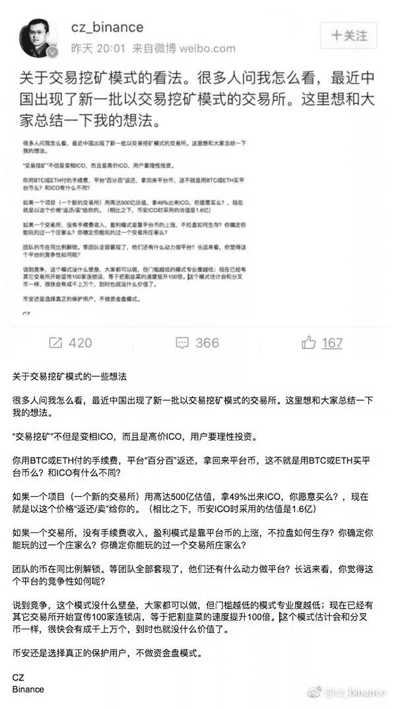

赵长鹏在社交媒体发表对“交易即挖矿”模式的看法

**赵长鹏**：这个数据我们也分析过了，我们过去的用户非常非常少。在币安的用户一般都是高级用户，他们都很聪明，很容易看出这个模式的漏洞。我可以用我个人比较有限的智商和大家分享一下我对这个模式的一些看法或者是问题。

从商业模式来说，我觉得任何商业模式要成功的话，必须能够持久。我们想一下，挖矿全部被挖完，也就几周后，这个商业模式怎么维持呢？谁愿意付 1‰的手续费去继续交易，这不是白白送手续费给别人吗？自己持有平台币就好了啊，就能得到分红。但是没有人去交易，平台收入少了，分红的回报也会少。回报率低，那么谁还压着资金持有平台币呢？

假如说像币安现在有接近 1000 万用户，他就算每天是 1000BTC（比币安现在高很多）的手续费，每人也只能分 0.0001（万分之一）BTC。攒 10 天也不够付一条网络转账的手续费。谁会把钱压在那儿啊？那么大家都开始抛，他平台币的价格会怎么样？

好，有解决方案。到时可以降低手续费刺激和吸引人来交易，那么收入和对应的分红更少，平台币还会有人持有么？平台币的价格会怎么样？

好，还有方案，让上币的项目方压币，减少流动性，希望稳住价格。这像是用弓箭射战斗机，好的项目方是不求小交易所的。他们给交易所带用户和流量，不会压币的。这里还有其他很多问题，我这里就不教育其他交易所了。长期的状态搞清楚了无法持续，我们就知道这个模式迟早会死。其实已经没必要研究下去了，就只看短期也还有很多其他的问题。

就算是还在挖矿的时候，我们也可以看下这个商业模式。有人付了手续费，这个手续费按照分红分给那些持有平台币的人。平台没收入，再发手续费等值 100%的平台币，零成本，给交易的人做返佣，然后再给 20%的平台币作为的介绍费，零成本。然后同时团队又同比例解锁 100%，零成本。这时候，只有 100%的手续费入场给了分红的人，就算所有收到分红的人都把他买成平台币，但平台币已经增发了等值的 220%。这个供需应求，你觉得币价会怎么样？

平台币价格下跌，造成买的人越少，恶性循环。所以，我觉得现在这个模式能够撑这么久，已经非常不容易了。

撑这么久大概有几个原因，一个是他利益绑定了一些媒体，帮他说话的人比较多；还有一些早期被套的，只能硬着头皮拉其他的人，希望自己解套；最大的原因是他很聪明地偷换了概念，包装的实在非常好。百分百手续费 100%返还、介绍人 20%额外奖励、分红，这些都是中国羊毛党特别喜欢的名词。其实是用一个零成本的平台币，换取（骗）别人值钱的数字货币。

**王峰**：6 月 19 日，徐明星很快跟进，OKEx 官方宣布开放共赢计划，将扶持 100 家“交易即挖矿”模式的交易所。之后不久，币安宣布启动“数字资产交易所开放联盟计划”，并表示将支持的“交易即挖矿”模式交易所加码至 1000 家。你有条微博，曾经提到“得把资金盘的水搅浑”，这一句对行业来说，意味深长。现在，资金盘的水浑了没有？

**赵长鹏**：好像还没来得及搅，水已经够浑了，看价格就知道了。详细说的话其实也很简单，如果有好的模式，我们肯定会学的，我们非常谦虚，我们也会复制。复制模式不难。也有很多人复制了 BNB 的模式，但是大家可能不理解的是，币安做到今天，我们的确靠 ICO 融了资，帮助我们做起来。但是融完资之后，我们是靠把平台做好才做到今天的。

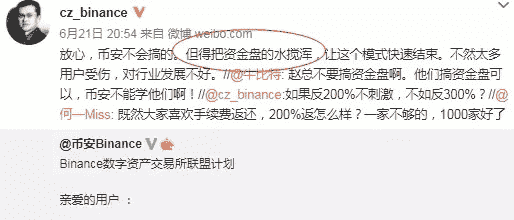

 赵长鹏：得把资金盘的水搅浑

**王峰**：有不少人认为，“交易即挖矿”这种通证经济玩法传统交易所玩不了，因为平台币的规则和玩法早已制定。尽管之前何一曾提到，1000 个联盟交易所计划其实“就是拍脑门拍出来的”，但另外一家比较受欢迎的交易所 Bit-Z，却动了真格，6 月 25 日破天荒地开启了“交易即挖矿”模式。据 Bit-Z 官方透露，“上线 25 分钟，即完成 100 万 BZ 挖矿记录，3 小时后成交量已达 61.8 亿元，12 小时成交量达 270 亿元，交易量排名蹿升至全球第一”。哈哈，吃瓜群众不知道信谁了。

烽烟四起，币安对此有什么应对策略？难道你提的“搅浑”，只是常山赵子龙虚晃一枪，还有后手杀招？

**赵长鹏**：这个问题我比较难公开的回答，如果需要的话，杀招后面肯定是有的，但是我也不能说它究竟是什么。币安的特点是，我们一般都会有后手准备，我们的备案都是做得非常足，执行起来也非常快。

**王峰**：在去年，无论是快速转战海外，还是返还手续费和推荐返佣，你们都开了行业先河。但最近，直到大量交易所跟进之后，币安才宣布一个和 OK 相似的平台币运作方案。在跟进交易挖矿模式的交易所的节奏上，币安好像变慢了。莫非由勇击转入智取？或者我直接问你，当年的激进主义者正因为公司变大而变得保守了吗？

**赵长鹏**：啊？我们一直不是特别保守，保守的人应该都还拿着法币。这个模式我上面解释过了，按照我的分析的话，它是非常割用户的，没有什么长期的价值。我们的节奏并没有变慢。你看乌干达，看我们在国际上的动作，公开的见过多少个总统？还有好多我没法发出来的。我们是不是比别人慢？

**第三问  为什么币安上币的破发率那么低？**

**王峰**：与传统的金融市场对标，数字货币交易所完全可以看成为一个超级金融中心，因为它融合了证监会审核、交易所流通这两大核心功能，高踞生态链的顶端。据我所了解，在目前的数字货币交易所中，币安因上币严格著称，不少交易者认为，币安交易的币种普遍质量上乘，相对于其他交易所更值得信赖。何一在 5 月的一次币安媒体沟通会中提及，币安是上币最严格的币币交易平台；据统计，2018 年 1 月 6 日至 3 月 8 日，国内竞品破发率为 81.25%和 77.94%；而币安破发率仅为 11.76%，4 月到 5 月币安上币更是屈指可数。币安如此之低的破发率是如何实现的？仅仅是因为上币更严格吗？

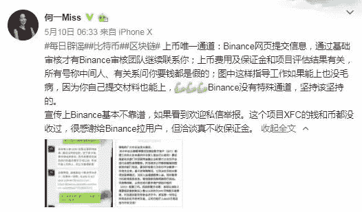

何一在网上回应币安上币规则

**赵长鹏**：为什么破发率这么低，其实有一点可能大家不理解，我觉得审核严格是第二个环节。最重要的是第一个环节：交易平台要吸引好的币过来，首先需要你自己有品牌效应，不能是一个不好的品牌。所以，品牌做的事情一定要正，这个时候会有一个正能量的循环。当然，我们上币团队的审核能力也是真的非常强。他们几个经常都是早上 9 点开始上班，上到晚上一两点才回家的，整天盯着白皮书，研究项目，看了无数个。但是即使这样，有些时候我们也是没法预估项目未来的发展，所以有些时候还是会踩坑。但是我们踩坑数量应该是非常少。另外一个，我们币安从来不上关系币，有很多跟我关系不错的人，行业里的老人，他们过来找我，但是我们都是同样一个审核标准，这个也得罪了不少人。但是我们的原则是永远不变的，我们保护用户至上！

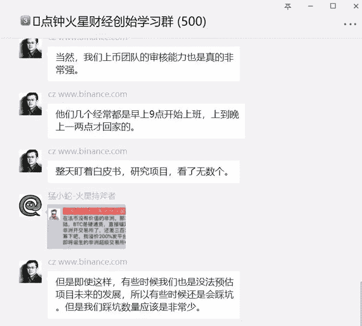

直播群王峰对话赵长鹏截图

**王峰**：何一曾有过解释，币安上币唯一的通道是网页提交项目材料，审核团队在线调取信息，不同小组进行不同维度的评估和调研。在这里，你方便分享一下币安具体的上币规则么？关于你们的上币政策规则，期间经历过哪些优化调整？

**赵长鹏**：其实我们审核项目的原则也很简单，要好的团队，有历史的团队，好的产品，产品有用户。但我们一般不会定硬性的指标，说用户量一定要达到多少，或者是 Telegram 里面一定要有 1 万个用户。因为如果我们一旦定了这样一个目标，别人就会去刷出来。所以对外来说，我们上币审核的具体的规则是一个黑盒子，但其实很简单，只要自己把自己的项目做好了，我们就会上的。但是我们真的上的项目，其实我们都看的蛮深的，包括技术，包括代码，各个方面我们都看得非常细。

**王峰**：小问题，目前市场常见的上币模式已有如下 3 种：平台审核、投票上币和充值人数排名，你认为哪种机制对投资者更加负责？

**赵长鹏**：我觉得这三种模式，其实如果管理得好，每种都可以很有效。我觉得不是模式本身的问题，是模式里面的一些参数，你怎么设、怎么平衡，如果有不好的恶参与者，你怎么处理，怎么去防御一些利益的影响。

比如说，如果是社区投票。如果投票是按照需要持有平台币才行的话，那么我们的天使的早期投资一个都没卖过的，他们此时币的分量比较高，那么他们现在再去投资其他的项目，投票权就会非常强。这个事情是好还是不好？还是需要设一个上限，这个都说不太清楚，这个具体的区域运营的时候要把参数调整好才行，这个参数要调好久。

**王峰**：客观上看，币安的上币模式还是一个中心化的评估决策体系，虽然中心化会更高效和专业，但对于外界来说还是黑箱，免不了误解。比如，被外界广为诟病的天价上币费，中心化的东西，我们无法证伪，未来澄清起来很困难。

对比来看，业界越来越多的交易所开始尝试新的审核上币模式，如火币 HADAX 上线“超级投票节点”，行业内信誉良好的专业机构可以申请参与监督投票；FCoin 则是成立了上币投票委员会，由三个组织共同组成：社区委员会成员、社区合伙人成员、专家评审团队。

这种由不同利益方共同组成审核上币的模式，是否会实现有效评估和公开透明的兼备？未来币安会有所借鉴吗？

**赵长鹏**：社区投票上币应该是我们币安发明的。现在上币有很多种不同的模式，但我觉得这几种模式都不重要，重要的是到最后你的结果好不好，你没有保护好用户。我觉得这一块币安做的应该还是非常好的，等币安的公链出来之后，在上面上币就比较容易了。我觉得上币的体系的结构越复杂，里面的利益结构房也就越多，可能就越腐败，到最后还是很容易有问题。

**王峰**：有媒体统计，截至 2018 年 5 月，币安已经支持 120 种加密货币、100 多种钱包和 240 个交易组合。我不知道我的观察是否清晰，目前数字货币交易所的商业化手段主要有三种：上币费、手续费、平台币。如是，币安更侧重哪一种？以及，你们的理由？

**赵长鹏**：我们肯定是手续费的，收入是最大头的。这块收入非常透明，也非常公正，我喜欢简单的模式。币安的团队持有的币，到目前为止没有任何一个动过，我们团队一分钱都没买过。他们身价应该很高了，但是我们到现在没有靠卖币赚过一分钱。我们看长期，我们是分 5 年解锁，已经解锁的部分到目前为止也一个都没动过。

**王峰**：据我们了解，币安并非对所有项目都收取上币费，我前几天遇到 QuarkChain 的杜挺，他说夸克链上币安首发，并没有上币费，对你们做事的态度非常佩服。但是并没有消息说你们完全不收上币费。那么，币安项目收费与否以及收费多少的标准是什么？ 

关于上币费问题，如果赶在类似去年的大牛市，项目方被收费似乎存在一定合理性。但是，处在今天这样的大熊市，一旦收新币的上币费，就好比交易所直接先割了项目方的韭菜。你有没有考虑过彻底取消上币费呢？

**赵长鹏**：我们这边的原则是项目方自己说他们愿意付多少钱，然后我们会综合考虑，他们说零也可以。大家如果去填一下我们上币申请表的话，里面有一项是让你自己出一个价格，写零也可以，然后这些信息我们会综合一次全部收集上来，然后就一起审核，如果你自己觉得自己的项目特别牛逼，写零就好了。

**第四问  币安遇到过什么困难？**

**王峰**：币安 2017 年 7 月上线，由于开始定位于走国际化路线，服务器均注册设立在海外，且币安只做币币交易，不涉及加密货币对法币的交易对，去年的九四政策并未对币安业务产生重大影响。九四之后，币安逐步将重心转移到海外市场，你离开了上海，东渡日本。当时你的心情如何？有没有想到什么时候币安能再回到中国？从上海到东京的辗转过程中，币安和你个人都遇到过什么困难？

**赵长鹏**：这个是我们团队的核心优势，我们团队是一个非常国际化的团队，其实当时我们在中国的时候，我们在其他的国家也都有团队。我从小也在很多国家住过，所以换地方对我来说一点问题都没有。我个人还有一个非常强的优点，就是你让我吃一个礼拜的汉堡，我也没问题，你让我吃一个礼拜的意大利面，我也没问题。我们当时在海外有一个小团队，大概是 20 人的一个，客服团队，但是他们可以讲 30 个不同的语言，人在哪里其实一点都不重要。我觉得对我来说更重要的是，我们要理解国际化的用户习惯跟国际化的文化，这个很重要，这个是我们能够跨上国际最重要的一部分。

**王峰**：然而，今年 3 月，日本金融厅以币安没有在日本注册或给投资者带来损失为由，要求币安在 4 月 6 日之前就如何停止为日本用户服务给出解决方案，相当于给币安下了“逐客令”。后来，你表态，币安无意成立日本交易所，称“日本的交易所规则太严格了，对币安来说行不通”。因为交易所规则严格，就放弃了日本市场？对我们大多数人来说，这个举动出人意料。

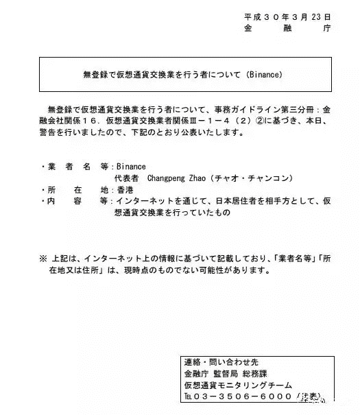

日本金融厅发布的警告函

**赵长鹏**：其实他这个警告还自己解释了自己的问题。你看地址的地方怎么写的？还没有确切的地址就一个字。应该是这个公告的当天，马耳他的总统，发 twitter 说，欢迎我们去马尔他。这应该是全球第一个总统邀请一个数字货币公司去他们国家。

**王峰**：“自己从来没有真正持有强烈的单个国家概念”、“地球才算是家”，这是你在某次采访中说过的话。我不知道币安现在落地在哪个国家？某些自媒体说：“币安是一个游离于主权国家之外的交易所”，哈哈。

2018 年 3 月 23 日，币安发表公告称，在马耳他正式开展业务，一个月后，币安又先后与多哥共和国总理、乌干达总统、百慕大总理会面，并达成相关合作；6 月，币安宣布将在泽西岛建立合规基地以及数字货币交易所。你和百慕大总理会面时，穿着西装搭配短裤的照片，一度在网上爆红。但是，据我了解，这些国家和地区要么是面积狭小（马耳他只有不到 316 平方公里），要么是人口稀少（泽西岛人口只有 7.6 万），普遍资源匮乏。你曾经说，加密货币让全世界联合起来了。目前来看，币安选择合作的对象，大多是一些资源匮乏的国家和地区，我是否可以理解为经济落后国家和地区更渴求数字货币资产？

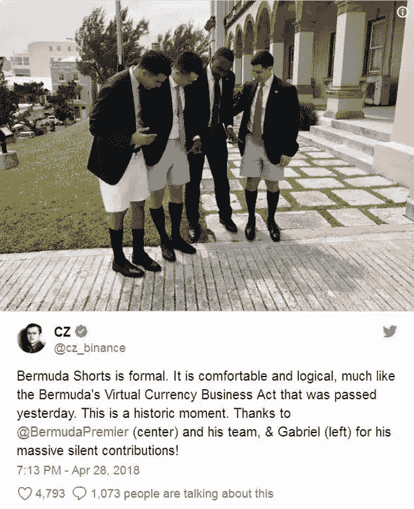

赵长鹏评价百慕大顿短裤： 穿起来很正式，感觉既舒服又有条理

**赵长鹏**：地球是我家，等 Elon Musk 把人类变成跨星系的话，我们的范围可以更大一点。我觉得，大多数的中国人可能只看中国一个地方，其实世界挺大的，如果你在世界上走一走，你就会发现，现在多数的国家都是想要吸引区块链公司、数字货币交易所。不是说这些小的国家资源比较少，只是他们小的国家反应比较快，内部部门的协调比较少，所有人都是所有人，行动比较快。在这轮变革中应该会有非常强的优势。

**王峰**：春秋时，孔子周游列国，推行儒教。如今，你马不停蹄地走访各国政要，力图去落地一个合法化的数字货币交易所。你可能是对全球各国数字货币监管政策最了解和熟悉的人了。从你了解的情况上看，全球整体的监管政策是更偏于乐观还是悲观？目前哪些国家和地区对数字货币的政策最为积极？

**赵长鹏**：从国家来说，目前我们公开的几个国家应该是最友善的，包括马耳他，包括乌干达、百慕大、泽西岛。欧洲还有好多其他国家，对数字货币的支持度也都非常高，但是我们精力有限，没法一个一个的全部都对接。其实现在应该说反对数字货币和区块链行业的国家，我好像暂时想不到。

**第五问  用理想说服何一，用交易成就自己**

**王峰**：在创立币安之前，2014 年，你以联合创始人的身份加入 OKCoin，出任 CTO，管理技术团队，并负责国际市场团队。你、何一和徐明星被圈内称为“OKCoin 三剑客”，你们在公司 LOGO 前的三人合影，至今还在网上流传。据说，何一是三顾茅庐请到你加盟，有这回事吗？你们散伙之后，徐明星指责你“没有贡献过一行代码，没有解决过一个技术问题“。当初你听到徐明星说这句话的时候，你是怎么理解的？往事如烟，对于徐明星的指责，你从未给出过正面回应，今天在这里，你还想说点什么吗？

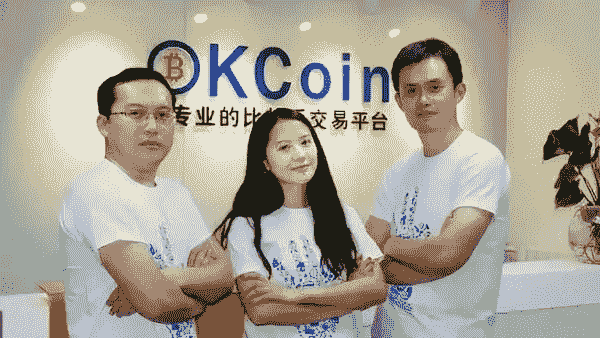

从左至右：徐明星，何一，赵长鹏 CZ

**赵长鹏**：这个还需要我解释么？我觉得我的能力不用解释。哈哈，这里自大了一下，抱歉。

**王峰**：2015 年你离职，单飞再创业，三年过去了。老板就是老板，平心而论，你从徐明星老板身上学到了什么？当初离开是什么让你感到失望和不满？你可曾想过和徐明星“杯酒释前嫌”的那一刻吗？

**赵长鹏**：我不喜欢互怼，我喜欢专心做我自己的事情。执行创造价值。每个人都有我学习的东西，也有人教了我什么不能做。哈哈。往事云烟，没啥意思。很多人喜欢听故事，可惜我一般不喜欢讲故事，我比较喜欢做事。

**王峰**：你离开不久，何一也低调离开，并加入短视频公司一下科技。更令人惊讶的是，两年后，2017 年 8 月，何一在社交媒体发布公开信，宣布辞任一下科技高管，正式加入你的币安，并担任 CMO 联合创始人兼董事。你是如何说服自己的老搭档何一加盟币安的？在你眼中的“币圈一姐”是怎样的？

币安黄金搭档： 币安 CEO 赵长鹏，币安联合创始人何一

**赵长鹏**：用理想！哈哈哈。我眼中的币圈一姐是“明明可以靠颜值吃饭的，但却选择了为理想奋斗！”而且不是个人的理想，是真的想做点有意义的事的理想。

**王峰**：根据这么多年我的观察，有过成功合作的搭档，再次合作时往往更容易成功，甚至达到炉火纯青的程度。当初币安遭遇应急事件时，何一在各个微信群疯狂转发澄清文章，这哪是合伙人，这简直就是客服！何一是真牛啊！当初你找到何一的时候，可否想过会有如此王牌的组合？

**赵长鹏**：从最开始我就知道合作肯定不会有任何问题。她会做的事情我都不会。她有的能力我都没有。所以我肯定不会逞能的。永远找比自己更牛逼的人，给他们空间，责任和权利。我们的理念又一致，所以很轻松。

**第六问  离开区块链去干什么了？闭门练功**

**王峰**：我在网上找了你的经历，你在 10 岁时随父亲去了加拿大，10 到 20 岁一直在加拿大。毕业后就进入金融交易市场，中间尝试过自己创业；2013 年全职投入比特币行业，并出任 Blockchain CTO；2014 年以联合创始人的身份加入 OKCoin，出任 CTO，2015 年从 OKCoin 离职，当时产生很大争议；2017 年，你创立币安至今。

分析你这段成长史，我觉得很有意思，你一直没有离开过交易。我入行时做工具软件，后来在网络游戏行业做了十多年，圈中很多人称“为游戏而生”。但我觉得你却是“为交易而生”。从 1997 年大学毕业，第一份工作从事金融交易所系统开发，到现在经营数字货币交易所，整整 20 多年。在我看来，你就是一个为交易而生的人。你有交易历史败笔吗？还是一直都是大赢家？

**赵长鹏**：这里面有三部分，第一部分是我的经历，我刚刚也说了，对我们做国际化是非常有贡献的。第二部分是，其实我离开 ok 的时候是很平和的。后面他跟 Rogerver 争议，是三个月之后，我是莫名其妙的奇妙的躺枪被扯进去。做交易平台的人反而不能交易，所以我对交易其实反而一直非常不在行，我对交易平台比较在行。

**王峰**：交易是人类文明的基础，我们每天都在交易中，但是做好交易太难了。为什么你就对交易平台有如此大的兴趣？你的交易的理解到底来自哪里？来自你的学习和成长经历吗？听说你很喜欢打德扑，和交易有关联吗？

**赵长鹏**：我其实是运气比较好的，是大学的时候就接触了对应的交易系统，所以当时就一直在金融和技术合流的行业。我觉得交易是一个经济体系的血脉和心脏，交易所应该更像心脏，所以你可以直接看到它对整个经济的影响，所以我一直很喜欢这个。

我觉得打扑克牌跟交易不太一样，我偶尔打扑克牌，一直更想创业。有一个相似之处是你在没有完全信息的时候需要做一些决定。但是我已经好几年没有碰过扑克牌了，完全没时间，也不敢想象。

**王峰**：我曾经读过全球最大的对冲基金桥水基金创始人达里奥（RayDalio）的《原则》一书，有一句话让我印象颇深，“人际关系是我的主要目标，我做的一切事情都是为了完成这两个目标，赚钱只是附带结果”。那么，作为全球最大的数字加密货币交易所的掌门人，20 多年深谙于各种交易系统运营之道，你的原则是什么？从你的角度来看，做交易平台需要道德底线吗？底线在哪里？

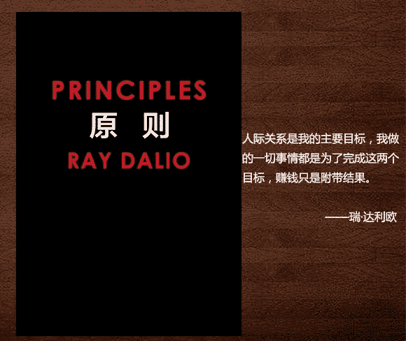

《原则》——瑞·达利欧 

**赵长鹏**：这本书我手机里应该有。我的原则很简单，一个人把自己照顾好了之后，就应该照顾一下其他的人，这是我们这个种类能够生存下来的最基本的原则，如果我们不这么想的话，我们这个种类就会消失。那么就要想一些怎么为人类做一些好的事情，如果你能力大的话就多做一点，如果能力小的话就少做一点，每人尽力，我们就尽我的力量做我做的一点点。

交易平台必须有道德底线，不参与交易、不操纵市场，为用户提供公平的交易环境，这也是我们一直在做的事情，但我们的价值观是保护用户，用户是我们的社区成员。我会做的就是交易所，我知道怎么做一个非常公正的交易所，我们要把这个行业做正。

**王峰**：从 2015 年下半年到 2017 年 7 月 14 日创立币安，这期间你的经历似乎外界了解并不多。在这段将近 2 年的空窗期，你居然离开了区块链行业，离开了神奇的数字货币市场，原因是什么？两年以后，你重返数字货币交易战场，原因又是什么？以及在离开区块链的这两年里，你的思考是什么？请不吝赐教。

**赵长鹏**：闭关练功，哈哈哈。其实币安的交易系统就是从 15 年之后就开始开发了。币安的系统不是从 17 年 6 月份才开始开发的，一个月是开发不出来这种系统的。

**第七问  是否刻意保持神秘的形象？**

**王峰**：这可能是一个比较私人的问题。有人说，赵长鹏没有朋友。这一点我是不信的，但我观察到，像其他交易所老大，火币李林和 OK 老徐，他们都有自己的社交圈子，也经常在公众媒体包括朋友圈谈一些自己的观点和见解，形象就会比较鲜活。但你几乎很少出现在媒体和社群，与你的搭档何一比起来，你的公众形象显得神秘而疏离。去年《福布斯》封面引爆媒体之后，让你的形象更加神秘，连币安的形象也显得很神秘。甚至这次访谈，我约你约了三个月，你是刻意保持这种神秘感吗？我注意到娱乐行业的大牌明星，往往平时都回避媒体采访，但一亮相就引爆全场。我感觉你很像这样。

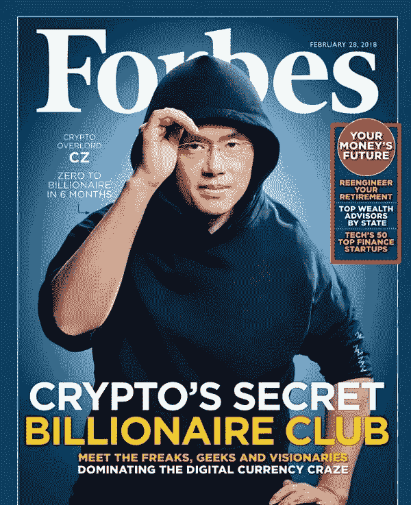

**赵长鹏**：其实我完全没有这么觉得，我觉得我应该比他们更活跃啊。但是这个可能我们要覆盖的面积比较广吧，他们在国内是应该比较活跃的，比我在国内宣传的多。微博我更新也挺慢的，而且我一直不太习惯微博的那个界面，所以用 Twitter 比较多。可能主要是因为 Twitter 在国内没法访问吧，所以很多国内的人看到我的信息都是二手的。

另外，我的确是做技术的，所以还是有很多实际的活在做，事情也比较多，所以时间也比较少。会采访引爆，其实跟我个人没什么关系，主要是我们品牌知名度比较强。另外一个是可能国内这些新闻经常是在互怼呀，还有很多争论的东西，我一般不太喜欢参与这些讨论，我喜欢参与一些技术的、对行业有帮助的这种讨论。

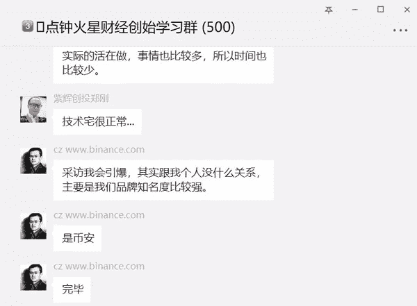

**王峰**：币安的公司品牌意识很强，我看得出。５月初，你和红杉的争吵闹得沸沸扬扬。你在推特上表示，“可能会很快要求所有申请在币安上线的项目披露其是否与红杉有直接或间接关系。”这句话被那些你曾 diss 过的一些区块链媒体写成了“币安将彻底清理出一切与红杉资本有关的项目”，甚至用到了币安与红杉决裂这样的字眼。不过，在你眼中，红杉是一个比较 aggressive 的投资机构吗？

**赵长鹏**：我觉得我还是不单独评价某一个人或者某一个公司，所以在这里就像红杉，我也不单独评价它。但是我觉得这里有一点可以说的是，传统的投资机构，他们投资的方式都是很老套的，而且他们有很多套路，嗯，这些往往对一个创业公司来说非常不友好或者不好。但是非常有幸的是，那个时代应该已经过去了，我觉得现在的话语权应该是在创业者的手中。现在好的项目，好的团队是绝对不会缺钱的。所以希望大家加油，把自己的项目做好。

**王峰**：币安短时间内从一个初创公司高速发展成为一个交易所巨头，目前币安的手已经延伸到币安 Labs 孵化器和其他一些生态布局，其中也包括媒体。为什么交易所一定要自己做媒体？我看过 BABI 财经，做得还不错，你觉得火星财经做得怎么样？或者诚恳地给一些建议。

**赵长鹏**：芭比是我们投的公司，也没有太管他们，我对这个行业也不太懂。他们跟我抱怨说，我们发消息都从来没有给过她先提示一下，因为我一直记不得，我也不打算这么做。

我觉得火星做的很好，另外一个，我们的产业里面其实投的媒体是非常非常少的，其他的交易所都投了很多，然后我们现在在这种基础架构的项目上投的比较多。后面希望能有机会合作，你懂的，哈哈。

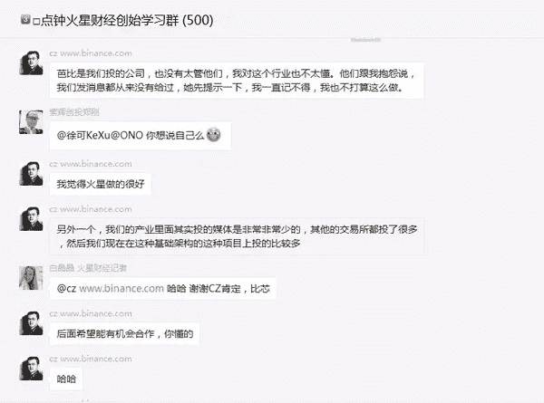

**第八问  指责交易所造假前后**

**王峰**：5 月 31 日，你在 Twitter 发出一张交易所过去 30 天的 Alex 流量排名，并质疑交易量排名与 Alexa 流量分析排名不吻合，暗示竞争对手交易量有造假嫌疑。然而，早在今年 3 月份，美国科技博客 Medium 刊登了署名文章《追踪虚假的成交量：一场加密的瘟疫》（Chasingfakevolume:acrypto-plague），引起了币圈热议。作者指出，中国的虚拟货币交易所——火币、币安等都存在成交量造假行为，假交易额的数量占比 70-90%。一方面，你指责竞争对手造假；另一方面，你又被科技媒体质疑造假。究竟谁站在真理这边？会不会是因为研究工具或模型的不同，造成了交易量造假的错误结论？

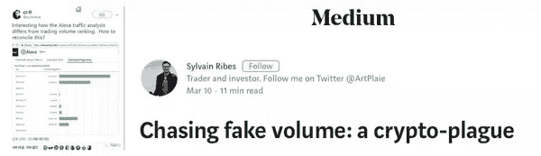

质疑中前行的交易所

**赵长鹏**：那篇文章翻译成中文的时候，又出现了一些偏差，其实那篇文章是说在所有交易所里面只有看不出来币安有假交易量，因为我们没有。其他人的假交易量的那个文章里已经说了，我就不重复数字了，因为数字都很高。但是我觉得用户都是聪明的，究竟谁的交易量真，还是谁的交易量是假的，包括刷量的问题，这个应该用户心里都知道，人都不傻。我觉得现在太多刷量，很多假的交易量，对我们这个行业不好，显得我们这个行业很虚假一样。

**王峰**：我还注意到，你曾经说，希望币安能够报告较低的交易量，这样就可以不总是处在第一位。不做第一，似乎你在很多场合下都提到过。为什么会有不做第一的想法？是怕枪打出头鸟？

**赵长鹏**：真正的强者不会天天喊自己是第一高手，在非交易为目的语境下，更正确的表达是我们不在意第一，我们更在意的是我们为这个行业做了多少基础建设工作，而不是收割行为。其实不是为了做第一去做第一，是把事情做好就行了，第几不重要。而且现在所有的排名都是有些瑕疵的，排名也非常难做的，所以真的不重要。

**王峰**：在监管尚未到位的情况下，若中心化交易所数据造假、刷交易量，似乎没有更好的办法去解决。在推崇共识机制的区块链生态中，核心环节之一的交易所却无法让人们对它形成共识，令人略感无奈。你觉得在监管到位之前，这个问题应该怎么解决？

**赵长鹏**：现在因为技术发展太快，我觉得监管到位这个状态有可能永远都达不到，因为技术也在不停的前进。另外要监管一个行业是非常非常难的，你要对这个行业里面能够发生的所有情况全部预估到，这个真的没有办法，不是说监管不想做。所以，我觉得好的监管框架其实有三部分。监管部门需要有一个比较大的框架和大的方向，那么从业者需要，把自己的事情做好，不能做坏的事情，最重要的一部分，其实在用户，用户你不要去支持不好的项目和不好的平台。这个需要大家一起努力，才能把这个行业做好。

**第九问  去中心化交易所取代中心化交易所还要很长时间**

**王峰**：3 月 13 日，币安宣布启动专注于区块链资产交易与转换的公有链 BinanceChain（币安链）。通过开发币安链，币安将会从“企业”转型到“社区”，同时币安链也将会用于转移或交易不同的区块链资产。此外，币安还宣布将把 BNB 迁移到币安链上。信息发布后，BNB 大涨至 11 美元，单日内涨幅超过 25%。

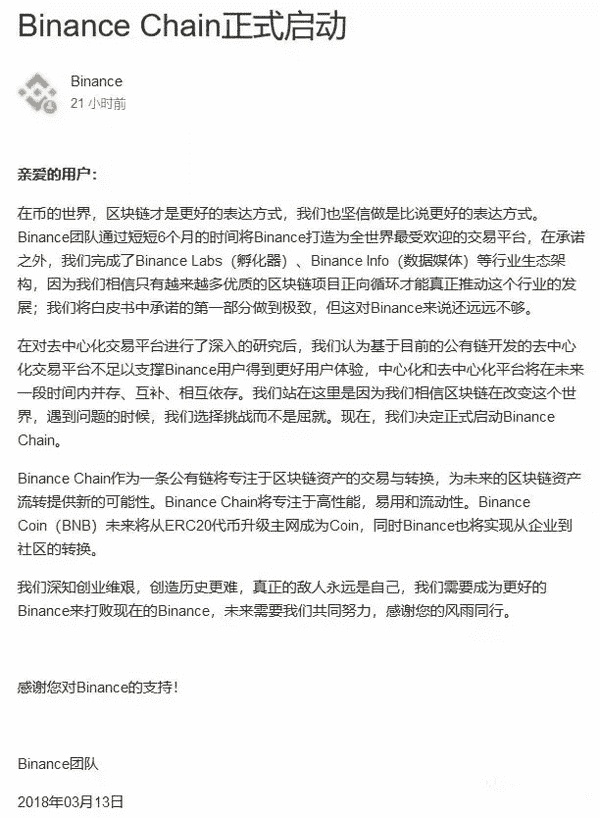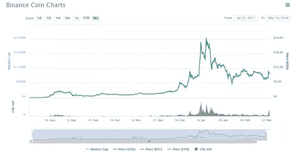

Binance Chain 通告发布之后，币安币（BNB）大涨 25%，从 8 美元最高涨至 11 美元 

币安过去一直用的公有链开发，使用的是 ERC20 代币，为什么币安这次要自己开发一条公链，而不是使用行业内已有的资源与技术？你说币安链是优先级最高的事务之一，那么，你有多少精力分配给 BinanceChain？以及其最新进度，透露透露。

**赵长鹏**：我们公链的项目一直在开发中。我其实是希望我有 20%的时间全部放在公链的项目上。但目前可能比这稍微低一点，但接下来我会花更多时间。但我们的团队非常优秀。公链以后，5 年、10 年、20 年以后肯定是一个趋势，所以真的好的模式我们是不会放弃的，我们拥抱变化和创新。

**王峰**：联想到你 3 月初提到“未来的几个月将会推出一个去中心化的交易所。”在我看来，币安链的推出，是在为 BNB 构建流通渠道，也是去中心化交易所的重要技术依托。

然而，去中心化交易所目前还只是“看上去很美”的阶段。据媒体统计，目前全球数字货币交易所已超过 1000 家，去中心化交易所不到 5%，所占市场份额寥寥。有人说，去中心化交易所，在未来两三年内不会成为主流，取代中心化交易所的过程需要很长时间。你同意这个观点吗？从目前愈演愈烈的交易所大战看，会不会创新型社区化的中心交易机制才是坚持进化的发展方向？

**赵长鹏**：这个观点我同意的，目前公链的性能不够快，短期之内我觉得大交易量应该还是在装新房的交易平台上，去中心化的交易平台可能还要等几年才会主流。

**第十问  币安没有 IPO 计划**

**王峰**：矿机和交易所无疑是区块链产业两大巨头行业。此前，矿机行业全球第一吴忌寒的比特大陆传出 9 月底在港交所交表的消息，估值最高达到 400 亿美元。矿机第二的嘉楠耘智也在 5 月向港交所递表。那么，作为交易所行业的执牛耳者，币安会选择靠拢传统金融市场么？

**赵长鹏**：我们没有 IPO 的计划，传统金融行业的 IPO 已经变成了一个融资，或者早期投资者解套的一个工具了，所以我不想那么做。应该说是一个 VC 解套的工具，我们没有 VC 投资者，区块链已经把我们带到下一个时代了。

**王峰**：你之前曾任职于传统金融交易所，在目前币市总市值远低于传统全球资本市场市值的情况下，未来你认为数字货币交易所最后会取代官方的传统金融交易所么？抑或两者将在一定程度上进行融合？

**赵长鹏**：我觉得两者会并行一段时间。我们的体积还是比他们小太多，说取代还有点早。以后会演变成什么样子很难预测，我们专心做好事情就好了。

**王峰**：数字货币市场起起伏伏，惊心动魄，笑到最后的，才是赢家。数字货币交易所，是我们进入新一轮大航海时代的航灯。不到一年时间就从 0 飞奔到 100 亿美元估值的币安，CZ 和何一 ，谢谢你们，榜样精神一直激励我们。新的时代，每个都有机会，怀着谦卑之心，努力做事，我们要向赵长鹏和何一学习。

再次谢谢长鹏，感谢你今天能做客火星财经的“王峰十问”，祝币安越来越好！谢谢各位参与火星财经王峰十问，这是我们的第 22 期。下次见。

**[点击此处查看赵长鹏做客“王峰十问”（英文版）](http://www.huoxing24.com/newsdetail/2018062920270325904.html)**

声明：本文为火星财经原创稿件，版权归火星财经所有，未经授权不得转载，转载须在文章标题后注明“文章来源：火星财经”，若违规转载，火星财经有权追究法律责任。