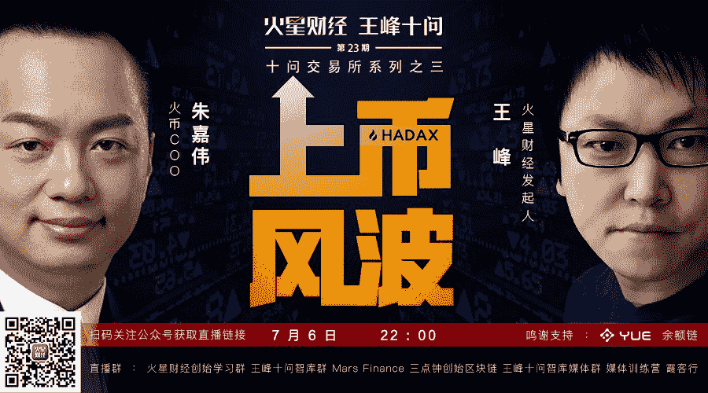
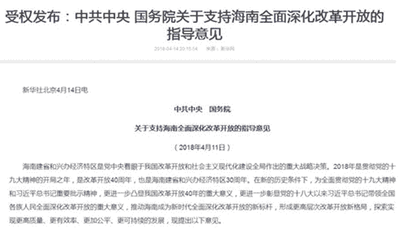

# 王峰十问第 23 期 | 火币朱嘉伟：全面回应上币政策、高破发率、HADAX 风波.....（附音频）

> 原文：[`news.huoxing24.com/2018070613140691921.html`](https://news.huoxing24.com/2018070613140691921.html)

**对话时间**：7 月 6 日 22 点

**微信社群**：火星财经创始学习群

**对话嘉宾**：

**朱嘉伟**：火币集团 COO，负责火币集团运营管理工作，曾就职于 Oracle，凯捷咨询，拥有丰富的公司管理和数据分析实践经验以及业务运营管理经验。

**王峰**：火星财经发起人，蓝港互动集团（HK.8267）创始人，极客帮创投合伙人，曾任金山软件高级副总裁。

**以下为对话原文整理**：

**王峰：**Hi，大家晚上好，欢迎来到由余额链赞助的火星财经“王峰十问”的第二十三期。给大家介绍今天来的嘉宾：火币 COO 朱嘉伟。

先让我们看一看朱嘉伟的经历：2007 年，研究生毕业于河海大学，当年加入甲骨文（Oracle）公司；2010 年，任凯捷咨询（中国）有限公司项目负责人，服务过腾讯、搜狐、去哪儿网、凤凰网、华润集团等几十家知名企业；2015 年，加入火币，历任火币 CEO 助理、运营总监、首席运营官。

最近，各家传统数字货币交易所的日子都不算太好过，特别是火币，也明显有点“上火”：刚迎来以 FCoin 为代表的“交易挖矿”交易所的猛烈冲击，上周五，又因为 HADAX 超级节点规则的变更，要直面多家区块链 VC 公开退出的抵制。其实，新入局者竞争也好，合作伙伴抵制也罢，争议的核心还是离不开一个点——上币。

上币的标准是什么？上币费为什么这么高？有些好项目为什么上不了？上币后为什么都破发？相信不少人都对交易所有过类似的疑问。市场在不断成长，项目方和投资者们也变得更加理性，在这场交易所混战中，是甘愿留守，还是转投他营，他们会“用脚投票”，做出自己的选择

今天很高兴请到嘉伟参与火星财经的“王峰十问”。火币是最近“上币风波”的主角之一，希望嘉伟能够直面风波，开诚布公地还原风波背后的故事，也为大家带来更多冷静和深入的思考。下面，开始我们今天的“王峰十问”吧。

**第一问：超级节点退出，直面 HADAX 风波**

**王峰：**我估计你应该没有想到，火币 HADAX 整改方案的出台，会一石掀起千层浪，引发这么大一场风波。HADAX6 月 29 日发布新规则，将超级节点分为两层，即常务节点和优选节点；常务节点中多为传统 VC，而优选节点大都为 Token 基金。根据新规则，项目想要上线 HADAX，必须有一个常务节点的支持，优选节点明显失去了在投票上币阶段的话语权。为什么将超级节点分为常务节点和优选节点两层？这样处理会不会让 Token 基金感到歧视？套用陈伟星的话：“不想死在旧社会，而想活到新世界。”为什么你们在判定上币标准上，偏向了古典互联网的“旧社会秩序”？

让古典互联网和价值互联网泾渭分明的新规则

**朱嘉伟：**这事儿说来话长，容我娓娓道来吧。HADAX 作为区块链项目的试验田，一方面我们要引入更多更初创的项目让投资者能够享受项目早期投资的红利；另一方面，创业项目原本就九死一生，在这个快速发展的行业里，我们更要控制项目的风险，这是一组矛盾，每天我们都在思考和讨论怎样才能做得更好，这种初心从来就没有变化过。

HADAX 的投票上币从今年 3 月份开始，历经三轮共计十三期投票，从第一期最原始的竞价排名，到设立空投激励、引入项目保证金为投资者做保障，再到加入超级节点初选机制，最后免费投票去带动社区投票的热情，HADAX 的数次改版都是为了能够通过社区化的运作，选出更好的项目给投资者。

可是，在执行过程中，我们发现，由于各种原因，部分超级节点的某些行为，和我们当初设立超级节点的初衷完全背离，尤其是在 INC 事件发生之后，我们也收到了各方的各个维度的信息反馈，我们更加意识到当前执行的规则必须改革。

于是我们停止了投票上币，从项目源开始抓起。采用"常务节点”的方案，也是 HADAX 第一次将传统领域中的“保荐制度”应用在区块链领域里。

当前区块链行业的快速发展，涌现了非常多优秀的基金，但由于大多数基金存续时间都不长，在推荐项目方面也需要更长的时间观察，所以，我们想让超级节点成为保荐人，将保荐人的品牌和保荐项目的发展绑定，这样一方面更容易评价超级节点的成绩，另一方面也迫使超级节点对自己推荐的项目严格审核和负责。

我们设计的时候，希望超级节点能帮忙选出推荐和优质的项目，并且一直跟随这些项目，帮助项目发展起来，但后来发现部分超级节点和项目方的关系不是这样的。 所以才想到要用保荐制。

引入传统的 VC，其实也往想这个方向努力，其实从今年初以来，我们就特别希望传统的投资机构能够进入到这个行业里来。这并不是对 Token Fund 有歧视，我们给他们更多的机会，期待他们的加入，是希望他们能够加速推进这个行业的前进。这其实不是竞争关系，因为他们的加入也不会抢了 Token Fund 的生意，而是真的有可能会一起把蛋糕做大，能够推动一些原先行业内部推动不了的东西落地。行业流动性过剩，导致大家觉得创业似乎很容易，投资赚钱也似乎很容易，冲昏头脑的人不在少数。

其实创业是一件九死一生的事情，全球一个月诞生几百个项目，原本就是不太合理的。创业者也好，投资机构也好，普通投资人也好，到最后都会因为这样的不合理受伤害，这个不是我们希望看到的。传统 VC 发展了这么多年，有着各自的投资逻辑和投资方法论，这些沉淀，会帮助给当前区块链行业带来新的思路和玩儿法，这是我们特别想引入传统 VC 的原因。

**王峰：**我注意到，节点资本表态放弃火币 HADAX 合作，而选择与 FCoin 等交易所合作免费上币，称“交易所的强势与独裁一去不复返”，杜均老板随后在朋友圈配图“竖中指”，甚至还用了“Fuck”这样的字眼。

杜均朋友圈配图“竖中指”回应

赵东的 DFund 声明，将退出火币超级节点，不再参与任何 HADAX 投票事宜。

赵东宣布 DFund 退出火币超级节点 

显然，杜均、赵东等对新政策非常不满。作为火币集团 COO，直接责任集团上币业务，对你而言，内外压力都不会小，这是不是火币上币部门最大的一场危机公关？火币这样的调整方式，是否系上币方一直以来的强势心理地位所致？李林的休假期间，发生了这么大的事情，你们之间是如何沟通的？

**朱嘉伟：**首先，这次 HADAX 超级节点规则变更，没有提前和超级节点沟通同步，影响到大家，是我们工作的失误，我也借此机会在此一并向各位超级节点的合伙人和团队道个歉，后期我们会建立沟通机制。在过去的一个星期里，我自己约见了很多超级节点伙伴，都聊了很多，没来得及约的下周还会继续和大家约见面，我想，充分的沟通一定能够消除之前的误解。

帮助用户选择出优质的项目来投资，是我们和超级节点的共同目标，这点上是非常高度一致。

杜均是火币早期的联合创始人，我和杜均的关系也都非常好；赵东是火币最老的客户之一，在事情发生后的第二天，我就和东叔见面聊了此事。我发现大家也都能理解，包括很多与我面聊的超级节点也都能理解，都希望能够继续和我们一起往前走，对此我特别感激。探索未知的路上，有如此之多理解我们的伙伴，是件幸运的事情，所以我并不认为这是一场危机。相反，我更觉得这是一次机遇，让我更深入地了解到超级节点的内涵，以及我们双方都能做的更多的事情。

我们近期就在紧锣密鼓的准备 HADAX2.0，我们希望通过更深度的创新，来构建新一个全新的 HADAX 贡献给行业和用户。关于李林休假，其实跟影响不大。即使他在休假期间，我们依旧保持了密切的沟通，所以他对这个事情的经过和处理过程是清晰的，大家看到他也发了朋友圈。

**王峰：**据统计，HADAX 自推出以来，历经 4 次规则调整，可为什么至今还不能拿出一套令各方都比较满意的方案？李林在最新声明里说，HADAX 必须推倒重建，7 月份还会有大的升级，我不知道你们是否会在更大范围内征集意见。

李林朋友圈对火币节点规则升级的声明

丹华资本 DoveyWan 不久前提出了“反向投票机制”：不是得票高者上，而且是得票高者不上；因为去投自己进前 10 需要的成本，会远比把其他人投下去的成本要低，这样做还可以起到检举骗局的作用。不知道你有没有想过 Dovey 的方案是否可行，还有其他更好的方案吗？

**朱嘉伟：**HADAX 开启之后，我们对规则的讨论，就从来没有停止过。古人有一句话，叫“上有政策，下有对策”。没有完美的制度，也没有完美的规则，具体运行中必须持续优化，这也许就是社区化运作的魅力，也是社区化运作需要解决的问题。

火币今年几乎负面都来自于 HADAX，有人说这是我们自己给自己出了一道难题，何苦呢？火币 Pro 搞得好好的，其他事业部发展也不错，包括各国站点、矿池、钱包、生态等等。对于 HADAX，我们是怀着一个社区化运作的梦想来做这件事情的。我们认为，在区块链的未来，通过社区去构建业务生态是未来发展的大方向之一。由于 Token 经济和激励的存在，越来越多的事情更需要社区决策，有效的激励能够让决策更合理，所以我们必须学会社区化运作。我们团队在尝试，其实社区也是在尝试，这种社区化运作对于所有人来说，都是第一次。我们既然选择创新，我们就会愿意承受。

我们希望通过不断优化，能带给大家更好的规则，这周和很多超级节点见面也征集了他们的意见。Dovey 的方案在第一期的时候，我跟她聊过，赞成票/反对票的方案我们内部也推演过，实际操作中会得到大量相同票数的项目。其实，还有一些很好玩的想法，我们都提出来过，比如“周报上币”。提供一个平台，让项目方实时更新项目进展，包括周报、路演视频，直播项目进展情况、公司人事状况、财务状况等，持续更新 8 周以上才能获得投票资格。这样一来，大家都很清楚团队干活的情况。然后超级节点和 HT 持有者可以点赞和点踩，赞-踩靠前的项目能够获得上币资格。类似的好玩的方案我们内部也每天都想破头，如果大家有好的点子，欢迎输出给我。

****第二问：**HADAX 破发率何以高达 78%？**

**王峰：**与去年 7 月上线的上币审核制的火币 Pro 相区别，HADAX 是今年 2 月 12 日火币推出的全新子品牌，定位于“自主数字资产交易所”，最大的特色是采用投票上币，免收上币费。截至 7 月 5 日，HADAX 一共上线了 40 个币种，其中有 31 个币种破发，破发率高达 78%。有人甚至说，HADAX 已成为垃圾项目的聚集地。还有媒体报道，HADAX 项目方拉票、买票的行为普遍存在。这样看来，HADAX 目前这套规则还能很好地玩下去吗？

火币 HADAX 

**朱嘉伟：**其实，项目的破发原因其实是多种因素导致的，包括整体行情不好、项目估值过高、项目进展不顺等等。今年年初以来，主力资产比特币和以太坊均下跌 60%左右，市场信心不足。牛市的时候市场给的估值往往是偏高的，当市场转向整体下跌的时候，估值就会随之降低，这也是金融市场常见的现象。

另外，市场上有个观点是其实是误区，不是涨了的项目就是优质项目，跌了的项目就是垃圾项目，短期价格的涨跌，不能作为项目好坏的评判标准。随着项目的执行和推广，优质的项目会受到市场的青睐，所以也许长期的涨跌，更能体现项目的质量。所以，HADAX 接下来会采取措施，让项目方到平台上来路演和更新项目状态，就像我刚才说的“周报上币”，到时候，每个项目的表现如何就一目了然了。

关于买票的现象，我们已经在最新一期的方案中公布，会严厉打击线下贿选。同时，我们也接受举报，一旦发现线下买票现象，我们会取消上币资格。后期的规则执行中，也会严格打击各类不透明的现象。

**王峰：**6 月初，HADAX 公布了转板火币 Pro 的试行方案。方案显示，从 HADAX 转板火币 Pro，项目币种需要在平均交易额、交易人数、评分模型等方面满足要求，才可上线主站，并且投票更改为两个月一期。“说白了就是要求币价上涨，还得有足够的市场交易深度”，有项目方对转板方案感慨，“想要突围很难，除非砸钱。”现在距离转板方案发布快一个月了，但好像还没有一个项目从 HADAX 上转板火币 Pro。

HADAX 转板火币 PRO 方案 

难道项目方只有砸钱才能转板成功？这个转板方案会不会只是“空中楼阁”而很难落地？转板之后，能给项目方带来什么？我担心，转板对项目方的激励不够。

**朱嘉伟：**嗯，一直没有项目转板的原因，是因为当时评估完发现，在那个时间点上，项目还都没有达到转板的条件。火币 Pro 的项目定位是成熟项目，HADAX 的项目定位是初创的项目，交易人数交易量是均能体现项目是否发展到一定阶段的一个重要指标，满足火币 SMARTChain 资产模型也是对项目发展方向和基本面的一个评估。

另外，项目方只能砸钱来做大交易量这个说法是一个误区。交易市场的表现，一般都会跟随项目的发展情况来变化的。通过把项目发展情况提供给社区来增强投资人持币信心，通过丰富的应用场景来为自己的 Token 赋能，市场的表现才会好。这可能也要花钱，但是花的地方不一样。

**赵东（DFund 创始人）：**我认为 hadax 做出了有意义的尝试，但基本上是失败的，你觉得呢？

**朱嘉伟：**哈哈哈，我喜欢反过来说，虽然路途很坎坷，会经历一些失败，但我们还是要继续进行有意义的尝试。

**王峰：**交易所分板经营，并允许项目在一定条件下进行转板，并非是币圈独有的模式，在传统金融市场，早有成熟机制可以借鉴。以我国为例，任何人都可以投资 A 股股票，而到了新三板，只有合格投资人（投资者至少有 500 万的证券类资产）才可以参与交易。分板经营，其最重要的目的是保护投资者利益，因为拥有越多资本的投资人承受风险能力越高，可以更好地面对高风险的投资标的。

HADAX 与火币 Pro 目前仅仅对项目进行了区分，而没有对投资者设定准入门槛，这一点火币是怎么考虑的？既然所有投资者可以通过一个账号，在 HADAX 与火币 Pro 进行交易，那么，还有必要把不同的币种分板发布吗？对于需要交易的用户来说，HADAX 与火币 Pro 到底有什么不同？

**朱嘉伟：**HADAX 在刚刚设立的时候，就考虑到将用户分层，我们做了投资者准入门槛。我们当时定的是资产 1BTC 以上，或交易 30 天以上的用户才可开通 HADAX 交易。当时投资者门槛的设立主要目的，就是让大家认知到，HADAX 上的项目，相对 Pro 上的项目，波动和风险更大一些，让投资者注意风险。

直到开展一段时间之后，已经基本达到我们的目标：用户基本对 Pro 和 Hadax 的区别有了明确的认知，所以我们取消了投资者准入门槛，数据上也显示取消前和取消后的数据变化不大。所以，分板其实不是重点，社区化运作是重点，在未来，更多的，HADAX 依旧会作为区块链项目的试验田，通过社区化的运作来实现项目的推荐和筛选，就如东叔所说，这也许会经历失败，但是梦想驱动我们去尝试。

****第三问：**“交易即挖矿非常创新，火币会持续关注”**

**王峰：**最近，面对横空出世的 FCoin 来势汹汹的挑战，几大交易所都在纷纷应对。6 月 19 日，OKEx 官方宣布开放共赢计划，将扶持 100 家“交易即挖矿”模式的交易所。之后不久，币安也启动“数字资产交易所开放联盟计划”，并表示将支持的“交易即挖矿”模式交易所加码至 1000 家。三大交易所中的两家都已经被逼出手，然而火币似乎按兵不动，只是在 3 天后才宣布，将 HT 从“火币全球通用积分”升级成为“火币全球生态通证”并发布了具体措施。

在我看来，FT 是交易所股份红利，而 HT 是交易所生态红利，两种模式各有不同，那么，你觉得火币的胜算有多大？火币未来会模仿交易挖矿模式吗？

**朱嘉伟：**针对交易挖矿模式，好多人觉得火币不说话，我们内部其实已经经历了很多轮热烈的讨论了。我们内部也会有研报跟踪交易挖矿模式的交易所的各项数据。交易挖矿模式无疑是 Token 经济学里的一个非常创新的一个模式，FCoin 本身也在非常快速和剧烈的变化过程中，火币未来是否效仿目前还不好判断，我们会持续关注。但我们认为，交易所还是有其本质的，不管做什么，宗旨其实都是在满足用户的诉求。

我们选择构建行业生态也是我们今年自身的既定战略，我们认为，构建好产业生态，以交易所为核心，搭建全球社群，通过生态组织来延升，能给行业带来更深远的意义，这也为我们后面的公链战略做好铺垫，所以我们就坚持去做了。张健也是火币的前同事，关系都不错，FCoin 如果发展起来了，我们也很祝福，在行业里一起创新，一起做大市场，也是一件幸事。

**王峰：**在互联网世界里，竞争往往是依靠不断融资，来补贴用户，直到将对手烧成灰，自己才能练成金，垄断市场，从而彻底结束战斗，像微信、滴滴、京东等都是网络竞争白刃战的得利者。FCoin 大火以来，交易挖矿型交易所效仿者众多，但鲜有后来居上者，有人认为交易挖矿型交易所会像社交媒体、共享经济、电商一样，最后形成一家独大的局面，现在看来 FCoin 跑得很快了。刚才赵东还问是应该是一家独大还是百花齐放，作为同行，你觉得到了最终给 FCoin 市场肯定的时候了吗？

**朱嘉伟：**这个行业的格局还远远未定，而且变化也非常快，在过去的 1 年内，全球交易量排名第一的交易所就换过很多过，竞争也非常激烈。未来肯定会经历一个百花齐放的过程，交易挖矿的创新可能只是刚刚开始，后面会出现层出不清的“XX 即挖矿”，创新还远远未停止，现在说一家独大的局面还言之过早。

**王峰：**FCoin 创始人张健也是你在火币的前同事，我觉得张健创业做得不错。我觉得张健以及赵长鹏们已经成为当今交易所技术高管们的创业榜样。他们会不会引发交易所技术团队不断离职创业的风潮？火币对高管的可否有竞业禁止？

**朱嘉伟：**我们的员工与高管都会签署竞业协议。张健 16 年离职，做了一年多的区块链技术公司，并未与火币业务产生竞争关系，近期创立 FCoin 已经过了竞业限制期了。一个企业的文化和价值观，是留住人才的重要法宝。员工的目标和公司的价值观和目标高度一致的时候，他们是不会离开的。当员工的目标和公司价值观和目标不一致的时候，他的离开也是应该的。很多火币人，即使离开了火币，身上都带着火币的气息，我们一直以正直严谨、开放创新、合作进取作为火币核心价值观，以不作恶作为行为底线，这是我们非常值得骄傲的地方，也是我们吸引很多人才的重要内因。

**王峰：**7 月 5 日晚，FCoin 发布声明称将启动主板 C“币改”试验区，支持传统企业进行通证化改造。简单理解，币改就是传统/互联网企业+token，也即传统/互联网企业“区块链化”。今天提出币改思想的人，应该就是对应了前几年的传统企业“互联网化”。FCoin 正在依靠通证经济模式，发力互联网和传统行业这个巨大的增量市场，争夺优质潜力项目，我相信这才是后面的大蛋糕，火币对于这个市场怎么考虑？

FCoin 启动主板 C“币改”试验区 

**朱嘉伟：**关于“币改”，其实我们很早就开始做这个事情了，我们叫“区块链+”，名字可能不一样。帮助传统企业/互联网公司进行“区块链+”，在 3 月份，我们和天涯签订了合作协议，这只是一个开始。区块链+有两个方面，一个是利用区块链技术去解决问题，一个是利用 Token 经济模型去解决问题。

我自己在今年上半年也和大量的传统企业/互联网公司讨论过，如何设计一个通证模型来解决他们企业当前的痛点。这个竞争其实不是在交易市场，而是在孵化器，在研究院。通证经济模型的设计是一门很复杂的科学，我自己也读过上百份白皮书，深知 Token 的设计在项目中起到了决定性的作用。在这一点上，我觉得我们还是有优势的，火币区块链研究院有着一批优秀的团队，每周都会出行业报告，大数据分析以及深度研究等各类报告，在市场上也饱受好评，也被翻译为全球其他语言，在各国市场上收到诸多关注。

**王峰：**我注意到，火币围绕 HT 的生态布局，主要覆盖矿池、节点、项目等区块链产业链的上中下游，似乎更侧重区块链行业内资源的连接；而 FCoin 则跨出了区块链行业，似乎更侧重实体经济和区块链的连接。两种连接整合，打法各有不同，谁会笑到最后？有人说，以通证模式为核心的币改，或引发一场通证经济的社会浪潮。你看好通证经济的发展前景吗？

**朱嘉伟：**刚才也提到，传统企业区块链+这块的核心竞争力不在交易，而是在 Token 经济模型的设计。我个人非常看好通证经济的发展前景，这是一块很重要的领域。一个优秀的通证模型会刺激这个应用越做越大，最经典的就是比特币，以前和研究院一起讨论项目的时候，一个重要的指标，就是 Token 必须要能激励项目越做越大，这是区块链带给世界带来无限想象力的地方。

****第四问：**首次披露火币钱包和风控系统**

**王峰：**6 月 9 日下午，在一些币圈微信群里，包括 INC 在内的五大项目方集体炮轰火币交易网，直指其无底线砸盘。根据流出的聊天记录，几大项目方负责人质疑火币在平台内设置多个数据账户，然后修改币种的交易数据进行抛售，把币种的价格砸到白菜价后再出钱回收，最后实现零成本割肉。INC 项目方负责人指出，由于 INC 的币采取的是锁仓机制，没有单个用户释放量能达到两百万，火币的操作才会露出马脚。虽然这件事最终以 INC 发表公开声明，向投资人和火币道歉告终，但其中还是有不少疑点：火币有没有监守自盗，通过修改交易数据来收割项目方的韭菜？INC 等项目币价大跌和项目本身被市场看空有没有关系？你要不要再补充解释以正视听呢？

李林的相关回应

**朱嘉伟：**首先，我们没有任何动机去收割项目方，项目方出问题了，我们还要去花时间和精力和项目方一起去解决。其次，我们也没有任何动力去收割项目方，交易手续费收入也足够养活团队和企业发展了，没必要。事件发生后，我们第一时间调取了该项目所有交易记录去分析，事实情况是，项目方提到的单个用户有很多卖单，并不是一次性的卖单，而是累计的卖单。在交易市场里，有很多 API 策略交易用户，通过网格交易频繁的低买高卖来获利。累计买单和累计卖单都会比较大，但是净买入或净卖出都不大。所以，这些误解后来双方也都解释清楚了。

**罗玫（清华大学副教授）：**怎么看坊间传闻“交易所是大庄”，我们看不见交易所钱包地址，无法得知交易所是否挪用普通人户头中的币。

**朱嘉伟：**交易所钱包系统是一个重要的系统，为了风控考虑，钱包一般分冷钱包和热钱包。用户的充币地址是热钱包中的地址。用户充完值之后，钱包系统会将用户充的钱归集到提币地址上，供用户提币； 如果量比较大，会归集到冷钱包地址上。

**王峰：**交易所和项目间的关系非常微妙：牛市的时候，上币都赚，大家携手共赢；熊市时，火鸟也变土鸡，谁也看不出多帅，很多项目一上交易所就被割韭菜。经历过太多次币市行情起起落落的你，怎么看二者的合作关系？很多项目方排队上火币，这个是不争的事实，但我想反问你，你或者你的团队还会亲自去抢首发项目吗？哈哈。

**朱嘉伟：**站在交易所的角度，一个好的项目，能做大一个交易所；一个烂的项目，能做砸一个交易所。所以，好的首发项目，我们还是会去抢的。站在项目方的角度，一个好的交易所，能成就一个项目；一个不好的交易所，能拖垮一个项目。所以，我们也努力让为项目方提供更好的服务和帮助。所以，交易所和项目方的关系是相辅相成，并且共赢的。我们希望我们能够成就每一个项目，能够让他们的 Token 价值和流通性得到淋漓尽致地体现。

**王峰：**上周，我在十问币安赵长鹏时表示：“我们上币申请表，里面有一项是让你自己出一个价格，写零也可以，这些信息我们会综合审核，如果你自己觉得自己的项目特别牛逼，写零就好了。”CZ 的回复虽然实在是精明，但这也同时意味着，在币安是有免费上币的机会，而且我知道有人得到这样的机会。在火币，有免费上币的项目吗？

**朱嘉伟：**当然有，HADAX 从第三期规则开始，就是免费上币了。Pro 早期也有一些项目免费上的项目。除此之外，还有很多项目，项目方出资的费用，主要是与火币联合做活动的费用，包括一些运营活动，或者市场推广等新币的营销活动。

****第五问：**火币为什么要做公链？**

**王峰：**有个问题我一直想问李林，为什么要自己做大而全？你们也大张旗鼓地做公链，不如我们这里讨论一下。6 月 6 日，火币在新加坡宣布，将发动社区力量建设一条公有区块链 Huobi Chain；原来基于以太坊的通用积分 Huobi Token(HT)将成为基于 Huobi Chain 的原生代币。有一个公链项目负责人对我讲，像比特大陆这么赚钱的公司，都没有想好要去做公链。火币为什么自己要做公链？为什么不是使用行业内已有的资源与技术？我联想到币安之前在推出 Binance Chain 时，明确提出其目的是构建一个全新的去中心化交易所；如今火币要做公链，也是一样的动机?

发布会上公布 Huobi Chain 

**朱嘉伟：**火币做公链有三方面的动因：第一就是信仰，我们认为目前的交易平台形态是金融资产交易的初级形态，未来很有可能会进化成分布式体系。火币作为区块链行业最重要的力量之一，我们有充分的的理由信仰这点，也愿意朝着这个方向探索。

其次是因为火币有一个远大的规划布局：平台-生态-公链，这是火币生态发展的 2.0 时代。前段时间我们发布了公告，宣布 HT 从通用积分升级成为全球生态通证，开放 Hadax 生态专区，未来，火币的生态火伴，你们的 Token 都有机会成为基于 HT 的生态子通证，一起享受火币发展的红利。

这就是我们为什么要自己做的原因，自己的生态契合度会高很多。Huobi Chain 肯定不是一个去中心化交易所，或者说去中心化交易只是这条公链的一个功能，Huobi Chain 是一条自金融公有链。

再次，我们希望做出真正的优秀的公链，我们希望这条公链是一条真正代表全球行业最高水准的下一代自金融公有链，以后所有资产与权证的生成、流转、公证与确权都在公链上进行，兼具安全，性能、可监管性与可拓展性。

**王峰：**在火币区块链研究院院长袁煜明看来，迄今为止行业也没有形成公认的、真正好用的公链，因此一切皆有可能。然而，开发公链难度远比想象复杂，TPS、可扩展性、安全性等都面临极大挑战。火币做公链，你们做好应对各种困难的准备了吗？从研发到主网上线，是个漫长而艰巨的过程，而且没有一个绝对的灵魂人物很难做成。当然你们有钱。但是，如果有一天，我是说如果，火币在交易所竞争中败下阵来，Huobi Chain 还会继续做吗？

**朱嘉伟：**交易所是这个生态的核心之一，如果在交易所的竞争中不占优势，做出的公链的影响力也会小一个量级；另一方面，公链的发展反过来也会反哺交易所，为交易所提供优质的资产，所以，我们会保持在交易所领域建立竞争优势的基础上持续努力推进，Huobi Chain 的建设。

火币当前已经开启生态建设 2.0 时代，我们也并不是孤军奋战，火币内部十几个部门群策群力共同推动生态发展；外部我们拿出 3000 万个 HT 征集优秀的公链领袖，将全球全社会优秀的技术人才和技术力量汇集起来，大家交流、碰撞，通过生态+技术的双重加持，相信我们最终会挖掘出地表最强的领袖团队，打造出真正的优质的公链来。毕竟，一条真正成功的公链，技术和生态缺一不可。火币公链也需要大家的支持，欢迎更多的人才加入进来，竞选火币公链领袖。

****第六问：**“EOS 很有代表性，也许我们有相同的路要走”**

**王峰：**EOS 超级节点之争激战正酣，目前全球已经有超过 120 个项目团队参加竞选。火币矿池于今年 3 月底才成立，5 月初便正式宣布竞选 EOS 超级节点。火币为什么参与 EOS 超级节点竞选？用火币矿池，而不是火币交易所来参加超级节点竞选的原因是？根据 7 月５日最新排名信息，火币矿池以 54019935 的得票，位列超级节点的第 13 名。目前的成绩算不算理想？

5 月 14 日火币 EOS 超级社区正式上线

**朱嘉伟：**EOS 超级节点是在 DPOS 上的伟大尝试，是数字货币发展历史上非常非常重要的节点性事件，是社区自治的伟大尝试，也是人类历史上首次全球性质的投票。

火币参与 EOS 超级节点竞选，一方面，希望通过我们的努力，让更多的人加入进来推动 EOS 生态的发展，深度参与某个区块链社区，为社区做贡献；另一方面，也为我们自己公链的搭建和推广积累经验，EOS 很具有代表性，也许我们也有相同的路要走。

至于为什么是矿池参加，我们内部沟通后认为，EOS 的超级节点，从本质上来讲就是一个 DPOS 挖矿行为，所以火币矿池参选最为合适。超级节点排名，我们上周还是第一名，现在应该是前十吧。节点之间的竞争排名时刻在变化。超级节点竞选并不是单一的排名游戏，波动很大，这是一场持久战，也是一场所有超级节点相互竞争又相互合作的游戏。

**王峰：**是的，我注意到，5 月 14 日，在火币 EOS 全球超级节点 SHOW 上，火币矿池宣布火币 EOS 超级社区已正式上线。刚刚上线，就有众多全球 EOS 节点申请入驻火币 EOS 超级社区，包括 EOSAsia、EOSUnion、HelloEOS、EOS 引力区、EOSCANADA、Eosio.SG 等海内外多家节点。比较有趣的是，在 EOS 超级节点竞争异常激烈的当下，火币为什么要给其他节点竞争对手们“搭台唱戏”？

**朱嘉伟：**其实当初我们给自己定目标的时候，不是把“当选超级节点”定位唯一目标的。我们的参选目标就是最早成为 EOS 超级节点，能够助力 EOS 生态发展。所以我们做了 3 件事，做了超级社区，做了 EOSDAPP 专项基金，还为 EOS 的生态开辟的交易专区。EOS 各个节点之间不仅仅是竞争关系，还是合作、共建的关系，这是我们对 EOS 社区化运作的理解。所有节点的最终目标是共建，竞选是为了选出对共建最有帮助的人，也就是说，竞选是为了达到共赢的目标，其实本质上更多是合作关系。所以，我们构建 EOS 超级社区，是希望通过超级社区平台，将所有社区的力量结合到一起，让信息更融通，让合作更高效。

****第七问：**花 1 个亿海南买楼背后……**

**王峰：**今天有媒体消息，近期中国人民银行会同相关部门采取了一系列针对性清理取缔措施，防范化解可能形成的金融风险与道德风险。具体措施包括：组织屏蔽“出海”虚拟货币交易平台；截至 2018 年 5 月，已有 110 个网站（包括火币网、币安网等交易平台）已被屏蔽。你觉得这传递出国家监管部门的哪些监管信号？火币也是此次清理行动的涉及机构，你们受到了哪些影响？影响大不大？

**朱嘉伟：**我们目前还没有收到任何通知。火币全球化发展，我们在每个国家的发展都会恪守各国法律，跟各国的监管都保持密切的沟通，并根据监管的要求做出相应的调整，我们希望能成为全球合规的区块链基础服务企业。

**王峰：**4 月 30 日，火币宣布将在海南建设火币中国总部，火币中国将正式迁入海南，并发起 10 亿美金的全球区块链产业基金，建设 10 个全球区块链+实验室、1 个全球顶级区块链研究院以及 4 万平米的区块链孵化器。有人还在微博上爆料，火币已经在海南花了一个亿买楼。据我了解，现在浙江、重庆、河北等地都在积极推动区块链产业发展，纷纷出台政策，支持区块链企业入驻，为什么你们最后选择海南，做为火币中国的总部？海南的人才环境比同样重视区块链产业机遇的杭州有天壤之别。

一个亿买楼爆料 

**朱嘉伟：**主管部门为海南的发展指出了新的方向，海南自贸岛的发展机遇，对区块链行业的落地发展带来无限可能性。我们始终遵循国家的法令法规有序成长，这次海南布局也是积极响应中央号召，希望能为海南自贸岛的发展贡献科技力量。我们的确在海南有我们的大厦，落成时，也邀请各位合作伙伴和朋友前来参观。

**王峰：**火币中国迁往海南，正值国家发布《关于支持海南全面深化改革开放的指导意见》，推动海南深化改革开放及建设自由贸易港之际，外界纷纷传言，海南可能会在区块链及数字货币方面有“大动作”，薛蛮子最近更是在公开论坛上提出“海南最有可能成为中国大陆的区块链经济特区”。但海南好像并没有明确的具体动作，会不会只是业界的猜测？

新华社报道

**朱嘉伟：**关于产业园区规划和基金布局，我们认为，随着公链等基础设施完善，区块链技术一定要有落地应用场景。在这个过程中，火币希望贡献自己的力量，也同时，在发展发展过程中不断学习、积累经验、布局生态规划。

****第八问：**“18 个事业部，1100 人，火币造就不只是交易所了”**

**王峰：**接下来的问题，我们谈谈人和管理文化。关于火币文化，可能你最有资格发言。很大程度上，一个公司的文化基因来自于创始人，而你可能是火币离 CEO 李林最近也是最熟悉他的人。在火币之前，你们曾在甲骨文（Oracle）公司做同事。你加入火币也有 4 年多了，这在区块链世界里算是很长的时间，区块链环境与你之前的工作环境相比，文化上最大的差异是什么？

**朱嘉伟：**哈哈，有句话大家肯定都听过，链圈一日，人间一年。说的就是“快”！真正在这个行业里面打拼的人，会体会到每天每小时每分每秒的变化和跟进，感觉区块链+自媒体把地球公转自转的速度调快了。所以，从加入这个行业开始，我们几乎 7X24 小时的在接受全球各种各样的信息，对很多信息要立即做出反应。我常常对小伙伴们说，在这个行业里工作 1 年，等于在其他行业工作 3-5 年，赚工作经验还挺划算。

**王峰：**很多人说李林很有朋友义气。包括很早前杜均 陷入争议时跳出来仗义执言；这次杜均言辞激烈公开退出 HADAX 节点，李林也并未说什么。我还听说从火币出去的人，李林一向都很维护，且乐于做他们的天使投资人。你们俩平时是怎样的相处模式？你眼中的李林是什么行事风格？

**朱嘉伟：**李林是一个对兄弟朋友非常义气的人，对公司同事更是不错。很有意思的是，我跟李林在 Oracle 的时候是靠打乒乓球建立友谊的，后期一直在关注他的创业项目，直到我投奔火币。

我和李林之间的信任关系让我们俩之间说话非常直接。我经常会跟团队说，信任不是你把事情交给谁做并相信他能做好，而是你把你对他的所有真实想法都告诉他，也不用担心他会对你有不好的想法。这样的信任能建立起最有效的沟通文化，我们也一直把这样的文化在公司不断实践。

正直、有情怀、敢于担当是很多人对李林的印象，在这个浮躁的行业里是非常重要的，能够坚持自己的使命，并用这样的使命来感染团队，一起去改变世界，做错事情的时候，敢于承担责任，然后继续起航。另外还有一点，李林也常自嘲自己是“专业拔苗助长 30 年”。在团队建设上，他也有自己独到的眼光，敢于用人，愿意去相信别人，提供机会提供指导让大家承担并成长。

**王峰：**针对 HADAX 在变更超级节点规则过程中，火币有些部门因缺乏必要沟通而被节点结构指责“官僚”，我不知道，此处所指是不是指你的部门。李林做出回应是，当人拥有没有监管的权力以后，就会变得“官僚”，“这是人性”。火币在内部管理制度、流程方面，是否存在一定的“真空地带”，造成了监管缺位的问题？我听说李林曾有一段时间因身体原因长期休假，但是公司却更加好了。哈哈。不知道他个人待人处事的风格，会不会存在放权过度的问题？

**朱嘉伟：**哈哈，火币从去年 11 月份 200 人左右，到现在 1100 人，这样的快速发展，让几乎所有的管理层，从高管到基层管理，肩上的压力和担子都翻了好几倍，也迫使所有人都成长了很多。我们目前整个集团有 18 个事业部，火币就不是单纯的交易所了。很多事业部，都是新成立的，人是新的，事儿也是新的，管理制度、流程方面，都还在随着业务发展不断构建的过程当中。

创业公司在急速膨胀的时候，总会遇到这样那样的问题，我们管理层的存在，也是为了去解决这些问题的。所谓的“官僚”也好，“人性”也罢，都是我们不希望看到的，所以，我们解决这些问题的决心是坚定的。我们承诺，我们会尽最大的能力，驱除团队内部不合适的成员，优化流程不合理的地方，培养优质的团队，给大家提供更好的服务。

李林由于个人原因会休一些假，但从火币发展的速度上来看，也并未耽搁，团队的丰富和壮大让我们可以各司其职。另外，公司的权限制度还是比较明确的，对于工作上的失误或者事故，我们内部也会有相应的处罚措施。

**王峰：**我注意到，几个头部交易所出身的企业中，火币的人数最多。今天和你对话，我才知道火币集团员工过千，都 18 个事业部了，这样的速度实在是太快了，是市场份额还是要体量？在我看来，区块链行业的生意，去年才开始发展起来。但火币布局矿池、交易所、资讯、公链各种生态，业务范围甚广，且各个条线的专业独立性也比较强。过早涉足如此多的领域，就不怕公司大而不锐？

**朱嘉伟：**其实火币在 2014 年的时候，就做过全产业链战略，当时公司才 100 多人，那次我们没做成。这次的生态布局其实是人才驱动的，和 14 年不一样，那时候大家对这个行业还有疑虑，但现在，越来越多的优秀人才投身到这个领域，所以，得先有优秀的人才，才能做出卓越的事情。

从业务角度来说，交易所业务只能满足用户的一部分需求，比如买卖和交易的需求，其实用户还有更多的需求，比如看资讯、在社群沟通、线下聚会、钱包存储、需要投资顾问等等，这些都需要用不同的业态或产品来满足，抓住这些需求，也会对交易所业务有更深远的意义，越来越多的人新接触到这个领域，往往都是从非交易所需求而来的，所以，这也是我们在这些时间布局的一个原因。

目前我们涉足的领域都是围绕交易所和区块链的相关领域，并未跨行业，这些领域未来还会有一定程度地结合，当这些业态能够相辅相成，配合发挥的时候，也就是生态力量展现的时候。当然，团队大了，会带来一些管理问题，但我认为这创业公司发展路上必须要经历和克服的问题。

****第九问：**李笑来录音事件，你怎么看？**

**王峰：**前几天，一段李笑来私下场合的录音谈话被曝光，这段曝光内容信息量极大，涉及了众多区块链项目以及币圈知名人士，包括对以太坊、Ripple、量子链、波场等主流加密货币和公链的投资态度，一时间，达鸿飞、帅初、易理华、赵长鹏等人纷纷中枪，引发大众和行业高度关注，你如何看待区块链公众人物的言行引起舆论争议这件事？

一图看全录音的所有秘密 

**朱嘉伟：**哈哈，说实话，我没仔细听，也没太仔细看全文，我只是大概看了别人总结的要点。我总体的想法是，录音中提到的一些客观的事情，是客观的；他的主观判断，是主观的。一个人去点评另一个人，肯定是有话题性的；一个人去点评行情，也是有话题性的，都会非常热，自媒体给了一个人发布信息和传播信息的能力，这也是这个时代的特点。

**王峰：**在上述录音谈话中，李笑来提到，“我们做了交易所 to B 服务，把交易所变成跟开博客一样，起个名字，找个域名，点几下鼠标，就开了。2013 年就想人人都能开交易所，这才是未来的方向”。我也跟很多人讨论过，未来极有可能没有今天的交易所，因为每个项目方都有可能开通自己的交易场景。如果有这样一个交易所平台，免费把交易系统开放给所有的区块链项目，会不会对现有的交易所模式产生巨大冲击？大胆预测一下，3 年或 5 年后，今天的交易所还会存在吗？我想听听你的看法。

**朱嘉伟：**现在也有一些公司在卖交易系统，区块链资产的交易系统和普通的交易系统差别还挺大的，当规模做到一定量级之后，需要考虑的问题跟刚刚启动的时候需要考虑的问题就完全不一样了，包括安全、风控、并发、性能等等。我们今年在全球布局，在全球寻找合作伙伴开交易所其实也是把交易所系统输出，目前我们已经开通了韩国、澳大利亚、美国，后期还会开通加拿大、巴西和其他国家。

从发展趋势上来看，让用户越来越方便一定是趋势。当前的交易所显然还是不够方便的，但交易所作为定价和兑换的核心环节，一定会存在，只不过形态有可能跟当前不太一样，买卖币的需求和交易的需求会分开。目前很多人获得区块链资产是通过交易所买的，未来有可能是别人给你或者直接兑换的。所以，未来的形态也许是中心化的头部项目交易所和去中心化的长尾项目交易所会并存。

****第十问：**史上最短一问**

**王峰：**压轴一问，火币的忧患是什么？火币还会一直火下去吗？

**朱嘉伟：**经常，我在开早会，开周会的时候，都会跟团队说，我们离倒闭只有 24 小时。我们每天都在关注的事情，就是安全、风控。我们这个行业，安全事件根本不是小概率事件。所以我们在安全上做了极大地投入，同时也建立了第三方安全联盟，来对行业内的安全问题进行解决和保障。我相信，这块是未来的核心竞争力。

我每天还在忧患的事情，是我们的团队是否能够真正跟得上行业发展的速度，这个行业和别的行业不一样，每天都有新的知识点和创新的模式。这个行业不是不进则退，而是不进，就会被后来者踩在脚下挂掉。

我每天还在忧患的事情，是我们的团队是否能戒躁戒躁，静心去为行业做贡献，有成绩的时候淡然，有失败的时候坦然，怀着一个初心，随着这个行业的发展，让自己不断成长。我常在会上，别人求你的时候，你就在走下坡路；只有你求别人的时候，难受的时候，才在爬坡。

我忧患的事情挺多，但是我坚信，火币一定会火下去的。但"火"不是目的，目的是让更多的人进入到这个领域，和火币一起享受这个行业的发展红利，和火币一起去改变一代人的想法，和火币一起去改变全球的运行方式。

**王峰：**在数字货币市场上，交易所的战争从未停止过，挑战赛的前仆后继，祭出产品设计以及商业变革的大旗的层出不穷，火币走到今天非常不易，新的时代，每个交易所，都是见证者、参与者、书写者和缔造者。

才想起来，我和你都在喜马拉雅 FM 上有开语音版内容节目，我之前也听过《从 0 到 1 全面学习区块链》。不过你的是付费的，我是免费的。我最近思考，王峰十问要做交锋版，每次两位嘉宾 PK，我发起话题做主持。一起再来。再次谢谢嘉伟，感谢你今天能做客火星财经的“王峰十问”，祝火币越来越火！期待和火币一起去改变世界！谢谢各位的参与。

本文为火星财经原创稿件，未经授权不得转载。转载须在文章标题后注明：“文章来源：火星财经（ID：hxcj24h）”。若违规转载，火星财经有权追究法律责任。