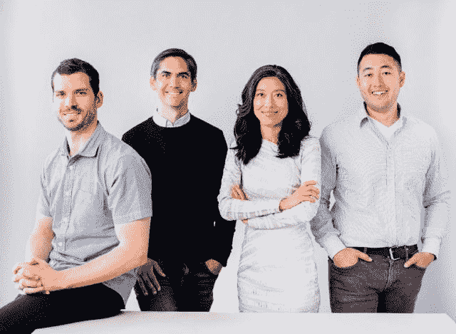

# 王峰十问第 24 期 | 计算机安全教母宋晓冬：畅聊区块链与隐私保护、深度学习、安全防护的关系（附音频）

> 原文：[`news.huoxing24.com/20180905144925929358.html`](https://news.huoxing24.com/20180905144925929358.html)

**对话时间**：9 月 5 日 21 点

**微信社群**：火星财经创始学习群

**对话嘉宾**：

**宋晓冬（Dawn Song）**：加州大学伯克利分校计算机系教授，Oasis Labs 创始人兼 CEO，被媒体誉为“计算机安全教母”。研究方向包括深度学习、机算机和网络安全、区块链等。曾获麦克阿瑟奖 (MacArthur Fellowship)，古根海姆奖(Guggenheim Fellowship)，斯隆研究奖 (Alfred P. Sloan Research Fellowship)，《麻省理工科技评论》“35 岁以下科技创新 35 人”奖 (TR-35 Award)等；是计算机安全领域中论文被引用次数最多的学者（AMiner Award)。

**王峰**：火星财经发起人，蓝港互动集团（HK.8267）创始人，极客帮创投合伙人，曾任金山软件高级副总裁。

**以下为对话原文整理**：

**王峰：**Hi，大家晚上好，久违了，欢迎回到火星财经“王峰十问”，今天是第二十四期。 快两个月不见了。哈哈。给大家介绍今晚的嘉宾：加州大学伯克利分校计算机系教授宋晓冬（Dawn Song）。她可是安全领域的资深大牛啊。

我们每个人都生活在信息大爆炸的时代。据福布斯报道，每一天，APP 和社交网络发送信息总计超过 600 亿条，电子邮件发送达到 2690 亿封，然而，信息数据的泄露、被盗用、被篡改等现象也屡屡发生，而且愈演愈烈。区块链技术不可篡改、分布式的特质，让我们有机会能掌控自己的数据隐私，但公开透明的账本，却让海量用户数据在链上曝光，隐私问题依旧如空中阁楼，没有得到根本解决。

我和宋教授第一次见面是在上周的火星硅谷区块链峰会上，我现场聆听了宋教授主持的“炉火对话”，后来又一起晚餐，只可惜时间都太紧张，没来得及和宋教授进行深度交流。

很荣幸今晚邀请宋教授参与火星财经的“王峰十问”。宋教授素有“计算机安全教母”的美誉，个人从业经历横跨网络安全、人工智能和区块链三个领域，相信今晚与宋教授的对话，一定能够给我们以更多启发和思考。下面，开始我们今天的“王峰十问”吧。

**第一问**

**王峰：**我的问题总是很长。哈哈。上周二，我们在火星硅谷区块链峰会见面，您和 Dfinity 联合创始人 Tom Ding、布比网络 CEO 蒋海一起参与的关于“公链与分布式金融”的炉火对话，令人印象深刻。我特别注意到，您和 Tom Ding 都是常驻硅谷的华人，当天出席活动的 DxChain 创始人张亮、QuarkChain 创始人周期、Celer Network 创始人董沫、Ultrain 联合创始人廖志宇等等嘉宾，也都是中国背景的硅谷创业者或在美留学的归国创业者。

火星硅谷区块链峰会“公链与分布式金融”炉火对话

然而，作为区块链鼻祖的比特币，其创始人中本聪的身份虽是未解之谜，但更大可能性来自美国、日本或者加拿大；以太坊创始人 Vitalik Buterin 和 EOS 创始人 Daniel Larimer 则分别来自俄罗斯和美国。这与目前新一代公链，国内创业者或者湾区华裔人士唱主角的现状大相径庭。

我隐隐感觉到，公链下一步竞争的入围者们大都来自华人。有硅谷的朋友告诉我，这一波区块链创业者，估计有超过一半以上是来自硅谷大公司的华人，这个比例远远高于互联网时代的硅谷华人从业者比重。您认为，龙的传人会成为下一轮公链竞争，乃至区块链行业的主导力量吗？随着区块链在国内及海外华人社区的大热，会不会从起步初期，华人在技术、产品和社区方面就更有优势呢？

**Dawn Song：**我从小在中国长大，1992 年到 1996 的时候在清华读物理。大学毕业之后去了美国读研究生， 之后做一名教计算机的教授。算起来，我在美国生活了 20 多年，期间亲眼看着中国发生了巨大的变化，像火箭一样快速发展。我觉得，很少有人能预见到中国今天的变化。

举个例子吧。我在美国读研的时候，包括计算机科学在内的顶级研究会议上，是很少找到中国人的论文的。但现在就完全不一样了，很多领域的顶级研究会议上，中国人的论文要占很大比例。在一些新兴和高精尖技术的部署方面，中国的发展也非常给力。

比如移动支付和人工智能在快速融入像人脸识别这样的实际应用中，中国这些方面的发展比美国和世界绝大多数地方都要快。现在新技术正在快速地改变国人生活。想想来真的很激动，这些例子只是缩影，背后是中国科学家、企业家、各行各业的从业者，乃至整个中国在短时间内所获得的惊人成就。

这些现象背后有很多原因。很多中国人既聪明又勤奋，在探索新方向和新领域方面又非常的“胆大包天”。另外，中国的竞争比世界其它地方更激烈，这让中国人反应更快，更容易适应环境，创造力更强。除此之外，中国还是世界最大的市场之一，这也为新技术的发展提供了巨大优势。我觉得上面这些原因也适用于区块链。我们现在已经看到了，很多区块链项目是由中国人领导的。不少中国公司和机构也在积极尝试不用方向的应用。如果一些创新应用最早出现在中国市场，我一点也不会觉得意外，我相信中国的人才将会成为区块链领域的核心玩家。另外，人们常常关注公链的竞争，但我觉得合作精神也很重要。通过合作，不同的团队和不同的办法才能集中在一起，探索这个领域，把区块链提升到一个新水平，同时催生新应用。

**王峰：** 我们在硅谷办区块链大会，很多人说怎么都是中国人的面孔，这和最初互联网兴起的时期气氛不太一样啊。

我们还记得，2000 年后，互联网很快陷入寒冬，原因是资本市场对互联网商业模式的不确定，虽然当初用户增长迅猛，但仍导致华尔街对互联网项目的抛售。互联网是经历了漫长的煎熬才看见了钱途，而中国公司后续的崛起，与电商、游戏等直接来钱的业务成长有关。区块链天生具备价值传递的属性，和历史上的互联网比起来，显然前者离钱更近。您认为，华人积极参与区块链创业与华人对财富渴求程度有无关系？这个问题，是不是有些冒昧。

**Dawn Song：**在我看来，中国人是实用主义和理想主义的完美结合体。而区块链能够吸引到中国人，一方面是因为探索新领域本身充满吸引力，另一方面是区块链令人遐想的未来前景和它的长远影响。

**第二问**

**王峰：**让我们回到今天的主题。数据泄露事件已经日益成为公众的热议话题。就在上周，华住旗下酒店被爆客户数据泄露，暗网标价 8 个比特币或 520 个门罗币，涉及 1.3 亿用户的个人身份信息及隐私开房记录；快递行业巨头顺丰也有超过 3 亿条数据疑似流出。加之今年 3 月 Facebook 5000 万名用户资料泄露，去年 11 月 Uber 被爆曾隐瞒 5700 万账户数据泄露等事件的发生，这个时代似乎已经毫无个人隐私可言。有哈佛大学学者甚至公开表示：个人隐私已死。您认为，区块链技术在解决隐私保护问题方面给我们带来了哪些新的希望？区块链能否让互联网环境下苦不堪言的个人隐私“死而复生”？ 

快递行业巨头顺丰有超过 3 亿条数据疑似流出

**Dawn Song：**首先，分布式账本是在分布的、互不信任的各方之间达成协议。区块链本身并不能为你提供隐私保障。比如在以太坊网络和绝大部分现有平台上，所有的数据和智能合约都是公开的，不存在隐私保障。但是，人们又希望能通过区块链部署涉及敏感数据的应用，例如医疗保健、金融服务、物联网等等。因此，在区块链上建立隐私保障技术来支持这些应用，就显得非常重要了。

**王峰：**隐私是一个自由人的权利和尊严。从人类抓起树叶遮羞之时起，隐私就产生了。以我的理解，保护好隐私，可以用来防止他人对自己说三道四，给自己一个绝对封闭的心里安全空间。有人用“化名”和“匿名”来解释，今天的区块链，更多解决了“化名”身份，而不是“匿名”身份。实际上，两者不完全一致。以比特币系统的交易为例，使用者无需使用真名，而是采用公钥哈希字符串作为交易标识，像一个化名，但由于用户会反复使用公钥哈希值，交易之间显然能建立关联，因此，即使是今天的比特币，也并不真的具备匿名性，实际上就没有隐私可言。

在我看来，隐私性正成为推动区块链下一波浪潮的关键因素。您在今年 4 月份发表的论文《Ekiden: A Platform for Confidentiality-Preserving, Trustworthy, and Performant Smart Contract Execution（Ekiden：一个保护隐私、可信赖且高效能的智能合约执行平台）》中，对 Ekiden 在保护隐私方面的技术架构进行了重点阐述。

论文截图

为什么您决定创办的 Oasis Labs 的时候，会把隐私保护放到如此重要的一个位置？您的团队在这方面有什么优势？您心目中完美的隐私保护环境是什么样的？能否举例并加以描述？

**Dawn Song：**我们和很多 DApp 开发团队聊天，发现大多数团队想开发的应用都需要处理敏感数据。他们很想有一种在能使用区块链平台时保护数据隐私的方法，比如构建分散式信用评分模型，分散式欺诈检测，基于区块链的基因组数据和物联网的数据市场，等等。所有这些应用程序都需要保护数据隐私。没有隐私保护，这些应用根本不可能实现。 现有的区块链平台无法提供这样的隐私保护功能。 我们看到了市场对于隐私保障区块链平台的需求，这也是 Oasis 项目受到业界及 DApp 开发者关注的一个主要原因。

我和团队在安全隐私领域工作过很长时间，我本人从事安全领域几十年。 在安全领域，我们积累了很多经验和专业知识，也开发了不少技术，包括已经在 Uber 应用的隐私保护数据分析技术。 除此之外，我们还写了第一篇使用安全硬件实现智能合约隐私保护的研究论文。 这些经验、知识和技术可以帮助我们构建一个以保护隐私作为主要目标之一的区块链平台。

隐私实际上是一个非常复杂的话题，许多人搞不清安全和隐私的概念，哪怕区块链行业老手也常常搞混。 为了帮助大家搞清楚区块链中安全和隐私的概念，我们写过一篇文章，大家可以点击了解一下。

[`docs.qq.com/doc/BqI21X2yZIht1Wep9b0lS2Bb4FPZzf36S9eQ0ceNId363cdp0IQmKC2Cjyb92CZuFD1HtHi61OoJba3VSYkP1`](https://docs.qq.com/doc/BqI21X2yZIht1Wep9b0lS2Bb4FPZzf36S9eQ0ceNId363cdp0IQmKC2Cjyb92CZuFD1HtHi61OoJba3VSYkP1)

文章截图

为了最好的解决隐私保护的个种挑战，我们集成了各种隐私保护的技术， 包括安全硬件、加密算法、 叉分隐私等。

**第三问**

**王峰：**我认为目前的公链已经是一个拥挤不堪的赛道了。2018 年被许多人称作“公链元年”，可能有 30 多条公链在今年内主网上线，和早已主网上线的热门公链项目 ETH、EOS、NEO、QTUM、TRON 等展开同台竞技，激烈程度丝毫不亚于还在硝烟弥漫的数字货币交易所大战。

教授您创办的 Oasis Labs 希望通过打造一个高性能的区块链平台，同时它还能提供完整的隐私保护，甚至提出在区块链上实现诸如人工智能等计算密集型应用的目标，对投资者来说，自然充满想象力。

Oasis Labs 创始团队

实际上，很多业内同业者都试图去同时解决去中心化、安全和效率问题，以突破所谓的“不可能三角”，但是这是非常困难的。当然，进一步拆分，安全里还有一层独立的“隐私”问题。不如我们把问题简单化，一步一步来，您认为，眼下最需要优先解决的是什么问题，安全性？隐私性？可扩展性？

**Dawn Song：**隐私保护和可扩展性是目前区块链需要解决的两个最重要的问题。 对于可扩展性，我觉得人们需要意识到，它不仅仅是指具备较高的 TPS。 为了支持区块链在医疗保健、金融服务等领域得到实际应用，区块链平台还必须为复杂的智能合约提供可扩展性。

**王峰：**很多新进入或者准备进入市场的公链，目标是取代以太坊，有人把他们包装成为所谓的区块链 3.0。可是我发现，大量项目往往是基于以太坊的 ERC20 标准和 EVM（以太坊虚拟机）开发，却大谈要超过以太坊，这不由让我想到，许多安卓上的 ROM（或 UI）都基于安卓原生系统的开发，谷歌每次升级都影响它们的版本迭代，但这些基于安卓系统的 ROM（或 UI）很难超越安卓本身。而在当前，无论是从应用落地还是生态建设，还没有出现能撼动以太坊位置的公链，您认为其中核心的原因是什么？目前公链之争的关键要素是什么？

公链想取代以太坊的现象类似于“定制安卓和谷歌原生安卓的博弈”

**Dawn Song：**以太坊网络是第一个建立智能合约的区块链平台，运营了不少年，社区也很活跃。 现在市场上的区块链平台越来越多，DApp 开发者有了更多选择，需要评估哪些方案更适合自己的应用。 就像不同的计算机语言支持不同类型的程序应用一样，未来我认为我们也会看到不同的区块链平台支持不同类型的 DApp。比如需要不同功能、信任假设、权衡机制、可用性设计选择的 DApp，可以运行在与之对应的区块链平台上。

**王峰：**众所周知，以太坊目前遭遇了很多争议，Vitalik 在尝试通过 Sharding 分片提高效率，通过零知识证明提供隐私保护，全力改进和优化以太坊。而据 BTCmanager 最新消息，以太坊团队日前又宣布将推迟 Casper 开发一年，这个消息并没有被官方确认，但市场迅速做出跳水反应，ETH 下跌 10%。您本人是否还看好以太坊？如果您给以太坊把脉，会给以太坊开什么药方？

**Dawn Song：**以太坊网络是第一个建立智能合约的区块链平台，并拥有一个活跃的社区。 我认为我们都从以太坊可以学到很多如何建立一个成功社区的经验。当然，在开发区块链平台的治理结构，集中/分散的程度以及在系统中进行变更和新开发的容易性和速度方面都有很多取舍。

**王峰：**对于通用型公链的生态布局和未来发展机会，您是如何构想的？与通用型公链相对应，定制型公链也被很多人看好。因为不同的业务场景对底层公链的性能、共识机制等有不同的要求，搭建个性化的定制型公链成为一些行业和应用的迫切需求。在接下来的竞争中，你更看好通用型公链，还是定制型公链？未来公链市场上，是会出现百链千链共存，还是一两个赢家通吃的局面？

**Dawn Song：**正如我前面说过的，我觉得未来会看到不同的区块链平台应用于不同类型 DApp，就像不同类型的计算机语言适合不同类型的应用程序。

**第四问**

**王峰：**万向区块链董事长肖风博士在最近提出，一个公链的货币价值，就看 DApp 能够创造出来的经济价值总量，未来有可能出现 1 万亿甚至 5 万亿美元价值的公链。您认为公链被业内人士看高估值背后的原因是什么？您能够给我们描述，一个完美的公链以及其生态，究竟会美好到什么样子？苹果公司目前的最新市值也才刚刚突破 1 万亿美元。

今日苹果市值快照

**Dawn Song：**说实话，我认为人们并不了解如何评估区块链平台的价值。 这是一个全新的等待开发的科学领域。 在互联网的发展史上，人们花了一定的时间来制定评估指标，例如日活跃用户数量等。我认为确定如何评估一个区块链平台的价值，背后需要进行大量研究，特别是当我们看到新的商业模式涌现在区块链中的时候。

**王峰：**今年 7 月 9 日，Oasis Labs 宣布完成 4500 万美元的融资，投资方基本上囊括了市场上最主要的区块链投资机构。从今年一季度后，整个区块链的二级市场陷入熊市，最近 2 个月更进一步加剧，有悲观者认为可能会进一步持续到整个明年。市场的整体情况是否会影响到 Oasis Labs 后续的融资估值？

**Dawn Song：**我们专注于构建技术、构建底层区块链平台，以及新技术因应用而产生的长期价值。 所以我们并不太关注市场的短期起伏。

**第五问**

**王峰：**鉴于新一代公链项目的研发所采用的技术手段越来越相似，有人认为，2019 年公链的竞争技术因素将只有 30%，70%将取决于 BD 和运营。过往经历看，您的两次创业也都是偏技术型的公司，好像并不依赖于这两方面的建设。不知在区块链社区及 BD 方面你是否有所布局，或者说找到合适的帮手？

技术手段越来越相似的看法，您同意吗?

**Dawn Song：**我们是一支非常技术化的团队，但我们也一直在招 BD 和社区运营的伙伴。我们充分认识到社群生态的重要性，尤其是我们希望在平台上构建不同种类的新应用，也帮助不同行业进行转变。所以，我们一直都在招聘 BD 和社区运营团队。两个月前，我们刚刚开始对外启动，目前已经有很多开发人员对 Oasis 平台很感兴趣， 要在 Oasis 平台上建应用。 我们正在积极与应用开发人员建立合作关系，一起创建区块链生态。

**王峰：**在我的印象里，Oasis Labs 沟通半径更多是在海外区块链及学术圈，在中国市场，通常意义的认知度是不够的，只是在顶尖投资人圈子中有认知，中文的社区运营方面几乎没有开始，甚至找不到中文的网站。你怎么看中国的市场，未来在中国有多大的期望？

Oasis Labs 官网，无中文切换

**Dawn Song：**我们大约在两个月前才对外启动。而且我们一直专注于构建底层链技术，和 DApp 开发者一起打造应用。 就像我前面提到的，我坚信中国会成为全球区块链的主要角色。 所以我们非常期待与国内社区密切合作。

**第六问**

**王峰：**根据 CB Insights 统计数据，2017 年，全球范围内有 152 亿美元的投资，被投入到 AI 领域，比 2016 年增加 141%；根据零壹智库数据显示，2017 年全球与区块链+数字货币领域融资相关事件达 63 笔，融资金额 49 亿元。而今年第一季度，区块链领域融资额就已高达 67.2 亿元，超过去年全年的融资额。我注意到很多侧重 AI 的基金转向区块链，比如另外一位学者张首晟创办的丹华基金。而百度 ALL IN 人工智能的灵魂人物陆奇，在离开百度后也提出，人工智能的数据获取与开发需要与区块链结合。是不是可以理解为，越来越多的 AI 的创业者和投资者们会把关注点转移到与区块链的结合上？

2017 年全球与区块链+数字货币领域融资相关事件达 63 笔，融资金额 49 亿元

**Dawn Song：**对人工智能和区块链交叉领域感兴趣，并且在两个领域都有丰富经验的人其实非常少。 我偶尔遇到其他同时做过 AI 和区块链的人时，总是很激动。我们需要更多这样的人才 。

**王峰：**一些学者和投资机构不愿涉足和提及区块链。您在深度学习、AI 的部署和发展应用等领域有很深的研究，您之前一直围绕 AI 探索新技术的发展，如今将重点放在了智能合约的区块链项目。在您看来区块链会对 AI 产生什么影响？AI 可以解决区块链目前存在的哪些难题？两者是如何相互赋能的？“AI+区块链”首先落地的应用场景会是哪些？

**Dawn Song：**除了区块链和计算机安全，我还做过很多人工智能和深度学习方面的研究。 我觉得人工智能和区块链的交叉领域非常有趣，而且非常重要，里面有很多有意思的问题和新的方向值得探索。

举个例子，现在在 Oasis 平台上，有一些 DApp 开发人员（包括与斯坦福医生合作）开发一款可有效保护个人隐私的医疗数据交易应用。众所周知，由于医疗数据本身十分敏感，这类信息往往十分孤立，医学研究人员很难获得足够的数据用于科研工作。

利用 Oasis 平台提供的隐私保护智能合约功能，医学研究人员可以编写含有训练机器学习模型代码的智能合约。智能合约还可以设置使用条款，限制全部数据仅能用于在这个智能合约中训练机器学习模型，而不会用于其他场景。它还可以规定用户如何通过向智能合约提供数据获得报酬。用户同意智能合约的使用条款后，便向智能合约提供数据。当智能合约收集到足够的数据时，它便可以开始训练机器学习模型。医学研究人员可以在此基础上评估模型的有效性。

Oasis 平台一方面可以支持智能合约 确保用户数据的隐私得到保护，另一方面利用采得的数据训练机器学习模型。正如我们所看到的，这种方式在很大程度上减小了医学研究人员和制药公司获取医疗数据的难度，进而帮助训练机器学习模型，找到治疗疾病的方法。用户可以通过提供数据获得报酬，在数据隐私得到保障的同时，又为社会医疗进步做出了贡献。这只是区块链帮助解决深度学习获取数据困难的一个例子。 相同的技术可以应用于许多其他领域，例如，在不同数据源之间搭建合作桥梁，建立信用评分模型、在欺诈检测中训练更好的机器学习模型等。

此外，我希望区块链技术可以帮助 AI 技术民主化。 随着人工智能变得越来越强大，我们需要考虑是谁控制了人工智能的力量。 我认为，对于个人用户而言，能够控制 AI 的功能非常重要，这样 AI 才能按照用户的最佳利益行事。 这与现有 AI 的工作方式截然不同。 我希望，通过使智能合约拥有机器学习功能，实现满足用户的最佳利益的智能合约和 AI agent。

**第七问**

**王峰：**在我看来，鉴于区块链技术将前所未有地推动金融革命，安全之于区块链产业的重要程度，将百倍于互联网时代。目前，区块链在智能合约漏洞、节点网络漏洞、生态（交易所、钱包）及使用者安全等方面的安全隐患尤为突出。8 月，腾讯发布《2018 上半年区块链安全报告》，2018 年上半年区块链领域因安全问题损失超过 27 亿美元。

基于区块链加密数字货币引发的安全问题造成 27 亿美元损失

其中，智能合约漏洞，主要是集中在以太坊上，比如因为代码的漏洞或者私钥的泄露等原因导致的资金损失，达到了 12.4 亿美金。智能合约的漏洞究竟给区块链安全带来了什么样的新挑战？我们应该如何应对？

Dawn Song：智能合约的本质是代码。 代码漏洞并不是智能合约独有的问题，而是所有程序都会遇到的问题。 代码漏洞是导致计算机系统被攻击的最主要成因之一。 在我过去的工作中，我的小组一直在设计和开发新的技术和工具来自动查找代码中的漏洞，包括二进制程序，Web 应用程序和移动应用程序。 我的第一个创业公司是构建查找移动应用程序中的漏洞和恶意行为的自动化工具。 在智能合约中，这些漏洞的影响更直接 - 你可能会损失很多钱。

几十年来，业界（包括我的团队）在计算机安全和程序验证方面，一直致力于构建查找代码漏洞并提供代码安全性证明的技术和工具。 这些技术和工具在智能合约中当然也很有用。此外，编程语言对编写安全代码以及验证代码安全性的难易程度也有很大影响。 我们可以改进智能合约的语言设计，以帮助应用开发者更轻松地编写更安全的代码。

许多经过正式验证的系统开发采用的另一种方法是进行代码验证的协同设计/开发和验证。 在编写代码时，开发者可以同时进行验证。 进行代码安全性和正确性证明的过程有助于开发安全的代码。

**王峰：**很多人开始关注可信赖硬件。不过，最近来自比利时、美国和澳大利亚的两个技术团队同时发现了 SGX（Software Guard Extensions，Intel 开发的一项旨在保障用户关键代码和数据机密性和完整性的技术）的一个安全漏洞。

美国政府的计算机应急准备小组在 8 月 14 日警告称，攻击者可能利用该漏洞可以获取一个内存芯片内的任意信息，包括敏感数据、通往长期内存的密码和密钥，攻击者还可以将敏感数据在一个安全飞地复制并获取。有观点认为，SGX 技术达到很高的安全水准，可能需要耗费数年时间。所以，依赖单一硬件的隐私保护是否可靠？同时，TEE（Trusted Execution Environment，可信执行环境）的原理是私钥保存在芯片生产商处，比如 SGX 就是私钥由 Intel 负责，所以芯片生产商就成为了一个中心化的节点，这似乎又与区块链的去中心化理念有悖？

**Dawn Song：**考虑到其强大的安全属性，TEE（或安全硬件）可以成为构建安全系统的基石。 TEE 使构建安全系统变得更加容易。 但是，我们需要一个值得信赖的 TEE。 目前市面上的的解决方案是闭源开发。 因而业界很难分析评估其安全性。 在我们最近的博客文章中，我们指出了现有闭源安全硬件的不足，并强调了开源安全硬件的重要性。

[`docs.qq.com/doc/BqI21X2yZIht1Wep9b0lS2Bb4FPZzf36S9eQ0SCC0i3u4FED0IQmKC2Cjyb92LwuOh0jS5Zm076rIU1YSUA10`](https://docs.qq.com/doc/BqI21X2yZIht1Wep9b0lS2Bb4FPZzf36S9eQ0SCC0i3u4FED0IQmKC2Cjyb92LwuOh0jS5Zm076rIU1YSUA10)

Keystone 是我们一直在与加州大学伯克利分校和麻省理工学院合作研发的一个项目，一个建立开源 TEE （secure enclave) 的项目：项目：[`keystone-enclave.org/`](https://keystone-enclave.org/)。Ke/。Keystone 基于 RISC-V 中的现有硬件功能开发 TEE。 RISC-V 是早期在加州大学伯克利分校开发的一种开源 RISC 架构，已广泛应用于行业。

我们最近举办了第一次关于开源安全硬件的研讨会：

[`keystone-enclave.org/workshop-website-2018/`](https://keystone-enclave.org/workshop-website-2018/)。很高兴看到整个业界的支持。 来自谷歌、Facebook、微软、Intel，ARM、加州大学伯克利分校、麻省理工学院、斯坦福大学和其他许多地方的知名研究人员和专家都参与了研讨会，交流了最先进的技术，现有的挑战以及如何建立开源安全硬件的方针。

我们正在与产业型合作伙伴一起构建和部署开源安全硬件。 许多区块链公司也联系了我们表示支持，并表示希望加入这项工作。 我们非常感谢业界对此给予的支持，并期待共同努力，实现这一目标。

**王峰：**我非常理解您在 Keystone 方向上的战略意图，最近有海外媒体报道说，Oasis labs 大约在两周前决定调整隐私保护的技术路线，已经放弃基于 SGX 以及其他 TEE，您需要在这里澄清一下吗？很多业界同仁也非常关心您的项目进展。

**Dawn Song：**感谢业界同仁对我们的关注和支持！我来给大家讲解一下我们的设计和思考。

在我们从一开始设计 Oasis 区块链平台时，就希望确保区块链平台的健全性（Intergrity）和可扩展性并不依赖于任何安全硬件（TEE）。 Oasis 区块链平台采用分层设计，具有分立运作的的共识层，存储层和计算层。这种分层设计允许每个层独立扩展，可实现更大的可扩展性，尤其是对于复杂的智能合约执行。共识层不使用安全硬件。为了实现隐私保护，一些计算层的节点可以使用安全硬件。 Oasis 区块链平台旨在提供统一的安全计算框架，包括安全硬件和加密技术，如安全的多方计算和零知证明。这种统一的安全计算框架为开发人员提供了更多的选择和灵活性。开发人员无需成为隐私专家，便可以利用最先进的安全计算技术，并选择使用最适合其应用的技术。

我不知道您在哪里看到的报道。我们没有改变我们的设计。

**第八问**

**王峰：**在去年底举行的亚太以太坊技术交流会上，Vitalik Buterin 发表了主题为“以太坊区块链中的隐私保护”演讲，介绍了四种适用于以太坊区块链的兼顾隐私性和安全性的解决方案：通道（Channels）、混合器（Mixers）、环签名（Ring Signature）及零知识证明(Zero knowledge proofs)。他特别提到，零知识证明是“最为强大”的解决方案，能够被应用于以太坊区块链上几乎所有的场景。

这里，再科普一下零知识证明，即证明者能够在不向验证者提供任何有用的信息的情况下，使验证者相信某个论断是正确的。历史上有一个故事可以帮我们理解，文艺复兴时期，意大利有两位数学家为竞争一元三次方程求根公式发现者的桂冠，就采用了零知识证明的方法。当时，数学家塔尔塔里雅和菲奥都宣称自己掌握了这个求根公式，为了证明自己没有说谎，又不把公式的具体内容公布出来，他们约定双方各出 30 个一元三次方程给对方解，谁能全部解出，就说明谁掌握了这个公式。比赛结果显示，塔尔塔里雅解出了菲奥出的全部 30 个方程，而菲奥一个也解不出。于是，人们相信塔尔塔里雅是一元三次方程求根公式的真正发现者。

对于 V 神推崇有加的“零知识证明”，您如何评价它在保护诸如以太坊网络等区块链网络隐私性和安全性的作用？目前，市面上已经有 Zcash、Monero 等项目，通过零知识证明技术，在探索解决交易中相关信息的隐私安全问题。从应用实践的效果看，零知识证明还有哪些不足和改进之处？

V 神介绍零知识证明

**Dawn Song：**零知识证明是密码学中一个很迷人的领域，它具有悠久的历史。 我之前也在这个领域做过研究工作。 但是，零知识证明具有很高的性能开销，因此很难应用于复杂的现实应用。此外，零知识证明通常在计算个人私人数据时使用。 如果您需要计算来自不同数据源的数据，例如我之前提到的用于隐私保护机器学习的智能合约，仅凭零知识证明，并不足以支持此类使用例子。

**第九问**

**王峰：**我们知道，硅谷盛行学生创业，可以说，没有在车库里的学生创业者，就没有今天的硅谷奇迹。硅谷的创业明星中，从早期的乔布斯（苹果）、拉里·佩奇和谢尔盖·布林（谷歌），到近几年的扎克伯格（Facebook）、马斯克（特斯拉）、杰克·多西（Twitter）等人，大多数是在校期间就开始创业，甚至辍学创业。我感觉，硅谷创业正事儿与教授没什么关系。而您不但一直任教于卡内基·梅隆大学、加州大学伯克利分校等顶尖学府，在学术界颇有成就，广受尊重；同时，还是连续创业者，先后创立了 Ensighta Security（后被 FireEye Inc.收购）和 Menlo Security 两家安全公司，一面在常青藤任教搞研究，另一面和学生们一样去创业，怎样做到两者兼顾的？@Dawn Song 也是连续创业者，和群里很多人一样。

**Dawn Song：**我喜欢在科研中寻找新的想法和技术，我也非常希望看到这些新想法和新技术能够在日常生活场景中落地实现，从而更好地服务于人们的生活。 在现实世界中部署研究技术的过程中，也有助于我们从实际案例中学习新知识，从而更好地改进技术，帮助人们解决社会发展中遇到的更多问题。

**王峰：**当时创立第一家公司 Ensighta Security，您是受到了怎样的感召？可否谈谈创立 Ensighta Security 和 Menlo Security 这两家公司的经历？有没有经历过艰难的至暗时刻？有科技媒体把您称作互联网安全教母，您认为对互联网安全的最大贡献是什么？这些互联网安全领域的经历，对于现在创办 Oasis Labs 有什么帮助？

**Dawn Song：**Ensighta Security 专注于构建分析移动应用程序的技。这是用来检测漏洞和恶意攻击行为的自动化技术和工具。 Menlo Security 旨在构建安全浏览的新技术，以保护用户的计算机免受 web 的攻击。 两家初创公司都是基于我实验室开发的新技术上而成立的。

我从事计算机安全工作已有 20 多年，并在许多领域都开发了新的解决方案和最先进的技术。 由于时间限制，我在这里无法详细说明。 这些经验在 Oasis Labs 技术构建上起了很大的作用。

**王峰：**这次创办 Oasis Labs，您会有不安全感吗？它和您过往的两次创业有什么不同？ 

Dawn Song：我认为构建区块链平台是一个更复杂、更具挑战性的项目。 研发有价值的技术只是难题的一部分; 如何构建生态系统，也是很值得学习和研究的。我是一个很喜欢新的挑战的人。我觉得新的挑战是让人进步的最有效的方式。

**第十问**

**王峰：**根据最近 Coinbase 与 Qriously 的研究报告，全球前 50 名的大学中，42%的大学现在至少提供一门关于加密技术或区块链的课程。在中国国内，目前清华大学、同济大学、中央财经大学、北京邮电大学等近 10 所高校也已经开设了区块链课程。2014 年，当纽约大学斯特恩商学院首次开设区块链和金融服务课程时，有 35 名学生报名，比该校通常的选修课少了 8 名；而到了 2018 年春天，选修学生人数攀升至 230 人，学院被迫将该课程搬至最大的礼堂上课。您认为学生们对区块链课程普遍感兴趣的原因有哪些？您任教的卡内基·梅隆大学、加州大学伯克利分校开设区块链的课程进展如何？ 

全球高校开设区块链课程（截止 18 年 5 月）

**Dawn Song：**上学期，我在伯克利给学生们上了一节非常有趣的区块链课程。 在学术界，以这种形式上课可能是第一次。 它由三所学院共同教授：商学院、法学院、以及由我代表的工程学院的计算机科学系。 班上的学生名额也是这三所学院平均分配。 这堂课非常受欢迎。 报名上这节课的学生人数远远超过了课程原定接收的人数。 区块链本质上就是跨学科的，涉及科学，商业，经济，法律和许多其他领域。对我来说， 教授这样一门跨学科课程，并与来自不同学院的学生进行互动是非常有意思的。

这个学期，我们为计算机科学专业的学生提供了一节区块链和加密经济学的全新高阶课程。该课程涵盖了区块链不同方面的核心知识和最前沿的技术。

**王峰：**我注意到，尽管早在 2014 年就有大学开设了区块链课程，但直到 2018 年，都鲜有高校设立专门的本科区块链专业。相对于经济学科领域有金融学、金融工程等专业，计算机相关有电子工程和软件工程等专业，甚至有电子商务和网络游戏专业，区块链领域横跨了密码学、经济学以及软件工程等领域，已经非常复杂了，今天的大学是否应该开设区块链相关专业了？

**Dawn Song：**区块链领域仍处于初期阶段。 随着它的发展，更多的学生会想要学习这个领域。区块链对于学生来讲无疑是一个非常充实的学习方向。

**王峰：**和教授对话，就是学习，所以今天也是我的九月新学期第一课。各位都是新学生了。哈哈哈。这是最后一问，你可以多说说，我们多学学。

**Dawn Song：**我们这学期的课室没有录像设备。学生自己提出要给课程录像，可见学生对课题的兴趣。

我最后也可以给大家讲一讲我们更长远的想法。我们在进入数字时代，这里一个最重要的问题是要确立数字产权，这不但是区块链、也是整个数字经济下一步能够成功的经济基础，这个问题解决了，世界会完全不同，而现在世界在技术上与社会层面都还没有成型。我们在 OASIS 在做这方面的探索，希望能和大家共同做出突破性、独创性的贡献。我们希望世界一流的人才能加入我们，一起从这里为人类做出特有的贡献！谢谢大家！

**王峰：**如果将隐私保护作为区块链发展历程中的一次深刻的革命，那么，这场革命现在才刚刚开始，每一位从业者们任重道远，仍需努力。希望我们能更加重视隐私保护，更加重视其价值，理解区块链发展中必然需要克服的困难与把握的机会。也希望 Oasis Labs 能够更好地实现在安全性、隐私性和可扩展性方面的突破，给整个行业带来更多希望，在区块链沙漠中搭建起新的“绿洲”。

再次谢谢宋教授，感谢您今天能做客火星财经的“王峰十问”，祝 Oasis labs 未来越来越好！谢谢大家！

**Dawn Song：**非常感谢大家！

本文为火星财经原创稿件，版权归作者所有，未经授权不得转载，转载须在文章标题后注明“文章来源：火星财经（微信：hxcj24h）”，若违规转载，火星财经有权追究法律责任。