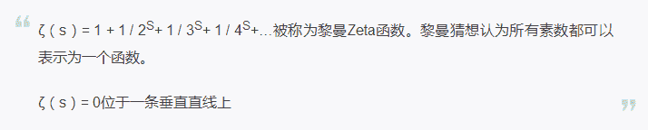

# 王峰十问第 25 期 | PoS 共识机制发明人 Sunny King：稳定币的影响被外界过度夸大（中英）

> 原文：[`news.huoxing24.com/20180920151036119799.html`](https://news.huoxing24.com/20180920151036119799.html)

**** 

**对话时间**：9 月 20 日 22 点

**微信社群**：火星财经创始学习群

**对话嘉宾**：Mars Finance Global Family

**Sunny King**：PoS 机制发明人，被 V 神称为“唯一一个最具原创精神的数字货币开发者”

**王峰**：火星财经发起人，蓝港互动集团（HK.8267）创始人，极客帮创投合伙人，曾任金山软件高级副总裁。

**以下为对话原文整理**：

**王峰：**Hi，大家晚上好，欢迎来到火星财经“王峰十问”第二十五期。

Fred Wang:Hi，Good evening everyone，niceI am Fred.welcome to the 25th episode of Ten Questions with Fred Wang. also welcome SunnyKing

**王峰：**给大家介绍今晚的神秘嘉宾：PoS 共识机制发明人 Sunny King。关于他的公开照片，只能找到这一张，但与中本聪有些不同，我确定他确实存在，比如他能来到今天“王峰十问”的现场。

Let me introduce our Mystery Guest tonight, the creator of PoS consensus mechanism, Sunny King. About his public photos, I can only find this one. But unlike Satoshi Nakamoto, I am sure he does exist. For instance, he came to today's "Ten questions with Fred Wang".

先来看看 Sunny King 的个人经历：2011 年，成立比特币研究小组，研究比特币替代技术；2012 年，首次提出了 PoS 概念，并发布点点币（PeerCoin），成为第一个通过 PoS 机制来实现区块链共识算法的加密数字货币；2013 年，发布质数币（Primecoin），旨在通过计算去发掘由大量质数组成的质数链；2014 年，点点币全球排名第三，仅次于比特币和莱特币。2016 年底，Sunny King 最后一次在比特币论坛更新，自此消失。2018 年 1 月 24 日，隐匿 1 年后的 Sunny King 作为创始人，正式宣布推出 VEE 区块链开发平台，并担任首席架构师。

First, let’s take a look at Sunny’s personal experience.In 2011, he established a bitcoin research team with a focus on alternative bitcoin technology; In 2012, he came up with the concept of PoS for the first time and released Peercoin, the first crypto currency whose consensus algorithm was achieved by PoS mechanism; in 2013, he launched a second crypto product——Primecoin in the hope of identifying prime chain consisting of large quantities of primes by computation. In 2014, Primecoin reached the third place in the world on the basis of market cap, second only to Bitcoin and Litecoin. In late 2016, Sunny King updated blogs in the Bitcoin Forum for the last time before disappearing. After being off the radar for one year, Sunny King announced the blockchain development platform——VEE On January, 24, 2018, in which he acted as its founder and chief architect.

作为加密数字货币领域元老级开发者，同中本聪一样，Sunny King 是这个行业里“隐藏在面具之后”另一位重磅神秘人物。快两年杳无音讯后，今年他能重返江湖，这让很多人翘首以待，我的很多投资界和媒体界的同行都在找他。

As a senior developer in the world of crypto currency, Sunny King, like Satoshi himself, is another mysterious and influential person behind his mask. It's been nearly two years since your last disappearance. Now Sunny are back, which excited many people, since a lot of my friends from investment and media industry are looking for him.

共识机制就是区块链的灵魂，它就像一个国家的法律，维系着区块链世界的正常运作。这期“王峰十问”的主题是“PoS 为什么？”，Sunny 发明的 PoS 共识机制，已经成为区块链最主流的共识机制之一，至今还对整个行业产生着深刻影响。

Consensus mechanism is like the soul of blockchain and plays the role of laws in a country to keep the system functional. The PoS Sunny created has become one of the most popular consensus mechanisms in the blockchain community and still has a profound influence on the whole industry.

很荣幸今晚邀请 Sunny King 参与火星财经的“王峰十问”。我和 Sunny 从未谋面，今天也是我俩第一次进行线上互动交流。期待今晚的对话，能够更真实地还原 Sunny King，让更多人了解神秘面具背后的他。

It’s an honor to have Sunny King with us. We’ve never met before, so this is the first time we interact and communicate online with each other. I expect our dialogue will show a more real version of Sunny and Let more people know about him behind the mysterious mask.

下面，开始我们今天的“王峰十问”吧。

Now, let’s get started. 

**第一问**

**王峰：**在区块链领域，您有一个响当当的个人标签：PoS 机制发明人（Prove of Stake，股权证明机制）。PoS 最早由您在 2012 年提出，并在 Peercoin 项目实现了“首秀”，引起业内极大关注。当时《比特币杂志》的一位撰稿人评价您是“唯一一个最具原创精神的数字货币开发者”，这位撰稿人就是刚满 18 岁的太坊创始人 Vitalik，一年以后，他的以太坊白皮书问世。

In the field of Blockchain, you are famous for being called the creator of POS, the Prove of Stake which was first brought forward by you in 2012 and made its debut through the Peercoin program, causing wide attention in the industry.  An editor with the Bitcoin Magazine called you the only digital currency developer with the most original spirit. This editor was Vitalik Buterin, the young founder of Ethereum the white paper of which was published one year later.

6 年过去，今天区块链的从业者已经对 PoS 机制有了普遍了解。今天，您能否借助“王峰十问”，用更加通俗的语言，亲自向我们解释一下 PoS 机制的工作原理吗？中本聪开启了分布式加密账本的世界，Vitalik 以智能合约让区块链不断生枝发芽。在我看来，您则是区块链世界的制度设计者：看到了 POW 共识机制的不完善，寻求改革或革命。那么，是什么启发了您提出 PoS 机制？

Six years later, blockchain professionals now have commanded a general knowledge of PoS. On Ten Questions with Fred Wang today，would you mind explaining the mechanism of PoS in a simpler way for us? Satoshi Nakamoto opened a world of distributed ledger, while Buterin branched off and grew blockchain through smart contracts. As far as I am concerned, you are the designer of the rules applied to Blockchain space. Seeing PoW being defective made you sought reform or revolution. So, what inspired you to come up with the PoS mechanism?  

**Sunny King：**通俗地说，一个弱中心化的共识系统需要一个可靠的机制来决定赋予某一个参与者的决策决定权多大权重。最朴素的做法是给每一个参与者完全相同的权重，就像现实生活中的民主选举，但是一旦我们考虑到互联网是一个开放并且匿名的系统，这样的系统很容易被一些伪造的账号/ID 破坏。这就像是一些赝品，对于其他所有真诚的参与者都是非常不公平的。

OK, in easy to understand terms, a distributed consensus system needs to have a reliable mechanism to determine how much weight to give to a certain participant for the decision making power.the naive way is to give everyone equal weight, like in a democratic election,but once you consider an open system and the anonymous nature on the Internet, such system can be easily sabotaged through the faking of a lot of identities.This resembles counterfeiting, which is unfair to all the other honest participants. 

PoW 机制是第一个提供了合理评估方式的系统，在这个系统中，一个参与者所获得的权重和它所提供的特定的计算成正比。这种计算可以非常简单地被每一个参与者验证和评估，也被称为“可证明的工作”，使用这种方式参与者可以简单地向每一个人证明具体的工作量是多少。这种计算在实际操作中也可以扩展以进行任意大量级的计算。

PoW Consensus was the first system to give a reliable measure, so one’s weight is proportional to a certain computation one did. This certain computation can be verified and measured easily by everyone, thus called ‘provable work’, in that you can easily prove to everyone else how much the work was. The computation can also practically scale to take arbitrarily large amount of computation.

对比 PoW, PoS 共识提倡使用系统内的一个价值代币来度量应该赋予某个参与者决策权的权重值。因此，一个参与者所拥有的代币数量，也叫作权益，可以向其他参与者证明自己实际的贡献量。一旦系统开始运行，就不可能任意创建或者使用快捷方式代币。代币的创建还必须遵循一个被称为协议的预设规则，就像比特币协议如何调节比特币的创建一样。

In comparison, PoS Consensus advocates using a value token inside the system as the proportional measure of weight assigned to a participant’s decision making power. So the amount of the token owned, called stake, proves to everyone else one’s serious contribution. The token cannot be created arbitrarily or with shortcut, once the system begins operation. The creation of the token must also follow a pre-set rules called protocol just like how Bitcoin protocol regulates the creation of bitcoin. 

**王峰：**与中本聪发明的另一大主流共识机制 PoW（Proof of Work，工作量证明）相比，PoS 在一定程度上缩短了共识的达成时间，也不再需要消耗大量能源挖矿，而且更难进行 51%攻击。但是，PoS 机制也有一些问题，比如它容易出现双重支付攻击。早期持币者可能会成为后来者参与的障碍，极端者则可能出现严重的“贫富差距”和依附其上的过度中心化。

OK., Compared with PoW, the other popular consensus mechanism, PoS shortens the time needed to reach a consensus, also lessens energy consumed to mine and increases the difficulty to conduct a 51% attack. However, PoS also has its own problems. For example, in a PoS-based blockchain system, double-spending becomes easier. Initial coin owners may cause obstacles for later participants, and in some extreme cases, wealth gap and over-centralization may occur.

毫无疑问，在今天，PoS 已经与 PoW 一起，成为整个区块链领域共识机制的两大基石。当然了，二者孰优孰劣的争论也一直不断，我不确定是否已经有了定论。但我想起了丘吉尔的一句话：民主是最坏的制度，但也是现在所能找到的最好的制度。我们辩证地来看，也许没有最好，存在即是合理，差异既是存在，能否谈谈您在 PoS 机制设计上的取和舍？ 

On one hand, there is no doubt that both PoS and PoW have become the foundation of consensus mechanisms in the field of blockchain. On the other hand, the argument over which one is superior is constant, and I don’t know if there was any conclusion drawn. This reminds me of a phrase by Churchill, “Democracy is the worst form of government, except for all the others.” From the dialectical perspective, existence is reasonable and difference is existence. Could you please tell us your trade-offs when designing the PoS mechanism?

目前为止，每一种共识机制都可以在人类社会文明中现存治理制度找到对应源头。比如 PoW，可以理解为马克思提出的理想社会主义的按劳分配制度；PoS 很接近现代资本主义社会的公司股权治理；在这两大治理机制之上层出不穷的共识机制里，我们也陆续能看到英国的议会制、美国联邦制、欧盟的邦联制以及中国的人民代表大会制度的影子。我不知道，您怎样看待这些现象？

So far, every consensus mechanism can be traced from the governance system of existing human society. For instance, PoW can be understood as law of distribution according to work in a socialist system, while PoS is more like equity governance found in capitalism society. From the endless consensus mechanisms originated from PoW and PoS, we can see the reflections of our current government systems in the real world, such as the Parliamentary system in Great Britain, the Federation system in the US, the Confederation in EU and China's NPC system. How do you explain this phenomenon?

似乎可以肯定的是，每一种治理机制都会有天生缺陷，数千年来，我们在解决技术和工程上的能力日新月异，但是在制度和规则设计上，似乎只有虚拟网络游戏的社群管理在做举步维艰的创新尝试。有人说，人类的智慧进步不大，你是否认可这样的观点？

It’s almost certain that every type of government has flaws. For thousands of years, we have made great progress in terms of technology and engineering, but when it comes to creating rules and regulations, our innovative effort could only seen in the virtual internet games community management. Some people say the wisdom of mankind has not made much progress, do you agree with this point of view?  

PoW vs PoS

**Sunny King：**非常深刻的观察。我相信这或许反映了人类文明将进入到未来的虚拟经济中。你所提到的这些政治制度，我们曾经称之为意识形态。在过去的一个世纪，我们看到了不同意识形态之间的巨大斗争，而我们似乎缺乏在这种意识形态竞争中更合理、和平地合作的能力。因此，希望我们一起期许一个光明的未来，未来的虚拟世界可以提供更加和平以及公平的竞技场。

Very deep observation. I believe this is a possible reflection that human civilization will be projected into the future virtual economy. All the political systems you mentioned, we used to call them ideologies. The past century we have seen huge struggles between different ideologies, we seem to lack the ability to cooperate more reasonably and peacefully in this type of ideology competition. So let’s hope for the bright side that the future virtual world may provide a more peaceful and fair play ground.

  

的确，看起来似乎如此，特别是对于中国人来说，古老的智慧和作品仍然震惊和困惑着现代世界。但是我们确实取得了一些进展，现在我们探索的成本更低，破坏性更低。从虚拟经济的角度来看，一切事物建立和探索的难度系数被成数量级的降低，不仅是城市和文化，还有治理系统和政治系统。

Indeed, it may seem so, especially for the Chinese, the ancient wisdom and work still amazes and perplexes the world. But we did make some progress, we have a less costly and violent path to explore now. From the virtual economy point of view, everything is orders of magnitude easier to built, and experiment, not just the cities and cultures, but also the governance systems or political systems.   

**第二问**

**王峰：**根据时戳资本《全球主要公链项目数据分析报告》数据，截至 2018 年 7 月底，市值排名在环球 TOP50 的公链项目中，1/4 接纳的是 DPoS 共识机制，代表项目是 EOS、QTUM；PoW 和 PoS 并列第二，各占 18.75%，PoW 的代表项目为以太坊，PoS 则以 ADA 为代表。DPoS、PoW 和 PoS 累计占比超过六成，已成为目前市场上的三大主流共识机制。此外，DBFT、PBFT、VBFT、LFT、PoW/PoS 混合等共识机制，也纷纷崭露头角。对于当前共识机制百家争鸣的局面，您有何评价？

According to the data from the Analysis Report of Global Major Public Chain Projects by Stamp Capital, by the end of July 2018, among global Top 50 public chain projects based on their market value, 25% use DPos, for example EOS and QTUMl; Projects that adopt PoW and PoS account for 18.75% each, tied as second place, their respective representatives are Ethereum and ADA. DPoS, PoW and PoS account for an accumulative of more than 60%, representing three major consensus mechanisms in the current market. Besides, other mechanisms such as DBFT、PBFT、VBFT、LFT、PoW and PoS hybrids are also coming to scene. The current scenario can be described as “a contention of hundreds of competitors”(百家争鸣)， What do you think of this current situation?

PoS 对区块链共识机制发展产生了深远影响，出现了很多 PoS 的衍生版本，其中以 DPoS 为最主要的代表。DPoS（Delegated Proof of Stake），即委任权益证明，指的是让每一个持币者都可以进行投票，由此产生一定数量的代表 ,或者理解为一定数量的节点或矿池，他们彼此之间的权利是完全相等的。

PoS brings profound influence on the development of Consensus mechanism since its emergence, a lot of derivatives have been developed, of which the DPoS is a typical example. DPoS (Delegated Proof of Stake) indicates that every owner can vote to generate a quantity of representatives or a quantity of nodes and mining pools, and each of them share the same rights.

打个比方，以我国的人大代表制度来理解 DPOS 共识制度的涵义，当被选出来的人大代表不能再履行人民赋予他们的职责之时，他们将会被除名，而网络将会重新选出新的代表来代替他们的位置。在您看来，DPoS 究竟是 PoS 机制的进化，还是退化？如果最初设计 Peercoin 之时即有人提出 DPoS 而不是 PoS，您会支持吗？

For example, if we use China’s NPC system to understand DPoS’s consensus mechanism, we will find that representatives will be removed when they can no longer honor their responsibilities and the network will vote for new delegates to replace them. In your opinion, is DPoS an improved version of PoS or the other way around? If someone proposed DPoS instead of PoS when you designed the Peercoin, would you support it?

Sunny King：公平竞争可能是赋予自由市场活力的原因。所以我当然会提倡更多的竞争和可能性。这对于算法来说也是好的，这是技术如何向前发展的原因。曾经有许多人希望一个统治系统能够结束其他全部的系统，但我想现在更明显的是它不会发生。

Fair competition is probably what gives the free market its vitality. So of course I would advocate more competition and possibilities. For algorithms it is also good, that’s how technology moves forward. It used to be that many people wish a single dominant system to be all end all, but I guess it is now more apparent that it is not going to.

从我们的角度来看，这是这个技术的自然演变。它曾经被称为“冷铸造”，所以从 Peercoin 被创造的第一天以来就一直在被讨论和探索。 PoS 和 DPoS 之间存在重大差异，但主要要点仍然是 PoS，即权益量决定了决策权的权重值。所以我不知道将它与中国的人大代表制度进行比较是否准确，中国的人大代表制度更像是一种民主，而 DPoS 更像是公司治理，股东（币权所有者）可以投票给高管（铸币节点）。

From our point of view it’s a natual evolution of the technology. It used to be called ‘cold minting’, so it’s been discussed and explored since Peercoin’s very early days. There are major differences between PoS and DPoS, but the main gist is still PoS, that stake amount determines the weight of the decision making power. So I don’t know if it’s accurate to compare it with the NPC of China, which is more like a democracy, rather it’s more like company governance, that shareholders (stake holders) can vote out the executives (minter).

仍然是各有利弊。但对于以高性能著称的系统，我更青睐于 SPoS，它可以被视为我们的 DPoS 版本。

There are still pros and cons. But for a performance oriented system I would favor SPoS, which can be regarded as our version of DPoS.

**王峰：**DPoS 机制的代表项目 EOS，被很多人寄希望成为继比特币、以太坊之后的公链 3.0 代表，但从目前发展看，可能远不及大家预期那样顺利，您如何看待 EOS 的未来？无独有偶，你和 BM 都有过三个区块链项目的创业经历，BM 有 BitShare、Steemit 和 EOS，你有点点币、质数币以及我们后面要谈到的 VEE，你觉得你们是一类人吗？

EOS, a typical program that goes with DPoS, is hoped to become a representative of Public Chain 3.0 following Bitcoin and Ethereum. However, the present development suggest otherwise. How do you think of the future for EOS? The coincidence has it that both of you and BM have three prior experiences with startups. Your startups include Peercoin，Primecoin and VEE which we will talk about later, while BM’s startups include BitShare, Steemit and EOS. Do you think you and he are the same kind of person?

**Sunny King：**我从 BitShare 时代以来就认识 BM 了，但没有太多机会与他互动。他的三个项目都有非常有意思的目标，所以显然他可能位于最有能力和最有原创性的加密货币设计师之列。

I had known BM since his BitShare days, but did not have much opportunity to interact with him. His three projects all have very interesting goals, so obviously he is probably among the most capable and original designers of cryptos.

**第三问**

**王峰：**早在 2013 年，Vitalik Buterin 还是《比特币杂志》首席撰稿人时，他就和您有过交流并对您大加赞赏，称您是“竞争币开发者的鼻祖”。Vitalik 也自诩是质数币的粉丝，甚至公开表示，质数币为他带去了灵感。可是，为什么 Vitalik 并没有直接选用 PoS 机制做为以太坊基础的共识算法?

Back in 2013 when Vitalik Buterin was still the chief editor with Bitcoin Magazine, he spoke with you and gave you very high remarks by calling you “the originator of altcoins”.  Buterin revealed that he is a fan of primecoin and it is an inspiration for him. However, why didn’t he choose PoS as the consensus algorism of Ethereum?

**Sunny King：**在 2013 年，Peercoin 的 PoS 技术仍未被大家深入掌握。PoS 当时是一种较比特币更复杂更改难掌握的技术。当时不太被认可，这是我能想到的一些原因。还有人说 Vitalik 更喜欢 Primecoin 的共识机制。但也可以理解，Vitalik 当时的决定可能是项目组的集体意见。

Sunny King:In 2013, Peercoin’s PoS technology is still not well understood. It’s more complex to master than Bitcoin’s technology, and less agreed upon, that’s some of the reasons I can think of. It’s also said that Vitalik favored Primecoin Consensus. But it’s understandable that it’s probably a project group decision of what to use.  

**王峰：**有媒体报道，几天前，Vitalik 在近期的一个以太坊开发者大会上表示，采用新型共识 Casper 的以太坊 2.0 将会选择在 2019 年推出。熟悉以太坊发展史的人知道，以太坊的发展共有四个阶段，即 Frontier（前沿）、Homestead（家园）、Metropolis（大都会）、Serenity（宁静），前三个阶段采用的是 PoW 共识机，第四个阶段将采用自己创建的 PoS 机制，名为 Casper 投注共识，这种机制增加了惩罚机制，并基于 POS 的思想在记账节点中选取验证人。

Media reports that couple of days ago, in an Ethereum Developers Conference, Vitalik Buterin announced that Ethereum 2.0 will adopt a new consensus mechanism Casper in 2019\. People who are familiar with the history of Ethereum would know that there are four stages in the development of Ethereum, the first three of which use PoW while the last will choose PoS called “Casper”, adding punishment mechanism and choosing validator from billing nodes.

“我则倾向于混合 PoS，区块仍通过 PoW 挖出，但区块的最终确定通过 PoS 完成。”Vitalik 在 Twitter 上这样说。有关对 Casper 的解释，Vitalik 上月连续发了 70 多条推文。如果我说 Casper=Casper PoS，你会同意吗？

Buterin twitted,“in my opinion, I intend to favor PoS hybrid，which indicates that blocks are mined through PoW, but the final verification is done through PoS.”He twitted 70 times about Casper in the past month. If I say Casper is equivalent to Casper PoS, would you agree with me?

**Sunny King：**是的，看到 Vitalik 谈论 PoS 我很开心，这就像是在 2013 年的美好时光。从那时起他的表现令人惊讶。

Yeah I am always happy to see Vitalik talking about PoS, it’s like the good old days in 2013\. It’s amazing what he did since then.

**王峰：**Vitalik 创立并代言的以太坊今年以来可谓“跌跌不休”，以太币从年初的最高点 1506 美元，降到 9 月 16 日的 220 美元，跌幅达 85.4%。您怎么看以太坊大跌背后的原因？ETH 市场走势的低迷，加上新一代公链的不断冲击，以太坊能否守住自己的江湖地位？

ETH price has been constantly falling since the beginning of this year. From its peak at $1506， the second largest crypto currency has plummeted by 85.4% , closed at $220 on September 16th. What do you think are the reasons for these major falls of ETH? With its market trend and the new threats from new generation of public chain, do you think Ethereum can still hold its dominant position in this field?  

**Sunny King：**这是加密货币的必经之路，哈哈。我在 2011 年第一次接触比特币，当时比特币在 40 美元跌到 2 美元。所以作为开发人员，这是正常的。市场有自己的一套规律，我不是市场方面的专家。我只能尽力看到更远的未来。

It’s part of the crypto experience haha. My first introduction to Bitcoin in 2011 takes me from a $40 high to $2 low. So as a developer it’s normal. The market has its own set of laws, I am not a specialist in that. I can only try my best to see farther into the long term future.

**第四问**

**王峰：**我们来说说 2012 年您基于 PoS 机制创建的第一种加密货币——点点币（peercoin，简称 PPC）。我了解到，点点币前期采用 PoW 挖矿开采和分配货币，以保证公平；后期采用 PoS 机制，保障网络安全，即拥有 51%货币难度更大，从而防止 51%攻击，这样精妙的机制设计，在当时无疑成为了区块链具有里程碑意义的行业事件。

Let’s talk about the first crypto currency you developed based on PoS——Peercoin(PPC).  I noticed that Peercoin use PoW to mine and distribute currencies to guarantee fairness. In its later process, PoS come in to make owning 51% of currency harder, thus preventing 51% attack and keeping the network run safely. Such a delicate design was truly a milestone in the field of blockchain.

自诞生后，点点币市值排名常年在全球数字货币 3 到 4 名之间，受到市场热捧，追随者众多。然而，截至 9 月 13 日，点点币的流通市值已经跌到 131 名，交易量也萎缩严重，甚至被很多交易所下架。从辉煌一时到一蹶不振，点点币这几年究竟发生了什么？您有没有给它做个复盘？有网友爆料，点点币最大的问题在于，早期爆块收益巨大，有预挖嫌疑。是否属实？您也可以做个正式的回应。

Since its emergence, Peercoin is ranked between the third place and the fourth place for consecutive years in terms of market value, which made it a popular product and attract a number of followers. However, as of 13, Sep, it had slipped to the 131 place with exchange volume shrinking significantly, and a lot of exchanges has removed it from their listing. What happened to the once-glorious program? Have you ever made a review? Some internet users repealed that the biggest problem of Peercoin is that its original miners made great profits which lead people to suspect the presence of pre-mining fallouts. Is that true? Will you please make a formal reply to these questions?

**Sunny King：**这当然是大错特错的谣言。2012 年 Peercoin 是最符合道德规范的加密货币之一。它至少提前一周预告，并且它的挖掘与比特币兼容，因此每个有兴趣参与采矿的人都有机会从一开始就加入。

That’s of course very wrong rumor. Peercoin was among the most ethically released crypto in 2012\. It was preannounced a week in advance at least, and the mining was compatible to Bitcoin, so everyone interested in participating in its mining had the opportunity to join in from the beginning.

Peercoin 选择保留 PoW 部分公平分配加密货币，即使它可能会转向一个更像股票发行的模型，后来被称为 ICO。至于说区块铸造量，它被设计成一条平滑的曲线，旨在降低通货膨胀率，就像比特币也通过每四年减半来降低通货膨胀率。在 Peercoin 成功的早期，由于某些加密货币爱好者缺乏安全感，他们采取了反对 Peercoin 声誉的诽谤运动，这可能是那个时期的余烬。

Peercoin chose to keep the PoW component to distribute coins fairly, even though it could go to a more stock-like issuance model known as ICO later on. As to block minting amount, it’s a smooth curve designed to lower inflation rate, just like Bitcoin also lowers inflation by halving it every four years. In the early years of Peercoin’s success certain crypto fans resorted to smear campaign against Peercoin’s reputation due to their insecurity, this was probably a leftover effect from that period.

这是一个误解，Peercoin'最初'是 PoW，然后是 PoS。 Peercoin 的共识是一开始就是纯粹的 PoS，从第一天就是这么设计的。 PoW 被保留用来保证币的发行对公众来说尽可能的公平，就像比特币一样，如果不是更好的话。 Peercoin 的衰落更多地与加密货币世界的竞争格局有关。它是一个相对松散组织的社区项目，没有投资支持。因此缺乏进一步开发的资源，更不用说任何市场营销了。

It’s a misunderstanding that Peercoin was ‘initially’ PoW, then PoS. Peercoin’s consensus was pure PoS in the beginning, designed for its first day. PoW was kept so the issuance can be as fair as possible to the public, just like Bitcoin if not better. Peercoin’s fall has more to do with the competition landscape of the crypto world. It was run as a loosely organized community project, with no backing of investment. So it lacked resources to do further development, not to mention any marketing. 

**王峰：**之后，2013 年 7 月，您带领点点币研发团队又创建了质数币（Primecoin)——一种通过搜索质数来达到其安全性的加密货币。质数的存在以及其分布规律，是传统数学学科数论中非常诡异的现象，哥德巴赫猜想、黎曼猜想都是有关质数的世界级数学难题，很多难题至今都悬而未决，为什么当初设计加密数字货币时，你会想到用质数的概念？

Riemann hypothesis

Later on July 2013, you and your team developed Primecoin, a crypto currency which provides security through searching primes. The presence of primes and its distributing laws are considered weird phenomenon in the field of traditional Math’s number theory. Goldbach conjecture and Riemann hypothesis are all too difficult to be resolved today. What makes you choose the concept of primes when designing a crypto currency?

**Sunny King：**Primecoin 实际上是我自己创造的作品，而不是一个团队的成果。我知道在 2013 年人们对 PoS 有很大的怀疑，所以我在想是否有其他替代方案，仍让使用 PoW 和消耗能源，但是令计算更有价值？素数因其在数学中长期突出的地位而成为考虑的一个自然的目标。实际上素数是密码学的准备工作，如果您对素数不太了解，那么您将无法学习密码学。

Primecoin was actually my own creation, not a team effort. I know back in 2013 people had great deal of doubts in PoS, so I was wondering if there could be an alternative, still doing PoW and consuming energy, but with more meaningful computation? Prime number is a natural target of consideration due to its long standing prominence in mathematics. In fact prime number is prep work for cryptography. If you don’t know much about prime numbers, then you are going to have trouble studying cryptography. 

**王峰：**讲实话，这确实是一个非常天才的举动，但你当时有没有那么一点点恶作剧的心态？为了寻找质数分布规律，德国人黎曼写的那个复变函数中的级数求和公式的证明，多年来被数学家们苦思无解，却在一个数字货币领域被一位高人玩了一把？

To be honest, it’s truly a talent work. But I wonder if you had a spirit of mischief in your mind at the time? To find out the distributing laws of primes, Riemann wrote a proof of series summation in complex analytic function, which has been researched by many mathematicians but to no avail. I didn’t expect an expert from digital currency play it so well. What are your comments to that?

**Sunny King：**这对我来说是一个挑战，我花了三月份一大半的时间才意识到素数搜索的真正潜力，它可以完全取代 hashcash。我欣喜若狂！你知道，对于大多数人来说，像黎曼猜想这样的问题 - 实际上是一个关于素数分布的理论 - 远远超出了思维的范围，对于我，甚至大多数数学家来说，也是这样，只有极少数绝顶聪明的人才可能。所以我非常开心能够尽我所能做点什么来帮助这个问题。

It was a challenge for me, it took a better part of that March for me to realize the true potential of prime searching, that it could replace hashcash entirely. I was ecstatic! You know for most people problems like Riemann hypothesis - which is actually a theory about prime number distribution - are far beyond mind’s reach, it’s the same for me, or even most mathematicians, only maybe except for a very very few top minds. So I am very happy to be able to do something, to help with what I can.

**王峰：**根据公开资料，自发行以来的两个月内，质数币发现的质数比已知基于双向双链算法的最大质数大了 16 倍，打破了世界纪录，成为已知的最大质数。但叫好不叫座，和点点币的命运相似，质数币也经历了由盛转衰的过程，最新的流通市值与 2013 年底时差别不大，流通市值排名也从 2013 年 TOP5 降到如今的第 168 名，质数币又发生了什么？

According to public files, since its issuing, Primecoin identified primes 16 times bigger than those based on two-way double-chain algorism in the first months. In spite of its good reputation, its marketing was not very well. Its latest circulating volume is close to the level of 2013, but its ranking has fallen to 168, slipped out of Top 5 in 2013, indicating it is undergoing a downside trend. What exactly happened to Primecoin? 

**Sunny King：**与 Peercoin 可能是一回事。公平地说，它更多地反映了行业竞争格局的变化。

It’s probably the same thing with Peercoin. To be fair, it’s more of a reflection of the change of competition landscape in the industry.

**王峰：**不少人对点点币和质数币的“滑铁卢”经历唏嘘不已，有人甚至评价您是上一轮熊市最著名的弃坑者。作为点点币和质数币的创始人，您当年为什么没有继续在两个项目中参与下去，而是选择了中途离开？离开后您把主要精力放在了哪些事情上？

Quite a few people have a problem with the waterloo of Peercoin and Primecoin. Some even call you the most notorious deserter in the last round of bear market. As the founder of Peercoin and Primecoin, why did you choose to get away in the middle of developing? After leaving, what kind of business did you focus on?

**Sunny King：**我没有放弃加密货币。我之前一直在维护 Peercoin 和 Primecoin 并回应社区。虽然人们必须要理解它更多的是关于团队建设，但文明是为了实现梦想而共同努力。我无法独自完成这一切。因此，对于 VEE 项目，这次我们肯定要从中吸取一些教训。

I did not desert crypto. I kept maintaining Peercoin and Primecoin and respond to community. Although one must understand it’s more about team building, civilization is about working together to achieve a dream. I cannot do it all alone. So for Project VEE this time we definitely should learn some lessons from before.

**王峰：**有媒体报道，曾做过您助手的 Vittorini 说：“King 只喜欢处理技术方面的问题，而不是营销方面或沟通方面的问题，我觉得这一直是他最大的失败之一。”技术、营销和沟通，哪个对您更重要？点点币和质数币的相似发展经历，让您产生过哪些更深层次的思考？

Media reports say that Vittorini, a once assistant of yours, said King prefer to resolve technological issues rather than deal with marketing or communication issues which is, from his perspective, is your biggest failure.  Technology, marketing and Communication, which one of them is more important to you? Since Peercoin and Primecoin share a lot of similarities, have them inspired you to do some deeper thinking?  

**Sunny King：**我们当然也会考虑这些问题。营销和沟通也同样重要，我当然同意。这是我经常向 VEE 团队强调的事情。

We also consider these questions of course. Marketing and communication is as important, I certainly agree. This is something I often stress to the VEE team.

**第五问**

**王峰：**前不久，您宣布将在项目 VEE 中，引入全新的共识机制“超级节点 PoS”（supernode proof-of-stake，简称为“SPoS”）。根据您此前的解释，SPoS 有点类似 DPoS，但会简化区块链的开发和维护。您发明 SPoS 机制的初衷是？SPoS 的灵感来自于哪里？社区里有人质疑，SPoS 与 DPoS 相比，并没有提供新的实质性解决方案。您需要做个回应吗？

Not long ago, you announced that VEE would adopt a full-new consensus mechanism called supernode proof-of-stake(SPoS). According to your explanation, SPoS is similar to DPoS but can reduce the development and maintenance work to a much degree. What’s your original purpose of inventing SPoS? Where does your inspiration come from? Some community members doubt that SPoS doesn’t provide effective solutions compared with DPoS, do you need to respond to these voices? 

**Sunny King：**它与 DPoS 类似，因为在我们看来，这种形态是 PoS 共识技术的自然演变，所以总体方向就在那里。与 EOS 的 DPoS 设计相比，我认为 SPoS 更加优雅，具有 PoS 概念的简单和纯粹。

It’s similar to DPoS because in our view it’s a natural evolution of the PoS Consensus technology, so the general direction was there. Compared to EOS design of DPoS, I think SPoS is more beautiful, with simplicity and purity of PoS concept.

**王峰：**此外，SPoS 需要运行在特殊的硬件上，这种特殊的硬件类似 PoW 中的 ASIC 矿机，但没有那么耗电。为什么 SPoS 考虑引入硬件的支持？

Besides, SPoS need to operate on special hardware which are similar to ASIC mining machines but cost less power. Why did SPoS consider the adoption of hardware support?

**Sunny King：**这是一个误解，没有 ASIC。 SPoS 超级节点只是具有更好硬件资源的常规服务器。系统为满足系统性能要求提供了激励。

This is a misunderstanding. There is no ASIC. SPoS supernodes are just regular servers with better hardware resource. The system provides incentive for keeping up with system performance requirements.

**王峰：**我登陆 VEE 的官网，发现官网对 VEE 的定义是“第五代比特币”（The Fifth Generation of Bitcoin），VEE 使用了新的 PoS 机制，可为什么选择拿 PoW 机制的比特币做对比？我们又该如何理解“第五代”这个概念？

When I log In VEE’s official site, I find that the definition of VEE is “the fifth generation of Bitcoin. Since VEE uses new PoS mechanism, why does your company choose to compare it with bitcoin of PoW? How are we supposed to understand the concept of “the fifth generation”?

**Sunny King：**可以理解为下一代，超越第 3 代。这来自我们的市场策略，我认为这意味着加密货币或加密平台的创建，但是说比特币可以满足更多人的需求。

It can be understood as next generation, the generation beyond the 3rd. It’s from our marketing and I think it means generation of cryptocurrency or crypto platform, but saying Bitcoin cater to more people I guess.

**王峰：**对于 VEE 项目，很多人提出了质疑，但最让我印象深刻的，是来自点点币社区和团队的反对声音。我了解到，点点币社区的一些成员认为，您并没有详细和整个社区进行沟通，仅仅只是在论坛上发帖子是远远不够的，甚至，点点币团队互相提醒 VEE 信息不透明，不要投资这个项目。以点点币品牌经理 Randy Vittorini 为代表的另外一些人还警告，VEE 项目不过是借您的名声来作市场营销。为什么您的新项目 VEE 却没有得到您过去创始项目的团队和社区成员的支持？他们对您有什么误解吗？在今天火星财经的“王峰十问”，您都可以做个说明或澄清。

A lot of people has raised their doubts on VEE. The most impressive one, in my opinion, is the opposite voices from Peercoin community and development team.  Some community members think that you didn’t communicate with the whole community in detail and posting message in the forum is far from being desired. What makes the scenario even worse is that development team members warned each other of the Opacity and tried to convince others not to invest in it. Some people led by Randy Vittorini even warned that VEE is nothing but a marketing hype which made use of your reputation. Why didn’t VEE program receive support from the founding team and community members? Maybe you can clarify the misconception if any through Ten Questions with Fred Wang today.

**Sunny King：**Peercoin 建立了自己的基金会，并在今年改进了组织，所以他们认为这个是一个独立的项目是很正常的。我仍然与 Peercoin 和 Primecoin 社区保持良好的关系并扮演好我在团队中的角色。我很高兴 Peercoin 和 Primecoin 现在似乎都有更好的组织和发展路线图，所以希望这可以在一定程度上缓解这两个项目看起来没有成功或被放弃的情绪。

Peercoin established its own foundation and improved the organization this year, so it’s normal that they view the project as separate. I still keep a good relationship with both Peercoin and Primecoin community and serve my role. I am very happy that both Peercoin and Primecoin seem to have better organization and development roadmap now, so hopefully that would somewhat alleviate the sentiment that these two projects are not successful or abandoned.

**第六问**

**王峰：**有业内人士认为，区块链技术起初是由一群信仰自由主义的奥地利经济学派学者和 IT 从业者发起的，由一群顶尖的程序员、黑客、数学天才，密码专家等人建设和推动的社会实验。

您曾经表示，自己非常推崇奥地利经济学派。我简单做了梳理，奥地利经济学派的代表人物，如：卡尔·门格尔、米塞尔、哈耶克等，他们发表过的重要论点包括：价值是主观的，是物对人的欲望满足的重要性；价值的成因是效用加稀少性；价值量的大小也只取决于边际效用的大小，与社会必要劳动无关等等。

您认为，在区块链技术的诞生和发展过程中，奥地利经济学派的最大贡献体现在哪里？同理，区块链行业的实践，也推动了经济学研究的进步，您觉得区块链的产生将会为经济学界带来了哪些变化？

some famous representatives figures of Austrian School

Some professionals believed that blockchain was first initiated by a group of Austrian School and IT participants, and considered it a social experiment conducted by the group of elites including developers, hackers, math genius, coding experts and other talented personnels.

You once said that you admired Austrian School very much. I sorted out some famous representatives figures including Carl Menger, Promisel and Hayek. Some of their published points include value is subjective and that is important in terms of satisfaction of substance to people. Value is a directly outcome of scarcity and efficiency.  The amount of value is determined by the amount of marginal utility and has nothing to do with social labor.

**Sunny King：**我认为我们已经想到的一件事是钱可以完全是虚拟的，起初它不一定是商品。从这个意义上讲，货币使用本身也是有价值的。

I think one thing we have figured out is that money can be completely virtual, it needs not be a commodity at first. In that sense monetary utility is also value by itself.

**王峰：**我的理解，奥地利经济学派的思想中，自由市场是王道，个体主义、主观主义都是核心要义。然而，有人的地方就有利益，有利益的地方，就有江湖。很多人抱着暴富的心态进入到区块链行业，炒币尤其是“山寨币”，成了“庄家们”行骗的沃土。

似乎区块链打着自由的旗号构建理想化的社会系统，却放大了人性的弱点。在尊重“人的主观能动性”和限制“人性的弱点”之间，区块链应该如何更好地实现二者的平衡？过程中，我们会遭遇怎样的挑战？

According to my knowledge, Austrian school economists attach great importance on a free market with individualism and subjectivism being core elements. However, where there are people, there are schemes and tricks. A lot of people dive into the blockchain industry to seek wealth overnight, which explains the reason why speculating activities are so popular in this industry, making a lot of market makers thrive on cheating on others.

It seems that blockchain highlight the vulnerabilities of human nature when it is designed to build a Utopian society in the name of freedom. How does blockchain should strike a balance between respecting human’s subjective initiative and limit human’s weakness? In this progress, what challenges will we face?

**Sunny King：**我认为我已经超越了必须遵从特定的意识形态或理论。更重要的是我们有选择，所以我们可以为自己体验世界，并以我们的方式实现错误。如果牺牲一些自由可以创造一个更美好的社会，你会加入这样的社会吗？所以，如果没有强迫你，我不明白为什么它不能存在。根据一些美国创始人的说法，这就是政府可以合法地成立的方式。我认为这对于每个人来说都有点匪夷所思，所以我觉得，放弃冷战时期的心态，让不同意识形态之间更加文明的竞争，对世界来说更为重要。另一方面，允许加密货币实验在世界上留有一席之地可能也符合人类的最佳利益。

I think I have grown beyond having to subscribe to a specific ideology or theory. The more important thing is that we have choices, so we can experience the world for ourselves and realize the errors in our ways. If sacrificing some freedom makes a better society, will you join such society? So if it is not forced upon you, I don’t see why it cannot exist. According to some US founding fathers, it was how governments can be legitimately founded for. These are probably tough questions for everyone I think. So I think it’s more important for the world to abandon the cold war era mentality and allow for more civilized competition between different ideologies. On the other hand, it’s probably also in humanity’s best interest to allow the crypto experiment to keep its place in the world.

**王峰：**今年 4 月份，经济学家 Saifedean Ammous 在其出版的《比特币标准（The Bitcoin Standard）》一书中，试图论证：比特币的根源在于奥地利经济学原理。您是否也支持这一观点？

  

《The Bitcoin Standard》

In April, the economist Saifedean Ammous tried to confirm that bitcoin was an outcome of Principles of Austrian Economics in his book “The Bitcoin Standard”, do you agree with him?

Sunny King：我能说的是，我认为 Satoshi 绝对是一种特殊的金甲虫，他希望货币供应上限！我从不知道任何一个希望停止采金业奥地利学派经济学家。但我尊重 Satoshi 的意见，无论如何我们有足够高的通货膨胀货币，所以为什么不尝试点别的呢？

What I can say is that, I think Satoshi was definitely a special kind of gold bug, he wanted the money supply capped! I don’t know of any Austrian School economist who wants gold mining stopped. But I respect Satoshi’s opinion, anyhow we have enough high inflation currencies, so why not try something else?

**第七问**

**王峰：**上周五，获得纽约金融服务部（NYDFS）批准的 Gemini Dollar（GUSD）在全球首发，GUSD 是基于以太坊区块链的数字货币，每个 GUSD 由 1 美元资产支撑。受监管的 GUSD 等稳定币，成为了数字货币领域新入场的搅局者。基于 GUSD 的“政府监管背景”，它的出现会对一直饱受着内幕交易和财务状况不透明质疑的 USDT 带来多大的冲击？进而，GUSD 的出现，能否推动更多新用户的入场？火币创始人李林发朋友圈：稳定币/法定数字货币才是区块链行业最重要的基础设施。您是否同意这种说法？

On Friday, the Gemini Dollar (GUSD), which approved by the New York Financial Services Department (NYDFS), was launched worldwide. The Gemini dollar is a cryptographic token built on the Ethereum Network according to the ERC20 standard for tokens, and has a 1:1 beg with U.S dollar. The Gemini Dollar, whcih is the world’s first regulated stablecoin, has brought huge impact to the cryptocurrency field. Based on the “government regulatory background” of GUSD, how much impact will it have on USDT, which has been questioned by insider trading and financial opacity? Furthermore, can the emergence of GUSD significantly increase new investors? Lin Li, the founder of Huobi Global, expressed in a social media network that stablecoin or legal digital currency is the most important infrastructure in the blockchain industry. Do you agree with him?

**Sunny King：**我认为此事有点夸大。美国曾有一段历史，当时所有银行都可以发行自己的纸质货币。所以现今的情况也类似，只是数字化的形式。真正重要的事实美国政府正在不断开放允许发币和加密货币自由兑换，而这对于 VEE 所倡导的未来数字经济时代至关重要。

I think it’s a bit exaggerated. US had a period in history where every bank can issue its own banknote (paper money). So this is something similar, but in a digital twist. What’s really important is that the government is more open to allow the free exchange between fiat and crypto, which is crucial to the prosperity of future virtual economy. 

**王峰：**GUSD 的推出，也意味着数字美元朝着合规化的方向迈出了一大步。联想起年初以来，很多国家的法币严重贬值，如：阿根廷比索贬值超 50%，土耳其里拉贬值约 40%，巴西雷亚尔贬值约 20%，南非兰特贬值约 16%等，这些国家的人民若考虑使用 GUSD，可能会免受本国货币剧烈贬值的烦恼。如果以 GUSD 为代表的数字美元，得到进一步更广泛的认可，国家边界的意义究竟有多大？ 

The launch of the GUSD also means that the digital dollar has taken a big step toward compliance. In association, since the beginning of the year, the currency of many countries has been seriously devalued. For example, Argentina's peso depreciated by more than 50%, Turkey's lira depreciated by 40%, Brazil's Real was depreciated by 20%, and South Africa's rand was depreciated by 16%. If people in these countries consider using GUSD, they may be immune to the devastating depreciation of their currencies. If the digital USD represented by GUSD gets wider recognition, what is the significance of the national border?

**Sunny King：**是的，这将致使我们更容易获得美元等值资产。但同样的，美元也并不一定会永远强势，法币的价值与其发行国的经济状况息息相关。但我个人仍然倾向在个人风险能力承受范围内持有一些数字货币，来对冲法币的恶性通胀风险。

Yes it will make it easier to obtain USD equivalent assets. But USD may also be not strong forever. The value of fiat is really linked to the issuing country’s prosperity. I personally still favor getting at least some crypto to hedge one’s fiat hyperinflation risks, but of course within one’s own risk tolerance.

**王峰：**有业内人士认为，从政策和战略的角度讲，美国正在利用这次机会，在加密数字货币市场引入数字化美元，重新规划美元的全球性战略，您觉得 GUSD 真的是美国暗藏玄机所为吗？区块链从 BTC 开创的平行世界走向和现有法币世界相交了，美国政府支持数字货币市场中的稳定币，会对全球金融市场产生多大的影响？ 

Insiders believe that from a policy and strategic perspective, the United States is taking advantage of this opportunity to introduce digital dollars into the cryptocurrency market and re-plan the global strategy of the dollar. Do you think that the legalization of GUSD really implies the US conspiracy?  The blockchain has moved from the parallel world pioneered by BTC to the existing world of legal currency. In addition, US government finally supports USD backed stablecoin, how much impact does this have on global financial markets? 

**Sunny King：**我不知道，可能吧。但我认为全球各国政府仍谨慎对待加密货币的潜力。我不清楚 GUSD 的细节，但稳定币已有很长历史了，比如此前的 BitShares, Nubits。你会有多相信 GUSD 呢？

I don’t know, maybe. But I think governments are still wary of the potential of crypto. I don’t know the details of GUSD, but stable token had quite a bit history already, BitShares, Nubits. How much trust can you put into the peg of GUSD?

**王峰：**同美元挂钩的稳定币会逐步取代比特币的地位吗？

Will the USD pegged stablecoin gradually replace the position of Bitcoin?

**Sunny King：**当然我不相信此事。发币固然有其自己的地位，但比特币打开的是强健的个人财产的新世界。

Of course I don’t believe so. Fiat money certainly has its place, but Bitcoin opened up new world of strong private property.

**第八问**

**王峰：**万向区块链董事长肖风博士在最近的一次公开演讲中表示，新的侧链、子链、跨链、分层、分片、分区等技术，大部分都会在 2019 年实现，主网会上线；这些新技术的上线，是区块链大规模商业应用的前提。2019 年会是公链技术真正走向成熟的关键年吗？公链技术成熟的标志是什么？

Dr. Feng Xiao, Chairman of the Board for Wanxiang Blockchain Labs, expresses at a recent public speech that technologies such as new sidechain, sub-chain, cross-chain, layering, fragmentation, partitioning will mature in 2019 and the main network will go online. This is considered a prerequisite for large-scale commercial application of blockchains. In your opinion, is 2019 a critical year for public chain technologies to mature? What are the indicators for a matured public chain technology?

**Sunny King：**或许吧，这也是 VEE 忙于加入这股趋势的原因。然而，我想这个行业将会保持进化，这项技术在未来依然有着巨大的发展空间。

Maybe, that’s why VEE has been busy positioning itself in this trend. However I think the industry will keep evolving, these technology have plenty of room to further develop in the coming years.

**王峰：**根据 ONE.TOP LABS 的数据，全球 DApp 总数已达 1844 个，日活跃用户数达 15930 人，总关注量突破 20 万人次。另据 DAppradar 网站信息，当前以太坊和 EOS 平台上活跃度靠前的 DApp，基本属于去中心化交易所（DEX）以及游戏的范畴；其中，以太坊平台上活跃度最高的 DApp 为 IDEX，其日活用户数为 1942；EOS 平台上最为活跃的 DApp 是 EOS Knights，其日活用户数为 886。您觉得是什么造成了 DApp 活跃度如此尴尬的窘境？落寞之后，DAPP 将去往何方？

According to data from One Top Labs, the total number of DApps worldwide reached 1,844, and the number of daily active users reached a total of 15,930 users, while the total follow-ups exceeded 200,000 users. Furthermore, according to the information provided by the data website DAppradar, the current DApp on the Ethereum and EOS platforms are basically in the category of decentralized exchanges (DEX) and games. Among them, the most active DApp on Ethereum platform is IDEX, and the number of daily users is 1942\. The most active DApp on EOS platform is EOS Knights, and the number of daily users is 886\. What do you think is the reason for this awkward situation with such a low DApp activity? Where does DApp’s future lie?

**Sunny King：**我猜是我们被加密货币市场常见的高增长宠坏了。甚至加密货币市场都不可能哪年可以全年保持高位。

I guess we are probably spoiled by the speed of advancement in cryptos :) Even the market cannot be on a high all year any year 

**王峰：**从技术的角度看，区块链技术规模化商业应用还需要突破哪些瓶颈？安全？信息保护？交易性能？激励机制？区块链大规模商业应用的那一天，离我们还有多久？

From a more technical angle, what are the bottlenecks for large-scale commercial application of blockchain? Is it security, information protection, performance of trading, or reward system? How long are we from large-scale commercial application of blockchain? 

**Sunny King：**目前的瓶颈有很多，但我个人认为，相比于其他技术，其成本将是主要的障碍。那一天并不远了。

It’s many things, but I think the cost compared to other technology is probably the main hurdle. It’s getting close.

**第九问**

**王峰：**近日，有媒体报道，美国监管机构正式批准了区块链技术服务公司 BitGo 开展加密资产托管服务，其业务面向机构客户。这是美国本土第一个拿到国家监管部门的合规牌照，因此备受业界关注。比特币亿万富翁 Mike Novogratz 此前就曾指出，托管业务带来的机构资金，或将能让比特币重现昔日的辉煌。BitGo 数字货币托管业务的开展，会催生新一轮牛市的出现吗？

Just recently, blockchain security startup BitGo has received regulatory approval to offer crypto asset custody service, which is aimed at the growing demand of institutional customers. BitGo has since became center of attention for it’s the first and only regulated custody service available on the market offering exclusively for digital asset storage. Billionaire bitcoin bull Mike Novogratz has previously predicted that the institutional funds brought by the custody business may enable Bitcoin to regain its former glory. Will BitGo’s custody service development reignite hope for the return of a bull market?

**Sunny King：**在加密货币世界，一切皆有可能。至今我都还记得 2011 年年末比特币的低谷。所以这事谁也不好说。虽然此事是一个加密货币进入社会高阶财富阶层的信号。我们拭目以待。

In the crypto I guess anything is possible. I still remember the year end low of Bitcoin in 2011\. So who knows. Though it does signal a move of crypto into the higher wealth hierarchy. Who knows, we shall see.

**王峰：**9 月 8 日，V 神在接受彭博社采访时，提到“区块链行业爆炸式增长将难以为继”的观点，随后遭到币安创始人赵长鹏的回怼，V 神做了进一步回应：“增长是会有的，但 1000 倍的空间可以说很难有了。因为数字货币市值再翻 1000 倍的话，就达到 200 万亿美元，这几乎是全球现有财富的 70%。”赵长鹏继续予以还击：“我仍然坚持，数字货币市场会增长 1000 倍甚至更多。数字货币达到美元所影响的市场规模时，相当于增长了 1000 倍；加密数字货币的衍生品工具市场会更大。”

V 神和赵长鹏的观点，您站在谁的一边？数字货币总市值在您看来会到多大规模？区块链行业爆炸式增长是否一去不复返？

On September 8th, Ethereum Founder Vitalik Buterin mentioned that “the exponential growth of blockchain industry will not sustain” during his Bloomberg interview. Buterin clarified further after Founder and CEO of Binance Changpeng Zhao twitted against his previous point: “I never said that there is ‘no room for growth’ in the crypto ecosystem. I said there is no room for ‘1000x price increases’. A 1000x price increase from today means $200T in crypto, or ~an entire 70% of today’s global wealth being in crypto.” Zhao later responded: “I still believe that the cryptocurrency ecosystem will reach or even exceed 1000x price increase. When the cryptocurrency reaches the market size affected by US dollars, it is equivalent to 1000x increase. Furthermore, the scope of application and the derivatives application of cryptocurrency will be much larger.”

Whose side will you take, Buterin or Zhao? What is the scale of cryptocurrency do you predict? Is there really “no room” for the exponential growth of cryptocurrency? 

**Sunny King：**长期来看，我认为可能性是有的。如果对法币来看，1000 倍有可能，也许 10 年后法币自身都通胀 5 倍了。加密货币并不需要膨胀到当前全球财富的 70%那么高。在 VEE，我们曾提到过未来的数字经济可能会是社会主流。它占到 20%的全球经济，我觉得长线看是仍然有可能的。去想象未来世界是什么样子着实很难，就像三十年前我们很难想到如今我们的生活是这样子的。30 年前，你能想象到现在中国是如此吗？

Longer term, I think the possibility is always there. 1000x if measured against fiat, who knows, maybe next decade fiat could inflate 5x by itself. So it does not necessarily need to reach 70% of current world wealth. We mentioned that future virtual economy could become significant. Say 20% world economy, so I think long term it’s still possible. It’s hard to imagine the life of future world, just like 30 years ago it’s also hard to imagine the world today. Can you imagine today’s China 30 years ago?

**王峰：**有人把区块链比作继互联网之后的第四次科技革命，互联网发展历程也成为了区块链发展的一把标尺，总是被拿来比较。赵长鹏回怼 V 神时，就参考了互联网巨头发展的历史作为论据。您认为，用过去的技术革命周期，来预测全新的区块链是否还适用？互联网是中心化信任机制，而区块链是去中心化的信任机制，区块链和互联网的两大世界，未来是会平行独立，亦或是此消彼长，还是彼此会交错相融？

People refer blockchain to the fourth technology revolution, and often of times use internet development to scale blockchain development. In Changpeng Zhao’s reply to Vitalik Buterin, he also used companies such as Google, Facebook, Aibnb and Uber’s developments as references. Do you think it’s reasonable to use technological revolution cycle to judge and predict blockchain? Internet is a system of centralization, but blockchain is decentralized. Between these two technologies, will they grow independently, one over another or together?

**Sunny King：**科技进化的周期现在越来越快。世界上有如此多高学历的人们一直在解决技术挑战性难题。从云、人工智能的发展就看得出来，越来越快。

但我非常认同中心化和去中心化系统，在可预见未来的平行空间中可以共存。而中心化系统目前仍然是有其效率上的优越性。

The cycle seems evolving ever faster now. The world has so many more highly educated population to tackle on technical challenging problems. See the development of cloud, AI, it seems moving at ever faster paces.

But I do agree that centralized and decentralized system will coexist in parallel for the foreseeable future. Centralized systems still have its efficiency advantage. 

**第十问**

**王峰：**“比特币之父”中本聪的真实身份，一直扑朔迷离，和中本聪一样，Sunny King 是您的笔名，您也从未在公开场合露面。同样是加密数字货币领域圈中的传奇匿名人物，您怎么看待神秘未知的中本聪？您打算和中本聪一样继续玩消失或者匿名吗？你们的世界我们确实不懂。

Founder of bitcoin, Satoshi Nakamoto ‘s real identity has remained a mystery. Very similar to Nakamoto, Sunny King is your pen name and you’ve never appeared publicly. Also as a legend and an anonymous figure in cryptocurrency space, what do you think of Satoshi Nakamoto? Do you plan on remaining anonymous? Common folks might not understand the world you are in.

**Sunny King：**中本聪可能是真正的“匿名人物”，而我的匿名只是因为目前的隐私考虑。

Satoshi maybe truly anonymous, for me it’s just for privacy reasons now.

**王峰：**在 2014 年之前的一次采访中，您曾坦言，考虑到政治因素，不愿意透露自身隐私。我想，似乎现实的政治环境对您存在着不可预见的巨大风险。然而，5 年多过去了，很多国家对加密数字货币表示积极友好的姿态：2017 年，澳大利亚证监会允许投资者用比特币购买上市公司股票；2018 年 2 月，委内瑞拉成为全球首个发行法定数字货币的主权国家；8 月，马耳他成为世界上第一个为区块链、加密货币提供官方法规的国家。面对更加宽松的政治环境，您还要继续神秘下去吗？你打算什么时候摘掉脸上的面具？

In an interview in 2014, you spoke frankly the reason for anonymity was due to political factors. My understanding is that the current political environment has unforeseeable risks to you. However, after five years, many countries have shown positive attitude toward cryptocurrency. For example, in 2017, the Australian Securities Regulatory Commission opened policies for investors to buy shares in listed companies in Bitcoin last year. Venezuela became the first country in the world to issue legal digital currency by releasing a white paper on petroleum coins in February 2018\. In August, Malta became the first nation to offer official government regulation and policies for blockchain and cryptocurrency. Do you think you will remain anonymous with an easier political environment? In what particular circumstance, will you take off the mask and face the public?

**Sunny King：**我知道大家都对此很好奇，但说真的我其实是和大家一样的普通人。

I know everyone has curiosity, but really I am just an ordinary person just like everyone else.

**王峰：**我留意到，您在 2014 年接受《Let’s Talk Bitcoin》线上采访被问及喜欢什么食物时，您的回答是：中国点心怎么样？在比特币社群中，有人说您是北大数学系毕业的中国人？您的创始团队几乎是清一色北大毕业生，也让我相信这些猜想正确是大概率事件。

I’ve noticed during an online interview with Let’s Talk Bitcoin in 2014, you answered Chinese Dim Sum when asked what your favorite food was. In the bitcoin community, someone said you are Chinese and graduated with Math major from Beijing University? It’s a natural guess of probability since your founding team is composed mainly of graduates from Beijing University. 

**Sunny King：**其实有很多人知道我的身份。不过为何我们不保持一点乐趣呢？

Actually there are plenty people who knows my identity. But why not keep some fun still.

**王峰：**您网络头像是位漫画人物，它是日本游戏公司 KONAMI 2002 年发行的游戏《幻想水浒传 3》的角色“炎之英雄”。游戏世界中，“炎之英雄”作为盗贼团的首领，从起初劫持向神圣帝国的贡品，返还民众，到后来对抗神圣帝国争取独立，直到神圣帝国退兵，而“炎之英雄”从此彻底消失。您使用“炎之英雄”网络头像的现实寓意是？

  

A  character of Genso Suikoden

Your network avatar is a comic character “Flame Champion” from the video game Suikoden III by a Japanese gaming company KONAMI. In the game, “Flame Champion” leads a group of bandits rob from the holy empire and return the wealth back to the commoners until he wins independency from fighting the empire and then disappears once for all. What is the real meaning behind using the comic character “Flame Champion” for your network avatar?

**Sunny King：**不知你信不信我，其实这是巧合。我当时不知道这个图片是什么，只是随手网上找来用的。不过现在我知道图片是来源于中国 500 年前的名著水浒传。有人说水浒传的作者用的也是笔名，所以你看，匿名的传统来源于中国的历史。

我觉得真正重要的是我们保持一个开放的思维，谁知道技术的发展会将人类引向何处，也许是更加光明的未来。就像水浒传作者当年记录当时的群英的事迹一样，也许 500 年后的人们会称道我们现在竭尽所能为了科技让人类更美好所做的一切。

It’s actually a coincidence, I don’t know if you will believe me or not :) I wasn’t aware of what the picture was about, but somehow I picked it up on the Internet. It’s about a famous novel of China from probably 500 years ago, I get it now. Some speculated the author’s name is also his pen name, so you see, the anonymous tradition goes way back in the Chinese history 

I think what’s really important is that we keep an open mind, who knows what the technology development would lead humanity to, maybe it’s a much brighter future. It would be good enough that 500 years from now people could say that we did what we could to the best of our abilities, just like the author of the famous Chinese novel did.

**王峰：**聊了一晚上，我突然意识到一个很严重的问题，既然 Sunny King 从来没有露过真面目，我们怎么知道网络那头的你，真的是 Sunny King 本尊呢？你怎么证明你就是 Sunny King 呢？哈哈，这或许是个根本无解的问题。如今，区块链依靠去中心化、匿名性等特质，给了我们打开自由大门的一把金钥匙。我想，无论是 PoS 机制，还是 SPoS 机制，都蕴含了自由主义和精神，通过建立不同类型的信任网络以实现资源的最优配置。希望 Sunny King 这次携手 VEE 归来，带给我们更多可能，去探索区块链自由世界的未来。

After chatting for the entire night, I just realized a critical issue. If Sunny King never revealed his true identity, how do we know that the network avatar is you, the real Sunny King? How do you prove you are in fact the real Sunny King? I guess that question remains unsolved.

Nowadays, blockchain has provided us a key to the door of freedom with a variety of features including decentralization and anonymity. As far as I am concerned, freedom is the top priority for whatever mechanisms under discussion—whether they are PoS or SPoS, then comes the optimal allocation of resources.

**王峰：**最后，我想引用奥地利经济学派的先驱、经济学家 Frédéric Bastiat（弗雷德里克·巴斯夏）曾经说过的一句话：“无论我们在讨论宗教、哲学、政治或经济；无论它是有关繁荣、道德、平等、正确、正义、进步；无论是从哪个科学方法加以研究，我最后都会达成以下结论：解决所有人类互动问题的答案，便是自由。”

Finally ,I’d like to conclude this show with a quote of Frédéric Bastiat, a pioneer of Austrian School of Economics and famous economist, ” It seems to me that this is theoretically right, for whatever the question under discussion — whether religious, philosophical, political, or economic; whether it concerns prosperity, morality, equality, right, justice, progress— at whatever point on the scientific horizon I begin my researches, I invariably reach this one conclusion: The solution to the problems of human relationships is to be found in liberty.”

**王峰：**再次谢谢 Sunny，感谢您今天能做客火星财经的“王峰十问”，谢谢朋友们！

Thank Sunny again for joining Ten Questions with Fred Wang. Thanks, every friend!

本文为火星财经原创稿件，版权归作者所有，未经授权不得转载，转载须在文章标题后注明“文章来源：火星财经（微信：hxcj24h）”，若违规转载，火星财经有权追究法律责任。