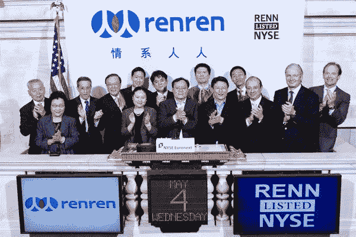
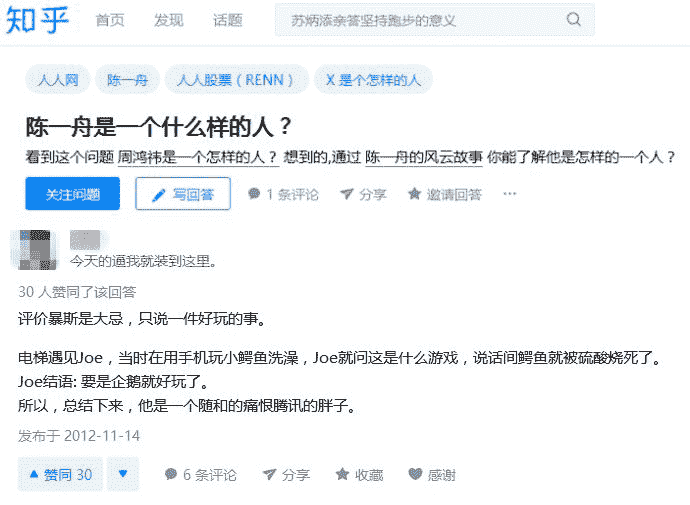
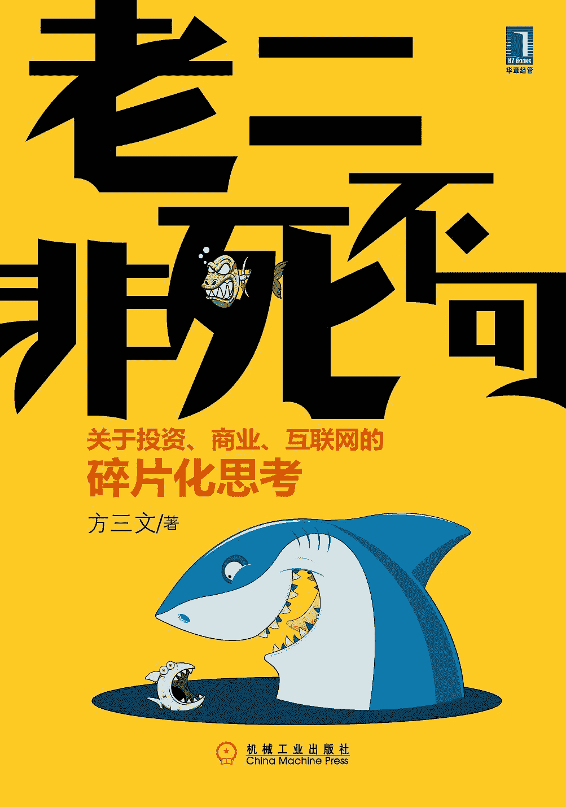
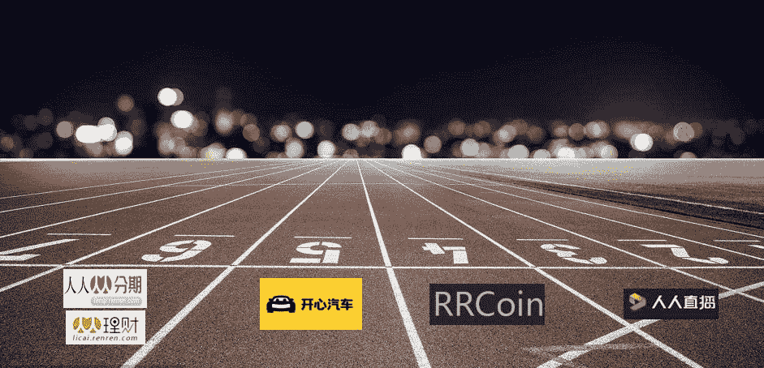
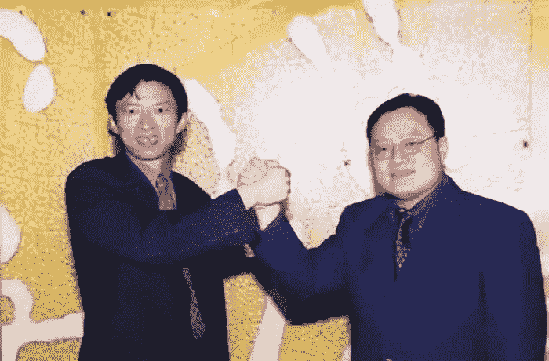
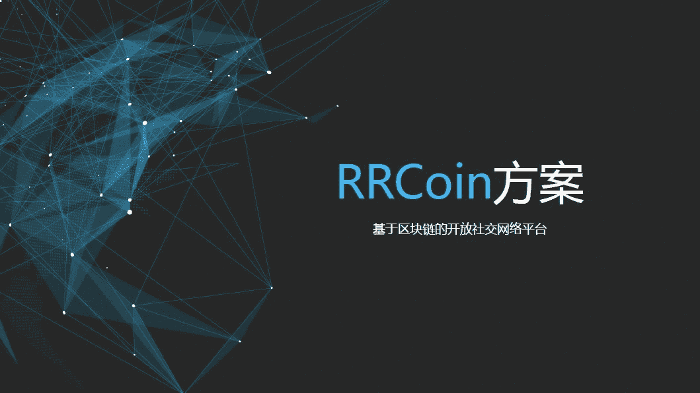
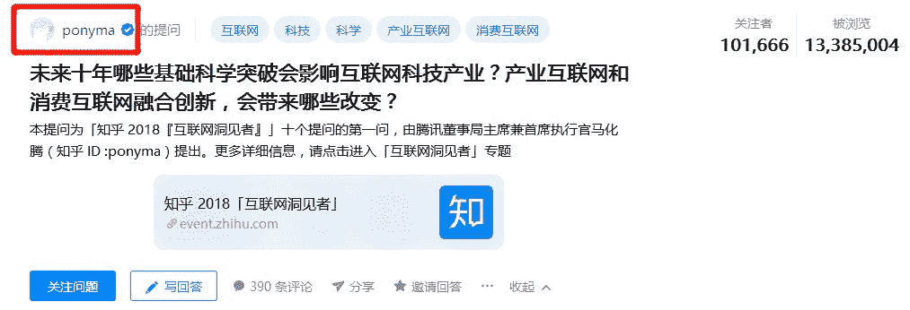

# 王峰十问第 26 期 | 陈一舟激辩王峰十问：我不是不想打硬仗，而是不想打一定会死的硬仗！（附音频）

> 原文：[`news.huoxing24.com/20181117004045250331.html`](https://news.huoxing24.com/20181117004045250331.html)

“你可以去追求成功，但不能要求一定成功，即使你曾经在一瞬间好像成功过。”

对话时间：11 月 16 日 21:00~23:30

微信社群：王峰十问智库群

对话嘉宾：

陈一舟：人人公司董事长兼 CEO。创立人人之前，曾是中国第一代社交媒体、1999 年中国访问量最大的网站之一 ChinaRen.com 的共同创始人、董事长兼首席执行官。获得特拉华大学物理学学士、麻省理工学院工程学硕士和斯坦福大学工商管理硕士学位。

王峰：火星财经发起人、共识实验室创办人、极客帮创投创投合伙人、蓝港互动集团董事长。

△陈一舟近照

**王峰：**Hi，大家晚上好，欢迎来到火星财经“王峰十问”的第二十六期——“老友记”番外篇。本期“王峰十问”增加了新玩法，邀请我的老朋友们做客“王峰十问”，侃侃大山，聊聊闲天，好不惬意。今天的这位嘉宾，是人人公司董事长兼 CEO 陈一舟。

先让我们看一看陈一舟的经历：

> 1987 年考入武汉大学物理系；1993 年进入美国麻省理工学院机械工程系学习，获 MIT 硕士学位；
> 
> 1995 年，进入美国阿尔泰克公司(Altec)工作，主管北亚地区事务；
> 
> 1997 年，进入斯坦福大学攻读 MBA 及电机工程双硕士学位；
> 
> 1999 年与斯坦福大学校友周云帆、杨宁共同创办 ChinaRen 公司，任董事长兼首席执行官。
> 
> ChinaRen 2000 年被搜狐收购后，陈一舟任 SOHU 副总裁；2002 年创办千橡互动集团出任董事长兼 CEO；
> 
> 2011 年 5 月 5 日，人人公司正式在纽约证券交易所挂牌。

我来抖一抖陈一舟的料吧，他是海归回国创业的第一批人，当年去清华大学的学生宿舍破门而入，招到的员工中就有今天搜狗的 CEO 王小川；美团王兴最早的生意卖给了陈一舟；人人网上市融资了将近 8 亿美金，创下了当时单笔融资记录；曾经红极一时校友录和猫扑网，历史上是陈一舟旗下的。

俗话说，老友相见，分外开心。我和一舟最早是 2000 年认识的，想起来都有快 20 年。十年一觉青春梦。我和一舟的交情，应该算得上两代青春了吧。他人挺胖的，不知道现在是不是还那么胖，反正很久不见了。

就在前天，一则人人网被低价卖身的新闻，把一舟再次推到聚光灯前。曾经拥有近百亿美金市值的人人网，被 6000 万美元对价卖掉，引发了 80、90 后集体对对青春、对 web 2.0 时代的追忆。有人说，这几年来一直在追赶各种风口的一舟，早已忘掉做 SNS 社区的初衷，也根本不在乎人人网了。作为同为多年的创业者，也是彼此心照不宣的老朋友，创业之各种滋味我都特别理解。

或许一舟心中还有解不开的结，也有说不完的委屈，不如在今天的“王峰十问”老友记番外篇里一吐为快。毕竟，为朋友就该两肋插刀。陈一舟现在大洋彼岸的美国，正值早上六点，旭日初升。下面，就开始咱们今天的“王峰十问”，作为迎接这美好新一天的开始吧。

**出售人人网的幕后真相**

**王峰：**第一问，三个月前你发了一封公开信，说人人网的未来是年轻人的事儿。我没弄明白，三个月后的今天，你果然把人人网社交平台业务相关资产卖给王乐了。曾几何时，如果不算 QQ 空间，人人网曾是中国最大的实 SNS，2011 年，人人网赴美上市，市值一度超过 79 亿美元，按当时市值排名计算，是中国第四大互联网公司。

△人人网赴美上市，市值一度超过 79 亿美元

网上有人说，陈一舟卖人人网，也是在做双 11 清仓啊。也有人说，陈一舟玩不下去了，现在总算找到了接盘侠（笑哭），哈哈，这帮人真损啊。很多人想看陈一舟的笑话，戏谑，尖刻。

**陈一舟：**其实据我了解的人人用户，绝大部分对人人都是充满感激，我们投资的好几家公司的 CEO 都是人人曾经的忠实用户，连老婆都是人人上找到的。

**在中国当企业家，要有基本的心理承受能力承受失败。成功的时候，群众会过分抬举你；失败的时候，大家会看你笑话。**

做人人网，包括以前做 ChinaRen，如果事情没有成功，所承受的压力甚至会比一般型的企业多，因为这个产品是一个群众性的虚拟精神消费产品，用户在某一段时间对其依赖性非常强，会觉得它很了不起，你的累计用户群数量会比你自身代表的商业价值高很多。

作个比喻：一个部落的战士在一片神奇的土地找到一种遍地生长的槟榔，曾经乐此不疲的嚼了好几年。随着时间推移，他们又发现并迷上了一种新的烟草，就集体不嚼槟榔了。卖槟榔的小贩说，你们好久都不来光顾我的槟榔店了，我准备撤了。战士们一听，那咋行，我们回来了。

结果他们一人一口嚼起曾经非常陶醉的槟榔，但发现完全不是他们记忆中的味道，他们纷纷把槟榔渣吐在地上，骂骂咧咧的一走了之，还是继续回去抽他们的大烟去了。

这些战士，是曾经在人人网上、但现在驻留在微信上的互联网用户，槟榔是各种他们曾经着迷过的各种互联网社区，而我是那个可怜的小贩。不是槟榔不好吃，而是客户的口味变了。

槟榔小摊能否变成烟草大户？人家是个烟草大厂，厂长还非常勤奋天天督促改进产品，你个跨界的槟榔小厂凭啥什么取而代之。

**王峰：**作为同为多年的创业者，我了解各种滋味，说实话，我用这样的方式来跟你做对话开头，你心里有没有不爽？话说回来，严肃地说，为什么做这个决定？是基于什么的考虑？有没有不为人知的幕后真相？

**陈一舟：**我们的考虑很简单：做事要有始有终，槟榔业务搞的不好，不能全怪客户口味变，自己也有问题。但是，我们也发现了自己新的烟草业务，所以不可能专心种槟榔了，不如把这个业务交给更合适的团队来经营。对我们来说，槟榔是一种结束，对多牛来说，这是一个重新的开始。**每一个商业的种子，对不同的企业价值不一样。 **有些人就是能够把一个看似平淡的业务搞的有声有色，这是一个很有意思的现象。 多牛就是这么一个有意思的公司。

**王峰：**有人说，出售人人网社交这事儿，好像幕后也还是你在玩啊。听说收购完成后，你还间接地持有这块资产的股份，这块资产对你还那么重要吗？是不是舍不得社交业务？为什么时至今日你还那么在乎人人网？哈哈，似乎很多 95 后 00 后都不知道人人网了。

**陈一舟：**人生最痛苦的事情之一可能就是要重新学新的谋生手艺，累啊！ 搞了 20 年的社交，确实怀念：怀念那些人和事，曾经的同事和曾经的事。互联网社区其实也是个精神产品，和办杂志一样，用户自己投稿。 这种属性导致用户对这个资产的感情投入，特别是期望值，非常高，也是我最后不能承受之轻的一个重要原因。 这个包，老扛在肩上，太累。 部分用户并不领情，天天骂你，我虽然脸皮厚点，不会去和用户计较，但时间长了也疲倦了。 

这个希望大家理解，做一个不赚钱但用户很多很优秀要求很高的网站站长不容易啊！

关于转卖业务，你会发现对你情况了解的人多半会最积极，也最有可能获得这个机会。 当然，我离王乐他们近，对产品情况了解，在转型过程中能够更好的帮助他们，这也是王乐和碟子看中的。 他们不主动找我帮忙，我不会主动去掺乎，完全放手，这件事只有完全放手别人才有空间。

**腾讯打败了人人网，还是人人网打败了自己？**

**王峰：**第二问，知乎上有个段子，一个疑似人人员工的答主，在帖子中提到“我当时在用手机玩小鳄鱼洗澡，碰巧在电梯被 Joe 遇见，Joe 问，这是什么游戏？说话间鳄鱼就被游戏中的硫酸烧死了。Joe 结语: 要是把鳄鱼换成企鹅就好玩了。”哈哈哈——你有那么恨人家企鹅吗？今天人人网输给腾讯是不争的事实了，你觉得是腾讯打败了人人网，还是人人网自己打败了自己？

**陈一舟：**又在玩我...曾经对腾讯很害怕很害怕很害怕，后来发现还是跑不掉跑不掉跑不掉....  现在我对商业世界中的巨大的物种都是非常小心的，对于他们喜欢去喝水吃草的地方躲得远远的。 

**王峰：**刚才那个帖子是 2012 年发出的，当时微博已经经营了 5 年，微信也已推出，彼时，你是怎么看待这两个竞争对手的？

我注意到人人网是 2009 年就推出了 App，但美国社交软件的正牌鼻祖 Facebook 大概是 2011 年前后才推出 App 的（但愿我没有记错），你觉得在移动互联网时代，人人网是更加强大了，还是更加没落了呢？我们常说，起个大早，赶个晚集，而为什么你起个大早，连集都没赶上？你不要打我啊。

**陈一舟：**猫扑上有个梗，叫一百遍啊一百遍.. 谁还记得？打你一百遍啊一百遍！这么严肃的问题我来严肃的回答一下...

移动时代我们不是最敏感，比如显然没有腾讯和小米那么敏感。 但事实是，我 09 年就想到做手机，还和孙正义开了好几次会（那时他也在亲自操刀做一款手机），10 年建立了近千人的移动团队，做类似微信的产品叫私信，包括国外的几款社交产品， 后来像你说的，什么都没捞着，原因很多。 

**首先，我们没有太多做客户端经验****。**历史上都是做页面产品的，团队没啥经验。等坑都填过了，又缺乏网络层的基础设施积累，比如当时几大运营商的互联互通要自己搭很多机房，做通讯产品必须要有很低的延迟，腾讯做了几十年的通讯，这些坑早填平了，我们再去填的时候无法在短期内提供低延迟的通讯体验。 这也是很多其它同一时间做通讯的公司的一个共同失败原因。 当时好几家和微信同时期都载在各种和通讯有关的坑上，当然，微信之前腾讯做通讯做了十几年，网络，客户端。 中国的网络条件不行，几个运营商之间互通互联不好，当时要提高快速服务必须自己去搭机房。

**我再说最主要的原因，****有一个本质上的原因, 网络效应。** 按雪球方三文的说法，他写了一本书，2014 年出的，叫《老二非死不可》，后来我们去投雪球，也是因为发现他是个明白人，虽然这个真理很刺耳，但是再难听的真理只要是真理就好好听着呗。　

**网络效应是互联网企业和其它行业最大的一个区别，是一个独特的只有互联网才有的竞争壁垒**，这导致只要有网络效应的互联网业务类型，演化到最后都会只剩下一个最大的，占到整个行业 90%以上的价值的大家伙。 这就是为什么，只有一个淘宝，一个腾讯，但是有除了百度还有好几家搜索引擎活着。从网络效应来看，腾讯是 N x N 的通讯网络，网络效应最强； 淘宝是 M x N 的市场网络，效应也很强。而搜索基本上是 1 x N 的网络，相对 NxN 更弱，但比起其它搜索，特别对比传统行业还是有很大优势，所以百度也挺值钱。 这点我以前经常说，但真正懂的人不多。 反正大家应该可以去看看方丈的那本书。

电话网络互通，而互联网通讯是没有互通的。想想如果电信和移动的号码不能互通，但移动比电信大 5 倍，最后是不是所有的电信用户都转移动了？一个用户在更大的通讯网络上好友更多，有更多的可能性，在两选一的情况下，最后一定是选择加入大的网络。

回到刚才的问题。我 2011 年微信刚出来就非常焦虑了。后来我们加码移动，搞了一两年啥都没搞出来。看到方三文那本书，我只瞄了一眼，根本没看过，就知道和腾讯打没戏了。 我们上市的时候用户数是腾讯 QQ 的 1/10, 推出微信以后把地址簿激活了，以前不活跃的 QQ 老用户也激活了，QQ 截流了我们未来的新用户，微信切去了我们刚毕业的大学生用户。 槟榔铺子的边上，一边开了个卖口香糖的，一边开了个卖烟草的，都是免费，铺面还比你大 100 倍，满足的都是同一个需求，这槟榔生意怎么做？

**“在非死不可的地方乱扑通，是一种巨大的浪费”**

**王峰：**第三问， 移动互联网兴起的最初几年，有一个理论叫“船票理论”，各家公司都在盘算自己手中有无船票，该有几张船票。移动社交热点被微博和微信陆续踩准之后，人人网很快被挤下船，为此，你找过很多热点来突破，O2O（糯米）、游戏（人人游戏）、互联网金融（人人分期、人人理财）、直播（人人直播）、二手车（开心二手车）、区块链（人人坊），老实说，该折腾的领域，你都折腾了一遍，咱们事后盘点，你觉得在以上这七、八条新赛道中，哪个领域你做的算是赢了？

**陈一舟：**这个问题很好回答。回过头看，除了互联网金融和二手车等和人人网社交业务完全没有关系的崭新业务，其它的努力其实都是一种浪费，对精力，时间和金钱的浪费。**在非死不可的地方乱扑通是一种巨大的浪费，不如提早撤出，把战场让给更合适参战的部队，我们到别的地方去寻找新的战场算了。**赢输的问题不如是否参战，和继续战斗重要。

**王峰：**坊间有很多声音，说人人网手里以后大把的钱，但是在发展过程中，迟迟得不到有效的突破，也与你的管理风格有关。我不知道你的管理风格是什么，但是对于这些批评的声音，你作何感想？

**陈一舟：**自我评价一下，感觉我的管理能力和智商在同等规模的互联网 CEO 里面估计中等或者偏下一定，但很多人不知道的是，我的努力程度自我估计在头 10%。 是这样，方三文说“老二非死不可“，他并没有说一个勤奋加管理非常牛掰的老二就会不死，他的说法应该是还是会死，只是死的慢点。 我们拖到现在才卖，是不是反而说明我们太努力了？换别人早死了？ 说不准，你说呢？逻辑上应该是这样吧？

**王峰：**同意啊。在我看来，中国的互联网大佬里，有两位跟你差不多同期出道，马云善于抓企业文化，亲力亲为做政委工作，马化腾善于抓产品，自己亲自抓用户体验。好像一个企业的成功，跟 CEO 擅不擅长做管理也没多大关系。你觉得呢？

**陈一舟：**在互联网行业，一个网络效应很强的产品类别里，管理重要但不是最重要。**最重要的是头一批冲到这场战争里面去，迅速成为老大。**比如 C2C 电商，淘宝是第二个冲进去去的，前面还有易趣。所以打败易趣是不容易的，当然 ebay 当时犯了很大错误。　

腾讯是第一个冲到即时通讯里面去的，PC 时代坐稳了，移动刚出来是非常正确的搞了三个内部团队做微信。这都是魄力和战斗力，比管理能力重要的多。一旦战争结束，剩下的时间就是打扫战场，数钱。和战争本身比，和平时期的管理容易太多。　

我们在 2011 年末的时候发现微信追不上的时候，准备买 Talkbox, 因为盛大先投了，很纠结没谈拢。2012/13 年我们甚至准备投 SnapChat 和Ｗhatsapp, 你相信吗？每个公司有自己的能力圈，但这个原因还是网络效应。千万不要忘记网络效应。移动即时通讯的机会我们看的非常早而且非常清晰，就是抓不住，这不是我们的菜，我们在这个里面的道行还不够深。

**王峰：**你觉得自己擅长做什么呢？在你看来，做好一个企业的 CEO，应该具备什么样的能力？

**陈一舟：**CEO 最重要的任务，是给公司找到合适自己，合适团队做的，在能力圈内的事。**世界上绝大部分的事，没有足够的竞争壁垒，支持不了信长的野望。**如果 CEO 的目标是搞个大公司，还要求能长治久安，那就要运气足够好能找到这件事。有时候找到了一件很牛的事，但它不是你的菜，比如我们碰到移动通讯，那就不是我们的菜。 米聊，易信，来往，它们的东家个个比我们牛，不也没成吗？通讯就是腾讯的菜，谁也别想碰。不一定找最弱的，因为赢了它也捞不到太多钱。**要找体量大但身体虚弱的行业和对手。**

那为什么没有什么人对他们说三道四？成者为王败者为寇。人家是有牛掰的主业顺便做个东西给腾讯添个乱，成不成无所谓。而通讯是我们的主赛道，输了挨骂很正常。不过，下次有人再骂的时候，请思考一下，通讯这件事，雷军丁磊和马云他们都看到了，也做了，但都没做过马化腾。 从结果上看，逻辑推理得出的结论也只能证明陈一舟做通讯并不比马云丁磊雷军强，你甚至都不能证明我比他们做通讯弱，因为他们也没做成颠覆微信的产品，他们的资源还比我多，只能说明大家在通讯上都是腾讯的败将，败将之间无法排序。 

如果有人骂我通讯没做好是不务正业不懂管理呀这些破原因，请这位仁兄去找一个不搞投资，只务正业，管理一流，比雷军丁磊马云更强的人来，好不？找到了，全国人民都同意了，我就把人人再买回来，把你和你找到的高手一起坐我高价租来的时间机器回到 2011，让高手来当 CEO，你当伯乐，你们一起做人人通讯去和腾讯打仗玩吧。 这个科幻估计方丈一听可能会笑醒：天机不可泄露，老二非死不可。

**“竞争对手会恨我，如果换我，也会恨他”**

**王峰：** 第四问，你这次卖了人人网之后，有很多媒体又把你创业的故事搬了出来，以满足看客们的窥视欲，比如，我看到有人把你之前和张朝阳、王兴、雷军等人的故事搬出来，也有人在扒你和刘韧、程炳皓的故事。很多人方才意识到，你才是一个真正有故事的互联网创业老兵，经历的千回百转，简直可以拍部电影了。哈哈，张朝阳也算是你的前老板了，数度脱离业务，可他现在依然在跑步、搞直播，奋战在第一线。你怎么看待今天的张朝阳？

△张朝阳和陈一舟早期合照

**陈一舟：**小城故事多...张朝阳现在状态看起来不错：他游泳长跑还有美女健身教练陪着，身体比大部分年青的同志们都好，我觉得他活得美滋滋的，生活质量奇高无比。羡慕！到了这个年纪，争强好胜的心是不是应该更加淡薄一些？美满的人生包括哪些？人总有一死，对于那些成功人士，他们的后代是否能撑起曾经的家业？能撑几代？多半撑不了三代，撑一代就不错了。能撑起来又怎么样？难道就一定比别人幸福？这些都是问题，很好的问题，这些问题过去几年我都大致琢磨清楚了。

**王峰：**王兴呢，他创办的校内网在濒临倒闭的情况下被你收购，日后又再次创立饭否（被政府关掉），直到在美团上大成，经过多年艰苦卓绝的努力，美团点评在今年 9 月上市，发行当日市值超过 500 亿美元，最初，你是否想过最初的这位王兴同学会有今天的成就？

**陈一舟：**我很早就知道这位同学是个厉害的角色。2005 年 5Q 校园网和他的校内网竞争的时候，他的地推队伍会过来撕我们在校内网强势学校的宣传单页，我能感受到他的竞争压力。后来我看到撕不过他我就琢磨干脆把它买了。

最近几年和王兴经常混在一起，发现他喜欢看书和问好问题，远远超过我认识的很多其它 CEO, 这很难得。你看我周围净是些厉害的人物，雷军周鸿祎这还只是我这辈的。有次在一个 CEO 学习班上，一起的有王兴、周亚辉、王小川。那天搜狗准备上市的消息出来了，我们都在祝贺小川，大家突然发现我和这几个人的关系很大：他们都曾帮我做过事，现在都管着比我更大的盘子，现在是同学，讨论各种好玩的问题。我觉得机缘很神奇，真心为他们高兴，也以和他们继续为伍感到荣幸。**老兵要多和牛逼的新兵混，这样廉颇老矣，尚能吃口剩饭。　**

**王峰：**5Q 校园网，你不提我们都快忘了，哈哈。还有一位同学。不知你还愿不愿意提起程炳皓了，一个真假开心网之争，让你们曾经对簿公堂，两年前程炳皓也已经离开了自己一手创办的开心网，一走了之，很多人都替程炳皓感到惋惜。当初为了对他发起阻击战，你不惜背负了假开心网的骂名，事后多年，你觉得那场阻击战打得值吗？事实上，你确实阻击了在白领市场红遍一时的开心网，但自己最终也没成。我想说的是，如果程炳皓没有被你阻击，当年的程炳皓开心网有机会成长为互联网市场上的一棵大树吗？

**陈一舟：**你是哪壶不开提哪壶啊！一个可以证明的事实是，开心网是ＱＱ农场阻击成功的。ＱＱ农场把人人开放平台上开心农场原代码买过去，自己运营，把 Qzone 用户大部分导过去了。　你可以看到当时的 Alexa 曲线，ＱＱ农场推出以后，Qzone 增长迅猛，而人人（当时还叫校内）和开心网增长曲线马上平下来了。农场偷菜是中国互联网的一个首创，也是各国社交网络崛起的重要原因。但是你看发明偷菜的上海五分钟公司好像也没了。**商业竞争是残酷的，当然程炳皓会恨我。将心比心，如果换我，我也会恨他。**

**如果没有ＱＱ农场，人人网会活得更好一点，开心网也会上市。但是，如果腾讯最后还是祭出微信，老二老三还是非死不可。唯一的可能性，是当时人人和开心合并，把学生和白领用户群打通（直到现在，这两个群体还是非常隔离的），然后还必须奇迹般的要么自己搞出一个微信样的产品要么收购一个微信产品比张小龙的微信早点推出外加拼命推广。**

****

****“腰上别着足够的子弹先活着，比打仗打到死重要”****

****王峰：**第五问，坊传，你才是真正的投资高手，在二级市场投资斩获颇丰，更有声音说，你曾炒股赚钱给员工发工资，听说你在 fintech、交通、物流领域投到了很多不错的公司，比如雪球、SoFi、罗计物流。也有人说，陈一舟做产品做公司不太行，但做投资确实一流，昆仑万维的周亚辉，他曾经是前人人网员工吧，他也尊称你过“恩师”，我代大家问一句，是不是这样的？**

**判断一个人擅长做投资还是擅长创业，最好的方式就是做个数字对比。好吧，你回答我，在本世纪已经过去十八年时间里，你在投资中赚到的钱是不是比在公司业务中赚得多？**

****陈一舟：**这个有点过奖。不过我确实喜欢投资，包括二级市场投资。我个人的天使投资纪录也很好，应该超过帮人人公司投资的纪录。我粗略算过我们在死守人人网和腾讯打硬仗的那几年，收购 56 及后来搞糯米网，累计烧了好几亿美金。同时，我们回购人人公司股票花了几亿美金（记住不要轻易回购自己的股票，因为自己股票被低估的时候，外面总会有更被低估的股票，实在要买不如去买别人的股票）。几个月前的分拆又花了一亿多现金，我们花掉的现金非常多，如果没有造血机制，公司早死了。但是，公司包括分拆部分净资产比刚上市时没基本没变，为什么？投资，我们光投资 360 就净赚两亿美金。**

**那好，会投资是不是缺点？对股东来说，是不是全心打仗把钱烧光更光荣？一个本来非死不可的老二赖着活下来了，应该做如何评价？ 是不是一个不合格的老二？还是一个未来可能的老大？我觉得，腰上别着足够的子弹先活着，比打仗打到死重要，特别是要避免知道一定有一死的战斗。**

****我不是不想打硬仗，我打过而且也赢过，我是不想打一定会死的硬仗，这是普通大众特别不理解的一点。**去一个巨大的市场当一个非死不可的老二。**

**人人最火的时候我们有几千万的学生用户，天天在人人上偷菜，他们中的不少人，直到现在，还认为自己这波人就是中国互联网的所有人群。 他们不知道，在他们在课余偷菜的时候，有人数十倍于他们的大妈和大爷，叔叔和婶婶，小弟小妹，民工和公务员，也在 QQ 农场上更加忘情的偷菜，甚至深更半夜起来偷。 QQ 的网络效应是 10X10 相当于人人网的 100 倍。 这些学生毕业以后，要找工作，要拓展业务，大学同学不那么重要了，都跑微信上去了，不嚼槟榔去吸烟草去了，卖槟榔的小商贩只能表示无能为力。谁想让一个小十倍的通讯网络去打败一个大十倍的通讯网络，请自己众筹 1000 亿大洋，另请高明，哥不干了好吗？**

****

****“人人网和区块链的想法，我仅动了一个念头”****

******王峰：**第六问，做区块链的很多人想了解，人人网在 2017 年底打算做区块链社交项目去发币，叫做“人人坊”，计划发 10 亿人人币，我听说是一个币圈 90 后劝你做的，但是很快被监管叫停了。人人坊这个项目，你当时有预期吗？当时是谁帮你写的白皮书？****

********

****△RRCoin 白皮书****

******陈一舟：**当时对区块链感兴趣，是因为我们海外业务 Trucker Path 当时确实在考虑这件事情。** 而人人网和区块链的想法，我们仅仅只是动了一个念头，连脚趾头都没动。**但是当时区块链的热潮你也知道，一家还像点样的互联网公司就是放个屁，这个屁闻着也会像区块链，然后各种神奇的事情就自然发生了。 ****

******王峰：**是否还继续看好区块链？前段时间，你 20 年前的创业伙伴杨宁，也成了区块链圈的热点，年初时，他高调进入区块链，言之 All In，做了 CDC 项目，年底未到，又高调退出，引发币圈一片哗然。杨说“互联网人进币圈，弄不过小年轻，被割了”。但是，币圈却群起而攻之，“他割了最后一波 CDC 持有者离场，还往别人身上泼脏水”。这个时候，你是不是会感到比较庆幸最初没有发币？****

******陈一舟：**哈哈，杨宁是我以前创业的兄弟我不会怼他的。但据我对币圈的有限观察，我国人民拥有全世界仅次于犹太人的创富精神，对任何科技上的新潮流，都会以极大的力度和热情去追捧。这个过程中，一定会有泡沫，而且还很有可能是全世界规模最大的：比如当年风靡荷兰的郁金香。  ****

******王峰：**虽然你没有和杨宁一起玩区块链，但我看到你今年投资了几家美国、日本的区块链技术公司，用区块链技术改变房屋租赁、交通物流。能否和我们展望区块链的下一步？你研究过最近越来越热的 STO 吗？****

****区块链我们看的很早但基本没投。6 年前我们在以色列看过一家芯片公司准备在冰岛挖矿，没投。去年有太多大佬在标榜自己有多少个比特币，觉得有些落伍，就个人花相当于十几个比特币（小赌怡情）的钱投了一个俄罗斯挖矿公司的股票，当时他们的成本价是 6000 美元挖一个比特币，而市价当时是一万四。我甚至写过一篇区块链的短篇科幻，觉得新意不够，没发表。  ****

****有些区块链应用是有一定道理的，比如说每个单子比较大（单子太小记账成本不合算）的交通物流平台，像我们旗下的 Trucker Path，但我们没搞。上市公司，监管严格，还是落在人后，等规则出来再说吧。  ****

********

******“老的不去，新的不来！”******

******王峰：**第七问，几年前，被称为互联网的三个湖北人中，周鸿祎说“你是第一聪明，雷军第二，他自己排第三。”雷军私下又说最佩服的人就是你。反过来，你怎么看这两个人？如果各找一个词或者一句话来评价你这两个老乡，该怎么说？你觉得人这一辈子要做成一件大事，最重要的是靠聪明吗？****

******陈一舟：**国外的观念确实新，但是过去 20 年来，中美之间的观念差已经几乎没有了。周鸿祎这么说可能是因为我在 360 上市以后股票最低迷的时候投了他的二级市场，赚了钱。 其实他比我努力，也比我聪明。 雷军是我的榜样，我刚回国搞互联网的时候就去拜他的山头，他比我牛多了。 搞 ChinaRen 我入网早，他就和我讨论互联网，后来去做了卓越，也找到了网感。 我最佩服他的是金山上市之后从金山跳出来，先做了两年天使投资，找准了赛道自己跳进去搞了小米。 这个操作太牛掰了。 首先从金山的毅然跳出，不是每个创始人有这种勇气的。 这个动作决定了后来的一切。其实王峰你从上市公司跳出来，是不是也是 all-in?****

******王峰：**我打算将来用火星财经收购蓝港互动啊。（玩笑）蓝港是我的命，火星是我的梦。****

******陈一舟：**倒！有这事！结论就是，**如果一个老业务没有那么激动人心，就跳出来。 老的不去，新的不来！******

********

******“区块链是新时代的宗教，如果成功确实值钱”******

******王峰：**第八问，这一年，包括小米、美团、拼多多、映客等一大批互联网公司相继上市，今年上市的互联网公司的数量可能会超过过去 3 年，有人说，2018 年是互联网红利最后一波收割，大家都流血上市，趁着能收割就去收割了。作为一个这么多年的创业者和投资者，你觉得互联网是不是真的进入了瓶颈期？红利消失，创业机会渺茫，VC 丧失活力。作为一个在枪林弹雨活过来的互联网老兵，你认为互联网下一个增长点在哪里？****

****接下来，咱们做道选择题吧：****

> ****A（人工智能）****
> 
> ****B（区块链）****
> 
> ****C（云计算）****
> 
> ****D（大数据）****

****你看好哪个？（一个不选也可以啊。）以上，你觉得哪个是你的机会？****

******陈一舟：我选人工智能。**互联网的人口红利已经结束，未来是负利。依靠每年不断冒出来的年轻人的互联网公司，对不起，现在每年出生的婴儿越来越少。**未来的技术增长点是人工智能。**云计算大数据是过去的潮流，还会继续，但已经不新鲜了。币圈的同学可能不爱听，个人以为区块链的总体价值体量较小，和人工智能的潮流不可同日而语。 ****

****为什么是人工智能，我是这么看的。 人类历史上有三次技术革命：**第一次是农业技术革命**，解决了人口增长问题，每平方耕地面积所能养活的人变多了。人作为劳动力，主要有两个自带的生产工具：肌肉和大脑。**第二次是几百年前的工业革命**，让燃料驱动内燃机，取代和大幅放大了人的肌肉的力量，同时，改善了卫生和生活条件，人口加速爆炸。**第三次，就是现在人工智能革命**，是机器取代人脑。这个革命比工业革命产生的价值大的多，未来可能真会进入某种形式的共产主义，但这要靠人均拥有一百个机器人。人工智能的力量之大，大到我害怕。 ****

****从某种意义来说，区块链也是一种宗教，只要大家都信了，就值钱了。 这下高兴了？**AI 不是宗教，是生产力。区块链是新时代的宗教，如果成功确实值钱。**这么比喻吧，AI 相当于当年的智能手机，国际行业市场相当于当年的中国消费者互联网，我想学雷军，他从金山跳出来，我把人人网托付给了两个经常化腐朽为神奇的能干小兄弟，我抽身出来去寻找我的小米，这么说懂了吧？  ****

********

******“你可以去追求成功，但不能要求一定成功”******

******王峰：**第九问，我看你在接受媒体采访的时候，说自己非常看好行业互联网的发展，并且已经在其中耕耘了 3 年，主要方向是交通、房地产，具体这些业务发展的怎样？你不妨介绍一下目前的进展。****

****这些行业互联网市场这是不是去除了 SNS 业务后人人公司的未来发展道路？这两个行业前景都非常广阔，市场巨大，这个我理解。但好像都跟你过去的业务关联不是很大，你决定进入这两个行业，你的信心是哪里来的？我是说万一啊，要是这一次也脱靶，子弹都打完了呢？****

******陈一舟：**行业市场发展没有消费者市场这么快，也不是赢者通吃的规律。后来者有机会，但机会和发展速度和微信，淘宝这样的产品是不可能同日而语的。最近，美国犹他州有家 SaaS 公司，做了 7 年卖了 80 亿美金。 我们的美国总部就在隔壁，离成功稍微近了一步。****

****这里还是那句话，**你可以去追求成功但不能要求一定成功，即使你曾经在一瞬间好像成功过**。世界的规律就是这样，不要找各种理由去违反它，否则你的失败几率会更大，而且一辈子都不会太快乐。一个企业家，奋斗就是为了过好日子，结果你为了追求名利，过的苦巴巴的，可能到死之前还不快乐，仅仅是因为想不清楚一些非常质朴但违反人类本我的道理，这不是傻吗？****

********

******网络效应，网络效应，网络效应, ******

******重要的事情说三遍！******

******王峰：**第十问，前不久，马化腾在知乎上提问：“未来十年哪些基础科学突破会影响互联网科技产业？产业互联网和消费互联网融合创新，会带来哪些改变？”我看到不少人上去献计献策，指点江山，对于这个问题，你心里是否有答案？****

********

******陈一舟：**消费互联网降低了新技术的成本，比如说苹果系列产品，刚出来很贵，企业基本用不起。 但随消费者的大量使用，把它的成本降下来了，同时培养了用户使用习惯，现在苹果产品在企业里开始大行其道。我觉得这是**消费科技市场和行业科技市场之间最强的一种作用关系，这个关系基本以单向为主，作用力可分解为两个垂直方向：产品价格和用户使用习惯。**钉钉就是一个例子：微信把用户使用习惯给培养出来，阿里巴巴把这用到了行业里，价格同样是微信打出来的免费模式。对于我这种以思考未来为乐趣的人，这些都不是问题... ****

******王峰：**你曾经多次说过，社交产品已经要交给年轻人做了。在我印象里，你一直蛮自信的。公司做的牛掰的时候蛮自信的，不牛掰的时候，也挺自信的，我眼里的你，是一个从骨子里自信的人。你可否想过，陈一舟同学会有王者归来的那一天？****

******陈一舟：**好吧你又给我上套...社交产品是荷尔蒙产品，当然要交给荷尔蒙含量高的年轻人。这是规律，不能违反，除非我愿意每天打雄性激素。这么说吧，你知道雷军从金山出来两年，我所知道，他投了两个好项目，一个是 Ucweb，一个是 YY.  人人公司现在折腾的这几件事，我不能保证每个都是 YY，但可以保证，多半会出至少一个 YY，没准还会两个。****

****但是同时，我也可以向大家保证，我暂时还没找到属于我的小米。**这需要时间，需要机遇，需要大风来临。**我大约知道风会在哪，风向大约在哪。不出两年，运气好的话我没准能找到。如果运气不好，没找到，如你所说，脱靶了，很正常。五年以后还没找到，公司现在的业务基本都应该成熟了，哥们准备彻底退休，把业务交给可靠的弟兄管着，专心搞早期投资和二级市场投资。****

****每天工作 5 个小时，看三个小时书，和至少一个有趣的人聊天，学张朝阳锻炼身体（现在就开始），多走走天下（我现在走的其实已经很多），多陪陪老婆孩子（这方面要补），感觉应该不比传统的“王者归来”的体验差。自己亲自操刀做过各种业务，即使是失败的教训，也是不可能轻易学到的宝贵投资经验。反过来，投资的经验，对找到正确的风口应该帮助很大。如果我不会投资，我找到陈一舟牌小米的几率应该几乎为零。 如果我投资能力还行，这个几率应该要大 N 倍。****

******王峰：**预测一下，五年以后，现在的互联网公司谁在生存，谁会阵亡？五年以后，互联网的前五名都有谁？****

******陈一舟：**大部分都会在，只是价值会更加集中在头部。五年之后互联网前五名，这个比较难回答。按物理规律，**网络效应大的分市场，通讯和电商，不会有大的改变**，它们甚至会继续吸其它传统行业的市场，比如金融；**网络效应小的分市场，才人会辈出**，但应该很难超越腾讯和阿里：壁垒不高的东西不会长的太大。**网络效应，网络效应，网络效应, 重要的事情说三遍！******

****能干苦活的公司，比如小米和美团, 干苦活也是一种壁垒，它们的商业模式也有一定的网络效应，周边的传统业态总体规模很大，会被它们吸进去，估计排名还会缓慢爬升至少不会降。当然，他们的友商都很厉害，都不含糊，这是他们永远不能放松的地方。****

****AI 方面，个人感觉目前百度的能力储备应该最强（很多人不认同这点，见仁见智），他们应该做芯片。 所有的大家伙都会做芯片，搞云计算的大公司都会，云计算把 IT 价值链拍平了。但 AI 领域很大，新手和发展方向多如牛毛，VC 资金漫天灰，会形成混战，万团大战。AI 芯片的设计原理不难，就是个显卡（搞区块链同学很清楚），主要拼低能耗和速度。 带个私货，最近投了一个芯片设计软件公司，有超厉害的算法和电磁场计算原理为基础，能解决这些问题。**子弹在人在，鸭子也跑不掉！******

****太阳系里有个地球，地球上有个雪球，学球上住在一个方丈，叫方三文，也叫“不明真相的群众”。几年前，他出了本书，叫“老二非死不可”。 这本书我没看，看了会桑心。 未来准备做社交或者通讯的同学，启动之前请仔细研读这本书，看完以后请方丈算一卦。 ****

******王峰：**时光匆匆，和一舟的每次聊天，都觉得意犹未尽，受益匪浅。作为好朋友，很欣慰一舟能以平常心、平和心去看待人人网的过去、现在和未来。有句话我很欣赏，最后与一舟共勉：只要还有一点儿摁不灭的火苗在心底，便可肆无忌惮的编织一个又一个美好的梦。****

****正如一舟在几个月前发出的《人人网的明天，由你定！》所说：****

******现实是残酷的，****过去是美好的，青春永远是美丽的，遗憾是应该的……我们关心的是，如何做最好的未来的自己**……****

****本文为火星财经原创稿件，版权归火星财经所有，未经授权不得转载，转载须在文章标题后注明“文章来源：火星财经（微信：hxcj24h）”，若违规转载，火星财经有权追究法律责任。****