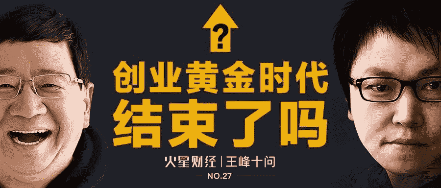
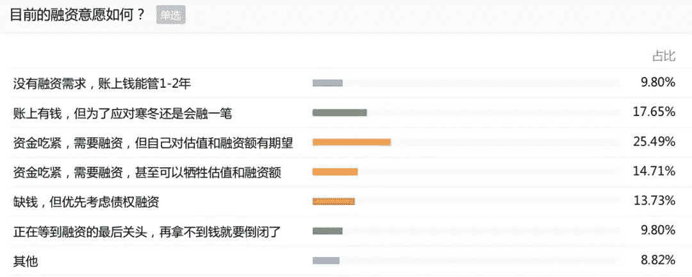
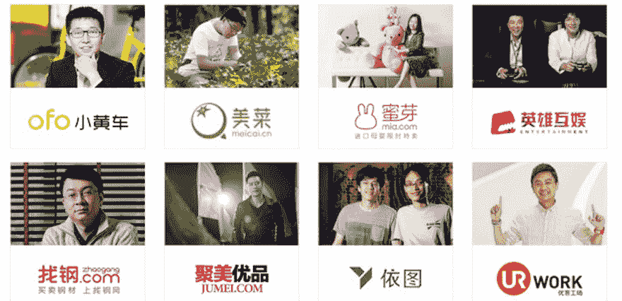
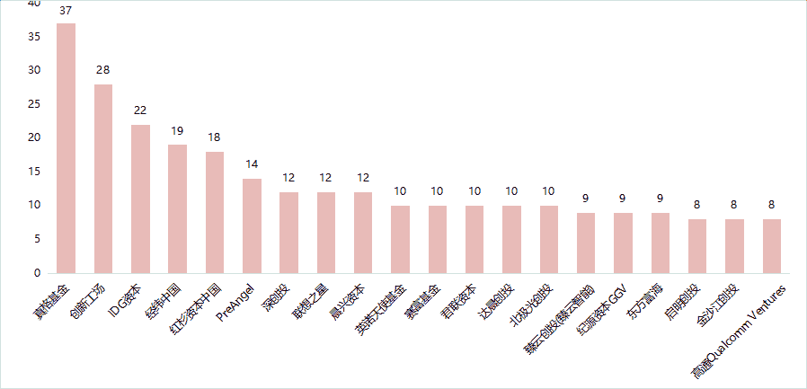
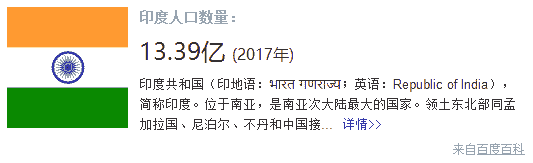
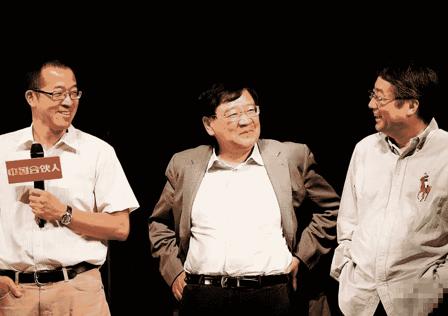
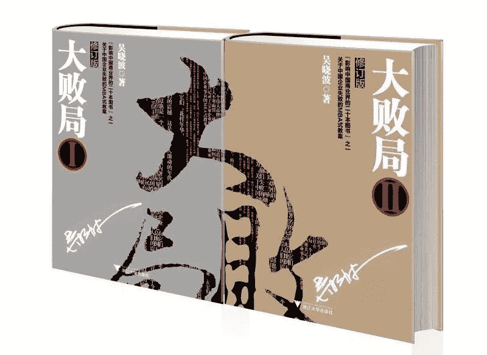
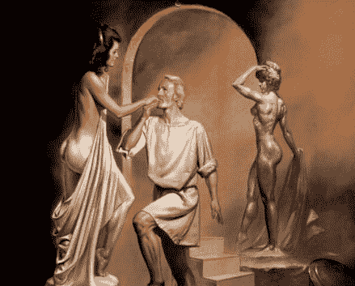

# 王峰十问第 27 期 | 徐小平答王峰十问：中国创业“黄金十年”确已结束，“白金十年”正扑面而来！（附音频）

> 原文：[`news.huoxing24.com/20181201000801636418.html`](https://news.huoxing24.com/20181201000801636418.html)

**对话时间：11 月 30 日 20:00~23:30** 

**微信社群：王峰十问智库群**

**对话嘉宾：**

**徐小平：**真格基金创始人、新东方联合创始人、著名天使投资人。现任中国天使会主席、中国青年天使会荣誉主席、中国证监会基金业协会天使投资专业委员会主席等职务，并担任欧美同学会 2005 委员会理事长，以及未来科学大奖执行理事。

**王峰：**蓝港互动集团董事长、火星财经发起人、极客帮创业投资基金合伙人、共识实验室创始合伙人，曾任金山软件集团高级副总裁。

**王峰：**Hi，大家晚上好，欢迎来到火星财经“王峰十问”的第 27 期。今天的嘉宾，大家应该非常熟悉真格基金创始人、新东方联合创办人——徐小平老师。大家应该非常熟悉徐小平老师，先让我们看一看徐老师的经历：

> 1956 年，出生于江苏泰兴。
> 
> 1983 年，获得中央音乐学院音乐学系学士学位。
> 
> 1983 年-1987 年，先后任北京大学艺术教研室教师、北京大学团委文化部长、北大艺术团艺术指导。
> 
> 1987 年-1995 年，在美国、加拿大留学、定居，并获加拿大萨斯卡彻温大学音乐学硕士学位。
> 
> 1996 年-2000 年，北京新东方咨询公司董事长、新东方学校副校长，新东方“三驾马车”之一。
> 
> 2000 年-2006 年，北京新东方教育科技集团副总裁、董事。
> 
> 2006 年-2011 年，新东方上市后，徐小平离开董事会，开始从事个人天使投资。
> 
> 2011 年-至今，徐小平、王强和红杉资本中国联合创立天使投资机构“真格基金”。
> 
> 2016 年，入选美国福布斯杂志“全球最佳创投人”榜单（Midas List）。

徐老师是我一直以来非常敬重的大先生。他身上的豁达和幽默气质，他横跨教育、创业和投资的复合成长经历，是大部分当下投资者没有的。所以说，中国教育界不一定没有徐小平不行，比如新东方其实可以没有徐小平，哈哈。但徐小平在中国创投界的影响力确实独一无二的，各位知道，徐老师抢项目的优势得天独厚啊。

早在几个月之前，我在徐老师家中喝酒，就曾和徐老师约定好，在合适的时间，请徐老师做客一期“王峰十问”，他一口就答应了。想不到等到现在。

徐老师说，我也是他知音，我的十问，也得到了他很多次鼓励。今天，希望我们期待已久这场对话，给大家能带来干货满满的精彩分享。我也希望通过今晚的十问对话，让我们大家了解一个更加真实的徐小平。徐老师，咱们就正式开始吧。

**“中国创业的‘白金十年’正扑面而来！”**

**王峰：**第一问，前几天，一篇《2018，创业黄金时代结束的一年》刷爆了朋友圈，引发了极大反响。正如莎士比亚戏剧《哈姆雷特》所言：**To be, or not to be, that is the question（活着还是死去，这是一个问题）**。很多人下意识地认为，现在可能真的到了“创业至暗时代”。创业者们，还有多少人可以在目前的竞争赛道上活下去？作为一名知名投资机构的掌门人，您的背后是否感到凉意？

**徐小平：**我没有感到任何凉意，相反，心中有无限温暖。中国有一句出自战国时代的成语叫：”三人成虎”。说的是如果一个人说街市上来了一只老虎大家可能不信，但如果有三个人都说大街上有老虎，听的人就信了。**所以，假如街上真的有三个人在说老虎来了，我想做那个大声说街上没有老虎的第四个人。**

**即使街上真的来了老虎，我愿意做那个把老虎引出出门，或者干脆做一个把那只老虎关起来的守护人。**

刚刚过去的中国创业“黄金十年”（2008-2018），恰恰与我个人全身投入天使投资时间平行。我觉得，**中国创业的太阳恰如“早晨八九点钟的太阳”，不存在“黄金十年结束”的阴影。除非我们自己自暴自弃，自废武功。**

2018，中国创业的“黄金十年”确实已经结束——但 2019 年，中国创业的“白金十年”，正在扑面而来！

2018 年 11 月初青年天使会上海论坛上，我对着来自全国各地的创投界朋友说：“真格基金 2018 年投资节奏确实有所放缓”，以投资速度快而多著名的我们，“在 2018 年所投项目数比往年少投了大约 25%左右”。

其实我不自觉地误导了大家。为了今天的访谈，我从真格法务和财务那里要了一系列数据。**数字和事实证明，真格在 2018 投出了比 2017 年还多的项目，以及更多的资金。真格被投项目，获得同行基金续投的项目，也超过 2017 年。**我们心理上也许产生了某种迟疑，但我们用行动一如既往地证明着我们对中国创业未来的信心。

丘吉尔在二次大战的“至暗时刻”说过一句激励了英国人民的名言：“最大的恐惧在于恐惧本身”。我要对那些对中国创业缺乏信心的朋友们说：**最大的信心，来自于信心本身。**

**王峰：**回溯最近的十年历史，被称作是创业黄金十年，也是中国移动互联网市场快速超日赶美崛起的十年。根据 CNNIC 数据，2008 年我国的互联网用户规模为 2.98 亿人，而十年后的今天，这个数字已经增长至 8.02 亿，其中手机网民占比高达 98.3%。大多数超级独角兽公司，都发迹于长达 10 年的移动互联网高速增长期。

然而，被媒体和投资机构视作移动互联网红利的余额似乎已经不多了，更多的资源，包括品牌、流量、渠道、资金、人才，IP 乃至技术专利，已经高度聚集在少数头部公司，在马太效应之下，2018 年也成为很多创业者的多事之秋。

来自 36 氪的调查显示，约有 82%的创业者目前正处在“需要融资”的状态，其中，40.2%的创业者已经“资金吃紧”，近一成创业者在等一笔“救命钱”,创业维艰。曾经的明星创业者们日子也不好过：面对“资金链断裂”传闻再次袭来，罗永浩直言不讳“公司的确有危机，请给锤子时间”；ofo 创始人戴威在内部员工大会上直言，“跪着也要活下去”。昔日那些可穿戴设备、智能硬件、无人货架、P2P 等大热概念也迅速褪色。

创业者的融资意愿调查

此外我注意到，自 2018 年以来，我们的智能手机上再也没有出现一款现象级的爆款游戏和热门 APP。大众创业潮，昔日里以创业带动就业的口号，将很快成为历史？

**徐小平：**说 2018 年没有一款现象级热门 APP，不公平吧？抖音不就是在 2018 年崛起的吗……？我相信 2018 年推出的产品，很多会在 2019 年爆红、大火。还有今年大火特火的小红书呢~

还有，“以创业带动就业”不是一个口号，而是一个成果。这个成果不仅没有衰退，相反，这个时代的创业者们正以更加汹涌澎湃的力量。我想讲一个我们投资的一个 2B 项目“美菜”，普通消费者一般不知道这家公司，但大家肯定都间接接受过他们的服务，美菜为餐饮业解决供应链问题。创始人刘传军曾经遭遇过创业的巨大失败。重新创业不到四年半，美菜现在雇佣有三万五千员工，而明年的雇员数目可能会达到惊人的 8－9 万人。

就业对一个人、对一个家庭、和对整个社会的有多重要？请允许我讲一个我自己的故事。我知道大家对我在北美送披萨饼挣钱养家的故事已经听烦了。我现在讲一个我从来没有讲过的故事。90 年代初，在我找工作最艰难的日子里，我有一个北大朋友在美国一家出版公司打工。他说小平我这里有一份工作可以给你，不过工作性质有点委屈你——在他的仓库里做打包的活儿。

在今日中国，在仓库里做包装工，一定是工资最低、层级最低的干活。但那时候，这份最低就业机会燃起了我对未来的希望。我一时间摩拳擦掌准备赴任好好干，干得出色，升任快递员，开车穿行在北美城市的大街小巷里，气宇轩昂、英姿勃发……可惜最终因为我的美国工作签证问题没有成行。

**好了伤疤，我没有忘记痛。**我切切实实记得找一份最基本工作而不得的痛苦，以及找到一份最低收入工作的欢乐。四年半，美菜创造三万五千就业是一个奇迹。但在规模不大的真格基金，我们被投公司里，那些创造了数十、成百、上千就业岗位的创业公司可以说数不胜数。我觉得这就是我们这个创业时代的骄傲和希望所在。

**这样的时代不能终结，这样的时代也不会终结，我们应该尽一切力量，来保证中国创业黄金时代的延续和升级、让它进入新的“白金十年”。**

**王峰：**有一个非常有趣的现象，在我非常熟悉的网络游戏领域，包括之前的 PC 端游和 Web game，几乎每一个创业者，包括大公司的一线设计制作团队、工作室，都在谈论两个问题，一个是抄谁家的系统和战斗原型，另一个是去哪里卖量便宜。除此之外几乎无它。所以我们不难理解一部吃鸡游戏出现后，几乎是对所有创业型游戏公司的绝杀，那就是制作成本惊人，抄的代价太大，因为腾讯网易早已在那里重兵把守，连抄也轮不上小公司了，更别说那些正在苦于融资的创业小团队了。普通的企业，想做创新游戏产品，难难难。**很多创新者，活的自豪，死得悲壮。**

**“在我看来，如果创业的黄金时代真的落幕了，下一个即将开启的时代更凶险，更刺激，前面都是陡坡，且没有宽广的大道。”**这是我几天前写到朋友圈到一条文字。您是否同意，草根创业者的逆袭之路已被堵死？ 

**徐小平：**我不同意草根创业者逆袭之路被堵死这个说法。通天的大陆，有九百九十九。一条逆袭之路如果被堵死的话，我们就走另一条逆袭之路。王兴就走了九条路，我刚才提到的四年半创造三万五就业的美菜刘传军，也曾经烧光亿万投资遭逢过惨败。在创业时代，条条大路通罗马，遍地英雄出草根。

**王峰：**创业变得越来越难了吗？您本身也是一位非凡的创业者，经历过那个非凡的时代。伴随着 1992 年邓小平南巡讲话，您和俞敏洪也算是赶上了那次创业大潮。那个时候，还没有今天这么多科技创业的时髦概念，政府也没有鼓励过“大众创业”。

有一位老一代企业家曾经私下和我聊天说，从八十年代起至上世纪末，政府不让做什么，你就去做什么，往往创业就成了，此为冒险者的第一轮黄金时代，堪比第一批欧洲人进入美洲大陆。

在那个时代创业，您看到的究竟是机会丛生，还是荆棘遍地？和当年创业相比，现在究竟是创业的好时代，还是坏时代？

**徐小平：**创业变得越来越容易了。现在是创业最好的年代。（我说越来越容易，指的是创业大环境越来越好。）我之所以在 06、07 年的时候，奋不顾身跳进了创业的洪流，就是因为即使在 08 年全球经济遭逢最大危机的时候，我也感受到中国社会的创业活力和机会。

中国的创业奇迹就是中国经济奇迹本身。你能想象一个没有 BAT、TMD 的中国奇迹吗？有一次我跟大象公会创始人黄章晋谈起，如今创业，比起 90 年代我创业之时是多么的容易，他说，**是因为许多先行者已经在前面用推土机把路上的玻璃渣乱石堆碾得粉碎、推得平滑、让创业者能够自信而欢唱地在这条路上狂奔**。

最后我还想说：在最坏和最好的环境里，都有竞争失败和胜出者。正是 08 年的金融危机，催生了 airbnb，uber 这样的共享经济奇迹。那么假如，退一万步讲，即使悲观论者说的都是对的，那么这里也蕴藏着新一波的不亚于任何创业年代的黄金机会。

**“我们 18 年投出项目比 2017 全年还多”**

**王峰：**第二问，对于今天对话的主题，您可能是中国最合适回答这一问题的人之一。不仅因为您作为新东方的联合创始人，亲历了邓小平南巡后的第一批创业潮，还因为您从 2007 年开始长达 11 年的风险投资生涯。

有媒体统计，您个人和真格基金累计投资超过 600 家创业公司，仅 2017 年就投资了 100 多家，可谓是中国投资数量最多的风险投资机构。您的投资中，有好几家曾经引领潮流的上市公司，也有很多迅速崛起的独角兽公司。我相信，肯定也有不少阵亡的案例。 您有统计过您所投资企业的阵亡率吗？

徐小平投资的众多项目

**徐小平：**谈到新东方创业，我有很多话要说。我记得我刚回新东方参与创业的 1996 年，当时的四环路只有从亚运村到中关村这么短短的一段路，那是为了 90 年的亚运会而修建的。又有一次我从外地回到北京，出租车走了整整四个小时才走到五道口。我记得走到五道口那个铁路那一带的时候，我想不要坐车了下来走吧，结果就连自行车和行人都堵得水泄不通。这个情景在我来说终身难忘。

就是在这样的路上，走出了新东方，走出了联想、方正、新浪、搜狐、百度等科技巨头。**而在今天，你去四环路上走一走，把它想象成今天的创业道路，它时而也会塞车，时而也有事故，但今日的四环和 20 年前的四环，岂能同日而语。****这就是今日中国创业环境和过去的天壤之别。**

不同的观点其实也能激发人们思考。如果没有“黄金时代结束”这篇文章，我也不会觉得我有话要说，并接受王峰十问，虽然我对王峰十问心仪已久。

至于具体我们清盘的项目，我问了一下法务，数目比我想象的要少得多。这并不是值得夸耀的好现象。**基金的表现不看清盘的公司有多少，而看退出的倍数有多大。**而我们看创业者也不管你是否创业失败过，事实上大部分情况，基金更加青睐曾经创业过的人。

**王峰： **谢谢夸奖，小弟不才啊。话说回来。真格的投资覆盖面之广，数量之多，让我足以断言，徐小平的投资版图可能已经是中国创业者群体中最好的生态样本。人们对黄金时代是否结束，各有各的视野和判断，但我相信大家更愿意听听您看到的事实。

您能不能把真格系创业者这个样本，借今天“王峰十问”的机会，跟我们社群分享一下：真格系的创业者们日子还好过吗？有多少面临“资金吃紧”的状态，又有多少在等待一笔“续命钱”？ 

**徐小平：**关于我们创业企业的生存状态，我想讲一故事，这是真格早期的一个项目，名叫 NICE。创业者周首经过了 4、5 次转型，我和王强给过他 7、8 次投资，九死一生，终于撑到了图片共享时代的到来。这家公司创造了图片标签化这个形式，引发了全国所有图片社区的模仿。结果在一年之内 Nice 的估值从八百万美元飞速飙涨到了 3 亿美金。他的投资人除了真格，还有经纬、晨兴资本、老虎基金这样声誉卓著的投资机构。

但有钱并不一定是好事，拿到巨资后的接下来的两年，NICE 陷入了增长的困境。公司两年没有开董事会，我们也两年没有敢于打搅周首，生怕给他增加压力。就在我们都以为公司已经完蛋的情况下，突然传来了令人振奋的消息，他们依赖图片分享建立的强大社区优势和用户标签，开始转型做电商。

这是一种虽然细分但交易量惊人、积极活跃的市场——潮牌球鞋的交易。交易量在 7 月份刚开始就录得了令人惊喜的收入。在后来的几个月，每个月翻倍，刚刚过去的 11 月已经实现了非常激进的销售计划，而且增长势头有增无减。

这个故事是一个极为经典也极为振奋人心的创业故事。谁听了都会极其振奋、眼睛一亮，从而感悟到某种创业的真谛：**只要你不放弃，或者只要你不断寻找突破的路径，就有可能成为一个经典，创造自己的传奇。**

**王峰：**您最近有跟真格的创业者们坐下来聊聊当下的形势吗？您给了他们什么建议？  真格在放慢投资节奏吗？真格在寻找下一个独角兽时越来越费劲了吗？ 以及，您怎么跟真格的 LP 来描述当下的情况？

**徐小平：**我们投资的一些曾经的明星公司，比如大姨吗，蜜芽，格灵深瞳……都经历过这样九死一生的痛苦，完成了转型，找到了新的增长点。我相信他们还会成为新的明星公司。**我们在 2018 年并没有放慢投资脚步，我们 18 年目前投出的项目，已经比 2017 全年还多。**

投到独角兽是每一个基金的梦想。对于主要从事天使投资的真格基金，我们必须在最早期看准一个“独角蛋”，否则一旦这个蛋孵化出来，其估值往往就超出了我们的射程，比如我们天使的项目“享物说”，天使阶段才几百万美元的估值，一年之内，估值飙升到了四亿美元。**抓住最早期项目，是我们的生存之道，也是我们要不断磨砺的看家本领。**

除了看“市场、规模、团队”等常规的“术”层面的元素，我们也会对宏观环境保持高度敏感，争取做那只“春江水暖鸭先知”的鸭子；抓住那只挥动着翅膀、掀起风暴的亚马逊河边的蝴蝶。比如对应几年前“COPY TO CHINA”到如今“COPY FROM CHINA”的趋势，我们较早地进行了出海的布局；又比如这几年大热的人工智能——人工智能刚开始火起来的时候，就有榜单统计，真格基金是投资最多人工智能公司的投资机构。我们在人工智能领域里，就有好几家独角兽企业。

△真格基金在人工智能领域投资高居榜首

**“中国未来十年会涌现一批世界一流的硬科技公司”**

**王峰：**说点更大的问题吧。我们知道，过去四十年，中国经历了对外开放搞活经济的伟大改革，取得了世人瞩目的成就，且开放给私营业主进入很大一部分市场空间，其中涌现出许许多多白手起家的创业者。在劳动密集型领域，我们喜欢提我们劳动力成本低，言之这是我们参与全球制造业市场上竞争上最大的优势，我们崛起了珠三角和长三角。我们早已经不羡慕亚洲四小龙了。

进入信息产业尤其是互联网时期，中国的科技产业，进入了一个全新时代，我们不再提以劳动力成本低为优势，而是凭借对全球技术潮流的把握能力、对中国市场的深入理解，并有效地采用了老外不适应的商业模式，将微软、思科、Google、Uber 等技术公司击败，阻击于国门外，赢得了很大的竞争优势。

我突然觉得，这是一个令人沮丧的问题，就是中国过去这么多年来，我们依赖以市场换技术的本质实际并没有多大的变化，今天互联网创业领域的人口红利论，和过去许多年我们不断引起自豪的所谓劳动力成本优势论，其实是如出一辙，就是我们这个民族不那么喜欢谈技术创新。

这让我想起许多年前鲁迅的文章《我们的民族失去自信力了吗？》，同问，我们的民族失去创新力多少年了？**为什么我们会因为判断移动互联网红利消失，就感叹创业黄金时代结束，且能引起那么大的共鸣？**

**徐小平：**难怪你需要跟我对谈，你总是这么悲观，而我，总是那么乐观。（说笑） 我们民族的创新力，在过去四十年获得了神奇的发展。你的问题应该是，我们该怎样进一步提升我们的创新力。真格基金投资了很多家高科技公司，硬科技公司，这些公司还不那么高调有名，**但我非常自信，中国未来十年里，会涌现一批世界一流的硬科技公司**。

我觉得你这个问题，反映的其实创业恐惧症。过去十年，我的主要任务之一，就是告诉大家，创业是人生发展最美好的选择，是职业风险最小的事情。未来十年，我还会这么说，一直说到天老地荒。

**王峰：**我听说，您每年都去斯坦福这样的学校寻找投资机会。如果将中国的创业者和硅谷创业者做一个对比，您觉得我们缺乏什么？

**徐小平：**我觉得他们之间差异越来越小，这个可以从中国本土创业者的成就不亚于硅谷可以看出来。但另一方面，真正的差距在于硬科技和创新力方面，以及制度保障方面。

我这里讲个故事：Uber 刚刚问世的时候，因为动了旧金山出租车司机的奶酪，旧金山市政府曾经将 uber 告上法庭，结果年轻的 uber 胜诉。从这个案例可以窥见硅谷和整个美国对于创新创业有一整套可以预期的保护制度；即使市政府反对你，你也可以通过法律手段来与其决定胜负。这样的环境使得创业者在发起一项积年累月才能实现的创新计划的时候有了深入骨髓的制度信心和安全保障。这是我们要学习的地方。

中国当然不能照搬美国的方法，但中国管理部门在决定关闭一个企业的时候，如果给创业者一些申诉的途径的话，对于中国创业创新肯定有至关重要的意义。我非常高兴看到民营经济座谈会之后，各政府部门在保护企业方面有了很多积极的措施。

**王峰：**谢谢，我很有启发。最近几年，还有一个现象，就是中国一部分创业阶段的公司，开始提“到硅谷去”和“到印度去”，这两种有着很大的不同。

比如我们先说到“到硅谷去”，我和他们其中一些人请教，理由差点把我笑喷，就是硅谷的工程师不喜欢加班，我们比他们拼命，中国人比他们勤奋，您见过腾讯大厦凌晨两点的灯火吗？好大一盘鸡血可以慢慢喝。我不知道这些公司今天是否还笑得起来。

再者，这几年我们也开始提“到印度去”，理由是那里人口众多，过去从未搞过计划生育，那里有我们正在失去的人口红利，人非常年轻，可以卖给他们年轻人的第一部智能手机，年轻人的第一款游戏，年轻人的第一次网购。

印度存在巨大人口红利

老师，说实话，我认为后者更加靠谱，这里有我们擅长的市场打法和心理优势，您如何看待这些观点？

**徐小平：**美国市场，对于中国公司应该是最难攻克的市场，尽管我们也有 Musical.ly 这样的征服了美国市场的产品，这是一个罕见的成功。但印度、东南亚、中东、非洲，那里的创业市场比起中国来，差得很远。所以，过去几年中国兴起了一个“出海”的创业浪潮。**可以说，这些新市场对中国创业者的机会是未来白金十年的一个重要组成部分。**

不是说美国对中国创业者没有机会，而是说中国的创业经验可以相对容易地复制到上述这些国家和地区里去。我在新东方的同事铁岭先生在印尼投资了一家冰淇淋雪糕公司，创业者来自于蒙牛冰淇淋事业部，在那里迅速与和路雪展开竞争，销售额已达到 9 位数。

美国公司，当他们创业的时候，他们脑子里预设的市场往往就是全球市场，这才在 3 亿人口的美国造就了大于中国 BAT 的谷歌、Facebook、亚马逊，而中国的 BAT 至今尚未在海外市场形成有效的占有率，所以这**对中国新一代的创业者来说，海外市场就是白金十年里面最好的舞台之一**。不过，美国市场是世界上最大最好的市场，我希望在未来十年，我们能够看到中国公司在美国获得主流份额。

**自杀式投入成就了徐小平**

**王峰：**中国创投行业是否同样也进入了艰难时刻？让我们先做一个回顾：1996 年全国人大通过《中华人民共和国促进科技成果转化法》，首次将创业投资的概念纳入到法律体系中。经过二十多年的发展，创投产业已经成为中国经济的重要推动力量。根据公开数据，过去二十多年，在中国股权投资市场，创投机构投资了约四万亿的资金，投资了四万多家企业。

但是这二十多年里，尤其是中国本土创投业，走得并不平坦。2001 年，纳斯达克泡沫破灭，引发了中国创投业的全面衰退，缺人、缺钱、缺退出渠道的创投寒冬一直持续到 2005 年；2008 年，金融危机席卷全球，创投产业又遭遇重创；2011 年，二级市场中概股低迷、投资者对中概股的热度和信任度大降，又引发全行业的萎缩。

现在，业界不少人认为，随着整体经济环境的下行压力逐渐增大，如果说创投行业也开始过好日子，您是否感同身受？真格成立也有 7 年了，您觉得哪一年过得最难？哪一年过得最爽？

**徐小平：**真格前后（包括机构化之前我和王强老师个人）投资了 800 家企业，在四万家里面占 2%，也值得骄傲啊。

对于基金，最爽的日子是当我们一期期基金开始有了丰厚的退出回报之时。其余的日子，可能都不会真爽。真格在刚成立的那几年应该说是过得很爽，因为我们像公牛闯进了瓷器店，用一套全新的打法、用种种和创业者非常亲近的方式，结交了大量优秀的创业者，也赢得了广泛的声誉。但这一切的目的只有一个：就是投到最好的项目，获得最高的回报。

随着中国创业黄金十年的深入发展。投资机构越来越多、投到顶级项目的投资人也越来越多，就在我们身边涌现了一个又一个的优秀项目。这时候，我的压力就开始日益显现，过去有一句话叫“盛名之下，其实难副”。无论名声如何，最终检验真格基金胜负成败的其实就是一个字——回报。我和王强闯入投资领域，可以用一句话来说——那叫“吃饱了撑的”，但没想到现在却为投资业绩，而日夜操劳，导致消化不良。

真格机构化之前，我和王强投资都是用自己的钱，亏了就亏了，回去顶多给老婆跪搓衣板而已，还不至于要面对众多 LP 和公众来汇报我们的成绩单。但现在，真格名声在外，基金的表现时时刻刻在众目睽睽的检视之下。所以，我承认我失去了当年投资那一份潇洒——那份“帮助年轻人”的“亏就亏了”的潇洒，我们开始更多考虑投资回报。

**王峰：**我一直相信这个观点，一个时代造就一批人，不只是创业，对 VC 亦是如此。雷军说“顺势而为”是非常了不起的。比如在 VC 领域，是最早的一批技术创业者就了 IDG 的周全和熊晓鸽，电商成就了红杉中国的沈南鹏，因为他做成了携程看懂了电商，而移动互联网成就了经纬的张颖，他和很多 PM 走得很近，甚至 O2O 还成就了金沙江的朱啸虎，不同投资风格、投资方向的创投机构派别不同，时机不同，打法也是不同。So，这里有两个问题：**第一，是什么成就了徐小平？第二，每一个 VC 都成长于某个创业爆发期，那么，什么样的 VC 能实现跨周期发展？**

**徐小平：**你提到的这些创业者，都是非常伟大的投资人。他们投出来的项目，无论从成长速度，还是资本回报率，在全世界都名列前茅。面对这些大家，我自己心情复杂，思绪分裂。一方面为他们感到震撼和自豪，另一方面，觉得自己无能和渺小。当然我可以说，他们为所有投资人树立了辉煌的标杆，但另一方面，这些标杆看上去是那么难以逾越，高不可攀。

进入投资圈，固然是我职业转型的亮点，本以为逃离了和俞敏洪周旋的世界，没想到却跳进了沈南鹏，张颖这些高手林立的江湖。人人都说跨行好，岂知跨行更烦恼。但无论如何，与这些伟大的投资人同行同伍，也给我的人生带来新的目标与追求。

至于你说“什么成就了徐小平”。我想，应该就是我开始做天使投资以来，对中国创业者的一种毫无保留，全身心的信念与支持。**这种全身心的投入，我甚至可以用一个极端的词来形容—自杀式的投入。**自杀式投入，就是忘记保持现金流健康循环的投入。****就是这种破釜沉舟的信念，让我在创业者当中赢得了一定的信任。

我投资之猛，曾经达到了个人现金流困难的地步。我曾经把我这种窘迫状态跟某位顶级投资人聊过，没想到也引起了对方的共鸣，因为 ta 也处在相同的困境。一项投资，动辄就是百万级的数目，一旦投入要想退出，起码要等到 3-5 年的时间。而中国的创业机会，是按小时，纷至沓来，目不暇接。一旦进入这个行业，你就时刻刻处在无法抵抗的诱惑之中。当然也有一年只投几个项目的所谓的“理性投资人”，但我就是那个看见我认可的创业者不可克制的激情投资人。回看我走过的投资道路，我的信念与真情，得到了丰厚的回报。

什么样的 VC 能够跨周期发展？在跨周期发展的过程中，**如果谁轻信创业黄金十年的消失，那谁都有可能跟着消失；但如果谁能够相信白金十年的揭幕，那么他们就能够攫取新时代的红利****。****假如要我给任何人一个建议的话，那就是忧患意识。**忧患意识对创业者、尤其对于一个投资行为要延续若干年的 VC 来说是很重要的。那种居安思危、相信未来的基金能够实现跨周期发展。

**“俞敏洪是大和尚，我和王强是二和尚、三和尚”**

**王峰：**第五问，让我们再次谈谈新东方吧。老师，这里我们先将您以一个创业者的身份作为对话前提。作为历史上一名不用寻常的创业者，很多问题想必您感同身受。在我看来，创业者遭遇两种状态时刻最难：一个是启动时的从 0 到 1，没钱、没人、没产品，没有客户，99%的人根本迈不开这关键一步；很多大公司出来的高层都有这个问题。他们习惯了运筹帷幄决胜于千里之外的优越感。另一个状态，则是初创企业发展到一定阶段后，很快进入停滞期，瓶颈来了，使劲浑身解数也无法做到增长，无可奈何。一定意义上来讲，后者更加痛苦，所谓成长的烦恼。**新东方创立的 20 多年里，中间有没有过一段时间的停滞期和徘徊期？**这对今天的创业者也有启发。

**徐小平：**在某种意义上，新东方十年，也就是我在新东方的十年——1996 到 2006，我们还真没有遇到过什么停滞期和徘徊期。我记得 2000 年新东方和联想合作，成立新东方联想教育在线。有一天，该项目的一个新东方负责人给我打电话说：徐老师，某住宿班是不是还有空位？我说没有了，真个没有了，就是俞敏洪的外甥来也报不上。我那个同事说：好，现在即使是俞敏洪的外甥报进来，也要把他给踢出去，把位置空出来，因为这是柳传志一个亲戚要报名。这个故事里我这个朋友有没有假借柳传志的名义我不知道，但这个故事完美的体现了新东方那十年的黄金岁月。

**王峰：**敏感问题来啦。因为《中国合伙人》这部电影，大半个中国的人都对当年新东方的故事如数家珍。但那毕竟是您参与投资的一部电影。创业难，团队合作更难，我听说俞敏洪、徐小平和王强三人之间的争吵远远比电影里的黄晓明、邓超和佟大为多得多，凶得多。哈哈。**当年你们三人意见不合的时候，除了争吵这么有效的手段以外，是怎么达成统一的？**

新东方三大佬

**徐小平：**这个问题很简单，一开始我们在他家里吵架；后来，我们在董事会吵架。绝大部分情况下听俞敏洪的，因为他是老大。更因为我和王强也发自内心佩服老俞的管理能力。他是当之无愧的 CEO。但在少数情况下，如果我们认为各自的观点对新东方至关重要，而又不能达成一致时，我们就会启用董事会制度。董事会是对管理层的一种制约。如果董事会都无法达成一致的话。那么只有一条路——就是诉诸股东大会，解散董事会，让股东会选出同意董事长观点的人。这就是 corporate governance, 人类商业文明几百年发展出来的一个最佳制度。这样的议事和决策机制，在新东方启动过很多次。

对 corporate governance 这两个英文词的表面意思大家都知道，但要真正理它的精髓，尊重它的指引，可以说付出了惨重的代价、走过了极其曲折的道路。在此期间，我还被赶出过董事会，王强辞去过董事长职务，俞敏洪也失去过 CEO 的位置。但最终，我们都在这两个字神一般的指引下登上了事业的巅峰。

**王峰：**俗话说，一个和尚挑水吃，两个和尚抬水吃，三个和尚没水吃。我一直认为，一个公司有三个及三个以上的合伙人，都有天然的问题。MD 我才发现这个规律。创业，总是要有人说了算。一个人创业太孤独，没得人商量。三个人一起参与决策，效率太低。如甲乙丙三人，背后里，甲对乙说，乙对丙说，丙再对甲说，很难达成统一。三人一起时，不说了。而两个人拍板决策则有很大不同。您和王强离开新东方后，相比你们在的时期，老俞就更加 reasonable 和 comfortable。我不知道您是否同意这样的看法？后来徐王你们两人合作呢？

**徐小平：****当时在新东方，俞敏洪是大和尚，我和王强是二和尚、三和尚。**但新东方早期合伙人制度的美妙之处在于，我们三人都挑水喝：**俞敏洪挑水的扁担上一头装着考试培训，一头装着经营管理；王强挑水的扁担上一边装着基础英语培训，一边装着企业文化；我的扁担上一边装着品牌宣传，一边装着学生咨询。**只不过俞敏洪的水桶比我俩的都大，里面装的责任和股份也最大。

我个人觉得，三个人参与决策是效率最高的，因为这是我的经历。一个人决策看上去似乎效率最高，但往往一个错误就能把所有的效率打到零点。而两个人决策同样孤独，因为一旦意见不合，则很难决定。所以，甲乙丙三个人，只要按照企业治理的逻辑，二比一就能够做出合伙人智商所能达到的最高水准。所以，所有的决策机构人数都是奇数而不是偶数。

我是不希望自己离开新东方的。不管别人怎么看，我自己最大的梦想——尽管现在已经不再这么想，但想起来这是一个没有实现的遗憾——就是：我是永远愿意在新东方董事会呆着，协助俞敏洪把新东方做成一个无限伟大的事业。我在感到遗憾的时候，有时候也告诉自己，**新东方“三驾马车”合作一场，把新东方事业带到了纽交所**。就这出自草根的三兄弟（除了我是官二代），投笔从商，从北大闯入市场丛林，并最终胜利走出丛林，这个过程和结果，已经是古往今来兄弟合作、同学互助、合作互补的一个佳话和传奇。每想到此，我也觉得我在新东方的经历是完美而值得自豪和值得欣慰满足的。

**All in 做真格的两个真正原因**

**王峰：**第六问，我可以抖料吗？今年三月，我在您家里喝酒，夜里三点吧。好像还激动地把你家好酒杯打碎了。聊嗨了。几个男人把酒论江湖。您说，刚离开新东方那会儿，虽然有了大笔的钱，但有一天走在国贸附近的人行道上，看着身边快速行走的年轻人，突然想大哭一场。您感到每个人都有自己全情投入的事情，而自己好像除了钱什么都没有。我可以理解，那是真正触动您要 all in 做投资并最终创立真格基金的原因吗？

**徐小平：**我离开新东方后，确实有过你说的那样的时刻，看到在身边快速行走，忙忙碌碌，欢天喜地的年轻人，突然想大哭一场。这种大哭实际上是对于俞敏洪和新东方“失恋”的感觉，而这个感觉让我花了起码有五年的时间，直到真格基金正式成立，才算真正走出。（这里插播一个消息吧，真格基金从春节后将闭门学习一个月，提升我们的投资能力，称之为“真格大学”，这就是我自己言行合一的证明。）

**我后来 all in 做真格基金，可能有两个目的—— 第一，我在投资之时，从那些曾经上过新东方的创业者眼中，看到了自己对青年人的价值；第二，我看到做天使投资，是最好的可以实现我未遂的新东方梦想的一条道路。**2011 年 11 月真格第一次北美高校演讲之行，我们称那次旅行叫彩虹之旅，而彩虹之旅的典故来自于我们在新东方提出的一个口号——新东方是出国深造的桥梁，回国创业的彩虹。

我和王强经过几年摸索，终于发现我们可以用自己的资金、自己的经历、自己的号召力，为留学生架起一道回国创业的“彩虹”。而这道“彩虹”的光谱，和我本人在新东方极力宣传的新东方使命是如出一辙，一脉相承的。所以，我们在 2011 年 12 月，与红杉联手，把真格基金机构化。也把真格基金，作为我俩的终身事业。

**王峰：**真格基金做了也快七八年了吧，太不容易了，但您激情万丈啊，不甘心呗。很多创业者状态不如您，您知道吗？刺激您一下，今天的新东方依然是中国教育响当当的品牌。对比俞敏洪，您真的心甘情愿做一名成功的投资人，而不是一名优秀的企业家了吗?

**徐小平：**企业家确实是时代最宝贵的资产，也会经历各种难以想象的磨难。作为主持人转行做企业家的罗胖应该非常有共鸣。企业家是真的不容易，而投资人呢，主要的挑战就是要找对企业家把钱给出去。工作就完成了。顶多在分不分红的时候，跟企业家来吵一架。

真格基金对我而言，本身就是一个创业项目。在我未来可见的岁月里，我会尽一切努力把真格的天使投资事业进行到底。从这个意义上讲，我现在就是一个企业家啊。话说回来，革命不分贵贱，只看贡献（哈哈哈）。在中国，创业黄金十年，以及白金十年的岁月里，投资人是不可或缺的，是生态链里不可或缺的一环。所以我甘愿做一个卑微的投资人，为企业家铺路。

**网红时代是真正草根逆袭的时代**

**王峰：**如何选择创业者？我注意到，您做过很多精彩的分享，大致总结过您的投资标准，就是“徐氏三投”。我有一个从国外留学回来的朋友，样子长得不错，私下和我说，他去找徐老师投资，一见一个准。所谓“徐氏三投”即能忽悠（要会说）、长得比较体面（一定要帅或者美）、名校毕业（当然最好是海龟）的。这看上去有点浮夸，好像都是很表面的东西，似乎与一般人理解的投资需要深刻的洞察的认知相悖。比如英雄不问出处、能力和相貌成反比。其实，我个人宁愿把上面的段子，当成是真格的广告。您实话实说，真格有多少项目是真按这个标准投资的？

**徐小平：**这个朋友拿到我们的投资了吗？如果拿到了，请你替我找他把钱要回来！

我们确实有个“徐氏三投”——即看创业者的 1，学习能力、2，工作能力、3，领导能力。这是我们自己天天琢磨的“3L”理论，L 是力的首字母。学习能力未必一定是名校学历，否则我就会一定错过 BAT 里的 BT，我就会很 SB；工作能力一定意味着你在职场的层级；雷军出来创业，毛大庆出来创业，都是证明过工作能力的人，当然成功率就高。领导力，我们主要看，你找的是猪队友，还是神队友。从跟一起创业合伙人的质量中，你可以看到这个创业者的个人 leadership 领导力。

至于关于我偏爱留学生的传说，这个在真格早期确实是这样。因为我是做留学咨询在新东方起家的人，所以我和留学生之间当然有一种天然的资源。但随着中国本土创业者的崛起，留学生和本土创业者在真格被投 CEO 中是一半一半。

**王峰：**我记得有一本叫《娱乐至死》的书，很多人可能看过，至少@罗振宇 肯定看过，作者叫尼尔·波兹曼一个研究传媒的美国人。这本书有个观点：一切公众话语权日渐以娱乐的方式出现，并成为一种文化精神；未来一切行业都是娱乐业。So，概括一句话——娱乐至死，每个时代的狠角色有自己的独特表现形式，“网红”则在我们这个时代应运而生。

其实，在很多人看来，您本人就是一个典型的网红，而且这个网红不只属于投资圈，影响力甚至波及科技界，乃至公众层面。2016 年在一场公开活动上，您戏称自己是创投界“第二网红”，并调侃 XXX 才是第一。但其实很多人认为您才是投资界的“第一网红”。成为网红，有多少是您预料之中的，又有多少预料之外？“徐小平”这三个字给真格基金带来多大加持？

**徐小平：**网红之所以带有一定的贬义，因为网络时代，人人都可以成为“五分钟红人”，它使得走红、出名的门槛大大地降低，网红的“速红性”与“速朽性”得到了前所未有的彰显。所以，网红只要有内容跟上去，有持续的创造内容的能力，就是成功品牌，就能做成大事。我没想到罗胖在这里，既然来了，我就拿他说事——假如罗胖至今还是早晨六十秒，没有得到、没有得到大学的话……老罗就是“网红”了。但罗胖持续不断的内容生产能力，使得他成了知识付费的爱迪生，学术卖钱的俞敏洪。

**王峰：**一位人民群众认可的好演员范冰冰说，作为名人，你能承担起多少赞美，就必须能承担得起多少诋毁。您瞧，她这么说了，也这么做了。在此钦佩一下。这一点，新上任的娱乐圈纪委书记崔永元比我们理解深刻吧。您可曾想过作为这么大一个网红，有朝一日要承担的最大风险是什么？严肃地说。

**徐小平：**我觉得网红现象是对中国平民阶层最美好的事情。对于那些一无所有的青年人，他们只要开一个账号，无论在微博、在快手、在小红书，他们就能和最有资源的人站在同一起跑线上。所以我为网红时代的到来鼓与呼，我觉得网红时代，是真正阶层上升、草根逆袭、万众成就的时代。

我想你真正想引用的是罗斯福总统说的那句话：“伟大的权利伴随着伟大的责任。”名声本身也是一种影响力，这种影响力是各个方面的。比如说，当你邀请我来谈中国创业展望的时候我就一口答应，因为我想利用我作为“创业网红”、有影响力的投资人的身份，表达我对创业未来的乐观看法。对我个人而言，我内心深处，对名声是有敬畏的。这个敬畏实际上是对于赋予你名声的大众和社会的敬畏。满足社会大众对名人的期待，我觉得付出一生都不为多。

**王峰：**我观察。不只自己做超级网红，您还投资过陈欧、罗振宇、Papi 酱等一票网红创业者，堪称“徐小平网红军团”，我不知道他们当中谁最红，谁已经不那么红了，谁还跟我们徐小平老师一样红，哈哈。最不帅的是罗振宇 对吗？结论，人帅和成绩成反比，马云这个发现，徐小平军团也成立。当然，我很佩服——做 IP 起家的罗振宇 从个人 IP 辑思维出发，发展到成就一大批 IP 的知识分享平台“得到”。

利用“网红”成功获得融资和发展的项目，我想您一定颇有心得，今天是一个人人都谈网红经济的时代，做网红无可厚非。但创业者成为网红，往往会有一种提前成功的幻觉，您还会继续鼓励您投资的创业者成为网红吗？

**徐小平：**我觉得人们说起网红一词挥之不去的那种不屑，还带有对正统、正宗的怀念。殊不知，随着罗胖离开电视台，大众传播中心已经历史性地转到了网络上。我想说一个思想：水能载舟，亦能煮粥。网络能够造就名人，网络也能颠覆品牌。

回答一个严肃问题：我还会继续鼓励我们的创业者继续做网红吗？会。善于利用网络传播者赢。企业的目的就是为了卖东西。卖东西就一定要让人们知道你。网络是最强大也最便宜的媒体，做得好，甚至可以免费。**但核心问题是：网红要把握好两个东西：timing and values，时间节点和价值观。**假如你没有后续产品跟上，红了白红，假如你的观点冒犯了大众，红就是黑。

**徐小平认为真格投资失败的前 3 大项目**

**王峰：**第八问，为什么没有人愿意坦诚地谈谈失败？吴晓波曾出版过一部《大败局》，算是他的成名作之一吧，今天可能很多 90 后可能已经不知道了，这本书讲的是众多曾经红极一时的大公司，如何崛起又如何跌落神坛的故事，是中国商业史上最早的失败课件。可惜这两年，大部分市场上的书，都是告诉大家如何成为阿里巴巴，如何成为腾讯，如何成为小米。王兴也一样，他失败没有人关心，他美团成功被赞美包围。没有人看他的失败语录。

没有人告诉大家，其实互联网行业里有太多的失败。也许今天的市场上，已经没有人愿意读一本关于失败的书。成功的时候，感恩上天，说皆是运气使然。失败的时候，检讨做人，千刀万剐自己的心。责己之过。这几年我只看过凡客陈年谈自己失败，老天安排的事情，我管不了，这个可以以后聊。做人可以坦言谈谈失败。柳传志说，做企业就是做人，1997 年，我入行时听到这句话，印象深刻。

让我们来谈谈失败。在一次分享中，您提到不要迷信成功案例，要从失败中榨取价值，在失败中找寻共通的错误。2017 年，您还特意成立了真格失败研修院，今年 10 月更名为真格学院。为什么要更名？我反倒觉得失败研修院挺有意思。我不知道失败研究院是研究创业失败，还是投资失败？哈哈。您能否坦诚地告诉我，**真格投资失败的前三个项目是什么？您最后悔没有投资的三个项目什么？**

**徐小平：**我最失败的几个投资，说出来都是泪，还要说吗？

**第一个项目是众所周知的柔宇科技，**现在他已经是一个 50 多亿美元的超级独角兽。当时我见到他们没有投，是觉得 3000 万美元的估值，是一个 A 轮。而真格是天使，我们不投 A 轮。这就是一个典型的“认知错误”，这个错误，值好几亿美元。

**第二个让我比较难堪的项目是 VIPKID，**VIPKID 现在也是一个好几十亿美元的超级独角兽，虽然我们在 1 亿美元的时候，由于创始人 Cindy 对我的不离不弃的认同，让我们投了一百万美元。但这个投资故事实在是我心头之痛。VIPKID 创始人米雯娟，在找天使投资时，第一个就是找的我，当时只有三千万人民币的估值吧。但是我出于种种原因错过了她。现在回头看，真正的错误在于我并没有认真去了解她。米雯娟在找我的时候已经是一个掌管着年销售几亿人民币英语培训学校 ABC 的主管了。如果我当时稍微多跟她交流交流，了解了她第二个 L，工作的能力，我就不会错过她。

**另一个项目比较让我遗憾的项目就是小红书。**我们虽然是小红书的天使投资人，但因为估值问题，只投了很少几个点。当时我跟毛文超一见面就说，给他 300 万美元的估值。后来谈到 500 万美元的估值。但毛文超想要 800 万美元的估值，因为有一个基金给了他更高的 offer，但是他对我不离不弃，最后我们还是投进去了。

**王峰：**那么作为一个著名的投资人，您认为一个投资人最大的失败是投错项目，还是错过项目？

**徐小平：**一个基金的成败，不在于他投错了什么，而在于他错过了什么。天使投资的平均额度，至今也就是在五百万到一千万人民币之间。所以你投错一个项目，丢也就丢了一两百万美元。但是你错过一个大项目，你就会丢失几亿甚至几十亿美金的回报。投资人的天性就是要投到更多更好的项目，尽量不要错过那些巨大回报的项目。想到这里，我心痛不已，泣不成声了。换话题！

**创业者失败的最重要的 3 个原因**

**王峰：**第九问，有人说，一个创业者能做到 IPO 或者被高价并购，让投资人能够高回报地安全退出，即我们所说的世俗版的“创业成功”，这样的概率只有 1%。那么，创业者谁也无法保证自己能跑赢 99%成为炮灰的概率。依据您的观察，导致创业者失败的最重要的 3 个原因，往往是什么？

**徐小平：****导致创业者失败最重要的三个原因是：第一没钱买盒饭，第二没钱买泡面，第三没钱买窝头。**只要创业者活着、不放弃，创业不会失败。多少亏过几千万、几个亿的创业者，因为坚持又重新崛起。他们是创业者中涅槃的凤凰。

前面讲的美菜的刘传军，最初是窝窝团的联合创始人，亏了多少钱难以想象，但他重整旗鼓，汲取经验教训，做成了美菜。Nice 的创始人，也是转型了不知道多少次，现在再次来到了风口上。还有一种失败的创业者，可以到做得更好的竞争对手那里去打工，积蓄力量之后，再次东山再起也不错。我们最近就投资了一家被对手并购、为对手打工、现在重新出山创业的团队。我们认为非常棒！成功的企业都是一样的，而失败的企业，则各有各的原因。真正创业失败者，应该是那种不能从失败汲取教训的人。

**王峰：**如何面对失败，每个人选择不同。每个创业者都是自己的莎士比亚。在这里，我要跟您特别提出的是，比复盘创业失败更为重要的，是中国创业者的心理问题。大家信吗？等我再过十年，我就办一家创业者心理咨询机构。中国创业者背负着极大的心理压力。今年开年，我的一位朋友，也是我做游戏的同行，以自杀的方式结束了自己 35 岁的生命，令我们圈中人扼腕叹息；8 月，又有一位腾讯系的连续创业者跳楼身亡。哎，我其实非常不想提及这些事情，不忍提，实在不忍。在越来越激烈的商业环境中，创业者的心理压力越来越大。作为一名创业导师，您能为他们做些什么？

**徐小平：**我不能谈这个话题，原因是，生命是世界的最高形式，死亡是人生最大的悲剧，让我怀着对死者的哀悼与惋惜，找一个单独的时间，作为专题来探讨这个话题。我当然有很多话要说，但这里不适合谈。

没问题。自杀跟心理相关，但心理问题本身是一个重大问题。心理健康，是一切健康的基础。我只能说，中国在这方面还比较落后。只能靠各位努力寻找资源，照顾好自己。我本人也会有非常郁闷的时候，我会努力去寻求专业帮助，而且很有效。这里推荐两个资源：我们投资的简单心理和知我探索（Know Youself）

**机器人正在向我们走来了吗？ **

**王峰：**第十问，机器人正在向我们走来了吗？ 孙正义最近在 CNBC 的一次访谈节目中表示，未来 30 年内，地球上的智能机器人将达到 100 亿，跟人类到时候的人口数量一样。这巨量的机器人，将重新定义人类的每一个行业。孙警告说，人类的大多数工作都将被智能机器人取代。马斯克也曾警告说，这是人类生存面临的“最大生存威胁”。假设 30 年后，以上预测真的发生了，我们的子孙或将活在一个与机器人作战的时代？ 

按照《人类简史》的作者尤瓦尔·赫拉利的说法，农业革命是人类历史上最大的一个骗局，它远没有我们想象得那么好，实际上，是两个流域的小麦驯化了人类。农业文明时期，人类被小麦奴役多年。乃至身体甚至变形。机器人会成为人类的下一个驯化者吗？

刘慈欣在今年 10 月底的一次分享会上也提到，“人工智能什么时候控制人类？可能现在已经悄悄开始了”。不过大刘也提到，现在的人工智能，前面有多少智能，后面就有多少人工。所以说距离真正的人工智能离那一步还差的很远，中间还有很多技术屏障。我很认同大刘的看法。我真的希望，有一天人类技术发展慢下来，人和自然可以用更原始的方式去接触。但一位伟人说，落后就好挨打。人类彼此的竞争，最后会让其他物种不战而胜？比如机器人成为大赢家？

**徐小平：**这个问题非常深刻。谁控制谁是一个永恒的哲学问题。人类在创造万物的时候，万物也在重塑人类。人类创造了手机，现在说手机控制了人类，大家都会会心一笑。人类创造了汽车，现在没有汽车的人类如何出行？至于说失控的问题，我敬佩那些思想家们的警世名言，但我相信人类总是能创造出控制自己命运的机制。

人类和技术的关系，让我想起希腊神话《皮格马利翁》。皮格马利翁是希腊神话中塞浦路斯的国王，他用非凡技艺、倾注全部的心血和热情雕刻了一座美丽的象牙少女像，皮格马利翁像对待自己妻子一样爱抚她、装扮她，并不可救药地爱上了她，并向神祈求让她成为自己的妻子，最终感动了爱神，让雕像复活变成真人嫁给了他。

英国剧作家萧伯纳根据这个希腊神话，创作了现代题材的皮格马利翁，我们熟知的歌舞剧《My Fair Lady，窈窕淑女》，就是改编自萧伯纳原著。《窈窕淑女》描写一位语音学家希金斯，跟朋友打赌，将一个举止粗鄙的街头卖花女，训练成一位高贵的窈窕淑女，最后拜倒在她的石榴裙面前。但希金斯本身也因为他亲手创造的卖花女，从厌恶妇女者成为了爱情崇拜者，从而获得了幸福，并愿意接受她的脾气和约束。

希腊神话《皮格马利翁》

技术和人类的关系可以用《皮格马利翁》这个寓言来形容。人类迄今创造的最可怕的东西——核武器——并没有失控。它在许多地方为人类造福，比如核能。相反，核武器在某种意义上控制了人类，它控制了人性中魔鬼的部分，控制了人们的战争冲动，迫使人类向和平方向去努力解决冲突。人们普遍相信核武器时代是没有战争的。

从这个意义上讲，所谓技术控制人类，那恰恰是因为人类创造出一个人类愿意膜拜、敬畏的和被制约的对象。AI 与人类的关系一定也会这样。我对 AI 的未来充满了无限乐观，我也高度赞美 Elon Musk、刘慈欣这些大家对技术给人类带来威胁的警告，它和乐观主义一脉相承、互相映照浪漫主义与理性主义光芒，最终将把人类前途照得更加璀璨明亮。

**王峰：**霍金是这个世界上绝顶聪明的人了吧。哈哈，在我看来，其实比《时间简史》更有趣的，其实是霍金写的《我的简史》，那里有他不屈的生命记录。推荐大家一读。我相信，生命的意义大于一切意义。也推荐给您。

您曾经说，对新事物、对未知的拥抱，是这个创业时代最伟大精神。人变老的瞬间，不是从第一道皱纹、第一根白发开始，而是从他对新东西拒绝、反感的那一刻开始。我也深以为然。之前有朋友问我：“王峰，你自己从打工到创业的过程中最大的收获是什么？”我说：“如果你在这个位置上真正经历过，你会发现，创业是今天和平年代里一项最好的自我修炼，是一次人格上的洗礼和重塑。”

我想，无论是对未来新事物的拥抱，还是对自己内在的修炼，也不管未来的创业之路向左走，还是向右走，请创业者们务必保持初心，不断学习，一直前进。也祝愿各位创业者能够不负芳华，不负时代，早日收获成功的喜悦。

**徐小平：**说到最后，我对未来十年的创业前景，表示无限乐观。大家不要坐而论道，而要起而行之，在白金十年，实现自己的人生理想。

**王峰：**今晚的对话非常有料，非常过瘾，受益匪浅，再次感谢徐老师，谢谢您能做客火星财经的“王峰十问”。